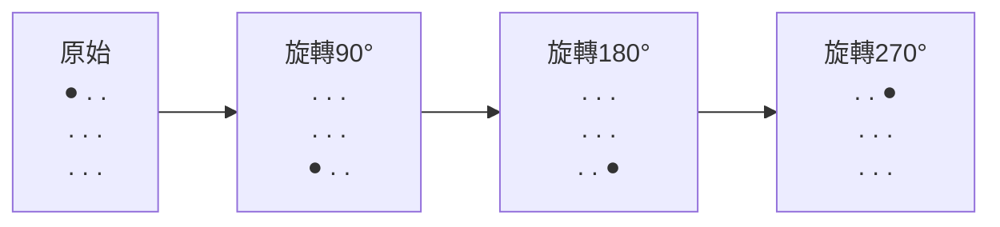

import { EloChart } from '@site/src/components/D3Charts';
import { ArticleSchema, KeyTakeaway, FAQ } from '@site/src/components/SEO';

<ArticleSchema
  title="監督學習階段"
  description="AlphaGo 如何從 3000 萬局人類棋譜中學習，達到 57% 的預測準確率"
  slug="for-engineers/how-it-works/alphago-explained/11-supervised-learning"
  datePublished="2024-01-15"
  dateModified="2024-02-22"
  section="AlphaGo 完整解析"
  keywords={["監督學習", "AlphaGo", "KGS", "交叉熵", "人類棋譜", "深度學習", "圍棋AI", "SGF"]}
  wordCount={4500}
/>

# 監督學習階段

在 AlphaGo 能夠自我對弈之前，它需要先「看」大量的人類棋譜。這個過程稱為**監督學習**。

透過分析 3000 萬個人類棋局局面，AlphaGo 的 Policy Network 達到了 **57% 的預測準確率**——能夠在超過一半的情況下，猜中人類專家的下一步。

這聽起來可能不太驚人，但考慮到每個局面平均有 250 種合法走法，這是一個驚人的成就。

---

## 為什麼從人類棋譜開始？

### 學習的起點

想像你要教一個完全不懂圍棋的人下棋。你會怎麼做？

**方案 A：隨機探索**
```
讓他隨便亂下，慢慢發現什麼是好棋
→ 效率極低，可能永遠學不會
```

**方案 B：看高手怎麼下**
```
讓他看大量職業棋手的對局，模仿他們的下法
→ 有基礎後，再自己探索
```

AlphaGo 選擇了方案 B。監督學習就是「看高手怎麼下」的數學版本。

### 人類棋譜的價值

人類花了幾千年發展圍棋理論。這些知識都被編碼在棋譜中：

- **開局定式**：經過長期驗證的開局下法
- **中盤戰術**：攻防轉換的智慧
- **收官技巧**：目數計算的精髓
- **大局觀**：全局判斷的直覺

監督學習讓 AlphaGo 「繼承」了這些人類智慧，而不需要從零開始摸索。

---

## 訓練資料來源

### KGS Go Server

AlphaGo 的訓練資料主要來自 **KGS Go Server**（也稱為 Kiseido Go Server），這是一個知名的線上圍棋平台。

#### KGS 的特點

| 特性 | 說明 |
|------|------|
| 用戶 | 業餘棋手為主，也有職業棋手 |
| 棋力範圍 | 從入門到職業九段 |
| 對局記錄 | 保存完整的 SGF 棋譜 |
| 活躍時期 | 2000 年至今 |

#### 為什麼選擇 KGS？

1. **資料量大**：數百萬盤棋譜
2. **格式統一**：SGF 格式易於解析
3. **有棋力標籤**：每位用戶有等級分
4. **多樣性**：不同風格的棋手

### 3000 萬局面

從 KGS 的棋譜中，DeepMind 提取了約 **3000 萬個局面**：

```
原始資料:
- 約 16 萬盤棋譜
- 每盤約 200 手
- 共 ~3200 萬局面

資料篩選:
- 過濾低段位對局
- 過濾中途認輸的局面
- 最終約 3000 萬個高質量局面
```

### 資料格式

每個訓練樣本包含：

```python
{
    "board_state": [[0, 1, 2, ...], ...],  # 19×19 棋盤
    "features": [...],                      # 48 個特徵平面
    "next_move": 123,                       # 人類下的位置 (0-360)
    "game_result": 1,                       # 1=黑勝, -1=白勝
    "player_rank": "5d",                    # 下這步棋的人的段位
}
```

---

## 資料預處理

### SGF 解析

SGF（Smart Game Format）是圍棋棋譜的標準格式：

```
(;GM[1]FF[4]CA[UTF-8]AP[CGoban:3]ST[2]
RU[Japanese]SZ[19]KM[6.50]
PW[White]PB[Black]
;B[pd];W[dd];B[pq];W[dp];B[qk];W[nc]...
)
```

需要解析出：
- 棋盤大小（SZ[19]）
- 每一手棋（B[pd], W[dd]...）
- 對局結果（RE[B+2.5]）

```python
def parse_sgf(sgf_string):
    """解析 SGF 棋譜"""
    moves = []
    # 提取所有棋步
    pattern = r';([BW])\[([a-s]{2})\]'
    for match in re.finditer(pattern, sgf_string):
        color = match.group(1)  # 'B' or 'W'
        coord = match.group(2)  # 'pd', 'dd', etc.

        # 轉換座標
        x = ord(coord[0]) - ord('a')
        y = ord(coord[1]) - ord('a')

        moves.append((color, x, y))

    return moves
```

### 特徵提取

對每個局面，提取 48 個特徵平面（詳見 [輸入特徵設計](../input-features)）：

```python
def extract_features(board, history, current_player):
    """提取 48 個特徵平面"""
    features = np.zeros((48, 19, 19))

    # 棋子位置
    features[0] = (board == 1)  # 黑子
    features[1] = (board == 2)  # 白子
    features[2] = (board == 0)  # 空點

    # 歷史記錄
    for i, hist in enumerate(history[:8]):
        features[3+i] = (hist == 1)
        features[11+i] = (hist == 2)

    # 氣數、叫吃、征子等...
    # (詳細實現省略)

    return features
```

### 資料增強

圍棋棋盤有 **8 重對稱性**（4 個旋轉 × 2 個鏡像）。每個原始樣本可以變成 8 個：



各自再水平翻轉，得到 8 個等價的訓練樣本

這讓有效訓練資料增加 8 倍，同時確保模型學到的模式不依賴特定方向。

```python
def augment(state, action):
    """8 重對稱性增強"""
    augmented = []

    for rotation in [0, 1, 2, 3]:  # 0, 90, 180, 270 度
        rotated_state = np.rot90(state, rotation, axes=(1, 2))
        rotated_action = rotate_action(action, rotation)
        augmented.append((rotated_state, rotated_action))

        # 水平翻轉
        flipped_state = np.flip(rotated_state, axis=2)
        flipped_action = flip_action(rotated_action)
        augmented.append((flipped_state, flipped_action))

    return augmented
```

---

## 損失函數

### 交叉熵損失

監督學習使用**交叉熵損失（Cross-Entropy Loss）**來訓練 Policy Network：

```
L(θ) = -Σ log p_θ(a | s)
```

其中：
- `s`：棋盤狀態
- `a`：人類實際下的位置（標籤）
- `p_θ(a | s)`：模型預測該位置的機率

### 直覺理解

交叉熵損失衡量「模型預測與標籤的差距」：

| 場景 | 模型預測 | 損失 | 說明 |
|------|---------|------|------|
| 完美預測 | a 的機率 = 1.0 | 0 | 最好 |
| 有信心但正確 | a 的機率 = 0.9 | 0.1 | 很好 |
| 不確定但正確 | a 的機率 = 0.5 | 0.7 | 還可以 |
| 錯誤預測 | a 的機率 = 0.1 | 2.3 | 很差 |
| 完全錯誤 | a 的機率 = 0.01 | 4.6 | 最差 |

損失函數驅動模型提高正確位置的機率。

### 與 MSE 的比較

為什麼不用均方誤差（MSE）？

```python
# MSE：
loss_mse = (prediction - target)^2

# Cross-Entropy：
loss_ce = -log(prediction[target])
```

| 特性 | MSE | Cross-Entropy |
|------|-----|---------------|
| 目標類型 | 回歸（連續值） | 分類（機率分布） |
| 梯度行為 | 錯誤越大，梯度越大 | 自信錯誤時，梯度更大 |
| 適合場景 | Value Network | Policy Network |

Policy Network 輸出的是 361 個類別的機率分布，交叉熵是自然選擇。

---

## 訓練過程

### 硬體配置

DeepMind 使用了大量計算資源：

| 資源 | 數量 |
|------|------|
| GPU | 50 個 |
| 訓練時間 | 約 3 週 |
| 批次大小 | 16 |
| 總訓練步數 | ~340M |

### 優化器

使用**隨機梯度下降（SGD）+ 動量**：

```python
optimizer = torch.optim.SGD(
    model.parameters(),
    lr=0.003,         # 初始學習率
    momentum=0.9,     # 動量係數
    weight_decay=1e-4 # L2 正則化
)
```

#### 為什麼用 SGD 而非 Adam？

在 2016 年，SGD + momentum 仍是圖像任務的主流選擇。實際上，後來的研究（包括 KataGo）發現 Adam 類優化器可能更好。

### 學習率調度

學習率在訓練過程中逐步衰減：

```python
scheduler = torch.optim.lr_scheduler.StepLR(
    optimizer,
    step_size=80_000_000,  # 每 80M 步
    gamma=0.1              # 學習率乘 0.1
)
```

**學習率調度表**

| 訓練步數 | 學習率 |
|:---:|:---:|
| 0 ~ 80M | 0.003 |
| 80M ~ 160M | 0.0003 |
| 160M ~ 240M | 0.00003 |

### 訓練循環

```python
def train_epoch(model, dataloader, optimizer):
    model.train()
    total_loss = 0
    correct = 0
    total = 0

    for batch in dataloader:
        states, actions = batch

        # 前向傳播
        policy = model(states)  # (batch, 361)

        # 計算損失
        loss = F.cross_entropy(policy, actions)

        # 反向傳播
        optimizer.zero_grad()
        loss.backward()
        optimizer.step()

        # 統計
        total_loss += loss.item()
        predictions = policy.argmax(dim=1)
        correct += (predictions == actions).sum().item()
        total += actions.size(0)

    accuracy = correct / total
    avg_loss = total_loss / len(dataloader)

    return avg_loss, accuracy
```

### 訓練曲線

典型的訓練過程：

**準確率隨訓練步數變化**

| 訓練步數 | 準確率 |
|:---:|:---:|
| 0 | ~30% |
| 100M | ~45% |
| 200M | ~53% |
| 300M | ~56% |
| 340M | ~57% |

損失和準確率會快速提升，然後趨於穩定。

---

## 結果分析

### 57% 準確率

經過完整訓練，Policy Network 達到了 **57.0% 的 top-1 準確率**。

#### 什麼是 top-1 準確率？

```
預測: 模型輸出 361 個機率
Top-1: 機率最高的位置
準確率: 這個位置等於人類實際下的位置的比例
```

57% 意味著：模型有超過一半的機會猜中人類專家的下一步。

### 與其他程式的比較

| 程式 | Top-1 準確率 | 說明 |
|------|-------------|------|
| 隨機選擇 | 0.4% | 基線 |
| 傳統特徵 + 線性模型 | ~24% | 2008 年水平 |
| 淺層 CNN | ~44% | 2014 年水平 |
| **AlphaGo Policy Network** | **57%** | 2016 年突破 |
| AlphaGo Zero | ~60% | 2017 年 |

DeepMind 的深層 CNN 比之前最好的方法提升了 13 個百分點。

### 棋力評估

單獨使用 Policy Network（不加搜索）下棋的棋力：

<EloChart mode="training" width={600} height={350} />

| 配置 | Elo 評分 | 大約等級 |
|------|---------|---------|
| 傳統最強（Pachi） | ~2500 | 業餘 4-5 段 |
| SL Policy Network | ~2800 | 業餘 6-7 段 |

純監督學習就已經達到業餘高段水平，這在 2016 年是重大突破。

### 準確率 vs 棋力

有趣的是，準確率和棋力不是線性關係：

```
準確率:  44% → 57%（提升 13%）
Elo:    ~2500 → ~2800（提升 ~300）

準確率提升比例：13% / 44% ≈ 30%
Elo 提升比例：300 / 2500 ≈ 12%
```

準確率的小提升可能帶來顯著的棋力提升，因為：
- 關鍵局面的正確選擇更重要
- 避免明顯錯誤比多下好棋更重要

---

## 監督學習的侷限

### 問題 1：天花板效應

監督學習只能達到「人類水平」，無法超越：

```
SL Policy 的目標：模仿人類
          ↓
如果人類有錯誤的習慣
          ↓
SL Policy 也會學到這些錯誤
```

例如，如果訓練資料中的棋手不常下「第 37 手」那種非傳統的棋，SL Policy 也不會學到。

### 問題 2：無法區分好棋與壞棋

監督學習只看「人類下了什麼」，不管這步棋好不好：

```
局面 A：人類下了 K10（其實是壞棋）
局面 B：人類下了 Q4（好棋）

SL Policy 一視同仁，都要學
```

訓練資料包含業餘棋手的對局，其中有很多錯誤。SL Policy 會學到這些錯誤。

### 問題 3：探索不足

SL Policy 只學習人類已知的走法：

```
人類走法集合: {A, B, C, D, E}
           ↓
SL Policy 只會在這些走法中選擇
           ↓
可能存在更好的走法 F，但從未被發現
```

這是監督學習的根本限制：它只能學習訓練資料中有的東西。

### 解決方案：強化學習

為了超越人類，AlphaGo 在監督學習後進行**強化學習**：

```
SL Policy (人類水平)
      ↓ 自我對弈
RL Policy (超越人類)
```

詳見 [強化學習入門](../reinforcement-intro) 和 [自我對弈](../self-play)。

---

## 實作要點

### 完整訓練代碼

```python
import torch
import torch.nn as nn
import torch.optim as optim
from torch.utils.data import DataLoader, Dataset

class GoDataset(Dataset):
    def __init__(self, data_path):
        # 載入預處理的資料
        self.states = np.load(f"{data_path}/states.npy")
        self.actions = np.load(f"{data_path}/actions.npy")

    def __len__(self):
        return len(self.states)

    def __getitem__(self, idx):
        state = torch.FloatTensor(self.states[idx])
        action = torch.LongTensor([self.actions[idx]])[0]
        return state, action

def train_policy_network():
    # 模型
    model = PolicyNetwork(input_channels=48, num_filters=192, num_layers=12)
    model = model.cuda()

    # 資料
    dataset = GoDataset("data/kgs")
    dataloader = DataLoader(
        dataset, batch_size=16, shuffle=True, num_workers=4
    )

    # 優化器
    optimizer = optim.SGD(
        model.parameters(),
        lr=0.003,
        momentum=0.9,
        weight_decay=1e-4
    )
    scheduler = optim.lr_scheduler.StepLR(optimizer, step_size=80_000_000, gamma=0.1)

    # 訓練循環
    best_accuracy = 0

    for epoch in range(100):
        model.train()
        total_loss = 0
        correct = 0
        total = 0

        for states, actions in dataloader:
            states = states.cuda()
            actions = actions.cuda()

            # 前向傳播
            policy = model(states)
            loss = nn.functional.cross_entropy(policy, actions)

            # 反向傳播
            optimizer.zero_grad()
            loss.backward()
            optimizer.step()
            scheduler.step()

            # 統計
            total_loss += loss.item()
            predictions = policy.argmax(dim=1)
            correct += (predictions == actions).sum().item()
            total += actions.size(0)

        accuracy = correct / total
        print(f"Epoch {epoch}: Loss={total_loss/len(dataloader):.4f}, Acc={accuracy:.4f}")

        # 保存最佳模型
        if accuracy > best_accuracy:
            best_accuracy = accuracy
            torch.save(model.state_dict(), "best_policy.pth")

    print(f"Best accuracy: {best_accuracy:.4f}")
```

### 評估代碼

```python
def evaluate_policy(model, test_dataloader):
    model.eval()

    correct_top1 = 0
    correct_top5 = 0
    total = 0

    with torch.no_grad():
        for states, actions in test_dataloader:
            states = states.cuda()
            actions = actions.cuda()

            policy = model(states)

            # Top-1 準確率
            top1_pred = policy.argmax(dim=1)
            correct_top1 += (top1_pred == actions).sum().item()

            # Top-5 準確率
            top5_pred = policy.topk(5, dim=1)[1]
            for i, action in enumerate(actions):
                if action in top5_pred[i]:
                    correct_top5 += 1

            total += actions.size(0)

    print(f"Top-1 Accuracy: {correct_top1/total:.4f}")
    print(f"Top-5 Accuracy: {correct_top5/total:.4f}")
```

### 常見問題與解決

| 問題 | 症狀 | 解決方案 |
|------|------|---------|
| 過擬合 | 訓練準確率高，測試準確率低 | 增加資料增強、Dropout |
| 訓練不穩定 | 損失劇烈波動 | 降低學習率、增加批次大小 |
| 收斂過慢 | 準確率停滯不前 | 調整學習率、檢查資料 |
| 記憶體不足 | OOM 錯誤 | 減小批次大小、使用混合精度 |

---

## 動畫對應

本文涉及的核心概念與動畫編號：

| 編號 | 概念 | 物理/數學對應 |
|------|------|--------------|
| 🎬 D3 | 監督學習 | 極大似然估計 |
| 🎬 D5 | 交叉熵損失 | KL 散度 |
| 🎬 D6 | 梯度下降 | 最佳化 |
| 🎬 A6 | 資料預處理 | 標準化 |

---

## 延伸閱讀

- **上一篇**：[CNN 與圍棋的結合](../cnn-and-go) — 卷積神經網路如何處理棋盤
- **下一篇**：[強化學習入門](../reinforcement-intro) — 超越人類的關鍵
- **相關主題**：[Policy Network 詳解](../policy-network) — 網路架構的細節

---

## 關鍵要點

1. **KGS 棋譜是訓練資料來源**：約 3000 萬個高質量局面
2. **交叉熵損失驅動學習**：讓模型提高正確位置的機率
3. **57% 準確率是重大突破**：超越之前最好的方法 13 個百分點
4. **8 重對稱性增強**：有效增加訓練資料
5. **監督學習有天花板**：無法超越訓練資料的水平

監督學習是 AlphaGo 的「起點」——它繼承了人類幾千年的圍棋智慧，為後續的強化學習打下基礎。

---

## 參考資料

1. Silver, D., et al. (2016). "Mastering the game of Go with deep neural networks and tree search." *Nature*, 529, 484-489.
2. Maddison, C. J., et al. (2014). "Move Evaluation in Go Using Deep Convolutional Neural Networks." *arXiv:1412.6564*.
3. Clark, C., & Storkey, A. (2015). "Training Deep Convolutional Neural Networks to Play Go." *ICML*.
4. KGS Game Archives: [https://www.gokgs.com/archives.jsp](https://www.gokgs.com/archives.jsp)

---

<KeyTakeaway>
本文重點：
- 監督學習從 KGS 約 3000 萬局面中學習，達到 57% 預測準確率，超越之前最好方法 13 個百分點
- 使用交叉熵損失函數和 8 重對稱性資料增強，有效提升訓練效果
- 監督學習為強化學習奠定基礎，但有天花板限制，無法超越訓練資料的水平
</KeyTakeaway>

<FAQ items={[
  { question: "57% 的預測準確率有多厲害？", answer: "考慮到圍棋每個局面平均有 250 種合法走法，隨機猜測只有 0.4% 準確率。57% 代表模型能在超過一半的情況下猜中人類專家的選擇，是 2016 年的重大突破。" },
  { question: "為什麼要用 KGS 棋譜而非職業棋譜？", answer: "KGS 提供大量統一格式的 SGF 棋譜、明確的棋力標籤和多樣化的下棋風格。雖然包含業餘棋手對局，但資料量和格式統一性使其成為理想的訓練資料來源。" },
  { question: "監督學習的主要限制是什麼？", answer: "監督學習只能模仿訓練資料，無法超越人類水平。它會學到人類的錯誤習慣，且無法發現訓練資料中不存在的好棋。這就是為什麼需要後續的強化學習。" }
]} />
