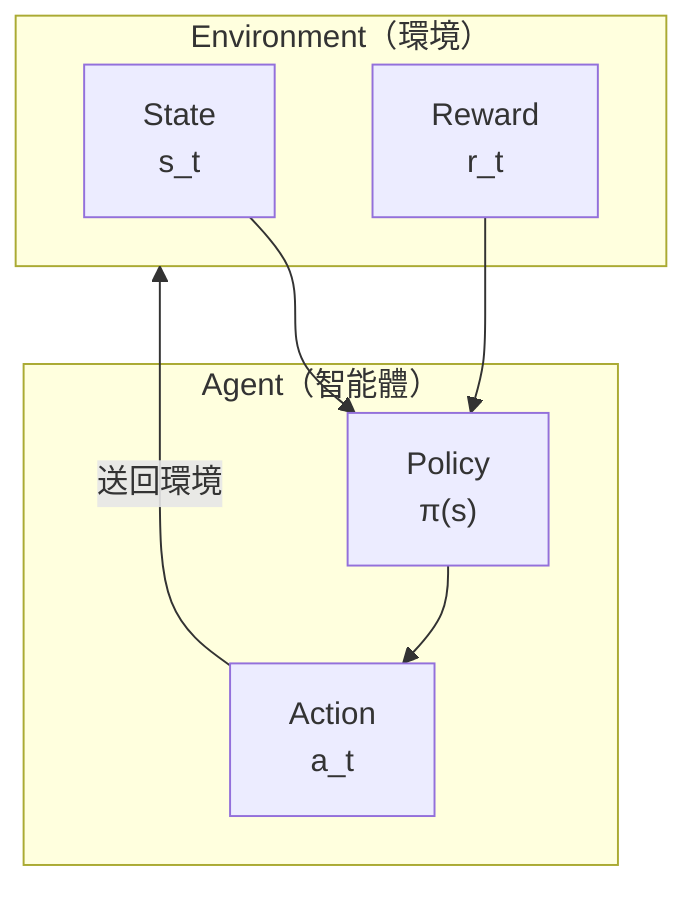

import { ArticleSchema, KeyTakeaway, FAQ } from '@site/src/components/SEO';

<ArticleSchema
  title="強化學習入門"
  description="深入理解強化學習的核心概念：Agent、Environment、Reward、MDP、策略梯度與價值函數"
  slug="for-engineers/how-it-works/alphago-explained/12-reinforcement-intro"
  datePublished="2024-01-15"
  dateModified="2024-02-22"
  section="AlphaGo 完整解析"
  keywords={["強化學習", "MDP", "策略梯度", "REINFORCE", "價值函數", "AlphaGo", "深度學習", "圍棋AI"]}
  wordCount={5000}
/>

# 強化學習入門

在前面的文章中，我們介紹了 AlphaGo 如何使用監督學習從人類棋譜中學習。但監督學習有一個根本性的限制：**它只能模仿人類，無法超越人類**。

要讓 AI 超越人類，我們需要一種不同的學習方法——**強化學習（Reinforcement Learning, RL）**。

這篇文章將帶你從零開始理解強化學習的核心概念，為後續的自我對弈和 MCTS 整合打下基礎。

---

## 什麼是強化學習？

### 與其他學習方法的比較

機器學習主要有三種範式：

| 範式 | 學習方式 | 例子 |
|------|---------|------|
| **監督學習** | 從標記資料學習 | 圖片分類、下一步預測 |
| **非監督學習** | 從未標記資料發現結構 | 聚類、降維 |
| **強化學習** | 從互動經驗中學習 | 下棋、玩遊戲、機器人控制 |

強化學習的獨特之處在於：**沒有人告訴你正確答案是什麼，你必須透過嘗試和錯誤自己發現**。

### 一個直觀的例子

想像你在教一隻小狗學習新把戲：

1. 狗做了某個動作（可能是隨機的）
2. 如果動作正確，你給牠零食（正面獎勵）
3. 如果動作錯誤，你不給零食或輕聲說「不對」（負面或零獎勵）
4. 經過多次嘗試，狗學會了哪些動作會帶來獎勵

這就是強化學習的本質：**透過獎勵信號學習如何行動**。

### 強化學習在圍棋中的應用

在圍棋中：
- 每一手棋都是一個「動作」
- 對局結束時，勝負就是「獎勵」
- AI 需要學習：哪些下法最終會導致勝利？

但這裡有一個巨大的挑戰：**獎勵延遲**。一盤棋可能下 200 手以上，但只有最後才知道勝負。在第 50 手時下的一步棋，如何知道它對最終結果有多少貢獻？

這就是強化學習最核心的問題之一，我們稱之為**信用分配問題（Credit Assignment Problem）**。

---

## 核心概念

### Agent（智能體）與 Environment（環境）

強化學習的基本架構包含兩個主角：



**Agent（智能體）**：
- 做出決策的主體
- 在圍棋中，就是下棋的 AI
- 擁有一個「策略」(Policy)，決定在什麼狀態下採取什麼動作

**Environment（環境）**：
- Agent 互動的對象
- 在圍棋中，就是棋盤 + 對手
- 接收 Agent 的動作，返回新的狀態和獎勵

### State（狀態）

**狀態 s** 是對環境的完整描述。在圍棋中：
- 狀態包含：當前棋盤局面、輪到誰下、打劫狀態等
- 狀態空間極其龐大：約 $10^{170}$ 種可能的狀態

狀態必須具備**馬可夫性質**：未來只取決於當前狀態，與歷史無關。

### Action（動作）

**動作 a** 是 Agent 可以採取的行為。在圍棋中：
- 每個空點都是一個可能的動作
- 加上「虛手」（pass），共有 $19 \times 19 + 1 = 362$ 種動作
- 但實際上很多位置是非法的（如自殺、打劫）

### Reward（獎勵）

**獎勵 r** 是環境對動作的反饋。在圍棋中：
- 勝利：$+1$
- 失敗：$-1$
- 對局中：$0$（這是最具挑戰性的地方！）

獎勵信號的稀疏性是圍棋強化學習的主要困難之一。

### Policy（策略）

**策略 π** 是 Agent 的行為準則，告訴它在每個狀態下應該怎麼做。

策略可以是：
- **確定性策略**：$a = \pi(s)$，每個狀態對應唯一的動作
- **隨機性策略**：$a \sim \pi(a|s)$，給出動作的機率分佈

在 AlphaGo 中，Policy Network 就是一個隨機性策略，輸出每個位置的落子機率。

---

## 馬可夫決策過程（MDP）

### MDP 的定義

**馬可夫決策過程（Markov Decision Process, MDP）** 是強化學習的數學框架。

一個 MDP 由五元組 $(S, A, P, R, \gamma)$ 定義：

| 符號 | 意義 | 圍棋中的對應 |
|------|------|-------------|
| $S$ | 狀態空間 | 所有可能的棋盤局面 |
| $A$ | 動作空間 | 所有合法的落子位置 |
| $P(s'|s,a)$ | 轉移機率 | 下一手後的局面變化 |
| $R(s,a,s')$ | 獎勵函數 | 勝負結果 |
| $\gamma$ | 折扣因子 | 未來獎勵的重要性 |

### 馬可夫性質

MDP 的核心假設是**馬可夫性質（Markov Property）**：

$$P(s_{t+1}|s_t, a_t, s_{t-1}, a_{t-1}, \ldots, s_0) = P(s_{t+1}|s_t, a_t)$$

用白話說：**未來只取決於現在，與過去無關**。

圍棋符合這個性質嗎？

表面上看，是的——只要知道當前棋盤狀態，就知道所有合法走法。但實際上，圍棋有**打劫規則**，需要記住前一步的狀態。AlphaGo 透過將前 8 步的棋盤編碼進輸入特徵來處理這個問題。

### 圍棋是確定性 MDP

圍棋有一個特殊的性質：**轉移是確定性的**。

在棋類遊戲中，當你下一手棋，棋盤狀態的變化是完全確定的（不像骰子遊戲有隨機性）。所以：

$$P(s'|s,a) = \begin{cases} 1 & \text{如果 } s' \text{ 是執行 } a \text{ 後的狀態} \\ 0 & \text{否則} \end{cases}$$

但別忘了，圍棋是**雙人遊戲**，對手的下法會帶來「不確定性」。這讓問題變成了**對抗性 MDP**。

### 獎勵設計

獎勵函數的設計對強化學習至關重要。在圍棋中，最自然的設計是：

$$R(s_T) = \begin{cases} +1 & \text{如果 AI 獲勝} \\ -1 & \text{如果 AI 失敗} \end{cases}$$

其中 $T$ 是對局結束的時間步。

這種**稀疏獎勵**帶來了巨大的挑戰：
- 一盤棋可能有 200-300 步
- 只有最後一步才知道勝負
- 如何判斷中間某一步的好壞？

有些研究嘗試設計**密集獎勵**，例如：
- 吃子獎勵
- 領地估計獎勵
- 形勢判斷獎勵

但 AlphaGo 的成功表明：**即使只用終局勝負作為獎勵，透過足夠的自我對弈，AI 也能學會精妙的中盤戰術**。

---

## 價值函數

### 為什麼需要價值函數？

強化學習的目標是最大化**累積獎勵**。但獎勵是延遲的，我們需要一種方法來評估「現在的狀態有多好」。

這就是**價值函數（Value Function）** 的作用。

### 狀態價值函數 V(s)

**狀態價值函數** $V^\pi(s)$ 定義為：從狀態 $s$ 開始，遵循策略 $\pi$，預期能獲得的累積獎勵。

$$V^\pi(s) = \mathbb{E}_\pi \left[ \sum_{t=0}^{\infty} \gamma^t r_{t+1} \mid s_0 = s \right]$$

其中：
- $\mathbb{E}_\pi$ 表示在策略 $\pi$ 下的期望值
- $\gamma \in [0, 1]$ 是**折扣因子**，讓近期獎勵比遠期獎勵更重要
- $r_{t+1}$ 是時間步 $t+1$ 獲得的獎勵

在圍棋中，$V(s)$ 可以解讀為：**從當前局面開始，AI 獲勝的機率**。AlphaGo 的 Value Network 就是學習這個函數。

### 動作價值函數 Q(s,a)

**動作價值函數** $Q^\pi(s,a)$ 更進一步，評估在狀態 $s$ 下採取動作 $a$ 的價值：

$$Q^\pi(s,a) = \mathbb{E}_\pi \left[ \sum_{t=0}^{\infty} \gamma^t r_{t+1} \mid s_0 = s, a_0 = a \right]$$

$Q(s,a)$ 可以解讀為：**在當前局面下這步棋，最終獲勝的機率**。

### V 與 Q 的關係

這兩個函數有緊密的關係：

$$V^\pi(s) = \sum_a \pi(a|s) Q^\pi(s,a)$$

也就是說，狀態價值 = 所有可能動作的加權平均，權重由策略決定。

如果我們知道最佳策略 $\pi^*$：

$$V^*(s) = \max_a Q^*(s,a)$$

最佳狀態價值 = 最佳動作的 Q 值。

### 貝爾曼方程

價值函數滿足一個優美的遞迴關係——**貝爾曼方程（Bellman Equation）**：

$$V^\pi(s) = \sum_a \pi(a|s) \sum_{s'} P(s'|s,a) \left[ R(s,a,s') + \gamma V^\pi(s') \right]$$

用白話說：**當前狀態的價值 = 即時獎勵 + 折扣後的下一狀態價值**。

這個方程是動態規劃和許多強化學習演算法的理論基礎。

### AlphaGo 的 Value Network

在 AlphaGo 中，Value Network 學習的是 $V(s)$——評估當前局面的勝率。

```
輸入：棋盤狀態 s（19×19×17 的特徵張量）
輸出：勝率估計 V(s) ∈ [-1, 1]（使用 tanh 激活）
```

Value Network 的訓練目標是預測最終結果：

$$L = \mathbb{E} \left[ (V_\theta(s) - z)^2 \right]$$

其中 $z \in \{-1, +1\}$ 是對局的實際結果。

---

## 策略梯度方法

### 從價值到策略

傳統的強化學習方法（如 Q-Learning）是「基於價值」的：先學習價值函數，再從中導出策略。

但在圍棋這樣動作空間巨大的問題中，直接學習策略可能更有效。這就是**策略梯度（Policy Gradient）** 方法的思路。

### 策略的參數化

我們用神經網路來表示策略：

$$\pi_\theta(a|s)$$

其中 $\theta$ 是網路參數。網路輸入狀態 $s$，輸出每個動作的機率。

在 AlphaGo 中，這就是 Policy Network：
- 輸入：棋盤狀態
- 輸出：361 個位置的落子機率（加上 pass）

### 策略梯度定理

我們想找到最佳參數 $\theta^*$，使得期望累積獎勵最大化：

$$J(\theta) = \mathbb{E}_{\pi_\theta} \left[ \sum_t r_t \right]$$

**策略梯度定理**告訴我們如何計算 $J$ 對 $\theta$ 的梯度：

$$\nabla_\theta J(\theta) = \mathbb{E}_{\pi_\theta} \left[ \sum_t \nabla_\theta \log \pi_\theta(a_t|s_t) \cdot G_t \right]$$

其中 $G_t = \sum_{k=t}^{T} \gamma^{k-t} r_k$ 是從時間 $t$ 開始的累積獎勵。

### 直觀理解

這個公式可以這樣理解：

1. **$\nabla_\theta \log \pi_\theta(a_t|s_t)$**：如何調整參數讓動作 $a_t$ 的機率增加
2. **$G_t$**：這個動作帶來的總回報

所以：
- 如果 $G_t > 0$（好的結果），增加這個動作的機率
- 如果 $G_t < 0$（壞的結果），減少這個動作的機率

這就是**信用分配**的一種解決方案！

### REINFORCE 演算法

**REINFORCE** 是最簡單的策略梯度演算法：

```
演算法：REINFORCE

1. 初始化策略網路參數 θ

2. 重複：
   a. 用當前策略 π_θ 完成一局對弈，收集軌跡：
      τ = (s_0, a_0, r_1, s_1, a_1, r_2, ..., s_T)

   b. 計算每步的累積回報：
      G_t = r_{t+1} + γ·r_{t+2} + γ²·r_{t+3} + ...

   c. 計算策略梯度：
      ∇J = (1/T) Σ_t ∇_θ log π_θ(a_t|s_t) · G_t

   d. 更新參數：
      θ ← θ + α · ∇J
```

在圍棋中，這意味著：
1. 讓 AI 自己下一盤棋
2. 如果最終獲勝（$G = +1$），增加所有下過的棋的機率
3. 如果最終失敗（$G = -1$），減少所有下過的棋的機率
4. 重複這個過程數百萬次

### 基準線（Baseline）

REINFORCE 的一個問題是**方差很大**。想像一盤贏的棋，裡面可能也有一些不好的棋，但它們的機率都會被增加。

解決方案是引入**基準線（baseline）**：

$$\nabla_\theta J = \mathbb{E} \left[ \sum_t \nabla_\theta \log \pi_\theta(a_t|s_t) \cdot (G_t - b(s_t)) \right]$$

常見的選擇是讓 $b(s_t) = V(s_t)$，這就是**優勢函數（Advantage Function）**：

$$A(s_t, a_t) = G_t - V(s_t)$$

優勢函數衡量：「這個動作比平均好多少？」

- $A > 0$：這個動作比預期好，增加其機率
- $A < 0$：這個動作比預期差，減少其機率

AlphaGo 使用 Value Network 來計算基準線，這就是為什麼需要同時訓練 Policy Network 和 Value Network。

---

## 探索與利用

### 困境

強化學習面臨一個經典的兩難：**探索與利用（Exploration vs. Exploitation）**。

- **利用（Exploitation）**：根據目前所知，選擇看起來最好的動作
- **探索（Exploration）**：嘗試不確定的動作，可能發現更好的策略

純粹的利用會陷入局部最優；純粹的探索則浪費時間在明顯的壞棋上。

### 圍棋中的挑戰

在圍棋中，這個問題特別嚴重：

1. **動作空間巨大**：361 種可能的落子
2. **獎勵稀疏**：只有終局才知道好壞
3. **長期影響**：一步棋的影響可能要幾十手後才顯現

### ε-Greedy 策略

最簡單的探索方法：

$$\pi(a|s) = \begin{cases} 1 - \varepsilon + \frac{\varepsilon}{|A|} & \text{如果 } a = \arg\max Q(s,a) \\ \frac{\varepsilon}{|A|} & \text{否則} \end{cases}$$

以 $1-\varepsilon$ 的機率選擇最佳動作，以 $\varepsilon$ 的機率隨機選擇。

但這對圍棋來說太粗糙了——隨機選一個位置下棋，大多數時候都是壞棋。

### Softmax 探索

更好的方法是使用 **softmax 分佈**：

$$\pi(a|s) = \frac{\exp(Q(s,a)/\tau)}{\sum_{a'} \exp(Q(s,a')/\tau)}$$

其中 $\tau$ 是**溫度參數**：
- $\tau \to 0$：接近貪婪策略（純利用）
- $\tau \to \infty$：接近均勻隨機（純探索）
- $\tau = 1$：平衡探索與利用

AlphaGo 在自我對弈訓練中使用類似的技術來增加多樣性。

### UCB 與 PUCT

在 MCTS 中，探索與利用由 **UCB（Upper Confidence Bound）** 公式處理。AlphaGo 使用的是其變體 **PUCT**：

$$\text{score}(s,a) = Q(s,a) + c_{\text{puct}} \cdot P(s,a) \cdot \frac{\sqrt{N(s)}}{1 + N(s,a)}$$

這個公式在 [PUCT 公式詳解](../puct-formula) 中會詳細解釋。

### 本質探索（Intrinsic Exploration）

AlphaGo 還有一種隱式的探索機制：**自我對弈本身就是探索**。

由於神經網路輸出的是機率分佈而非確定性動作，每次自我對弈都會產生不同的棋局。這自然帶來了：

- **戰術多樣性**：同樣的局面可能嘗試不同的下法
- **風格演化**：隨著訓練，AI 可能「發現」人類從未嘗試過的定式
- **自我修正**：如果某種下法總是輸，機率會逐漸降低

---

## 圍棋強化學習的特殊性

### 與其他領域的比較

圍棋強化學習有一些獨特的特性：

| 特性 | 圍棋 | 機器人控制 | 電子遊戲 |
|------|------|-----------|----------|
| 狀態空間 | 離散、極大 | 連續 | 離散、中等 |
| 動作空間 | 離散、大 | 連續 | 離散、小 |
| 轉移 | 確定性 | 隨機 | 確定性或隨機 |
| 獎勵 | 極稀疏 | 可設計 | 中等密集 |
| 環境模型 | 已知（規則） | 未知 | 部分已知 |
| 對抗性 | 完美資訊博弈 | 通常無 | 可能有 |

### 確定性轉移

圍棋的規則是完全已知的。當你下一手棋，下一個狀態是確定的。這意味著：

- **可以精確模擬**：不需要學習環境模型
- **可以完美回溯**：MCTS 可以精確搜索
- **無需處理環境隨機性**：簡化了很多問題

### 完美資訊

圍棋是**完美資訊博弈**——雙方都能看到完整的棋盤。這與撲克（隱藏資訊）不同，讓問題在某些方面更簡單：

- 不需要處理對手的隱藏資訊
- 可以使用 Minimax 框架
- 狀態表示更直接

### 自對弈的可能

因為規則已知且確定，AI 可以**與自己對弈**而不需要真實對手。這帶來了：

- **無限的訓練資料**：隨時可以產生新的對局
- **穩定的對手水平**：對手就是自己，水平相當
- **漸進式提升**：隨著自己變強，對手也變強

這正是 AlphaGo 成功的關鍵，我們將在下一篇 [自我對弈](../self-play) 中詳細討論。

### 長期信用分配

圍棋的獎勵極其稀疏（只有終局勝負），而一局棋可能有 200-300 步。這帶來了嚴峻的**信用分配問題**：

第 50 手的一步好棋，到第 250 手獲勝時，如何正確分配功勞？

AlphaGo 的解決方案是結合多種技術：
1. **Value Network**：評估中間局面的勝率，提供即時反饋
2. **MCTS**：搜索驗證每步棋的好壞
3. **大量對弈**：透過統計學習信用分配

### 對稱性

圍棋棋盤有 8 重對稱性（4 個旋轉 × 2 個映射）。AlphaGo 利用這一點進行**資料增強**：

- 每個訓練局面可以產生 8 個變體
- 大幅增加有效訓練資料
- 確保網路學習到對稱性不變的特徵

---

## 演算法比較

### 價值基礎 vs 策略基礎

| 方法 | 優點 | 缺點 | 適合場景 |
|------|------|------|---------|
| **價值基礎** (Q-Learning) | 樣本效率高 | 大動作空間難處理 | 動作空間小 |
| **策略基礎** (REINFORCE) | 能處理大動作空間 | 方差大、樣本效率低 | 動作空間大 |
| **Actor-Critic** | 平衡兩者 | 需要同時訓練兩個網路 | 一般性強 |

### AlphaGo 的選擇

AlphaGo 使用的是 **Actor-Critic** 架構的變體：

- **Policy Network**（Actor）：直接輸出動作機率
- **Value Network**（Critic）：評估狀態價值

但它沒有使用傳統的 Actor-Critic 更新方式，而是：

1. **監督學習**：先從人類棋譜學習初始 Policy Network
2. **策略梯度**：透過自我對弈強化 Policy Network
3. **回歸學習**：用自我對弈資料訓練 Value Network
4. **MCTS 整合**：在實際對弈中結合兩個網路

這種混合方法結合了多種技術的優點，是 AlphaGo 成功的關鍵之一。

---

## 實作考量

### 訓練穩定性

策略梯度方法有時會不穩定。常見的技術包括：

**梯度裁剪（Gradient Clipping）**：
```python
# 限制梯度的範數
max_grad_norm = 0.5
torch.nn.utils.clip_grad_norm_(policy_net.parameters(), max_grad_norm)
```

**學習率衰減**：
```python
# 隨著訓練進行降低學習率
scheduler = torch.optim.lr_scheduler.StepLR(optimizer, step_size=100, gamma=0.9)
```

**PPO/TRPO 等進階演算法**：
限制每次更新的策略變化，防止災難性遺忘。

### 記憶體管理

圍棋對局很長，需要存儲大量軌跡。常見策略：

**經驗回放（Experience Replay）**：
```python
# 儲存過去的經驗
replay_buffer = ReplayBuffer(max_size=1000000)

# 隨機抽樣訓練
batch = replay_buffer.sample(batch_size=256)
```

**優先經驗回放**：
優先重播那些「意外」的經驗（TD 誤差大的）。

### 並行化

強化學習可以高度並行化：

- **多線程對弈**：同時進行多局對弈
- **分散式訓練**：多台機器同時訓練
- **非同步更新**：A3C 等演算法

AlphaGo 的訓練使用了數百個 GPU 和 TPU，同時進行數千局自我對弈。

---

## 動畫對應

本文涉及的核心概念與動畫編號：

| 編號 | 概念 | 物理/數學對應 |
|------|------|--------------|
| 🎬 H1 | Agent-Environment 互動 | 馬可夫鏈 |
| 🎬 H4 | 策略梯度 | 隨機優化 |
| 🎬 H6 | 探索與利用 | 多臂賭博機 |

---

## 總結

強化學習是 AlphaGo 超越人類的關鍵技術。我們學習了：

1. **基本框架**：Agent、Environment、State、Action、Reward
2. **MDP**：馬可夫決策過程，強化學習的數學基礎
3. **價值函數**：$V(s)$ 和 $Q(s,a)$，評估狀態和動作的好壞
4. **策略梯度**：直接優化策略的方法，REINFORCE 演算法
5. **探索與利用**：學習過程中的核心權衡
6. **圍棋特性**：確定性、完美資訊、稀疏獎勵的挑戰與機遇

下一篇，我們將深入探討 AlphaGo 如何利用**自我對弈**來實現超越人類的棋力。

---

## 延伸閱讀

- **下一篇**：[自我對弈](../self-play) — 為什麼 AI 能透過與自己下棋變強
- **相關**：[Value Network 詳解](../value-network) — 價值函數的神經網路實現
- **進階**：[PUCT 公式詳解](../puct-formula) — 探索與利用的數學公式

---

## 參考資料

1. Sutton, R. S., & Barto, A. G. (2018). *Reinforcement Learning: An Introduction* (2nd ed.). MIT Press.
2. Silver, D. (2015). ["Lectures on Reinforcement Learning"](https://www.davidsilver.uk/teaching/). University College London.
3. Schulman, J., et al. (2017). "Proximal Policy Optimization Algorithms." *arXiv preprint*.
4. Williams, R. J. (1992). "Simple statistical gradient-following algorithms for connectionist reinforcement learning." *Machine Learning*, 8(3-4), 229-256.
5. Silver, D., et al. (2016). "Mastering the game of Go with deep neural networks and tree search." *Nature*, 529, 484-489.

---

<KeyTakeaway>
本文重點：
- 強化學習透過獎勵信號學習，解決監督學習無法超越人類的根本限制
- MDP 框架定義了狀態、動作、獎勵和轉移機率，是圍棋 AI 的數學基礎
- 策略梯度方法直接優化策略，配合 Value Network 作為基準線減少方差
</KeyTakeaway>

<FAQ items={[
  { question: "強化學習和監督學習的主要區別是什麼？", answer: "監督學習從標記資料學習正確答案，強化學習則透過嘗試和錯誤自己發現好的策略。在圍棋中，監督學習模仿人類下法，強化學習則追求獲勝，可以發現超越人類的策略。" },
  { question: "什麼是信用分配問題？", answer: "圍棋一盤棋可能有 200 步，但只有終局才知道勝負。第 50 手下的棋對最終結果有多少貢獻？這就是信用分配問題，策略梯度和 Value Network 是主要解決方案。" },
  { question: "為什麼 AlphaGo 使用 Actor-Critic 架構？", answer: "Policy Network（Actor）直接輸出動作機率，處理圍棋的大動作空間；Value Network（Critic）評估狀態價值，提供基準線減少策略梯度的方差。兩者結合兼具效率和穩定性。" }
]} />
