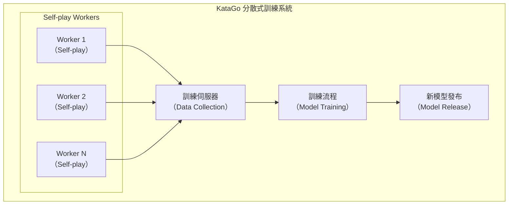

# 分散式訓練架構

本文介紹 KataGo 的分散式訓練系統架構，說明如何透過全球社群的算力持續改進模型。

---

## 系統架構總覽



---

## Self-play Worker

### 工作流程

每個 Worker 執行以下循環：

```python
def self_play_worker():
    while True:
        # 1. 下載最新模型
        model = download_latest_model()

        # 2. 執行自我對弈
        games = []
        for _ in range(batch_size):
            game = play_game(model)
            games.append(game)

        # 3. 上傳對局資料
        upload_games(games)

        # 4. 檢查新模型
        if new_model_available():
            model = download_latest_model()
```

### 對局產生

```python
def play_game(model):
    """執行一局自我對弈"""
    game = Game()
    positions = []

    while not game.is_terminal():
        # MCTS 搜索
        mcts = MCTS(model, num_simulations=800)
        policy = mcts.get_policy(game.state)

        # 加入 Dirichlet 噪聲（增加探索）
        if game.move_count < 30:
            policy = add_dirichlet_noise(policy)

        # 根據 policy 選擇動作
        if game.move_count < 30:
            # 前 30 手用溫度採樣
            action = sample_with_temperature(policy, temp=1.0)
        else:
            # 之後貪婪選擇
            action = np.argmax(policy)

        # 記錄訓練資料
        positions.append({
            'state': game.state.copy(),
            'policy': policy,
            'player': game.current_player
        })

        game.play(action)

    # 標記勝負
    winner = game.get_winner()
    for pos in positions:
        pos['value'] = 1.0 if pos['player'] == winner else -1.0

    return positions
```

### 資料格式

```json
{
  "version": 1,
  "rules": "chinese",
  "komi": 7.5,
  "board_size": 19,
  "positions": [
    {
      "move_number": 0,
      "board": "...",
      "policy": [0.01, 0.02, ...],
      "value": 1.0,
      "score": 2.5
    }
  ]
}
```

---

## 資料收集伺服器

### 功能

1. **接收對局資料**：從 Workers 收集對局
2. **資料驗證**：檢查格式、過濾異常
3. **資料儲存**：寫入訓練資料集
4. **統計監控**：追蹤對局數量、Worker 狀態

### 資料驗證

```python
def validate_game(game_data):
    """驗證對局資料"""
    checks = [
        len(game_data['positions']) > 10,  # 最少手數
        len(game_data['positions']) < 500,  # 最多手數
        all(is_valid_policy(p['policy']) for p in game_data['positions']),
        game_data['rules'] in SUPPORTED_RULES,
    ]
    return all(checks)
```

### 資料儲存結構

```
training_data/
├── run_001/
│   ├── games_00001.npz
│   ├── games_00002.npz
│   └── ...
├── run_002/
│   └── ...
└── current/
    └── latest_games.npz
```

---

## 訓練流程

### 訓練循環

```python
def training_loop():
    model = load_model()
    optimizer = Adam(model.parameters(), lr=1e-4)

    for epoch in range(num_epochs):
        # 載入最新的對局資料
        dataset = load_recent_games(num_games=100000)
        dataloader = DataLoader(dataset, batch_size=256, shuffle=True)

        for batch in dataloader:
            states = batch['states']
            target_policies = batch['policies']
            target_values = batch['values']

            # 前向傳播
            pred_policies, pred_values = model(states)

            # 計算損失
            policy_loss = cross_entropy(pred_policies, target_policies)
            value_loss = mse_loss(pred_values, target_values)
            loss = policy_loss + value_loss

            # 反向傳播
            optimizer.zero_grad()
            loss.backward()
            optimizer.step()

        # 定期評估
        if epoch % 100 == 0:
            evaluate_model(model)
```

### 損失函數

KataGo 使用多個損失項：

```python
def compute_loss(predictions, targets):
    # Policy 損失（交叉熵）
    policy_loss = F.cross_entropy(
        predictions['policy'],
        targets['policy']
    )

    # Value 損失（MSE）
    value_loss = F.mse_loss(
        predictions['value'],
        targets['value']
    )

    # Score 損失（MSE）
    score_loss = F.mse_loss(
        predictions['score'],
        targets['score']
    )

    # Ownership 損失（MSE）
    ownership_loss = F.mse_loss(
        predictions['ownership'],
        targets['ownership']
    )

    # 加權總和
    total_loss = (
        1.0 * policy_loss +
        1.0 * value_loss +
        0.5 * score_loss +
        0.5 * ownership_loss
    )

    return total_loss
```

---

## 模型評估與發布

### Elo 評估

新模型需要與舊模型對戰來評估棋力：

```python
def evaluate_new_model(new_model, baseline_model, num_games=400):
    """評估新模型的 Elo"""
    wins = 0
    losses = 0
    draws = 0

    for _ in range(num_games // 2):
        # 新模型執黑
        result = play_game(new_model, baseline_model)
        if result == 'black_wins':
            wins += 1
        elif result == 'white_wins':
            losses += 1
        else:
            draws += 1

        # 新模型執白
        result = play_game(baseline_model, new_model)
        if result == 'white_wins':
            wins += 1
        elif result == 'black_wins':
            losses += 1
        else:
            draws += 1

    # 計算 Elo 差距
    win_rate = (wins + 0.5 * draws) / num_games
    elo_diff = 400 * math.log10(win_rate / (1 - win_rate))

    return elo_diff
```

### 發布條件

```python
def should_release_model(new_model, current_best):
    """決定是否發布新模型"""
    elo_diff = evaluate_new_model(new_model, current_best)

    # 條件：Elo 提升超過閾值
    if elo_diff > 20:
        return True

    # 或：達到一定的訓練步數
    if training_steps % 10000 == 0:
        return True

    return False
```

### 模型版本命名

```
kata1-b18c384nbt-s{steps}-d{data}.bin.gz

範例：
kata1-b18c384nbt-s9996604416-d4316597426.bin.gz
├── kata1: 訓練系列
├── b18c384nbt: 架構（18 殘差塊、384 通道）
├── s9996604416: 訓練步數
└── d4316597426: 訓練資料量
```

---

## KataGo Training 參與指南

### 系統需求

| 項目 | 最低需求 | 建議需求 |
|------|---------|---------|
| GPU | GTX 1060 | RTX 3060+ |
| VRAM | 4 GB | 8 GB+ |
| 網路 | 10 Mbps | 50 Mbps+ |
| 運行時間 | 持續運行 | 24/7 |

### 安裝 Worker

```bash
# 下載 Worker
wget https://katagotraining.org/download/worker

# 設定
./katago contribute -config contribute.cfg

# 開始貢獻
./katago contribute
```

### 設定檔

```ini
# contribute.cfg

# 伺服器設定
serverUrl = https://katagotraining.org/

# 使用者名稱（用於統計）
username = your_username

# GPU 設定
numNNServerThreadsPerModel = 1
nnMaxBatchSize = 16

# 對局設定
gamesPerBatch = 25
```

### 監控貢獻

```bash
# 查看統計
https://katagotraining.org/contributions/

# 本地日誌
tail -f katago_contribute.log
```

---

## 訓練統計

### KataGo 訓練里程碑

| 時間 | 對局數 | Elo |
|------|--------|-----|
| 2019.06 | 10M | 初始 |
| 2020.01 | 100M | +500 |
| 2021.01 | 500M | +800 |
| 2022.01 | 1B | +1000 |
| 2024.01 | 5B+ | +1200 |

### 社群貢獻者

- 數百位全球貢獻者
- 累計數千 GPU 年算力
- 持續 24/7 運行

---

## 進階主題

### 課程學習（Curriculum Learning）

逐步增加訓練難度：

```python
def get_training_config(training_step):
    if training_step < 100000:
        return {'board_size': 9, 'visits': 200}
    elif training_step < 500000:
        return {'board_size': 13, 'visits': 400}
    else:
        return {'board_size': 19, 'visits': 800}
```

### 資料增強

利用棋盤對稱性增加資料量：

```python
def augment_position(state, policy):
    """8 種對稱變換"""
    augmented = []

    for rotation in [0, 90, 180, 270]:
        for flip in [False, True]:
            aug_state = transform(state, rotation, flip)
            aug_policy = transform_policy(policy, rotation, flip)
            augmented.append((aug_state, aug_policy))

    return augmented
```

---

## 延伸閱讀

- [KataGo 訓練機制解析](../training) — 訓練流程詳解
- [參與開源社群](../contributing) — 如何貢獻程式碼
- [評估與基準測試](../evaluation) — 模型評估方法
