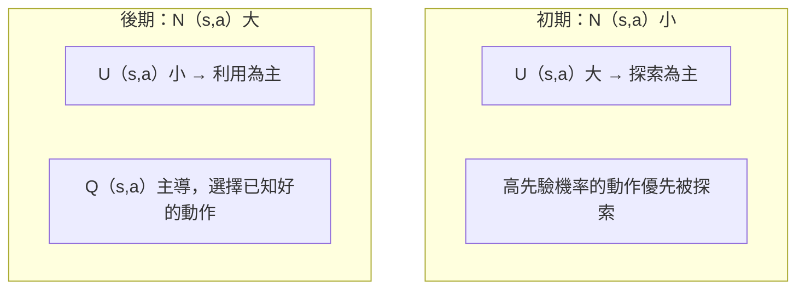
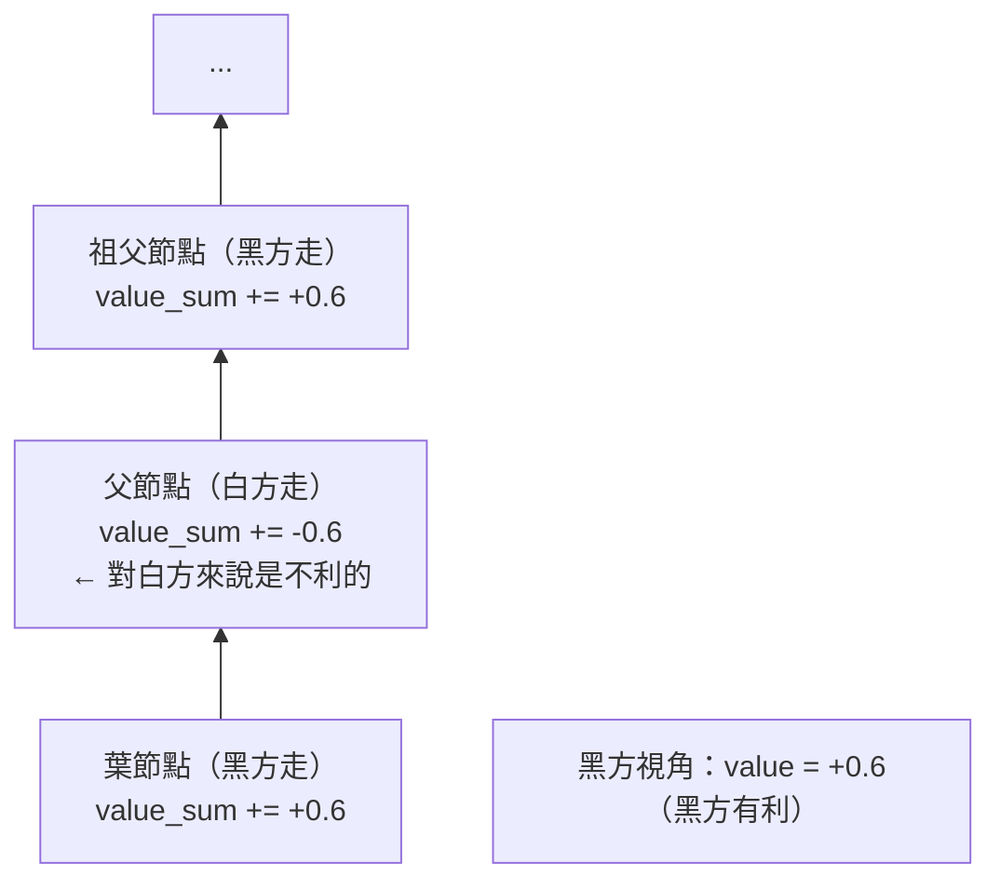
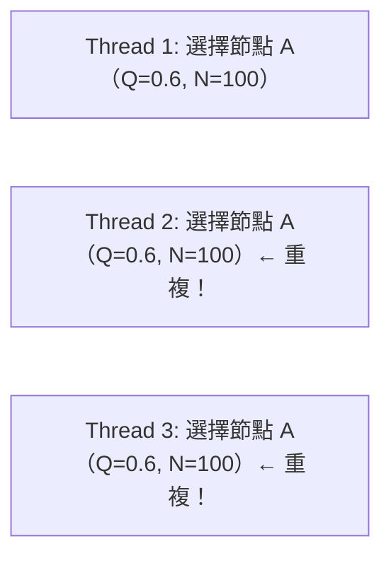
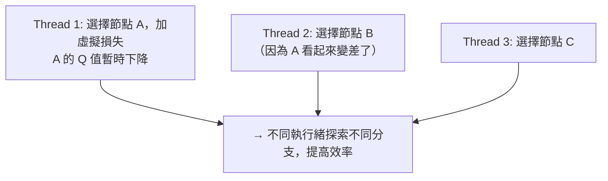

# MCTS 實作細節

本文深入解析 KataGo 中蒙地卡羅樹搜索（MCTS）的實作細節，包括資料結構、選擇策略與並行化技術。

---

## MCTS 四步驟回顧


---

## 節點資料結構

### 核心資料

每個 MCTS 節點需要儲存：

```python
class MCTSNode:
    def __init__(self, state, parent=None, prior=0.0):
        # 基本資訊
        self.state = state              # 棋盤狀態
        self.parent = parent            # 父節點
        self.children = {}              # 子節點字典 {action: node}
        self.action = None              # 到達此節點的動作

        # 統計資訊
        self.visit_count = 0            # N(s)：訪問次數
        self.value_sum = 0.0            # W(s)：價值總和
        self.prior = prior              # P(s,a)：先驗機率

        # 並行搜索用
        self.virtual_loss = 0           # 虛擬損失
        self.is_expanded = False        # 是否已展開

    @property
    def value(self):
        """Q(s) = W(s) / N(s)"""
        if self.visit_count == 0:
            return 0.0
        return self.value_sum / self.visit_count
```

### 記憶體優化

KataGo 使用多種技術減少記憶體用量：

```python
# 使用 numpy 陣列而非 Python dict
class OptimizedNode:
    __slots__ = ['visit_count', 'value_sum', 'prior', 'children_indices']

    def __init__(self):
        self.visit_count = np.int32(0)
        self.value_sum = np.float32(0.0)
        self.prior = np.float32(0.0)
        self.children_indices = None  # 延遲分配
```

---

## Selection：PUCT 選擇

### PUCT 公式

```
選擇分數 = Q(s,a) + U(s,a)

其中：
Q(s,a) = W(s,a) / N(s,a)              # 平均價值
U(s,a) = c_puct × P(s,a) × √(N(s)) / (1 + N(s,a))  # 探索項
```

### 參數說明

| 符號 | 意義 | 典型值 |
|------|------|--------|
| Q(s,a) | 動作 a 的平均價值 | [-1, +1] |
| P(s,a) | 神經網路的先驗機率 | [0, 1] |
| N(s) | 父節點訪問次數 | 整數 |
| N(s,a) | 動作 a 的訪問次數 | 整數 |
| c_puct | 探索常數 | 1.0 ~ 2.5 |

### 實作

```python
def select_child(self, c_puct=1.5):
    """選擇 PUCT 分數最高的子節點"""
    best_score = -float('inf')
    best_action = None
    best_child = None

    # 父節點訪問次數的平方根
    sqrt_parent_visits = math.sqrt(self.visit_count)

    for action, child in self.children.items():
        # Q 值（平均價值）
        if child.visit_count > 0:
            q_value = child.value_sum / child.visit_count
        else:
            q_value = 0.0

        # U 值（探索項）
        u_value = c_puct * child.prior * sqrt_parent_visits / (1 + child.visit_count)

        # 總分數
        score = q_value + u_value

        if score > best_score:
            best_score = score
            best_action = action
            best_child = child

    return best_action, best_child
```

### 探索 vs 利用的平衡



---

## Expansion：節點展開

### 展開條件

到達葉節點時，使用神經網路展開：

```python
def expand(self, policy_probs, legal_moves):
    """展開節點，創建所有合法動作的子節點"""
    for action in legal_moves:
        if action not in self.children:
            prior = policy_probs[action]  # 神經網路預測的機率
            child_state = self.state.play(action)
            self.children[action] = MCTSNode(
                state=child_state,
                parent=self,
                prior=prior
            )

    self.is_expanded = True
```

### 合法動作過濾

```python
def get_legal_moves(state):
    """取得所有合法動作"""
    legal = []
    for i in range(361):
        x, y = i // 19, i % 19
        if state.is_legal(x, y):
            legal.append(i)

    # 加入 pass
    legal.append(361)

    return legal
```

---

## Evaluation：神經網路評估

### 單次評估

```python
def evaluate(self, state):
    """使用神經網路評估局面"""
    # 編碼輸入特徵
    features = encode_state(state)  # (22, 19, 19)
    features = torch.tensor(features).unsqueeze(0)  # (1, 22, 19, 19)

    # 神經網路推理
    with torch.no_grad():
        output = self.network(features)

    policy = output['policy'][0].numpy()  # (362,)
    value = output['value'][0].item()     # scalar

    return policy, value
```

### 批次評估（關鍵優化）

GPU 在批次推理時效率最高：

```python
class BatchedEvaluator:
    def __init__(self, network, batch_size=8):
        self.network = network
        self.batch_size = batch_size
        self.pending = []  # 待評估的 (state, callback) 列表

    def request_evaluation(self, state, callback):
        """請求評估，當批次滿時自動執行"""
        self.pending.append((state, callback))

        if len(self.pending) >= self.batch_size:
            self.flush()

    def flush(self):
        """執行批次評估"""
        if not self.pending:
            return

        # 準備批次輸入
        states = [s for s, _ in self.pending]
        features = torch.stack([encode_state(s) for s in states])

        # 批次推理
        with torch.no_grad():
            outputs = self.network(features)

        # 回調結果
        for i, (_, callback) in enumerate(self.pending):
            policy = outputs['policy'][i].numpy()
            value = outputs['value'][i].item()
            callback(policy, value)

        self.pending.clear()
```

---

## Backpropagation：回傳更新

### 基本回傳

```python
def backpropagate(self, value):
    """從葉節點回傳到根節點，更新統計資訊"""
    node = self

    while node is not None:
        node.visit_count += 1
        node.value_sum += value

        # 交替視角：對手的價值是相反的
        value = -value

        node = node.parent
```

### 視角交替的重要性



---

## 並行化：虛擬損失

### 問題

多執行緒同時搜索時，可能都選到同一個節點：



### 解決方案：虛擬損失

選擇節點時，先加上「虛擬損失」，讓其他執行緒不想選它：

```python
VIRTUAL_LOSS = 3  # 虛擬損失值

def select_with_virtual_loss(self):
    """帶虛擬損失的選擇"""
    action, child = self.select_child()

    # 加上虛擬損失
    child.visit_count += VIRTUAL_LOSS
    child.value_sum -= VIRTUAL_LOSS  # 假裝輸了

    return action, child

def backpropagate_with_virtual_loss(self, value):
    """回傳時移除虛擬損失"""
    node = self

    while node is not None:
        # 移除虛擬損失
        node.visit_count -= VIRTUAL_LOSS
        node.value_sum += VIRTUAL_LOSS

        # 正常更新
        node.visit_count += 1
        node.value_sum += value

        value = -value
        node = node.parent
```

### 效果



---

## 完整搜索實作

```python
class MCTS:
    def __init__(self, network, c_puct=1.5, num_simulations=800):
        self.network = network
        self.c_puct = c_puct
        self.num_simulations = num_simulations
        self.evaluator = BatchedEvaluator(network)

    def search(self, root_state):
        """執行 MCTS 搜索"""
        root = MCTSNode(root_state)

        # 展開根節點
        policy, value = self.evaluate(root_state)
        legal_moves = get_legal_moves(root_state)
        root.expand(policy, legal_moves)

        # 執行模擬
        for _ in range(self.num_simulations):
            node = root
            path = [node]

            # Selection：沿樹向下
            while node.is_expanded and node.children:
                action, node = node.select_child(self.c_puct)
                path.append(node)

            # Expansion + Evaluation
            if not node.is_expanded:
                policy, value = self.evaluate(node.state)
                legal_moves = get_legal_moves(node.state)

                if legal_moves:
                    node.expand(policy, legal_moves)

            # Backpropagation
            for n in reversed(path):
                n.visit_count += 1
                n.value_sum += value
                value = -value

        # 選擇訪問次數最多的動作
        best_action = max(root.children.items(),
                         key=lambda x: x[1].visit_count)[0]

        return best_action

    def evaluate(self, state):
        features = encode_state(state)
        features = torch.tensor(features).unsqueeze(0)

        with torch.no_grad():
            output = self.network(features)

        return output['policy'][0].numpy(), output['value'][0].item()
```

---

## 進階技術

### Dirichlet 噪聲

訓練時在根節點加入噪聲，增加探索：

```python
def add_dirichlet_noise(root, alpha=0.03, epsilon=0.25):
    """在根節點加入 Dirichlet 噪聲"""
    noise = np.random.dirichlet([alpha] * len(root.children))

    for i, child in enumerate(root.children.values()):
        child.prior = (1 - epsilon) * child.prior + epsilon * noise[i]
```

### 溫度參數

控制動作選擇的隨機性：

```python
def select_action_with_temperature(root, temperature=1.0):
    """根據訪問次數和溫度選擇動作"""
    visits = np.array([c.visit_count for c in root.children.values()])
    actions = list(root.children.keys())

    if temperature == 0:
        # 貪婪選擇
        return actions[np.argmax(visits)]
    else:
        # 根據訪問次數的機率分佈選擇
        probs = visits ** (1 / temperature)
        probs = probs / probs.sum()
        return np.random.choice(actions, p=probs)
```

### 樹重用

新的一步可以重用之前的搜索樹：

```python
def reuse_tree(root, action):
    """重用子樹"""
    if action in root.children:
        new_root = root.children[action]
        new_root.parent = None
        return new_root
    else:
        return None  # 需要創建新樹
```

---

## 效能優化總結

| 技術 | 效果 |
|------|------|
| **批次評估** | GPU 利用率從 10% → 80%+ |
| **虛擬損失** | 多執行緒效率提升 3-5x |
| **樹重用** | 減少冷啟動，節省 30%+ 計算 |
| **記憶體池** | 減少記憶體分配開銷 |

---

## 延伸閱讀

- [神經網路架構詳解](../neural-network) — 評估函數的來源
- [GPU 後端與優化](../gpu-optimization) — 批次推理的硬體優化
- [關鍵論文導讀](../papers) — PUCT 公式的理論基礎
