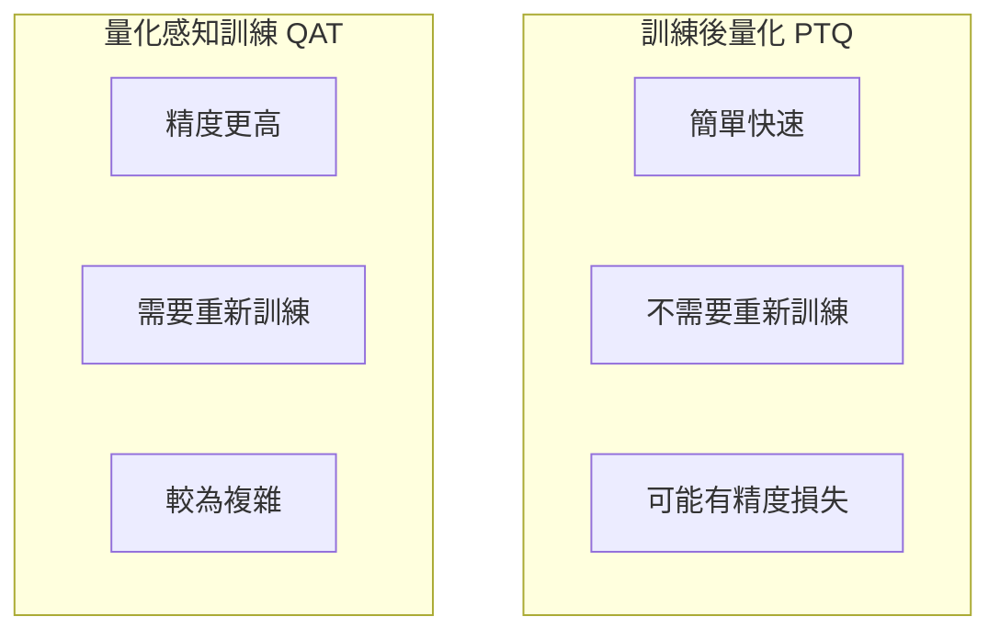

# 模型量化與部署

本文介紹如何將 KataGo 模型量化以減少資源需求，以及在各種平台上的部署方案。

---

## 量化技術總覽

### 為什麼需要量化？

| 精度 | 大小 | 速度 | 精度損失 |
|------|------|------|---------|
| FP32 | 100% | 基準 | 0% |
| FP16 | 50% | +50% | ~0% |
| INT8 | 25% | +100% | \<1% |

### 量化類型



---

## FP16 半精度

### 概念

將 32 位元浮點數轉換為 16 位元：

```python
# FP32 → FP16 轉換
model_fp16 = model.half()

# 推理
with torch.cuda.amp.autocast():
    output = model_fp16(input.half())
```

### KataGo 設定

```ini
# config.cfg
useFP16 = true           # 啟用 FP16 推理
useFP16Storage = true    # FP16 儲存中間結果
```

### 效能影響

| GPU 系列 | FP16 加速 |
|---------|----------|
| GTX 10xx | 無（無 Tensor Core） |
| RTX 20xx | +30-50% |
| RTX 30xx | +50-80% |
| RTX 40xx | +80-100% |

---

## INT8 量化

### 量化流程

```python
import torch.quantization as quant

# 1. 準備模型
model.eval()
model.qconfig = quant.get_default_qconfig('fbgemm')

# 2. 準備量化
model_prepared = quant.prepare(model)

# 3. 校準（使用代表性資料）
with torch.no_grad():
    for data in calibration_loader:
        model_prepared(data)

# 4. 轉換為量化模型
model_quantized = quant.convert(model_prepared)
```

### 校準資料

```python
def create_calibration_dataset(num_samples=1000):
    """創建校準資料集"""
    samples = []

    # 從實際對局中取樣
    for game in random_games(num_samples):
        position = random_position(game)
        features = encode_state(position)
        samples.append(features)

    return samples
```

### 注意事項

- INT8 量化需要校準資料
- 某些層可能不適合量化
- 需要測試精度損失

---

## TensorRT 部署

### 轉換流程

```python
import tensorrt as trt

def convert_to_tensorrt(onnx_path, engine_path):
    logger = trt.Logger(trt.Logger.WARNING)
    builder = trt.Builder(logger)
    network = builder.create_network(
        1 << int(trt.NetworkDefinitionCreationFlag.EXPLICIT_BATCH)
    )
    parser = trt.OnnxParser(network, logger)

    # 解析 ONNX 模型
    with open(onnx_path, 'rb') as f:
        parser.parse(f.read())

    # 設定優化選項
    config = builder.create_builder_config()
    config.max_workspace_size = 1 << 30  # 1GB

    # 啟用 FP16
    config.set_flag(trt.BuilderFlag.FP16)

    # 建構引擎
    engine = builder.build_engine(network, config)

    # 儲存
    with open(engine_path, 'wb') as f:
        f.write(engine.serialize())
```

### 使用 TensorRT 引擎

```python
def inference_with_tensorrt(engine_path, input_data):
    # 載入引擎
    with open(engine_path, 'rb') as f:
        engine = trt.Runtime(logger).deserialize_cuda_engine(f.read())

    context = engine.create_execution_context()

    # 分配記憶體
    d_input = cuda.mem_alloc(input_data.nbytes)
    d_output = cuda.mem_alloc(output_size)

    # 複製輸入
    cuda.memcpy_htod(d_input, input_data)

    # 執行推理
    context.execute_v2([int(d_input), int(d_output)])

    # 取得輸出
    output = np.empty(output_shape, dtype=np.float32)
    cuda.memcpy_dtoh(output, d_output)

    return output
```

---

## ONNX 匯出

### PyTorch → ONNX

```python
import torch.onnx

def export_to_onnx(model, output_path):
    model.eval()

    # 建立範例輸入
    dummy_input = torch.randn(1, 22, 19, 19)

    # 匯出
    torch.onnx.export(
        model,
        dummy_input,
        output_path,
        input_names=['input'],
        output_names=['policy', 'value', 'ownership'],
        dynamic_axes={
            'input': {0: 'batch_size'},
            'policy': {0: 'batch_size'},
            'value': {0: 'batch_size'},
            'ownership': {0: 'batch_size'}
        },
        opset_version=13
    )
```

### 驗證 ONNX 模型

```python
import onnx
import onnxruntime as ort

# 驗證模型結構
model = onnx.load("model.onnx")
onnx.checker.check_model(model)

# 測試推理
session = ort.InferenceSession("model.onnx")
output = session.run(None, {'input': input_data})
```

---

## 各平台部署

### 伺服器部署

```yaml
# docker-compose.yml
version: '3'
services:
  katago:
    image: katago/katago:latest
    deploy:
      resources:
        reservations:
          devices:
            - driver: nvidia
              count: 1
              capabilities: [gpu]
    volumes:
      - ./models:/models
      - ./config:/config
    command: >
      katago analysis
      -model /models/kata-b18c384.bin.gz
      -config /config/analysis.cfg
```

### 桌面應用整合

```python
# 嵌入 KataGo 到 Python 應用
import subprocess
import json

class KataGoProcess:
    def __init__(self, katago_path, model_path):
        self.process = subprocess.Popen(
            [katago_path, 'analysis', '-model', model_path],
            stdin=subprocess.PIPE,
            stdout=subprocess.PIPE,
            text=True
        )

    def analyze(self, moves):
        query = {
            'id': 'query1',
            'moves': moves,
            'rules': 'chinese',
            'komi': 7.5,
            'boardXSize': 19,
            'boardYSize': 19
        }
        self.process.stdin.write(json.dumps(query) + '\n')
        self.process.stdin.flush()

        response = self.process.stdout.readline()
        return json.loads(response)
```

### 行動裝置部署

#### iOS（Core ML）

```python
import coremltools as ct

# 轉換為 Core ML
mlmodel = ct.convert(
    model,
    inputs=[ct.TensorType(shape=(1, 22, 19, 19))],
    minimum_deployment_target=ct.target.iOS15
)

mlmodel.save("KataGo.mlmodel")
```

#### Android（TensorFlow Lite）

```python
import tensorflow as tf

# 轉換為 TFLite
converter = tf.lite.TFLiteConverter.from_saved_model(model_path)
converter.optimizations = [tf.lite.Optimize.DEFAULT]
converter.target_spec.supported_types = [tf.float16]

tflite_model = converter.convert()

with open('katago.tflite', 'wb') as f:
    f.write(tflite_model)
```

### 嵌入式系統

#### Raspberry Pi

```bash
# 使用 Eigen 後端（純 CPU）
./katago gtp -model kata-b10c128.bin.gz -config rpi.cfg
```

```ini
# rpi.cfg - Raspberry Pi 優化設定
numSearchThreads = 4
maxVisits = 100
nnMaxBatchSize = 1
```

#### NVIDIA Jetson

```bash
# 使用 CUDA 後端
./katago gtp -model kata-b18c384.bin.gz -config jetson.cfg
```

---

## 效能比較

### 不同部署方式的效能

| 部署方式 | 硬體 | Playouts/秒 |
|---------|------|------------|
| CUDA FP32 | RTX 3080 | ~3000 |
| CUDA FP16 | RTX 3080 | ~5000 |
| TensorRT FP16 | RTX 3080 | ~6500 |
| OpenCL | M1 Pro | ~1500 |
| Core ML | M1 Pro | ~1800 |
| TFLite | Pixel 7 | ~50 |
| Eigen | RPi 4 | ~15 |

### 模型大小比較

| 格式 | b18c384 大小 |
|------|-------------|
| 原始 (.bin.gz) | ~140 MB |
| ONNX FP32 | ~280 MB |
| ONNX FP16 | ~140 MB |
| TensorRT FP16 | ~100 MB |
| TFLite FP16 | ~140 MB |

---

## 部署檢查清單

- [ ] 選擇適合的量化精度
- [ ] 準備校準資料（INT8）
- [ ] 匯出為目標格式
- [ ] 驗證精度損失可接受
- [ ] 測試目標平台效能
- [ ] 優化記憶體用量
- [ ] 建立自動化部署流程

---

## 延伸閱讀

- [GPU 後端與優化](../gpu-optimization) — 基礎效能優化
- [評估與基準測試](../evaluation) — 驗證部署後的效能
- [整合到你的專案](../../hands-on/integration) — API 整合範例
