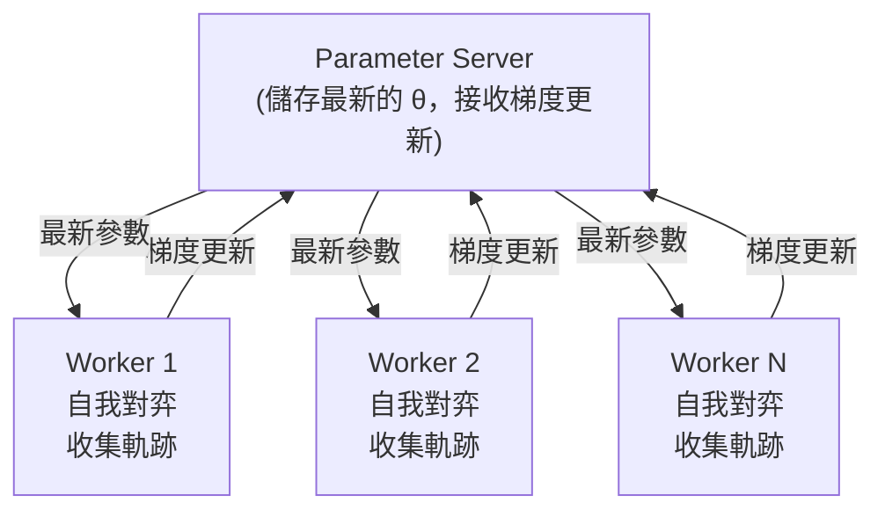

import { EloChart } from '@site/src/components/D3Charts';
import { ArticleSchema, KeyTakeaway, FAQ } from '@site/src/components/SEO';

<ArticleSchema
  title="自我對弈"
  description="深入理解 AlphaGo 如何透過自我對弈突破人類棋力的極限"
  slug="for-engineers/how-it-works/alphago-explained/13-self-play"
  datePublished="2024-01-15"
  dateModified="2024-02-22"
  section="AlphaGo 完整解析"
  keywords={["自我對弈", "Self-Play", "AlphaGo Zero", "強化學習", "Elo評分", "對抗性學習", "深度學習", "圍棋AI"]}
  wordCount={5500}
/>

# 自我對弈

在前一篇文章中，我們介紹了強化學習的基本概念。現在，讓我們探討 AlphaGo 成功的關鍵之一——**自我對弈（Self-Play）**。

這是一個看似矛盾的概念：**AI 怎麼能透過和自己下棋變得更強？**

答案既深刻又優雅，涉及博弈論、演化動力學、以及學習的本質。

---

## 為什麼自我對弈有效？

### 直覺解釋

想像你是一位圍棋初學者，在一個荒島上獨自練習：

1. 你下了一盤棋，自己同時扮演黑白雙方
2. 對局結束後，你分析哪些棋下得好、哪些下得差
3. 下一盤棋時，你嘗試避免之前的錯誤
4. 你重複這個過程數百萬次

直覺上，這似乎有問題：
- 如果你的水平很差，黑白雙方都下差棋，能學到什麼？
- 會不會陷入「錯誤的平衡」——雙方都下錯棋但能互相抵消？

但實際上，自我對弈能夠產生持續的進步。原因如下：

### 漸進式發現弱點

關鍵洞見是：**即使雙方都是同一個 AI，每盤棋的結果仍然包含資訊**。

```
局面 A：AI 選擇了走法 X，最終獲勝
局面 A：AI 選擇了走法 Y，最終失敗

→ 結論：在局面 A 中，X 比 Y 好
```

透過統計大量對局，AI 能夠學習到每個局面下哪些選擇更優。這就是**策略梯度**的本質：好的選擇會被強化，差的選擇會被抑制。

### 對抗性學習

自我對弈有一個特殊的性質：**訓練對手會自動適應你的水平**。

```
訓練週期 1：AI 發現了一個有效的戰術 T
訓練週期 2：作為對手的 AI 學會了如何防守 T
訓練週期 3：原版 AI 被迫尋找更好的戰術 T'
```

這形成了一個**軍備競賽（Arms Race）**，雙方不斷發現並克服彼此的弱點。

### 與人類棋譜的比較

| 訓練方式 | 優點 | 缺點 |
|---------|------|------|
| **人類棋譜** | 學習人類智慧的結晶 | 受限於人類水平 |
| **自我對弈** | 無上限的提升潛力 | 可能陷入局部最優 |
| **兩者結合** | 快速起步 + 持續提升 | 最佳策略 |

AlphaGo 原版先用人類棋譜做監督學習，再用自我對弈做強化學習。AlphaGo Zero 則證明了只用自我對弈也能達到超人水平。

---

## 博弈論視角

### 納什均衡

在博弈論中，**納什均衡（Nash Equilibrium）** 是一種穩定狀態：在這個狀態下，沒有任何玩家有動機單方面改變策略。

對於圍棋這樣的**零和、完美資訊博弈**，納什均衡有特殊的意義：

$$\pi^* = \arg\max_\pi \min_{\pi'} V(\pi, \pi')$$

其中 $V(\pi, \pi')$ 是當策略 $\pi$ 對上策略 $\pi'$ 時的預期價值。

這就是著名的 **Minimax 原則**：最佳策略是那個能在最壞情況下表現最好的策略。

### 自我對弈與納什均衡

理論上，如果自我對弈能夠收斂，它應該收斂到納什均衡。對於圍棋這樣的確定性博弈，納什均衡就是**完美下法**。

但圍棋的狀態空間太大了（$10^{170}$），我們不可能找到真正的納什均衡。自我對弈實際上是在**近似**這個均衡。

### 虛擬對弈（Fictitious Play）

自我對弈與博弈論中的**虛擬對弈**概念相關：

1. 每個玩家觀察對手的歷史策略
2. 計算對手策略的平均分佈
3. 選擇對抗這個平均分佈的最佳回應

在某些條件下，虛擬對弈可以證明會收斂到納什均衡。

AlphaGo 的自我對弈可以看作是這個概念的神經網路實現。

---

## 自我對弈的機制

### 基本流程

AlphaGo 的自我對弈流程：

```
演算法：Self-Play Training

初始化：Policy Network π_θ（可從監督學習或隨機初始化開始）

重複以下步驟直到收斂：

1. 產生對弈資料
   對於 i = 1 到 N（並行進行）：
     a. 用當前策略 π_θ 進行一局自我對弈
     b. 收集軌跡：τ_i = (s_0, a_0, r_1, s_1, a_1, ...)
     c. 記錄最終結果 z_i ∈ {-1, +1}

2. 更新策略
   a. 計算策略梯度：
      ∇J = (1/N) Σ_i Σ_t ∇_θ log π_θ(a_t|s_t) · z_i
   b. 更新參數：θ ← θ + α · ∇J

3. 更新價值網路
   a. 用 (s, z) 對訓練 Value Network
   b. 最小化：L = E[(V_φ(s) - z)²]

4. 可選：評估並保存檢查點
   a. 讓新策略對抗舊版本
   b. 如果贏率 > 55%，更新對手池
```

### 訓練資料的產生

每局自我對弈產生一個**軌跡（trajectory）**：

$$\tau = (s_0, a_0, s_1, a_1, \ldots, s_T, z)$$

其中：
- $s_t$：時間步 $t$ 的棋盤狀態
- $a_t$：時間步 $t$ 選擇的動作
- $z$：最終結果（+1 勝利，-1 失敗）

一局 200 手的對弈就產生了 200 個訓練樣本。每天進行數十萬局自我對弈，訓練資料量是驚人的。

### 策略更新

使用策略梯度更新 Policy Network：

$$\theta \leftarrow \theta + \alpha \cdot \nabla_\theta \mathbb{E}\left[\sum_t \log \pi_\theta(a_t|s_t) \cdot z\right]$$

這個更新的效果：
- 如果最終獲勝（$z = +1$），增加所有落子的機率
- 如果最終失敗（$z = -1$），減少所有落子的機率

這看起來很粗糙——贏棋時可能也有些差棋，輸棋時可能也有些好棋。但透過大量對局的統計，這些「雜訊」會被平均掉，真正的好棋會被識別出來。

### 價值網路訓練

Value Network 使用**回歸（regression）** 訓練：

$$\phi \leftarrow \phi - \beta \cdot \nabla_\phi \mathbb{E}\left[(V_\phi(s) - z)^2\right]$$

這讓 Value Network 學會預測：從當前局面開始，最終獲勝的機率是多少？

Value Network 的作用是：
1. 在 MCTS 中提供葉節點評估
2. 作為策略梯度的基準線（baseline）
3. 直接用於局面評估

---

## 隨機化的重要性

### 避免確定性循環

如果自我對弈是完全確定性的，可能會陷入循環：

```
策略 A 總是下固定的開局
策略 A 對上策略 A 總是產生相同的棋局
只有一局棋被反覆學習
AI 無法探索其他可能性
```

這就是為什麼**隨機性**在自我對弈中至關重要。

### 隨機化的來源

AlphaGo 在自我對弈中引入隨機性的方式：

**1. 策略網路本身是隨機的**

Policy Network 輸出的是機率分佈，而非確定性選擇：

$$a \sim \pi_\theta(a|s)$$

同樣的局面，每次可能選擇不同的落子。

**2. 溫度參數**

在訓練時使用較高的溫度（temperature）來增加多樣性：

$$\pi_\tau(a|s) = \frac{\pi_\theta(a|s)^{1/\tau}}{\sum_{a'} \pi_\theta(a'|s)^{1/\tau}}$$

- $\tau > 1$：更隨機，更多探索
- $\tau < 1$：更確定，更多利用
- $\tau = 1$：原始分佈

**3. 狄利克雷噪音（Dirichlet Noise）**

AlphaGo Zero 在自我對弈時，在根節點的先驗機率上加入狄利克雷噪音：

$$P(s, a) = (1 - \varepsilon) \cdot \pi_\theta(a|s) + \varepsilon \cdot \eta_a$$

其中 $\eta \sim \text{Dir}(\alpha)$，$\varepsilon = 0.25$，$\alpha = 0.03$（針對圍棋的 361 個動作）。

這確保了即使是非常低機率的走法，也有機會被探索。

### 對弈池（Population）方法

另一種增加多樣性的方法是維護一個**對弈池**：

```
對弈池 = [π_1, π_2, π_3, ..., π_k]（不同版本的策略）

每局對弈：
1. 從池中隨機選擇一個對手
2. 與該對手進行對弈
3. 用結果更新當前策略
4. 定期將改進的策略加入池中
```

這種方法的好處：
- **多樣性**：不同風格的對手
- **穩定性**：避免對特定對手過擬合
- **魯棒性**：學會應對各種策略

AlphaGo 原版和 AlphaGo Zero 都使用了類似的技術。

---

## 棋力成長曲線

### Elo 評分系統

為了追蹤 AI 棋力的變化，AlphaGo 使用了 **Elo 評分系統**。

Elo 系統的基本原理：

$$P(\text{A 勝}) = \frac{1}{1 + 10^{(R_B - R_A)/400}}$$

其中 $R_A$ 和 $R_B$ 是雙方的 Elo 分數。

- 分差 200：強者預期贏 75%
- 分差 400：強者預期贏 90%
- 分差 800：強者預期贏 99%

### AlphaGo 的棋力成長

讓我們視覺化 AlphaGo 各版本的棋力成長：

<EloChart mode="zero" width={700} height={400} showMilestones={true} />

### 成長速度分析

從曲線可以觀察到幾個有趣的現象：

**1. 初期快速增長**

在訓練的最初幾個小時，AI 學會了基本規則和簡單戰術。這是**低掛果實**階段——有太多明顯的錯誤可以修正。

**2. 中期穩定增長**

隨著基本錯誤被消除，AI 開始學習更精妙的戰術和定式。增長速度變慢，但仍然穩定。

**3. 後期增長放緩**

當 AI 已經很強時，進一步提升變得困難。可能需要發現全新的策略，而不只是修正錯誤。

### 超越人類的時刻

AlphaGo 訓練曲線中的關鍵里程碑：

| 里程碑 | 相當於 | 達成時間 |
|--------|--------|---------|
| 超越業餘強豪 | Elo ~2700 | 約 3 小時 |
| 超越 Fan Hui | Elo ~3500 | 約 36 小時 |
| 超越 Lee Sedol | Elo ~4500 | 約 60 小時 |
| 超越原版 AlphaGo | Elo ~5000 | 約 72 小時 |

這些數字（來自 AlphaGo Zero）令人震驚：**AI 在 3 天內從零開始超越了人類數千年的圍棋智慧**。

---

## 收斂性分析

### 自我對弈會收斂嗎？

這是一個重要的理論問題。簡短的答案是：**在某些條件下會，但圍棋太複雜了，我們無法嚴格證明**。

### 理論保證

對於較簡單的遊戲（如井字棋），可以證明：

1. **存在性**：存在納什均衡（Minimax 定理）
2. **收斂性**：某些演算法（如虛擬對弈）會收斂到納什均衡

對於圍棋，我們沒有嚴格的收斂保證，但實驗證據顯示：
- 棋力持續提升
- 沒有出現明顯的振盪或退化
- 最終棋力超越所有已知人類

### 可能的失敗模式

自我對弈可能遇到的問題：

**1. 策略循環（Strategy Cycling）**

```
策略 A 打敗策略 B
策略 B 打敗策略 C
策略 C 打敗策略 A
```

這在某些遊戲中確實會發生（如剪刀石頭布）。但圍棋有足夠的複雜性，這種純粹的循環似乎不會發生。

**2. 過擬合到自己**

AI 可能學會了只針對自己風格的策略，而無法應對其他風格的對手。這是為什麼 AlphaGo 會與不同版本的自己對弈，以及最終與人類棋手測試。

**3. 局部最優**

AI 可能陷入局部最優——一種「還不錯但不是最好」的策略。隨機化和大量對弈有助於避免這個問題。

### 實際觀察

從 AlphaGo 的訓練過程觀察到：

1. **持續進步**：Elo 分數隨著訓練持續上升
2. **沒有退化**：沒有出現棋力突然下降的情況
3. **風格演化**：AI 的下棋風格隨著訓練逐漸變化
4. **發現新定式**：AI 發現了人類從未使用過的開局和戰術

這些觀察表明，雖然我們沒有理論保證，但自我對弈在實踐中確實有效。

---

## 實作細節

### 並行自我對弈

為了加速訓練，AlphaGo 使用大規模並行自我對弈：



**關鍵設計決策**：

- **同步 vs 非同步**：AlphaGo 使用非同步更新，Worker 不需要等待彼此
- **更新頻率**：每完成 N 局對弈就更新一次參數
- **對手選擇**：隨機選擇最近幾個版本中的一個作為對手

### 檢查點策略

定期保存模型檢查點，用於：

1. **對弈池**：維護不同版本的對手
2. **評估**：追蹤棋力變化
3. **故障恢復**：訓練中斷時可以恢復

```python
# 偽代碼
def training_loop():
    for iteration in range(num_iterations):
        # 產生對弈資料
        trajectories = parallel_self_play(current_policy, num_games=1000)

        # 更新策略
        update_policy(trajectories)

        # 定期評估和保存
        if iteration % 100 == 0:
            elo = evaluate_against_pool(current_policy)
            save_checkpoint(current_policy, elo)

            if elo > best_elo:
                add_to_pool(current_policy)
                best_elo = elo
```

### 訓練資源需求

AlphaGo 的訓練規模令人印象深刻：

| 版本 | 硬體 | 訓練時間 | 自我對弈局數 |
|------|------|---------|-------------|
| AlphaGo Fan | 176 GPU | 數月 | ~30M |
| AlphaGo Lee | 48 TPU | 數週 | ~30M |
| AlphaGo Zero | 4 TPU | 3 天 | ~5M |
| AlphaGo Zero (40天版) | 4 TPU | 40 天 | ~30M |

注意 AlphaGo Zero 用更少的硬體和更短的時間達到了更強的棋力——這是算法效率的提升。

### 超參數設置

一些關鍵的超參數：

```python
# 自我對弈設置
NUM_PARALLEL_GAMES = 5000      # 同時進行的對弈數
GAMES_PER_ITERATION = 25000    # 每次迭代的對弈數
MCTS_SIMULATIONS = 1600        # 每步棋的 MCTS 模擬次數

# 訓練設置
BATCH_SIZE = 2048              # 訓練批次大小
LEARNING_RATE = 0.01           # 初始學習率
L2_REGULARIZATION = 1e-4       # 權重衰減

# 探索設置
TEMPERATURE = 1.0              # 開局 30 手的溫度
DIRICHLET_ALPHA = 0.03         # 狄利克雷噪音參數
EXPLORATION_FRACTION = 0.25    # 噪音比例
```

這些超參數是經過大量實驗調整的，對訓練效果有顯著影響。

---

## 自我對弈的變體

### AlphaGo 原版

AlphaGo 原版的訓練流程：

```
1. 監督學習 (SL)：從人類棋譜學習
   → 產生 SL Policy Network (π_SL)

2. 強化學習 (RL)：自我對弈
   初始化 π_RL = π_SL
   對手池 = [π_SL]

   重複：
     a. π_RL 與池中策略對弈
     b. 用策略梯度更新 π_RL
     c. 如果 π_RL 變強，加入池中

   → 產生 RL Policy Network (π_RL)

3. 價值網路訓練：
   用 π_RL 自我對弈產生局面
   訓練 V(s) 預測勝率
```

### AlphaGo Zero

AlphaGo Zero 簡化了這個流程：

```
1. 純自我對弈（無人類資料）
   初始化隨機網路 f_θ

   重複：
     a. 用 MCTS + f_θ 進行自我對弈
     b. 同時訓練策略頭和價值頭
     c. 更新 f_θ

   → 單一網路同時輸出策略和價值
```

關鍵改進：
- **無需人類資料**：從零開始
- **單一網路**：策略和價值共享特徵
- **更簡潔的訓練**：端到端學習

### AlphaZero

AlphaZero 進一步泛化：

```
同樣的算法，不同的遊戲：
- 圍棋：達到超越 AlphaGo Zero 的水平
- 西洋棋：超越 Stockfish
- 將棋：超越 Elmo

唯一的遊戲特定部分：規則編碼
```

這證明了自我對弈是一種**通用的學習範式**，不限於圍棋。

---

## 人類從中學到什麼？

### AI 發現的新定式

自我對弈產生了許多人類從未使用過的下法：

**1. 開局創新**

AlphaGo 偏好的一些開局：
- 3-3 侵入：在早期就侵入角部
- 高位下法：傳統上被認為「不穩定」
- 大雪崩變化：人類認為複雜難以計算

**2. 新的形勢判斷**

AI 對某些局面的評估與人類大相徑庭：
- 某些看似「薄弱」的棋形其實很堅實
- 某些「厚勢」的價值被高估
- 對「先手」和「後手」的重新評估

### 對人類圍棋的影響

AlphaGo 之後，職業圍棋發生了顯著變化：

1. **開局多樣化**：職業棋手開始使用 AI 發現的新開局
2. **訓練方式改變**：AI 成為職業棋手的主要訓練工具
3. **棋理重新思考**：許多傳統「棋理」被質疑和修正
4. **新的美學**：開始欣賞 AI 風格的棋

柯潔在輸給 AlphaGo 後說：

> 「AlphaGo 讓我重新認識圍棋。我以前認為人類理解圍棋，現在我知道我們只是觸及皮毛。」

---

## 哲學思考

### 學習的本質

自我對弈提出了關於學習的深刻問題：

**知識從哪裡來？**

- 人類學習依賴於外部資訊（老師、書本、經驗）
- 自我對弈的 AI 只有規則，沒有外部知識
- 但它仍然能「發現」知識——這些知識是從哪裡來的？

答案可能是：**知識隱含在遊戲規則和結構中**。圍棋的規則定義了什麼是好棋、什麼是壞棋，自我對弈只是揭示了這些隱含的結構。

### 創造力與發現

當 AI 下出「神之一手」（Move 37），這算是創造還是發現？

一種觀點是：那步棋一直「存在」於圍棋的規則中，AI 只是「發現」了它。
另一種觀點是：AI 「創造」了這步棋，因為沒有人（包括 AI 自己）事先知道它。

這個問題沒有標準答案，但它挑戰了我們對創造力的傳統理解。

### 人類智慧的位置

如果 AI 可以從零開始，透過自我對弈超越人類數千年的智慧，這對人類意味著什麼？

樂觀的看法：
- AI 是人類創造的工具
- AI 的發現可以增強人類的理解
- 人類可以與 AI 合作，達到更高的水平

謹慎的看法：
- 某些領域，純粹的計算可能超越人類直覺
- 需要重新思考「專業技能」的價值
- 教育和訓練方式可能需要改變

---

## 動畫對應

本文涉及的核心概念與動畫編號：

| 編號 | 概念 | 物理/數學對應 |
|------|------|--------------|
| 🎬 E5 | 自我對弈循環 | 不動點迭代 |
| 🎬 E6 | 策略演化 | 進化動力學 |

---

## 總結

自我對弈是 AlphaGo 成功的關鍵技術之一。我們學習了：

1. **為什麼有效**：對抗性學習、漸進式發現弱點
2. **機制**：軌跡收集、策略梯度、價值網路訓練
3. **隨機化**：溫度參數、狄利克雷噪音、對弈池
4. **棋力成長**：Elo 系統、成長曲線分析
5. **收斂性**：理論保證與實際觀察
6. **實作細節**：並行訓練、檢查點策略、超參數

下一篇，我們將探討 AlphaGo 如何將神經網路與 MCTS 結合，發揮兩者的優勢。

---

## 延伸閱讀

- **下一篇**：[MCTS 與神經網路的結合](../mcts-neural-combo) — 直覺與推理的完美結合
- **上一篇**：[強化學習入門](../reinforcement-intro) — 強化學習的基本概念
- **相關**：[AlphaGo Zero 概述](../alphago-zero) — 從零開始的突破

---

## 參考資料

1. Silver, D., et al. (2016). "Mastering the game of Go with deep neural networks and tree search." *Nature*, 529, 484-489.
2. Silver, D., et al. (2017). "Mastering the game of Go without human knowledge." *Nature*, 550, 354-359.
3. Silver, D., et al. (2018). "A general reinforcement learning algorithm that masters chess, shogi, and Go through self-play." *Science*, 362(6419), 1140-1144.
4. Heinrich, J., & Silver, D. (2016). "Deep Reinforcement Learning from Self-Play in Imperfect-Information Games." *arXiv preprint*.
5. Lanctot, M., et al. (2017). "A Unified Game-Theoretic Approach to Multiagent Reinforcement Learning." *NeurIPS*.

---

<KeyTakeaway>
本文重點：
- 自我對弈透過對抗性學習形成軍備競賽，雙方不斷發現並克服彼此弱點
- AlphaGo Zero 在 3 天內從零開始超越人類數千年的圍棋智慧
- 隨機化（溫度參數、狄利克雷噪音）確保探索多樣性，避免陷入局部最優
</KeyTakeaway>

<FAQ items={[
  { question: "AI 和自己下棋怎麼會變強？", answer: "關鍵在於對抗性學習：即使雙方是同一個 AI，每盤棋的結果仍包含資訊。好的選擇被強化，差的被抑制。隨著 AI 發現有效戰術，作為對手的自己會學會防守，迫使發現更好的策略。" },
  { question: "自我對弈會收斂嗎？", answer: "理論上對於簡單遊戲可以證明收斂到納什均衡，但圍棋太複雜無法嚴格證明。實際觀察顯示：棋力持續提升、沒有振盪或退化、最終超越人類，表明在實踐中確實有效。" },
  { question: "為什麼 AlphaGo Zero 不需要人類棋譜？", answer: "自我對弈提供無限的訓練資料，且對手水平隨自己提升而提升。關鍵在於規則定義了什麼是好棋，自我對弈只是揭示這些隱含在規則中的結構。3 天訓練就能超越人類。" }
]} />
