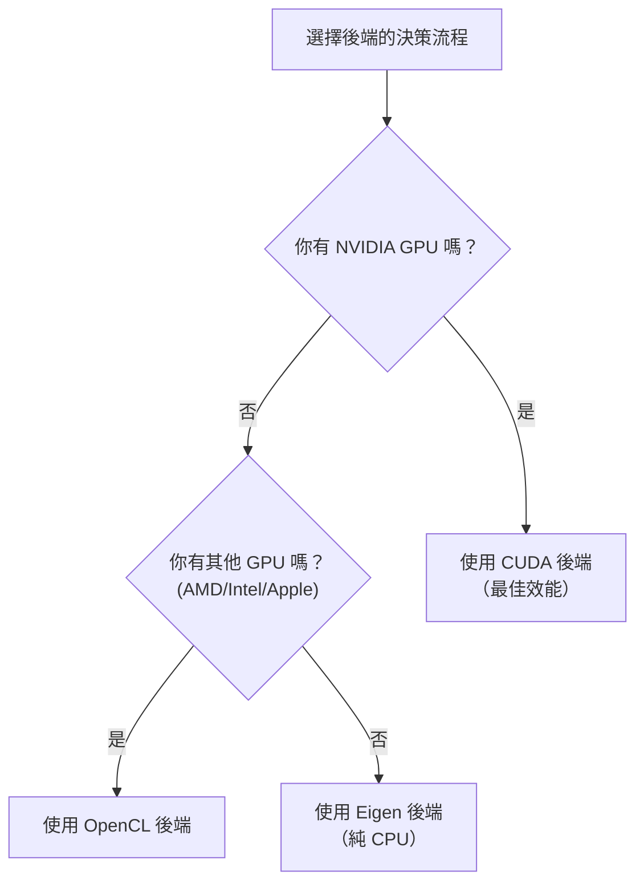

# KataGo 安裝與設定

本文將詳細介紹如何在各平台上安裝 KataGo，包括系統需求、安裝步驟、模型選擇和設定檔說明。

## 系統需求

### 硬體需求

#### GPU（推薦）

| GPU 類型 | 支援狀態 | 建議後端 |
|---------|---------|---------|
| NVIDIA（CUDA） | 最佳支援 | CUDA |
| NVIDIA（無 CUDA） | 良好支援 | OpenCL |
| AMD | 良好支援 | OpenCL |
| Intel 內顯 | 基本支援 | OpenCL |
| Apple Silicon | 良好支援 | Metal / OpenCL |

#### CPU 模式

如果沒有合適的 GPU，可以使用 Eigen 後端純 CPU 運行：
- 效能較低（約 10-30 playouts/sec）
- 適合學習、測試和低強度使用
- 需要 AVX2 指令集支援（大多數現代 CPU 都支援）

### 軟體需求

| 作業系統 | 版本要求 |
|---------|---------|
| **Linux** | Ubuntu 18.04+, CentOS 7+ 或其他現代發行版 |
| **macOS** | 10.14+ (Mojave 或更新) |
| **Windows** | Windows 10 或更新 |

### 後端選擇指南



## macOS 安裝

### 方法 1：Homebrew（推薦）

最簡單的安裝方式，自動處理所有依賴。

```bash
# 安裝 KataGo
brew install katago

# 確認安裝成功
katago version
```

Homebrew 版本預設使用 OpenCL 後端，在 Intel Mac 和 Apple Silicon 上都能運行。

### 方法 2：從原始碼編譯

適合需要自訂選項或最新功能的使用者。

#### 安裝依賴

```bash
# 安裝 CMake 和編譯工具
brew install cmake

# 如果使用 OpenCL
# macOS 已內建 OpenCL 支援，無需額外安裝
```

#### 編譯步驟

```bash
# 克隆原始碼
git clone https://github.com/lightvector/KataGo.git
cd KataGo/cpp

# 建立編譯目錄
mkdir build && cd build

# 設定編譯選項（OpenCL 後端）
cmake .. -DUSE_BACKEND=OPENCL

# 編譯
make -j$(sysctl -n hw.ncpu)

# 編譯完成後，執行檔位於 build/katago
./katago version
```

#### Apple Silicon 特別說明

在 M1/M2/M3 Mac 上，建議使用 OpenCL 或 Metal 後端：

```bash
# OpenCL 後端（推薦，相容性較好）
cmake .. -DUSE_BACKEND=OPENCL

# Metal 後端（實驗性，可能有更好效能）
cmake .. -DUSE_BACKEND=METAL
```

## Linux 安裝

### 方法 1：預編譯版本（推薦）

從 GitHub Releases 下載預編譯版本：

```bash
# 下載 OpenCL 版本（適用於大多數情況）
wget https://github.com/lightvector/KataGo/releases/download/v1.15.3/katago-v1.15.3-opencl-linux-x64.zip

# 或下載 CUDA 版本（NVIDIA GPU）
wget https://github.com/lightvector/KataGo/releases/download/v1.15.3/katago-v1.15.3-cuda11.1-linux-x64.zip

# 解壓縮
unzip katago-v1.15.3-*.zip

# 賦予執行權限
chmod +x katago

# 確認安裝
./katago version
```

### 方法 2：從原始碼編譯

#### CUDA 後端（NVIDIA GPU）

```bash
# 安裝依賴
sudo apt update
sudo apt install cmake g++ libzip-dev

# 安裝 CUDA（如果尚未安裝）
# 請參考 NVIDIA 官方指南：https://developer.nvidia.com/cuda-downloads

# 克隆並編譯
git clone https://github.com/lightvector/KataGo.git
cd KataGo/cpp
mkdir build && cd build

# 設定 CUDA 後端
cmake .. -DUSE_BACKEND=CUDA

# 編譯
make -j$(nproc)
```

#### OpenCL 後端（通用 GPU）

```bash
# 安裝依賴
sudo apt update
sudo apt install cmake g++ libzip-dev ocl-icd-opencl-dev

# 安裝 OpenCL 驅動
# NVIDIA: 隨 CUDA 安裝
# AMD: sudo apt install mesa-opencl-icd
# Intel: sudo apt install intel-opencl-icd

# 克隆並編譯
git clone https://github.com/lightvector/KataGo.git
cd KataGo/cpp
mkdir build && cd build

cmake .. -DUSE_BACKEND=OPENCL
make -j$(nproc)
```

#### Eigen 後端（純 CPU）

```bash
# 安裝依賴
sudo apt update
sudo apt install cmake g++ libzip-dev libeigen3-dev

# 克隆並編譯
git clone https://github.com/lightvector/KataGo.git
cd KataGo/cpp
mkdir build && cd build

cmake .. -DUSE_BACKEND=EIGEN
make -j$(nproc)
```

## Windows 安裝

### 方法 1：預編譯版本（推薦）

1. 前往 [KataGo Releases](https://github.com/lightvector/KataGo/releases)
2. 下載適合的版本：
   - `katago-v1.15.3-cuda11.1-windows-x64.zip`（NVIDIA GPU + CUDA）
   - `katago-v1.15.3-opencl-windows-x64.zip`（其他 GPU）
   - `katago-v1.15.3-eigen-windows-x64.zip`（純 CPU）
3. 解壓縮到指定目錄
4. 在命令提示字元中測試：

```cmd
cd C:\path\to\katago
katago.exe version
```

### 方法 2：從原始碼編譯

#### 準備環境

1. 安裝 [Visual Studio 2019/2022](https://visualstudio.microsoft.com/)（含 C++ 工具）
2. 安裝 [CMake](https://cmake.org/download/)
3. 如果使用 CUDA，安裝 [CUDA Toolkit](https://developer.nvidia.com/cuda-toolkit)

#### 編譯步驟

```cmd
# 在 Developer Command Prompt 中執行

git clone https://github.com/lightvector/KataGo.git
cd KataGo\cpp
mkdir build
cd build

# CUDA 後端
cmake .. -G "Visual Studio 17 2022" -A x64 -DUSE_BACKEND=CUDA

# 或 OpenCL 後端
cmake .. -G "Visual Studio 17 2022" -A x64 -DUSE_BACKEND=OPENCL

# 編譯
cmake --build . --config Release
```

## 模型下載與選擇

KataGo 需要神經網路模型檔案才能運行。官方提供多種大小的模型。

### 下載位置

官方模型下載頁面：https://katagotraining.org/

或直接從訓練伺服器下載：

```bash
# 較小模型（適合測試和弱硬體）
curl -L -o kata-b18c384.bin.gz \
  "https://media.katagotraining.org/uploaded/networks/models/kata1/kata1-b18c384nbt-s9996604416-d4316597426.bin.gz"

# 中型模型（推薦，平衡性能和速度）
curl -L -o kata-b40c256.bin.gz \
  "https://media.katagotraining.org/uploaded/networks/models/kata1/kata1-b40c256-s11840935168-d2898845681.bin.gz"

# 大型模型（最強棋力，需要強力 GPU）
curl -L -o kata-b60c320.bin.gz \
  "https://media.katagotraining.org/uploaded/networks/models/kata1/kata1-b60c320-s11318001920-d2792783831.bin.gz"
```

### 模型比較

| 模型 | 網路大小 | 檔案大小 | 棋力 | 適用場景 |
|------|---------|---------|------|---------|
| b10c128 | 10 blocks, 128 channels | ~20 MB | 業餘高段 | CPU、弱 GPU、快速測試 |
| b18c384 | 18 blocks, 384 channels | ~140 MB | 職業水準 | 一般 GPU、日常分析 |
| b40c256 | 40 blocks, 256 channels | ~250 MB | 超人水準 | 中高階 GPU、深度分析 |
| b60c320 | 60 blocks, 320 channels | ~500 MB | 頂級超人 | 高階 GPU、頂級分析 |

### 選擇建議

```
你的 GPU 是？
├─ RTX 3080/4080/4090 → b60c320 或 b40c256
├─ RTX 3060/3070 → b40c256 或 b18c384
├─ GTX 1660/2060 → b18c384
├─ 入門級 GPU → b18c384 或 b10c128
└─ 純 CPU → b10c128
```

## 基本設定檔說明

KataGo 使用 `.cfg` 格式的設定檔。官方提供範例設定檔在 `cpp/configs/` 目錄下。

### 重要設定檔

| 檔案 | 用途 |
|------|------|
| `gtp_example.cfg` | GTP 模式的範例設定 |
| `analysis_example.cfg` | Analysis Engine 的範例設定 |
| `default_gtp.cfg` | GTP 模式的預設設定 |

### 核心設定項目

```ini
# =============
# 神經網路設定
# =============

# 神經網路模型檔案路徑
# 可使用相對路徑或絕對路徑
# model = /path/to/model.bin.gz

# =============
# 搜索設定
# =============

# 每手棋的最大搜索訪問數
# 增加此值會提高棋力但減慢速度
maxVisits = 500

# 每手棋的最大思考時間（秒）
# 0 表示無限制（由 maxVisits 控制）
maxTime = 0

# 每次移動使用的執行緒數
numSearchThreads = 6

# =============
# 規則設定
# =============

# 圍棋規則
# chinese = 中國規則
# japanese = 日本規則
# korean = 韓國規則
# tromp-taylor = Tromp-Taylor 規則
# aga = AGA 規則
rules = chinese

# 貼目
komi = 7.5

# =============
# GPU 設定
# =============

# 使用的 GPU 編號（從 0 開始）
# 多 GPU 可用逗號分隔：0,1,2
# -1 表示自動選擇
nnDeviceIdxs = 0

# 每個 GPU 執行緒的批次大小
# 較大的批次可提高 GPU 利用率
numNNServerThreadsPerModel = 1

# =============
# 進階設定
# =============

# MCTS 探索常數
# 較大值增加探索，較小值增加利用
cpuctExploration = 1.0

# 根節點的 Dirichlet 噪音
# 用於增加探索多樣性
rootNoiseEnabled = true
rootDirichletNoisePruneFactor = 0.25
```

### GTP 模式設定範例

建立 `my_gtp_config.cfg`：

```ini
# 模型路徑
# model 通常在命令列指定，這裡可以省略

# 搜索設定
maxVisits = 1000
numSearchThreads = 4

# 規則
rules = chinese
komi = 7.5

# GPU 設定
nnDeviceIdxs = 0

# 日誌
logDir = ./logs
logToStderr = false
```

### Analysis Engine 設定範例

建立 `my_analysis_config.cfg`：

```ini
# 搜索設定
maxVisits = 500
numSearchThreads = 8

# 報告設定
# 每次分析報告的最大變化數
maxMoves = 10

# 規則（可在 API 呼叫時覆蓋）
rules = chinese
komi = 7.5

# GPU 設定
nnDeviceIdxs = 0
numNNServerThreadsPerModel = 2

# 分析功能
reportAnalysisWinratesAs = BLACK

# 所有權地圖
# 啟用後可獲得每個點的歸屬預測
analysisOwnership = true
```

## 首次運行

### 測試 GTP 模式

```bash
# 運行 GTP 模式
katago gtp -model /path/to/model.bin.gz -config /path/to/config.cfg

# 如果沒有 config，KataGo 會使用預設值
katago gtp -model /path/to/model.bin.gz
```

成功啟動後，輸入 GTP 指令測試：

```
name
= KataGo

version
= 1.15.3

boardsize 19
=

genmove black
= Q16

quit
=
```

### 測試 Analysis Engine

```bash
# 運行 Analysis Engine
katago analysis -model /path/to/model.bin.gz -config /path/to/config.cfg
```

輸入 JSON 查詢：

```json
{"id":"test1","initialStones":[],"moves":[],"rules":"chinese","komi":7.5,"boardXSize":19,"boardYSize":19,"analyzeTurns":[0]}
```

### 基準測試

測試你的硬體效能：

```bash
# 運行基準測試
katago benchmark -model /path/to/model.bin.gz

# 指定設定檔
katago benchmark -model /path/to/model.bin.gz -config /path/to/config.cfg
```

基準測試會輸出：
- 每秒搜索訪問數（visits/sec）
- 神經網路推理速度
- 建議的執行緒設定

## 常見問題排解

### GPU 相關

**問題：找不到 GPU**

```bash
# 檢查 OpenCL 設備
clinfo

# 或列出 KataGo 看到的設備
katago gpuinfo
```

**問題：CUDA 初始化失敗**

- 確認 CUDA 版本與 KataGo 編譯版本相符
- 更新 GPU 驅動程式
- 檢查 CUDA_PATH 環境變數

### 記憶體相關

**問題：記憶體不足**

```ini
# 減少 GPU 記憶體使用
nnMaxBatchSize = 8  # 預設可能是 16 或更高
nnCacheSizePowerOfTwo = 20  # 減少快取大小
```

### 效能相關

**問題：速度太慢**

1. 確認使用 GPU 而非 CPU
2. 減少 `numSearchThreads`
3. 使用較小的模型
4. 檢查是否有其他程式佔用 GPU

## 下一步

設定完成後，請繼續閱讀：
- [常用指令](./commands.md) - 學習如何使用 KataGo
- [原始碼架構](./architecture.md) - 了解內部實作
