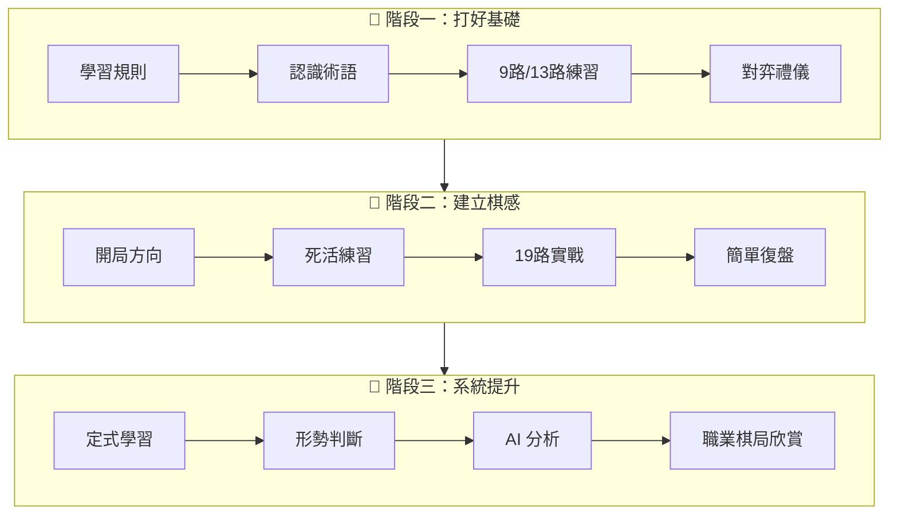

# 學圍棋

歡迎來到圍棋棋友專區！無論你是剛接觸圍棋的新手，還是想要精進棋藝的愛好者，這裡都有適合你的學習資源。

## 本區塊適合誰

- **完全新手**：從未接觸過圍棋，想從零開始學習
- **初學者**：已經知道基本規則，想要建立正確的觀念
- **業餘棋友**：有一定基礎，希望系統性地提升棋力
- **回歸棋友**：曾經學過圍棋，想要重新拾起這項興趣

## 內容總覽

### 入門篇

從最基礎的規則開始，帶你認識圍棋的世界：

- [圍棋規則](/docs/learn/introduction/rules) - 氣、提子、禁著點、劫、眼與活棋
- [基本術語](/docs/learn/introduction/terminology) - 棋盤、下棋、棋形、對局相關用語
- [對弈禮儀](/docs/learn/introduction/etiquette) - 下棋的禮節與態度
- [開局十手](/docs/learn/introduction/first-10-moves) - 佈局的基本方向與概念

### AI 時代

了解人工智慧如何改變圍棋：

- [AI 帶來的變化](/docs/learn/ai-era/changes) - 棋風與觀念的轉變
- [用 AI 學棋](/docs/learn/ai-era/learning-with-ai) - 善用工具輔助進步

## 學習路線圖

### 階段一：打好基礎（1-3 個月）

1. 熟讀規則，確保理解「氣」與「眼」的概念
2. 學習基本術語，能夠看懂棋譜解說
3. 在 9 路或 13 路小棋盤上練習
4. 養成良好的對弈禮儀

### 階段二：建立棋感（3-6 個月）

1. 理解開局的大方向
2. 練習簡單的死活題
3. 開始在 19 路大棋盤下棋
4. 每盤棋後簡單復盤

### 階段三：系統提升（6 個月以上）

1. 學習基本定式與常見變化
2. 培養形勢判斷能力
3. 善用 AI 工具分析自己的棋局
4. 欣賞職業棋士的對局，培養大局觀

:::tip 學習建議
圍棋的進步需要時間和耐心。比起急著學很多知識，不如先把基礎打穩。每天下一盤棋、做幾道死活題，持之以恆比什麼都重要。
:::

## 外部練習資源

以下是推薦的免費線上圍棋資源，可配合本站內容進行練習：

### 線上對弈平台

| 平台 | 說明 | 適合程度 |
|------|------|----------|
| [OGS (Online Go Server)](https://online-go.com/) | 國際化平台，支援多語言，有教學功能 | 所有程度 |
| [野狐圍棋](https://www.foxwq.com/) | 中國最大平台，職業棋士常駐 | 中級以上 |
| [弈城圍棋](http://www.eweiqi.com/) | 老牌平台，台灣棋友眾多 | 所有程度 |
| [KGS Go Server](https://www.gokgs.com/) | 歷史悠久，社群友善 | 所有程度 |

### 死活題練習

| 資源 | 說明 |
|------|------|
| [101圍棋網](https://www.101weiqi.com/) | 大量分級死活題，每日更新 |
| [黑嘉嘉圍棋](https://www.heijiajia.com.tw/) | 台灣職業棋士黑嘉嘉創辦，適合初學者 |
| [GoProblems.com](http://www.goproblems.com/) | 英文介面，題庫豐富 |

### AI 分析工具

| 工具 | 說明 |
|------|------|
| [KaTrain](https://github.com/sanderland/katrain) | 免費開源，整合 KataGo，適合自我訓練 |
| [Lizzie](https://github.com/featurecat/lizzie) | 經典 AI 分析介面 |
| [Sabaki](https://sabaki.yichuanshen.de/) | 現代化棋譜編輯器，可整合 AI |

### 棋譜與教學

| 資源 | 說明 |
|------|------|
| [Go Magic](https://gomagic.org/) | 互動式圍棋課程，多語言支援 |
| [Sensei's Library](https://senseis.xmp.net/) | 圍棋百科全書，英文資源 |
| [圍棋TV](https://www.weiqitv.com/) | 中文教學影片 |

:::note 使用建議
建議先在 OGS 或弈城建立帳號開始對弈，每天花 15-30 分鐘做死活題，定期用 KaTrain 復盤自己的棋局。
:::
