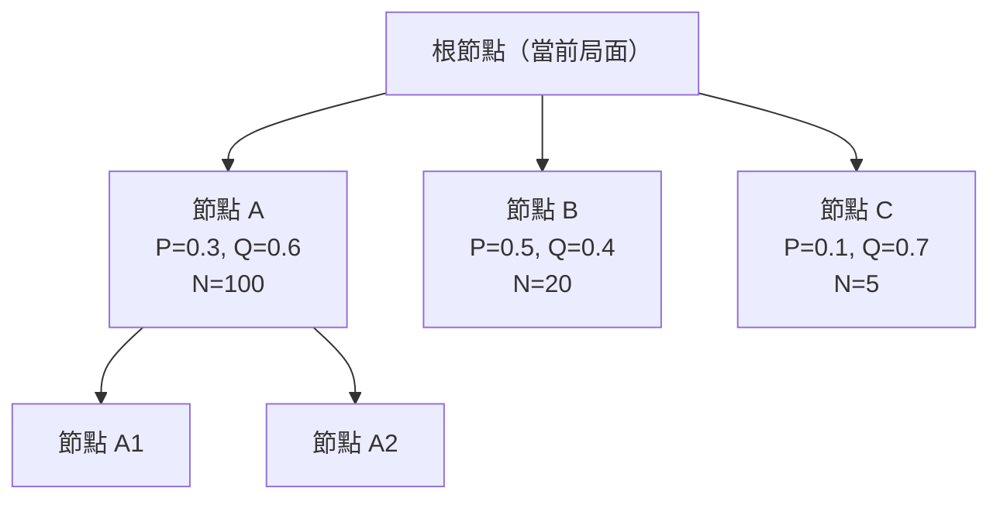
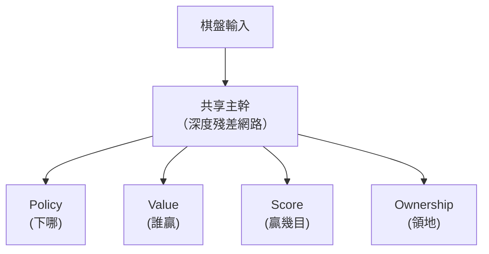
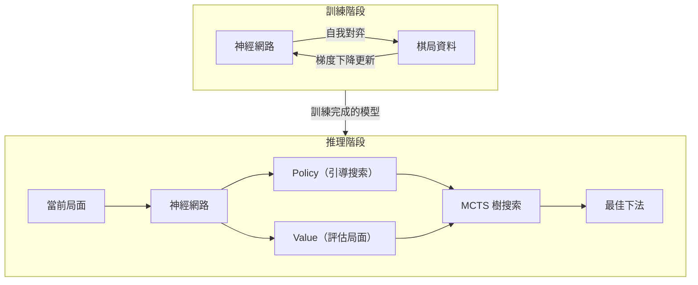

# 一篇文章搞懂圍棋 AI

讀完這篇文章，你將能夠：
- 理解為什麼圍棋對 AI 來說特別困難
- 解釋 AlphaGo 如何結合神經網路與樹搜索
- 說明自我對弈訓練的運作原理
- 了解 KataGo 相對於 AlphaGo 的改進

---

## 一、圍棋為什麼難？

### 搜索空間的詛咒

圍棋的合法局面數約為 **10^170**。這是什麼概念？

| 比較對象 | 數量級 |
|---------|--------|
| 宇宙中的原子數 | 10^80 |
| 圍棋合法局面數 | 10^170 |
| 西洋棋合法局面數 | 10^47 |

每一步平均有約 250 個合法選擇，一盤棋約 150 手。傳統的窮舉搜索根本不可能。

**動畫對應**：
- 🎬 B2：組合爆炸 ↔ 指數爆炸 — 棋步組合數如何爆炸性成長
- 🎬 B8：分支因子爆炸 ↔ 指數爆炸 — 250^150 的不可能性
- 🎬 F1：複雜度縮放 ↔ 狀態空間爆炸 — N×N 棋盤的分支因子

### 評估的困難

西洋棋可以簡單計算棋子價值（皇后=9、車=5...），但圍棋不行：
- 一顆棋子的價值取決於周圍的配置
- 領地是「圍」出來的，邊界模糊
- 厚勢、外勢等抽象概念難以量化

這就是為什麼圍棋被稱為「AI 的聖杯」——在 2016 年之前，沒有人認為 AI 能在 10 年內擊敗人類冠軍。

**動畫對應**：
- 🎬 A1：網格狀態 ↔ 離散網格 — 棋盤如何表示
- 🎬 A8：狀態編碼 ↔ 三態系統 — `{空,黑,白}` 的編碼

---

## 二、傳統方法的極限

### Minimax + Alpha-Beta 剪枝

傳統棋類 AI 的核心演算法：

```
Minimax 思路：
- 我方：選擇對自己最有利的棋步（max）
- 對方：假設對手也會選最有利的棋步（min）
- 交替進行，建立遊戲樹
```

**問題**：搜索深度受限。即使用 Alpha-Beta 剪枝減少計算量，圍棋的分支因子（~250）仍然太大。

**動畫對應**：
- 🎬 B3：Minimax ↔ 鞍點 — 極大極小的數學意義
- 🎬 B7：Alpha-Beta 剪枝 ↔ 相消干涉 — 如何減少無效搜索

### 純蒙地卡羅樹搜索（MCTS）

2006 年的突破——不需要評估函數：

```
MCTS 四步驟：
1. Selection：選擇有希望的節點
2. Expansion：擴展新的子節點
3. Simulation：隨機模擬到終局
4. Backpropagation：回傳勝負結果
```

**進步**：首次讓 AI 達到業餘段位水平。

**問題**：隨機模擬太不準確。需要大量模擬才能得到可靠的勝率估計。

**動畫對應**：
- 🎬 C5：MCTS 四步驟 ↔ 樹的遍歷 — Select→Expand→Simulate→Backprop
- 🎬 C1：隨機取樣 ↔ 蒙地卡羅積分 — random playout 的原理
- 🎬 C3：探索 vs 利用 ↔ 自由能權衡 — UCB 公式的意義

---

## 三、AlphaGo 的突破

### 核心洞見

**用神經網路取代 MCTS 中的隨機模擬**。

AlphaGo 訓練了兩個神經網路：

| 網路 | 輸入 | 輸出 | 功能 |
|------|------|------|------|
| **Policy Network** | 棋盤狀態 | 每個位置的落子機率 | 「下一步該下哪裡？」 |
| **Value Network** | 棋盤狀態 | 單一數值（-1 到 +1） | 「這個局面誰贏？」 |

**動畫對應**：
- 🎬 E1：策略網路 ↔ 策略分布 — Policy Network 輸出什麼
- 🎬 E2：價值網路 ↔ 價值函數 — Value Network 輸出什麼
- 🎬 D9：卷積運算 ↔ 空間濾波 — CNN 如何處理棋盤

### Policy Network（策略網路）

輸入：19×19 棋盤，編碼為多個特徵平面（黑子位置、白子位置、氣、歷史...）

輸出：361 個機率值，代表每個位置的落子可能性

```
棋盤狀態 → CNN → Softmax → [0.01, 0.02, ..., 0.15, ..., 0.01]
                              ↑ 第 42 位置機率 15%
```

**作用**：告訴 MCTS「哪些位置值得探索」，大幅減少搜索範圍。

### Value Network（價值網路）

輸入：同樣的棋盤狀態

輸出：單一數值，代表當前局面的勝率

```
棋盤狀態 → CNN → Tanh → 0.72（黑方勝率 72%）
```

**作用**：直接評估局面好壞，不需要模擬到終局。

### 神經網路 + MCTS 的結合

AlphaGo 使用 **PUCT**（Predictor Upper Confidence Bounds applied to Trees）公式來選擇節點：

```
選擇分數 = Q(s,a) + c × P(s,a) × √(N(s)) / (1 + N(s,a))

其中：
- Q(s,a)：該動作的平均價值（來自 Value Network）
- P(s,a)：該動作的先驗機率（來自 Policy Network）
- N(s)：父節點訪問次數
- N(s,a)：該動作訪問次數
- c：探索常數
```

**直觀理解**：
- Policy Network 說這步棋好 → P(s,a) 高 → 優先探索
- 探索越少的節點 → N(s,a) 小 → 分數越高 → 鼓勵探索
- Value Network 評估好 → Q(s,a) 高 → 優先選擇

**動畫對應**：
- 🎬 E4：PUCT 公式 ↔ 有偏擴散 — 策略引導搜尋的數學
- 🎬 C3：探索 vs 利用 ↔ 自由能權衡 — 公式中的平衡

### 搜索過程圖解



**搜索步驟**：
1. 從根節點開始，用 PUCT 選擇子節點
2. 沿著樹向下，直到到達葉節點
3. 用 Value Network 評估葉節點
4. 將評估結果回傳更新路徑上所有節點的 Q 值
5. 重複數千次
6. 選擇訪問次數最多的動作

---

## 四、訓練：從人類棋譜到超越人類

### 階段一：監督學習

**目標**：學習人類專家的下法

```
訓練資料：3000 萬局人類職業棋譜
輸入：棋盤狀態
標籤：人類下一步的位置

損失函數：交叉熵
Loss = -log(P(人類實際下的位置))
```

結果：Policy Network 能以 57% 的準確率預測人類棋手的下一步。

**動畫對應**：
- 🎬 D3：前向傳播 ↔ 前饋網路
- 🎬 D5：梯度下降 ↔ 球滾下山

### 階段二：強化學習

**目標**：超越人類水平

監督學習只能學到人類的上限。要超越人類，需要**自我對弈**：

```
自我對弈訓練循環：

1. 用當前 Policy Network 控制黑白雙方
2. 進行完整對局，記錄每步棋
3. 根據最終勝負，更新 Policy Network
   - 贏棋的一方：增加那些動作的機率
   - 輸棋的一方：減少那些動作的機率
4. 重複數百萬局
```

這就是**強化學習**的核心：從結果（勝負）反推過程（每步棋的好壞）。

**動畫對應**：
- 🎬 H4：策略梯度 ↔ 策略梯度法
- 🎬 H5：經驗回放 ↔ 經驗緩衝區

### 階段三：訓練 Value Network

```
訓練資料：自我對弈產生的棋局
輸入：棋盤狀態
標籤：最終勝負（+1 或 -1）

損失函數：均方誤差
Loss = (V(s) - 實際結果)²
```

### 自我對弈循環

```
初始模型 → 自我對弈 → 收集棋譜 → 訓練新模型 → 更強模型 → 重複
```

**動畫對應**：
- 🎬 E5：自我對弈 ↔ 不動點收斂 — 系統如何趨向穩定
- 🎬 H1：MDP ↔ 馬可夫鏈 — 狀態轉移的數學模型
- 🎬 E6：棋力曲線 ↔ S 曲線成長 — Elo 如何成長

---

## 五、AlphaGo Zero：從零開始

2017 年，DeepMind 發布了 AlphaGo Zero，證明**完全不需要人類棋譜**。

### 與原版 AlphaGo 的差異

| 面向 | AlphaGo | AlphaGo Zero |
|------|---------|--------------|
| 人類棋譜 | 需要 | **不需要** |
| 網路架構 | 分離的 Policy + Value | **單一網路，雙頭輸出** |
| 輸入特徵 | 48 個特徵平面 | **17 個特徵平面** |
| 訓練時間 | 數月 | **3 天** |
| 棋力 | 擊敗李世乭 | **100:0 擊敗原版 AlphaGo** |

### 為什麼從零開始反而更強？

1. **人類棋譜是偏見**：人類有盲點，AI 學習人類也會繼承這些盲點
2. **自我發現**：從零開始，AI 能發現人類從未想過的下法
3. **更簡潔的架構**：單一網路、更少特徵，訓練更高效

**動畫對應**：
- 🎬 E7：從零開始 ↔ 自組織
- 🎬 E3：雙頭網路 ↔ 多任務學習

### 訓練曲線的驚人之處

```
Day 0: 隨機亂下
Day 1: 發現基本規則（吃子、做眼）
Day 2: 發現定式（角部下法）
Day 3: 超越所有人類
```

AlphaGo Zero 在 3 天內「重新發現」了人類數千年累積的棋理，然後超越了它。

---

## 六、KataGo：更快、更強、更實用

### 為什麼需要 KataGo？

AlphaGo 是閉源的，需要數千個 TPU 訓練。普通開發者無法使用。

KataGo 是 **David Wu** 於 2019 年發布的開源專案，達到同等棋力只需要：

| 資源 | AlphaGo | KataGo |
|------|---------|--------|
| 硬體 | 數千 TPU | **30 GPU** |
| 時間 | 數月 | **19 天** |
| 效率 | 基準 | **提升 50 倍** |

### AlphaGo vs KataGo 對比

| 比較項目 | AlphaGo | KataGo |
|---------|---------|--------|
| 神經網路架構 | 分離式 | **整合式多頭** |
| 訓練資源 | 數千 TPU | **30 GPU** |
| 效率 | 基準 | **50 倍提升** |
| 開源狀態 | 閉源 | **完全開源** |
| 輸出功能 | 策略+勝率 | 策略+勝率+**目數+領地** |

### KataGo 的關鍵創新

#### 1. 整合式多頭網路

AlphaGo 用兩個分離的網路（Policy + Value），KataGo 用**單一網路，多個輸出頭**：



**好處**：共享特徵提取，減少計算量，同時獲得更多資訊。

**動畫對應**：
- 🎬 E3：雙頭網路 ↔ 多任務學習
- 🎬 D12：殘差連接 ↔ 電路並聯

#### 2. 輔助訓練目標

KataGo 不只預測「誰贏」，還預測：
- **Score**：贏多少目
- **Ownership**：每個位置最終歸誰

這些輔助目標讓神經網路更深刻理解局面，而不只是預測勝負。

#### 3. Playout Cap 隨機化

傳統訓練：每局都用固定的搜索深度

KataGo：**隨機改變每局的搜索深度**

```
- 有時用 600 次 MCTS（深度搜索）
- 有時用 100 次 MCTS（快速搜索）
- 有時用 20 次 MCTS（幾乎純神經網路）
```

**好處**：神經網路學會在各種搜索深度下都表現良好，提升泛化能力。

#### 4. 全局池化（Global Pooling）

傳統 CNN 只看局部特徵。KataGo 加入全局池化層，讓網路能「綜觀全局」：

```
局部卷積特徵 → 全局平均池化 → 與局部特徵結合 → 更好的全局判斷
```

**動畫對應**：
- 🎬 G1：高維表示 ↔ 向量空間
- 🎬 D11：池化 ↔ 降採樣

---

## 七、總結：一張圖看懂整個系統



### 關鍵要點

1. **神經網路解決評估問題**：不需要手工設計評估函數
2. **MCTS 解決搜索問題**：在神經網路的引導下高效搜索
3. **自我對弈產生資料**：不需要人類棋譜，從零開始學習
4. **強化學習持續改進**：從勝負結果反推，不斷提升

---

## 延伸閱讀

- **想更深入 AlphaGo**？→ [AlphaGo 完整解析](/docs/alphago/)
- **想了解 KataGo 細節**？→ [KataGo 的關鍵創新](./katago-innovations)
- **想查特定概念**？→ [概念速查表](/docs/animations/)
- **想動手實作**？→ [30 分鐘跑起第一個圍棋 AI](../hands-on/)

---

## 參考資料

1. Silver, D., et al. (2016). "Mastering the game of Go with deep neural networks and tree search." *Nature*.
2. Silver, D., et al. (2017). "Mastering the game of Go without human knowledge." *Nature*.
3. Wu, D. (2019). "Accelerating Self-Play Learning in Go." *arXiv*.
4. [KataGo GitHub](https://github.com/lightvector/KataGo)
