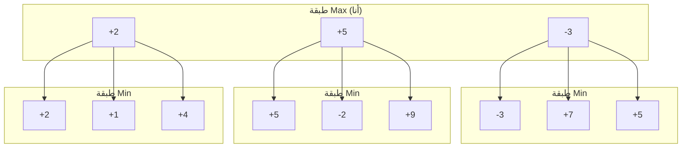
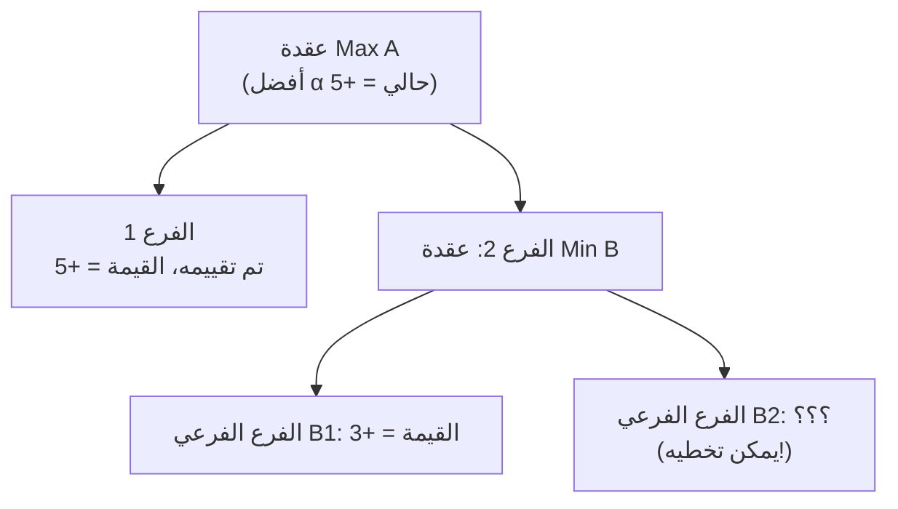

import { MCTSTree, GoBoard } from '@site/src/components/D3Charts';

# حدود الأساليب التقليدية

قبل ظهور التعلم العميق، قضى الباحثون عقودًا في محاولة حل مشكلة الغو باستخدام الأساليب "التقليدية". من خوارزمية Minimax إلى بحث شجرة مونت كارلو (MCTS)، جعل كل تقدم الغو الحاسوبي أقوى قليلاً، لكنه لم يصل أبدًا إلى مستوى اللاعبين المحترفين البشريين.

ستتناول هذه المقالة بعمق مبادئ هذه الأساليب ومزاياها وعيوبها، ولماذا واجهت عنق الزجاجة في الغو.

---

## خوارزمية Minimax: أساس نظرية الألعاب

### المبدأ الأساسي

**خوارزمية Minimax** هي المفهوم الأساسي لنظرية الألعاب، اقترحها John von Neumann في عام 1928. فكرتها الأساسية هي:

> في لعبة صفرية المجموع، يجب أن أختار الخيار الذي يبقيني في أفضل وضع حتى بعد "أفضل استجابة" من الخصم.

بعبارة أخرى:
- **أنا (Max)** أريد تعظيم النتيجة
- **الخصم (Min)** يريد تقليل نتيجتي
- يجب أن أفترض أن الخصم سيقوم دائمًا بأفضل استجابة

### الصياغة الرياضية

لتكن V(s) قيمة الوضع s، معرفة تكراريًا كما يلي:

```
V(s) = eval(s)                        // إذا كان s وضعًا نهائيًا
V(s) = max{ V(result(s, a)) | a ∈ A(s) }  // إذا كان دور Max
V(s) = min{ V(result(s, a)) | a ∈ A(s) }  // إذا كان دور Min
```

حيث:
- **A(s)**: جميع الحركات القانونية في الوضع s
- **result(s, a)**: النتيجة بعد تنفيذ الإجراء a في الوضع s
- **eval(s)**: تقييم الوضع النهائي

### رسم توضيحي لشجرة البحث



في هذا المثال:
- طبقة Min ستختار القيمة الأقل ملاءمة لي (الحد الأدنى)
- طبقة Max ستختار القيمة الأكثر ملاءمة لي (الحد الأقصى)
- في النهاية، يجب أن يختار Max الفرع الأوسط (+5)

### تنفيذ الكود

```python
def minimax(state, depth, is_max_turn):
    """
    التنفيذ الأساسي لخوارزمية Minimax

    Args:
        state: الوضع الحالي
        depth: عمق البحث
        is_max_turn: هل دور Max للعب

    Returns:
        (أفضل قيمة، أفضل حركة)
    """
    # شرط الإنهاء: الوصول إلى حد العمق أو انتهاء اللعبة
    if depth == 0 or is_terminal(state):
        return evaluate(state), None

    legal_moves = get_legal_moves(state)
    best_move = None

    if is_max_turn:
        best_value = float('-inf')
        for move in legal_moves:
            next_state = apply_move(state, move)
            value, _ = minimax(next_state, depth - 1, False)
            if value > best_value:
                best_value = value
                best_move = move
    else:
        best_value = float('inf')
        for move in legal_moves:
            next_state = apply_move(state, move)
            value, _ = minimax(next_state, depth - 1, True)
            if value < best_value:
                best_value = value
                best_move = move

    return best_value, best_move
```

### مشاكل Minimax في الغو

#### 1. انفجار فضاء البحث

كما ذُكر في [المقالة السابقة](../why-go-is-hard)، معامل التفرع في الغو حوالي 250. لرؤية N حركة:

**عدد العقد ≈ 250^N**

| العمق | عدد العقد | بحساب تقييم مليون عقدة في الثانية |
|------|--------|--------------------------|
| 2 | 62,500 | 0.06 ثانية |
| 4 | 3.9 مليار | 65 دقيقة |
| 6 | 2.4×10^14 | 7,600 سنة |
| 8 | 1.5×10^19 | 480 مليون سنة |

رؤية 6 حركات تتطلب 7,600 سنة، ناهيك عن رؤية اللعبة كاملة.

#### 2. صعوبة دالة التقييم

حتى لو نظرنا فقط إلى 4 حركات، نحتاج أيضًا إلى **دالة تقييم** دقيقة للحكم على قيمة الأوضاع غير النهائية. لكن كما ذُكر في المقالة السابقة، تقييم الوضع في الغو صعب للغاية.

**الخلاصة: Minimax البحت غير قابل للتطبيق تمامًا في الغو.**

---

## تقليم ألفا-بيتا: تقليل البحث غير المفيد

### الرؤية الأساسية

الرؤية الأساسية لتقليم ألفا-بيتا هي: **لا نحتاج إلى البحث في كل فرع**.

إذا كنا نعلم بالفعل أن فرعًا ما "بالتأكيد سيء"، يمكننا تخطيه مباشرة.

### مبدأ التقليم



في هذا المثال:
- A لديه بالفعل خيار بقيمة +5
- الفرع الفرعي الأول لـ B هو +3، لذا القيمة النهائية لـ B ≤ +3
- بما أن B ≤ +3 < +5، فإن A لن يختار B
- **B2 لا يحتاج إلى تقييم**

هذا هو **تقليم بيتا**. وبالمثل، هناك **تقليم ألفا**.

### الصياغة الرياضية

نقدم معاملين:
- **α (ألفا)**: الحد الأدنى الذي يمكن لـ Max ضمانه حاليًا
- **β (بيتا)**: الحد الأقصى الذي يمكن لـ Min ضمانه حاليًا

شروط التقليم:
- في عقدة Max، إذا كانت القيمة ≥ β، نقوم بالتقليم (تقليم بيتا)
- في عقدة Min، إذا كانت القيمة ≤ α، نقوم بالتقليم (تقليم ألفا)

### تنفيذ الكود

```python
def alpha_beta(state, depth, alpha, beta, is_max_turn):
    """
    خوارزمية تقليم ألفا-بيتا

    Args:
        state: الوضع الحالي
        depth: عمق البحث
        alpha: الحد الأدنى لـ Max
        beta: الحد الأقصى لـ Min
        is_max_turn: هل دور Max للعب

    Returns:
        (القيمة، أفضل حركة)
    """
    if depth == 0 or is_terminal(state):
        return evaluate(state), None

    legal_moves = get_legal_moves(state)
    best_move = None

    if is_max_turn:
        value = float('-inf')
        for move in legal_moves:
            next_state = apply_move(state, move)
            child_value, _ = alpha_beta(next_state, depth - 1,
                                        alpha, beta, False)
            if child_value > value:
                value = child_value
                best_move = move
            alpha = max(alpha, value)
            if value >= beta:
                break  # تقليم بيتا
        return value, best_move
    else:
        value = float('inf')
        for move in legal_moves:
            next_state = apply_move(state, move)
            child_value, _ = alpha_beta(next_state, depth - 1,
                                        alpha, beta, True)
            if child_value < value:
                value = child_value
                best_move = move
            beta = min(beta, value)
            if value <= alpha:
                break  # تقليم ألفا
        return value, best_move

# طريقة الاستدعاء
value, best_move = alpha_beta(state, depth=4,
                               alpha=float('-inf'),
                               beta=float('inf'),
                               is_max_turn=True)
```

### كفاءة التقليم

في الحالة المثالية (ترتيب مثالي للحركات)، يمكن لألفا-بيتا تقليل معامل التفرع الفعال من b إلى √b:

**معامل التفرع الفعال = b^0.5**

هذا يعني:
- الشطرنج الغربي: من 35 إلى ~6
- الغو: من 250 إلى ~16

| العمق | عدد العقد الأصلي | ألفا-بيتا (مثالي) | نسبة التسريع |
|------|-----------|-------------------|--------|
| 4 | 3.9 مليار | 65,000 | 60,000× |
| 6 | 2.4×10^14 | 16 مليون | 1.5×10^7 × |
| 8 | 1.5×10^19 | 4.2 مليار | 3.6×10^9 × |

### لماذا لا يزال غير كافٍ

حتى مع تقليم ألفا-بيتا، يظل الغو صعب المعالجة:

#### 1. التقليم المثالي يتطلب ترتيبًا مثاليًا

للوصول إلى كفاءة التقليم المثالية، نحتاج إلى البحث في الفرع "الأفضل" أولاً. لكن لمعرفة أي فرع هو الأفضل، نحتاج إلى البحث... هذه مشكلة الدجاجة والبيضة.

في الواقع، كفاءة التقليم في الغو أقل بكثير من القيمة المثالية، وقد يظل معامل التفرع الفعال 50-100.

#### 2. العمق لا يزال غير كافٍ

حتى لو انخفض معامل التفرع الفعال إلى 50، فإن رؤية 10 حركات لا تزال تتطلب 50^10 ≈ 10^17 عقدة. هذا لا يزال كثيرًا جدًا للحاسوب.

#### 3. عنق زجاجة دالة التقييم

ألفا-بيتا تحل فقط مشكلة "كفاءة البحث"، لا تحل مشكلة "دقة التقييم". دالة تقييم سيئة مع بحث سريع جدًا تعطي نتائج سيئة.

**الخلاصة: ألفا-بيتا حسّنت بشكل كبير ذكاء الشطرنج الاصطناعي، لكن مساعدتها للغو محدودة.**

---

## طريقة مونت كارلو البحتة: قوة العشوائية

### التخلي عن دالة التقييم

في التسعينيات، بدأ الباحثون تجربة فكرة جذرية: **عدم استخدام دالة التقييم**.

بدلاً من ذلك، استخدموا **المحاكاة العشوائية** (Random Playout):

1. البدء من الوضع الحالي
2. يلعب الطرفان بشكل عشوائي حتى انتهاء اللعبة
3. تسجيل النتيجة (فوز/خسارة)
4. تكرار N مرة وحساب معدل الفوز

### مبدأ التقدير الإحصائي

وفقًا لقانون الأعداد الكبيرة، عندما يكون عدد المحاكاة N كبيرًا بما فيه الكفاية:

**V̂(s) = عدد مرات الفوز في المحاكاة / N ≈ V(s)**

الخطأ المعياري لهذا التقدير هو:

**SE = √(V(s)(1-V(s))/N) ≈ 1/(2√N)**

| عدد المحاكاة | الخطأ المعياري |
|----------|---------|
| 100 | 5% |
| 1,000 | 1.6% |
| 10,000 | 0.5% |
| 100,000 | 0.16% |

### تنفيذ الكود

```python
import random

def random_playout(state, player):
    """
    من الوضع الحالي، يلعب الطرفان عشوائيًا حتى النهاية

    Returns:
        1 إذا فاز اللاعب، 0 إذا خسر
    """
    current = state.copy()
    current_player = player

    while not is_terminal(current):
        legal_moves = get_legal_moves(current)
        if not legal_moves:
            current_player = opponent(current_player)
            continue

        # اختيار حركة عشوائية
        move = random.choice(legal_moves)
        current = apply_move(current, move)
        current_player = opponent(current_player)

    return 1 if get_winner(current) == player else 0


def monte_carlo_move_selection(state, player, num_simulations=10000):
    """
    استخدام طريقة مونت كارلو لاختيار أفضل حركة
    """
    legal_moves = get_legal_moves(state)

    if len(legal_moves) == 0:
        return None

    # توزيع عدد المحاكاة لكل حركة قانونية
    sims_per_move = num_simulations // len(legal_moves)

    best_move = None
    best_win_rate = -1

    for move in legal_moves:
        next_state = apply_move(state, move)

        wins = 0
        for _ in range(sims_per_move):
            wins += random_playout(next_state, opponent(player))

        # معدل فوز الخصم المنخفض = معدل فوزي المرتفع
        my_win_rate = 1 - (wins / sims_per_move)

        if my_win_rate > best_win_rate:
            best_win_rate = my_win_rate
            best_move = move

    return best_move, best_win_rate
```

### المزايا والقيود

#### المزايا

1. **لا حاجة لدالة تقييم**: تعتمد كليًا على المحاكاة
2. **تنطبق على أي لعبة**: ما عليك سوى معرفة القواعد
3. **تعطي تقديرًا احتماليًا**: تعرف "مدى اليقين"

#### القيود

1. **العشوائية قوية جدًا**: الفجوة بين اللعب العشوائي واللعب المحترف كبيرة جدًا
2. **تتطلب محاكاة كثيرة**: كل حركة تتطلب عشرات الآلاف من المحاكاة
3. **نقاط عمياء تكتيكية**: التكتيكات الرئيسية قد تُفوّت عشوائيًا

### أداء مونت كارلو البحت في الغو

باستخدام طريقة مونت كارلو البحتة، يمكن لبرامج الغو الوصول تقريبًا إلى:

> مستوى **هاوٍ 5-10 كيو**

هذا أفضل من البرامج السابقة التي استخدمت Minimax + دالة تقييم فقط، لكن الفجوة مع المستوى المحترف لا تزال هائلة.

---

## اختراق MCTS (2006)

### ولادة خوارزمية UCT

في عام 2006، اقترح Rémi Coulom خوارزمية **MCTS (Monte Carlo Tree Search)**، التي تجمع بين مزايا بحث الشجرة ومحاكاة مونت كارلو. في نفس العام، اقترح Levente Kocsis و Csaba Szepesvári خوارزمية **UCT (Upper Confidence Bounds for Trees)**، التي وفرت الأساس النظري لـ MCTS.

كان هذا **اختراقًا تاريخيًا** في الغو الحاسوبي.

### صيغة UCB1

جوهر MCTS هو صيغة **UCB1 (Upper Confidence Bound)**:

```
UCB1(s, a) = X̄(s,a) + C × √(ln(Ns) / n(s,a))
```

حيث:
- **X̄(s,a)**: متوسط قيمة اتخاذ الإجراء a في الحالة s (معدل الفوز)
- **Ns**: إجمالي عدد مرات زيارة الحالة s
- **n(s,a)**: عدد مرات اتخاذ الإجراء a في الحالة s
- **C**: ثابت الاستكشاف (عادة C = √2)

هذه الصيغة توازن بذكاء بين **الاستغلال** (اختيار المعروف أنه جيد) و**الاستكشاف** (تجربة المجهول).

### المراحل الأربع لـ MCTS

<MCTSTree showPUCT={true} width={700} height={450} />

تتضمن كل تكرار من MCTS أربع مراحل:

#### 1. Selection (الاختيار)

من العقدة الجذر، استخدم صيغة UCB1 لاختيار العقد الفرعية حتى الوصول إلى عقدة ورقة.

```python
def select(node):
    """استخدام UCB1 لاختيار أفضل عقدة فرعية"""
    while node.is_fully_expanded():
        node = max(node.children,
                   key=lambda c: ucb1(c, node.visits))
    return node

def ucb1(child, parent_visits, C=1.414):
    """صيغة UCB1"""
    if child.visits == 0:
        return float('inf')  # العقد غير المزارة لها الأولوية

    exploitation = child.wins / child.visits
    exploration = C * math.sqrt(math.log(parent_visits) / child.visits)

    return exploitation + exploration
```

#### 2. Expansion (التوسيع)

إضافة عقدة فرعية واحدة أو أكثر في العقدة الورقة.

```python
def expand(node, state):
    """توسيع العقدة"""
    legal_moves = get_legal_moves(state)
    untried = [m for m in legal_moves if m not in node.tried_moves]

    if untried:
        move = random.choice(untried)
        new_state = apply_move(state, move)
        child = Node(move=move, parent=node)
        node.children.append(child)
        node.tried_moves.add(move)
        return child, new_state

    return node, state
```

#### 3. Simulation (المحاكاة)

من العقدة الجديدة، إجراء محاكاة عشوائية حتى انتهاء اللعبة.

```python
def simulate(state, player):
    """محاكاة عشوائية حتى انتهاء اللعبة"""
    return random_playout(state, player)
```

#### 4. Backpropagation (الانتشار العكسي)

إرجاع نتيجة المحاكاة إلى جميع العقد الأصل.

```python
def backpropagate(node, result):
    """إرجاع النتيجة إلى جميع الأسلاف"""
    while node is not None:
        node.visits += 1
        node.wins += result
        result = 1 - result  # تبديل المنظور
        node = node.parent
```

### التنفيذ الكامل لـ MCTS

```python
class MCTSNode:
    def __init__(self, move=None, parent=None):
        self.move = move
        self.parent = parent
        self.children = []
        self.wins = 0
        self.visits = 0
        self.tried_moves = set()

    def is_fully_expanded(self, legal_moves):
        return len(self.tried_moves) == len(legal_moves)


def mcts(root_state, player, num_iterations=10000):
    """
    الدالة الرئيسية لـ MCTS

    Args:
        root_state: الوضع الابتدائي
        player: اللاعب الحالي
        num_iterations: عدد التكرارات

    Returns:
        أفضل حركة
    """
    root = MCTSNode()

    for _ in range(num_iterations):
        node = root
        state = root_state.copy()
        current_player = player

        # 1. Selection
        while node.children and node.is_fully_expanded(get_legal_moves(state)):
            node = max(node.children,
                      key=lambda c: ucb1(c, node.visits))
            state = apply_move(state, node.move)
            current_player = opponent(current_player)

        # 2. Expansion
        legal_moves = get_legal_moves(state)
        if not node.is_fully_expanded(legal_moves) and not is_terminal(state):
            move = random.choice([m for m in legal_moves
                                  if m not in node.tried_moves])
            state = apply_move(state, move)
            child = MCTSNode(move=move, parent=node)
            node.children.append(child)
            node.tried_moves.add(move)
            node = child
            current_player = opponent(current_player)

        # 3. Simulation
        result = simulate(state, current_player)

        # 4. Backpropagation
        backpropagate(node, result)

    # اختيار العقدة الفرعية ذات أكثر الزيارات
    return max(root.children, key=lambda c: c.visits).move
```

### لماذا MCTS فعال؟

نجاح MCTS له عدة عوامل رئيسية:

#### 1. التركيز التدريجي

MCTS لا يبحث في جميع الفروع بالتساوي، بل يستثمر المزيد من الموارد في الفروع الأكثر وعدًا. هذا يسمح له "بتجاهل" الحركات السيئة الواضحة.

#### 2. خوارزمية في أي وقت

يمكن إيقاف MCTS في أي وقت وإعطاء أفضل إجابة حالية. كلما زاد الوقت، كانت الإجابة أفضل.

#### 3. لا حاجة لدالة تقييم

MCTS يقدر القيمة من خلال المحاكاة، دون الحاجة لتصميم دالة تقييم يدويًا.

### 2006-2015: عصر MCTS

ظهور MCTS أدخل الغو الحاسوبي في عصر جديد:

| البرنامج | السنة | الميزات | القوة |
|------|------|------|------|
| **Crazy Stone** | 2006 | أول برنامج غو MCTS | هاوٍ عالي الدان |
| **MoGo** | 2007 | MCTS محسّن | هاوٍ 5 دان |
| **Zen** | 2009 | إضافة التعرف على الأنماط | هاوٍ 6 دان |
| **Crazy Stone** | 2013 | هزم محترف 9 دان بأربعة أحجار هانديكاب | محترف أول دان (مع هانديكاب) |

هذا تقدم تاريخي، لكن لا تزال هناك فجوة هائلة:

> أقوى برامج MCTS، **بدون هانديكاب**، لا تزال غير قادرة على هزيمة لاعبين محترفين.

---

## عنق زجاجة دالة التقييم

### قيود الميزات اليدوية

قبل MCTS، حاول الباحثون تصميم **ميزات يدوية** مختلفة لتقييم الوضع:

#### الميزات الشائعة

```python
def evaluate_position(state):
    """دالة تقييم مصممة يدويًا"""
    score = 0

    # 1. تقدير الأرض
    score += count_territory(state, BLACK) - count_territory(state, WHITE)

    # 2. حريات الأحجار (عدد الأنفاس)
    score += sum(liberties(group) for group in groups(state, BLACK))
    score -= sum(liberties(group) for group in groups(state, WHITE))

    # 3. عدد العيون
    score += count_eyes(state, BLACK) * 10
    score -= count_eyes(state, WHITE) * 10

    # 4. قوة الاتصال
    score += connectivity_score(state, BLACK)
    score -= connectivity_score(state, WHITE)

    # ... المزيد من الميزات

    return score
```

#### المشاكل

1. **الميزات غير مكتملة**: العديد من العوامل في الحدس البشري صعبة الوصف برمجيًا
2. **صعوبة ضبط الأوزان**: كيف نحدد الأهمية النسبية لكل ميزة؟
3. **المحلي مقابل العالمي**: الحساب المحلي سهل، الحكم العالمي صعب
4. **التفاعلات**: صعوبة نمذجة التفاعلات بين الميزات

### مشكلة المحاكاة في MCTS

حتى في MCTS بدون استخدام دالة تقييم مباشرة، **جودة المحاكاة** تظل عنق زجاجة رئيسي.

#### مشاكل المحاكاة العشوائية

اللعب العشوائي ينتج العديد من الأوضاع "غير المعقولة"، مما يؤدي إلى تقديرات غير دقيقة:

- تنين كبير يُسلّم بلا مقابل
- يمكن الأسر لكن لا يُؤسر
- تفويت قتل بسيط

#### محاولات التحسين

حاول الباحثون إضافة **معرفة مسبقة** في المحاكاة:

```python
def simulation_policy(state, legal_moves):
    """
    سياسة محاكاة مع معرفة مسبقة
    """
    # النظر أولاً في:
    # 1. الأسر
    # 2. الهروب
    # 3. الاتصال
    # 4. احتلال مواقع كبيرة
    # ...

    for move in legal_moves:
        if is_capture(state, move):
            return move
        if saves_group(state, move):
            return move

    # الباقي عشوائي
    return random.choice(legal_moves)
```

لكن هذه القواعد الإرشادية:
- تزيد تكلفة الحساب
- قد تُدخل تحيزًا
- لا تزال غير دقيقة بما فيه الكفاية

### لماذا نحتاج الشبكات العصبية

عنق زجاجة الأساليب التقليدية هو في الأساس مشكلة **تعلم التمثيل**:

> كيف نتعلم ميزات "الحركة الجيدة" من بكسلات اللوحة (حالة 361 نقطة)؟

هذا بالضبط نقطة قوة **التعلم العميق**:
- **تعلم الميزات تلقائيًا**: لا حاجة لتصميم يدوي
- **التعيين اللاخطي**: يمكنه التقاط العلاقات المعقدة
- **التدريب من طرف إلى طرف**: من المدخلات مباشرة إلى المخرجات

اختراق التعلم العميق في ImageNet في 2012 جعل الباحثين يتساءلون:

> إذا كانت الشبكات العصبية تستطيع "فهم" الصور، هل يمكنها أيضًا "فهم" لوحة الغو؟

الإجابة على هذا السؤال هي AlphaGo.

---

## ملخص حدود الأساليب التقليدية

| الطريقة | المزايا | مشاكلها في الغو |
|------|------|-------------|
| **Minimax** | كاملة نظريًا، حل أمثل | معامل التفرع كبير جدًا، لا يمكن البحث عميقًا |
| **ألفا-بيتا** | تقليل كبير في البحث | معامل التفرع الفعال لا يزال عاليًا جدًا |
| **مونت كارلو البحت** | لا حاجة لدالة تقييم | جودة المحاكاة العشوائية سيئة جدًا |
| **MCTS** | بحث ذكي مركّز | المحاكاة لا تزال غير جيدة بما فيه الكفاية، تصل إلى هاوٍ عالي الدان |

### عنق الزجاجة الأساسي

في النهاية، تواجه الأساليب التقليدية عنق زجاجة رئيسيين:

#### 1. مشكلة التقييم
- لا توجد دالة تقييم جيدة
- لا يمكن قياس المفاهيم المجردة مثل "السماكة" و"النفوذ"
- الميزات اليدوية ليست معبرة بما فيه الكفاية

#### 2. مشكلة البحث
- حتى مع التقليم، فضاء البحث لا يزال كبيرًا جدًا
- لا يمكن رؤية تغييرات عميقة بما فيه الكفاية
- جودة المحاكاة تؤثر على دقة التقدير

### حل AlphaGo

AlphaGo حل هاتين المشكلتين بالتعلم العميق:

1. **Policy Network**: تعلم "أين قد تكون الحركة الجيدة"، تقليل معامل التفرع الفعال
2. **Value Network**: تعلم "من الأرجح أن يفوز"، استبدال دالة التقييم اليدوية
3. **دمج MCTS**: استخدام الشبكات العصبية لتوجيه البحث، استخدام البحث لتحسين القرارات

هذا ليس مجرد "استبدال دالة التقييم بشبكة عصبية"، بل هو بنية جديدة تمامًا.

---

## توافق الرسوم المتحركة

المفاهيم الأساسية في هذه المقالة وأرقام الرسوم المتحركة المقابلة:

| الرقم | المفهوم | المقابل الفيزيائي/الرياضي |
|------|------|--------------|
| 🎬 B3 | بحث Minimax | نظرية الألعاب، اللعبة صفرية المجموع |
| 🎬 C5 | المراحل الأربع لـ MCTS | طريقة مونت كارلو، UCB |
| 🎬 C2 | صيغة UCB1 | ماكينات القمار متعددة الأذرع، توازن الاستكشاف-الاستغلال |
| 🎬 C4 | نمو شجرة البحث | التوسع التدريجي |

---

## قراءات إضافية

- **المقالة السابقة**: [لماذا الغو صعب؟](../why-go-is-hard) — فضاء الحالة وصعوبة التقييم
- **المقالة التالية**: [تمثيل حالة اللوحة](../board-representation) — Zobrist Hashing، ترميز الميزات
- **تعمق تقني**: [دمج MCTS والشبكات العصبية](../mcts-neural-combo) — البنية الأساسية لـ AlphaGo

---

## المراجع

1. Coulom, R. (2006). "Efficient Selectivity and Backup Operators in Monte-Carlo Tree Search." *Computers and Games*, 72-83. — الورقة الأصلية لـ MCTS
2. Kocsis, L., & Szepesvári, C. (2006). "Bandit based Monte-Carlo Planning." *ECML*, 282-293. — خوارزمية UCT
3. Browne, C., et al. (2012). "A Survey of Monte Carlo Tree Search Methods." *IEEE TCIAIG*, 4(1), 1-43. — مراجعة MCTS
4. Gelly, S., & Silver, D. (2011). "Monte-Carlo tree search and rapid action value estimation in computer Go." *Artificial Intelligence*, 175(11), 1856-1875. — تطبيق MCTS في الغو
