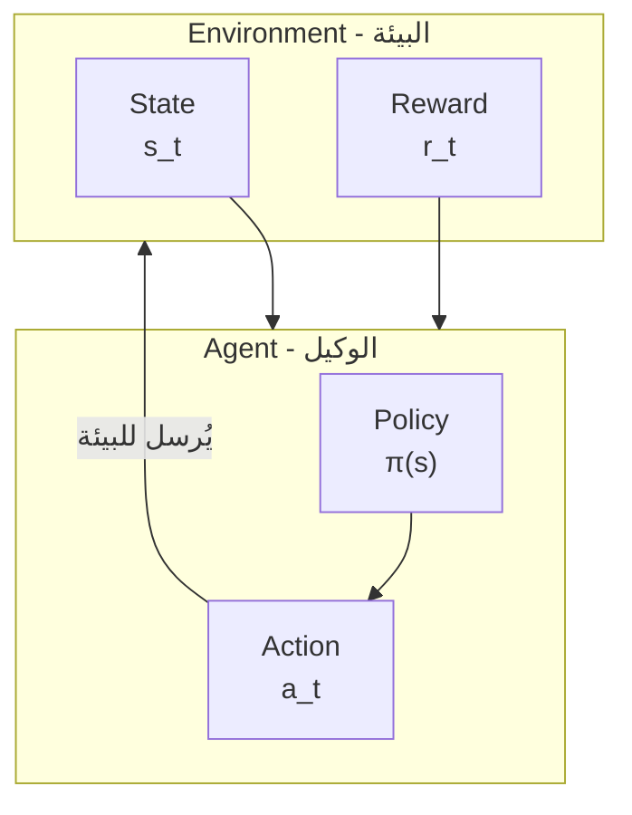

# مقدمة في التعلم المعزز

في المقالات السابقة، قدمنا كيف استخدم AlphaGo التعلم الخاضع للإشراف للتعلم من سجلات اللعب البشرية. لكن للتعلم الخاضع للإشراف قيد جوهري: **يمكنه فقط تقليد البشر، لا يمكنه تجاوزهم**.

لجعل الذكاء الاصطناعي يتجاوز البشر، نحتاج إلى طريقة تعلم مختلفة — **التعلم المعزز (Reinforcement Learning, RL)**.

ستأخذك هذه المقالة من الصفر لفهم المفاهيم الأساسية للتعلم المعزز، مما يضع الأساس للعب الذاتي وتكامل MCTS اللاحق.

---

## ما هو التعلم المعزز؟

### المقارنة مع طرق التعلم الأخرى

يوجد ثلاثة أنماط رئيسية للتعلم الآلي:

| النمط | طريقة التعلم | أمثلة |
|------|---------|------|
| **التعلم الخاضع للإشراف** | التعلم من بيانات موسومة | تصنيف الصور، توقع الحركة التالية |
| **التعلم غير الخاضع للإشراف** | اكتشاف البنية من بيانات غير موسومة | التجميع، تقليل الأبعاد |
| **التعلم المعزز** | التعلم من تجربة التفاعل | لعب الشطرنج، ألعاب الفيديو، التحكم بالروبوتات |

ما يميز التعلم المعزز: **لا أحد يخبرك ما هي الإجابة الصحيحة، يجب أن تكتشفها بنفسك من خلال المحاولة والخطأ**.

### مثال بديهي

تخيل أنك تعلم كلباً صغيراً حيلة جديدة:

1. الكلب يقوم بإجراء ما (قد يكون عشوائياً)
2. إذا كان الإجراء صحيحاً، تعطيه حلوى (مكافأة إيجابية)
3. إذا كان الإجراء خاطئاً، لا تعطيه حلوى أو تقول بهدوء "خطأ" (مكافأة سلبية أو صفرية)
4. بعد عدة محاولات، يتعلم الكلب أي إجراءات ستجلب المكافأة

هذه هي جوهر التعلم المعزز: **تعلم كيفية التصرف من خلال إشارات المكافأة**.

### تطبيق التعلم المعزز في الجو

في لعبة الجو:
- كل حركة هي "إجراء"
- عند انتهاء المباراة، الفوز أو الخسارة هي "المكافأة"
- يحتاج الذكاء الاصطناعي لتعلم: أي طرق اللعب ستؤدي في النهاية إلى الفوز؟

لكن هنا تحدٍ ضخم: **تأخير المكافأة**. مباراة قد تستمر أكثر من 200 حركة، لكن النتيجة لا تُعرف إلا في النهاية. كيف نعرف أن حركة في الحركة 50 ساهمت كم في النتيجة النهائية؟

هذه واحدة من أهم مشاكل التعلم المعزز، نسميها **مشكلة توزيع الفضل (Credit Assignment Problem)**.

---

## المفاهيم الأساسية

### الوكيل (Agent) والبيئة (Environment)

البنية الأساسية للتعلم المعزز تتضمن شخصيتين رئيسيتين:



**الوكيل (Agent)**:
- الكيان الذي يتخذ القرارات
- في الجو، هو الذكاء الاصطناعي الذي يلعب
- يمتلك "سياسة" (Policy)، تحدد أي إجراء يُتخذ في أي حالة

**البيئة (Environment)**:
- الكائن الذي يتفاعل معه الوكيل
- في الجو، هي لوحة اللعب + الخصم
- تستقبل إجراء الوكيل، وتُرجع حالة جديدة ومكافأة

### الحالة (State)

**الحالة s** هي الوصف الكامل للبيئة. في الجو:
- الحالة تتضمن: موقف اللوحة الحالي، دور من يلعب، حالة الكو، إلخ
- فضاء الحالة ضخم للغاية: حوالي $10^{170}$ حالة ممكنة

الحالة يجب أن تمتلك **خاصية ماركوف**: المستقبل يعتمد فقط على الحالة الحالية، لا على التاريخ.

### الإجراء (Action)

**الإجراء a** هو السلوك الذي يمكن للوكيل اتخاذه. في الجو:
- كل نقطة فارغة هي إجراء محتمل
- بالإضافة إلى "التمرير" (pass)، هناك $19 \times 19 + 1 = 362$ إجراء
- لكن في الواقع العديد من المواقع غير قانونية (مثل الانتحار، الكو)

### المكافأة (Reward)

**المكافأة r** هي رد فعل البيئة على الإجراء. في الجو:
- الفوز: $+1$
- الخسارة: $-1$
- أثناء المباراة: $0$ (هذا هو الجزء الأكثر تحدياً!)

ندرة إشارة المكافأة هي إحدى الصعوبات الرئيسية للتعلم المعزز في الجو.

### السياسة (Policy)

**السياسة π** هي قاعدة سلوك الوكيل، تخبره كيف يتصرف في كل حالة.

السياسة يمكن أن تكون:
- **سياسة حتمية**: $a = \pi(s)$، كل حالة تقابل إجراء واحد
- **سياسة عشوائية**: $a \sim \pi(a|s)$، تعطي توزيع احتمالي للإجراءات

في AlphaGo، شبكة Policy Network هي سياسة عشوائية، تخرج احتمال اللعب لكل موقع.

---

## عملية اتخاذ القرار ماركوفية (MDP)

### تعريف MDP

**عملية اتخاذ القرار ماركوفية (Markov Decision Process, MDP)** هي الإطار الرياضي للتعلم المعزز.

MDP تُعرّف بخماسية $(S, A, P, R, \gamma)$:

| الرمز | المعنى | المقابل في الجو |
|------|------|-------------|
| $S$ | فضاء الحالة | جميع مواقف اللوحة الممكنة |
| $A$ | فضاء الإجراء | جميع مواقع اللعب القانونية |
| $P(s'|s,a)$ | احتمال الانتقال | تغير الموقف بعد الحركة التالية |
| $R(s,a,s')$ | دالة المكافأة | نتيجة الفوز/الخسارة |
| $\gamma$ | عامل الخصم | أهمية المكافآت المستقبلية |

### خاصية ماركوف

الافتراض الأساسي لـ MDP هو **خاصية ماركوف (Markov Property)**:

$$P(s_{t+1}|s_t, a_t, s_{t-1}, a_{t-1}, \ldots, s_0) = P(s_{t+1}|s_t, a_t)$$

بلغة بسيطة: **المستقبل يعتمد فقط على الحاضر، لا على الماضي**.

هل الجو يلبي هذه الخاصية؟

ظاهرياً، نعم — طالما نعرف حالة اللوحة الحالية، نعرف جميع الحركات القانونية. لكن في الواقع، الجو لديه **قاعدة الكو**، التي تحتاج لتذكر حالة الخطوة السابقة. AlphaGo يعالج هذا بترميز آخر 8 خطوات من اللوحة في ميزات المدخلات.

### الجو هو MDP حتمي

الجو له خاصية مميزة: **الانتقال حتمي**.

في ألعاب اللوحة، عندما تلعب حركة، تغير حالة اللوحة بشكل حتمي تماماً (على عكس ألعاب النرد العشوائية). لذا:

$$P(s'|s,a) = \begin{cases} 1 & \text{إذا كان } s' \text{ هي الحالة بعد تنفيذ } a \\ 0 & \text{غير ذلك} \end{cases}$$

لكن لا تنسَ، الجو **لعبة لشخصين**، طريقة لعب الخصم تجلب "عدم اليقين". هذا يجعل المشكلة **MDP تنافسي**.

### تصميم المكافأة

تصميم دالة المكافأة حاسم للتعلم المعزز. في الجو، التصميم الأكثر طبيعية هو:

$$R(s_T) = \begin{cases} +1 & \text{إذا فاز الذكاء الاصطناعي} \\ -1 & \text{إذا خسر الذكاء الاصطناعي} \end{cases}$$

حيث $T$ هو الخطوة الزمنية لنهاية المباراة.

هذه **المكافأة النادرة** تجلب تحدياً ضخماً:
- مباراة قد تستغرق 200-300 حركة
- فقط الحركة الأخيرة نعرف فيها الفوز/الخسارة
- كيف نحكم على جودة حركة في المنتصف؟

بعض الأبحاث حاولت تصميم **مكافآت كثيفة**، مثل:
- مكافأة الأسر
- مكافأة تقدير الأرض
- مكافأة تقييم الموقف

لكن نجاح AlphaGo أظهر: **حتى باستخدام نتيجة نهاية المباراة فقط كمكافأة، من خلال اللعب الذاتي الكافي، يمكن للذكاء الاصطناعي تعلم تكتيكات منتصف اللعبة المتقنة**.

---

## دالة القيمة

### لماذا نحتاج دالة القيمة؟

هدف التعلم المعزز هو تعظيم **المكافأة التراكمية**. لكن المكافأة متأخرة، نحتاج طريقة لتقييم "كم الحالة الحالية جيدة".

هذا هو دور **دالة القيمة (Value Function)**.

### دالة قيمة الحالة V(s)

**دالة قيمة الحالة** $V^\pi(s)$ تُعرّف بأنها: من الحالة $s$، باتباع السياسة $\pi$، المكافأة التراكمية المتوقعة.

$$V^\pi(s) = \mathbb{E}_\pi \left[ \sum_{t=0}^{\infty} \gamma^t r_{t+1} \mid s_0 = s \right]$$

حيث:
- $\mathbb{E}_\pi$ تعني القيمة المتوقعة تحت السياسة $\pi$
- $\gamma \in [0, 1]$ هو **عامل الخصم**، يجعل المكافآت القريبة أهم من البعيدة
- $r_{t+1}$ هي المكافأة في الخطوة الزمنية $t+1$

في الجو، $V(s)$ يمكن تفسيرها كـ: **من الموقف الحالي، احتمال فوز الذكاء الاصطناعي**. شبكة Value Network في AlphaGo تتعلم هذه الدالة بالضبط.

### دالة قيمة الإجراء Q(s,a)

**دالة قيمة الإجراء** $Q^\pi(s,a)$ تذهب أبعد، تقيّم قيمة اتخاذ الإجراء $a$ في الحالة $s$:

$$Q^\pi(s,a) = \mathbb{E}_\pi \left[ \sum_{t=0}^{\infty} \gamma^t r_{t+1} \mid s_0 = s, a_0 = a \right]$$

$Q(s,a)$ يمكن تفسيرها كـ: **في الموقف الحالي لعب هذه الحركة، احتمال الفوز في النهاية**.

### العلاقة بين V و Q

هاتان الدالتان مرتبطتان ارتباطاً وثيقاً:

$$V^\pi(s) = \sum_a \pi(a|s) Q^\pi(s,a)$$

أي أن قيمة الحالة = المتوسط المرجح لجميع الإجراءات الممكنة، الأوزان تحددها السياسة.

إذا عرفنا السياسة المثلى $\pi^*$:

$$V^*(s) = \max_a Q^*(s,a)$$

قيمة الحالة المثلى = قيمة Q للإجراء الأمثل.

### معادلة بيلمان

دالة القيمة تلبي علاقة تكرارية جميلة — **معادلة بيلمان (Bellman Equation)**:

$$V^\pi(s) = \sum_a \pi(a|s) \sum_{s'} P(s'|s,a) \left[ R(s,a,s') + \gamma V^\pi(s') \right]$$

بلغة بسيطة: **قيمة الحالة الحالية = المكافأة الفورية + قيمة الحالة التالية المخصومة**.

هذه المعادلة هي الأساس النظري للبرمجة الديناميكية والعديد من خوارزميات التعلم المعزز.

### شبكة Value Network في AlphaGo

في AlphaGo، تتعلم شبكة Value Network قيمة $V(s)$ — تقييم معدل فوز الموقف الحالي.

```
المدخل: حالة اللوحة s (تنسور ميزات 19×19×17)
المخرج: تقدير معدل الفوز V(s) ∈ [-1, 1] (باستخدام تنشيط tanh)
```

هدف تدريب شبكة Value Network هو التنبؤ بالنتيجة النهائية:

$$L = \mathbb{E} \left[ (V_\theta(s) - z)^2 \right]$$

حيث $z \in \{-1, +1\}$ هي النتيجة الفعلية للمباراة.

---

## طرق تدرج السياسة

### من القيمة إلى السياسة

طرق التعلم المعزز التقليدية (مثل Q-Learning) "قائمة على القيمة": تتعلم دالة القيمة أولاً، ثم تستنتج السياسة منها.

لكن في مشاكل مثل الجو ذات فضاء الإجراء الضخم، قد يكون تعلم السياسة مباشرة أكثر فعالية. هذا هو فكر طرق **تدرج السياسة (Policy Gradient)**.

### البارامترية للسياسة

نستخدم شبكة عصبية لتمثيل السياسة:

$$\pi_\theta(a|s)$$

حيث $\theta$ هي معلمات الشبكة. الشبكة تأخذ الحالة $s$، وتخرج احتمال كل إجراء.

في AlphaGo، هذه هي شبكة Policy Network:
- المدخل: حالة اللوحة
- المخرج: احتمال اللعب لـ 361 موقع (بالإضافة إلى التمرير)

### نظرية تدرج السياسة

نريد إيجاد أفضل معلمات $\theta^*$، التي تعظم المكافأة التراكمية المتوقعة:

$$J(\theta) = \mathbb{E}_{\pi_\theta} \left[ \sum_t r_t \right]$$

**نظرية تدرج السياسة** تخبرنا كيف نحسب تدرج $J$ بالنسبة لـ $\theta$:

$$\nabla_\theta J(\theta) = \mathbb{E}_{\pi_\theta} \left[ \sum_t \nabla_\theta \log \pi_\theta(a_t|s_t) \cdot G_t \right]$$

حيث $G_t = \sum_{k=t}^{T} \gamma^{k-t} r_k$ هي المكافأة التراكمية من الوقت $t$.

### الفهم البديهي

هذه الصيغة يمكن فهمها هكذا:

1. **$\nabla_\theta \log \pi_\theta(a_t|s_t)$**: كيف نعدل المعلمات لزيادة احتمال الإجراء $a_t$
2. **$G_t$**: العائد الإجمالي الذي جلبه هذا الإجراء

لذا:
- إذا $G_t > 0$ (نتيجة جيدة)، زِد احتمال هذا الإجراء
- إذا $G_t < 0$ (نتيجة سيئة)، قلل احتمال هذا الإجراء

هذه واحدة من حلول **توزيع الفضل**!

### خوارزمية REINFORCE

**REINFORCE** هي أبسط خوارزمية تدرج سياسة:

```
الخوارزمية: REINFORCE

1. تهيئة معلمات شبكة السياسة θ

2. كرر:
   a. باستخدام السياسة الحالية π_θ أكمل مباراة، اجمع المسار:
      τ = (s_0, a_0, r_1, s_1, a_1, r_2, ..., s_T)

   b. احسب العائد التراكمي لكل خطوة:
      G_t = r_{t+1} + γ·r_{t+2} + γ²·r_{t+3} + ...

   c. احسب تدرج السياسة:
      ∇J = (1/T) Σ_t ∇_θ log π_θ(a_t|s_t) · G_t

   d. حدّث المعلمات:
      θ ← θ + α · ∇J
```

في الجو، هذا يعني:
1. دع الذكاء الاصطناعي يلعب مباراة بنفسه
2. إذا فاز في النهاية ($G = +1$)، زِد احتمال جميع الحركات التي لعبها
3. إذا خسر في النهاية ($G = -1$)، قلل احتمال جميع الحركات التي لعبها
4. كرر هذه العملية ملايين المرات

### خط الأساس (Baseline)

مشكلة REINFORCE هي **التباين الكبير**. تخيل مباراة فائزة، قد تحتوي أيضاً على بعض الحركات السيئة، لكن احتمالاتها ستزيد جميعاً.

الحل هو إدخال **خط أساس (baseline)**:

$$\nabla_\theta J = \mathbb{E} \left[ \sum_t \nabla_\theta \log \pi_\theta(a_t|s_t) \cdot (G_t - b(s_t)) \right]$$

الاختيار الشائع هو $b(s_t) = V(s_t)$، هذه هي **دالة الميزة (Advantage Function)**:

$$A(s_t, a_t) = G_t - V(s_t)$$

دالة الميزة تقيس: "كم هذا الإجراء أفضل من المتوسط؟"

- $A > 0$: هذا الإجراء أفضل من المتوقع، زِد احتماله
- $A < 0$: هذا الإجراء أسوأ من المتوقع، قلل احتماله

AlphaGo يستخدم شبكة Value Network لحساب خط الأساس، لهذا السبب نحتاج تدريب شبكة Policy Network وشبكة Value Network معاً.

---

## الاستكشاف والاستغلال

### المعضلة

يواجه التعلم المعزز معضلة كلاسيكية: **الاستكشاف مقابل الاستغلال (Exploration vs. Exploitation)**.

- **الاستغلال (Exploitation)**: بناءً على ما نعرفه حالياً، اختر الإجراء الذي يبدو الأفضل
- **الاستكشاف (Exploration)**: جرب إجراءات غير مؤكدة، قد تكتشف استراتيجيات أفضل

الاستغلال المحض سيقع في المحلي الأمثل؛ الاستكشاف المحض يضيع الوقت على الحركات السيئة الواضحة.

### التحدي في الجو

في الجو، هذه المشكلة خطيرة بشكل خاص:

1. **فضاء الإجراء ضخم**: 361 موقع لعب محتمل
2. **المكافأة نادرة**: فقط في النهاية نعرف الجيد من السيء
3. **التأثير طويل المدى**: تأثير حركة قد لا يظهر إلا بعد عشرات الحركات

### استراتيجية ε-Greedy

أبسط طريقة استكشاف:

$$\pi(a|s) = \begin{cases} 1 - \varepsilon + \frac{\varepsilon}{|A|} & \text{إذا } a = \arg\max Q(s,a) \\ \frac{\varepsilon}{|A|} & \text{غير ذلك} \end{cases}$$

باحتمال $1-\varepsilon$ اختر الإجراء الأمثل، باحتمال $\varepsilon$ اختر عشوائياً.

لكن هذا خشن جداً للجو — اختيار موقع عشوائي للعب، معظم الوقت سيكون حركة سيئة.

### استكشاف Softmax

طريقة أفضل هي استخدام **توزيع softmax**:

$$\pi(a|s) = \frac{\exp(Q(s,a)/\tau)}{\sum_{a'} \exp(Q(s,a')/\tau)}$$

حيث $\tau$ هو **معلمة الحرارة**:
- $\tau \to 0$: يقترب من السياسة الجشعة (استغلال محض)
- $\tau \to \infty$: يقترب من العشوائية المنتظمة (استكشاف محض)
- $\tau = 1$: توازن الاستكشاف والاستغلال

AlphaGo يستخدم تقنيات مشابهة لزيادة التنوع في تدريب اللعب الذاتي.

### UCB و PUCT

في MCTS، الاستكشاف والاستغلال يُعالجان بصيغة **UCB (Upper Confidence Bound)**. AlphaGo يستخدم نسختها **PUCT**:

$$\text{score}(s,a) = Q(s,a) + c_{\text{puct}} \cdot P(s,a) \cdot \frac{\sqrt{N(s)}}{1 + N(s,a)}$$

هذه الصيغة ستُشرح بالتفصيل في [شرح صيغة PUCT](../puct-formula).

### الاستكشاف الجوهري (Intrinsic Exploration)

AlphaGo لديه أيضاً آلية استكشاف ضمنية: **اللعب الذاتي نفسه هو استكشاف**.

لأن الشبكة العصبية تخرج توزيع احتمالي وليس إجراء حتمي، كل جولة لعب ذاتي ستنتج مباراة مختلفة. هذا يجلب طبيعياً:

- **تنوع تكتيكي**: نفس الموقف قد يجرب طرق لعب مختلفة
- **تطور الأسلوب**: مع التدريب، الذكاء الاصطناعي قد "يكتشف" جوسيكي لم يجربها البشر
- **التصحيح الذاتي**: إذا طريقة لعب معينة تخسر دائماً، احتمالها سينخفض تدريجياً

---

## خصوصية التعلم المعزز في الجو

### المقارنة مع المجالات الأخرى

التعلم المعزز في الجو له خصائص فريدة:

| الخاصية | الجو | التحكم بالروبوتات | ألعاب الفيديو |
|------|------|-----------|----------|
| فضاء الحالة | متقطع، ضخم جداً | مستمر | متقطع، متوسط |
| فضاء الإجراء | متقطع، كبير | مستمر | متقطع، صغير |
| الانتقال | حتمي | عشوائي | حتمي أو عشوائي |
| المكافأة | نادرة جداً | يمكن تصميمها | كثيفة نسبياً |
| نموذج البيئة | معروف (القواعد) | غير معروف | معروف جزئياً |
| التنافسية | لعبة معلومات كاملة | عادة لا | قد تكون موجودة |

### الانتقال الحتمي

قواعد الجو معروفة تماماً. عندما تلعب حركة، الحالة التالية محددة. هذا يعني:

- **يمكن المحاكاة بدقة**: لا حاجة لتعلم نموذج البيئة
- **يمكن التراجع بدقة**: MCTS يمكنه البحث بدقة
- **لا حاجة للتعامل مع عشوائية البيئة**: يبسط الكثير من المشاكل

### المعلومات الكاملة

الجو **لعبة معلومات كاملة** — كلا الطرفين يرى اللوحة كاملة. هذا يختلف عن البوكر (معلومات مخفية)، يجعل المشكلة أبسط من بعض النواحي:

- لا حاجة للتعامل مع معلومات الخصم المخفية
- يمكن استخدام إطار Minimax
- تمثيل الحالة أكثر مباشرة

### إمكانية اللعب الذاتي

لأن القواعد معروفة وحتمية، الذكاء الاصطناعي يمكنه **اللعب مع نفسه** بدون حاجة لخصم حقيقي. هذا يجلب:

- **بيانات تدريب لا نهائية**: يمكن إنتاج مباريات جديدة في أي وقت
- **مستوى خصم مستقر**: الخصم هو نفسه، المستوى متكافئ
- **تحسين تدريجي**: مع تحسنه، خصمه يتحسن أيضاً

هذا بالضبط مفتاح نجاح AlphaGo، سنناقشه بالتفصيل في المقال التالي [اللعب الذاتي](../self-play).

### توزيع الفضل طويل المدى

مكافأة الجو نادرة للغاية (فقط نتيجة نهاية المباراة)، ومباراة قد تستغرق 200-300 حركة. هذا يجلب **مشكلة توزيع الفضل** الصارمة:

حركة جيدة في الحركة 50، عند الفوز في الحركة 250، كيف نوزع الفضل بشكل صحيح؟

حل AlphaGo يجمع عدة تقنيات:
1. **شبكة Value Network**: تقيّم معدل فوز المواقف الوسيطة، توفر ردود فعل فورية
2. **MCTS**: البحث للتحقق من جودة كل حركة
3. **لعب ذاتي كثيف**: من خلال الإحصائيات تتعلم توزيع الفضل

### التماثل

لوحة الجو لها 8 تماثلات (4 دورانات × 2 انعكاس). AlphaGo يستغل هذا لـ **تعزيز البيانات**:

- كل موقف تدريب يمكن إنتاج 8 متغيرات منه
- يزيد بيانات التدريب الفعالة بشكل كبير
- يضمن أن الشبكة تتعلم ميزات ثابتة للتماثل

---

## مقارنة الخوارزميات

### قائمة على القيمة مقابل قائمة على السياسة

| الطريقة | المزايا | العيوب | السيناريو المناسب |
|------|------|------|---------|
| **قائمة على القيمة** (Q-Learning) | كفاءة عينات عالية | صعوبة مع فضاء إجراء كبير | فضاء إجراء صغير |
| **قائمة على السياسة** (REINFORCE) | تتعامل مع فضاء إجراء كبير | تباين كبير، كفاءة عينات منخفضة | فضاء إجراء كبير |
| **Actor-Critic** | يوازن بينهما | يحتاج تدريب شبكتين | قوة عامة |

### اختيار AlphaGo

AlphaGo يستخدم نسخة من بنية **Actor-Critic**:

- **شبكة Policy Network** (Actor): تخرج احتمالات الإجراء مباشرة
- **شبكة Value Network** (Critic): تقيّم قيمة الحالة

لكنه لا يستخدم طريقة تحديث Actor-Critic التقليدية، بل:

1. **التعلم الخاضع للإشراف**: أولاً تعلم شبكة Policy Network الأولية من سجلات اللعب البشرية
2. **تدرج السياسة**: تقوية شبكة Policy Network من خلال اللعب الذاتي
3. **تعلم الانحدار**: تدريب شبكة Value Network ببيانات اللعب الذاتي
4. **تكامل MCTS**: في اللعب الفعلي تجمع الشبكتين

هذه الطريقة الهجينة تجمع مزايا عدة تقنيات، وهي أحد مفاتيح نجاح AlphaGo.

---

## اعتبارات التنفيذ

### استقرار التدريب

طرق تدرج السياسة أحياناً تكون غير مستقرة. التقنيات الشائعة تشمل:

**قص التدرج (Gradient Clipping)**:
```python
# تحديد معيار التدرج
max_grad_norm = 0.5
torch.nn.utils.clip_grad_norm_(policy_net.parameters(), max_grad_norm)
```

**تناقص معدل التعلم**:
```python
# خفض معدل التعلم مع التدريب
scheduler = torch.optim.lr_scheduler.StepLR(optimizer, step_size=100, gamma=0.9)
```

**خوارزميات متقدمة مثل PPO/TRPO**:
تحد من تغير السياسة في كل تحديث، تمنع النسيان الكارثي.

### إدارة الذاكرة

مباريات الجو طويلة، تحتاج تخزين مسارات كثيرة. الاستراتيجيات الشائعة:

**إعادة تشغيل الخبرة (Experience Replay)**:
```python
# تخزين الخبرات السابقة
replay_buffer = ReplayBuffer(max_size=1000000)

# أخذ عينات عشوائية للتدريب
batch = replay_buffer.sample(batch_size=256)
```

**إعادة تشغيل الخبرة بالأولوية**:
إعادة تشغيل الخبرات "المفاجئة" بأولوية (الخبرات ذات خطأ TD الكبير).

### التوازي

يمكن للتعلم المعزز أن يكون متوازياً بشكل كبير:

- **لعب متعدد الخيوط**: عدة مباريات تجري في نفس الوقت
- **تدريب موزع**: عدة آلات تتدرب في نفس الوقت
- **تحديث غير متزامن**: خوارزميات مثل A3C

تدريب AlphaGo استخدم مئات GPUs وTPUs، مع آلاف المباريات الذاتية في نفس الوقت.

---

## مطابقة الرسوم المتحركة

المفاهيم الأساسية المذكورة في هذا المقال ومطابقتها لأرقام الرسوم المتحركة:

| الرقم | المفهوم | المقابلة الفيزيائية/الرياضية |
|------|------|--------------|
| H1 | تفاعل الوكيل-البيئة | سلسلة ماركوف |
| H4 | تدرج السياسة | تحسين عشوائي |
| H6 | الاستكشاف والاستغلال | آلة القمار متعددة الأذرع |

---

## الملخص

التعلم المعزز هو التقنية الرئيسية لتجاوز AlphaGo للبشر. تعلمنا:

1. **الإطار الأساسي**: الوكيل، البيئة، الحالة، الإجراء، المكافأة
2. **MDP**: عملية اتخاذ القرار ماركوفية، الأساس الرياضي للتعلم المعزز
3. **دالة القيمة**: $V(s)$ و $Q(s,a)$، تقييم جودة الحالات والإجراءات
4. **تدرج السياسة**: طريقة تحسين السياسة مباشرة، خوارزمية REINFORCE
5. **الاستكشاف والاستغلال**: التوازن الأساسي في عملية التعلم
6. **خصائص الجو**: التحديات والفرص للحتمية، المعلومات الكاملة، المكافأة النادرة

في المقال التالي، سنستكشف بعمق كيف يستخدم AlphaGo **اللعب الذاتي** لتحقيق قوة لعب تتجاوز البشر.

---

## قراءة موسعة

- **المقال التالي**: [اللعب الذاتي](../self-play) — لماذا يمكن للذكاء الاصطناعي أن يصبح أقوى باللعب مع نفسه
- **ذو صلة**: [تفاصيل شبكة Value](../value-network) — تنفيذ الشبكة العصبية لدالة القيمة
- **متقدم**: [شرح صيغة PUCT](../puct-formula) — الصيغة الرياضية للاستكشاف والاستغلال

---

## المراجع

1. Sutton, R. S., & Barto, A. G. (2018). *Reinforcement Learning: An Introduction* (2nd ed.). MIT Press.
2. Silver, D. (2015). ["Lectures on Reinforcement Learning"](https://www.davidsilver.uk/teaching/). University College London.
3. Schulman, J., et al. (2017). "Proximal Policy Optimization Algorithms." *arXiv preprint*.
4. Williams, R. J. (1992). "Simple statistical gradient-following algorithms for connectionist reinforcement learning." *Machine Learning*, 8(3-4), 229-256.
5. Silver, D., et al. (2016). "Mastering the game of Go with deep neural networks and tree search." *Nature*, 529, 484-489.
