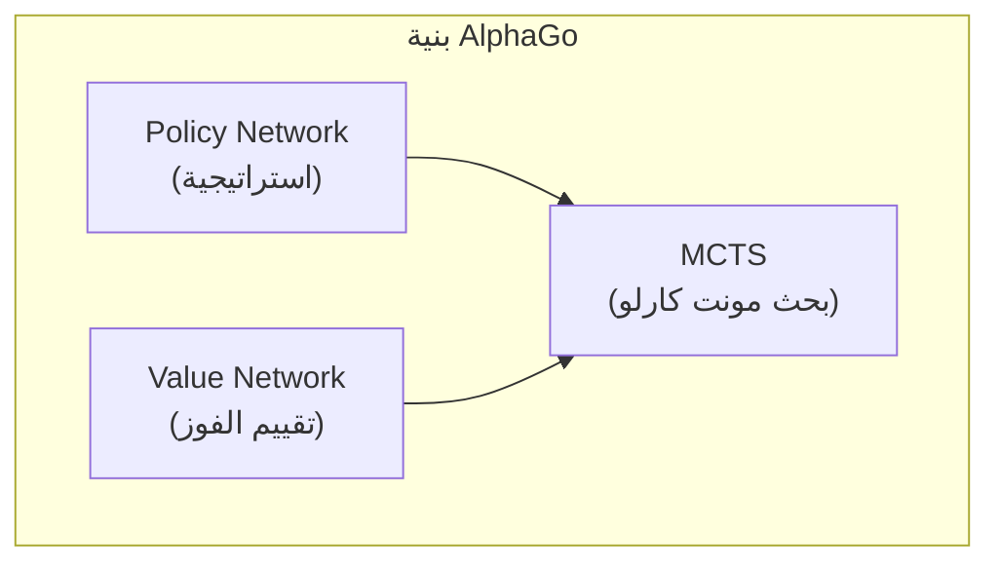
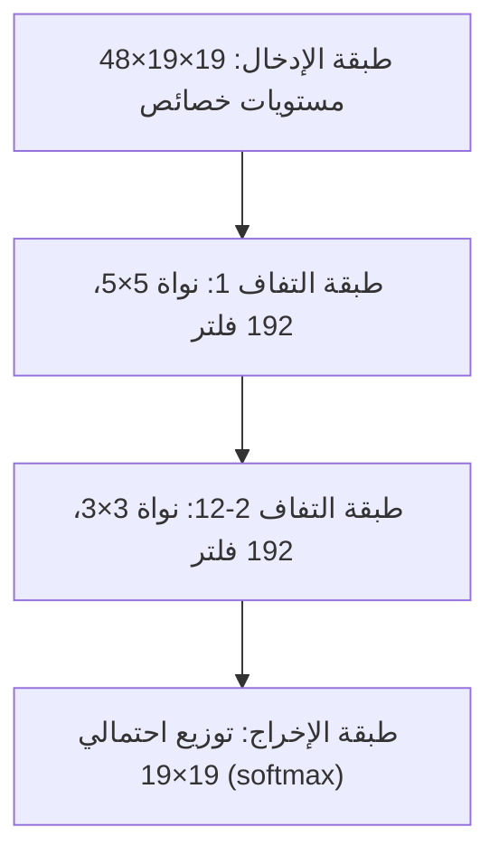
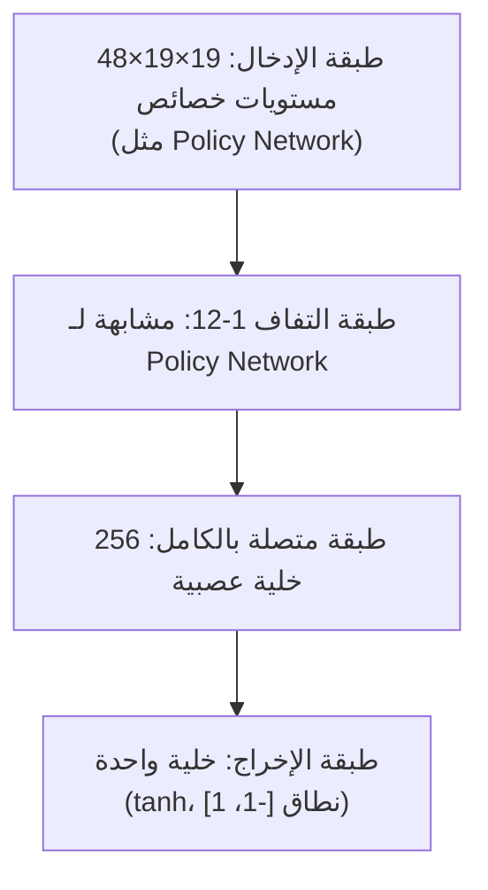
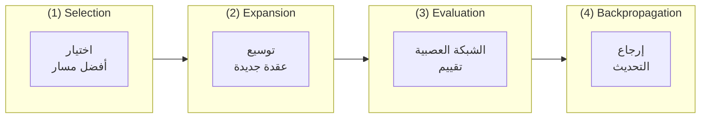
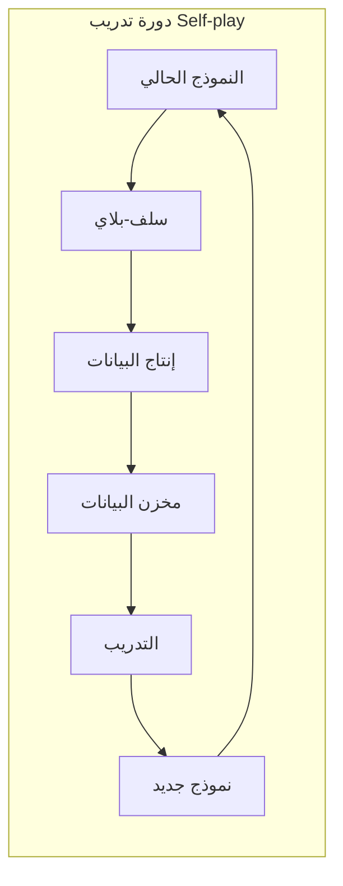
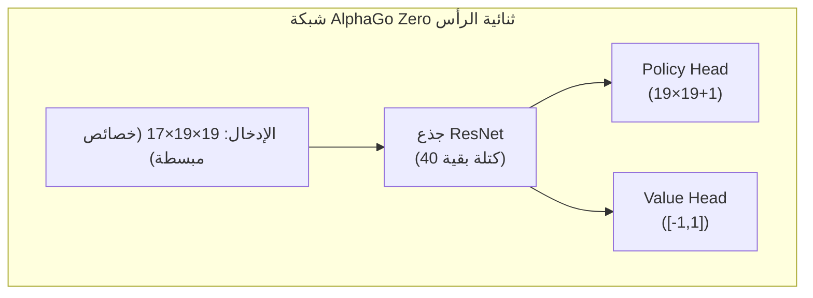

# شرح ورقة AlphaGo

تحلل هذه المقالة بعمق الورقة الكلاسيكية التي نشرتها DeepMind في Nature بعنوان "Mastering the game of Go with deep neural networks and tree search"، بالإضافة إلى أوراق AlphaGo Zero وAlphaZero اللاحقة.

## الأهمية التاريخية لـ AlphaGo

اعتُبرت Go لفترة طويلة تحدي "الكأس المقدسة" للذكاء الاصطناعي. على عكس الشطرنج، فضاء البحث في Go ضخم للغاية:

| اللعبة | متوسط عامل التفرع | متوسط طول اللعبة | فضاء الحالات |
|------|-------------|-------------|----------|
| الشطرنج | ~35 | ~80 | ~10^47 |
| Go | ~250 | ~150 | ~10^170 |

طرق البحث الشامل التقليدية غير قابلة للتطبيق تماماً على Go. هزيمة AlphaGo للي سيدول في 2016 أثبتت القوة الهائلة للجمع بين التعلم العميق والتعلم المعزز.

### الأحداث الرئيسية

- **أكتوبر 2015**: AlphaGo Fan يهزم البطل الأوروبي فان هوي (المحترف 2 دان) 5:0
- **مارس 2016**: AlphaGo Lee يهزم البطل العالمي لي سيدول (المحترف 9 دان) 4:1
- **مايو 2017**: AlphaGo Master يهزم كي جيه المصنف الأول عالمياً 3:0
- **أكتوبر 2017**: نشر AlphaGo Zero، تدريب بالسلف-بلاي الخالص، يتفوق على جميع الإصدارات السابقة

## البنية التقنية الأساسية

الابتكار الأساسي لـ AlphaGo هو الجمع بين ثلاث تقنيات رئيسية:



### Policy Network (شبكة الاستراتيجية)

Policy Network مسؤولة عن التنبؤ باحتمال الحركة لكل موقع، لتوجيه اتجاه البحث.

#### بنية الشبكة



#### خصائص الإدخال

يستخدم AlphaGo 48 مستوى خصائص كإدخال:

| الخاصية | عدد المستويات | الوصف |
|------|--------|------|
| لون الحجر | 3 | أسود، أبيض، فارغ |
| عدد الحريات | 8 | 1 حرية، 2 حرية، ...، 8 حريات فأكثر |
| حريات بعد الأتاري | 8 | كم حرية بعد الأسر |
| عدد الأحجار الملتقطة | 8 | كم حجر يمكن التقاطه في هذا الموقع |
| الكو | 1 | هل هو موقع كو |
| شرعية الحركة | 1 | هل يمكن اللعب في هذا الموقع |
| مواقع 1-8 حركات سابقة | 8 | مواقع الحركات السابقة |
| من يلعب | 1 | دور الأسود أو الأبيض |

#### طريقة التدريب

تدريب Policy Network على مرحلتين:

**المرحلة الأولى: التعلم الخاضع للإشراف (SL Policy Network)**
- استخدام 30 مليون مباراة من خادم KGS للعبة Go
- الهدف: التنبؤ بالحركة التالية للاعبين البشر
- دقة التنبؤ وصلت 57%

**المرحلة الثانية: التعلم المعزز (RL Policy Network)**
- البدء من SL Policy Network
- اللعب ضد إصدارات سابقة من نفسه
- التحسين باستخدام خوارزمية REINFORCE

```python
# تحديث Policy Gradient مبسط
# reward: +1 فوز، -1 خسارة
loss = -log(policy[action]) * reward
```

### Value Network (شبكة القيمة)

Value Network تقيّم نسبة الفوز للموقف الحالي، لتقليل عمق البحث.

#### بنية الشبكة



#### طريقة التدريب

Value Network تُدرب على 30 مليون موقف من السلف-بلاي لـ RL Policy Network:

- أخذ عينة عشوائية من موقف واحد من كل مباراة
- استخدام النتيجة النهائية كتسمية
- استخدام دالة خسارة MSE

```python
# تدريب Value Network
value_prediction = value_network(position)
loss = (value_prediction - game_outcome) ** 2
```

**لماذا عينة واحدة فقط من كل مباراة؟**

إذا أخذنا عينات متعددة، المواقف المتجاورة من نفس المباراة ستكون مترابطة بشدة، مما يسبب الإفراط في التخصيص. العينات العشوائية تضمن تنوع بيانات التدريب.

## البحث الشجري مونت كارلو (MCTS)

MCTS هو جوهر قرارات AlphaGo، يجمع الشبكات العصبية للبحث بكفاءة عن أفضل حركة.

### خطوات MCTS الأربع



### صيغة الاختيار (PUCT)

يستخدم AlphaGo صيغة PUCT (Predictor + UCT) لاختيار الفرع للاستكشاف:

```
a = argmax[Q(s,a) + u(s,a)]

u(s,a) = c_puct * P(s,a) * sqrt(N(s)) / (1 + N(s,a))
```

حيث:
- **Q(s,a)**: متوسط قيمة الحركة a (استغلال)
- **P(s,a)**: الاحتمال المسبق من Policy Network
- **N(s)**: عدد زيارات العقدة الأم
- **N(s,a)**: عدد زيارات هذه الحركة
- **c_puct**: ثابت الاستكشاف، يوازن بين الاستكشاف والاستغلال

### شرح تفصيلي لعملية البحث

1. **Selection**: من العقدة الجذر، استخدم صيغة PUCT لاختيار الحركة حتى الوصول لعقدة ورقية
2. **Expansion**: توسيع عقد فرعية جديدة في العقدة الورقية، تهيئة الاحتمال المسبق بـ Policy Network
3. **Evaluation**: الجمع بين تقييم Value Network والمحاكاة السريعة (Rollout) لتقييم القيمة
4. **Backpropagation**: إرجاع قيمة التقييم عبر المسار، تحديث قيم Q وN

### Rollout (اللعب السريع)

AlphaGo (النسخة غير Zero) يستخدم أيضاً شبكة استراتيجية سريعة صغيرة للمحاكاة:

```
عقدة ورقية → لعب سريع عشوائي حتى النهاية → حساب الفوز/الخسارة
```

قيمة التقييم النهائية تجمع بين Value Network وRollout:

```
V = λ * v_network + (1-λ) * v_rollout
```

AlphaGo يستخدم λ = 0.5، يعطي وزناً متساوياً لكليهما.

## طريقة تدريب Self-play

Self-play هي استراتيجية التدريب الأساسية لـ AlphaGo، تسمح لـ AI بالتحسين المستمر من خلال اللعب ضد نفسه.

### دورة التدريب



### لماذا Self-play فعال؟

1. **بيانات لا نهائية**: غير محدود بعدد السجلات البشرية
2. **صعوبة متكيفة**: قوة الخصم تزداد مع قوتك
3. **استكشاف الابتكار**: غير مقيد بأنماط التفكير البشرية
4. **هدف واضح**: تحسين نسبة الفوز مباشرة، وليس تقليد البشر

## تحسينات AlphaGo Zero

AlphaGo Zero الذي نُشر في 2017 جلب تحسينات ثورية:

### الاختلافات الرئيسية

| الخاصية | AlphaGo | AlphaGo Zero |
|------|---------|--------------|
| التدريب الأولي | تعلم خاضع من سجلات بشرية | من الصفر تماماً |
| بنية الشبكة | Policy/Value منفصلة | شبكة واحدة ثنائية الرأس |
| هيكل الشبكة | CNN عادية | ResNet |
| هندسة الخصائص | 48 خاصية يدوية | 17 خاصية بسيطة |
| Rollout | مطلوب | غير مطلوب |
| وقت التدريب | أشهر | 3 أيام لتجاوز البشر |

### تبسيط البنية



### خصائص الإدخال المبسطة

AlphaGo Zero يستخدم فقط 17 مستوى خصائص:

- 8 مستويات: مواقع أحجارك في آخر 8 حركات
- 8 مستويات: مواقع أحجار الخصم في آخر 8 حركات
- مستوى واحد: من يلعب حالياً (كله 0 أو كله 1)

### تحسينات التدريب

1. **Self-play خالص**: لا يستخدم أي بيانات بشرية
2. **استخدام احتمالات MCTS مباشرة كهدف تدريب**: وليس الفوز/الخسارة الثنائي
3. **بدون Rollout**: الاعتماد الكامل على Value Network
4. **تدريب شبكة واحدة**: Policy وValue يتشاركان البارامترات، يعززان بعضهما

## تعميم AlphaZero

AlphaZero الذي نُشر في نهاية 2017 طبق نفس البنية على Go والشطرنج والشوغي:

### الخصائص الرئيسية

- **صفر معرفة مجال**: لا يستخدم أي معرفة خاصة بالمجال سوى قواعد اللعبة
- **بنية موحدة**: نفس الخوارزمية تعمل على ألعاب مختلفة
- **تدريب أسرع**:
  - Go: 8 ساعات لتجاوز AlphaGo Lee
  - الشطرنج: 4 ساعات لتجاوز Stockfish
  - الشوغي: ساعتان لتجاوز Elmo

### الاختلافات مع AlphaGo Zero

| الخاصية | AlphaGo Zero | AlphaZero |
|------|-------------|-----------|
| اللعبة المستهدفة | Go فقط | Go، الشطرنج، الشوغي |
| استغلال التماثل | يستغل تماثل Go الثماني | لا يفترض تماثلاً |
| ضبط البارامترات | محسن لـ Go | إعدادات عامة |
| طريقة التدريب | سلف-بلاي لأفضل نموذج | سلف-بلاي لأحدث نموذج |

## نقاط التنفيذ

إذا أردت تنفيذ نظام مشابه، إليك الاعتبارات الرئيسية:

### موارد الحوسبة

تدريب AlphaGo يتطلب موارد حوسبة ضخمة:

- **AlphaGo Lee**: 176 GPU + 48 TPU
- **AlphaGo Zero**: 4 TPU (تدريب) + 1 TPU (سلف-بلاي)
- **AlphaZero**: 5000 TPU (تدريب)

### البارامترات الرئيسية

```python
# متعلقة بـ MCTS
num_simulations = 800     # عدد المحاكاة لكل حركة
c_puct = 1.5              # ثابت الاستكشاف
temperature = 1.0         # بارامتر درجة الحرارة لاختيار الحركة

# متعلقة بالتدريب
batch_size = 2048
learning_rate = 0.01      # مع التناقص
l2_regularization = 1e-4
```

### مشاكل شائعة

1. **عدم استقرار التدريب**: استخدم معدل تعلم أصغر، زد batch size
2. **الإفراط في التخصيص**: تأكد من تنوع بيانات التدريب، استخدم التنظيم
3. **كفاءة البحث**: حسّن الاستدلال الدفعي للـ GPU، وازِ MCTS

## قراءة إضافية

- [الورقة الأصلية: Mastering the game of Go with deep neural networks and tree search](https://www.nature.com/articles/nature16961)
- [ورقة AlphaGo Zero: Mastering the game of Go without human knowledge](https://www.nature.com/articles/nature24270)
- [ورقة AlphaZero: A general reinforcement learning algorithm that masters chess, shogi, and Go through self-play](https://www.science.org/doi/10.1126/science.aar6404)

بعد فهم تقنية AlphaGo، لنرى كيف حسّن [KataGo على هذا الأساس](./katago-paper.md).
