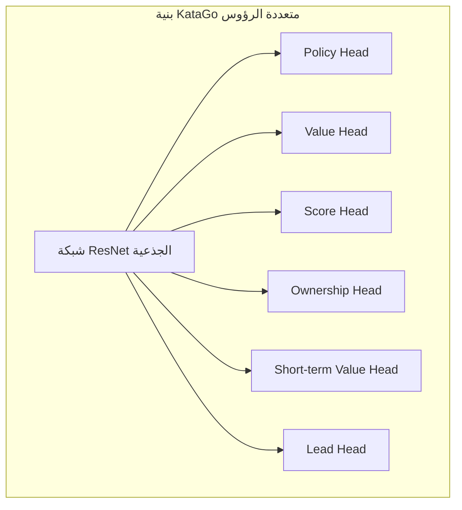
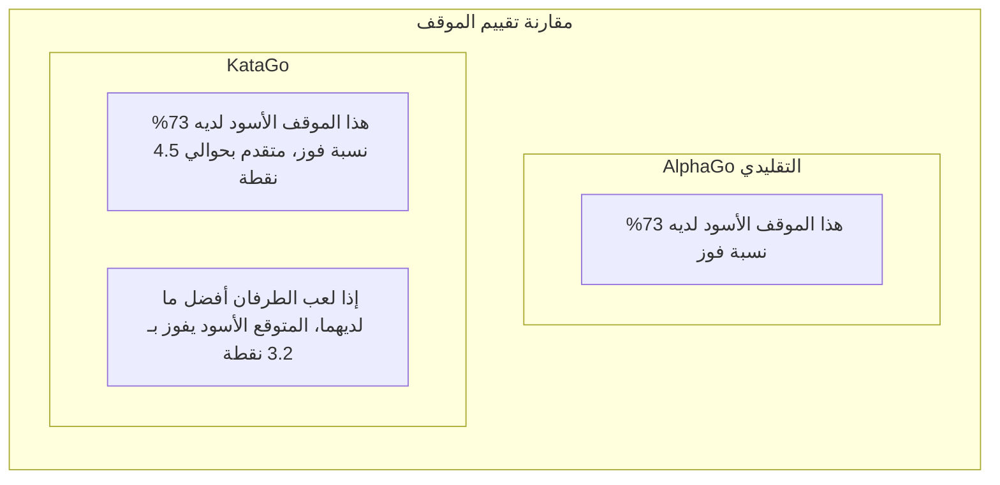

# شرح ورقة KataGo

KataGo هو AI مفتوح المصدر للعبة Go طوره David Wu، وورقته "Accelerating Self-Play Learning in Go" نُشرت في 2019. KataGo يحقق قوة تفوق ELF OpenGo بموارد حوسبة أقل، وهو حالياً أقوى AI مفتوح المصدر للعبة Go.

## ابتكارات KataGo

KataGo لم يقم بتغييرات ثورية في بنية الشبكة العصبية، بل قام بتحسينات منهجية في طرق التدريب والمهام المساعدة، محققاً تحسيناً كبيراً في الكفاءة.

### نظرة عامة على الابتكارات الأساسية

| الابتكار | التأثير |
|--------|------|
| أهداف التدريب المساعدة | تسريع التعلم، توفير المزيد من إشارات الإشراف |
| هيكل التجميع الشامل | التقاط أفضل للمعلومات الشاملة |
| دعم قواعد متعددة | نموذج واحد يتكيف مع قواعد مختلفة |
| عشوائية Playout Cap | تحسين كفاءة التدريب |
| تعزيز البيانات المحسن | زيادة تنوع بيانات التدريب |

## طرق تدريب أكثر كفاءة

### أهداف التدريب المساعدة (Auxiliary Training Targets)

AlphaGo Zero التقليدي لديه هدفان للتدريب فقط:
1. Policy: التنبؤ بتوزيع احتمال حركات MCTS
2. Value: التنبؤ بنتيجة الفوز/الخسارة

KataGo أضاف أهداف تدريب مساعدة متعددة، توفر إشارات تعلم أغنى:



#### شرح رؤوس الإخراج

| رأس الإخراج | الأبعاد | هدف التنبؤ |
|--------|------|----------|
| **Policy** | 19×19+1 | احتمال الحركة لكل موقع (شامل Pass) |
| **Value** | 3 | احتمال الفوز/الخسارة/التعادل |
| **Score** | قيمة مستمرة | التنبؤ بفرق النقاط النهائي |
| **Ownership** | 19×19 | انتماء كل نقطة نهائياً (منطقة أسود/أبيض) |
| **Short-term Value** | 1 | نسبة الفوز المتوقعة قريباً |
| **Lead** | 1 | كم نقطة التقدم حالياً |

### لماذا الأهداف المساعدة فعالة؟

1. **إشارات إشراف أكثف**: Value يوفر قيمة واحدة فقط، بينما Ownership يوفر 361 نقطة إشراف
2. **تقليل الإفراط في التخصيص**: التعلم متعدد المهام له تأثير تنظيمي
3. **تسريع التقارب**: المهام المساعدة تساعد الشبكة على تعلم تمثيلات خصائص مفيدة بشكل أسرع
4. **توفير تدرجات أفضل**: تجنب مشكلة تلاشي التدرج

### عشوائية Playout Cap

AlphaGo Zero يقوم بـ 800 محاكاة MCTS ثابتة لكل حركة. KataGo يدخل العشوائية:

```python
# الطريقة التقليدية
num_playouts = 800  # ثابت

# طريقة KataGo
playout_cap = random.choice([
    100, 200, 300, 400, 500, 600, 700, 800
])
```

**الفوائد**:
- بيانات التدريب أكثر تنوعاً
- النموذج يتعلم اتخاذ قرارات معقولة بأعماق بحث مختلفة
- أداء جيد حتى مع كمية بحث أقل في اللعب الفعلي

### تحسينات تعزيز البيانات

الطريقة التقليدية تستغل التماثل الثماني لـ Go (4 دورات × 2 انعكاس) لتعزيز البيانات. KataGo يحسن أكثر:

- **تحويل تماثل عشوائي**: اختيار تحويل تماثل عشوائي في كل عينة
- **عشوائية الحالة التاريخية**: اختيار عشوائي لطريقة تمثيل اللوحات التاريخية
- **عشوائية اللون**: تبديل عشوائي لمنظور الأسود والأبيض

## دعم قواعد Go المتعددة

هذه إحدى الميزات المهمة لـ KataGo. قواعد Go المختلفة تؤثر على القرارات الاستراتيجية:

### الاختلافات الرئيسية بين القواعد

| نظام القواعد | طريقة التسجيل | الكومي | قاعدة الكو | الانتحار |
|---------|---------|------|---------|------|
| القواعد الصينية | عد الأحجار | 7.5 نقطة | كو بسيط | ممنوع |
| القواعد اليابانية | عد النقاط | 6.5 نقطة | سوبر كو | ممنوع |
| القواعد الكورية | عد النقاط | 6.5 نقطة | سوبر كو | ممنوع |
| قواعد إنغ | عد الأحجار | 8 نقاط | قاعدة كو خاصة | ممنوع |
| Tromp-Taylor | عد الأحجار | قابل للتعديل | سوبر كو | مسموح |
| قواعد AGA | عد أحجار/نقاط | 7.5 نقطة | سوبر كو | ممنوع |
| قواعد نيوزيلندا | عد الأحجار | 7 نقاط | كو بسيط | مسموح |

### التنفيذ التقني

KataGo يرمز معلومات القواعد كخصائص إدخال:

```python
# مثال خصائص متعلقة بالقواعد
rule_features = {
    'komi': 7.5,           # قيمة الكومي
    'scoring_rule': 'area', # عد أحجار/نقاط
    'ko_rule': 'simple',    # قاعدة الكو
    'suicide_allowed': False,
    'tax_rule': 'none',     # هل هناك ضريبة "العين"
    # ...
}
```

الشبكة تتعلم تعديل الاستراتيجية حسب القواعد المختلفة. مثلاً:
- تحت عد النقاط، تركيز أكبر على التحكم في المنطقة
- عند السماح بالانتحار، يمكن استخدامه لتكتيكات خاصة
- كومي مختلف يؤثر على اختيارات الافتتاح

## التنبؤ المتزامن بنسبة الفوز والنقاط

هذه إحدى أكثر ميزات KataGo عملية، ذات قيمة كبيرة لتعليم وتحليل Go.

### Value مقابل Score



### القيمة التطبيقية العملية

1. **تقييم موقف أدق**:
   - نسبة فوز 80% لكن متقدم بنقطة واحدة فقط → لا تزال هناك متغيرات
   - نسبة فوز 80% ومتقدم بـ 20 نقطة → الأمر محسوم

2. **مساعدة التعليم**:
   - جعل الطلاب يفهمون "كم نقطة خسرت هذه الحركة"
   - مقارنة فرق النقاط بين طرق لعب مختلفة

3. **تحليل مباريات الهانديكاب**:
   - تقييم دقيق لمناسبة الهانديكاب
   - الحكم على اللعب الهجومي أم الدفاعي

### توزيع النقاط

KataGo لا يتنبأ بنقاط واحدة فقط، بل يتنبأ بتوزيع النقاط الكامل:

```
مثال توزيع النقاط:
├─ الأسود يفوز بـ 10 نقاط فأكثر: 15%
├─ الأسود يفوز بـ 5-10 نقاط: 25%
├─ الأسود يفوز بـ 0-5 نقاط: 20%
├─ الأبيض يفوز بـ 0-5 نقاط: 18%
├─ الأبيض يفوز بـ 5-10 نقاط: 15%
└─ الأبيض يفوز بـ 10 نقاط فأكثر: 7%

القيمة المتوقعة: الأسود +3.2 نقطة
الانحراف المعياري: ±8.5 نقطة
```

هذه المعلومات التوزيعية تعكس بشكل أفضل تعقيد الموقف وعدم يقينه.

## خريطة الملكية (Ownership Map)

Ownership يتنبأ بانتماء كل نقطة في النهاية للأسود أم الأبيض:

```
                  خريطة الملكية
    A B C D E F G H J K L M N O P Q R S T
19  ○ ○ ○ ○ ○ ○ · · · · · · · ● ● ● ● ● ●
18  ○ ○ ○ ○ ○ ○ · · · · · · · ● ● ● ● ● ●
17  ○ ○ ○ ○ ○ · · · · · · · · · ● ● ● ● ●
16  ○ ○ ○ ╋ · · · · · ╋ · · · · · ╋ ● ● ●
...

الرمز: ○ = منطقة الأبيض  ● = منطقة الأسود  · = غير محدد
```

### سيناريوهات التطبيق

- **تحليل الموقف**: رؤية مناطق نفوذ الطرفين بنظرة واحدة
- **حكم الحياة والموت**: الحكم على إمكانية إنقاذ مجموعة
- **حساب النهاية**: تقييم قيمة اللعب في مناطق مختلفة
- **العرض التعليمي**: تصور مفهوم المنطقة

## مقارنة الاختلافات مع AlphaGo

| الجانب | AlphaGo Zero | KataGo |
|------|-------------|--------|
| **أهداف التدريب** | Policy + Value | أهداف مساعدة متعددة |
| **معلومات الإخراج** | نسبة الفوز | نسبة الفوز + النقاط + المنطقة |
| **دعم القواعد** | قاعدة واحدة | قواعد متعددة |
| **هيكل الشبكة** | ResNet التفافي خالص | مع تجميع شامل |
| **كمية البحث** | ثابتة | عشوائية |
| **كفاءة التدريب** | المرجع | تحسين كفاءة حوالي 50 مرة |
| **درجة المصدر المفتوح** | وصف الورقة | مفتوح المصدر بالكامل |

### مقارنة كفاءة التدريب

```
الموارد المطلوبة للوصول لمستوى ELF OpenGo:

ELF OpenGo:
- 2000 GPU
- أسبوعان تدريب

KataGo:
- 1 GPU (أو عشرات GPU للتسريع)
- أيام إلى أسابيع

تحسين الكفاءة: حوالي 50-100 مرة
```

## تفاصيل بنية الشبكة

### التجميع الشامل (Global Pooling)

CNN التقليدية يمكنها رؤية المعلومات المحلية فقط، KataGo يضيف طبقة تجميع شامل لالتقاط الخصائص الشاملة:

```python
class GlobalPoolingBlock(nn.Module):
    def forward(self, x):
        # x: [batch, channels, 19, 19]

        # تجميع المتوسط الشامل
        global_avg = x.mean(dim=[2, 3])  # [batch, channels]

        # تجميع الحد الأقصى الشامل
        global_max = x.max(dim=2)[0].max(dim=1)[0]  # [batch, channels]

        # دمج الخصائص الشاملة
        global_features = torch.cat([global_avg, global_max], dim=1)

        # معالجة الخصائص الشاملة
        global_features = dense_layer(global_features)  # [batch, C]

        # بث الخصائص الشاملة للأبعاد المكانية
        global_broadcast = broadcast_to_spatial(global_features)

        return torch.cat([x, global_broadcast], dim=1)
```

**الفوائد**:
- القدرة على استشعار الوضع الشامل (مثل من يتقدم)
- معالجة أفضل للمواقف التي تتطلب حكماً شاملاً
- مفيد بشكل خاص لتنبؤ النقاط

### حجم الشبكة

KataGo يوفر نماذج بأحجام مختلفة:

| النموذج | عدد الكتل البقية | عدد القنوات | عدد البارامترات | سيناريو الاستخدام |
|------|---------|--------|--------|----------|
| b10c128 | 10 | 128 | ~5M | تشغيل CPU |
| b15c192 | 15 | 192 | ~15M | GPU عامة |
| b20c256 | 20 | 256 | ~35M | GPU متوسطة |
| b40c256 | 40 | 256 | ~70M | GPU عالية |
| b60c320 | 60 | 320 | ~150M | GPU عليا |

## الأداء الفعلي

### تقييم القوة

أداء KataGo في الاختبارات المختلفة:

- يتفوق على جميع شبكات Leela Zero
- يحافظ على نسبة فوز عالية ضد المحترفين 9 دان
- المركز الأول في CGOS (Computer Go Server)

### ميزات التحليل

وضع تحليل KataGo يوفر:

```json
{
  "moveInfos": [
    {
      "move": "Q16",
      "visits": 3420,
      "winrate": 0.573,
      "scoreLead": 2.8,
      "pv": ["Q16", "D4", "Q4", "D16"],
      "ownership": [...]
    }
  ],
  "rootInfo": {
    "winrate": 0.48,
    "scoreLead": -0.5,
    "visits": 10000
  }
}
```

## قراءة إضافية

- [ورقة KataGo: Accelerating Self-Play Learning in Go](https://arxiv.org/abs/1902.10565)
- [مشروع KataGo على GitHub](https://github.com/lightvector/KataGo)
- [سجلات تدريب وتحليل KataGo](https://katagotraining.org/)

بعد فهم الخصائص التقنية لـ KataGo، لنرى [تطور AI أخرى للعبة Go](./zen.md)، للحصول على فهم أشمل للصناعة بأكملها.
