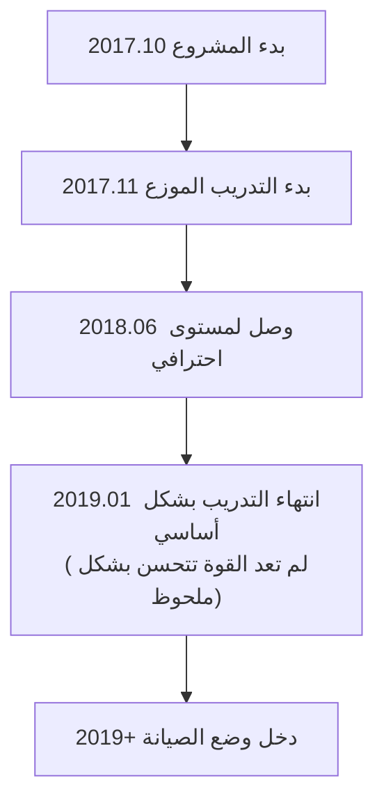

# مقدمة عن AI أخرى للعبة Go

بالإضافة إلى AlphaGo وKataGo، هناك العديد من المشاريع المهمة في مجال AI للعبة Go. ستقدم هذه المقالة AI التجارية ومفتوحة المصدر الرئيسية، لمساعدتك على فهم النظام البيئي بأكمله.

## AI التجارية للعبة Go

### Zen (تينجن)

**المطور**: يوجي أوجيما / اليابان
**أول إصدار**: 2009
**الترخيص**: تجاري

Zen كان من أقوى برامج Go قبل AlphaGo، ووصل لمستوى احترافي في عصر MCTS التقليدي.

#### مسيرة التطور

| الوقت | الإصدار | الإنجاز |
|------|------|--------|
| 2009 | Zen 1.0 | الإصدار الأول |
| 2011 | Zen 4 | وصل لمستوى 6 دان هاوٍ |
| 2012 | Zen 5 | هزم تاكيمايا ماساكي 9 دان بأربعة أحجار |
| 2016 | Zen 7 | اعتمد تقنية التعلم العميق |
| 2017+ | Deep Zen Go | دمج بنية AlphaGo |

#### الخصائص التقنية

- **بنية هجينة**: يجمع بين الاستدلال التقليدي والتعلم العميق
- **تحسين تجاري**: محسن للأجهزة الاستهلاكية
- **استقرار عالي**: تم التحقق منه عبر سنوات من الاستخدام التجاري
- **دعم متعدد المنصات**: Windows، macOS

#### شكل المنتج

- **Tengen no Go**: برنامج سطح المكتب، حوالي 10,000 ين
- **اللعب عبر الإنترنت**: كان نشطاً على KGS بحساب Zen19

---

### Fine Art (جيويي)

**المطور**: Tencent AI Lab / الصين
**أول إصدار**: 2016
**الترخيص**: غير عام

Fine Art هو AI لـ Go طورته Tencent، وله تأثير مهم في عالم Go الصيني.

#### مسيرة التطور

| الوقت | الحدث |
|------|------|
| نوفمبر 2016 | الظهور الأول، اللعب على موقع Wild Fox Go |
| مارس 2017 | بطل كأس UEC لـ Go الحاسوبي |
| 2017 | اعتمده فريق Go الوطني الصيني كأداة تدريب |
| 2018 | بطل بطولة العالم للذكاء الاصطناعي في Go |
| حتى الآن | يستمر كمساعد تدريب للفريق الوطني |

#### الخصائص التقنية

- **تدريب واسع النطاق**: استخدام موارد Tencent السحابية
- **تعاون مع أفضل اللاعبين البشريين**: حصل على الكثير من التوجيه المهني
- **خبرة عملية غنية**: تراكم الكثير من المباريات على Wild Fox
- **تكامل ميزات التعليم**: يوفر ميزات مراجعة وتحليل

#### التأثير

تأثير Fine Art على Go المحترف الصيني عميق:

- أصبح أداة التدريب القياسية للفريق الوطني
- غير طريقة استعداد اللاعبين المحترفين للمباريات
- دفع انتشار التدريب بمساعدة AI

---

### Golaxy (شينغ تشين)

**المطور**: Deep Keji الصينية / فريق جامعة تسينغهوا
**أول إصدار**: 2018
**الترخيص**: تجاري

Golaxy صُمم بهدف "AI الأكثر شبهاً بالبشر"، وأسلوبه أقرب للاعبين البشريين.

#### الخصائص التقنية

- **أسلوب بشري**: تدريب متعمد ليكون أكثر شبهاً بطريقة البشر
- **صعوبة قابلة للتعديل**: يمكنه محاكاة خصوم بمستويات دان مختلفة
- **موجه للتعليم**: التصميم يأخذ بالاعتبار تطبيقات التدريس
- **تخصص في الهانديكاب**: تحسين خاص لمباريات الهانديكاب

#### تطبيقات المنتج

- **Yike Go**: مدمج في تطبيق Yike
- **منصة التعليم**: يستخدم لتعليم Go عبر الإنترنت
- **اختبار الدان**: يوفر تقييم دان موحد

---

### AI تجارية أخرى

| الاسم | المطور | الخصائص |
|------|--------|------|
| **Stone Tornado** | لين زاي فان (تايوان) | فاز بكأس UEC |
| **CGI** | جامعة جياو تونغ (تايوان) | موجه للبحث الأكاديمي |
| **Dolbaram** | NHN الكورية | مدمج في منصات Go الكورية |
| **AQ** | فريق AQ الياباني | أصبح تجارياً بعد أن كان مفتوح المصدر |

## AI مفتوحة المصدر للعبة Go

### Leela Zero

**المطور**: Gian-Carlo Pascutto / بلجيكا
**أول إصدار**: 2017
**الترخيص**: GPL-3.0
**GitHub**: https://github.com/leela-zero/leela-zero

Leela Zero أول مشروع مفتوح المصدر نجح في تكرار AlphaGo Zero، يُدرب بشكل موزع من قبل المجتمع.

#### مسيرة التطور



#### الخصائص التقنية

- **تكرار أمين**: تنفيذ صارم حسب ورقة AlphaGo Zero
- **تدريب موزع**: متطوعون عالميون يساهمون بقوة حوسبة GPU
- **شفافية كاملة**: جميع بيانات التدريب والنماذج عامة
- **GTP قياسي**: متوافق مع جميع برامج Go بـ GTP

#### إحصائيات التدريب

| البند | القيمة |
|------|------|
| إجمالي مباريات السلف-بلاي | حوالي 18 مليون مباراة |
| عدد تكرارات التدريب | حوالي 270 |
| عدد المساهمين | آلاف |
| مدة التدريب | حوالي 1.5 سنة |

#### طريقة الاستخدام

```bash
# التثبيت
brew install leela-zero  # macOS

# التشغيل
leelaz --gtp --weights best-network.gz

# أوامر GTP
genmove black
play white D4
```

#### الوضع الحالي

رغم أن Leela Zero لم يعد يُدرب بنشاط، لكن:
- الكود لا يزال مصدراً ممتازاً لتعلم AlphaGo Zero
- النماذج المدربة لا تزال قابلة للاستخدام
- المجتمع لا يزال يصون الميزات الأساسية

---

### ELF OpenGo

**المطور**: Facebook AI Research (FAIR)
**أول إصدار**: 2018
**الترخيص**: BSD
**GitHub**: https://github.com/pytorch/ELF

ELF OpenGo هو AI لـ Go طورته Facebook، يُظهر قدرة التدريب الموزع واسع النطاق.

#### الخصائص التقنية

- **إطار ELF**: مبني على منصة بحث الألعاب ELF (Extensive, Lightweight, and Flexible) من Facebook
- **تدريب واسع النطاق**: استخدام 2000 GPU للتدريب
- **تنفيذ PyTorch**: استخدام إطار التعلم العميق الخاص بـ Facebook
- **موجه للبحث**: الهدف الرئيسي البحث وليس الاستخدام العملي

#### الأداء

- وصل لمستوى عالٍ على KGS
- نسبة فوز مستقرة ضد المحترفين 9 دان
- نشر الورقة في مؤتمرات عليا

#### الوضع الحالي

- المشروع لم يعد يُصان بنشاط
- الكود والنماذج لا تزال قابلة للتحميل
- القيمة الرئيسية في المرجع الأكاديمي

---

### SAI (Sensible Artificial Intelligence)

**المطور**: فريق SAI / أوروبا
**أول إصدار**: 2019
**الترخيص**: MIT
**GitHub**: https://github.com/sai-dev/sai

SAI نسخة محسنة مبنية على Leela Zero، تركز على الميزات التجريبية.

#### الخصائص التقنية

- **طرق تدريب محسنة**: تجريب تحسينات تدريب مختلفة
- **دعم المزيد من القواعد**: يدعم قواعد Go أكثر من Leela Zero
- **ميزات تجريبية**: اختبار بنى شبكات وتقنيات تدريب جديدة

#### الوضع الحالي

- لا يزال هناك مجتمع صغير يصونه
- يُستخدم بشكل رئيسي للتجريب والتعلم

---

### PhoenixGo

**المطور**: فريق WeChat في Tencent
**أول إصدار**: 2018
**الترخيص**: BSD-3
**GitHub**: https://github.com/Tencent/PhoenixGo

PhoenixGo هو AI مفتوح المصدر لـ Go من Tencent، فاز ببطولة العالم للذكاء الاصطناعي في Go 2018.

#### الخصائص التقنية

- **جودة تجارية**: مصدره مشروع Tencent الداخلي
- **تنفيذ TensorFlow**: استخدام إطار رئيسي
- **دعم متعدد المنصات**: Linux، Windows، macOS
- **دعم موزع**: يمكن التشغيل على بيئة متعددة الآلات والبطاقات

#### طريقة الاستخدام

```bash
# البناء
bazel build //src:mcts_main

# التشغيل
./mcts_main --gtp --config_path=config.conf
```

---

### MiniGo

**المطور**: Google Brain
**أول إصدار**: 2018
**الترخيص**: Apache-2.0
**GitHub**: https://github.com/tensorflow/minigo

MiniGo هو AI تعليمي لـ Go من Google، يهدف لمساعدة المزيد من الناس على فهم مبادئ AlphaGo.

#### الخصائص التقنية

- **موجه للتعليم**: كود واضح وسهل القراءة
- **تنفيذ TensorFlow**: مثال رسمي من Google
- **وثائق كاملة**: شرح تقني مفصل
- **دعم Colab**: يمكن التشغيل مباشرة على Google Colab

#### سيناريوهات الاستخدام

- تعلم بنية AlphaGo Zero
- فهم تطبيقات التعلم المعزز في الألعاب
- كنقطة بداية لمشروعك الخاص

## مقارنة خصائص كل AI

### مقارنة القوة (تقريبياً)

| AI | مستوى القوة | ملاحظات |
|----|---------|------|
| KataGo | فوق بشري عليا | لا يزال يُدرب |
| Fine Art | فوق بشري عليا | غير عام |
| Leela Zero | فوق بشري | توقف التدريب |
| ELF OpenGo | فوق بشري | توقف التدريب |
| PhoenixGo | شبه فوق بشري | توقف التدريب |
| Zen | مستوى احترافي | منتج تجاري |
| Golaxy | مستوى احترافي | صعوبة قابلة للتعديل |

### مقارنة الميزات

| الميزة | KataGo | Leela Zero | PhoenixGo | Zen |
|------|--------|------------|-----------|------|
| مفتوح المصدر | ✓ | ✓ | ✓ | ✗ |
| تنبؤ النقاط | ✓ | ✗ | ✗ | △ |
| دعم قواعد متعددة | ✓ | ✗ | ✗ | ✗ |
| Analysis API | ✓ | ✗ | ✗ | ✗ |
| وضع CPU | ✓ | ✓ | ✓ | ✓ |
| تحديث مستمر | ✓ | ✗ | ✗ | △ |

### اقتراحات سيناريوهات الاستخدام

| الاحتياج | الاختيار الموصى | السبب |
|------|---------|------|
| لعب/تحليل عام | KataGo | الأقوى والأكثر ميزات |
| تعلم AlphaGo | Leela Zero / MiniGo | كود واضح |
| تطبيق تجاري | Zen / KataGo مُدرب ذاتياً | ترخيص واضح |
| مساعدة تعليمية | KataGo / Golaxy | ميزات تحليل غنية |
| تجارب بحثية | KataGo / SAI | يمكن تعديل التدريب |

## اتجاهات التطور المستقبلي

### الاتجاهات التقنية

1. **طرق تدريب أكثر كفاءة**
   - كما أظهر KataGo من تحسين الكفاءة
   - موارد أقل لقوة أعلى

2. **قابلية تفسير أفضل**
   - شرح لماذا AI يلعب هذه الحركة
   - مساعدة البشر على فهم تفكير AI

3. **الدمج مع أسلوب البشر**
   - تدريب AI بأسلوب لاعب معين
   - للاستخدام في التعليم والبحث

4. **العمومية عبر الألعاب**
   - كما أظهر AlphaZero
   - إطار واحد لألعاب متعددة

### اتجاهات التطبيق

1. **التعميم**
   - المزيد من هواة Go يستخدمون تحليل AI
   - يمكن التشغيل على الهواتف وأجهزة أخرى

2. **التخصص**
   - اللاعبون المحترفون يعتمدون بعمق على تدريب AI
   - مساعدة AI أصبحت معيارية

3. **التسويق**
   - المزيد من منتجات Go بمساعدة AI
   - خدمات التعليم والتحليل والتدريب

## خلاصة

نظام AI لـ Go البيئي غني ومتنوع:

- **تريد أقوى قوة وأكثر ميزات**: اختر KataGo
- **تريد تعلم مبادئ AI**: ادرس كود Leela Zero أو MiniGo
- **لاحتياجات تجارية**: قيّم Zen أو درّب نموذجك الخاص
- **لاحتياجات خاصة**: اختر أو ادمج حسب الحالة المحددة

بعد ذلك، لندخل في التطبيق العملي ونتعلم كيفية [تثبيت واستخدام KataGo](/docs/for-engineers/katago-source/)!
