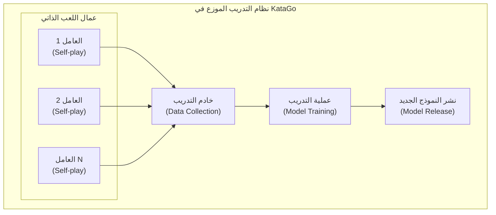

# بنية التدريب الموزع

يقدم هذا المقال بنية نظام التدريب الموزع في KataGo، ويشرح كيف يتم تحسين النماذج باستمرار من خلال قوة الحوسبة العالمية للمجتمع.

---

## نظرة عامة على بنية النظام



---

## عامل اللعب الذاتي (Self-play Worker)

### سير العمل

كل عامل ينفذ الدورة التالية:

```python
def self_play_worker():
    while True:
        # 1. تحميل أحدث نموذج
        model = download_latest_model()

        # 2. تنفيذ اللعب الذاتي
        games = []
        for _ in range(batch_size):
            game = play_game(model)
            games.append(game)

        # 3. رفع بيانات المباريات
        upload_games(games)

        # 4. التحقق من نموذج جديد
        if new_model_available():
            model = download_latest_model()
```

### توليد المباريات

```python
def play_game(model):
    """تنفيذ مباراة لعب ذاتي"""
    game = Game()
    positions = []

    while not game.is_terminal():
        # بحث MCTS
        mcts = MCTS(model, num_simulations=800)
        policy = mcts.get_policy(game.state)

        # إضافة ضوضاء Dirichlet (زيادة الاستكشاف)
        if game.move_count < 30:
            policy = add_dirichlet_noise(policy)

        # اختيار الحركة بناءً على السياسة
        if game.move_count < 30:
            # أول 30 حركة بأخذ عينات حرارية
            action = sample_with_temperature(policy, temp=1.0)
        else:
            # بعدها اختيار جشع
            action = np.argmax(policy)

        # تسجيل بيانات التدريب
        positions.append({
            'state': game.state.copy(),
            'policy': policy,
            'player': game.current_player
        })

        game.play(action)

    # تحديد الفائز
    winner = game.get_winner()
    for pos in positions:
        pos['value'] = 1.0 if pos['player'] == winner else -1.0

    return positions
```

### تنسيق البيانات

```json
{
  "version": 1,
  "rules": "chinese",
  "komi": 7.5,
  "board_size": 19,
  "positions": [
    {
      "move_number": 0,
      "board": "...",
      "policy": [0.01, 0.02, ...],
      "value": 1.0,
      "score": 2.5
    }
  ]
}
```

---

## خادم جمع البيانات

### الوظائف

1. **استقبال بيانات المباريات**: جمع المباريات من العمال
2. **التحقق من البيانات**: فحص التنسيق، تصفية الشذوذ
3. **تخزين البيانات**: الكتابة في مجموعة بيانات التدريب
4. **مراقبة الإحصائيات**: تتبع عدد المباريات، حالة العمال

### التحقق من البيانات

```python
def validate_game(game_data):
    """التحقق من بيانات المباراة"""
    checks = [
        len(game_data['positions']) > 10,  # الحد الأدنى للحركات
        len(game_data['positions']) < 500,  # الحد الأقصى للحركات
        all(is_valid_policy(p['policy']) for p in game_data['positions']),
        game_data['rules'] in SUPPORTED_RULES,
    ]
    return all(checks)
```

### هيكل تخزين البيانات

```
training_data/
├── run_001/
│   ├── games_00001.npz
│   ├── games_00002.npz
│   └── ...
├── run_002/
│   └── ...
└── current/
    └── latest_games.npz
```

---

## عملية التدريب

### دورة التدريب

```python
def training_loop():
    model = load_model()
    optimizer = Adam(model.parameters(), lr=1e-4)

    for epoch in range(num_epochs):
        # تحميل أحدث بيانات المباريات
        dataset = load_recent_games(num_games=100000)
        dataloader = DataLoader(dataset, batch_size=256, shuffle=True)

        for batch in dataloader:
            states = batch['states']
            target_policies = batch['policies']
            target_values = batch['values']

            # التمرير الأمامي
            pred_policies, pred_values = model(states)

            # حساب الخسارة
            policy_loss = cross_entropy(pred_policies, target_policies)
            value_loss = mse_loss(pred_values, target_values)
            loss = policy_loss + value_loss

            # التمرير العكسي
            optimizer.zero_grad()
            loss.backward()
            optimizer.step()

        # التقييم الدوري
        if epoch % 100 == 0:
            evaluate_model(model)
```

### دوال الخسارة

يستخدم KataGo عدة عناصر خسارة:

```python
def compute_loss(predictions, targets):
    # خسارة السياسة (الانتروبيا المتقاطعة)
    policy_loss = F.cross_entropy(
        predictions['policy'],
        targets['policy']
    )

    # خسارة القيمة (MSE)
    value_loss = F.mse_loss(
        predictions['value'],
        targets['value']
    )

    # خسارة النقاط (MSE)
    score_loss = F.mse_loss(
        predictions['score'],
        targets['score']
    )

    # خسارة الملكية (MSE)
    ownership_loss = F.mse_loss(
        predictions['ownership'],
        targets['ownership']
    )

    # المجموع الموزون
    total_loss = (
        1.0 * policy_loss +
        1.0 * value_loss +
        0.5 * score_loss +
        0.5 * ownership_loss
    )

    return total_loss
```

---

## تقييم النماذج ونشرها

### تقييم Elo

النموذج الجديد يحتاج للعب ضد النموذج القديم لتقييم القوة:

```python
def evaluate_new_model(new_model, baseline_model, num_games=400):
    """تقييم Elo للنموذج الجديد"""
    wins = 0
    losses = 0
    draws = 0

    for _ in range(num_games // 2):
        # النموذج الجديد بالأسود
        result = play_game(new_model, baseline_model)
        if result == 'black_wins':
            wins += 1
        elif result == 'white_wins':
            losses += 1
        else:
            draws += 1

        # النموذج الجديد بالأبيض
        result = play_game(baseline_model, new_model)
        if result == 'white_wins':
            wins += 1
        elif result == 'black_wins':
            losses += 1
        else:
            draws += 1

    # حساب فرق Elo
    win_rate = (wins + 0.5 * draws) / num_games
    elo_diff = 400 * math.log10(win_rate / (1 - win_rate))

    return elo_diff
```

### شروط النشر

```python
def should_release_model(new_model, current_best):
    """تحديد ما إذا كان يجب نشر النموذج الجديد"""
    elo_diff = evaluate_new_model(new_model, current_best)

    # الشرط: تحسن Elo يتجاوز العتبة
    if elo_diff > 20:
        return True

    # أو: الوصول لعدد معين من خطوات التدريب
    if training_steps % 10000 == 0:
        return True

    return False
```

### تسمية إصدارات النماذج

```
kata1-b18c384nbt-s{steps}-d{data}.bin.gz

مثال:
kata1-b18c384nbt-s9996604416-d4316597426.bin.gz
├── kata1: سلسلة التدريب
├── b18c384nbt: البنية (18 كتلة متبقية، 384 قناة)
├── s9996604416: خطوات التدريب
└── d4316597426: كمية بيانات التدريب
```

---

## دليل المشاركة في KataGo Training

### متطلبات النظام

| العنصر | الحد الأدنى | المقترح |
|--------|------------|---------|
| GPU | GTX 1060 | RTX 3060+ |
| VRAM | 4 GB | 8 GB+ |
| الشبكة | 10 Mbps | 50 Mbps+ |
| وقت التشغيل | مستمر | 24/7 |

### تثبيت العامل

```bash
# تحميل العامل
wget https://katagotraining.org/download/worker

# الإعداد
./katago contribute -config contribute.cfg

# بدء المساهمة
./katago contribute
```

### ملف الإعدادات

```ini
# contribute.cfg

# إعدادات الخادم
serverUrl = https://katagotraining.org/

# اسم المستخدم (للإحصائيات)
username = your_username

# إعدادات GPU
numNNServerThreadsPerModel = 1
nnMaxBatchSize = 16

# إعدادات المباريات
gamesPerBatch = 25
```

### مراقبة المساهمات

```bash
# عرض الإحصائيات
https://katagotraining.org/contributions/

# السجلات المحلية
tail -f katago_contribute.log
```

---

## إحصائيات التدريب

### معالم تدريب KataGo

| الوقت | عدد المباريات | Elo |
|-------|---------------|-----|
| 2019.06 | 10M | أولي |
| 2020.01 | 100M | +500 |
| 2021.01 | 500M | +800 |
| 2022.01 | 1B | +1000 |
| 2024.01 | 5B+ | +1200 |

### مساهمو المجتمع

- مئات المساهمين من حول العالم
- آلاف سنوات GPU من قوة الحوسبة المتراكمة
- تشغيل مستمر 24/7

---

## المواضيع المتقدمة

### التعلم المتدرج (Curriculum Learning)

زيادة صعوبة التدريب تدريجياً:

```python
def get_training_config(training_step):
    if training_step < 100000:
        return {'board_size': 9, 'visits': 200}
    elif training_step < 500000:
        return {'board_size': 13, 'visits': 400}
    else:
        return {'board_size': 19, 'visits': 800}
```

### زيادة البيانات

استغلال تناظر اللوحة لزيادة كمية البيانات:

```python
def augment_position(state, policy):
    """8 تحولات تناظرية"""
    augmented = []

    for rotation in [0, 90, 180, 270]:
        for flip in [False, True]:
            aug_state = transform(state, rotation, flip)
            aug_policy = transform_policy(policy, rotation, flip)
            augmented.append((aug_state, aug_policy))

    return augmented
```

---

## قراءات إضافية

- [تحليل آلية تدريب KataGo](../training) — شرح تفصيلي لعملية التدريب
- [المشاركة في مجتمع المصادر المفتوحة](../contributing) — كيفية المساهمة بالكود
- [التقييم والاختبار المعياري](../evaluation) — طرق تقييم النماذج
