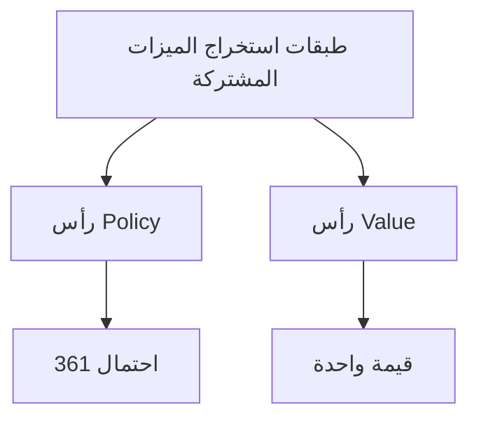

# شرح مفصل لشبكة Value

إذا كانت شبكة Policy تخبر AlphaGo "أين يجب أن تلعب الحركة التالية"، فإن شبكة Value تجيب على سؤال أكثر جوهرية:

> **"هل سأفوز في هذه المباراة؟"**

---

## ما هي شبكة Value؟

### الوظيفة الأساسية

شبكة Value هي شبكة عصبية التفافية عميقة، مهمتها:

> **بالنظر إلى حالة الرقعة الحالية، التنبؤ بنسبة الفوز النهائية**

بالتعبير الرياضي:

```
v = f_θ(s)
```

حيث:
- `s`: حالة الرقعة الحالية
- `f_θ`: شبكة Value (θ هي معاملات الشبكة)
- `v`: قيمة واحدة بين -1 و +1

### معنى المخرجات

| قيمة المخرج | المعنى |
|--------|------|
| +1 | اللاعب الحالي يفوز حتماً |
| +0.5 | اللاعب الحالي لديه حوالي 75% نسبة فوز |
| 0 | نسب فوز متساوية للطرفين |
| -0.5 | اللاعب الحالي لديه حوالي 25% نسبة فوز |
| -1 | اللاعب الحالي يخسر حتماً |

### لماذا نحتاج قيمة واحدة؟

#### مقارنة الخيارات المختلفة

عند اللعب، كثيراً ما نحتاج للاختيار بين عدة خيارات. شبكة Value تجعل هذه المقارنة بسيطة:

```
قيمة وضع الخيار A: 0.3
قيمة وضع الخيار B: 0.5
قيمة وضع الخيار C: 0.2

→ اختر B (أعلى قيمة)
```

بدون قيمة واحدة، كيف نقارن بين "أسر مجموعة من أحجار الخصم" و"إحاطة مساحة كبيرة"، أيهما أفضل؟

#### استبدال المحاكاة الكثيرة

في بحث شجرة مونت كارلو التقليدي، تقييم وضع يحتاج **محاكاة عشوائية (rollout)**:

1. البدء من الوضع الحالي
2. الطرفان يلعبان عشوائياً حتى نهاية اللعبة
3. تسجيل الفوز/الخسارة
4. التكرار آلاف المرات، حساب نسبة الفوز

هذا بطيء جداً. شبكة Value يمكنها **بانتشار أمامي واحد** إعطاء التقييم، أسرع بعدة رتب من الحجم.

| الطريقة | وقت التقييم | الدقة |
|------|---------|------|
| 1000 محاكاة عشوائية | ~2000 ميلي ثانية | منخفضة نسبياً |
| 15000 محاكاة عشوائية | ~30000 ميلي ثانية | متوسطة |
| شبكة Value | ~3 ميلي ثانية | عالية (تعادل 15000 محاكاة) |

---

## معمارية الشبكة

### التشابه مع شبكة Policy

معمارية شبكة Value مشابهة جداً لشبكة Policy، كلاهما شبكات عصبية التفافية عميقة:

```
طبقة المدخلات → طبقات التفافية ×12 → طبقة متصلة بالكامل → المخرج
      ↓              ↓                    ↓              ↓
   19×19×48      19×19×192            256 بُعد      قيمة واحدة
```

### طبقة المدخلات

مثل شبكة Policy، المدخل هو موتر ميزات بحجم **19×19×49**:

- **19×19**: حجم الرقعة
- **49**: 48 مستوى ميزات + مستوى يمثل دور من يلعب

المستوى الإضافي مهم جداً: شبكة Value تحتاج لمعرفة دور من، لأن نفس الوضع له قيم متعاكسة بالنسبة للأسود والأبيض.

### الطبقات الالتفافية

مثل شبكة Policy:
- **12 طبقة التفافية**
- **192 مرشح**
- **نواة التفاف 3×3** (الأولى 5×5)
- **دالة تفعيل ReLU**

### الفرق في طبقة المخرجات

هذا هو الفرق الرئيسي بين شبكة Value وشبكة Policy:

#### مخرجات شبكة Policy
```
19×19×192 → التفاف 1×1 → 19×19×1 → تسطيح → 361 بُعد → Softmax → توزيع احتمالي
```

#### مخرجات شبكة Value
```
19×19×192 → التفاف 1×1 → 19×19×1 → تسطيح → 361 بُعد → متصلة بالكامل 256 → ReLU → متصلة بالكامل 1 → Tanh → قيمة واحدة
```

### دالة التفعيل Tanh

الطبقة الأخيرة في شبكة Value تستخدم **Tanh** (الظل الزائدي):

```
Tanh(x) = (e^x - e^(-x)) / (e^x + e^(-x))
```

نطاق مخرجات Tanh هو **(-1, +1)**، يتطابق تماماً مع الفوز/الخسارة.

#### لماذا Tanh وليس Sigmoid؟

نطاق مخرجات Sigmoid هو (0, 1)، يمكنه أيضاً تمثيل نسبة الفوز. لكن Tanh له عدة مزايا:

1. **التناظر**: مركزه 0، المخرج يمكن أن يكون موجباً أو سالباً
2. **تدرج أفضل**: التدرج قرب 0 قريب من 1
3. **دلالة واضحة**: موجب يعني فوز، سالب يعني خسارة، صفر يعني تعادل

### مخطط المعمارية الكامل

```
المدخل: 19×19×49
        ↓
    Conv 5×5, 192 مرشح
        ↓
    ReLU
        ↓
    Conv 3×3, 192 مرشح (×11)
        ↓
    ReLU
        ↓
    Conv 1×1, مرشح 1
        ↓
    تسطيح (361 بُعد)
        ↓
    متصلة بالكامل (256 بُعد)
        ↓
    ReLU
        ↓
    متصلة بالكامل (1 بُعد)
        ↓
    Tanh
        ↓
المخرج: [-1, +1]
```

### عدد المعاملات

| الطبقة | الحساب | عدد المعاملات |
|---|------|---------|
| الطبقات الالتفافية | مثل شبكة Policy | ~3.9M |
| طبقة متصلة بالكامل 1 | 361×256 + 256 | 92,672 |
| طبقة متصلة بالكامل 2 | 256×1 + 1 | 257 |
| **المجموع** | | **~4.0M** |

حوالي 4 مليون معامل، أكثر قليلاً من شبكة Policy.

---

## تحديات التدريب

### مشكلة الإفراط في التعلم

تدريب شبكة Value أصعب بكثير من شبكة Policy. المشكلة الرئيسية هي **الإفراط في التعلم (Overfitting)**.

#### ما هو الإفراط في التعلم؟

الإفراط في التعلم يعني أن النموذج "يحفظ" بيانات التدريب، بدلاً من تعلم التعميم. يتجلى في:
- أداء جيد جداً على مجموعة التدريب
- أداء سيء على مجموعة الاختبار

#### لماذا شبكة Value عرضة للإفراط في التعلم؟

فكر في بيانات مباراة واحدة:

```
وضع 1 → وضع 2 → وضع 3 → ... → وضع 200 → النتيجة: فوز الأسود
```

إذا استخدمنا هذه البيانات مباشرة للتدريب:
- هذه الـ 200 وضع لها ارتباط قوي
- تأتي من نفس المباراة، لها نفس النتيجة
- النموذج قد يتعلم "التعرف" على هذه المباراة، بدلاً من فهم الوضع

اكتشف DeepMind أنه إذا استُخدمت نفس سجلات المباريات البشرية لتدريب شبكتي Policy و Value، فإن شبكة Value ستعاني من إفراط شديد في التعلم.

### الحل: بيانات اللعب الذاتي

حل DeepMind هو استخدام **اللعب الذاتي** لتوليد بيانات تدريب جديدة:

```
1. استخدام شبكة RL Policy المدربة للعب الذاتي
2. أخذ وضع واحد فقط من كل مباراة (تجنب الارتباط)
3. تسمية هذا الوضع بنتيجة المباراة النهائية
4. توليد 30 مليون عينة من هذا النوع
```

#### لماذا هذا يحل الإفراط في التعلم؟

1. **كمية بيانات كبيرة**: 30 مليون وضع مستقل
2. **لا ارتباط**: أخذ وضع واحد فقط من كل مباراة
3. **توزيع مختلف**: توزيع أوضاع اللعب الذاتي يختلف عن سجلات المباريات البشرية

### توليد بيانات التدريب

```python
# كود زائف
training_data = []

for game_id in range(30_000_000):
    # لعب ذاتي لمباراة واحدة
    states, result = self_play(rl_policy_network)

    # اختيار وضع عشوائي
    random_index = random.randint(0, len(states) - 1)
    state = states[random_index]

    # تسجيل الوضع والنتيجة
    training_data.append((state, result))
```

---

## هدف التدريب والطرق

### خسارة متوسط مربع الخطأ

تستخدم شبكة Value **متوسط مربع الخطأ (MSE)** كدالة خسارة:

```
L(θ) = (1/n) × Σ (v_θ(s) - z)²
```

حيث:
- `v_θ(s)`: القيمة التي يتنبأ بها النموذج
- `z`: النتيجة الفعلية (+1 أو -1)

#### لماذا MSE وليس الإنتروبيا المتقاطعة؟

- **الإنتروبيا المتقاطعة** مناسبة لمشاكل التصنيف (تسميات منفصلة)
- **MSE** مناسبة لمشاكل الانحدار (قيم مستمرة)

رغم أن النتيجة هي +1 أو -1 فقط، لكن النموذج يتنبأ بقيم مستمرة (أي رقم بين -1 و +1). MSE تجعل النموذج يتعلم التنبؤ بقيم قريبة من +1 أو -1.

### عملية التدريب

```python
# كود زائف
for epoch in range(num_epochs):
    for batch in dataloader:
        states, outcomes = batch

        # الانتشار الأمامي
        values = network(states)  # (batch, 1)

        # حساب الخسارة (MSE)
        loss = mse_loss(values, outcomes)

        # الانتشار العكسي
        loss.backward()
        optimizer.step()
```

تفاصيل التدريب:
- **المُحسّن**: SGD with momentum
- **معدل التعلم**: 0.003
- **حجم الدفعة**: 32
- **وقت التدريب**: حوالي أسبوع (50 GPU)

---

## تحليل الدقة

### المقارنة مع المحاكاة العشوائية

أجرى DeepMind مقارنة مفصلة في البحث:

| طريقة التقييم | خطأ التنبؤ |
|---------|---------|
| 1000 محاكاة عشوائية | مرتفع نسبياً |
| 15000 محاكاة عشوائية | متوسط |
| شبكة Value | يعادل 15000 محاكاة |

هذا يعني تقييم واحد بشبكة Value ≈ 15000 محاكاة عشوائية، لكن أسرع بحوالي 1000 مرة.

### الدقة في المراحل المختلفة

دقة شبكة Value تعتمد على مرحلة اللعبة:

| المرحلة | الحركات المتبقية | صعوبة التنبؤ | الدقة |
|------|---------|---------|--------|
| الافتتاح | ~300 | صعبة جداً | منخفضة نسبياً |
| الوسط | ~150 | صعبة | متوسطة |
| النهاية | ~50 | سهلة نسبياً | مرتفعة نسبياً |
| الختام | ~10 | سهلة | مرتفعة جداً |

هذا منطقي بديهياً: كلما اقتربنا من نهاية اللعبة، كلما كانت النتيجة أكثر تحديداً.

### توزيع المخرجات

توزيع مخرجات شبكة Value المدربة جيداً:

```
        التكرار
          |
          |    *
          |   * *
          |  *   *
          | *     *
          |*       *
          +----+----+---- قيمة المخرج
         -1    0   +1

معظم المخرجات تتركز قرب -1 و +1
(لأن معظم الأوضاع لها ميل واضح للفوز/الخسارة)
```

### الأوضاع غير المؤكدة

عندما يكون مخرج شبكة Value قريباً من 0، يعني أن الوضع معقد جداً، الفوز/الخسارة غير محددة. هذه الأوضاع عادة تكون:
- في خضم معركة كبيرة
- الطرفان متكافئان
- توجد تغييرات محتملة متعددة

في MCTS، هذه العقد تحصل على موارد بحث أكثر (بسبب عدم اليقين العالي).

---

## الدور في MCTS

### تقييم العقد الورقية

تلعب شبكة Value دوراً حاسماً في مرحلة **Evaluation** من MCTS:

```
شجرة بحث MCTS:

        العقدة الجذر (الوضع الحالي)
           /    \
         A        B
        /  \    /  \
       A1  A2  B1  B2 ← العقد الورقية
        ↓   ↓   ↓   ↓
       تقييم تقييم تقييم تقييم
```

عندما يصل MCTS إلى عقدة ورقية، يحتاج لتقييم قيمة هذا الوضع. هناك طريقتان:

1. **المحاكاة العشوائية (Rollout)**: من العقدة الورقية، اللعب عشوائياً حتى نهاية اللعبة
2. **تقييم شبكة Value**: استخدام الشبكة العصبية مباشرة للتنبؤ

AlphaGo يجمع بين الاثنين:

```
V(leaf) = (1-λ) × V_network(leaf) + λ × V_rollout(leaf)
```

حيث λ = 0.5، أي نصف لكل منهما.

#### لماذا الجمع؟

- **شبكة Value** أكثر دقة، لكن قد يكون لها انحياز منهجي
- **المحاكاة العشوائية** أقل دقة، لكنها توفر تقديراً مستقلاً
- الجمع يكمل بعضهما البعض

### تبسيط AlphaGo Zero

لاحقاً، AlphaGo Zero تخلى تماماً عن المحاكاة العشوائية:

```
V(leaf) = V_network(leaf)
```

هذا بسّط النظام بشكل كبير، وفي نفس الوقت قوة اللعب أقوى. هذا يثبت أن شبكة Value موثوقة بما فيه الكفاية، لا تحتاج "تأمين" المحاكاة العشوائية.

### التحديث العكسي

بعد تقييم العقدة الورقية، تُحدّث هذه القيمة عكسياً على المسار:

```
v3 = V(leaf) = 0.6
      ↑
تحديث قيمة Q لـ A2
      ↑
تحديث قيمة Q لـ A
      ↑
تحديث إحصائيات العقدة الجذر
```

قيمة Q لكل عقدة هي متوسط تقييمات جميع العقد الورقية التي مرت بها:

```
Q(s, a) = (1/N(s,a)) × Σ V(leaf)
```

---

## التحليل المرئي

### سطح القيمة

تخيل رقعة 3×3 مبسطة. ما تتعلمه شبكة Value هو "سطح قيمة":

|  | موقع الأبيض 1 | موقع الأبيض 2 | موقع الأبيض 3 |
|:-:|:-:|:-:|:-:|
| **موقع الأسود 1** | +0.3 | -0.1 | +0.2 |
| **موقع الأسود 2** | -0.2 | +0.5 | -0.3 |
| **موقع الأسود 3** | +0.1 | -0.2 | +0.4 |

هذا السطح يخبرنا قيمة كل تركيبة مواقع. القيم الموجبة لصالح الأسود، القيم السالبة لصالح الأبيض.

### التطور أثناء التدريب

مع تقدم التدريب، تصبح تنبؤات شبكة Value أكثر دقة تدريجياً:

```
       خطأ التنبؤ
          |
     1.0  |*
          | *
     0.5  |  *
          |   *
     0.1  |    * * * * *
          +─────────────── خطوات التدريب
          0   100K  500K  1M
```

الخطأ ينخفض بسرعة، ثم يستقر.

### تحديد الأوضاع الصعبة

شبكة Value يمكنها المساعدة في تحديد الأوضاع الصعبة:

| المخرج | المعنى | استراتيجية الاستجابة |
|------|------|---------|
| قريب من +1 | متفوق جداً | لعب حذر |
| قريب من -1 | متأخر جداً | البحث عن فرصة للعودة |
| قريب من 0 | وضع معقد | يحتاج حساباً عميقاً |

AlphaGo يستثمر وقت تفكير أكثر في الأوضاع القريبة من 0.

---

## نقاط التنفيذ

### تنفيذ PyTorch

```python
import torch
import torch.nn as nn
import torch.nn.functional as F

class ValueNetwork(nn.Module):
    def __init__(self, input_channels=49, num_filters=192, num_layers=12):
        super().__init__()

        # طبقة الالتفاف الأولى (5×5)
        self.conv1 = nn.Conv2d(input_channels, num_filters,
                               kernel_size=5, padding=2)

        # الطبقات الالتفافية الوسطى (3×3)×11
        self.conv_layers = nn.ModuleList([
            nn.Conv2d(num_filters, num_filters,
                     kernel_size=3, padding=1)
            for _ in range(num_layers - 1)
        ])

        # طبقة التفاف المخرجات
        self.conv_out = nn.Conv2d(num_filters, 1, kernel_size=1)

        # الطبقات المتصلة بالكامل
        self.fc1 = nn.Linear(361, 256)
        self.fc2 = nn.Linear(256, 1)

    def forward(self, x):
        # x: (batch, 49, 19, 19)

        # الطبقات الالتفافية
        x = F.relu(self.conv1(x))
        for conv in self.conv_layers:
            x = F.relu(conv(x))
        x = self.conv_out(x)

        # تسطيح
        x = x.view(x.size(0), -1)  # (batch, 361)

        # الطبقات المتصلة بالكامل
        x = F.relu(self.fc1(x))
        x = torch.tanh(self.fc2(x))

        return x.squeeze(-1)  # (batch,)
```

### حلقة التدريب

```python
def train_value_network(model, optimizer, states, outcomes):
    """
    states: (batch, 49, 19, 19) - ميزات الرقعة
    outcomes: (batch,) - نتيجة اللعبة (+1 أو -1)
    """
    # الانتشار الأمامي
    values = model(states)  # (batch,)

    # خسارة MSE
    loss = F.mse_loss(values, outcomes)

    # الانتشار العكسي
    optimizer.zero_grad()
    loss.backward()
    optimizer.step()

    # حساب الدقة (التنبؤ الصحيح بالفوز/الخسارة)
    predictions = (values > 0).float() * 2 - 1  # التحويل إلى +1/-1
    accuracy = (predictions == outcomes).float().mean()

    return loss.item(), accuracy.item()
```

### تقنيات تجنب الإفراط في التعلم

```python
# 1. زيادة البيانات (8 تناظرات)
def augment(state, outcome):
    augmented = []
    for rotation in [0, 90, 180, 270]:
        s = rotate(state, rotation)
        augmented.append((s, outcome))
        augmented.append((flip(s), outcome))
    return augmented

# 2. Dropout
class ValueNetworkWithDropout(ValueNetwork):
    def __init__(self, *args, dropout_rate=0.5, **kwargs):
        super().__init__(*args, **kwargs)
        self.dropout = nn.Dropout(dropout_rate)

    def forward(self, x):
        # ... الطبقات الالتفافية ...
        x = self.dropout(x)  # dropout قبل الطبقات المتصلة بالكامل
        # ... الطبقات المتصلة بالكامل ...

# 3. التوقف المبكر (Early Stopping)
best_val_loss = float('inf')
patience = 10
counter = 0

for epoch in range(max_epochs):
    train_loss = train_one_epoch()
    val_loss = evaluate()

    if val_loss < best_val_loss:
        best_val_loss = val_loss
        save_model()
        counter = 0
    else:
        counter += 1
        if counter >= patience:
            print("Early stopping!")
            break
```

---

## التعاون مع شبكة Policy

### العلاقة التكاملية

شبكة Policy وشبكة Value تتكاملان في AlphaGo:

| الشبكة | السؤال الذي تجيب عليه | المخرج | الدور في MCTS |
|------|-----------|------|----------|
| Policy | أين ألعب التالي؟ | توزيع احتمالي | توجيه اتجاه البحث |
| Value | هل سأفوز؟ | قيمة واحدة | تقييم العقد الورقية |

### شبكة برأسين موحدة

في AlphaGo Zero، تم دمج هاتين الشبكتين في **شبكة برأسين**:



مزايا هذا التصميم:
- **مشاركة المعاملات**: تقليل كمية الحسابات
- **مشاركة الميزات**: Policy و Value يستخدمان نفس الميزات
- **تدريب أكثر استقراراً**: الهدفان ينظمان بعضهما البعض

راجع [شبكة برأسين وشبكة الوصلات المتبقية](../dual-head-resnet) للتفاصيل.

---

## الرسوم المتحركة المقابلة

المفاهيم الأساسية في هذه المقالة وأرقام الرسوم المتحركة المقابلة:

| الرقم | المفهوم | المقابل الفيزيائي/الرياضي |
|------|------|--------------|
| E2 | شبكة Value | سطح طاقة الجهد |
| D4 | دالة القيمة | العائد المتوقع |
| C6 | تقييم العقد الورقية | تقريب الدوال |
| H3 | الفرق الزمني | التعلم المعزز |

---

## قراءات إضافية

- **المقالة السابقة**: [شرح مفصل لشبكة Policy](../policy-network) — كيف تختار شبكة السياسة الحركات
- **المقالة التالية**: [تصميم ميزات المدخلات](../input-features) — شرح تفصيلي لـ 48 مستوى ميزات
- **موضوع متقدم**: [دمج MCTS مع الشبكات العصبية](../mcts-neural-combo) — عملية البحث الكاملة

---

## النقاط الرئيسية

1. **شبكة Value تتنبأ بنسبة الفوز**: مخرجها قيمة واحدة بين -1 و +1
2. **مخرجات Tanh**: تضمن أن المخرج في النطاق الصحيح
3. **خسارة MSE**: تقرّب القيمة المتنبأ بها من النتيجة الفعلية
4. **تحدي الإفراط في التعلم**: يحتاج بيانات اللعب الذاتي لتجنبه
5. **استبدال المحاكاة العشوائية**: تقييم واحد ≈ 15000 محاكاة

شبكة Value هي "الحكم" في AlphaGo — تتيح للذكاء الاصطناعي تقييم جودة أي وضع، دون الحاجة لاستنفاد جميع الاحتمالات.

---

## المراجع

1. Silver, D., et al. (2016). "Mastering the game of Go with deep neural networks and tree search." *Nature*, 529, 484-489.
2. Silver, D., et al. (2017). "Mastering the game of Go without human knowledge." *Nature*, 551, 354-359.
3. Sutton, R. S., & Barto, A. G. (2018). *Reinforcement Learning: An Introduction*. MIT Press.
4. Tesauro, G. (1995). "Temporal difference learning and TD-Gammon." *Communications of the ACM*, 38(3), 58-68.
