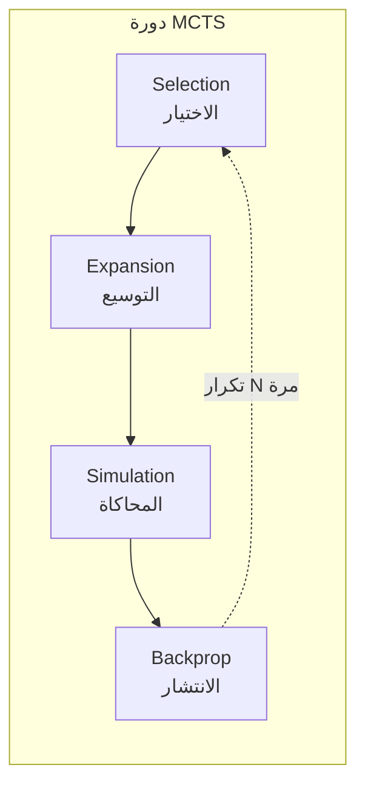
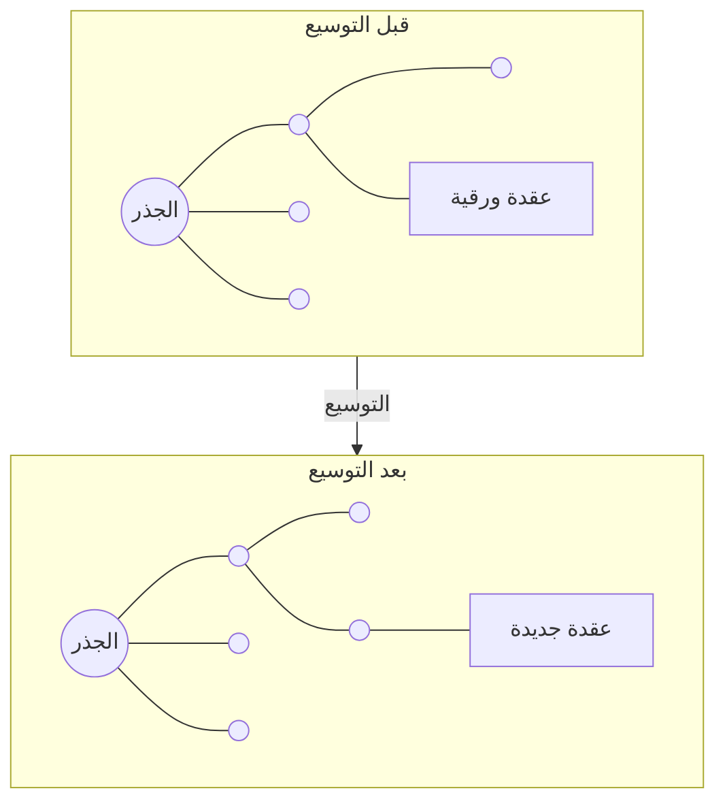
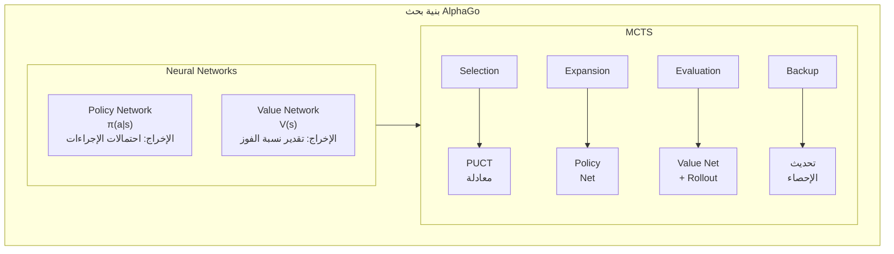

import { MCTSTree } from '@site/src/components/D3Charts';

# دمج MCTS مع الشبكات العصبية

في المقالات السابقة، قدمنا الشبكات العصبية (Policy Network و Value Network) ومفاهيم التعلم المعزز بشكل منفصل. الآن، دعونا نستكشف الابتكار الأساسي لـ AlphaGo — **كيفية الدمج المثالي بين بحث شجرة مونت كارلو (MCTS) والشبكات العصبية**.

هذا الدمج هو مفتاح نجاح AlphaGo: الشبكات العصبية توفر "الحدس"، و MCTS يوفر "الاستدلال"، وكلاهما يكمل الآخر.

---

## مراجعة MCTS التقليدي

### ما هو MCTS؟

**بحث شجرة مونت كارلو (Monte Carlo Tree Search, MCTS)** هو خوارزمية بحث تعتمد على أخذ العينات العشوائية، وهي مناسبة بشكل خاص للذكاء الاصطناعي في الألعاب.

الفكرة الأساسية لـ MCTS هي: **بدلاً من استكشاف جميع الحركات الممكنة، من الأفضل محاكاة عدد كبير من المباريات بشكل عشوائي، واستخدام الإحصائيات لتقدير جودة كل حركة**.

### المراحل الأربع

يتضمن MCTS التقليدي أربع مراحل تتكرر باستمرار:



دعونا نفهم كل مرحلة بالتفصيل:

### 1. Selection (الاختيار)

بدءاً من العقدة الجذرية، ننزل عبر الشجرة، نختار العقدة الفرعية "الأكثر وعداً"، حتى نصل إلى عقدة ورقية.

معيار الاختيار هو معادلة **UCB1 (Upper Confidence Bound)**:

$$\text{UCB1}(s, a) = \bar{X}_{s,a} + c \sqrt{\frac{\ln N_s}{N_{s,a}}}$$

حيث:
- $\bar{X}_{s,a}$: متوسط العائد من العقدة $(s, a)$ (**عنصر الاستغلال**)
- $\sqrt{\frac{\ln N_s}{N_{s,a}}}$: مكافأة الاستكشاف (**عنصر الاستكشاف**)
- $N_s$: عدد زيارات العقدة الأب
- $N_{s,a}$: عدد زيارات العقدة الابن
- $c$: ثابت موازنة الاستكشاف والاستغلال

حكمة هذه المعادلة تكمن في:
- العقد ذات الزيارات القليلة تحصل على مكافأة استكشاف أعلى
- مع زيادة عدد الزيارات، يميل الاختيار أكثر نحو العقد ذات القيمة الفعلية الأعلى

### 2. Expansion (التوسيع)

بعد الوصول إلى العقدة الورقية، نختار إجراءً لم يُستكشف بعد، وننشئ عقدة فرعية جديدة.



### 3. Simulation (المحاكاة/Rollout)

بدءاً من العقدة الجديدة، نستخدم استراتيجية معينة (عادةً عشوائية أو إرشادية بسيطة) لإكمال اللعبة بسرعة والحصول على النتيجة.

هذا هو مصدر تسمية "مونت كارلو" — **استخدام المحاكاة العشوائية لتقدير النتائج**.

استراتيجية rollout في MCTS التقليدي قد تكون:
- **عشوائية بحتة**: اختيار عشوائي متساوٍ من الحركات القانونية
- **إرشادية خفيفة**: استخدام قواعد بسيطة لتصفية الحركات السيئة الواضحة

### 4. Backpropagation (الانتشار العكسي)

نُرجع نتيجة المحاكاة (فوز/خسارة) عبر المسار، ونحدث المعلومات الإحصائية لكل عقدة:

```
محتوى التحديث:
- عدد الزيارات: N(s, a) ← N(s, a) + 1
- القيمة التراكمية: W(s, a) ← W(s, a) + z
- متوسط القيمة: Q(s, a) = W(s, a) / N(s, a)
```

حيث $z$ هي نتيجة المحاكاة (+1 أو -1).

### قيود MCTS التقليدي

أداء MCTS التقليدي في لعبة الغو محدود، المشاكل الرئيسية هي:

1. **جودة Rollout ضعيفة**: المحاكاة العشوائية غالباً ما تنتج ألعاباً غير منطقية
2. **يحتاج محاكاة كثيرة**: كل خطوة قد تحتاج عشرات الآلاف من المحاكاات
3. **تقييم غير دقيق**: الاعتماد فقط على إحصائيات الفوز/الخسارة، كفاءة استخدام المعلومات منخفضة
4. **لا يستفيد من الأنماط**: يبحث من جديد في كل مرة، لا يراكم الخبرة

هذه المشاكل تم حلها بأناقة في AlphaGo بواسطة الشبكات العصبية.

---

## كيف تحسن الشبكات العصبية MCTS

### البنية الكلية

يدمج AlphaGo شبكتين عصبيتين في MCTS:



### دور Policy Network

**Policy Network يعمل في مرحلة التوسيع (Expansion)**.

في MCTS التقليدي، عند التوسيع، جميع الإجراءات غير المستكشفة تُعتبر متساوية الأهمية. لكن Policy Network يوفر **الاحتمالية المسبقة (prior probability)**:

$$P(s, a) = \pi_\theta(a|s)$$

هذا يجعل MCTS يستكشف أولاً الحركات التي "تبدو أفضل"، مما يحسن كفاءة البحث بشكل كبير.

على سبيل المثال، في وضع معين:
- "تينغن" (وسط اللوحة) قد يكون لها 0.01% فقط من الاحتمالية
- "جوسيكي الزاوية" قد يكون لها 15% من الاحتمالية
- "النقطة الكبيرة" قد يكون لها 10% من الاحتمالية

MCTS سيستكشف الحركات ذات الاحتمالية العالية أولاً، بدلاً من إضاعة الوقت على الخيارات الواضحة السيئة.

### دور Value Network

**Value Network يعمل في مرحلة التقييم (Evaluation)**.

MCTS التقليدي يحتاج إكمال اللعبة بالكامل للحصول على التقييم. لكن Value Network يمكنه تقييم نسبة الفوز لأي وضع مباشرة:

$$v(s) = V_\phi(s)$$

هذا مثل طلب رأي خبير في تقييم الوضع، بدلاً من ترك مبتدئين يكملان اللعبة ثم رؤية النتيجة.

النسخة الأصلية من AlphaGo تمزج بين Value Network و Rollout:

$$V(s_L) = (1 - \lambda) \cdot v_\theta(s_L) + \lambda \cdot z_L$$

حيث:
- $v_\theta(s_L)$: تقييم Value Network
- $z_L$: نتيجة Rollout
- $\lambda$: معامل المزج (AlphaGo استخدم $\lambda = 0.5$)

### تصور شجرة البحث

دعونا نتصور شجرة بحث MCTS:

<MCTSTree width={700} height={450} showPUCT={true} interactive={true} />

في هذا التصور، يمكنك رؤية:
- حجم العقدة يعكس عدد الزيارات
- المسار الأزرق هو المسار الأفضل الذي اختاره MCTS
- كل عقدة تعرض عدد الزيارات N ومتوسط القيمة Q

---

## شرح تفصيلي لعملية البحث

### التدفق الكامل

دعونا نتتبع محاكاة MCTS واحدة كاملة:

```
الخوارزمية: محاكاة MCTS واحدة في AlphaGo

المدخلات: العقدة الجذرية s_root، Policy Network π، Value Network V

1. Selection (الاختيار)
   s = s_root
   المسار = []

   while s ليست عقدة ورقية:
       # استخدام معادلة PUCT لاختيار الإجراء
       a* = argmax_a [Q(s,a) + U(s,a)]

       حيث U(s,a) = c_puct · P(s,a) · √N(s) / (1 + N(s,a))

       المسار.append((s, a*))
       s = الحالة بعد تنفيذ الإجراء a*

2. Expansion (التوسيع)
   إذا لم تكن s حالة نهائية:
       # استخدام Policy Network لحساب الاحتمالية المسبقة
       P(s, ·) = π(·|s)

       # إنشاء عقد فرعية لجميع الإجراءات القانونية
       for a in الإجراءات_القانونية:
           إنشاء عقدة فرعية (s, a)
           تعيين P(s,a), N(s,a)=0, W(s,a)=0

3. Evaluation (التقييم)
   # مزج Value Network و Rollout
   v = V(s)                          # تقييم Value Network
   z = rollout(s)                    # نتيجة Rollout
   value = (1-λ)·v + λ·z             # المزج

   # AlphaGo Zero بسّط إلى استخدام Value Network فقط
   # value = V(s)

4. Backpropagation (الانتشار العكسي)
   for (s', a') in عكس(المسار):
       N(s', a') += 1
       W(s', a') += value
       Q(s', a') = W(s', a') / N(s', a')
       value = -value                 # تبديل وجهة النظر
```

### شرح تفصيلي لمرحلة الاختيار

مرحلة الاختيار تستخدم **معادلة PUCT** (ستُناقش بالتفصيل في المقال التالي):

$$a^* = \arg\max_a \left[ Q(s,a) + c_{\text{puct}} \cdot P(s,a) \cdot \frac{\sqrt{N(s)}}{1 + N(s,a)} \right]$$

هذه المعادلة توازن بين:
- **Q(s,a)**: متوسط القيمة المعروف (الاستغلال)
- **U(s,a)**: مكافأة الاستكشاف، تجمع بين الاحتمالية المسبقة وعدد الزيارات (الاستكشاف)

### شرح تفصيلي لمرحلة التوسيع

عند الوصول إلى عقدة ورقية، نستخدم Policy Network لتهيئة العقد الجديدة:

```python
def expand(state, policy_network):
    # الحصول على احتمالية جميع الإجراءات القانونية
    action_probs = policy_network(state)

    # تصفية الإجراءات غير القانونية وإعادة التطبيع
    legal_actions = get_legal_actions(state)
    legal_probs = action_probs[legal_actions]
    legal_probs = legal_probs / legal_probs.sum()

    # إنشاء العقد الفرعية
    for action, prob in zip(legal_actions, legal_probs):
        child = create_node(
            state=apply_action(state, action),
            prior=prob,
            visit_count=0,
            value_sum=0
        )
        add_child(current_node, action, child)
```

### شرح تفصيلي لمرحلة التقييم

النسخة الأصلية من AlphaGo تستخدم نوعين من التقييم بشكل مختلط:

**تقييم Value Network**:
- إدخال الوضع مباشرة، إخراج نسبة الفوز
- حساب سريع (استنتاج شبكة عصبية واحدة)
- يوفر تقييماً من منظور شامل

**تقييم Rollout**:
- استخدام استراتيجية سريعة (Fast Rollout Policy) لإكمال اللعبة
- أبطأ في الحساب لكن يوفر نتيجة لعبة كاملة
- يمكنه اكتشاف بعض التكتيكات التي قد تفوتها الشبكة العصبية

```python
def evaluate(state, value_network, rollout_policy, lambda_mix=0.5):
    # تقييم Value Network
    v = value_network(state)

    # تقييم Rollout
    current = state
    while not is_terminal(current):
        action = rollout_policy(current)
        current = apply_action(current, action)
    z = get_result(current)

    # المزج
    return (1 - lambda_mix) * v + lambda_mix * z
```

AlphaGo Zero أزال Rollout واستخدم Value Network فقط. هذا بسّط النظام وحسّن الكفاءة.

### شرح تفصيلي للانتشار العكسي

إرجاع نتيجة التقييم عبر المسار وتحديث الإحصائيات:

```python
def backpropagate(path, value):
    for state, action in reversed(path):
        # تحديث عدد الزيارات
        state.visit_count[action] += 1
        # تحديث مجموع القيمة
        state.value_sum[action] += value
        # تحديث متوسط القيمة
        state.Q[action] = state.value_sum[action] / state.visit_count[action]
        # تبديل وجهة النظر (مكسب الخصم هو خسارتي)
        value = -value
```

لاحظ خطوة `value = -value`: الغو لعبة مجموعها صفر، فوز طرف هو خسارة الطرف الآخر.

---

## توزيع موارد الحساب

### عدد عمليات البحث

AlphaGo ينفذ عدداً كبيراً من محاكاات MCTS لكل خطوة:

| الإصدار | عدد المحاكاات لكل خطوة | وقت التفكير |
|------|-------------|---------|
| AlphaGo Fan | ~100,000 | دقائق |
| AlphaGo Lee | ~100,000 | دقائق |
| AlphaGo Zero (التدريب) | 1,600 | ثوانٍ |
| AlphaGo Zero (المباراة) | ~1,600 | ثوانٍ |

AlphaGo Zero يحقق قوة أكبر بمحاكاات أقل، وهذا نتيجة تحسين جودة الشبكة العصبية.

### استراتيجية توزيع الوقت

الأوضاع المختلفة قد تحتاج وقت تفكير مختلف:

```python
def allocate_time(game_state, remaining_time):
    # التوزيع الأساسي
    num_moves_remaining = estimate_remaining_moves(game_state)
    base_time = remaining_time / num_moves_remaining

    # عوامل التعديل
    complexity = estimate_complexity(game_state)
    importance = estimate_importance(game_state)

    # الأوضاع المعقدة أو المهمة تحصل على وقت أكثر
    allocated_time = base_time * complexity * importance

    # التأكد من عدم تجاوز الوقت
    return min(allocated_time, remaining_time * 0.3)
```

في المباريات الفعلية، AlphaGo يستثمر وقت تفكير أكثر في اللحظات الحاسمة (مثل اللحظات القريبة من حد الفوز/الخسارة).

### البحث المتوازي

MCTS مناسب بطبيعته للتوازي:

**تقنية الخسارة الافتراضية (Virtual Loss)**:

```
عندما يستكشف thread مساراً P:
1. نفترض مؤقتاً أن هذا المسار خسر (virtual loss)
2. الـ threads الأخرى ستميل لاستكشاف مسارات أخرى
3. عندما تصل النتيجة، نحدث الإحصائيات الحقيقية ونزيل الخسارة الافتراضية
```

هذا يضمن أن threads متعددة لن تستكشف نفس المسار بشكل متكرر.

```python
def parallel_mcts_simulation(root, num_threads=8):
    virtual_losses = {}

    def simulate(thread_id):
        # مرحلة الاختيار (مع الخسارة الافتراضية)
        path = []
        node = root
        while not node.is_leaf():
            action = select_with_virtual_loss(node, virtual_losses)
            add_virtual_loss(node, action, virtual_losses)
            path.append((node, action))
            node = node.children[action]

        # التوسيع والتقييم
        value = expand_and_evaluate(node)

        # الانتشار العكسي وإزالة الخسارة الافتراضية
        backpropagate(path, value)
        remove_virtual_losses(path, virtual_losses)

    # تنفيذ محاكاات متعددة بالتوازي
    threads = [Thread(target=simulate, args=(i,)) for i in range(num_threads)]
    for t in threads:
        t.start()
    for t in threads:
        t.join()
```

### المعالجة الدفعية على GPU

استنتاج الشبكة العصبية يكون أكثر كفاءة على GPU بالمعالجة الدفعية. AlphaGo يستخدم **التقييم الدفعي**:

```
بدون الدفعات:
  محاكاة 1 → تقييم 1 → محاكاة 2 → تقييم 2 → ...
  استخدام GPU منخفض

مع الدفعات:
  جمع 32 وضعاً للتقييم
  → إرسالها دفعة واحدة إلى GPU للتقييم
  → إرجاع 32 نتيجة
  استخدام GPU عالي
```

هذا يتطلب جدولة أكثر تعقيداً، لكنه يحسن الإنتاجية بشكل كبير.

---

## درجة الحرارة والاختيار النهائي

### درجة الحرارة أثناء التدريب

أثناء تدريب اللعب الذاتي، AlphaGo يستخدم **درجة الحرارة** للتحكم في الاستكشاف:

$$\pi(a) = \frac{N(s,a)^{1/\tau}}{\sum_{a'} N(s,a')^{1/\tau}}$$

حيث $\tau$ هو معامل درجة الحرارة.

- $\tau = 1$: الاحتمالية متناسبة مع عدد الزيارات (الحفاظ على التنوع)
- $\tau \to 0$: اختيار الإجراء ذي أكثر عدد زيارات (اختيار حتمي)

استراتيجية AlphaGo Zero:
- **أول 30 خطوة**: $\tau = 1$، للحفاظ على تنوع الافتتاح
- **بعد ذلك**: $\tau \to 0$، اختيار أفضل حركة

### الاختيار أثناء المباراة

في المباريات الفعلية، الاختيار عادةً ما يكون حتمياً:

```python
def select_move(root, temperature=0):
    if temperature == 0:
        # اختيار الإجراء ذي أكثر عدد زيارات
        return argmax(root.visit_counts)
    else:
        # أخذ عينة من توزيع الاحتمالية المعدل بدرجة الحرارة
        probs = root.visit_counts ** (1 / temperature)
        probs = probs / probs.sum()
        return np.random.choice(actions, p=probs)
```

### النظر في نسبة الفوز

أحياناً نأخذ متوسط القيمة بعين الاعتبار بدلاً من عدد الزيارات فقط:

```python
def select_move_with_value(root, temperature=0):
    # مزج عدد الزيارات والقيمة
    scores = root.visit_counts * (1 + root.Q_values)
    scores = scores / scores.sum()

    if temperature == 0:
        return argmax(scores)
    else:
        probs = scores ** (1 / temperature)
        probs = probs / probs.sum()
        return np.random.choice(actions, p=probs)
```

---

## المقارنة مع الشبكة العصبية الصرفة

### لماذا نحتاج البحث؟

سؤال طبيعي هو: **بما أن الشبكة العصبية يمكنها التنبؤ بالحركات الجيدة، لماذا نحتاج البحث؟**

الجواب هو: **البحث يمكنه تصحيح أخطاء الشبكة العصبية واكتشاف حركات أفضل**.

| الطريقة | المزايا | العيوب |
|------|------|------|
| شبكة عصبية صرفة | سريعة، حدسية | قد يكون لها نقاط عمياء |
| MCTS صرف | يمكنه التحليل العميق | بطيء، يحتاج تقييم |
| شبكة عصبية + MCTS | يجمع مزايا الاثنين | كثيف الحساب |

### الأدلة التجريبية

تجارب DeepMind أظهرت:

```
Policy Network صرف: حوالي 3000 Elo
Policy + قليل من MCTS: حوالي 3500 Elo
Policy + Value + MCTS: حوالي 4500 Elo
```

البحث يوفر تحسيناً ملحوظاً في قوة اللعب.

### دور البحث

البحث له قيمة خاصة في المواقف التالية:

1. **الحساب التكتيكي**: قراءة الهجوم والقتل المعقد
2. **تصحيح التحيز**: تصحيح الأخطاء المنهجية للشبكة العصبية
3. **التعامل مع الأوضاع النادرة**: أوضاع قد لا تكون الشبكة العصبية رأتها أثناء التدريب
4. **التحقق من الحدس**: التأكد من أن الحركة "الجيدة الظاهر" هي فعلاً جيدة

---

## الفروقات بين إصدارات AlphaGo

### AlphaGo Fan/Lee

```
البنية:
- SL Policy Network (تعلم إشرافي)
- RL Policy Network (تعلم معزز)
- Value Network
- Fast Rollout Policy

أثناء البحث:
- استخدام الاحتمالية المسبقة من SL Policy Network
- مزج تقييم Value Network و Rollout
```

### AlphaGo Master

```
البنية:
- شبكة عصبية أكبر
- بيانات تدريب أكثر
- ميزات محسنة

أثناء البحث:
- مشابه لـ AlphaGo Lee
- شبكة أقوى = حاجة أقل للبحث
```

### AlphaGo Zero

```
البنية:
- ResNet مزدوج الرأس واحد
- تدريب من الصفر
- بدون Rollout

أثناء البحث:
- رأس السياسة يوفر الاحتمالية المسبقة
- رأس القيمة يقيّم مباشرة
- أبسط وأقوى
```

### ملخص التطور

```
AlphaGo Fan (2015)
    │
    │ + شبكة أكبر، تدريب أكثر
    ▼
AlphaGo Lee (2016)
    │
    │ + لعب ذاتي أكثر
    ▼
AlphaGo Master (2017)
    │
    │ + إزالة بيانات البشر، شبكة موحدة، إزالة Rollout
    ▼
AlphaGo Zero (2017)
    │
    │ + التعميم على ألعاب أخرى
    ▼
AlphaZero (2018)
```

---

## اعتبارات التنفيذ

### إدارة الذاكرة

شجرة MCTS يمكن أن تصبح كبيرة جداً:

```
افتراض:
- متوسط 200 إجراء قانوني لكل خطوة
- عمق البحث 10
- التوسيع الكامل: 200^10 ≈ 10^23 عقدة (مستحيل)

الممارسة الفعلية:
- توسيع العقد التي تمت زيارتها فقط
- تنظيف العقد نادرة الزيارة بشكل دوري
- إعادة استخدام شجرة البحث من الخطوة السابقة
```

### إعادة استخدام الشجرة

عندما يلعب الخصم، يمكن إعادة استخدام جزء من شجرة البحث:

```python
def reuse_tree(root, opponent_move):
    if opponent_move in root.children:
        new_root = root.children[opponent_move]
        # تنظيف الفروع الأخرى غير المطلوبة
        for action in root.children:
            if action != opponent_move:
                delete_subtree(root.children[action])
        return new_root
    else:
        # الخصم لعب حركة غير متوقعة، يجب البدء من جديد
        return create_new_root()
```

### التخزين المؤقت للشبكة العصبية

نفس الوضع قد يُقيَّم عدة مرات، استخدام التخزين المؤقت يتجنب الحساب المكرر:

```python
class NeuralNetworkCache:
    def __init__(self, max_size=100000):
        self.cache = LRUCache(max_size)

    def evaluate(self, state, network):
        state_hash = hash(state)
        if state_hash in self.cache:
            return self.cache[state_hash]
        else:
            result = network(state)
            self.cache[state_hash] = result
            return result
```

### استغلال التناظر

لوحة الغو لها 8 تناظرات، يمكن استخدامها لتعزيز البحث:

```python
def evaluate_with_symmetry(state, network):
    # توليد جميع التحويلات المتناظرة
    symmetries = generate_symmetries(state)  # 8 نسخ

    # تقييم جميع النسخ
    values = [network(s) for s in symmetries]

    # المتوسط (أكثر استقراراً)
    return np.mean(values)
```

---

## عمق البحث وعرضه

### التعديل الديناميكي

MCTS يوازن تلقائياً بين العمق والعرض:

- **العرض**: يُتحكم به بواسطة الاحتمالية المسبقة من Policy Network
- **العمق**: يُحدد بواسطة دقة Value Network

عندما تكون الشبكة العصبية جيدة:
- الحركات ذات الثقة العالية يتم استكشافها بعمق
- الحركات ذات الثقة المنخفضة تُستبعد بسرعة
- البحث يركز بشكل طبيعي على الفروع المهمة

### المقارنة مع البحث التقليدي

| الطريقة | التحكم في العمق | التحكم في العرض |
|------|---------|---------|
| Minimax | عمق ثابت | تقليم Alpha-Beta |
| MCTS التقليدي | يُحدد بالمحاكاة | UCB1 |
| AlphaGo MCTS | يُوجه بـ Policy + Value | PUCT + Policy |

بحث AlphaGo أكثر "ذكاءً" — يعرف أين يستحق التعمق، وأين يمكن تجاوزه بسرعة.

---

## تطابق الرسوم المتحركة

المفاهيم الأساسية في هذه المقالة ورقم الرسوم المتحركة المقابل:

| الرقم | المفهوم | التطابق الفيزيائي/الرياضي |
|------|------|--------------|
| 🎬 C5 | مراحل MCTS الأربع | بحث الشجرة |

---

## الملخص

دمج MCTS مع الشبكات العصبية هو الابتكار الأساسي لـ AlphaGo. تعلمنا:

1. **MCTS التقليدي**: الاختيار، التوسيع، المحاكاة، الانتشار العكسي
2. **تحسينات الشبكة العصبية**: Policy Network يوجه التوسيع، Value Network يحل محل Rollout
3. **عملية البحث**: اختيار PUCT، التقييم الدفعي، الانتشار العكسي
4. **توزيع الموارد**: عدد المحاكاات، إدارة الوقت، البحث المتوازي
5. **اختيار درجة الحرارة**: استراتيجيات مختلفة للتدريب والمباراة
6. **تفاصيل التنفيذ**: إدارة الذاكرة، إعادة استخدام الشجرة، التخزين المؤقت

في المقال التالي، سنستكشف بالتفصيل الأساسيات الرياضية لمعادلة PUCT.

---

## قراءة موسعة

- **المقال التالي**: [شرح تفصيلي لمعادلة PUCT](../puct-formula) — المبادئ الرياضية لاختيار MCTS
- **المقال السابق**: [اللعب الذاتي](../self-play) — آلية وتأثير اللعب الذاتي
- **ذو صلة**: [شرح تفصيلي لـ Policy Network](../policy-network) — بنية شبكة السياسة

---

## المراجع

1. Silver, D., et al. (2016). "Mastering the game of Go with deep neural networks and tree search." *Nature*, 529, 484-489.
2. Silver, D., et al. (2017). "Mastering the game of Go without human knowledge." *Nature*, 550, 354-359.
3. Coulom, R. (2006). "Efficient Selectivity and Backup Operators in Monte-Carlo Tree Search." *Computers and Games*.
4. Kocsis, L., & Szepesvári, C. (2006). "Bandit based Monte-Carlo Planning." *ECML*.
5. Browne, C., et al. (2012). "A Survey of Monte Carlo Tree Search Methods." *IEEE TCIAIG*.
6. Rosin, C. D. (2011). "Multi-armed bandits with episode context." *Annals of Mathematics and Artificial Intelligence*.
