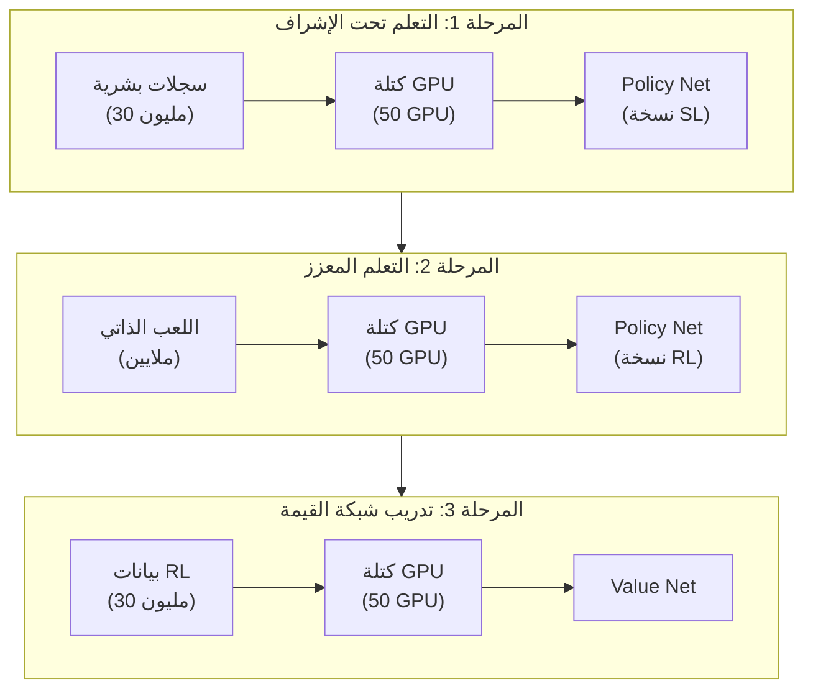
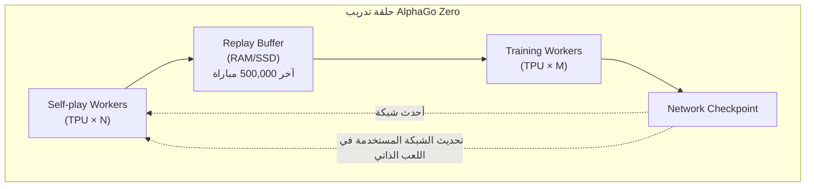
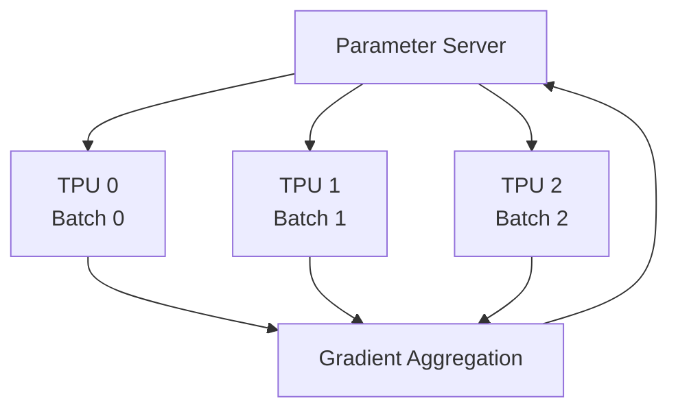
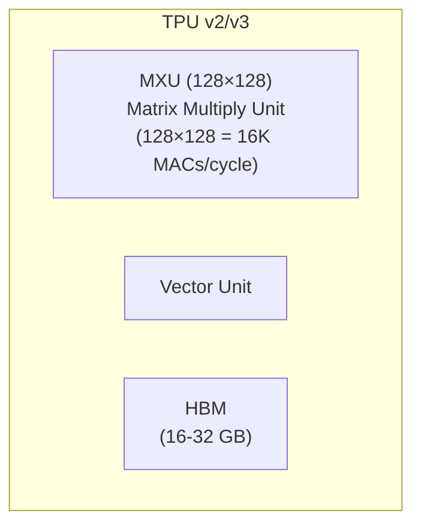
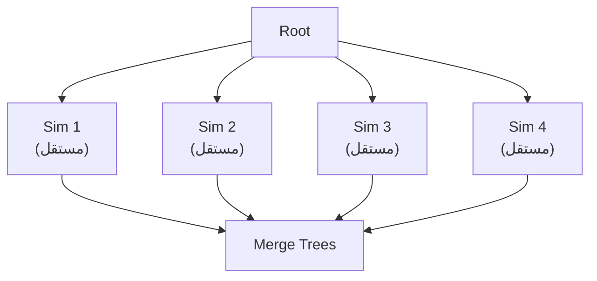
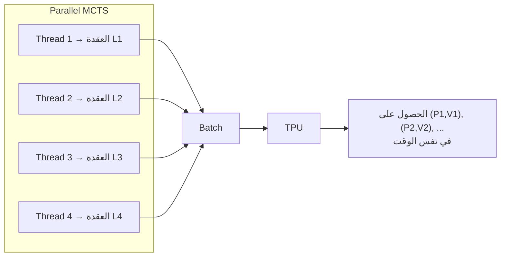
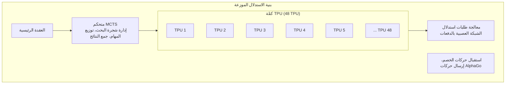

# الأنظمة الموزعة و TPU

نجاح AlphaGo ليس فقط انتصاراً للخوارزميات، بل أيضاً انتصاراً للهندسة. لتدريب ذكاء اصطناعي للغو يتجاوز مستوى البشر في وقت معقول، يتطلب الأمر أنظمة موزعة مصممة بعناية ودعم أجهزة متخصصة.

ستحلل هذه المقالة بنية النظام وراء AlphaGo، بما في ذلك سير التدريب وبنية الاستدلال و MCTS المتوازي والدور الحاسم لـ TPU.

---

## نظرة عامة على بنية التدريب

### بنية تدريب AlphaGo الأصلي

كان تدريب AlphaGo الأصلي (النسخة التي هزمت لي سيدول) مقسماً إلى عدة مراحل، كل مرحلة تستخدم تكوينات موارد مختلفة:



### بنية تدريب AlphaGo Zero

بسّط AlphaGo Zero سير التدريب بشكل كبير، باستخدام حلقة تدريب واحدة من البداية إلى النهاية:



مزايا هذه البنية:

1. **التعلم المستمر**: اللعب الذاتي والتدريب يجريان في نفس الوقت، لا حاجة للانتظار
2. **كفاءة الموارد**: جميع الموارد تقوم بعمل مفيد
3. **تكرار سريع**: بعد تحديث الشبكة، تُستخدم فوراً لإنتاج بيانات جديدة

---

## محطات اللعب الذاتي (Self-play Workers)

### توزيع المهام

محطات اللعب الذاتي مسؤولة عن إجراء اللعب الذاتي باستخدام أقوى شبكة حالية لإنتاج بيانات التدريب.

| التكوين | AlphaGo Zero |
|---------|--------------|
| عدد Workers | عشرات |
| كل Worker | 1-4 TPU |
| MCTS لكل مباراة | 1,600 محاكاة |
| الإنتاج اليومي | ~100,000 مباراة |

### سير العمل

سير عمل كل Self-play Worker:

```python
while True:
    # 1. تحميل أحدث أوزان الشبكة
    network = download_latest_checkpoint()

    # 2. إجراء عدة مباريات لعب ذاتي
    for game in range(batch_size):
        positions = []
        board = EmptyBoard()

        while not board.is_terminal():
            # تنفيذ MCTS
            mcts = MCTS(network, board)
            policy = mcts.search(num_simulations=1600)

            # اختيار الحركة
            action = sample(policy)

            # التسجيل
            positions.append((board.state, policy))

            # اللعب
            board = board.play(action)

        # 3. الحصول على النتيجة
        result = board.get_result()

        # 4. رفع البيانات
        upload_to_replay_buffer(positions, result)
```

### موازنة الحمل

عدة Workers تحتاج موازنة الحمل:

- **مزامنة الشبكة**: جميع Workers تستخدم نفس نسخة الشبكة
- **موازنة البيانات**: ضمان استخدام بيانات من Workers مختلفة
- **معالجة الأخطاء**: فشل Worker واحد لا يؤثر على التدريب العام

---

## محطات التدريب (Training Workers)

### توزيع المهام

محطات التدريب مسؤولة عن أخذ عينات من Replay Buffer وتدريب الشبكة العصبية.

| التكوين | AlphaGo Zero |
|---------|--------------|
| عدد Workers | 1-4 |
| كل Worker | 4 TPU |
| Batch Size | 2048 (512 لكل TPU) |
| خطوات التدريب | عشرات الآلاف يومياً |

### التدريب الموزع

التدريب على نطاق واسع يستخدم **التوازي في البيانات (Data Parallelism)**:



كل TPU يعالج mini-batch مختلف، يحسب التدرجات المحلية، ثم يجمعها لتحديث المعاملات العامة.

### التحديث المتزامن مقابل غير المتزامن

| طريقة التحديث | المزايا | العيوب |
|--------------|---------|--------|
| متزامن | مستقر، قابل للتكرار | Workers تنتظر الأبطأ |
| غير متزامن | إنتاجية عالية | التدرجات قد تكون قديمة |

AlphaGo Zero يستخدم **التحديث المتزامن** لضمان استقرار التدريب.

---

## دور TPU

### ما هو TPU؟

**TPU (Tensor Processing Unit)** هو مسرّع صممته Google خصيصاً للتعلم العميق:

| الخاصية | TPU | GPU | CPU |
|---------|-----|-----|-----|
| هدف التصميم | عمليات المصفوفات | التوازي العام | الحوسبة العامة |
| الدقة | محسّن لـ FP16/BF16 | FP32/FP16 | FP64/FP32 |
| استهلاك الطاقة | منخفض نسبياً | أعلى | الأعلى |
| التأخير | منخفض | متوسط | عالي |

### بنية TPU

جوهر TPU هو **MXU (Matrix Multiply Unit)**:



يمكن لـ MXU تنفيذ 16K عملية ضرب وجمع في كل دورة، وهذا حاسم لضرب المصفوفات في الشبكات العصبية.

### لماذا يحتاج AlphaGo إلى TPU؟

عنق الزجاجة الحسابي في ذكاء الغو الاصطناعي هو **استدلال الشبكة العصبية**:

| العملية | النسبة |
|---------|--------|
| التمرير الأمامي للشبكة العصبية | ~95% |
| عمليات شجرة MCTS | ~4% |
| أخرى | ~1% |

كل خطوة MCTS تحتاج تنفيذ 1600 استدلال للشبكة العصبية. الإنتاجية العالية لـ TPU تجعل هذا ممكناً.

### تطور استخدام TPU

| النسخة | TPU للتدريب | TPU للاستدلال |
|--------|-------------|---------------|
| AlphaGo Lee | 50 GPU | 48 TPU (v1) |
| AlphaGo Master | 4 TPU (v2) | 4 TPU (v2) |
| AlphaGo Zero | 4 TPU (v2) | 4 TPU (v2) (قابل للتوسع) |

انخفض عدد TPU المستخدم في AlphaGo Zero بشكل كبير، بفضل البنية الأكثر كفاءة ونسخة TPU الأحدث.

---

## MCTS المتوازي والخسارة الافتراضية

### تحدي التوازي

التنفيذ القياسي لـ MCTS هو **تسلسلي**:

```
for i in range(num_simulations):
    1. Selection: الاختيار من الجذر إلى الأسفل
    2. Expansion: توسيع العقدة الورقية
    3. Evaluation: تقييم الشبكة العصبية
    4. Backup: إرجاع التحديث
```

لكن تقييم الشبكة العصبية هو **عملية دفعية** صديقة لـ GPU/TPU. كيف نجعل عدة محاكاة تجري في نفس الوقت؟

### توازي العقد الورقية (Leaf Parallelization)

أبسط طريقة للتوازي: تنفيذ عدة محاكاة كاملة في نفس الوقت، ثم دمج النتائج.



المشكلة: كل محاكاة تبدأ من الجذر، ستكرر استكشاف نفس المسارات.

### الخسارة الافتراضية (Virtual Loss)

اعتمدت DeepMind تقنية **الخسارة الافتراضية** لتحقيق توازي الشجرة (Tree Parallelization).

#### المفهوم الأساسي

عندما يستكشف خيط معين عقدة ما، يتم خفض قيمة تلك العقدة مؤقتاً، مما يجعل الخيوط الأخرى تختار مسارات أخرى.

```
UCB العادي: Q(s,a) + c * P(s,a) * sqrt(N(s)) / (1 + N(s,a))

بعد إضافة الخسارة الافتراضية:
(Q(s,a) * N(s,a) - v * n_virtual) / (N(s,a) + n_virtual) + c * P(s,a) * sqrt(N(s)) / (1 + N(s,a) + n_virtual)
```

حيث:
- `n_virtual` هو عدد الخيوط التي تستكشف تلك العقدة حالياً
- `v` هي قيمة الخسارة الافتراضية (عادة 1 أو القيمة المقابلة لمعدل الفوز)

#### سير العمل

```
الوقت T1:
  Thread 1 يختار المسار A → B → C
  العقدة C تحصل على خسارة افتراضية -1

الوقت T2:
  Thread 2 يختار المسار A → B → D (لأن C "معاقبة")
  العقدة D تحصل على خسارة افتراضية -1

الوقت T3:
  Thread 1 ينهي التقييم، يحدث القيمة الفعلية لـ C، يزيل الخسارة الافتراضية
  Thread 3 الآن قد يختار C (إذا كانت القيمة الفعلية جيدة بما فيه الكفاية)
```

#### تأثير الخسارة الافتراضية

| الجانب | التأثير |
|--------|---------|
| تنوع الاستكشاف | يفرض استكشاف مسارات مختلفة |
| كفاءة الدفعات | يمكن تقييم عدة عقد ورقية في نفس الوقت |
| التقارب | الخسارة الافتراضية تُستبدل بالقيمة الحقيقية في النهاية، لا تؤثر على التقارب |

### تقييم الشبكة العصبية بالدفعات

من خلال الخسارة الافتراضية، يمكن جمع عدة عقد ورقية للتقييم وإجراء **استدلال دفعي**:



كفاءة الاستدلال الدفعي لـ TPU أعلى بكثير من الاستدلال الفردي، مما يجعل MCTS المتوازي ممكناً.

---

## بنية الاستدلال

### التكوين أثناء المباريات

بنية استدلال AlphaGo في المباريات الرسمية:

| النسخة | تكوين الأجهزة |
|--------|---------------|
| AlphaGo Fan | 176 GPU |
| AlphaGo Lee | 48 TPU + عدة خوادم |
| AlphaGo Master | 4 TPU |
| AlphaGo Zero | 4 TPU (قابل للتوسع) |

### سير الاستدلال الموزع

سير الاستدلال أثناء المباريات (مثال AlphaGo Lee):



### إدارة وقت التفكير

استراتيجية إدارة الوقت في AlphaGo:

| الموقف | وقت التفكير | عدد MCTS |
|--------|-------------|----------|
| الافتتاح (جوسيكي) | أقصر | ~10,000 |
| وسط اللعبة (معقد) | أطول | ~100,000 |
| موقف واضح | أقصر | ~5,000 |
| البيوومي | ثابت | ~1,600 |

المزيد من محاكاة MCTS يعني عادةً جودة أفضل للحركات.

---

## الاتصال والمزامنة

### تنسيق البيانات

تنسيق نقل بيانات التدريب:

```protobuf
message TrainingExample {
    // حالة اللوحة (17 × 19 × 19)
    repeated float board_planes = 1;

    // نتيجة بحث MCTS (362)
    repeated float mcts_policy = 2;

    // نتيجة المباراة (1 = الطرف الحالي فاز، -1 = الطرف الحالي خسر)
    float game_result = 3;
}
```

### متطلبات عرض النطاق الترددي

| تدفق البيانات | الحجم | التكرار |
|--------------|-------|---------|
| عينات التدريب | ~10 KB/عينة | آلاف العينات في الثانية |
| أوزان الشبكة | ~200 MB | عدة مرات في الساعة |
| رسائل التحكم | < 1 KB | مستمر |

إجمالي متطلبات النطاق الترددي: ~100 Mbps (الشبكة الداخلية كافية)

### معالجة الأعطال

معالجة الأعطال في النظام الموزع:

| نوع العطل | طريقة المعالجة |
|----------|---------------|
| Worker يتوقف | إعادة التشغيل، الاستمرار باستخدام آخر checkpoint |
| انقطاع الشبكة | تخزين البيانات مؤقتاً، إعادة الإرسال بعد الاتصال |
| عطل TPU | التبديل التلقائي إلى TPU احتياطي |
| تلف البيانات | التحقق ثم الحذف، إعادة الإنتاج |

---

## تحليل التكاليف

### تقدير تكلفة الأجهزة

تقدير تكلفة تدريب AlphaGo Zero بناءً على أسعار Google Cloud TPU:

| المورد | الكمية | السعر/ساعة | الإجمالي/يوم |
|--------|--------|------------|--------------|
| TPU v2 Pod | 4 | ~$32 | ~$3,000 |
| VM عالية الذاكرة | عدة | ~$5 | ~$500 |
| مساحة التخزين | 10 TB | ~$0.02/GB | ~$200 |
| الشبكة | - | مضمنة | - |

**حوالي $3,700 يومياً**، التدريب الكامل (40 يوماً) حوالي **$150,000**.

ملاحظة: هذا تقدير لعام 2017، DeepMind كشركة تابعة لـ Google قد يكون لديها خصومات داخلية.

### مقارنة مع تدريب البشر

| الجانب | AlphaGo Zero | لاعب محترف بشري |
|--------|--------------|-----------------|
| الوصول للمستوى المحترف | يومان | 10-15 سنة |
| تكلفة التدريب | ~$7,500 | ملايين (رسوم، نفقات معيشة، تكلفة الفرصة البديلة) |
| التكلفة المستمرة | الكهرباء | نفقات المعيشة |
| قابلية النسخ | نسخ مثالي | غير قابل للنسخ |

بالطبع، هذه المقارنة ليست عادلة تماماً - البشر يتعلمون أكثر من مجرد الغو أثناء تعلمهم للعبة.

### تكلفة الاستدلال

تكلفة الاستدلال في المباريات الرسمية:

| التكوين | تكلفة المباراة |
|---------|--------------|
| 48 TPU (AlphaGo Lee) | ~$500 |
| 4 TPU (AlphaGo Zero) | ~$50 |
| GPU واحد (KataGo) | ~$1 |

تكلفة الاستدلال انخفضت بشكل كبير مع تقدم التكنولوجيا.

---

## التطور التقني

### من AlphaGo إلى AlphaZero

| الجانب | AlphaGo Lee | AlphaGo Zero | AlphaZero |
|--------|-------------|--------------|-----------|
| TPU للتدريب | 50+ GPU → TPU | 4 TPU | 4 TPU |
| TPU للاستدلال | 48 TPU | 4 TPU | 4 TPU |
| MCTS/خطوة | ~100,000 | ~1,600 | ~800 |
| وقت التدريب | أشهر | 40 يوم | ساعات-أيام |

تحسن الكفاءة حوالي 100 ضعف.

### التأثير على مجتمع المصادر المفتوحة

بنية AlphaGo ألهمت عدة مشاريع مفتوحة المصدر:

| المشروع | الميزات |
|---------|---------|
| Leela Zero | تدريب موزع مجتمعي، إعادة إنتاج AlphaGo Zero |
| KataGo | تدريب فعال على GPU واحد، يتجاوز AlphaGo Zero |
| ELF OpenGo | مفتوح المصدر من Facebook، يستخدم PyTorch |
| Minigo | مفتوح المصدر من Google، يستخدم TensorFlow |

هذه المشاريع مكّنت الباحثين العاديين من تدريب ذكاء اصطناعي قوي للغو.

---

## الرسوم المتحركة المقابلة

المفاهيم الأساسية في هذه المقالة وأرقام الرسوم المتحركة:

| الرقم | المفهوم | المقابل في الفيزياء/الرياضيات |
|-------|---------|------------------------------|
| 🎬 C9 | MCTS المتوازي | مشكلة الأجسام المتعددة |
| 🎬 E9 | التدريب الموزع | الحوسبة الموزعة |
| 🎬 C5 | الخسارة الافتراضية | قوة التنافر |
| 🎬 D15 | الاستدلال الدفعي | الحسابات المتجهة |

---

## قراءة إضافية

- **المقالة السابقة**: [عملية التدريب من الصفر](../training-from-scratch) — تحليل مفصل لمنحنى التدريب
- **المقالة التالية**: [إرث AlphaGo](../legacy-and-impact) — التأثير العميق لـ AlphaGo على مجال الذكاء الاصطناعي
- **مقالة ذات صلة**: [الجمع بين MCTS والشبكات العصبية](../mcts-neural-combo) — أساسيات MCTS

---

## المراجع

1. Silver, D., et al. (2017). "Mastering the game of Go without human knowledge." *Nature*, 550, 354-359.
2. Jouppi, N., et al. (2017). "In-Datacenter Performance Analysis of a Tensor Processing Unit." *ISCA 2017*.
3. Dean, J., et al. (2012). "Large Scale Distributed Deep Networks." *NeurIPS 2012*.
4. Chaslot, G., et al. (2008). "Parallel Monte-Carlo Tree Search." *CIG 2008*.
5. Segal, R. (2010). "On the Scalability of Parallel UCT." *CIG 2010*.
