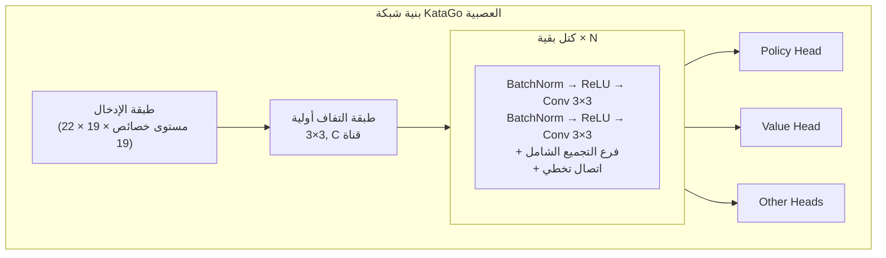
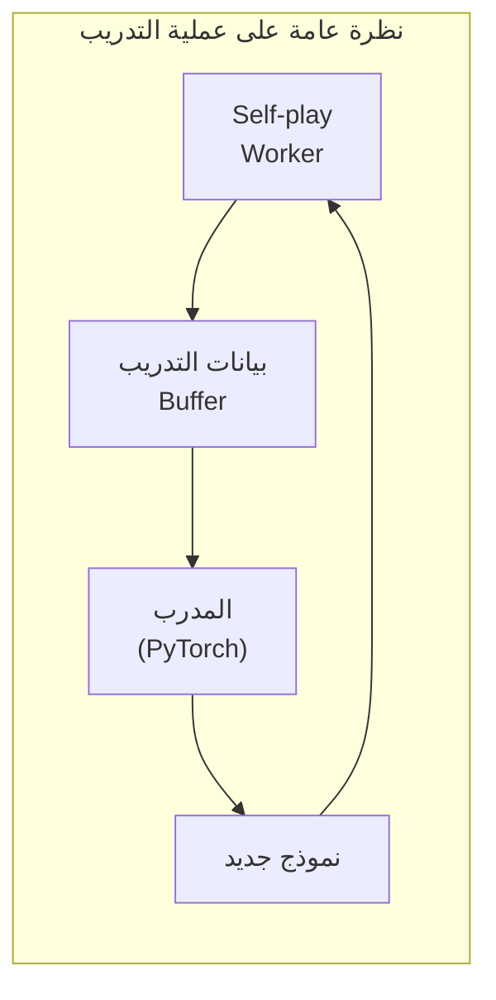

# هندسة كود KataGo المصدري

تحلل هذه المقالة بعمق هيكل كود KataGo المصدري، لمساعدتك على فهم تنفيذه الداخلي. سواء كنت تريد المساهمة بالكود، أو تعديل الميزات، أو تطبيق تقنياته في مشروعك الخاص، هذا مرجع ضروري.

## هيكل دليل المشروع

```
KataGo/
├── cpp/                    # كود C++ الأساسي
│   ├── main.cpp           # نقطة الدخول الرئيسية
│   ├── command/           # أوضاع التنفيذ المختلفة
│   ├── core/              # فئات الأدوات الأساسية
│   ├── game/              # قواعد Go واللوحة
│   ├── search/            # محرك بحث MCTS
│   ├── neuralnet/         # واجهة الشبكة العصبية
│   ├── dataio/            # إدخال/إخراج البيانات
│   ├── configs/           # ملفات تكوين نموذجية
│   └── tests/             # اختبارات الوحدة
├── python/                 # كود تدريب Python
│   ├── train.py           # برنامج التدريب الرئيسي
│   ├── model.py           # تعريف النموذج
│   ├── data_processing_pytorch.py
│   └── configs/           # تكوين التدريب
├── docs/                   # الوثائق
└── scripts/               # سكربتات مساعدة
```

### تفاصيل دليل cpp/

```
cpp/
├── main.cpp                # نقطة دخول البرنامج، تحليل سطر الأوامر
├── command/
│   ├── gtp.cpp            # تنفيذ بروتوكول GTP
│   ├── analysis.cpp       # تنفيذ Analysis Engine
│   ├── benchmark.cpp      # اختبار الأداء
│   ├── genconfig.cpp      # توليد ملفات التكوين
│   └── selfplay.cpp       # اللعب الذاتي
├── core/
│   ├── global.h           # الثوابت والإعدادات العامة
│   ├── hash.h             # تجزئة Zobrist
│   ├── rand.h             # توليد الأرقام العشوائية
│   ├── logger.h           # نظام السجلات
│   ├── config_parser.h    # تحليل ملفات التكوين
│   └── threadsafe*.h      # أدوات أمان الخيوط
├── game/
│   ├── board.h/cpp        # تمثيل اللوحة والعمليات الأساسية
│   ├── rules.h/cpp        # قواعد Go
│   ├── boardhistory.h/cpp # تاريخ المباراة
│   └── graphhash.h/cpp    # تجزئة الموقف
├── search/
│   ├── search.h/cpp       # فئة محرك البحث الرئيسية
│   ├── searchnode.h/cpp   # عقدة شجرة البحث
│   ├── searchparams.h     # بارامترات البحث
│   ├── mutexpool.h        # مجموعة الأقفال
│   ├── searchresults.h    # نتائج البحث
│   └── asyncbot.h/cpp     # روبوت غير متزامن
├── neuralnet/
│   ├── nninputs.h/cpp     # خصائص إدخال الشبكة العصبية
│   ├── nneval.h/cpp       # تقييم الشبكة العصبية
│   ├── nninterface.h      # واجهة مجردة للواجهة الخلفية
│   ├── cudabackend.cpp    # واجهة CUDA الخلفية
│   ├── openclbackend.cpp  # واجهة OpenCL الخلفية
│   ├── eigenbackend.cpp   # واجهة Eigen(CPU) الخلفية
│   └── modelversion.h     # إدارة إصدار النموذج
└── dataio/
    ├── sgf.h/cpp          # معالجة ملفات SGF
    ├── numpywrite.h/cpp   # إخراج صيغة NumPy
    └── trainingwrite.h/cpp # كتابة بيانات التدريب
```

## بنية الشبكة العصبية

### نظرة عامة على هيكل الشبكة



### خصائص الإدخال (nninputs.cpp)

يستخدم KataGo 22 مستوى خصائص كإدخال:

```cpp
// فئات خصائص الإدخال الرئيسية
enum {
  // حالة اللوحة
  INPUT_FEATURE_STONE_OUR,      // أحجارنا
  INPUT_FEATURE_STONE_OPP,      // أحجار الخصم

  // متعلقة بالحريات (1-8 حريات)
  INPUT_FEATURE_LIBERTIES_1,
  INPUT_FEATURE_LIBERTIES_2,
  // ...
  INPUT_FEATURE_LIBERTIES_8_OR_MORE,

  // الحالة التاريخية
  INPUT_FEATURE_LAST_MOVE,      // موقع الحركة الأخيرة
  INPUT_FEATURE_SECOND_LAST_MOVE,

  // متعلقة بالقواعد
  INPUT_FEATURE_KOMI,           // الكومي
  INPUT_FEATURE_RULES,          // ترميز القواعد
  // ...
};
```

### فرع التجميع الشامل

أحد ابتكارات KataGo هو إضافة التجميع الشامل في كتل البقية:

```cpp
// مفهوم تنفيذ التجميع الشامل المبسط
class GlobalPoolingResBlock {
public:
  void forward(Tensor& x) {
    // المسار البقائي القياسي
    Tensor regular_out = regular_conv_path(x);

    // مسار التجميع الشامل
    Tensor global_mean = global_avg_pool(x);  // [batch, C]
    Tensor global_max = global_max_pool(x);    // [batch, C]
    Tensor global_features = concat(global_mean, global_max);

    // معالجة الخصائص الشاملة
    global_features = dense_layer(global_features);  // [batch, C]

    // بث الخصائص الشاملة للأبعاد المكانية ودمجها مع المسار العادي
    Tensor global_broadcast = broadcast_to_spatial(global_features);
    x = regular_out + global_broadcast;
  }
};
```

### رؤوس الإخراج

```cpp
// Policy Head: تنبؤ احتمال اللعب
class PolicyHead {
  // الإخراج: 19×19+1 (شامل pass)
  // استخدام softmax للتطبيع
};

// Value Head: تنبؤ الفوز/الخسارة
class ValueHead {
  // الإخراج: 3 (احتمال فوز/خسارة/تعادل)
  // استخدام softmax للتطبيع
};

// Score Head: تنبؤ النقاط
class ScoreHead {
  // الإخراج: قيمة مستمرة (فرق النقاط المتوقع)
};

// Ownership Head: تنبؤ المنطقة
class OwnershipHead {
  // الإخراج: 19×19 (انتماء كل نقطة، tanh)
};
```

## تنفيذ محرك البحث

### فئات MCTS الأساسية

```cpp
// search/search.h
class Search {
public:
  // تنفيذ البحث
  void runWholeSearch(Player pla);

  // الحصول على أفضل حركة
  Loc getBestMove();

  // الحصول على نتائج التحليل
  AnalysisData getAnalysisData();

private:
  SearchParams params;          // بارامترات البحث
  SearchNode* rootNode;         // العقدة الجذر
  NNEvaluator* nnEval;         // مُقيّم الشبكة العصبية
  std::mutex* mutexPool;       // مجموعة الأقفال
};
```

### هيكل عقدة البحث

```cpp
// search/searchnode.h
struct SearchNode {
  // إحصائيات العقدة
  std::atomic<int64_t> visits;           // عدد الزيارات
  std::atomic<double> valueSumWeight;    // وزن تراكم القيمة
  std::atomic<double> valueSum;          // مجموع تراكم القيمة

  // العقد الفرعية
  std::atomic<int> numChildren;
  SearchChildPointer* children;          // مصفوفة مؤشرات العقد الفرعية

  // كاش إخراج الشبكة العصبية
  std::shared_ptr<NNOutput> nnOutput;
};

struct SearchChildPointer {
  Loc moveLoc;                           // نقطة اللعب
  std::atomic<SearchNode*> node;         // مؤشر العقدة الفرعية
  std::atomic<int64_t> edgeVisits;       // زيارات الحافة
};
```

### خوارزمية اختيار PUCT

```cpp
// اختيار العقدة الفرعية للاستكشاف
int Search::selectChildToDescend(SearchNode* node, Player pla) {
  int bestIdx = -1;
  double bestValue = -1e100;

  for (int i = 0; i < node->numChildren; i++) {
    SearchChildPointer& child = node->children[i];

    // حساب قيمة Q (الاستغلال)
    double q = getChildQ(child);

    // حساب قيمة U (الاستكشاف)
    double prior = getPrior(node, child.moveLoc);
    double parentVisits = node->visits.load();
    double childVisits = child.edgeVisits.load();

    double u = params.cpuctExploration * prior *
               sqrt(parentVisits) / (1.0 + childVisits);

    // صيغة PUCT
    double value = q + u;

    if (value > bestValue) {
      bestValue = value;
      bestIdx = i;
    }
  }

  return bestIdx;
}
```

### تنفيذ البحث المتوازي

```cpp
void Search::runWholeSearch(Player pla) {
  // بدء عدة خيوط بحث
  std::vector<std::thread> threads;
  for (int i = 0; i < params.numSearchThreads; i++) {
    threads.emplace_back([this, pla]() {
      runSingleSearchThread(pla);
    });
  }

  // انتظار اكتمال جميع الخيوط
  for (auto& t : threads) {
    t.join();
  }
}

void Search::runSingleSearchThread(Player pla) {
  while (!shouldStop()) {
    // اختيار المسار
    std::vector<SearchNode*> path;
    SearchNode* leaf = selectAndDescend(rootNode, path);

    // توسيع العقدة
    expandNode(leaf);

    // تقييم الشبكة العصبية
    NNOutput output = nnEval->evaluate(leaf->board);

    // الانتشار العكسي
    backpropagateValue(path, output.value);
  }
}
```

### الخسارة الافتراضية (Virtual Loss)

تستخدم لتجنب اختيار عدة خيوط لنفس المسار في البحث المتوازي:

```cpp
void Search::applyVirtualLoss(SearchNode* node) {
  // تقليل قيمة تقييم هذه العقدة مؤقتاً
  // لجعل الخيوط الأخرى تميل لاختيار مسارات مختلفة
  node->virtualLoss.fetch_add(1);
}

void Search::removeVirtualLoss(SearchNode* node) {
  node->virtualLoss.fetch_sub(1);
}
```

## نظرة عامة على عملية التدريب

### توليد بيانات التدريب



### اللعب الذاتي (cpp/command/selfplay.cpp)

```cpp
// حلقة Self-play الرئيسية
void runSelfPlayLoop() {
  while (true) {
    // تحميل أحدث نموذج
    loadLatestModel();

    // لعب مباراة واحدة
    GameData gameData = playSingleGame();

    // حفظ بيانات التدريب
    writeTrainingData(gameData);
  }
}

GameData playSingleGame() {
  Board board;
  BoardHistory history;
  GameData gameData;

  while (!history.isGameOver()) {
    // استخدام MCTS لاختيار الحركة
    Search search(board, history, params);
    search.runWholeSearch(history.currentPla);

    // الحصول على نتائج MCTS كهدف تدريب
    MoveData moveData;
    moveData.policyTarget = search.getPolicyDistribution();
    moveData.valueTarget = search.getValue();

    // تنفيذ الحركة
    Loc move = search.sampleMove();
    board.playMove(move, history.currentPla);

    gameData.moves.push_back(moveData);
  }

  // ملء النتيجة النهائية
  gameData.finalScore = history.finalScore();
  return gameData;
}
```

### صيغة بيانات التدريب

```cpp
// dataio/trainingwrite.h
struct TrainingRow {
  // خصائص الإدخال
  float inputFeatures[NUM_FEATURES][BOARD_SIZE][BOARD_SIZE];

  // أهداف التدريب
  float policyTarget[BOARD_SIZE * BOARD_SIZE + 1];  // شامل pass
  float valueTarget[3];                              // فوز/خسارة/تعادل
  float scoreTarget;                                 // النقاط
  float ownershipTarget[BOARD_SIZE][BOARD_SIZE];    // المنطقة

  // البيانات الوصفية
  int turn;
  int rules;
  float komi;
};
```

### برنامج تدريب Python (python/train.py)

```python
# حلقة التدريب الرئيسية (مبسطة)
def train():
    model = KataGoModel(config)
    optimizer = torch.optim.SGD(model.parameters(), lr=config.lr)

    for epoch in range(config.num_epochs):
        for batch in data_loader:
            # الانتشار الأمامي
            policy_pred, value_pred, score_pred, ownership_pred = model(batch.input)

            # حساب الخسارة
            policy_loss = cross_entropy(policy_pred, batch.policy_target)
            value_loss = cross_entropy(value_pred, batch.value_target)
            score_loss = mse_loss(score_pred, batch.score_target)
            ownership_loss = mse_loss(ownership_pred, batch.ownership_target)

            # الخسارة الإجمالية (مجموع موزون)
            total_loss = (
                policy_loss +
                config.value_weight * value_loss +
                config.score_weight * score_loss +
                config.ownership_weight * ownership_loss
            )

            # الانتشار العكسي
            optimizer.zero_grad()
            total_loss.backward()
            optimizer.step()

        # حفظ نقطة تفتيش
        save_checkpoint(model, epoch)
```

### تعريف النموذج (python/model.py)

```python
class KataGoModel(nn.Module):
    def __init__(self, config):
        super().__init__()

        # التفاف أولي
        self.initial_conv = nn.Conv2d(
            config.input_channels,
            config.trunk_channels,
            kernel_size=3, padding=1
        )

        # كتل بقية
        self.blocks = nn.ModuleList([
            ResBlock(config.trunk_channels, use_global_pooling=True)
            for _ in range(config.num_blocks)
        ])

        # رؤوس الإخراج
        self.policy_head = PolicyHead(config)
        self.value_head = ValueHead(config)
        self.score_head = ScoreHead(config)
        self.ownership_head = OwnershipHead(config)

    def forward(self, x):
        # الشبكة الجذعية
        x = self.initial_conv(x)
        for block in self.blocks:
            x = block(x)

        # كل رأس إخراج
        policy = self.policy_head(x)
        value = self.value_head(x)
        score = self.score_head(x)
        ownership = self.ownership_head(x)

        return policy, value, score, ownership
```

## هياكل البيانات الرئيسية

### Board (game/board.h)

```cpp
class Board {
public:
  // حالة اللوحة
  Color stones[MAX_BOARD_AREA];    // لون كل نقطة
  Chain chains[MAX_BOARD_AREA];    // معلومات السلاسل

  // الكو
  Loc koLoc;

  // تنفيذ الحركة
  void playMove(Loc loc, Color pla);

  // فحص الشرعية
  bool isLegal(Loc loc, Color pla) const;

  // حساب الحريات
  int getLiberties(Loc loc) const;
};

struct Chain {
  int liberties;                   // الحريات
  int numStones;                   // عدد الأحجار
  Loc head;                        // رأس القائمة المتصلة
};
```

### BoardHistory (game/boardhistory.h)

```cpp
class BoardHistory {
public:
  std::vector<Board> boards;       // حالات اللوحة التاريخية
  std::vector<Move> moves;         // تاريخ الحركات
  Rules rules;                     // القواعد
  Player currentPla;               // دور من الآن

  // حالة اللعبة
  bool isGameOver() const;
  float finalScore() const;
};
```

### NNOutput (neuralnet/nneval.h)

```cpp
struct NNOutput {
  // Policy
  float policyProbs[MAX_BOARD_AREA + 1];  // شامل pass

  // Value
  float whiteWinProb;
  float whiteLossProb;
  float noResultProb;

  // Score
  float whiteScoreMean;
  float whiteScoreStdev;

  // Ownership
  float ownership[MAX_BOARD_AREA];  // -1 إلى 1
};
```

## التطوير والتصحيح

### بناء نسخة الاختبار

```bash
cd cpp
mkdir build_debug && cd build_debug
cmake .. -DCMAKE_BUILD_TYPE=Debug -DUSE_BACKEND=OPENCL
make -j$(nproc)
```

### تشغيل اختبارات الوحدة

```bash
./katago runtests
```

### طرق التصحيح الشائعة

```cpp
// 1. استخدام السجلات
#include "core/logger.h"
Logger::log("Debug message", value);

// 2. استخدام أمر kata-debug-print GTP
// يخرج معلومات البحث التفصيلية

// 3. تفعيل sanitizers عند البناء
cmake .. -DCMAKE_CXX_FLAGS="-fsanitize=address"
```

### تحليل الأداء

```bash
# استخدام perf (Linux)
perf record ./katago benchmark -model model.bin.gz
perf report

# استخدام Instruments (macOS)
instruments -t "Time Profiler" ./katago benchmark -model model.bin.gz
```

## قراءة إضافية

- [KataGo GitHub](https://github.com/lightvector/KataGo)
- [ورقة KataGo](https://arxiv.org/abs/1902.10565)
- [KataGo Discord](https://discord.gg/bqkZAz3) - التواصل مع المطورين
- [KataGo Training](https://katagotraining.org/) - عرض تقدم التدريب

بعد فهم هندسة كود KataGo المصدري، أصبحت لديك القدرة على التعمق في البحث أو المساهمة في المشاريع مفتوحة المصدر. إذا أردت المزيد من الفهم، يُنصح بقراءة كود KataGo المصدري مباشرة على GitHub، والمشاركة في نقاشات المجتمع.
