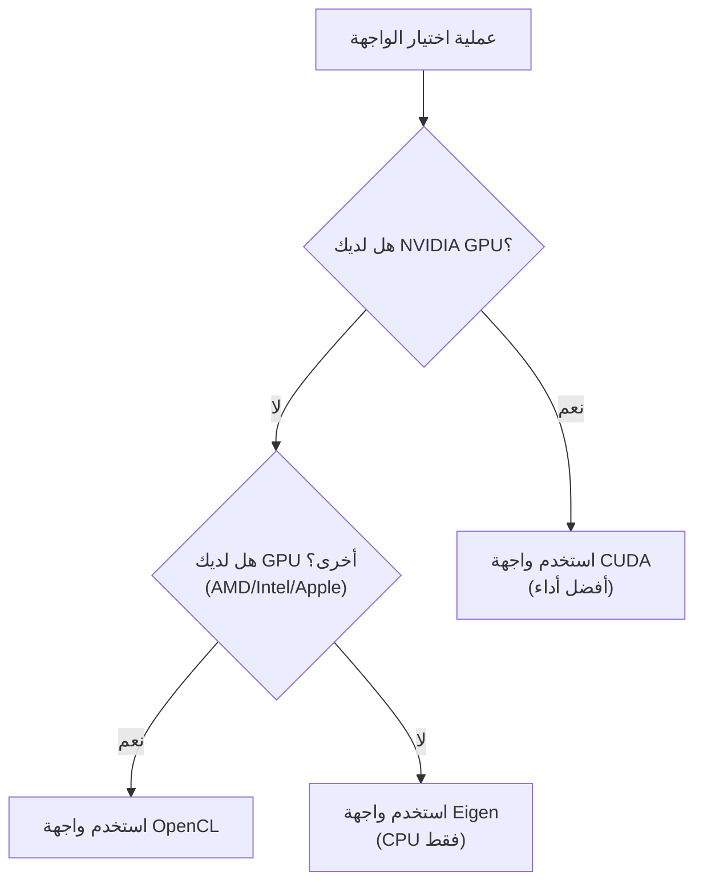

# تثبيت وإعداد KataGo

ستشرح هذه المقالة بالتفصيل كيفية تثبيت KataGo على منصات مختلفة، بما في ذلك متطلبات النظام، وخطوات التثبيت، واختيار النماذج، وشرح ملفات التكوين.

## متطلبات النظام

### متطلبات الأجهزة

#### GPU (موصى بها)

| نوع GPU | حالة الدعم | الواجهة الموصى بها |
|---------|---------|---------|
| NVIDIA (CUDA) | أفضل دعم | CUDA |
| NVIDIA (بدون CUDA) | دعم جيد | OpenCL |
| AMD | دعم جيد | OpenCL |
| Intel المدمجة | دعم أساسي | OpenCL |
| Apple Silicon | دعم جيد | Metal / OpenCL |

#### وضع CPU

إذا لم يكن لديك GPU مناسبة، يمكن استخدام واجهة Eigen للتشغيل بـ CPU فقط:
- أداء أقل (حوالي 10-30 playouts/sec)
- مناسب للتعلم والاختبار والاستخدام الخفيف
- يتطلب دعم مجموعة تعليمات AVX2 (معظم CPU الحديثة تدعمها)

### متطلبات البرمجيات

| نظام التشغيل | متطلبات الإصدار |
|---------|---------|
| **Linux** | Ubuntu 18.04+، CentOS 7+ أو توزيعة حديثة أخرى |
| **macOS** | 10.14+ (Mojave أو أحدث) |
| **Windows** | Windows 10 أو أحدث |

### دليل اختيار الواجهة



## تثبيت macOS

### الطريقة 1: Homebrew (موصى بها)

أبسط طريقة تثبيت، تتعامل تلقائياً مع جميع التبعيات.

```bash
# تثبيت KataGo
brew install katago

# التحقق من نجاح التثبيت
katago version
```

نسخة Homebrew تستخدم واجهة OpenCL افتراضياً، تعمل على Intel Mac وApple Silicon.

### الطريقة 2: البناء من المصدر

مناسبة للمستخدمين الذين يحتاجون خيارات مخصصة أو أحدث الميزات.

#### تثبيت التبعيات

```bash
# تثبيت CMake وأدوات البناء
brew install cmake

# إذا كنت تستخدم OpenCL
# macOS يدعم OpenCL مدمجاً، لا حاجة لتثبيت إضافي
```

#### خطوات البناء

```bash
# استنساخ المصدر
git clone https://github.com/lightvector/KataGo.git
cd KataGo/cpp

# إنشاء دليل البناء
mkdir build && cd build

# إعداد خيارات البناء (واجهة OpenCL)
cmake .. -DUSE_BACKEND=OPENCL

# البناء
make -j$(sysctl -n hw.ncpu)

# بعد اكتمال البناء، الملف التنفيذي في build/katago
./katago version
```

#### ملاحظات خاصة بـ Apple Silicon

على Mac M1/M2/M3، يُنصح باستخدام واجهة OpenCL أو Metal:

```bash
# واجهة OpenCL (موصى بها، توافق أفضل)
cmake .. -DUSE_BACKEND=OPENCL

# واجهة Metal (تجريبية، قد يكون لها أداء أفضل)
cmake .. -DUSE_BACKEND=METAL
```

## تثبيت Linux

### الطريقة 1: النسخة المُجمعة مسبقاً (موصى بها)

تحميل النسخة المُجمعة من GitHub Releases:

```bash
# تحميل نسخة OpenCL (مناسبة لمعظم الحالات)
wget https://github.com/lightvector/KataGo/releases/download/v1.15.3/katago-v1.15.3-opencl-linux-x64.zip

# أو تحميل نسخة CUDA (NVIDIA GPU)
wget https://github.com/lightvector/KataGo/releases/download/v1.15.3/katago-v1.15.3-cuda11.1-linux-x64.zip

# فك الضغط
unzip katago-v1.15.3-*.zip

# منح صلاحية التنفيذ
chmod +x katago

# التحقق من التثبيت
./katago version
```

### الطريقة 2: البناء من المصدر

#### واجهة CUDA (NVIDIA GPU)

```bash
# تثبيت التبعيات
sudo apt update
sudo apt install cmake g++ libzip-dev

# تثبيت CUDA (إذا لم تكن مثبتة)
# راجع دليل NVIDIA الرسمي: https://developer.nvidia.com/cuda-downloads

# الاستنساخ والبناء
git clone https://github.com/lightvector/KataGo.git
cd KataGo/cpp
mkdir build && cd build

# إعداد واجهة CUDA
cmake .. -DUSE_BACKEND=CUDA

# البناء
make -j$(nproc)
```

#### واجهة OpenCL (GPU عامة)

```bash
# تثبيت التبعيات
sudo apt update
sudo apt install cmake g++ libzip-dev ocl-icd-opencl-dev

# تثبيت تعريفات OpenCL
# NVIDIA: مع تثبيت CUDA
# AMD: sudo apt install mesa-opencl-icd
# Intel: sudo apt install intel-opencl-icd

# الاستنساخ والبناء
git clone https://github.com/lightvector/KataGo.git
cd KataGo/cpp
mkdir build && cd build

cmake .. -DUSE_BACKEND=OPENCL
make -j$(nproc)
```

#### واجهة Eigen (CPU فقط)

```bash
# تثبيت التبعيات
sudo apt update
sudo apt install cmake g++ libzip-dev libeigen3-dev

# الاستنساخ والبناء
git clone https://github.com/lightvector/KataGo.git
cd KataGo/cpp
mkdir build && cd build

cmake .. -DUSE_BACKEND=EIGEN
make -j$(nproc)
```

## تثبيت Windows

### الطريقة 1: النسخة المُجمعة مسبقاً (موصى بها)

1. اذهب إلى [KataGo Releases](https://github.com/lightvector/KataGo/releases)
2. حمّل النسخة المناسبة:
   - `katago-v1.15.3-cuda11.1-windows-x64.zip` (NVIDIA GPU + CUDA)
   - `katago-v1.15.3-opencl-windows-x64.zip` (GPU أخرى)
   - `katago-v1.15.3-eigen-windows-x64.zip` (CPU فقط)
3. فك الضغط في المجلد المحدد
4. اختبر في موجه الأوامر:

```cmd
cd C:\path\to\katago
katago.exe version
```

### الطريقة 2: البناء من المصدر

#### تحضير البيئة

1. تثبيت [Visual Studio 2019/2022](https://visualstudio.microsoft.com/) (مع أدوات C++)
2. تثبيت [CMake](https://cmake.org/download/)
3. إذا كنت تستخدم CUDA، تثبيت [CUDA Toolkit](https://developer.nvidia.com/cuda-toolkit)

#### خطوات البناء

```cmd
# نفذ في Developer Command Prompt

git clone https://github.com/lightvector/KataGo.git
cd KataGo\cpp
mkdir build
cd build

# واجهة CUDA
cmake .. -G "Visual Studio 17 2022" -A x64 -DUSE_BACKEND=CUDA

# أو واجهة OpenCL
cmake .. -G "Visual Studio 17 2022" -A x64 -DUSE_BACKEND=OPENCL

# البناء
cmake --build . --config Release
```

## تحميل واختيار النماذج

يحتاج KataGo ملفات نماذج الشبكة العصبية للتشغيل. يوفر المشروع الرسمي نماذج بأحجام مختلفة.

### مكان التحميل

صفحة تحميل النماذج الرسمية: https://katagotraining.org/

أو التحميل مباشرة من خادم التدريب:

```bash
# نموذج أصغر (مناسب للاختبار والأجهزة الضعيفة)
curl -L -o kata-b18c384.bin.gz \
  "https://media.katagotraining.org/uploaded/networks/models/kata1/kata1-b18c384nbt-s9996604416-d4316597426.bin.gz"

# نموذج متوسط (موصى به، توازن الأداء والسرعة)
curl -L -o kata-b40c256.bin.gz \
  "https://media.katagotraining.org/uploaded/networks/models/kata1/kata1-b40c256-s11840935168-d2898845681.bin.gz"

# نموذج كبير (أقوى قوة، يتطلب GPU قوية)
curl -L -o kata-b60c320.bin.gz \
  "https://media.katagotraining.org/uploaded/networks/models/kata1/kata1-b60c320-s11318001920-d2792783831.bin.gz"
```

### مقارنة النماذج

| النموذج | حجم الشبكة | حجم الملف | القوة | سيناريو الاستخدام |
|------|---------|---------|------|---------|
| b10c128 | 10 كتل، 128 قناة | ~20 MB | هاوٍ عالي | CPU، GPU ضعيفة، اختبار سريع |
| b18c384 | 18 كتلة، 384 قناة | ~140 MB | مستوى احترافي | GPU عامة، تحليل يومي |
| b40c256 | 40 كتلة، 256 قناة | ~250 MB | فوق بشري | GPU متوسطة-عالية، تحليل عميق |
| b60c320 | 60 كتلة، 320 قناة | ~500 MB | فوق بشري عليا | GPU عالية، تحليل عالي المستوى |

### اقتراحات الاختيار

```
ما هي GPU لديك؟
├─ RTX 3080/4080/4090 → b60c320 أو b40c256
├─ RTX 3060/3070 → b40c256 أو b18c384
├─ GTX 1660/2060 → b18c384
├─ GPU مبتدئة → b18c384 أو b10c128
└─ CPU فقط → b10c128
```

## شرح ملفات التكوين الأساسية

يستخدم KataGo ملفات تكوين بصيغة `.cfg`. يوفر المشروع الرسمي ملفات تكوين نموذجية في دليل `cpp/configs/`.

### ملفات التكوين المهمة

| الملف | الاستخدام |
|------|------|
| `gtp_example.cfg` | تكوين نموذجي لوضع GTP |
| `analysis_example.cfg` | تكوين نموذجي لـ Analysis Engine |
| `default_gtp.cfg` | التكوين الافتراضي لوضع GTP |

### عناصر التكوين الأساسية

```ini
# =============
# إعدادات الشبكة العصبية
# =============

# مسار ملف نموذج الشبكة العصبية
# يمكن استخدام مسار نسبي أو مطلق
# model = /path/to/model.bin.gz

# =============
# إعدادات البحث
# =============

# الحد الأقصى لزيارات البحث لكل حركة
# زيادة هذه القيمة تزيد القوة لكن تبطئ السرعة
maxVisits = 500

# الحد الأقصى لوقت التفكير لكل حركة (ثانية)
# 0 يعني لا حد (يتحكم به maxVisits)
maxTime = 0

# عدد خيوط التنفيذ لكل حركة
numSearchThreads = 6

# =============
# إعدادات القواعد
# =============

# قواعد Go
# chinese = القواعد الصينية
# japanese = القواعد اليابانية
# korean = القواعد الكورية
# tromp-taylor = قواعد Tromp-Taylor
# aga = قواعد AGA
rules = chinese

# الكومي
komi = 7.5

# =============
# إعدادات GPU
# =============

# رقم GPU المستخدمة (تبدأ من 0)
# لـ GPU متعددة استخدم الفاصلة: 0,1,2
# -1 يعني الاختيار التلقائي
nnDeviceIdxs = 0

# حجم الدفعة لكل خيط GPU
# دفعة أكبر تزيد استغلال GPU
numNNServerThreadsPerModel = 1

# =============
# إعدادات متقدمة
# =============

# ثابت استكشاف MCTS
# قيمة أكبر تزيد الاستكشاف، أصغر تزيد الاستغلال
cpuctExploration = 1.0

# ضوضاء Dirichlet للعقدة الجذر
# تستخدم لزيادة تنوع الاستكشاف
rootNoiseEnabled = true
rootDirichletNoisePruneFactor = 0.25
```

### مثال تكوين وضع GTP

إنشاء `my_gtp_config.cfg`:

```ini
# مسار النموذج
# model عادة يُحدد في سطر الأوامر، يمكن حذفه هنا

# إعدادات البحث
maxVisits = 1000
numSearchThreads = 4

# القواعد
rules = chinese
komi = 7.5

# إعدادات GPU
nnDeviceIdxs = 0

# السجلات
logDir = ./logs
logToStderr = false
```

### مثال تكوين Analysis Engine

إنشاء `my_analysis_config.cfg`:

```ini
# إعدادات البحث
maxVisits = 500
numSearchThreads = 8

# إعدادات التقرير
# الحد الأقصى لعدد التغييرات في كل تقرير تحليل
maxMoves = 10

# القواعد (يمكن تجاوزها في استدعاء API)
rules = chinese
komi = 7.5

# إعدادات GPU
nnDeviceIdxs = 0
numNNServerThreadsPerModel = 2

# ميزات التحليل
reportAnalysisWinratesAs = BLACK

# خريطة الملكية
# عند التفعيل يمكن الحصول على تنبؤ انتماء كل نقطة
analysisOwnership = true
```

## التشغيل الأول

### اختبار وضع GTP

```bash
# تشغيل وضع GTP
katago gtp -model /path/to/model.bin.gz -config /path/to/config.cfg

# إذا لم يكن هناك config، سيستخدم KataGo القيم الافتراضية
katago gtp -model /path/to/model.bin.gz
```

بعد التشغيل بنجاح، أدخل أوامر GTP للاختبار:

```
name
= KataGo

version
= 1.15.3

boardsize 19
=

genmove black
= Q16

quit
=
```

### اختبار Analysis Engine

```bash
# تشغيل Analysis Engine
katago analysis -model /path/to/model.bin.gz -config /path/to/config.cfg
```

أدخل استعلام JSON:

```json
{"id":"test1","initialStones":[],"moves":[],"rules":"chinese","komi":7.5,"boardXSize":19,"boardYSize":19,"analyzeTurns":[0]}
```

### اختبار الأداء

اختبر أداء أجهزتك:

```bash
# تشغيل اختبار الأداء
katago benchmark -model /path/to/model.bin.gz

# تحديد ملف التكوين
katago benchmark -model /path/to/model.bin.gz -config /path/to/config.cfg
```

اختبار الأداء يخرج:
- عدد زيارات البحث في الثانية (visits/sec)
- سرعة استدلال الشبكة العصبية
- إعدادات الخيوط الموصى بها

## حل المشاكل الشائعة

### متعلقة بـ GPU

**مشكلة: لا يجد GPU**

```bash
# فحص أجهزة OpenCL
clinfo

# أو قائمة الأجهزة التي يراها KataGo
katago gpuinfo
```

**مشكلة: فشل تهيئة CUDA**

- تأكد من تطابق إصدار CUDA مع إصدار KataGo المُجمع
- حدّث تعريفات GPU
- تحقق من متغير البيئة CUDA_PATH

### متعلقة بالذاكرة

**مشكلة: نفاد الذاكرة**

```ini
# تقليل استخدام ذاكرة GPU
nnMaxBatchSize = 8  # الافتراضي قد يكون 16 أو أعلى
nnCacheSizePowerOfTwo = 20  # تقليل حجم الكاش
```

### متعلقة بالأداء

**مشكلة: بطء شديد**

1. تأكد من استخدام GPU وليس CPU
2. قلل `numSearchThreads`
3. استخدم نموذجاً أصغر
4. تحقق من عدم وجود برامج أخرى تستخدم GPU

## الخطوة التالية

بعد اكتمال الإعداد، تابع القراءة:
- [الأوامر الشائعة](./commands.md) - تعلم كيفية استخدام KataGo
- [هندسة الكود المصدري](./architecture.md) - فهم التنفيذ الداخلي
