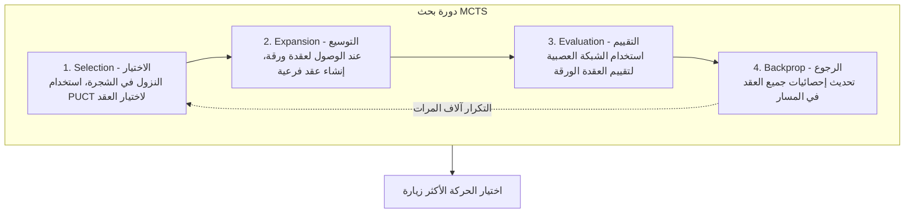

# تفاصيل تنفيذ MCTS

يقدم هذا المقال تحليلاً معمقاً لتفاصيل تنفيذ بحث شجرة مونت كارلو (MCTS) في KataGo، بما في ذلك هياكل البيانات واستراتيجيات الاختيار وتقنيات التوازي.

---

## مراجعة الخطوات الأربع لـ MCTS



---

## هيكل بيانات العقدة

### البيانات الأساسية

كل عقدة MCTS تحتاج لتخزين:

```python
class MCTSNode:
    def __init__(self, state, parent=None, prior=0.0):
        # المعلومات الأساسية
        self.state = state              # حالة اللوحة
        self.parent = parent            # العقدة الأم
        self.children = {}              # قاموس العقد الفرعية {action: node}
        self.action = None              # الحركة للوصول لهذه العقدة

        # المعلومات الإحصائية
        self.visit_count = 0            # N(s): عدد الزيارات
        self.value_sum = 0.0            # W(s): مجموع القيم
        self.prior = prior              # P(s,a): الاحتمال المسبق

        # للبحث المتوازي
        self.virtual_loss = 0           # الخسارة الافتراضية
        self.is_expanded = False        # هل تم التوسيع

    @property
    def value(self):
        """Q(s) = W(s) / N(s)"""
        if self.visit_count == 0:
            return 0.0
        return self.value_sum / self.visit_count
```

### تحسين الذاكرة

يستخدم KataGo تقنيات متعددة لتقليل استخدام الذاكرة:

```python
# استخدام مصفوفات numpy بدلاً من قاموس Python
class OptimizedNode:
    __slots__ = ['visit_count', 'value_sum', 'prior', 'children_indices']

    def __init__(self):
        self.visit_count = np.int32(0)
        self.value_sum = np.float32(0.0)
        self.prior = np.float32(0.0)
        self.children_indices = None  # تخصيص متأخر
```

---

## Selection: اختيار PUCT

### صيغة PUCT

```
درجة الاختيار = Q(s,a) + U(s,a)

حيث:
Q(s,a) = W(s,a) / N(s,a)              # متوسط القيمة
U(s,a) = c_puct × P(s,a) × √(N(s)) / (1 + N(s,a))  # عنصر الاستكشاف
```

### شرح المعلمات

| الرمز | المعنى | القيمة النموذجية |
|-------|--------|-----------------|
| Q(s,a) | متوسط قيمة الحركة a | [-1, +1] |
| P(s,a) | الاحتمال المسبق من الشبكة العصبية | [0, 1] |
| N(s) | عدد زيارات العقدة الأم | عدد صحيح |
| N(s,a) | عدد زيارات الحركة a | عدد صحيح |
| c_puct | ثابت الاستكشاف | 1.0 ~ 2.5 |

### التنفيذ

```python
def select_child(self, c_puct=1.5):
    """اختيار العقدة الفرعية ذات أعلى درجة PUCT"""
    best_score = -float('inf')
    best_action = None
    best_child = None

    # الجذر التربيعي لعدد زيارات العقدة الأم
    sqrt_parent_visits = math.sqrt(self.visit_count)

    for action, child in self.children.items():
        # قيمة Q (متوسط القيمة)
        if child.visit_count > 0:
            q_value = child.value_sum / child.visit_count
        else:
            q_value = 0.0

        # قيمة U (عنصر الاستكشاف)
        u_value = c_puct * child.prior * sqrt_parent_visits / (1 + child.visit_count)

        # الدرجة الإجمالية
        score = q_value + u_value

        if score > best_score:
            best_score = score
            best_action = action
            best_child = child

    return best_action, best_child
```

### التوازن بين الاستكشاف والاستغلال

```
البداية: N(s,a) صغير
├── U(s,a) كبير → الاستكشاف هو الأساس
└── الحركات ذات الاحتمال المسبق العالي تُستكشف أولاً

لاحقاً: N(s,a) كبير
├── U(s,a) صغير → الاستغلال هو الأساس
└── Q(s,a) يهيمن، اختيار الحركات المعروفة بأنها جيدة
```

---

## Expansion: توسيع العقد

### شروط التوسيع

عند الوصول لعقدة ورقة، استخدم الشبكة العصبية للتوسيع:

```python
def expand(self, policy_probs, legal_moves):
    """توسيع العقدة، إنشاء عقد فرعية لجميع الحركات القانونية"""
    for action in legal_moves:
        if action not in self.children:
            prior = policy_probs[action]  # الاحتمال المتوقع من الشبكة العصبية
            child_state = self.state.play(action)
            self.children[action] = MCTSNode(
                state=child_state,
                parent=self,
                prior=prior
            )

    self.is_expanded = True
```

### تصفية الحركات القانونية

```python
def get_legal_moves(state):
    """الحصول على جميع الحركات القانونية"""
    legal = []
    for i in range(361):
        x, y = i // 19, i % 19
        if state.is_legal(x, y):
            legal.append(i)

    # إضافة pass
    legal.append(361)

    return legal
```

---

## Evaluation: تقييم الشبكة العصبية

### تقييم فردي

```python
def evaluate(self, state):
    """استخدام الشبكة العصبية لتقييم الوضع"""
    # ترميز ميزات الإدخال
    features = encode_state(state)  # (22, 19, 19)
    features = torch.tensor(features).unsqueeze(0)  # (1, 22, 19, 19)

    # استدلال الشبكة العصبية
    with torch.no_grad():
        output = self.network(features)

    policy = output['policy'][0].numpy()  # (362,)
    value = output['value'][0].item()     # scalar

    return policy, value
```

### التقييم الدفعي (تحسين رئيسي)

GPU يكون أكثر كفاءة مع الاستدلال الدفعي:

```python
class BatchedEvaluator:
    def __init__(self, network, batch_size=8):
        self.network = network
        self.batch_size = batch_size
        self.pending = []  # قائمة (state, callback) في الانتظار

    def request_evaluation(self, state, callback):
        """طلب تقييم، ينفذ تلقائياً عند امتلاء الدفعة"""
        self.pending.append((state, callback))

        if len(self.pending) >= self.batch_size:
            self.flush()

    def flush(self):
        """تنفيذ التقييم الدفعي"""
        if not self.pending:
            return

        # إعداد الإدخال الدفعي
        states = [s for s, _ in self.pending]
        features = torch.stack([encode_state(s) for s in states])

        # الاستدلال الدفعي
        with torch.no_grad():
            outputs = self.network(features)

        # استدعاء النتائج
        for i, (_, callback) in enumerate(self.pending):
            policy = outputs['policy'][i].numpy()
            value = outputs['value'][i].item()
            callback(policy, value)

        self.pending.clear()
```

---

## Backpropagation: تحديث الرجوع

### الرجوع الأساسي

```python
def backpropagate(self, value):
    """الرجوع من العقدة الورقة إلى الجذر، تحديث المعلومات الإحصائية"""
    node = self

    while node is not None:
        node.visit_count += 1
        node.value_sum += value

        # تبديل المنظور: قيمة الخصم معكوسة
        value = -value

        node = node.parent
```

### أهمية تبديل المنظور

```
منظور الأسود: value = +0.6 (الأسود في صالحه)

مسار الرجوع:
العقدة الورقة (الأسود يلعب): value_sum += +0.6
    ↑
العقدة الأم (الأبيض يلعب): value_sum += -0.6  ← غير مفيد للأبيض
    ↑
العقدة الجد (الأسود يلعب): value_sum += +0.6
    ↑
...
```

---

## التوازي: الخسارة الافتراضية

### المشكلة

عند البحث المتوازي متعدد الخيوط، قد تختار جميعها نفس العقدة:

```
Thread 1: اختيار العقدة A (Q=0.6, N=100)
Thread 2: اختيار العقدة A (Q=0.6, N=100) ← تكرار!
Thread 3: اختيار العقدة A (Q=0.6, N=100) ← تكرار!
```

### الحل: الخسارة الافتراضية

عند اختيار عقدة، أضف "خسارة افتراضية" أولاً لجعل الخيوط الأخرى لا ترغب في اختيارها:

```python
VIRTUAL_LOSS = 3  # قيمة الخسارة الافتراضية

def select_with_virtual_loss(self):
    """الاختيار مع الخسارة الافتراضية"""
    action, child = self.select_child()

    # إضافة الخسارة الافتراضية
    child.visit_count += VIRTUAL_LOSS
    child.value_sum -= VIRTUAL_LOSS  # افتراض الخسارة

    return action, child

def backpropagate_with_virtual_loss(self, value):
    """إزالة الخسارة الافتراضية عند الرجوع"""
    node = self

    while node is not None:
        # إزالة الخسارة الافتراضية
        node.visit_count -= VIRTUAL_LOSS
        node.value_sum += VIRTUAL_LOSS

        # التحديث الطبيعي
        node.visit_count += 1
        node.value_sum += value

        value = -value
        node = node.parent
```

### التأثير

```
Thread 1: اختيار العقدة A، إضافة خسارة افتراضية
         قيمة Q للعقدة A تنخفض مؤقتاً

Thread 2: اختيار العقدة B (لأن A تبدو أسوأ الآن)

Thread 3: اختيار العقدة C

→ الخيوط المختلفة تستكشف فروعاً مختلفة، زيادة الكفاءة
```

---

## تنفيذ البحث الكامل

```python
class MCTS:
    def __init__(self, network, c_puct=1.5, num_simulations=800):
        self.network = network
        self.c_puct = c_puct
        self.num_simulations = num_simulations
        self.evaluator = BatchedEvaluator(network)

    def search(self, root_state):
        """تنفيذ بحث MCTS"""
        root = MCTSNode(root_state)

        # توسيع عقدة الجذر
        policy, value = self.evaluate(root_state)
        legal_moves = get_legal_moves(root_state)
        root.expand(policy, legal_moves)

        # تنفيذ المحاكاة
        for _ in range(self.num_simulations):
            node = root
            path = [node]

            # Selection: النزول في الشجرة
            while node.is_expanded and node.children:
                action, node = node.select_child(self.c_puct)
                path.append(node)

            # Expansion + Evaluation
            if not node.is_expanded:
                policy, value = self.evaluate(node.state)
                legal_moves = get_legal_moves(node.state)

                if legal_moves:
                    node.expand(policy, legal_moves)

            # Backpropagation
            for n in reversed(path):
                n.visit_count += 1
                n.value_sum += value
                value = -value

        # اختيار الحركة الأكثر زيارة
        best_action = max(root.children.items(),
                         key=lambda x: x[1].visit_count)[0]

        return best_action

    def evaluate(self, state):
        features = encode_state(state)
        features = torch.tensor(features).unsqueeze(0)

        with torch.no_grad():
            output = self.network(features)

        return output['policy'][0].numpy(), output['value'][0].item()
```

---

## التقنيات المتقدمة

### ضوضاء Dirichlet

إضافة ضوضاء في عقدة الجذر أثناء التدريب لزيادة الاستكشاف:

```python
def add_dirichlet_noise(root, alpha=0.03, epsilon=0.25):
    """إضافة ضوضاء Dirichlet في عقدة الجذر"""
    noise = np.random.dirichlet([alpha] * len(root.children))

    for i, child in enumerate(root.children.values()):
        child.prior = (1 - epsilon) * child.prior + epsilon * noise[i]
```

### معلمة الحرارة

التحكم في عشوائية اختيار الحركة:

```python
def select_action_with_temperature(root, temperature=1.0):
    """اختيار الحركة بناءً على عدد الزيارات والحرارة"""
    visits = np.array([c.visit_count for c in root.children.values()])
    actions = list(root.children.keys())

    if temperature == 0:
        # اختيار جشع
        return actions[np.argmax(visits)]
    else:
        # الاختيار بناءً على توزيع احتمالي من عدد الزيارات
        probs = visits ** (1 / temperature)
        probs = probs / probs.sum()
        return np.random.choice(actions, p=probs)
```

### إعادة استخدام الشجرة

الخطوة الجديدة يمكنها إعادة استخدام شجرة البحث السابقة:

```python
def reuse_tree(root, action):
    """إعادة استخدام الشجرة الفرعية"""
    if action in root.children:
        new_root = root.children[action]
        new_root.parent = None
        return new_root
    else:
        return None  # يتطلب إنشاء شجرة جديدة
```

---

## ملخص تحسين الأداء

| التقنية | التأثير |
|---------|---------|
| **التقييم الدفعي** | استخدام GPU من 10% → 80%+ |
| **الخسارة الافتراضية** | زيادة كفاءة الخيوط المتعددة 3-5x |
| **إعادة استخدام الشجرة** | تقليل البداية الباردة، توفير 30%+ من الحساب |
| **تجمع الذاكرة** | تقليل تكلفة تخصيص الذاكرة |

---

## قراءات إضافية

- [شرح بنية الشبكة العصبية](../neural-network) — مصدر دالة التقييم
- [واجهات GPU والتحسين](../gpu-optimization) — تحسين الأجهزة للاستدلال الدفعي
- [دليل قراءة الأوراق الرئيسية](../papers) — الأساس النظري لصيغة PUCT
