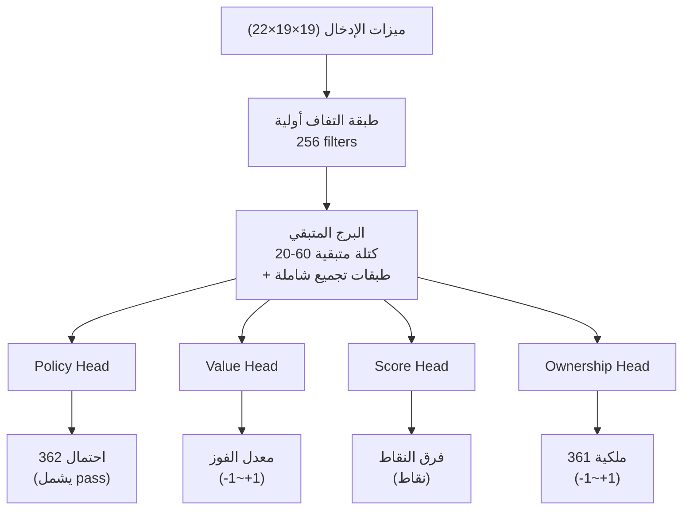
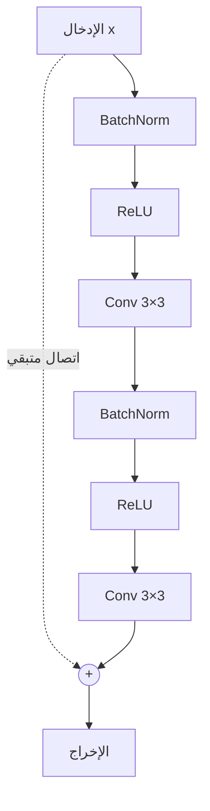

# شرح تفصيلي لبنية الشبكة العصبية

يقدم هذا المقال تحليلاً معمقاً للبنية الكاملة للشبكة العصبية في KataGo، من ترميز ميزات الإدخال إلى تصميم الإخراج متعدد الرؤوس.

---

## نظرة عامة على البنية

يستخدم KataGo تصميم **شبكة عصبية واحدة بإخراج متعدد الرؤوس**:



---

## ترميز ميزات الإدخال

### نظرة عامة على مستويات الميزات

يستخدم KataGo **22 مستوى ميزات** (19×19×22)، كل مستوى هو مصفوفة 19×19:

| المستوى | المحتوى | الوصف |
|---------|---------|-------|
| 0 | أحجارنا | 1 = يوجد حجر لنا، 0 = لا يوجد |
| 1 | أحجار الخصم | 1 = يوجد حجر للخصم، 0 = لا يوجد |
| 2 | النقاط الفارغة | 1 = نقطة فارغة، 0 = يوجد حجر |
| 3-10 | حالة التاريخ | تغييرات اللوحة لآخر 8 حركات |
| 11 | نقطة الكو المحظورة | 1 = هنا كو محظور، 0 = يمكن اللعب |
| 12-17 | ترميز الحريات | سلاسل بـ 1 حرية، 2 حريات، 3 حريات... |
| 18-21 | ترميز القواعد | قواعد صينية/يابانية، komi، إلخ |

### تكديس حالة التاريخ

لتمكين الشبكة العصبية من فهم **التغييرات الديناميكية** للوضع، يقوم KataGo بتكديس حالات اللوحة لآخر 8 حركات:

```python
# ترميز حالة التاريخ (مفهومي)
def encode_history(game_history, current_player):
    features = []

    for t in range(8):  # آخر 8 حركات
        if t < len(game_history):
            board = game_history[-(t+1)]
            # ترميز أحجارنا/أحجار الخصم في تلك اللحظة
            features.append(encode_board(board, current_player))
        else:
            # التاريخ غير كافٍ، املأ بأصفار
            features.append(np.zeros((19, 19)))

    return np.stack(features, axis=0)
```

### ترميز القواعد

يدعم KataGo قواعد متعددة، ويُعلم الشبكة العصبية عبر مستويات الميزات:

```python
# ترميز القواعد (مفهومي)
def encode_rules(rules, komi):
    rule_features = np.zeros((4, 19, 19))

    # نوع القواعد (one-hot)
    if rules == "chinese":
        rule_features[0] = 1.0
    elif rules == "japanese":
        rule_features[1] = 1.0

    # تطبيع Komi
    normalized_komi = komi / 15.0  # تطبيع إلى [-1, 1]
    rule_features[2] = normalized_komi

    # اللاعب الحالي
    rule_features[3] = 1.0 if current_player == BLACK else 0.0

    return rule_features
```

---

## الشبكة الرئيسية: البرج المتبقي

### هيكل الكتلة المتبقية

يستخدم KataGo هيكل **Pre-activation ResNet**:



### مثال الكود

```python
class ResidualBlock(nn.Module):
    def __init__(self, channels):
        super().__init__()
        self.bn1 = nn.BatchNorm2d(channels)
        self.conv1 = nn.Conv2d(channels, channels, 3, padding=1)
        self.bn2 = nn.BatchNorm2d(channels)
        self.conv2 = nn.Conv2d(channels, channels, 3, padding=1)

    def forward(self, x):
        residual = x

        out = self.bn1(x)
        out = F.relu(out)
        out = self.conv1(out)

        out = self.bn2(out)
        out = F.relu(out)
        out = self.conv2(out)

        return out + residual  # اتصال متبقي
```

### طبقة التجميع الشامل

أحد الابتكارات الرئيسية في KataGo: إضافة **تجميع شامل** في الكتل المتبقية، مما يتيح للشبكة رؤية المعلومات الشاملة:

```python
class GlobalPoolingBlock(nn.Module):
    def __init__(self, channels):
        super().__init__()
        self.conv = nn.Conv2d(channels, channels, 3, padding=1)
        self.fc = nn.Linear(channels, channels)

    def forward(self, x):
        # المسار المحلي
        local = self.conv(x)

        # المسار الشامل
        global_pool = x.mean(dim=[2, 3])  # تجميع متوسط شامل
        global_fc = self.fc(global_pool)
        global_broadcast = global_fc.unsqueeze(2).unsqueeze(3)
        global_broadcast = global_broadcast.expand(-1, -1, 19, 19)

        # الدمج
        return local + global_broadcast
```

**لماذا نحتاج التجميع الشامل؟**

الالتفاف التقليدي يرى فقط محلياً (مجال استقبال 3×3)، وحتى مع تكديس طبقات كثيرة، يظل إدراك المعلومات الشاملة محدوداً. يتيح التجميع الشامل للشبكة "رؤية" مباشرة:
- فرق عدد الأحجار في اللوحة كاملة
- توزيع النفوذ الشامل
- الحكم على الوضع العام

---

## تصميم رؤوس الإخراج

### رأس السياسة (Policy Head)

يُخرج احتمال اللعب في كل موقع:

```python
class PolicyHead(nn.Module):
    def __init__(self, in_channels):
        super().__init__()
        self.conv = nn.Conv2d(in_channels, 2, 1)  # التفاف 1×1
        self.bn = nn.BatchNorm2d(2)
        self.fc = nn.Linear(2 * 19 * 19, 362)  # 361 + pass

    def forward(self, x):
        out = F.relu(self.bn(self.conv(x)))
        out = out.view(out.size(0), -1)
        out = self.fc(out)
        return F.softmax(out, dim=1)  # توزيع احتمالي
```

**صيغة الإخراج**: متجه 362 بُعد
- الفهارس 0-360: احتمال اللعب في 361 موقعاً على اللوحة
- الفهرس 361: احتمال التمرير (pass)

### رأس القيمة (Value Head)

يُخرج معدل الفوز للوضع الحالي:

```python
class ValueHead(nn.Module):
    def __init__(self, in_channels):
        super().__init__()
        self.conv = nn.Conv2d(in_channels, 1, 1)
        self.bn = nn.BatchNorm2d(1)
        self.fc1 = nn.Linear(19 * 19, 256)
        self.fc2 = nn.Linear(256, 1)

    def forward(self, x):
        out = F.relu(self.bn(self.conv(x)))
        out = out.view(out.size(0), -1)
        out = F.relu(self.fc1(out))
        out = torch.tanh(self.fc2(out))  # إخراج من -1 إلى +1
        return out
```

**صيغة الإخراج**: قيمة واحدة [-1, +1]
- +1: فوز مؤكد لنا
- -1: فوز مؤكد للخصم
- 0: توازن

### رأس النقاط (Score Head)

حصري لـ KataGo، يتنبأ بفرق النقاط النهائي:

```python
class ScoreHead(nn.Module):
    def __init__(self, in_channels):
        super().__init__()
        self.conv = nn.Conv2d(in_channels, 1, 1)
        self.bn = nn.BatchNorm2d(1)
        self.fc1 = nn.Linear(19 * 19, 256)
        self.fc2 = nn.Linear(256, 1)

    def forward(self, x):
        out = F.relu(self.bn(self.conv(x)))
        out = out.view(out.size(0), -1)
        out = F.relu(self.fc1(out))
        out = self.fc2(out)  # إخراج غير محدود
        return out
```

**صيغة الإخراج**: قيمة واحدة (نقاط)
- موجب: نحن متقدمون
- سالب: الخصم متقدم

### رأس الملكية (Ownership Head)

يتنبأ بملكية كل نقطة النهائية:

```python
class OwnershipHead(nn.Module):
    def __init__(self, in_channels):
        super().__init__()
        self.conv1 = nn.Conv2d(in_channels, 32, 1)
        self.bn = nn.BatchNorm2d(32)
        self.conv2 = nn.Conv2d(32, 1, 1)

    def forward(self, x):
        out = F.relu(self.bn(self.conv1(x)))
        out = torch.tanh(self.conv2(out))  # كل نقطة -1 إلى +1
        return out.view(out.size(0), -1)  # تسطيح إلى 361
```

**صيغة الإخراج**: متجه 361 بُعد، كل قيمة في [-1, +1]
- +1: هذه النقطة ملك أراضينا
- -1: هذه النقطة ملك أراضي الخصم
- 0: منطقة محايدة أو متنازع عليها

---

## الاختلافات مع AlphaZero

| الجانب | AlphaZero | KataGo |
|--------|-----------|--------|
| **رؤوس الإخراج** | 2 (Policy + Value) | **4** (+ Score + Ownership) |
| **التجميع الشامل** | لا يوجد | **يوجد** |
| **ميزات الإدخال** | 17 مستوى | **22 مستوى** (تشمل ترميز القواعد) |
| **الكتل المتبقية** | ResNet قياسي | **Pre-activation + تجميع شامل** |
| **دعم قواعد متعددة** | لا يوجد | **يوجد** (عبر ترميز الميزات) |

---

## أحجام النماذج

يوفر KataGo نماذج بأحجام مختلفة:

| النموذج | عدد الكتل المتبقية | عدد القنوات | عدد المعلمات | حالة الاستخدام |
|---------|-------------------|-------------|--------------|---------------|
| b10c128 | 10 | 128 | ~5M | CPU، اختبار سريع |
| b18c384 | 18 | 384 | ~75M | GPU عادي |
| b40c256 | 40 | 256 | ~95M | GPU متقدم |
| b60c320 | 60 | 320 | ~200M | GPU فائق |

**قاعدة التسمية**: `b{عدد الكتل المتبقية}c{عدد القنوات}`

---

## تنفيذ الشبكة الكاملة

```python
class KataGoNetwork(nn.Module):
    def __init__(self, num_blocks=18, channels=384):
        super().__init__()

        # الالتفاف الأولي
        self.initial_conv = nn.Conv2d(22, channels, 3, padding=1)
        self.initial_bn = nn.BatchNorm2d(channels)

        # البرج المتبقي
        self.residual_blocks = nn.ModuleList([
            ResidualBlock(channels) for _ in range(num_blocks)
        ])

        # كتل التجميع الشامل (يُدخل واحدة كل عدة كتل متبقية)
        self.global_pooling_blocks = nn.ModuleList([
            GlobalPoolingBlock(channels) for _ in range(num_blocks // 6)
        ])

        # رؤوس الإخراج
        self.policy_head = PolicyHead(channels)
        self.value_head = ValueHead(channels)
        self.score_head = ScoreHead(channels)
        self.ownership_head = OwnershipHead(channels)

    def forward(self, x):
        # الالتفاف الأولي
        out = F.relu(self.initial_bn(self.initial_conv(x)))

        # البرج المتبقي
        gp_idx = 0
        for i, block in enumerate(self.residual_blocks):
            out = block(out)

            # إدخال تجميع شامل بعد كل 6 كتل متبقية
            if (i + 1) % 6 == 0 and gp_idx < len(self.global_pooling_blocks):
                out = self.global_pooling_blocks[gp_idx](out)
                gp_idx += 1

        # رؤوس الإخراج
        policy = self.policy_head(out)
        value = self.value_head(out)
        score = self.score_head(out)
        ownership = self.ownership_head(out)

        return {
            'policy': policy,
            'value': value,
            'score': score,
            'ownership': ownership
        }
```

---

## قراءات إضافية

- [تفاصيل تنفيذ MCTS](../mcts-implementation) — الجمع بين البحث والشبكة العصبية
- [تحليل آلية تدريب KataGo](../training) — كيف يتم تدريب الشبكة
- [دليل قراءة الأوراق الرئيسية](../papers) — الاشتقاق الرياضي من الأوراق الأصلية
