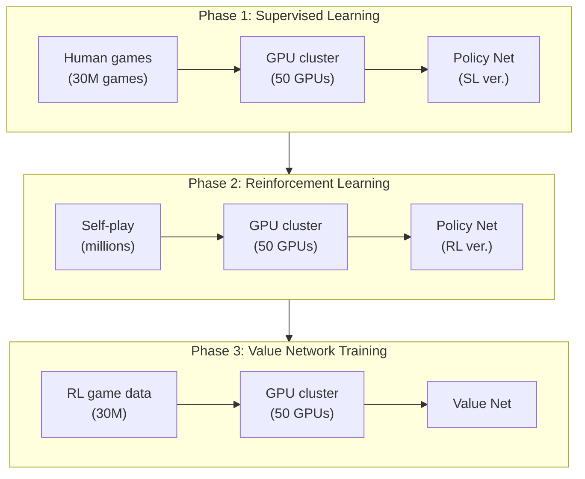
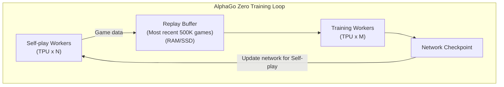
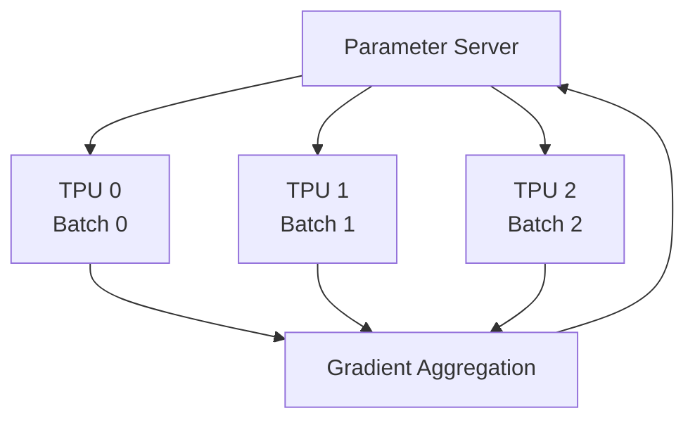
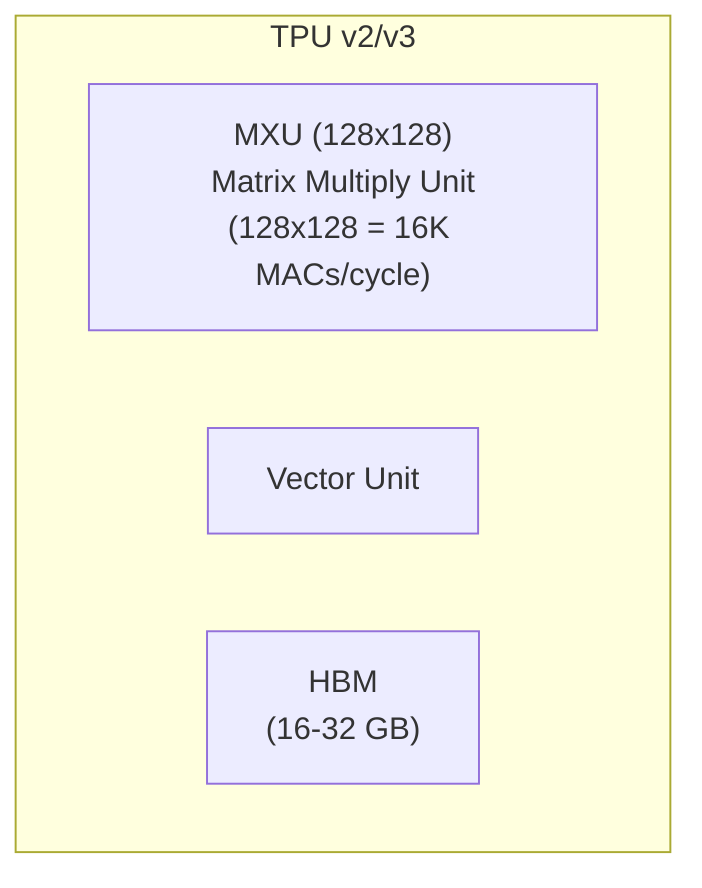
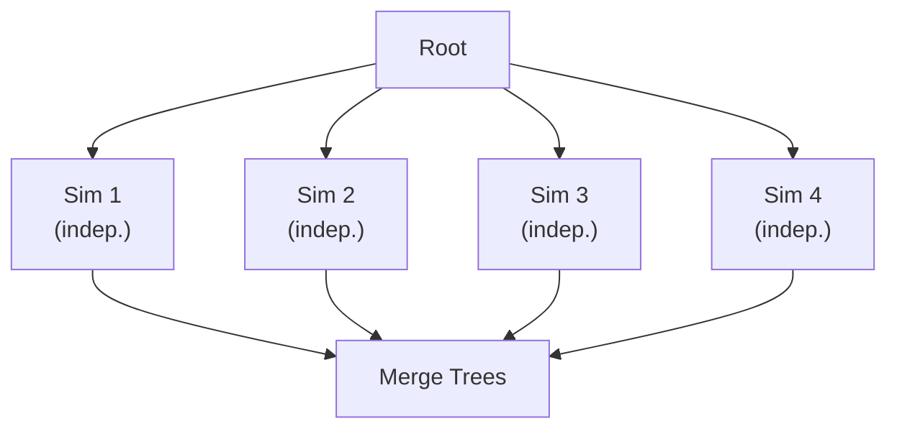
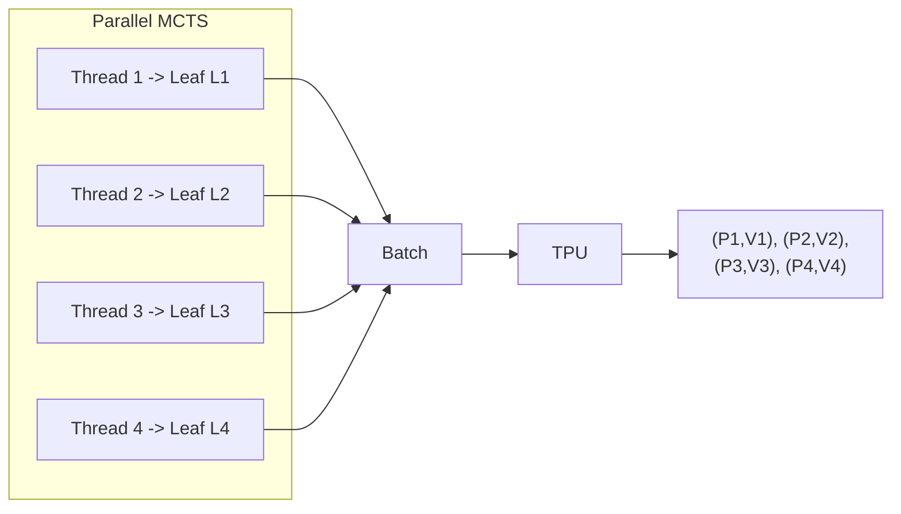
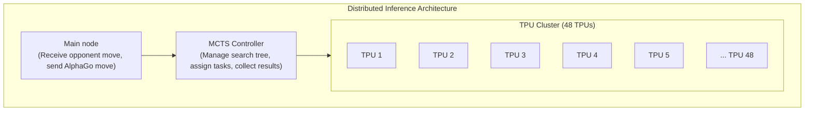

# Distributed Systems and TPU

AlphaGo's success was not just an algorithmic victory but also an engineering triumph. Training a Go AI that surpasses humans in reasonable time required carefully designed distributed systems and specialized hardware support.

This article will deeply analyze the system architecture behind AlphaGo, including the training process, inference architecture, parallel MCTS, and the crucial role of TPUs.

---

## Training Architecture Overview

### Original AlphaGo Training Architecture

The original AlphaGo (the version that defeated Lee Sedol) had training divided into multiple stages, each using different resource configurations:



### AlphaGo Zero Training Architecture

AlphaGo Zero greatly simplified the training process, using a single end-to-end training loop:



Advantages of this architecture:

1. **Continuous learning**: Self-play and Training run simultaneously, no waiting needed
2. **Resource efficiency**: All resources are doing useful work
3. **Fast iteration**: Network updates are immediately used to generate new data

---

## Self-play Workers

### Task Assignment

Self-play Workers are responsible for playing self-play games using the current strongest network, generating training data.

| Configuration | AlphaGo Zero |
|---------------|--------------|
| Number of Workers | Dozens |
| Per Worker | 1-4 TPU |
| MCTS per game | 1600 simulations |
| Daily production | ~100,000 games |

### Workflow

Each Self-play Worker's workflow:

```python
while True:
    # 1. Download latest network weights
    network = download_latest_checkpoint()

    # 2. Play multiple self-play games
    for game in range(batch_size):
        positions = []
        board = EmptyBoard()

        while not board.is_terminal():
            # Execute MCTS
            mcts = MCTS(network, board)
            policy = mcts.search(num_simulations=1600)

            # Select move
            action = sample(policy)

            # Record
            positions.append((board.state, policy))

            # Play move
            board = board.play(action)

        # 3. Get game result
        result = board.get_result()

        # 4. Upload data
        upload_to_replay_buffer(positions, result)
```

### Load Balancing

Multiple Workers need load balancing:

- **Network synchronization**: All Workers use the same network version
- **Data balancing**: Ensure data from different Workers is all used
- **Fault tolerance**: Single Worker failure doesn't affect overall training

---

## Training Workers

### Task Assignment

Training Workers are responsible for sampling data from the Replay Buffer and training the neural network.

| Configuration | AlphaGo Zero |
|---------------|--------------|
| Number of Workers | 1-4 |
| Per Worker | 4 TPU |
| Batch Size | 2048 (512 per TPU) |
| Training steps | Tens of thousands per day |

### Distributed Training

Large-scale training uses **Data Parallelism**:



Each TPU processes a different mini-batch, computes local gradients, then aggregates to update global parameters.

### Synchronous vs. Asynchronous Updates

| Update Method | Pros | Cons |
|---------------|------|------|
| Synchronous | Stable, reproducible | Workers wait for slowest one |
| Asynchronous | High throughput | Gradients may be stale |

AlphaGo Zero uses **synchronous updates** to ensure training stability.

---

## The Role of TPU

### What is TPU?

**TPU (Tensor Processing Unit)** is an accelerator Google designed specifically for deep learning:

| Feature | TPU | GPU | CPU |
|---------|-----|-----|-----|
| Design goal | Matrix operations | General parallel | General computing |
| Precision | FP16/BF16 optimized | FP32/FP16 | FP64/FP32 |
| Power consumption | Relatively low | Higher | Highest |
| Latency | Low | Medium | High |

### TPU Architecture

TPU's core is the **MXU (Matrix Multiply Unit)**:



MXU can execute 16K multiply-accumulate operations per cycle, which is crucial for neural network matrix multiplication.

### Why Does AlphaGo Need TPU?

Go AI's computational bottleneck is **neural network inference**:

| Operation | Proportion |
|-----------|------------|
| Neural network forward pass | ~95% |
| MCTS tree operations | ~4% |
| Other | ~1% |

Each MCTS step requires 1600 neural network inferences. TPU's high throughput makes this possible.

### Evolution of TPU Usage

| Version | Training TPU | Inference TPU |
|---------|--------------|---------------|
| AlphaGo Lee | 50 GPU | 48 TPU (v1) |
| AlphaGo Master | 4 TPU (v2) | 4 TPU (v2) |
| AlphaGo Zero | 4 TPU (v2) | 4 TPU (v2) (scalable) |

AlphaGo Zero uses significantly fewer TPUs, thanks to more efficient architecture and newer TPU versions.

---

## Parallel MCTS and Virtual Loss

### Parallelization Challenge

Standard MCTS implementation is **serial**:

```
for i in range(num_simulations):
    1. Selection: Select downward from root
    2. Expansion: Expand leaf node
    3. Evaluation: Neural network evaluation
    4. Backup: Propagate back updates
```

But neural network evaluation is GPU/TPU-friendly **batch operation**. How to run multiple simulations simultaneously?

### Leaf Parallelization

The simplest parallel approach: run multiple complete simulations simultaneously, merge results at the end.



Problem: Each simulation starts from root, exploring the same paths repeatedly.

### Virtual Loss

DeepMind adopted **Virtual Loss** technique to implement Tree Parallelization.

#### Basic Concept

When one thread is exploring a node, temporarily reduce that node's value so other threads choose other paths.

```
Normal UCB: Q(s,a) + c * P(s,a) * sqrt(N(s)) / (1 + N(s,a))

With virtual loss:
(Q(s,a) * N(s,a) - v * n_virtual) / (N(s,a) + n_virtual) + c * P(s,a) * sqrt(N(s)) / (1 + N(s,a) + n_virtual)
```

where:
- `n_virtual` is the number of threads currently exploring that node
- `v` is the virtual loss value (usually 1 or corresponding to win rate)

#### Operation Flow

```
Time T1:
  Thread 1 selects path A → B → C
  Node C gets virtual loss -1

Time T2:
  Thread 2 selects path A → B → D (because C is "penalized")
  Node D gets virtual loss -1

Time T3:
  Thread 1 completes evaluation, updates C's actual value, removes virtual loss
  Thread 3 might now select C (if actual value is good enough)
```

#### Effects of Virtual Loss

| Aspect | Effect |
|--------|--------|
| Exploration diversity | Forces exploration of different paths |
| Batch efficiency | Can evaluate multiple leaf nodes simultaneously |
| Convergence | Virtual loss eventually overwritten by real values, doesn't affect convergence |

### Batch Neural Network Evaluation

Through virtual loss, multiple leaf nodes awaiting evaluation can be collected for **batch inference**:



TPU batch inference efficiency is much higher than individual inference, making parallel MCTS possible.

---

## Inference Architecture

### Competition Configuration

AlphaGo's inference architecture during official matches:

| Version | Hardware Configuration |
|---------|------------------------|
| AlphaGo Fan | 176 GPU |
| AlphaGo Lee | 48 TPU + multiple servers |
| AlphaGo Master | 4 TPU |
| AlphaGo Zero | 4 TPU (scalable) |

### Distributed Inference Flow

Match inference flow (using AlphaGo Lee as example):



### Time Management

AlphaGo's time management strategy:

| Position | Think Time | MCTS Count |
|----------|------------|------------|
| Opening (has joseki) | Shorter | ~10,000 |
| Middle game (complex) | Longer | ~100,000 |
| Clear position | Shorter | ~5,000 |
| Byo-yomi | Fixed | ~1,600 |

More MCTS simulations generally mean better move quality.

---

## Communication and Synchronization

### Data Format

Training data transmission format:

```protobuf
message TrainingExample {
    // Board state (17 × 19 × 19)
    repeated float board_planes = 1;

    // MCTS search result (362)
    repeated float mcts_policy = 2;

    // Game result (1 = current side wins, -1 = current side loses)
    float game_result = 3;
}
```

### Network Bandwidth Requirements

| Data Flow | Size | Frequency |
|-----------|------|-----------|
| Training samples | ~10 KB/sample | Thousands per second |
| Network weights | ~200 MB | Several times per hour |
| Control messages | < 1 KB | Continuous |

Total bandwidth requirement: ~100 Mbps (internal network sufficient)

### Fault Handling

Distributed system fault handling:

| Fault Type | Handling Method |
|------------|-----------------|
| Worker crashes | Restart, continue from latest checkpoint |
| Network disconnect | Buffer data, resume transmission after reconnect |
| TPU failure | Auto-switch to backup TPU |
| Data corruption | Discard after verification, regenerate |

---

## Cost Analysis

### Hardware Cost Estimate

Estimating AlphaGo Zero training cost using Google Cloud TPU pricing:

| Resource | Quantity | Price/Hour | Total/Day |
|----------|----------|------------|-----------|
| TPU v2 Pod | 4 | ~$32 | ~$3,000 |
| High-memory VM | Several | ~$5 | ~$500 |
| Storage | 10 TB | ~$0.02/GB | ~$200 |
| Network | - | Included | - |

**About $3,700/day**, complete training (40 days) about **$150,000**.

Note: This is a 2017 estimate; DeepMind as a Google subsidiary may have internal discounts.

### Comparison with Human Training

| Aspect | AlphaGo Zero | Human Professional |
|--------|--------------|-------------------|
| Reach professional level | 2 days | 10-15 years |
| Training cost | ~$7,500 | Millions (tuition, living, opportunity cost) |
| Ongoing cost | Electricity | Living expenses |
| Reproducibility | Perfect reproduction | Cannot reproduce |

Of course, this comparison isn't entirely fair - humans learn more than just Go while studying the game.

### Inference Cost

Official match inference cost:

| Configuration | Cost per Game |
|---------------|---------------|
| 48 TPU (AlphaGo Lee) | ~$500 |
| 4 TPU (AlphaGo Zero) | ~$50 |
| Single GPU (KataGo) | ~$1 |

Inference cost has decreased dramatically with technological progress.

---

## Technology Evolution

### From AlphaGo to AlphaZero

| Aspect | AlphaGo Lee | AlphaGo Zero | AlphaZero |
|--------|-------------|--------------|-----------|
| Training TPU | 50+ GPU → TPU | 4 TPU | 4 TPU |
| Inference TPU | 48 TPU | 4 TPU | 4 TPU |
| MCTS/move | ~100,000 | ~1,600 | ~800 |
| Training time | Months | 40 days | Hours to days |

Approximately 100× efficiency improvement.

### Impact on Open Source Community

AlphaGo's architecture inspired multiple open source projects:

| Project | Features |
|---------|----------|
| Leela Zero | Community distributed training, replicating AlphaGo Zero |
| KataGo | Single GPU efficient training, surpasses AlphaGo Zero |
| ELF OpenGo | Facebook open source, uses PyTorch |
| Minigo | Google open source, uses TensorFlow |

These projects let ordinary researchers train powerful Go AI too.

---

## Animation Reference

Core concepts covered in this article with animation numbers:

| Number | Concept | Physics/Math Correspondence |
|--------|---------|----------------------------|
| Animation C9 | Parallel MCTS | Many-body problem |
| Animation E9 | Distributed training | Distributed computing |
| Animation C5 | Virtual loss | Repulsive potential |
| Animation D15 | Batch inference | Vectorized computation |

---

## Further Reading

- **Previous**: [Training from Scratch](../training-from-scratch) - Detailed analysis of training curve
- **Next**: [AlphaGo's Legacy](../legacy-and-impact) - AlphaGo's profound impact on AI field
- **Related Article**: [MCTS and Neural Network Integration](../mcts-neural-combo) - MCTS fundamentals

---

## References

1. Silver, D., et al. (2017). "Mastering the game of Go without human knowledge." *Nature*, 550, 354-359.
2. Jouppi, N., et al. (2017). "In-Datacenter Performance Analysis of a Tensor Processing Unit." *ISCA 2017*.
3. Dean, J., et al. (2012). "Large Scale Distributed Deep Networks." *NeurIPS 2012*.
4. Chaslot, G., et al. (2008). "Parallel Monte-Carlo Tree Search." *CIG 2008*.
5. Segal, R. (2010). "On the Scalability of Parallel UCT." *CIG 2010*.
