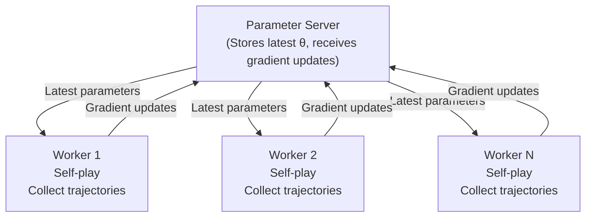

import { EloChart } from '@site/src/components/D3Charts';

# Self-Play

In the previous article, we introduced the basic concepts of reinforcement learning. Now, let's explore one of the keys to AlphaGo's success - **Self-Play**.

This is a seemingly contradictory concept: **How can an AI become stronger by playing against itself?**

The answer is both profound and elegant, involving game theory, evolutionary dynamics, and the nature of learning.

---

## Why Does Self-Play Work?

### Intuitive Explanation

Imagine you're a Go beginner, practicing alone on a deserted island:

1. You play a game, acting as both Black and White
2. After the game, you analyze which moves were good and which were bad
3. In the next game, you try to avoid previous mistakes
4. You repeat this process millions of times

Intuitively, this seems problematic:
- If your level is poor, both Black and White play badly - what can you learn?
- Could you fall into a "wrong equilibrium" - both sides play wrong but cancel each other out?

But actually, self-play can produce continuous improvement. Here's why:

### Progressive Discovery of Weaknesses

The key insight is: **Even when both sides are the same AI, each game's result still contains information.**

```
Position A: AI chose move X, eventually won
Position A: AI chose move Y, eventually lost

→ Conclusion: In position A, X is better than Y
```

Through statistical analysis of many games, AI can learn which choices are better in each position. This is the essence of **policy gradient**: good choices get reinforced, bad choices get suppressed.

### Adversarial Learning

Self-play has a special property: **The training opponent automatically adapts to your level.**

```
Training cycle 1: AI discovers effective tactic T
Training cycle 2: As opponent, AI learns to defend against T
Training cycle 3: Original AI is forced to find better tactic T'
```

This forms an **arms race**, where both sides continuously discover and overcome each other's weaknesses.

### Comparison with Human Games

| Training Method | Pros | Cons |
|-----------------|------|------|
| **Human games** | Learn from accumulated human wisdom | Limited by human level |
| **Self-play** | Unlimited improvement potential | May get stuck in local optima |
| **Both combined** | Quick start + continuous improvement | Best strategy |

Original AlphaGo first used human games for supervised learning, then self-play for reinforcement learning. AlphaGo Zero proved that self-play alone can achieve superhuman level.

---

## Game Theory Perspective

### Nash Equilibrium

In game theory, **Nash Equilibrium** is a stable state: at this state, no player has incentive to unilaterally change strategy.

For **zero-sum, perfect-information games** like Go, Nash equilibrium has special meaning:

$$\pi^* = \arg\max_\pi \min_{\pi'} V(\pi, \pi')$$

Where $V(\pi, \pi')$ is the expected value when strategy $\pi$ plays against strategy $\pi'$.

This is the famous **Minimax principle**: the optimal strategy is the one that performs best in the worst case.

### Self-Play and Nash Equilibrium

Theoretically, if self-play converges, it should converge to Nash equilibrium. For deterministic games like Go, Nash equilibrium is **perfect play**.

But Go's state space is too large ($10^{170}$), so we cannot find the true Nash equilibrium. Self-play actually **approximates** this equilibrium.

### Fictitious Play

Self-play is related to the game theory concept of **fictitious play**:

1. Each player observes opponent's historical strategies
2. Calculates average distribution of opponent strategies
3. Chooses best response against this average distribution

Under certain conditions, fictitious play provably converges to Nash equilibrium.

AlphaGo's self-play can be seen as a neural network implementation of this concept.

---

## Mechanism of Self-Play

### Basic Process

AlphaGo's self-play process:

```
Algorithm: Self-Play Training

Initialize: Policy Network π_θ (can start from supervised learning or random initialization)

Repeat until convergence:

1. Generate game data
   For i = 1 to N (in parallel):
     a. Self-play one game with current policy π_θ
     b. Collect trajectory: τ_i = (s_0, a_0, r_1, s_1, a_1, ...)
     c. Record final result z_i ∈ {-1, +1}

2. Update policy
   a. Compute policy gradient:
      ∇J = (1/N) Σ_i Σ_t ∇_θ log π_θ(a_t|s_t) · z_i
   b. Update parameters: θ ← θ + α · ∇J

3. Update value network
   a. Train Value Network with (s, z) pairs
   b. Minimize: L = E[(V_φ(s) - z)²]

4. Optional: Evaluate and save checkpoint
   a. Let new policy play against old versions
   b. If win rate > 55%, update opponent pool
```

### Training Data Generation

Each self-play game generates a **trajectory**:

$$\tau = (s_0, a_0, s_1, a_1, \ldots, s_T, z)$$

Where:
- $s_t$: Board state at time step $t$
- $a_t$: Action chosen at time step $t$
- $z$: Final result (+1 win, -1 loss)

A 200-move game generates 200 training samples. With hundreds of thousands of self-play games daily, training data volume is staggering.

### Policy Update

Update Policy Network using policy gradient:

$$\theta \leftarrow \theta + \alpha \cdot \nabla_\theta \mathbb{E}\left[\sum_t \log \pi_\theta(a_t|s_t) \cdot z\right]$$

This update's effect:
- If final win ($z = +1$): increase probability of all moves
- If final loss ($z = -1$): decrease probability of all moves

This seems crude - winning games may have some bad moves, losing games may have some good moves. But through statistics of many games, this "noise" averages out, and truly good moves are identified.

### Value Network Training

Value Network uses **regression** training:

$$\phi \leftarrow \phi - \beta \cdot \nabla_\phi \mathbb{E}\left[(V_\phi(s) - z)^2\right]$$

This teaches Value Network to predict: from current position, what's the probability of winning?

Value Network serves to:
1. Provide leaf node evaluation in MCTS
2. Serve as baseline for policy gradient
3. Directly evaluate positions

---

## Importance of Randomization

### Avoiding Deterministic Loops

If self-play is completely deterministic, it might loop:

```
Policy A always plays fixed opening
Policy A vs Policy A always produces same game
Only one game is repeatedly learned
AI cannot explore other possibilities
```

This is why **randomness** is crucial in self-play.

### Sources of Randomization

Ways AlphaGo introduces randomness in self-play:

**1. Policy network itself is stochastic**

Policy Network outputs probability distribution, not deterministic choices:

$$a \sim \pi_\theta(a|s)$$

Same position may yield different moves each time.

**2. Temperature parameter**

Use higher temperature during training for more diversity:

$$\pi_\tau(a|s) = \frac{\pi_\theta(a|s)^{1/\tau}}{\sum_{a'} \pi_\theta(a'|s)^{1/\tau}}$$

- $\tau > 1$: More random, more exploration
- $\tau < 1$: More deterministic, more exploitation
- $\tau = 1$: Original distribution

**3. Dirichlet Noise**

AlphaGo Zero adds Dirichlet noise to root node prior probabilities during self-play:

$$P(s, a) = (1 - \varepsilon) \cdot \pi_\theta(a|s) + \varepsilon \cdot \eta_a$$

Where $\eta \sim \text{Dir}(\alpha)$, $\varepsilon = 0.25$, $\alpha = 0.03$ (for Go's 361 actions).

This ensures even very low probability moves have chance to be explored.

### Population Method

Another way to increase diversity is maintaining an **opponent pool**:

```
Pool = [π_1, π_2, π_3, ..., π_k] (different policy versions)

Each game:
1. Randomly select opponent from pool
2. Play against that opponent
3. Update current policy with result
4. Periodically add improved policy to pool
```

Benefits of this approach:
- **Diversity**: Different opponent styles
- **Stability**: Avoid overfitting to specific opponent
- **Robustness**: Learn to handle various strategies

Both original AlphaGo and AlphaGo Zero used similar techniques.

---

## Strength Growth Curve

### Elo Rating System

To track AI strength changes, AlphaGo uses the **Elo rating system**.

Elo system's basic principle:

$$P(\text{A wins}) = \frac{1}{1 + 10^{(R_B - R_A)/400}}$$

Where $R_A$ and $R_B$ are both sides' Elo scores.

- 200 point difference: Stronger side expected to win 75%
- 400 point difference: Stronger side expected to win 90%
- 800 point difference: Stronger side expected to win 99%

### AlphaGo's Strength Growth

Let's visualize strength growth of different AlphaGo versions:

<EloChart mode="zero" width={700} height={400} showMilestones={true} />

### Growth Rate Analysis

Several interesting phenomena observable from the curve:

**1. Rapid early growth**

In first few hours of training, AI learns basic rules and simple tactics. This is the **low-hanging fruit** phase - too many obvious mistakes to fix.

**2. Steady middle-phase growth**

As basic mistakes are eliminated, AI starts learning more sophisticated tactics and joseki. Growth rate slows but remains steady.

**3. Later growth slowdown**

When AI is already very strong, further improvement becomes difficult. May need to discover entirely new strategies, not just fix mistakes.

### Moment of Surpassing Humans

Key milestones in AlphaGo's training curve:

| Milestone | Equivalent to | Time to Achieve |
|-----------|---------------|-----------------|
| Surpass strong amateurs | Elo ~2700 | ~3 hours |
| Surpass Fan Hui | Elo ~3500 | ~36 hours |
| Surpass Lee Sedol | Elo ~4500 | ~60 hours |
| Surpass original AlphaGo | Elo ~5000 | ~72 hours |

These numbers (from AlphaGo Zero) are stunning: **AI surpassed thousands of years of human Go wisdom in 3 days, starting from scratch.**

---

## Convergence Analysis

### Does Self-Play Converge?

This is an important theoretical question. Short answer: **Under certain conditions yes, but Go is too complex for rigorous proof.**

### Theoretical Guarantees

For simpler games (like tic-tac-toe), it can be proven:

1. **Existence**: Nash equilibrium exists (Minimax theorem)
2. **Convergence**: Certain algorithms (like fictitious play) converge to Nash equilibrium

For Go, we lack rigorous convergence guarantees, but experimental evidence shows:
- Strength continues to improve
- No obvious oscillation or degradation
- Final strength surpasses all known humans

### Possible Failure Modes

Problems self-play might encounter:

**1. Strategy Cycling**

```
Strategy A beats Strategy B
Strategy B beats Strategy C
Strategy C beats Strategy A
```

This does happen in some games (like rock-paper-scissors). But Go's complexity seems to prevent pure cycling.

**2. Overfitting to Self**

AI might learn strategies only targeting its own style, unable to handle other styles' opponents. This is why AlphaGo plays against different versions of itself, and ultimately tests against human players.

**3. Local Optima**

AI might get stuck in local optima - a strategy that's "okay but not best." Randomization and massive game volume help avoid this.

### Practical Observations

Observations from AlphaGo's training process:

1. **Continuous improvement**: Elo score keeps rising with training
2. **No degradation**: No sudden strength drops
3. **Style evolution**: AI's playing style gradually changes with training
4. **New joseki discovered**: AI discovers openings and tactics humans never used

These observations show that while we lack theoretical guarantees, self-play is effective in practice.

---

## Implementation Details

### Parallel Self-Play

To accelerate training, AlphaGo uses large-scale parallel self-play:



**Key design decisions**:

- **Sync vs. Async**: AlphaGo uses asynchronous updates, Workers don't need to wait for each other
- **Update frequency**: Update parameters every N games completed
- **Opponent selection**: Randomly select one of recent versions as opponent

### Checkpoint Strategy

Periodically save model checkpoints for:

1. **Opponent pool**: Maintain different version opponents
2. **Evaluation**: Track strength changes
3. **Failure recovery**: Resume from interruption

```python
# Pseudocode
def training_loop():
    for iteration in range(num_iterations):
        # Generate game data
        trajectories = parallel_self_play(current_policy, num_games=1000)

        # Update policy
        update_policy(trajectories)

        # Periodic evaluation and save
        if iteration % 100 == 0:
            elo = evaluate_against_pool(current_policy)
            save_checkpoint(current_policy, elo)

            if elo > best_elo:
                add_to_pool(current_policy)
                best_elo = elo
```

### Training Resource Requirements

AlphaGo's training scale is impressive:

| Version | Hardware | Training Time | Self-Play Games |
|---------|----------|---------------|-----------------|
| AlphaGo Fan | 176 GPU | Several months | ~30M |
| AlphaGo Lee | 48 TPU | Several weeks | ~30M |
| AlphaGo Zero | 4 TPU | 3 days | ~5M |
| AlphaGo Zero (40-day) | 4 TPU | 40 days | ~30M |

Note AlphaGo Zero achieved stronger play with less hardware and shorter time - this is algorithmic efficiency improvement.

### Hyperparameter Settings

Some key hyperparameters:

```python
# Self-play settings
NUM_PARALLEL_GAMES = 5000      # Concurrent games
GAMES_PER_ITERATION = 25000    # Games per iteration
MCTS_SIMULATIONS = 1600        # MCTS simulations per move

# Training settings
BATCH_SIZE = 2048              # Training batch size
LEARNING_RATE = 0.01           # Initial learning rate
L2_REGULARIZATION = 1e-4       # Weight decay

# Exploration settings
TEMPERATURE = 1.0              # Temperature for first 30 moves
DIRICHLET_ALPHA = 0.03         # Dirichlet noise parameter
EXPLORATION_FRACTION = 0.25    # Noise ratio
```

These hyperparameters were tuned through extensive experimentation and significantly affect training results.

---

## Self-Play Variants

### Original AlphaGo

Original AlphaGo's training process:

```
1. Supervised Learning (SL): Learn from human games
   → Produces SL Policy Network (π_SL)

2. Reinforcement Learning (RL): Self-play
   Initialize π_RL = π_SL
   Opponent pool = [π_SL]

   Repeat:
     a. π_RL plays against policies in pool
     b. Update π_RL with policy gradient
     c. If π_RL improves, add to pool

   → Produces RL Policy Network (π_RL)

3. Value Network training:
   Use π_RL self-play to generate positions
   Train V(s) to predict win rate
```

### AlphaGo Zero

AlphaGo Zero simplified this process:

```
1. Pure self-play (no human data)
   Initialize random network f_θ

   Repeat:
     a. Self-play with MCTS + f_θ
     b. Train policy head and value head together
     c. Update f_θ

   → Single network outputs both policy and value
```

Key improvements:
- **No human data**: Start from scratch
- **Single network**: Policy and value share features
- **Simpler training**: End-to-end learning

### AlphaZero

AlphaZero further generalized:

```
Same algorithm, different games:
- Go: Surpasses AlphaGo Zero level
- Chess: Surpasses Stockfish
- Shogi: Surpasses Elmo

Only game-specific part: Rule encoding
```

This proves self-play is a **general learning paradigm**, not limited to Go.

---

## What Humans Learned

### New Joseki Discovered by AI

Self-play produced many moves humans never used:

**1. Opening innovations**

Some openings AlphaGo prefers:
- 3-3 invasion: Invading corner early
- High plays: Traditionally considered "unstable"
- Large avalanche variations: Humans thought too complex to calculate

**2. New position evaluations**

AI's evaluation of some positions differs greatly from humans:
- Some seemingly "thin" shapes are actually solid
- Some "thickness" value is overestimated
- Reassessment of "sente" and "gote"

### Impact on Human Go

After AlphaGo, professional Go changed significantly:

1. **Opening diversification**: Professionals began using AI-discovered openings
2. **Training methods changed**: AI became main training tool for professionals
3. **Go theory rethought**: Many traditional "principles" questioned and revised
4. **New aesthetics**: Began appreciating AI-style play

Ke Jie said after losing to AlphaGo:

> "AlphaGo made me understand Go anew. I thought humans understood Go, now I know we only scratched the surface."

---

## Philosophical Reflection

### Nature of Learning

Self-play raises profound questions about learning:

**Where does knowledge come from?**

- Human learning depends on external information (teachers, books, experience)
- Self-play AI only has rules, no external knowledge
- Yet it can "discover" knowledge - where does this knowledge come from?

The answer might be: **Knowledge is implicit in game rules and structure.** Go's rules define what's good and bad play; self-play just reveals these implicit structures.

### Creativity and Discovery

When AI plays "divine move" (Move 37), is that creation or discovery?

One view: That move always "existed" in Go's rules; AI just "discovered" it.
Another view: AI "created" that move, since no one (including AI itself) knew it beforehand.

This question has no standard answer, but it challenges our traditional understanding of creativity.

### Place of Human Intelligence

If AI can start from scratch and surpass thousands of years of human wisdom through self-play, what does this mean for humans?

Optimistic view:
- AI is a tool created by humans
- AI's discoveries can enhance human understanding
- Humans can collaborate with AI to reach higher levels

Cautious view:
- In some domains, pure computation may surpass human intuition
- Need to rethink value of "expertise"
- Education and training methods may need to change

---

## Animation Reference

Core concepts covered in this article with animation numbers:

| Number | Concept | Physics/Math Correspondence |
|--------|---------|----------------------------|
| Animation E5 | Self-play loop | Fixed-point iteration |
| Animation E6 | Strategy evolution | Evolutionary dynamics |

---

## Summary

Self-play is one of AlphaGo's key technologies. We learned:

1. **Why it works**: Adversarial learning, progressive weakness discovery
2. **Mechanism**: Trajectory collection, policy gradient, value network training
3. **Randomization**: Temperature parameter, Dirichlet noise, opponent pool
4. **Strength growth**: Elo system, growth curve analysis
5. **Convergence**: Theoretical guarantees and practical observations
6. **Implementation details**: Parallel training, checkpoint strategy, hyperparameters

In the next article, we'll explore how AlphaGo combines neural networks with MCTS, leveraging both strengths.

---

## Further Reading

- **Next**: [MCTS and Neural Network Integration](../mcts-neural-combo) - Perfect combination of intuition and reasoning
- **Previous**: [Introduction to Reinforcement Learning](../reinforcement-intro) - Basic RL concepts
- **Related**: [AlphaGo Zero Overview](../alphago-zero) - Breakthrough starting from scratch

---

## References

1. Silver, D., et al. (2016). "Mastering the game of Go with deep neural networks and tree search." *Nature*, 529, 484-489.
2. Silver, D., et al. (2017). "Mastering the game of Go without human knowledge." *Nature*, 550, 354-359.
3. Silver, D., et al. (2018). "A general reinforcement learning algorithm that masters chess, shogi, and Go through self-play." *Science*, 362(6419), 1140-1144.
4. Heinrich, J., & Silver, D. (2016). "Deep Reinforcement Learning from Self-Play in Imperfect-Information Games." *arXiv preprint*.
5. Lanctot, M., et al. (2017). "A Unified Game-Theoretic Approach to Multiagent Reinforcement Learning." *NeurIPS*.
