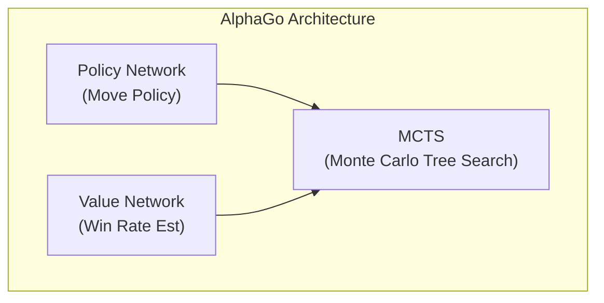
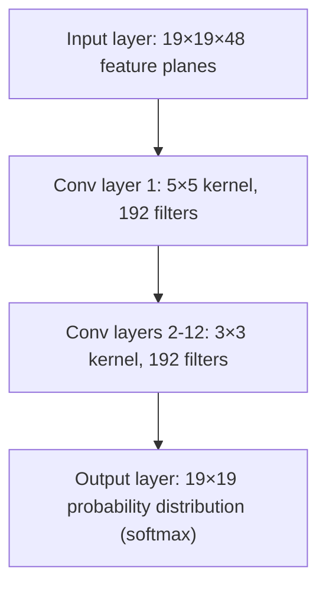
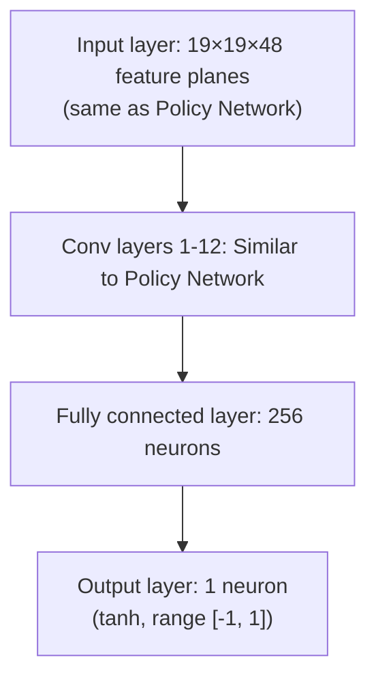
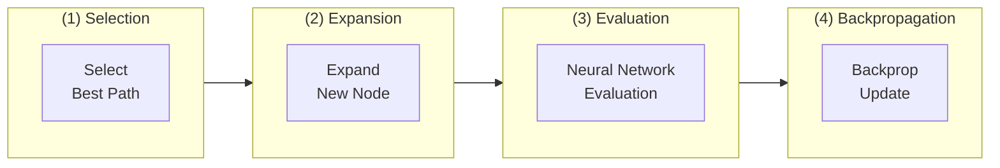
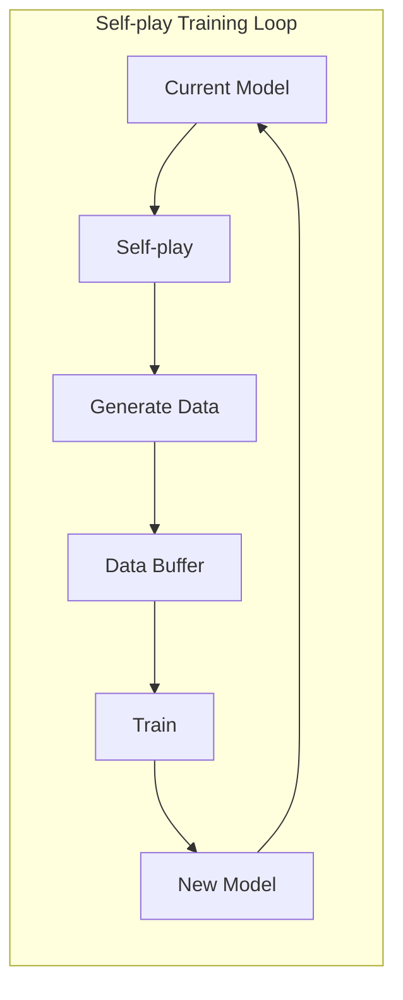
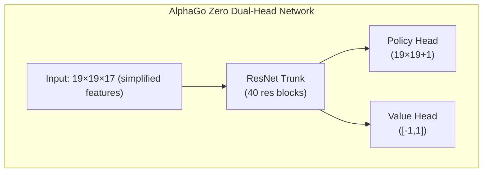

# AlphaGo Paper Analysis

This article provides an in-depth analysis of DeepMind's classic paper published in Nature: "Mastering the game of Go with deep neural networks and tree search," as well as subsequent AlphaGo Zero and AlphaZero papers.

## Historical Significance of AlphaGo

Go has long been considered the "holy grail" challenge for artificial intelligence. Unlike chess, Go's search space is extremely vast:

| Game | Average Branching Factor | Average Game Length | State Space |
|------|-------------|-------------|----------|
| Chess | ~35 | ~80 | ~10^47 |
| Go | ~250 | ~150 | ~10^170 |

Traditional brute-force search methods are completely infeasible for Go. AlphaGo's 2016 victory over Lee Sedol demonstrated the powerful combination of deep learning and reinforcement learning.

### Milestone Events

- **October 2015**: AlphaGo Fan defeats European champion Fan Hui (professional 2-dan) 5:0
- **March 2016**: AlphaGo Lee defeats world champion Lee Sedol (professional 9-dan) 4:1
- **May 2017**: AlphaGo Master defeats world #1 ranked Ke Jie 3:0
- **October 2017**: AlphaGo Zero published, pure self-play training, surpasses all previous versions

## Core Technical Architecture

AlphaGo's core innovation lies in combining three key technologies:



### Policy Network

The Policy Network predicts the probability of playing at each position, guiding search direction.

#### Network Architecture



#### Input Features

AlphaGo uses 48 feature planes as input:

| Feature | Planes | Description |
|------|--------|------|
| Stone color | 3 | Black stones, white stones, empty |
| Liberties | 8 | 1, 2, ..., 8 or more liberties |
| Liberties after capture | 8 | How many liberties after capturing |
| Capture size | 8 | How many stones can be captured at position |
| Ko | 1 | Whether position is ko |
| Move legality | 1 | Whether position is legal |
| Previous 1-8 moves | 8 | Positions of last several moves |
| Turn to play | 1 | Currently Black or White to play |

#### Training Method

Policy Network training has two phases:

**Phase 1: Supervised Learning (SL Policy Network)**
- Uses 30 million games from KGS Go server
- Objective: Predict human player's next move
- Achieves 57% prediction accuracy

**Phase 2: Reinforcement Learning (RL Policy Network)**
- Starts from SL Policy Network
- Self-play against previous versions
- Optimizes using REINFORCE algorithm

```python
# Simplified Policy Gradient update
# reward: +1 win, -1 loss
loss = -log(policy[action]) * reward
```

### Value Network

The Value Network evaluates the win rate of the current position, reducing search depth needed.

#### Network Architecture



#### Training Method

Value Network trains on 30 million positions generated by RL Policy Network self-play:

- Randomly sample one position from each game
- Use final game outcome as label
- Use MSE loss function

```python
# Value Network training
value_prediction = value_network(position)
loss = (value_prediction - game_outcome) ** 2
```

**Why sample only one position per game?**

Taking multiple samples would make adjacent positions from the same game highly correlated, causing overfitting. Random sampling ensures training data diversity.

## Monte Carlo Tree Search (MCTS)

MCTS is AlphaGo's decision-making core, combining neural networks for efficient best-move search.

### MCTS Four Steps



### Selection Formula (PUCT)

AlphaGo uses PUCT (Predictor + UCT) formula to select which branch to explore:

```
a = argmax[Q(s,a) + u(s,a)]

u(s,a) = c_puct * P(s,a) * sqrt(N(s)) / (1 + N(s,a))
```

Where:
- **Q(s,a)**: Average value of action a (exploitation)
- **P(s,a)**: Prior probability from Policy Network
- **N(s)**: Visit count of parent node
- **N(s,a)**: Visit count of this action
- **c_puct**: Exploration constant, balances exploration and exploitation

### Search Process Details

1. **Selection**: From root node, use PUCT formula to select actions until reaching leaf node
2. **Expansion**: Expand new child nodes at leaf, initialize prior probabilities with Policy Network
3. **Evaluation**: Combine Value Network evaluation and rollout simulation to evaluate value
4. **Backpropagation**: Pass evaluation value back along path, update Q values and N values

### Rollout (Fast Playouts)

AlphaGo (non-Zero version) also uses a small fast policy network for simulation:

```
Leaf node → Fast random playout to game end → Calculate outcome
```

Final evaluation combines Value Network and Rollout:

```
V = λ * v_network + (1-λ) * v_rollout
```

AlphaGo uses λ = 0.5, giving equal weight to both.

## Self-play Training Method

Self-play is AlphaGo's core training strategy, letting AI continuously improve by playing against itself.

### Training Loop



### Why Self-play Works

1. **Unlimited data**: Not limited by number of human games
2. **Adaptive difficulty**: Opponent strength improves together with self
3. **Explore innovations**: Not constrained by human thinking patterns
4. **Clear objective**: Directly optimizes win rate, not imitating humans

## AlphaGo Zero Improvements

AlphaGo Zero published in 2017 brought revolutionary improvements:

### Main Differences

| Feature | AlphaGo | AlphaGo Zero |
|------|---------|--------------|
| Initial training | Supervised learning on human games | Starts completely from zero |
| Network architecture | Separate Policy/Value | Single dual-head network |
| Network structure | Regular CNN | ResNet |
| Feature engineering | 48 hand-crafted features | 17 simple features |
| Rollout | Required | Not needed |
| Training time | Months | 3 days to surpass humans |

### Architecture Simplification



### Simplified Input Features

AlphaGo Zero uses only 17 feature planes:

- 8 planes: Own stone positions for last 8 moves
- 8 planes: Opponent stone positions for last 8 moves
- 1 plane: Current player to move (all 0s or all 1s)

### Training Improvements

1. **Pure self-play**: No human data used
2. **MCTS probabilities as training targets**: Instead of binary win/loss
3. **No rollout**: Relies entirely on Value Network
4. **Single network training**: Policy and Value share parameters, mutually enhance

## AlphaZero Generalization

AlphaZero published late 2017 applied the same architecture to Go, chess, and shogi:

### Key Features

- **Zero domain knowledge**: Uses no domain-specific knowledge besides game rules
- **Unified architecture**: Same algorithm works for different games
- **Faster training**:
  - Go: 8 hours to surpass AlphaGo Lee
  - Chess: 4 hours to surpass Stockfish
  - Shogi: 2 hours to surpass Elmo

### Differences from AlphaGo Zero

| Feature | AlphaGo Zero | AlphaZero |
|------|-------------|-----------|
| Target games | Go only | Go, chess, shogi |
| Symmetry usage | Uses Go's 8-fold symmetry | Doesn't assume symmetry |
| Hyperparameter tuning | Optimized for Go | Generic settings |
| Training method | Best model self-play | Latest model self-play |

## Implementation Key Points

If you want to implement a similar system, here are key considerations:

### Computational Resources

AlphaGo training required enormous computational resources:

- **AlphaGo Lee**: 176 GPUs + 48 TPUs
- **AlphaGo Zero**: 4 TPUs (training) + 1 TPU (self-play)
- **AlphaZero**: 5000 TPUs (training)

### Key Hyperparameters

```python
# MCTS related
num_simulations = 800     # Simulations per move
c_puct = 1.5              # Exploration constant
temperature = 1.0         # Temperature for move selection

# Training related
batch_size = 2048
learning_rate = 0.01      # With decay
l2_regularization = 1e-4
```

### Common Issues

1. **Training instability**: Use smaller learning rate, increase batch size
2. **Overfitting**: Ensure training data diversity, use regularization
3. **Search efficiency**: Optimize GPU batch inference, parallelize MCTS

## Further Reading

- [Original paper: Mastering the game of Go with deep neural networks and tree search](https://www.nature.com/articles/nature16961)
- [AlphaGo Zero paper: Mastering the game of Go without human knowledge](https://www.nature.com/articles/nature24270)
- [AlphaZero paper: A general reinforcement learning algorithm that masters chess, shogi, and Go through self-play](https://www.science.org/doi/10.1126/science.aar6404)

After understanding AlphaGo's technology, let's see [how KataGo improves upon this foundation](./katago-paper.md).

