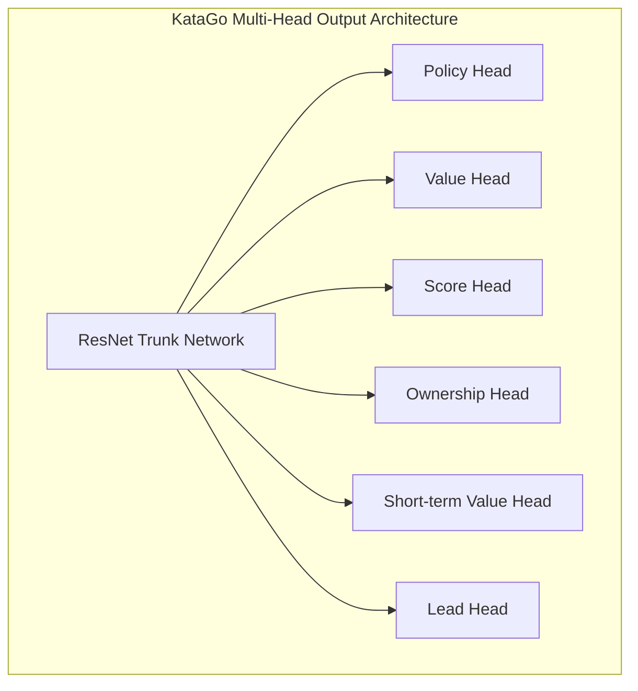
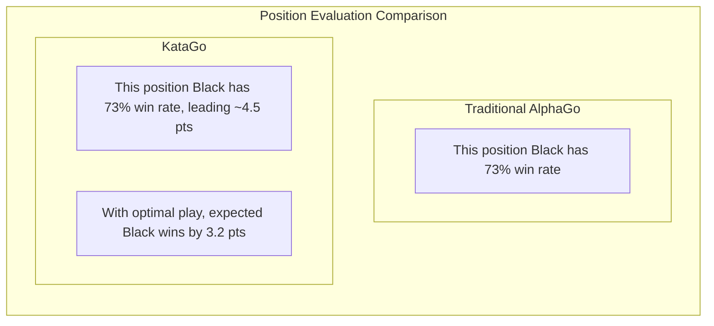

# KataGo Paper Analysis

KataGo is an open-source Go AI developed by David Wu, with its paper "Accelerating Self-Play Learning in Go" published in 2019. KataGo achieves playing strength surpassing ELF OpenGo with fewer computational resources, and is currently the most powerful open-source Go AI.

## KataGo's Innovations

KataGo doesn't make revolutionary changes to neural network architecture, but instead systematically optimizes training methods and auxiliary tasks, achieving significant efficiency improvements.

### Core Innovation Overview

| Innovation | Effect |
|--------|------|
| Auxiliary training targets | Accelerates learning, provides more supervision signals |
| Global pooling structure | Better captures global information |
| Multiple rule support | Single model adapts to different tournament rules |
| Playout cap randomization | Improves training efficiency |
| Improved data augmentation | Increases training data diversity |

## More Efficient Training Methods

### Auxiliary Training Targets

Traditional AlphaGo Zero has only two training targets:
1. Policy: Predict MCTS move probability distribution
2. Value: Predict game outcome

KataGo adds multiple auxiliary training targets, providing richer learning signals:



#### Output Head Descriptions

| Output Head | Dimension | Prediction Target |
|--------|------|----------|
| **Policy** | 19×19+1 | Move probability for each position (including pass) |
| **Value** | 3 | Win/Loss/Draw probability |
| **Score** | Continuous | Predicted final score difference |
| **Ownership** | 19×19 | Final ownership of each point (Black/White territory) |
| **Short-term Value** | 1 | Expected win rate in short term |
| **Lead** | 1 | Current point lead |

### Why Auxiliary Targets Are Effective

1. **Denser supervision signals**: Value provides only one number, while Ownership provides 361 supervision points
2. **Reduces overfitting**: Multi-task learning has regularization effect
3. **Accelerates convergence**: Auxiliary tasks help network learn useful feature representations faster
4. **Provides better gradients**: Avoids vanishing gradient problems

### Playout Cap Randomization

AlphaGo Zero performs a fixed 800 MCTS simulations per move. KataGo introduces randomization:

```python
# Traditional approach
num_playouts = 800  # Fixed

# KataGo approach
playout_cap = random.choice([
    100, 200, 300, 400, 500, 600, 700, 800
])
```

**Benefits**:
- Training data becomes more diverse
- Model learns to make reasonable decisions at different search depths
- Performs well in actual play even with less search

### Data Augmentation Improvements

Traditional methods use Go's 8-fold symmetry (4 rotations × 2 reflections) for data augmentation. KataGo improves further:

- **Random symmetry transforms**: Randomly select symmetry transform each sample
- **History state randomization**: Randomly select representation of historical positions
- **Color randomization**: Randomly swap Black/White perspectives

## Multiple Go Rule Support

This is one of KataGo's important features. Different Go rules affect strategic decisions:

### Main Rule Differences

| Rule System | Scoring Method | Komi | Ko Rule | Suicide |
|---------|---------|------|---------|------|
| Chinese Rules | Area counting | 7.5 | Simple ko | Forbidden |
| Japanese Rules | Territory counting | 6.5 | Superko | Forbidden |
| Korean Rules | Territory counting | 6.5 | Superko | Forbidden |
| Ing Rules | Area counting | 8 pts | Special ko rules | Forbidden |
| Tromp-Taylor | Area counting | Adjustable | Superko | Allowed |
| AGA Rules | Area/Territory | 7.5 | Superko | Forbidden |
| New Zealand Rules | Area counting | 7 | Simple ko | Allowed |

### Technical Implementation

KataGo encodes rule information as input features:

```python
# Rule-related input feature example
rule_features = {
    'komi': 7.5,           # Komi value
    'scoring_rule': 'area', # Area/territory counting
    'ko_rule': 'simple',    # Ko rule
    'suicide_allowed': False,
    'tax_rule': 'none',     # Whether there's "eye" tax
    # ...
}
```

The network learns to adjust strategy based on different rules. For example:
- Territory counting focuses more on territory control
- When suicide is allowed, can be used for special tactics
- Different komi affects opening choices

## Simultaneous Win Rate and Score Prediction

This is one of KataGo's most practical features, extremely valuable for Go teaching and analysis.

### Value vs Score



### Practical Application Value

1. **More precise position evaluation**:
   - 80% win rate but only 1 point lead → Still uncertain
   - 80% win rate with 20 point lead → Game is decided

2. **Teaching assistance**:
   - Help students understand "how many points a move lost"
   - Compare point differences of different choices

3. **Handicap game analysis**:
   - Accurately evaluate if handicap is appropriate
   - Judge whether to attack or defend

### Score Distribution

KataGo predicts not just a single score, but the complete score distribution:

```
Score distribution example:
├─ Black wins by 10+ pts: 15%
├─ Black wins by 5-10 pts: 25%
├─ Black wins by 0-5 pts: 20%
├─ White wins by 0-5 pts: 18%
├─ White wins by 5-10 pts: 15%
└─ White wins by 10+ pts: 7%

Expected value: Black +3.2 pts
Standard deviation: ±8.5 pts
```

This distribution information better reflects the complexity and uncertainty of the position.

## Ownership Map

Ownership predicts whether each point will belong to Black or White at game end:

```
                  Ownership Map
    A B C D E F G H J K L M N O P Q R S T
19  ○ ○ ○ ○ ○ ○ · · · · · · · ● ● ● ● ● ●
18  ○ ○ ○ ○ ○ ○ · · · · · · · ● ● ● ● ● ●
17  ○ ○ ○ ○ ○ · · · · · · · · · ● ● ● ● ●
16  ○ ○ ○ ╋ · · · · · ╋ · · · · · ╋ ● ● ●
...

Legend: ○ = White territory  ● = Black territory  · = Undetermined
```

### Use Cases

- **Position analysis**: See both sides' spheres of influence at a glance
- **Life and death judgment**: Determine if a group can still be saved
- **Endgame calculation**: Evaluate value of endgame moves in different areas
- **Teaching demonstration**: Visualize territory concepts

## Comparison with AlphaGo Differences

| Aspect | AlphaGo Zero | KataGo |
|------|-------------|--------|
| **Training targets** | Policy + Value | Multiple auxiliary targets |
| **Output information** | Win rate | Win rate + Score + Territory |
| **Rule support** | Single rule | Multiple rules |
| **Network structure** | Pure convolutional ResNet | Added global pooling |
| **Search amount** | Fixed | Randomized |
| **Training efficiency** | Baseline | ~50x efficiency improvement |
| **Open source level** | Paper description | Fully open source |

### Training Efficiency Comparison

```
Resources needed to reach ELF OpenGo level:

ELF OpenGo:
- 2000 GPUs
- 2 weeks training

KataGo:
- 1 GPU (or tens of GPUs to accelerate)
- Days to weeks

Efficiency improvement: ~50-100x
```

## Network Architecture Details

### Global Pooling

Traditional CNNs can only see local information. KataGo adds global pooling layers to capture global features:

```python
class GlobalPoolingBlock(nn.Module):
    def forward(self, x):
        # x: [batch, channels, 19, 19]

        # Global average pooling
        global_avg = x.mean(dim=[2, 3])  # [batch, channels]

        # Global max pooling
        global_max = x.max(dim=2)[0].max(dim=1)[0]  # [batch, channels]

        # Combine global features
        global_features = torch.cat([global_avg, global_max], dim=1)

        # Process global features
        global_features = dense_layer(global_features)  # [batch, C]

        # Broadcast back to spatial dimensions and combine with regular path
        global_features = global_features.view(batch, -1, 1, 1)
        global_features = global_features.expand(-1, -1, 19, 19)

        return torch.cat([x, global_features], dim=1)
```

**Benefits**:
- Can sense global situation (like who is ahead)
- Better handles positions requiring global judgment
- Especially helpful for score prediction

### Network Sizes

KataGo provides models of different sizes:

| Model | Res Blocks | Channels | Parameters | Use Case |
|------|---------|--------|--------|----------|
| b10c128 | 10 | 128 | ~5M | CPU running |
| b15c192 | 15 | 192 | ~15M | General GPU |
| b20c256 | 20 | 256 | ~35M | Mid-range GPU |
| b40c256 | 40 | 256 | ~70M | High-end GPU |
| b60c320 | 60 | 320 | ~150M | Top-tier GPU |

## Actual Performance

### Strength Evaluation

KataGo's performance in various tests:

- Surpasses all Leela Zero networks
- Maintains high win rate against professional 9-dan players
- Ranks #1 on CGOS (Computer Go Server)

### Analysis Features

KataGo's analysis mode provides:

```json
{
  "moveInfos": [
    {
      "move": "Q16",
      "visits": 3420,
      "winrate": 0.573,
      "scoreLead": 2.8,
      "pv": ["Q16", "D4", "Q4", "D16"],
      "ownership": [...]
    }
  ],
  "rootInfo": {
    "winrate": 0.48,
    "scoreLead": -0.5,
    "visits": 10000
  }
}
```

## Further Reading

- [KataGo paper: Accelerating Self-Play Learning in Go](https://arxiv.org/abs/1902.10565)
- [KataGo GitHub project](https://github.com/lightvector/KataGo)
- [KataGo training logs and analysis](https://katagotraining.org/)

After understanding KataGo's technical features, let's look at [other Go AI developments](./zen.md) for a more complete picture of the industry.

