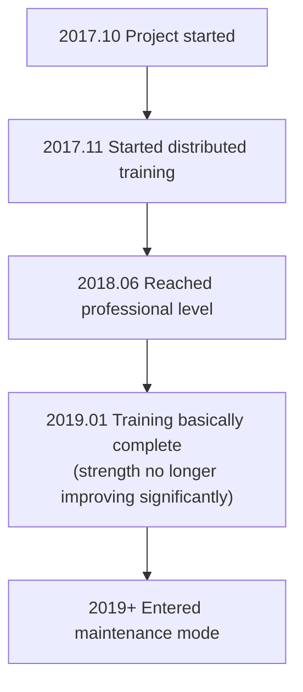

# Other Go AI Introduction

Besides AlphaGo and KataGo, there are many important projects in the Go AI field. This article introduces major commercial and open-source AIs to help you understand the entire ecosystem.

## Commercial Go AI

### Zen

**Developer**: Yoji Ojima / Japan
**First Release**: 2009
**License**: Commercial

Zen was one of the strongest Go programs before AlphaGo, reaching professional level in the traditional MCTS era.

#### Development History

| Time | Version | Milestone |
|------|------|--------|
| 2009 | Zen 1.0 | First release |
| 2011 | Zen 4 | Reached amateur 6-dan level |
| 2012 | Zen 5 | Defeated Takemiya Masaki 9-dan with 4 stones |
| 2016 | Zen 7 | Adopted deep learning technology |
| 2017+ | Deep Zen Go | Combined AlphaGo architecture |

#### Technical Features

- **Hybrid architecture**: Combines traditional heuristics with deep learning
- **Commercial optimization**: Optimized for consumer hardware
- **High stability**: Verified through years of commercial use
- **Multi-platform**: Runs on Windows, macOS

#### Product Forms

- **Tengen (Tencho no Go)**: Desktop software, ~10,000 JPY
- **Online play**: Active on KGS under Zen19 account

---

### Fine Art (Jue Yi)

**Developer**: Tencent AI Lab / China
**First Release**: 2016
**License**: Not publicly available

Fine Art is Tencent's Go AI with significant influence in China's Go community.

#### Development History

| Time | Event |
|------|------|
| November 2016 | First appearance, playing on Fox Go network |
| March 2017 | UEC Cup Computer Go Tournament champion |
| 2017 | Adopted by Chinese National Go Team as training tool |
| 2018 | World AI Go Championship winner |
| Continuing | Continues as national team training aid |

#### Technical Features

- **Large-scale training**: Uses Tencent cloud computing resources
- **Collaboration with top human players**: Receives extensive professional guidance
- **Rich practical experience**: Accumulated many games on Fox Go
- **Teaching function integration**: Provides review analysis features

#### Influence

Fine Art's impact on Chinese professional Go is profound:

- Became national team standard training tool
- Changed how professionals prepare for matches
- Promoted widespread AI-assisted training

---

### Golaxy (Xing Zhen)

**Developer**: DeepMind China / Tsinghua University team
**First Release**: 2018
**License**: Commercial

Golaxy was designed with the goal of being the "most human-like AI," with playing style closer to human players.

#### Technical Features

- **Human-like style**: Deliberately trained to play more like humans
- **Adjustable difficulty**: Can simulate opponents of different ranks
- **Teaching-oriented**: Designed with teaching applications in mind
- **Handicap game specialist**: Special optimization for handicap games

#### Product Applications

- **Yike Go**: Integrated into Yike App
- **Teaching platform**: Used for online Go teaching
- **Rank testing**: Provides standardized rank assessment

---

### Other Commercial AI

| Name | Developer | Features |
|------|--------|------|
| **CGI** | NCTU (Taiwan) | Academic research oriented |
| **Dolbaram** | NHN (Korea) | Integrated into Korean Go platforms |
| **AQ** | Japan AQ Team | Open source then went commercial |

## Open Source Go AI

### Leela Zero

**Developer**: Gian-Carlo Pascutto / Belgium
**First Release**: 2017
**License**: GPL-3.0
**GitHub**: https://github.com/leela-zero/leela-zero

Leela Zero was the first successful open-source project to replicate AlphaGo Zero, trained through distributed community effort.

#### Development History



#### Technical Features

- **Faithful reproduction**: Strictly implements AlphaGo Zero paper
- **Distributed training**: Global volunteers contribute GPU computing
- **Fully transparent**: All training data and models are public
- **Standard GTP**: Compatible with all GTP Go software

#### Training Statistics

| Item | Value |
|------|------|
| Total self-play games | ~18 million |
| Training iterations | ~270 |
| Contributors | Thousands |
| Training duration | ~1.5 years |

#### Usage

```bash
# Installation
brew install leela-zero  # macOS

# Run
leelaz --gtp --weights best-network.gz

# GTP commands
genmove black
play white D4
```

#### Current Status

Although Leela Zero is no longer actively training:
- Code remains an excellent resource for learning AlphaGo Zero
- Trained models are still usable
- Community still maintains basic functionality

---

### ELF OpenGo

**Developer**: Facebook AI Research (FAIR)
**First Release**: 2018
**License**: BSD
**GitHub**: https://github.com/pytorch/ELF

ELF OpenGo is Facebook's Go AI demonstrating large-scale distributed training capabilities.

#### Technical Features

- **ELF framework**: Based on Facebook's ELF (Extensive, Lightweight, and Flexible) game research platform
- **Large-scale training**: Uses 2000 GPUs for training
- **PyTorch implementation**: Uses Facebook's own deep learning framework
- **Research oriented**: Main purpose is research, not practical use

#### Performance

- Reached top level on KGS
- Stable win rate against professional 9-dan
- Paper published at top conference

#### Current Status

- Project no longer actively maintained
- Code and models still available for download
- Main value is academic reference

---

### SAI (Sensible Artificial Intelligence)

**Developer**: SAI Team / Europe
**First Release**: 2019
**License**: MIT
**GitHub**: https://github.com/sai-dev/sai

SAI is an improved version based on Leela Zero, focusing on experimental features.

#### Technical Features

- **Improved training methods**: Experiments with various training optimizations
- **More rule support**: Supports more Go rules than Leela Zero
- **Experimental features**: Tests new network architectures and training tricks

#### Current Status

- Still has small community maintaining it
- Mainly used for experiments and learning

---

### PhoenixGo

**Developer**: Tencent WeChat Team
**First Release**: 2018
**License**: BSD-3
**GitHub**: https://github.com/Tencent/PhoenixGo

PhoenixGo is Tencent's open-sourced Go AI, winning the 2018 World AI Go Championship.

#### Technical Features

- **Commercial grade quality**: From Tencent internal project
- **TensorFlow implementation**: Uses mainstream framework
- **Multi-platform support**: Linux, Windows, macOS
- **Distributed support**: Can run in multi-machine multi-GPU environment

#### Usage

```bash
# Build
bazel build //src:mcts_main

# Run
./mcts_main --gtp --config_path=config.conf
```

---

### MiniGo

**Developer**: Google Brain
**First Release**: 2018
**License**: Apache-2.0
**GitHub**: https://github.com/tensorflow/minigo

MiniGo is Google's open-sourced educational Go AI, designed to help more people understand AlphaGo principles.

#### Technical Features

- **Education oriented**: Clear, readable code
- **TensorFlow implementation**: Official Google example
- **Complete documentation**: Has detailed technical explanations
- **Colab support**: Can run directly in Google Colab

#### Use Cases

- Learning AlphaGo Zero architecture
- Understanding reinforcement learning in games
- As starting point for your own projects

## Comparison of AI Features

### Strength Comparison (Approximate)

| AI | Strength Level | Notes |
|----|---------|------|
| KataGo | Top superhuman | Continuously training |
| Fine Art | Top superhuman | Not public |
| Leela Zero | Superhuman | Training stopped |
| ELF OpenGo | Superhuman | Training stopped |
| PhoenixGo | Near superhuman | Training stopped |
| Zen | Professional level | Commercial product |
| Golaxy | Professional level | Adjustable difficulty |

### Feature Comparison

| Feature | KataGo | Leela Zero | PhoenixGo | Zen |
|------|--------|------------|-----------|------|
| Open source | Yes | Yes | Yes | No |
| Score prediction | Yes | No | No | Partial |
| Multi-rule support | Yes | No | No | No |
| Analysis API | Yes | No | No | No |
| CPU mode | Yes | Yes | Yes | Yes |
| Active updates | Yes | No | No | Partial |

### Use Case Recommendations

| Need | Recommended | Reason |
|------|---------|------|
| General play/analysis | KataGo | Strongest with most features |
| Learning AlphaGo | Leela Zero / MiniGo | Clear code |
| Commercial use | Zen / Self-trained KataGo | Clear licensing |
| Teaching aid | KataGo / Golaxy | Rich analysis features |
| Research experiments | KataGo / SAI | Can modify training |

## Future Development Trends

### Technical Trends

1. **More efficient training methods**
   - As demonstrated by KataGo's efficiency improvements
   - Fewer resources to achieve higher strength

2. **Better interpretability**
   - Explain why AI plays certain moves
   - Help humans understand AI's thinking

3. **Combining with human styles**
   - Train AI to play like specific players
   - For teaching and research

4. **Cross-game generalization**
   - As demonstrated by AlphaZero
   - Single framework for multiple games

### Application Trends

1. **Democratization**
   - More Go enthusiasts using AI analysis
   - Even phones can run it

2. **Professionalization**
   - Professional players deeply rely on AI training
   - AI assistance becomes standardized

3. **Commercialization**
   - More AI-assisted Go products
   - Teaching, analysis, training partner services

## Summary

The Go AI ecosystem is rich and diverse:

- **Want strongest strength and most features**: Choose KataGo
- **Want to learn AI principles**: Study Leela Zero or MiniGo code
- **Commercial use needs**: Evaluate Zen or train your own model
- **Special needs**: Choose or combine based on specific requirements

Next, let's move to practical content and learn how to [install and use KataGo](/docs/for-engineers/katago-source/)!

