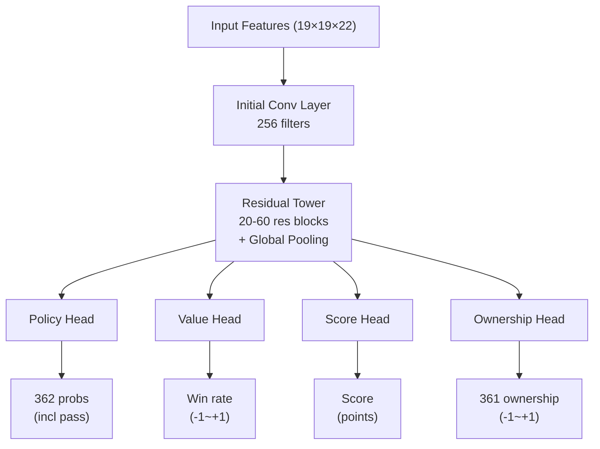
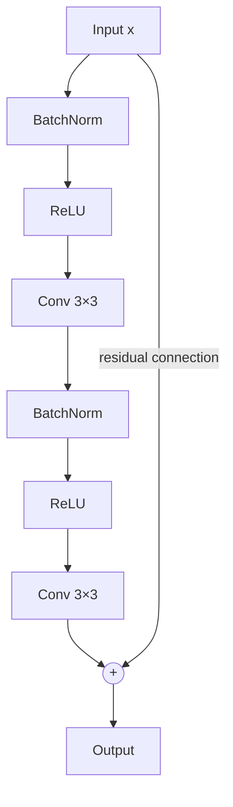

# Neural Network Architecture

This article provides an in-depth analysis of KataGo's complete neural network architecture, from input feature encoding to multi-head output design.

---

## Architecture Overview

KataGo uses a **single neural network with multi-head output** design:



---

## Input Feature Encoding

### Feature Planes Overview

KataGo uses **22 feature planes** (19×19×22), where each plane is a 19×19 matrix:

| Plane | Content | Description |
|-------|---------|-------------|
| 0 | Own stones | 1 = own stone present, 0 = none |
| 1 | Opponent stones | 1 = opponent stone present, 0 = none |
| 2 | Empty points | 1 = empty, 0 = has stone |
| 3-10 | History states | Board changes from past 8 moves |
| 11 | Ko point | 1 = ko forbidden, 0 = playable |
| 12-17 | Liberty encoding | Chains with 1, 2, 3... liberties |
| 18-21 | Rules encoding | Chinese/Japanese rules, komi, etc. |

### History State Stacking

To let the neural network understand **dynamic changes** in the position, KataGo stacks the past 8 board states:

```python
# History state encoding (concept)
def encode_history(game_history, current_player):
    features = []

    for t in range(8):  # Past 8 moves
        if t < len(game_history):
            board = game_history[-(t+1)]
            # Encode own/opponent stones at that time
            features.append(encode_board(board, current_player))
        else:
            # Insufficient history, fill with zeros
            features.append(np.zeros((19, 19)))

    return np.stack(features, axis=0)
```

### Rules Encoding

KataGo supports multiple rulesets, communicated to the neural network through feature planes:

```python
# Rules encoding (concept)
def encode_rules(rules, komi):
    rule_features = np.zeros((4, 19, 19))

    # Rule type (one-hot)
    if rules == "chinese":
        rule_features[0] = 1.0
    elif rules == "japanese":
        rule_features[1] = 1.0

    # Komi normalization
    normalized_komi = komi / 15.0  # Normalize to [-1, 1]
    rule_features[2] = normalized_komi

    # Current player
    rule_features[3] = 1.0 if current_player == BLACK else 0.0

    return rule_features
```

---

## Backbone Network: Residual Tower

### Residual Block Structure

KataGo uses **Pre-activation ResNet** structure:



### Code Example

```python
class ResidualBlock(nn.Module):
    def __init__(self, channels):
        super().__init__()
        self.bn1 = nn.BatchNorm2d(channels)
        self.conv1 = nn.Conv2d(channels, channels, 3, padding=1)
        self.bn2 = nn.BatchNorm2d(channels)
        self.conv2 = nn.Conv2d(channels, channels, 3, padding=1)

    def forward(self, x):
        residual = x

        out = self.bn1(x)
        out = F.relu(out)
        out = self.conv1(out)

        out = self.bn2(out)
        out = F.relu(out)
        out = self.conv2(out)

        return out + residual  # Residual connection
```

### Global Pooling Layer

One of KataGo's key innovations: adding **global pooling** in residual blocks, allowing the network to see global information:

```python
class GlobalPoolingBlock(nn.Module):
    def __init__(self, channels):
        super().__init__()
        self.conv = nn.Conv2d(channels, channels, 3, padding=1)
        self.fc = nn.Linear(channels, channels)

    def forward(self, x):
        # Local path
        local = self.conv(x)

        # Global path
        global_pool = x.mean(dim=[2, 3])  # Global average pooling
        global_fc = self.fc(global_pool)
        global_broadcast = global_fc.unsqueeze(2).unsqueeze(3)
        global_broadcast = global_broadcast.expand(-1, -1, 19, 19)

        # Fusion
        return local + global_broadcast
```

**Why is global pooling needed?**

Traditional convolution only sees locally (3×3 receptive field). Even with many stacked layers, global information perception remains limited. Global pooling lets the network directly "see":
- Stone count differences across the board
- Global influence distribution
- Overall position assessment

---

## Output Head Design

### Policy Head

Outputs the move probability for each position:

```python
class PolicyHead(nn.Module):
    def __init__(self, in_channels):
        super().__init__()
        self.conv = nn.Conv2d(in_channels, 2, 1)  # 1×1 convolution
        self.bn = nn.BatchNorm2d(2)
        self.fc = nn.Linear(2 * 19 * 19, 362)  # 361 + pass

    def forward(self, x):
        out = F.relu(self.bn(self.conv(x)))
        out = out.view(out.size(0), -1)
        out = self.fc(out)
        return F.softmax(out, dim=1)  # Probability distribution
```

**Output format**: 362-dimensional vector
- Indices 0-360: Move probability for 361 board positions
- Index 361: Pass probability

### Value Head

Outputs the win rate for the current position:

```python
class ValueHead(nn.Module):
    def __init__(self, in_channels):
        super().__init__()
        self.conv = nn.Conv2d(in_channels, 1, 1)
        self.bn = nn.BatchNorm2d(1)
        self.fc1 = nn.Linear(19 * 19, 256)
        self.fc2 = nn.Linear(256, 1)

    def forward(self, x):
        out = F.relu(self.bn(self.conv(x)))
        out = out.view(out.size(0), -1)
        out = F.relu(self.fc1(out))
        out = torch.tanh(self.fc2(out))  # Output -1 to +1
        return out
```

**Output format**: Single value [-1, +1]
- +1: Own side certain win
- -1: Opponent certain win
- 0: Even position

### Score Head

KataGo-specific, predicts the final score difference:

```python
class ScoreHead(nn.Module):
    def __init__(self, in_channels):
        super().__init__()
        self.conv = nn.Conv2d(in_channels, 1, 1)
        self.bn = nn.BatchNorm2d(1)
        self.fc1 = nn.Linear(19 * 19, 256)
        self.fc2 = nn.Linear(256, 1)

    def forward(self, x):
        out = F.relu(self.bn(self.conv(x)))
        out = out.view(out.size(0), -1)
        out = F.relu(self.fc1(out))
        out = self.fc2(out)  # Unbounded output
        return out
```

**Output format**: Single value (points)
- Positive: Own side leading
- Negative: Opponent leading

### Ownership Head

Predicts final ownership of each point:

```python
class OwnershipHead(nn.Module):
    def __init__(self, in_channels):
        super().__init__()
        self.conv1 = nn.Conv2d(in_channels, 32, 1)
        self.bn = nn.BatchNorm2d(32)
        self.conv2 = nn.Conv2d(32, 1, 1)

    def forward(self, x):
        out = F.relu(self.bn(self.conv1(x)))
        out = torch.tanh(self.conv2(out))  # Each point -1 to +1
        return out.view(out.size(0), -1)  # Flatten to 361
```

**Output format**: 361-dimensional vector, each value in [-1, +1]
- +1: Point belongs to own territory
- -1: Point belongs to opponent's territory
- 0: Neutral or disputed area

---

## Differences from AlphaZero

| Aspect | AlphaZero | KataGo |
|--------|-----------|--------|
| **Output heads** | 2 (Policy + Value) | **4** (+ Score + Ownership) |
| **Global pooling** | None | **Yes** |
| **Input features** | 17 planes | **22 planes** (incl. rules encoding) |
| **Residual blocks** | Standard ResNet | **Pre-activation + Global Pooling** |
| **Multi-rule support** | None | **Yes** (via feature encoding) |

---

## Model Sizes

KataGo provides models at different scales:

| Model | Residual Blocks | Channels | Parameters | Use Case |
|-------|-----------------|----------|------------|----------|
| b10c128 | 10 | 128 | ~5M | CPU, quick testing |
| b18c384 | 18 | 384 | ~75M | Regular GPU |
| b40c256 | 40 | 256 | ~95M | High-end GPU |
| b60c320 | 60 | 320 | ~200M | Top-tier GPU |

**Naming convention**: `b{num_blocks}c{channels}`

---

## Complete Network Implementation

```python
class KataGoNetwork(nn.Module):
    def __init__(self, num_blocks=18, channels=384):
        super().__init__()

        # Initial convolution
        self.initial_conv = nn.Conv2d(22, channels, 3, padding=1)
        self.initial_bn = nn.BatchNorm2d(channels)

        # Residual tower
        self.residual_blocks = nn.ModuleList([
            ResidualBlock(channels) for _ in range(num_blocks)
        ])

        # Global pooling blocks (insert one every few residual blocks)
        self.global_pooling_blocks = nn.ModuleList([
            GlobalPoolingBlock(channels) for _ in range(num_blocks // 6)
        ])

        # Output heads
        self.policy_head = PolicyHead(channels)
        self.value_head = ValueHead(channels)
        self.score_head = ScoreHead(channels)
        self.ownership_head = OwnershipHead(channels)

    def forward(self, x):
        # Initial convolution
        out = F.relu(self.initial_bn(self.initial_conv(x)))

        # Residual tower
        gp_idx = 0
        for i, block in enumerate(self.residual_blocks):
            out = block(out)

            # Insert global pooling every 6 residual blocks
            if (i + 1) % 6 == 0 and gp_idx < len(self.global_pooling_blocks):
                out = self.global_pooling_blocks[gp_idx](out)
                gp_idx += 1

        # Output heads
        policy = self.policy_head(out)
        value = self.value_head(out)
        score = self.score_head(out)
        ownership = self.ownership_head(out)

        return {
            'policy': policy,
            'value': value,
            'score': score,
            'ownership': ownership
        }
```

---

## Further Reading

- [MCTS Implementation Details](../mcts-implementation) — Combining search with neural networks
- [KataGo Training Mechanism](../training) — How networks are trained
- [Key Papers Guide](../papers) — Mathematical derivations from original papers
