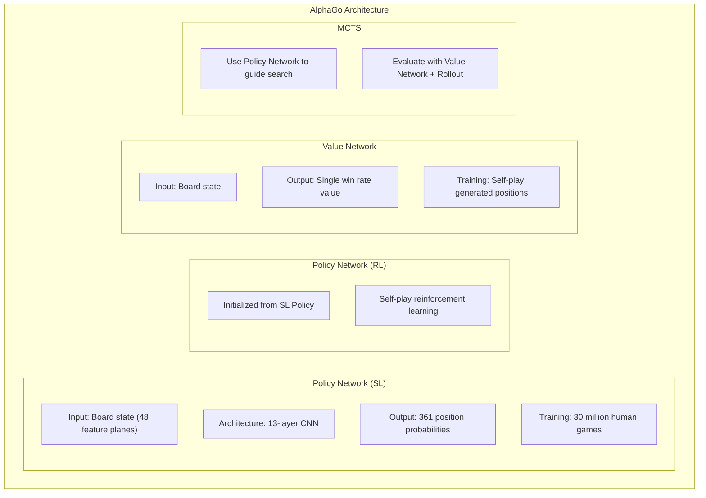
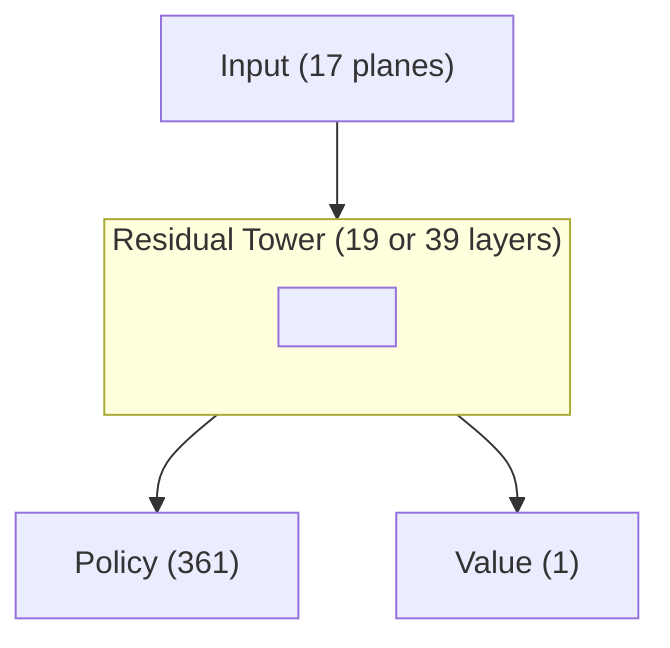
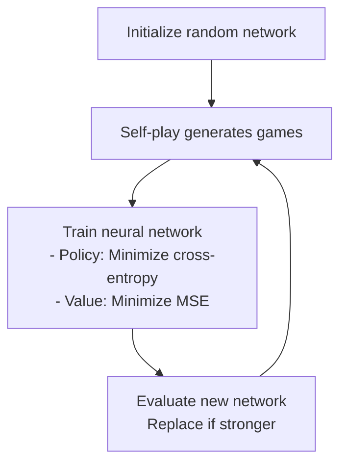

# Key Papers Guide

This article summarizes the most important papers in Go AI development history, providing quick summaries and technical highlights.

---

## Papers Overview

### Timeline

```
2006  Coulom - MCTS first applied to Go
2016  Silver et al. - AlphaGo (Nature)
2017  Silver et al. - AlphaGo Zero (Nature)
2017  Silver et al. - AlphaZero
2019  Wu - KataGo
2020+ Various improvements and applications
```

### Reading Recommendations

| Goal | Recommended Paper |
|------|-------------------|
| Understand basics | AlphaGo (2016) |
| Understand self-play | AlphaGo Zero (2017) |
| Understand general methods | AlphaZero (2017) |
| Implementation reference | KataGo (2019) |

---

## 1. Birth of MCTS (2006)

### Paper Information

```
Title: Efficient Selectivity and Backup Operators in Monte-Carlo Tree Search
Author: Remi Coulom
Published: Computers and Games 2006
```

### Core Contribution

First systematic application of Monte Carlo methods to Go:

```
Before: Pure random simulation, no tree structure
After: Build search tree + UCB selection + backpropagation
```

### Key Concepts

#### UCB1 Formula

```
Selection score = Average win rate + C × √(ln(N) / n)

Where:
- N: Parent visit count
- n: Child visit count
- C: Exploration constant
```

#### MCTS Four Steps

```
1. Selection: Use UCB to select node
2. Expansion: Expand new node
3. Simulation: Random playout to end
4. Backpropagation: Propagate win/loss
```

### Impact

- Go AI reached amateur dan level
- Became foundation for all subsequent Go AI
- UCB concept influenced PUCT development

---

## 2. AlphaGo (2016)

### Paper Information

```
Title: Mastering the game of Go with deep neural networks and tree search
Authors: Silver, D., Huang, A., Maddison, C.J., et al.
Published: Nature, 2016
DOI: 10.1038/nature16961
```

### Core Contribution

**First combination of deep learning and MCTS**, defeating human world champion.

### System Architecture



### Technical Highlights

#### 1. Supervised Learning Policy Network

```python
# Input features (48 planes)
- Own stone positions
- Opponent stone positions
- Liberty counts
- Post-capture state
- Legal move positions
- Recent move positions
...
```

#### 2. Reinforcement Learning Improvement

```
SL Policy → Self-play → RL Policy

RL Policy beats SL Policy with ~80% win rate
```

#### 3. Value Network Training

```
Key to prevent overfitting:
- Take only one position per game
- Avoid similar positions repeating
```

#### 4. MCTS Integration

```
Leaf evaluation = 0.5 × Value Network + 0.5 × Rollout

Rollout uses fast Policy Network (lower accuracy but faster)
```

### Key Numbers

| Item | Value |
|------|-------|
| SL Policy accuracy | 57% |
| RL Policy vs SL Policy win rate | 80% |
| Training GPUs | 176 |
| Playing TPUs | 48 |

---

## 3. AlphaGo Zero (2017)

### Paper Information

```
Title: Mastering the game of Go without human knowledge
Authors: Silver, D., Schrittwieser, J., Simonyan, K., et al.
Published: Nature, 2017
DOI: 10.1038/nature24270
```

### Core Contribution

**No human games needed**, learning from scratch through self-play.

### Differences from AlphaGo

| Aspect | AlphaGo | AlphaGo Zero |
|--------|---------|--------------|
| Human games | Required | **Not required** |
| Network count | 4 | **1 dual-head** |
| Input features | 48 planes | **17 planes** |
| Rollout | Used | **Not used** |
| Residual network | No | **Yes** |
| Training time | Months | **3 days** |

### Key Innovations

#### 1. Single Dual-Head Network



#### 2. Simplified Input Features

```python
# Only 17 feature planes needed
features = [
    current_player_stones,      # Own stones
    opponent_stones,            # Opponent stones
    history_1_player,           # History state 1
    history_1_opponent,
    ...                         # History states 2-7
    color_to_play               # Whose turn
]
```

#### 3. Pure Value Network Evaluation

```
No more Rollout
Leaf evaluation = Value Network output

Cleaner, faster
```

#### 4. Training Process



### Learning Curve

```
Training time    Elo
─────────────────────
3 hours          Beginner
24 hours         Surpasses AlphaGo Lee
72 hours         Surpasses AlphaGo Master
```

---

## 4. AlphaZero (2017)

### Paper Information

```
Title: Mastering Chess and Shogi by Self-Play with a General Reinforcement Learning Algorithm
Authors: Silver, D., Hubert, T., Schrittwieser, J., et al.
Published: arXiv:1712.01815 (later published in Science, 2018)
```

### Core Contribution

**Generalization**: Same algorithm applied to Go, Chess, and Shogi.

### General Architecture

```
Input encoding (game-specific) → Residual network (general) → Dual-head output (general)
```

### Cross-Game Adaptation

| Game | Input Planes | Action Space | Training Time |
|------|-------------|--------------|---------------|
| Go | 17 | 362 | 40 days |
| Chess | 119 | 4672 | 9 hours |
| Shogi | 362 | 11259 | 12 hours |

### MCTS Improvements

#### PUCT Formula

```
Selection score = Q(s,a) + c(s) × P(s,a) × √N(s) / (1 + N(s,a))

c(s) = log((1 + N(s) + c_base) / c_base) + c_init
```

#### Exploration Noise

```python
# Add Dirichlet noise at root
P(s,a) = (1 - ε) × p_a + ε × η_a

η ~ Dir(α)
α = 0.03 (Go), 0.3 (Chess), 0.15 (Shogi)
```

---

## 5. KataGo (2019)

### Paper Information

```
Title: Accelerating Self-Play Learning in Go
Author: David J. Wu
Published: arXiv:1902.10565
```

### Core Contribution

**50x efficiency improvement**, allowing individual developers to train strong Go AI.

### Key Innovations

#### 1. Auxiliary Training Targets

```
Total loss = Policy Loss + Value Loss +
         Score Loss + Ownership Loss + ...

Auxiliary targets help network converge faster
```

#### 2. Global Features

```python
# Global pooling layer
global_features = global_avg_pool(conv_features)
# Combine with local features
combined = concat(conv_features, broadcast(global_features))
```

#### 3. Playout Cap Randomization

```
Traditional: Fixed N searches each time
KataGo: N sampled from a distribution

Lets network perform well at various search depths
```

#### 4. Progressive Board Sizes

```python
if training_step < 1000000:
    board_size = random.choice([9, 13, 19])
else:
    board_size = 19
```

### Efficiency Comparison

| Metric | AlphaZero | KataGo |
|--------|-----------|--------|
| GPU-days to superhuman | 5000 | **100** |
| Efficiency improvement | Baseline | **50x** |

---

## 6. Extended Papers

### MuZero (2020)

```
Title: Mastering Atari, Go, Chess and Shogi by Planning with a Learned Model
Contribution: Learn environment dynamics model, no game rules needed
```

### EfficientZero (2021)

```
Title: Mastering Atari Games with Limited Data
Contribution: Dramatically improved sample efficiency
```

### Gumbel AlphaZero (2022)

```
Title: Policy Improvement by Planning with Gumbel
Contribution: Improved policy improvement method
```

---

## Paper Reading Suggestions

### Beginner Order

```
1. AlphaGo (2016) - Understand basic architecture
2. AlphaGo Zero (2017) - Understand self-play
3. KataGo (2019) - Understand implementation details
```

### Advanced Order

```
4. AlphaZero (2017) - Generalization
5. MuZero (2020) - Learn world models
6. MCTS original paper - Understand foundations
```

### Reading Tips

1. **Read abstract and conclusion first**: Quickly grasp core contribution
2. **Look at figures**: Understand overall architecture
3. **Read methods section**: Understand technical details
4. **Check appendix**: Find implementation details and hyperparameters

---

## Resource Links

### Paper PDFs

| Paper | Link |
|-------|------|
| AlphaGo | [Nature](https://www.nature.com/articles/nature16961) |
| AlphaGo Zero | [Nature](https://www.nature.com/articles/nature24270) |
| AlphaZero | [Science](https://www.science.org/doi/10.1126/science.aar6404) |
| KataGo | [arXiv](https://arxiv.org/abs/1902.10565) |

### Open Source Implementations

| Project | Link |
|---------|------|
| KataGo | [GitHub](https://github.com/lightvector/KataGo) |
| Leela Zero | [GitHub](https://github.com/leela-zero/leela-zero) |
| MiniGo | [GitHub](https://github.com/tensorflow/minigo) |

---

## Further Reading

- [Neural Network Architecture](../neural-network) — Deep dive into network design
- [MCTS Implementation Details](../mcts-implementation) — Search algorithm implementation
- [KataGo Training Mechanism](../training) — Training process details
