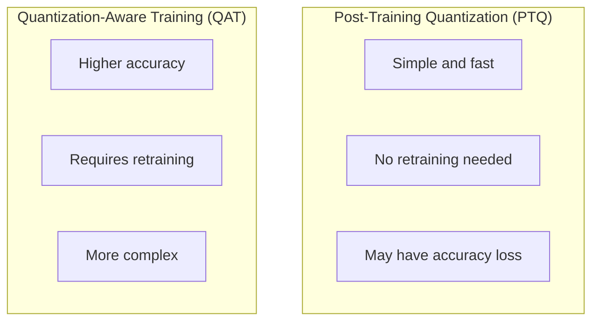

# Model Quantization & Deployment

This article introduces how to quantize KataGo models to reduce resource requirements, and deployment solutions for various platforms.

---

## Quantization Techniques Overview

### Why Quantization?

| Precision | Size | Speed | Accuracy Loss |
|-----------|------|-------|---------------|
| FP32 | 100% | Baseline | 0% |
| FP16 | 50% | +50% | ~0% |
| INT8 | 25% | +100% | \<1% |

### Quantization Types



---

## FP16 Half Precision

### Concept

Convert 32-bit floating point to 16-bit:

```python
# FP32 → FP16 conversion
model_fp16 = model.half()

# Inference
with torch.cuda.amp.autocast():
    output = model_fp16(input.half())
```

### KataGo Settings

```ini
# config.cfg
useFP16 = true           # Enable FP16 inference
useFP16Storage = true    # FP16 intermediate storage
```

### Performance Impact

| GPU Series | FP16 Speedup |
|------------|--------------|
| GTX 10xx | None (no Tensor Core) |
| RTX 20xx | +30-50% |
| RTX 30xx | +50-80% |
| RTX 40xx | +80-100% |

---

## INT8 Quantization

### Quantization Process

```python
import torch.quantization as quant

# 1. Prepare model
model.eval()
model.qconfig = quant.get_default_qconfig('fbgemm')

# 2. Prepare for quantization
model_prepared = quant.prepare(model)

# 3. Calibration (use representative data)
with torch.no_grad():
    for data in calibration_loader:
        model_prepared(data)

# 4. Convert to quantized model
model_quantized = quant.convert(model_prepared)
```

### Calibration Data

```python
def create_calibration_dataset(num_samples=1000):
    """Create calibration dataset"""
    samples = []

    # Sample from actual games
    for game in random_games(num_samples):
        position = random_position(game)
        features = encode_state(position)
        samples.append(features)

    return samples
```

### Notes

- INT8 quantization requires calibration data
- Some layers may not be suitable for quantization
- Need to test accuracy loss

---

## TensorRT Deployment

### Conversion Process

```python
import tensorrt as trt

def convert_to_tensorrt(onnx_path, engine_path):
    logger = trt.Logger(trt.Logger.WARNING)
    builder = trt.Builder(logger)
    network = builder.create_network(
        1 << int(trt.NetworkDefinitionCreationFlag.EXPLICIT_BATCH)
    )
    parser = trt.OnnxParser(network, logger)

    # Parse ONNX model
    with open(onnx_path, 'rb') as f:
        parser.parse(f.read())

    # Set optimization options
    config = builder.create_builder_config()
    config.max_workspace_size = 1 << 30  # 1GB

    # Enable FP16
    config.set_flag(trt.BuilderFlag.FP16)

    # Build engine
    engine = builder.build_engine(network, config)

    # Save
    with open(engine_path, 'wb') as f:
        f.write(engine.serialize())
```

### Using TensorRT Engine

```python
def inference_with_tensorrt(engine_path, input_data):
    # Load engine
    with open(engine_path, 'rb') as f:
        engine = trt.Runtime(logger).deserialize_cuda_engine(f.read())

    context = engine.create_execution_context()

    # Allocate memory
    d_input = cuda.mem_alloc(input_data.nbytes)
    d_output = cuda.mem_alloc(output_size)

    # Copy input
    cuda.memcpy_htod(d_input, input_data)

    # Execute inference
    context.execute_v2([int(d_input), int(d_output)])

    # Get output
    output = np.empty(output_shape, dtype=np.float32)
    cuda.memcpy_dtoh(output, d_output)

    return output
```

---

## ONNX Export

### PyTorch → ONNX

```python
import torch.onnx

def export_to_onnx(model, output_path):
    model.eval()

    # Create sample input
    dummy_input = torch.randn(1, 22, 19, 19)

    # Export
    torch.onnx.export(
        model,
        dummy_input,
        output_path,
        input_names=['input'],
        output_names=['policy', 'value', 'ownership'],
        dynamic_axes={
            'input': {0: 'batch_size'},
            'policy': {0: 'batch_size'},
            'value': {0: 'batch_size'},
            'ownership': {0: 'batch_size'}
        },
        opset_version=13
    )
```

### Validate ONNX Model

```python
import onnx
import onnxruntime as ort

# Validate model structure
model = onnx.load("model.onnx")
onnx.checker.check_model(model)

# Test inference
session = ort.InferenceSession("model.onnx")
output = session.run(None, {'input': input_data})
```

---

## Cross-Platform Deployment

### Server Deployment

```yaml
# docker-compose.yml
version: '3'
services:
  katago:
    image: katago/katago:latest
    deploy:
      resources:
        reservations:
          devices:
            - driver: nvidia
              count: 1
              capabilities: [gpu]
    volumes:
      - ./models:/models
      - ./config:/config
    command: >
      katago analysis
      -model /models/kata-b18c384.bin.gz
      -config /config/analysis.cfg
```

### Desktop Application Integration

```python
# Embed KataGo in Python application
import subprocess
import json

class KataGoProcess:
    def __init__(self, katago_path, model_path):
        self.process = subprocess.Popen(
            [katago_path, 'analysis', '-model', model_path],
            stdin=subprocess.PIPE,
            stdout=subprocess.PIPE,
            text=True
        )

    def analyze(self, moves):
        query = {
            'id': 'query1',
            'moves': moves,
            'rules': 'chinese',
            'komi': 7.5,
            'boardXSize': 19,
            'boardYSize': 19
        }
        self.process.stdin.write(json.dumps(query) + '\n')
        self.process.stdin.flush()

        response = self.process.stdout.readline()
        return json.loads(response)
```

### Mobile Deployment

#### iOS (Core ML)

```python
import coremltools as ct

# Convert to Core ML
mlmodel = ct.convert(
    model,
    inputs=[ct.TensorType(shape=(1, 22, 19, 19))],
    minimum_deployment_target=ct.target.iOS15
)

mlmodel.save("KataGo.mlmodel")
```

#### Android (TensorFlow Lite)

```python
import tensorflow as tf

# Convert to TFLite
converter = tf.lite.TFLiteConverter.from_saved_model(model_path)
converter.optimizations = [tf.lite.Optimize.DEFAULT]
converter.target_spec.supported_types = [tf.float16]

tflite_model = converter.convert()

with open('katago.tflite', 'wb') as f:
    f.write(tflite_model)
```

### Embedded Systems

#### Raspberry Pi

```bash
# Use Eigen backend (CPU only)
./katago gtp -model kata-b10c128.bin.gz -config rpi.cfg
```

```ini
# rpi.cfg - Raspberry Pi optimized settings
numSearchThreads = 4
maxVisits = 100
nnMaxBatchSize = 1
```

#### NVIDIA Jetson

```bash
# Use CUDA backend
./katago gtp -model kata-b18c384.bin.gz -config jetson.cfg
```

---

## Performance Comparison

### Performance by Deployment Method

| Deployment | Hardware | Playouts/sec |
|------------|----------|--------------|
| CUDA FP32 | RTX 3080 | ~3000 |
| CUDA FP16 | RTX 3080 | ~5000 |
| TensorRT FP16 | RTX 3080 | ~6500 |
| OpenCL | M1 Pro | ~1500 |
| Core ML | M1 Pro | ~1800 |
| TFLite | Pixel 7 | ~50 |
| Eigen | RPi 4 | ~15 |

### Model Size Comparison

| Format | b18c384 Size |
|--------|--------------|
| Original (.bin.gz) | ~140 MB |
| ONNX FP32 | ~280 MB |
| ONNX FP16 | ~140 MB |
| TensorRT FP16 | ~100 MB |
| TFLite FP16 | ~140 MB |

---

## Deployment Checklist

- [ ] Select appropriate quantization precision
- [ ] Prepare calibration data (INT8)
- [ ] Export to target format
- [ ] Validate acceptable accuracy loss
- [ ] Test performance on target platform
- [ ] Optimize memory usage
- [ ] Set up automated deployment pipeline

---

## Further Reading

- [GPU Backend & Optimization](../gpu-optimization) — Basic performance optimization
- [Evaluation & Benchmarking](../evaluation) — Verify post-deployment performance
- [Integrate into Your Project](../../hands-on/integration) — API integration examples
