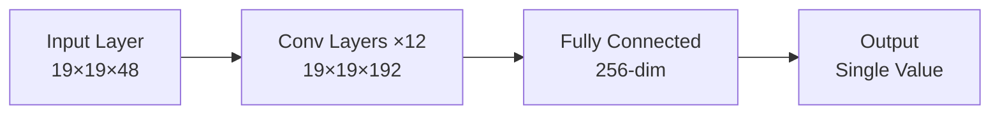
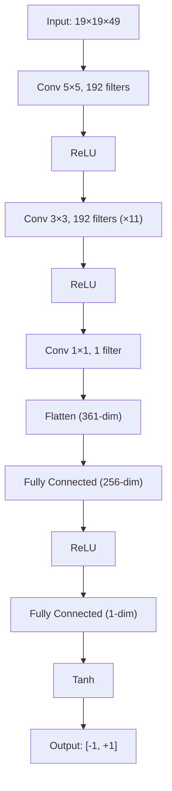
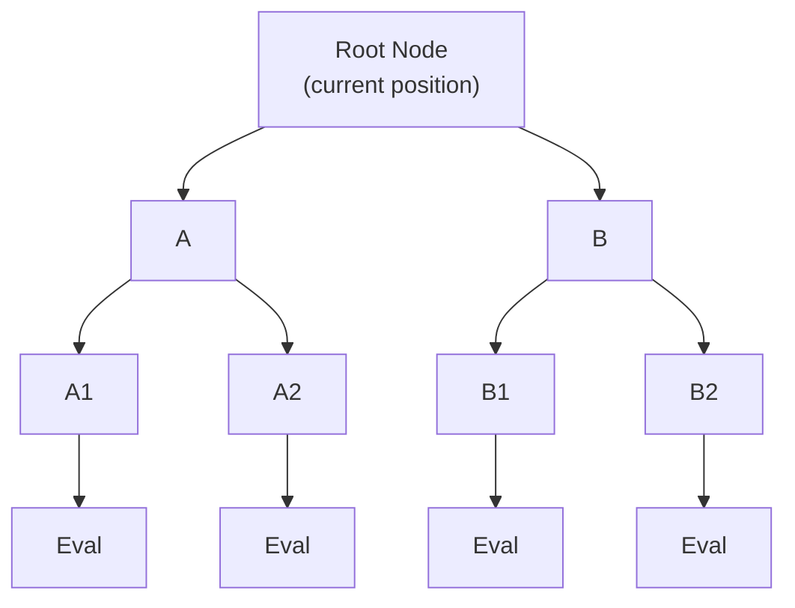
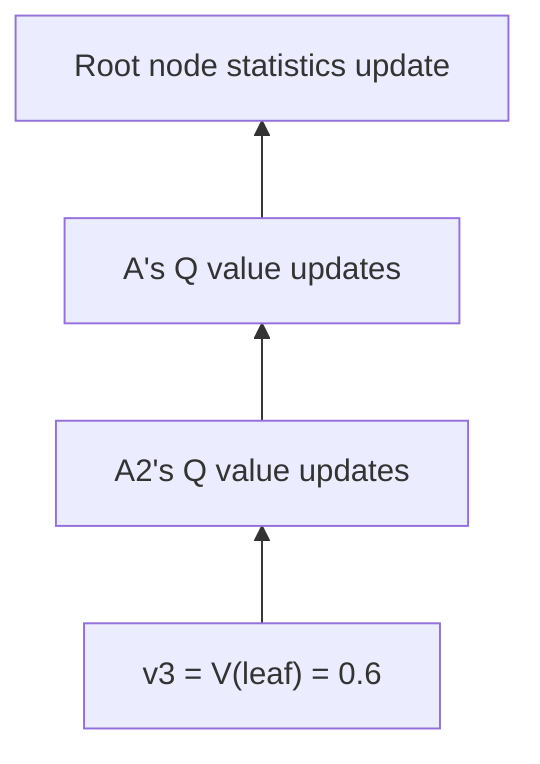
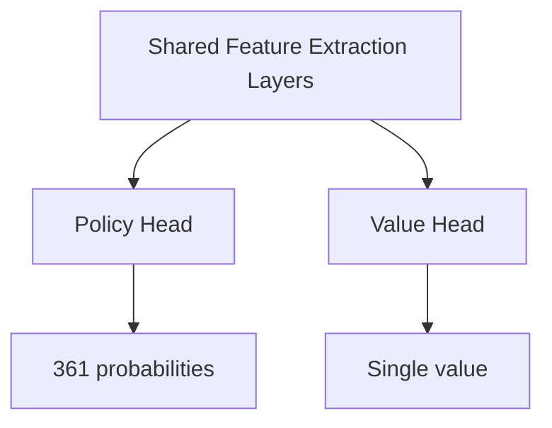

# Value Network Explained

If the Policy Network tells AlphaGo "where to play next," the Value Network answers a more fundamental question:

> **"Will I win this game?"**

---

## What is the Value Network?

### Core Function

The Value Network is a deep convolutional neural network whose task is:

> **Given the current board state, predict the final win probability**

Mathematically expressed:

```
v = f_θ(s)
```

Where:
- `s`: Current board state
- `f_θ`: Value Network (θ represents network parameters)
- `v`: A value between -1 and +1

### Output Interpretation

| Output Value | Meaning |
|--------------|---------|
| +1 | Current player wins for certain |
| +0.5 | Current player has ~75% win rate |
| 0 | Equal chances for both sides |
| -0.5 | Current player has ~25% win rate |
| -1 | Current player loses for certain |

### Why a Single Value?

#### Comparing Different Options

When playing Go, we often need to choose among multiple options. The Value Network makes this comparison simple:

```
Option A position value: 0.3
Option B position value: 0.5
Option C position value: 0.2

→ Choose B (highest value)
```

Without a single value, how would we compare "capturing an opponent's group" versus "surrounding a large territory"?

#### Replacing Extensive Simulations

In traditional Monte Carlo Tree Search, evaluating a position requires **random rollouts**:

1. Start from current position
2. Both sides play randomly until game ends
3. Record win/loss
4. Repeat thousands of times, calculate win rate

This is very slow. The Value Network can provide an evaluation with **a single forward pass**, orders of magnitude faster.

| Method | Evaluation Time | Accuracy |
|--------|-----------------|----------|
| 1000 random rollouts | ~2000 ms | Lower |
| 15000 random rollouts | ~30000 ms | Medium |
| Value Network | ~3 ms | High (equivalent to 15000 rollouts) |

---

## Network Architecture

### Similarity to Policy Network

The Value Network architecture is very similar to the Policy Network, both being deep convolutional neural networks:



### Input Layer

Same as Policy Network, input is a **19×19×49** feature tensor:

- **19×19**: Board size
- **49**: 48 feature planes + 1 plane indicating whose turn

The extra plane is important: Value Network needs to know whose turn it is, since the same position has opposite values for Black and White.

### Convolutional Layers

Same as Policy Network:
- **12 convolutional layers**
- **192 filters**
- **3×3 kernels** (first layer 5×5)
- **ReLU activation function**

### Output Layer Differences

This is the key difference between Value Network and Policy Network:

#### Policy Network Output
```
19×19×192 → 1×1 conv → 19×19×1 → Flatten → 361-dim → Softmax → Probability distribution
```

#### Value Network Output
```
19×19×192 → 1×1 conv → 19×19×1 → Flatten → 361-dim → FC 256 → ReLU → FC 1 → Tanh → Single value
```

### Tanh Activation Function

The Value Network's final layer uses **Tanh** (hyperbolic tangent) function:

```
Tanh(x) = (e^x - e^(-x)) / (e^x + e^(-x))
```

Tanh's output range is **(-1, +1)**, exactly corresponding to win/loss.

#### Why Tanh Instead of Sigmoid?

Sigmoid's output range is (0, 1), which could also represent win rate. But Tanh has several advantages:

1. **Symmetry**: Centered at 0, output can be positive or negative
2. **Better gradients**: Gradient is close to 1 near 0
3. **Clear semantics**: Positive means win, negative means loss, zero is draw

### Complete Architecture Diagram



### Parameter Count

| Layer | Calculation | Parameter Count |
|-------|-------------|-----------------|
| Conv Layers | Same as Policy Network | ~3.9M |
| FC Layer 1 | 361×256 + 256 | 92,672 |
| FC Layer 2 | 256×1 + 1 | 257 |
| **Total** | | **~4.0M** |

About 4 million parameters, slightly more than Policy Network.

---

## Training Challenges

### Overfitting Problem

Training the Value Network is much harder than the Policy Network. The main issue is **overfitting**.

#### What is Overfitting?

Overfitting means the model "memorizes" the training data rather than learning to generalize. Symptoms include:
- Great performance on training set
- Poor performance on test set

#### Why is Value Network Prone to Overfitting?

Consider data from one game:

```
Position 1 → Position 2 → Position 3 → ... → Position 200 → Result: Black wins
```

If we train directly with this data:
- These 200 positions are highly correlated
- They come from the same game, with the same outcome
- The model might learn to "recognize" this game rather than understand positions

DeepMind discovered: if you train Policy and Value Networks with the same human game records, the Value Network severely overfits.

### Solution: Self-Play Data

DeepMind's solution was to generate new training data through **self-play**:

```
1. Use trained RL Policy Network for self-play
2. Take only one position from each game (avoiding correlation)
3. Label this position with the game's final result
4. Generate 30 million such samples
```

#### Why Does This Solve Overfitting?

1. **Large data volume**: 30 million independent positions
2. **No correlation**: Only one position per game
3. **Different distribution**: Self-play positions differ from human games

### Training Data Generation

```python
# Pseudocode
training_data = []

for game_id in range(30_000_000):
    # Self-play one game
    states, result = self_play(rl_policy_network)

    # Randomly select one position
    random_index = random.randint(0, len(states) - 1)
    state = states[random_index]

    # Record position and result
    training_data.append((state, result))
```

---

## Training Objective and Method

### Mean Squared Error Loss

The Value Network uses **Mean Squared Error (MSE)** as the loss function:

```
L(θ) = (1/n) × Σ (v_θ(s) - z)²
```

Where:
- `v_θ(s)`: Model's predicted value
- `z`: Actual result (+1 or -1)

#### Why MSE Instead of Cross-Entropy?

- **Cross-entropy** is suitable for classification problems (discrete labels)
- **MSE** is suitable for regression problems (continuous values)

Although results are only +1 or -1, the model predicts continuous values (any number between -1 and +1). MSE trains the model to predict values close to +1 or -1.

### Training Process

```python
# Pseudocode
for epoch in range(num_epochs):
    for batch in dataloader:
        states, outcomes = batch

        # Forward pass
        values = network(states)  # (batch, 1)

        # Calculate loss (MSE)
        loss = mse_loss(values, outcomes)

        # Backward pass
        loss.backward()
        optimizer.step()
```

Training details:
- **Optimizer**: SGD with momentum
- **Learning rate**: 0.003
- **Batch size**: 32
- **Training time**: About 1 week (50 GPUs)

---

## Accuracy Analysis

### Comparison with Random Rollouts

DeepMind conducted detailed comparisons in their paper:

| Evaluation Method | Prediction Error |
|-------------------|------------------|
| 1000 random rollouts | Higher |
| 15000 random rollouts | Medium |
| Value Network | Comparable to 15000 rollouts |

This means one Value Network evaluation ≈ 15000 random rollouts, but ~1000× faster.

### Accuracy at Different Stages

Value Network accuracy depends on game progress:

| Stage | Remaining Moves | Prediction Difficulty | Accuracy |
|-------|-----------------|----------------------|----------|
| Opening | ~300 | Very hard | Lower |
| Middlegame | ~150 | Difficult | Medium |
| Endgame | ~50 | Easier | Higher |
| Final | ~10 | Simple | Very high |

This is intuitively reasonable: the closer to game end, the more certain the outcome.

### Output Distribution

A well-trained Value Network's output distribution:

```
        Frequency
          |
          |    *
          |   * *
          |  *   *
          | *     *
          |*       *
          +----+----+---- Output Value
         -1    0   +1

Most outputs concentrated near -1 and +1
(because most positions have clear win/loss tendency)
```

### Uncertain Positions

When Value Network output is close to 0, it indicates a very complex position where the outcome is uncertain. These positions are typically:
- In the middle of large battles
- Both sides evenly matched
- Multiple possible variations exist

In MCTS, these nodes receive more search resources (due to high uncertainty).

---

## Role in MCTS

### Leaf Node Evaluation

The Value Network plays a critical role in MCTS's **Evaluation** phase:



When MCTS reaches a leaf node, it needs to evaluate this position's value. Two methods:

1. **Random Rollout**: Play randomly from leaf node to game end
2. **Value Network Evaluation**: Directly predict with neural network

AlphaGo combines both:

```
V(leaf) = (1-λ) × V_network(leaf) + λ × V_rollout(leaf)
```

Where λ = 0.5, meaning equal weight for both.

#### Why Combine Them?

- **Value Network** is more accurate but may have systematic bias
- **Random rollouts** are less accurate but provide independent estimates
- Combining both complements each other

### AlphaGo Zero's Simplification

Later, AlphaGo Zero completely removed random rollouts:

```
V(leaf) = V_network(leaf)
```

This greatly simplified the system while achieving stronger play. This proved the Value Network is reliable enough without the "insurance" of random rollouts.

### Backpropagation Updates

After evaluating a leaf node, this value propagates back along the path:



Each node maintains a Q value that is the average of all leaf evaluations passing through it:

```
Q(s, a) = (1/N(s,a)) × Σ V(leaf)
```

---

## Visual Analysis

### Value Surface

Imagine a simplified 3×3 board. What the Value Network learns is a "value surface":

```
        White position
       1   2   3
    ┌───┬───┬───┐
  1 │+0.3│-0.1│+0.2│
Black├───┼───┼───┤
pos.  2 │-0.2│+0.5│-0.3│
    ├───┼───┼───┤
    3 │+0.1│-0.2│+0.4│
    └───┴───┴───┘
```

This surface tells us the value of each position combination. Positive values favor Black, negative values favor White.

### Evolution During Training

As training progresses, Value Network predictions become more accurate:

```
       Prediction Error
          |
     1.0  |*
          | *
     0.5  |  *
          |   *
     0.1  |    * * * * *
          +─────────────── Training Steps
          0   100K  500K  1M
```

Error drops rapidly then stabilizes.

### Identifying Difficult Positions

Value Network can help identify difficult positions:

| Output | Meaning | Strategy |
|--------|---------|----------|
| Near +1 | Big advantage | Play conservatively |
| Near -1 | Big disadvantage | Look for comeback opportunities |
| Near 0 | Complex position | Need deep calculation |

AlphaGo invests more thinking time in positions near 0.

---

## Implementation Notes

### PyTorch Implementation

```python
import torch
import torch.nn as nn
import torch.nn.functional as F

class ValueNetwork(nn.Module):
    def __init__(self, input_channels=49, num_filters=192, num_layers=12):
        super().__init__()

        # First convolutional layer (5×5)
        self.conv1 = nn.Conv2d(input_channels, num_filters,
                               kernel_size=5, padding=2)

        # Middle convolutional layers (3×3)×11
        self.conv_layers = nn.ModuleList([
            nn.Conv2d(num_filters, num_filters,
                     kernel_size=3, padding=1)
            for _ in range(num_layers - 1)
        ])

        # Output convolutional layer
        self.conv_out = nn.Conv2d(num_filters, 1, kernel_size=1)

        # Fully connected layers
        self.fc1 = nn.Linear(361, 256)
        self.fc2 = nn.Linear(256, 1)

    def forward(self, x):
        # x: (batch, 49, 19, 19)

        # Convolutional layers
        x = F.relu(self.conv1(x))
        for conv in self.conv_layers:
            x = F.relu(conv(x))
        x = self.conv_out(x)

        # Flatten
        x = x.view(x.size(0), -1)  # (batch, 361)

        # Fully connected layers
        x = F.relu(self.fc1(x))
        x = torch.tanh(self.fc2(x))

        return x.squeeze(-1)  # (batch,)
```

### Training Loop

```python
def train_value_network(model, optimizer, states, outcomes):
    """
    states: (batch, 49, 19, 19) - Board features
    outcomes: (batch,) - Game results (+1 or -1)
    """
    # Forward pass
    values = model(states)  # (batch,)

    # MSE loss
    loss = F.mse_loss(values, outcomes)

    # Backward pass
    optimizer.zero_grad()
    loss.backward()
    optimizer.step()

    # Calculate accuracy (correct win/loss prediction)
    predictions = (values > 0).float() * 2 - 1  # Convert to +1/-1
    accuracy = (predictions == outcomes).float().mean()

    return loss.item(), accuracy.item()
```

### Tips to Avoid Overfitting

```python
# 1. Data augmentation (8-fold symmetry)
def augment(state, outcome):
    augmented = []
    for rotation in [0, 90, 180, 270]:
        s = rotate(state, rotation)
        augmented.append((s, outcome))
        augmented.append((flip(s), outcome))
    return augmented

# 2. Dropout
class ValueNetworkWithDropout(ValueNetwork):
    def __init__(self, *args, dropout_rate=0.5, **kwargs):
        super().__init__(*args, **kwargs)
        self.dropout = nn.Dropout(dropout_rate)

    def forward(self, x):
        # ... conv layers ...
        x = self.dropout(x)  # Dropout before FC layers
        # ... FC layers ...

# 3. Early Stopping
best_val_loss = float('inf')
patience = 10
counter = 0

for epoch in range(max_epochs):
    train_loss = train_one_epoch()
    val_loss = evaluate()

    if val_loss < best_val_loss:
        best_val_loss = val_loss
        save_model()
        counter = 0
    else:
        counter += 1
        if counter >= patience:
            print("Early stopping!")
            break
```

---

## Collaboration with Policy Network

### Complementary Relationship

Policy Network and Value Network complement each other in AlphaGo:

| Network | Question Answered | Output | MCTS Role |
|---------|-------------------|--------|-----------|
| Policy | Where to play next? | Probability distribution | Guide search direction |
| Value | Will I win? | Single value | Evaluate leaf nodes |

### Unified Dual-Head Network

In AlphaGo Zero, these two networks were merged into a **dual-head network**:



Advantages of this design:
- **Parameter sharing**: Reduces computation
- **Feature sharing**: Policy and Value use same features
- **More stable training**: Two objectives regularize each other

See [Dual-Head Network and Residual Network](../dual-head-resnet) for details.

---

## Animation Reference

Core concepts covered in this article with animation numbers:

| Number | Concept | Physics/Math Correspondence |
|--------|---------|----------------------------|
| Animation E2 | Value Network | Potential energy surface |
| Animation D4 | Value function | Expected return |
| Animation C6 | Leaf node evaluation | Function approximation |
| Animation H3 | Temporal difference | Bootstrap learning |

---

## Further Reading

- **Previous**: [Policy Network Explained](../policy-network) - How the policy network selects moves
- **Next**: [Input Feature Design](../input-features) - 48 feature planes explained
- **Advanced Topic**: [MCTS and Neural Network Integration](../mcts-neural-combo) - Complete search process

---

## Key Takeaways

1. **Value Network predicts win rate**: Outputs a single value between -1 and +1
2. **Tanh output**: Ensures output is in the correct range
3. **MSE loss**: Drives predictions toward actual outcomes
4. **Overfitting challenge**: Requires self-play data to avoid
5. **Replaces random rollouts**: One evaluation ≈ 15000 rollouts

The Value Network is AlphaGo's "judgment" - it lets the AI evaluate any position's quality without exhaustively exploring all possibilities.

---

## References

1. Silver, D., et al. (2016). "Mastering the game of Go with deep neural networks and tree search." *Nature*, 529, 484-489.
2. Silver, D., et al. (2017). "Mastering the game of Go without human knowledge." *Nature*, 551, 354-359.
3. Sutton, R. S., & Barto, A. G. (2018). *Reinforcement Learning: An Introduction*. MIT Press.
4. Tesauro, G. (1995). "Temporal difference learning and TD-Gammon." *Communications of the ACM*, 38(3), 58-68.
