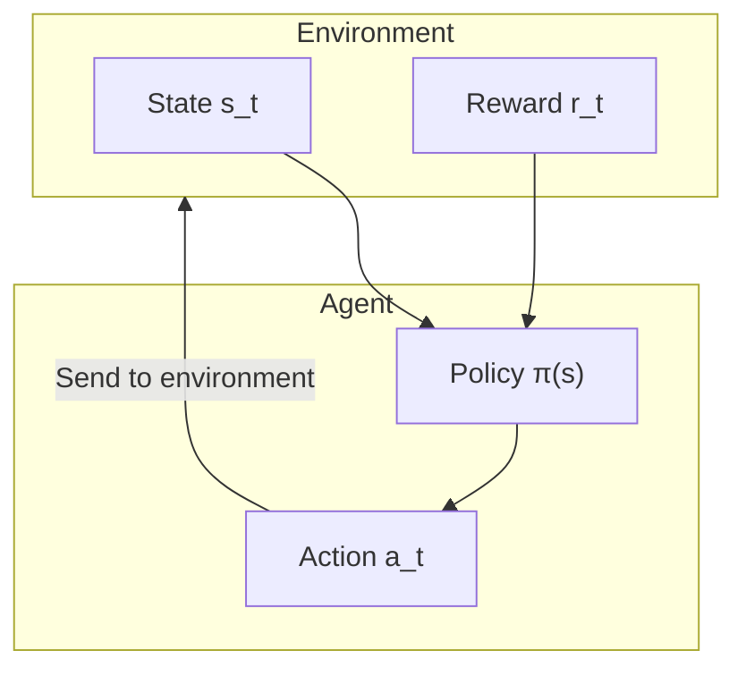

# Introduction to Reinforcement Learning

In the previous articles, we introduced how AlphaGo uses supervised learning to learn from human game records. But supervised learning has a fundamental limitation: **it can only imitate humans, not surpass them**.

To enable AI to surpass humans, we need a different learning method—**Reinforcement Learning (RL)**.

This article will guide you through understanding the core concepts of reinforcement learning from scratch, laying the foundation for self-play and MCTS integration.

---

## What is Reinforcement Learning?

### Comparison with Other Learning Methods

Machine learning has three main paradigms:

| Paradigm | Learning Method | Examples |
|----------|-----------------|----------|
| **Supervised Learning** | Learn from labeled data | Image classification, next move prediction |
| **Unsupervised Learning** | Discover structure from unlabeled data | Clustering, dimensionality reduction |
| **Reinforcement Learning** | Learn from interaction experience | Playing games, robot control |

The uniqueness of reinforcement learning lies in: **no one tells you what the correct answer is; you must discover it yourself through trial and error**.

### An Intuitive Example

Imagine you're teaching a dog a new trick:

1. The dog performs some action (possibly random)
2. If the action is correct, you give it a treat (positive reward)
3. If the action is wrong, you don't give a treat or say "no" softly (negative or zero reward)
4. After many attempts, the dog learns which actions bring rewards

This is the essence of reinforcement learning: **learning how to act through reward signals**.

### Reinforcement Learning in Go

In Go:
- Each move is an "action"
- At the end of the game, the win/loss is the "reward"
- The AI needs to learn: which moves ultimately lead to victory?

But there's a huge challenge here: **delayed reward**. A game may last over 200 moves, but you only know the outcome at the end. When you play a move at move 50, how do you know how much it contributed to the final result?

This is one of the core problems in reinforcement learning, called the **Credit Assignment Problem**.

---

## Core Concepts

### Agent and Environment

The basic architecture of reinforcement learning includes two main characters:



**Agent**:
- The entity that makes decisions
- In Go, it's the AI that plays
- Has a "policy" that determines what action to take in what state

**Environment**:
- The object the Agent interacts with
- In Go, it's the board + opponent
- Receives the Agent's action, returns new state and reward

### State

**State s** is a complete description of the environment. In Go:
- State includes: current board position, whose turn it is, ko status, etc.
- The state space is extremely large: approximately $10^{170}$ possible states

The state must have the **Markov property**: the future depends only on the current state, not on the history.

### Action

**Action a** is the behavior the Agent can take. In Go:
- Each empty point is a possible action
- Plus "pass," there are $19 \times 19 + 1 = 362$ actions
- But many positions are actually illegal (such as suicide, ko violations)

### Reward

**Reward r** is the environment's feedback on actions. In Go:
- Win: $+1$
- Loss: $-1$
- During the game: $0$ (this is the most challenging part!)

The sparsity of reward signals is one of the main difficulties in reinforcement learning for Go.

### Policy

**Policy π** is the Agent's behavioral guideline, telling it what to do in each state.

A policy can be:
- **Deterministic policy**: $a = \pi(s)$, each state corresponds to a unique action
- **Stochastic policy**: $a \sim \pi(a|s)$, gives a probability distribution over actions

In AlphaGo, the Policy Network is a stochastic policy that outputs the probability of playing at each position.

---

## Markov Decision Process (MDP)

### Definition of MDP

**Markov Decision Process (MDP)** is the mathematical framework for reinforcement learning.

An MDP is defined by a five-tuple $(S, A, P, R, \gamma)$:

| Symbol | Meaning | Correspondence in Go |
|--------|---------|---------------------|
| $S$ | State space | All possible board positions |
| $A$ | Action space | All legal move positions |
| $P(s'|s,a)$ | Transition probability | Board change after the next move |
| $R(s,a,s')$ | Reward function | Win/loss outcome |
| $\gamma$ | Discount factor | Importance of future rewards |

### Markov Property

The core assumption of MDP is the **Markov Property**:

$$P(s_{t+1}|s_t, a_t, s_{t-1}, a_{t-1}, \ldots, s_0) = P(s_{t+1}|s_t, a_t)$$

In plain terms: **the future depends only on the present, not on the past**.

Does Go satisfy this property?

On the surface, yes—as long as you know the current board state, you know all legal moves. But actually, Go has the **ko rule**, which requires remembering the previous state. AlphaGo handles this by encoding the previous 8 board states into input features.

### Go is a Deterministic MDP

Go has a special property: **transitions are deterministic**.

In board games, when you make a move, the board state change is completely deterministic (unlike dice games with randomness). So:

$$P(s'|s,a) = \begin{cases} 1 & \text{if } s' \text{ is the state after executing } a \\ 0 & \text{otherwise} \end{cases}$$

But don't forget, Go is a **two-player game**, and the opponent's moves bring "uncertainty." This makes the problem an **adversarial MDP**.

### Reward Design

The design of the reward function is crucial for reinforcement learning. In Go, the most natural design is:

$$R(s_T) = \begin{cases} +1 & \text{if AI wins} \\ -1 & \text{if AI loses} \end{cases}$$

Where $T$ is the time step when the game ends.

This **sparse reward** brings huge challenges:
- A game may have 200-300 moves
- Only the last move reveals the outcome
- How do you judge whether an intermediate move is good or bad?

Some research attempts to design **dense rewards**, such as:
- Capture rewards
- Territory estimation rewards
- Position evaluation rewards

But AlphaGo's success shows that: **even using only the final win/loss as reward, through sufficient self-play, AI can learn sophisticated mid-game tactics**.

---

## Value Functions

### Why Do We Need Value Functions?

The goal of reinforcement learning is to maximize **cumulative reward**. But rewards are delayed, so we need a way to evaluate "how good the current state is."

This is the purpose of **Value Functions**.

### State Value Function V(s)

The **State Value Function** $V^\pi(s)$ is defined as: starting from state $s$, following policy $\pi$, the expected cumulative reward.

$$V^\pi(s) = \mathbb{E}_\pi \left[ \sum_{t=0}^{\infty} \gamma^t r_{t+1} \mid s_0 = s \right]$$

Where:
- $\mathbb{E}_\pi$ represents the expected value under policy $\pi$
- $\gamma \in [0, 1]$ is the **discount factor**, making near-term rewards more important than long-term rewards
- $r_{t+1}$ is the reward obtained at time step $t+1$

In Go, $V(s)$ can be interpreted as: **the probability of AI winning from the current position**. AlphaGo's Value Network learns this function.

### Action Value Function Q(s,a)

The **Action Value Function** $Q^\pi(s,a)$ goes further, evaluating the value of taking action $a$ in state $s$:

$$Q^\pi(s,a) = \mathbb{E}_\pi \left[ \sum_{t=0}^{\infty} \gamma^t r_{t+1} \mid s_0 = s, a_0 = a \right]$$

$Q(s,a)$ can be interpreted as: **the probability of ultimately winning if you play this move at the current position**.

### Relationship Between V and Q

These two functions have a close relationship:

$$V^\pi(s) = \sum_a \pi(a|s) Q^\pi(s,a)$$

That is, state value = weighted average of all possible actions, weighted by the policy.

If we know the optimal policy $\pi^*$:

$$V^*(s) = \max_a Q^*(s,a)$$

Optimal state value = Q value of the best action.

### Bellman Equation

Value functions satisfy an elegant recursive relationship—the **Bellman Equation**:

$$V^\pi(s) = \sum_a \pi(a|s) \sum_{s'} P(s'|s,a) \left[ R(s,a,s') + \gamma V^\pi(s') \right]$$

In plain terms: **the value of the current state = immediate reward + discounted value of the next state**.

This equation is the theoretical foundation of dynamic programming and many reinforcement learning algorithms.

### AlphaGo's Value Network

In AlphaGo, the Value Network learns $V(s)$—evaluating the win rate of the current position.

```
Input: Board state s (19×19×17 feature tensor)
Output: Win rate estimate V(s) ∈ [-1, 1] (using tanh activation)
```

The Value Network's training objective is to predict the final outcome:

$$L = \mathbb{E} \left[ (V_\theta(s) - z)^2 \right]$$

Where $z \in \{-1, +1\}$ is the actual game outcome.

---

## Policy Gradient Methods

### From Value to Policy

Traditional reinforcement learning methods (such as Q-Learning) are "value-based": first learn the value function, then derive the policy from it.

But in problems like Go with huge action spaces, learning the policy directly may be more effective. This is the idea behind **Policy Gradient** methods.

### Policy Parameterization

We use a neural network to represent the policy:

$$\pi_\theta(a|s)$$

Where $\theta$ are the network parameters. The network takes state $s$ as input and outputs the probability of each action.

In AlphaGo, this is the Policy Network:
- Input: Board state
- Output: Probability of placing a stone at each of 361 positions (plus pass)

### Policy Gradient Theorem

We want to find the optimal parameters $\theta^*$ that maximize expected cumulative reward:

$$J(\theta) = \mathbb{E}_{\pi_\theta} \left[ \sum_t r_t \right]$$

The **Policy Gradient Theorem** tells us how to compute the gradient of $J$ with respect to $\theta$:

$$\nabla_\theta J(\theta) = \mathbb{E}_{\pi_\theta} \left[ \sum_t \nabla_\theta \log \pi_\theta(a_t|s_t) \cdot G_t \right]$$

Where $G_t = \sum_{k=t}^{T} \gamma^{k-t} r_k$ is the cumulative reward starting from time $t$.

### Intuitive Understanding

This formula can be understood as:

1. **$\nabla_\theta \log \pi_\theta(a_t|s_t)$**: How to adjust parameters to increase the probability of action $a_t$
2. **$G_t$**: The total return brought by this action

So:
- If $G_t > 0$ (good outcome), increase this action's probability
- If $G_t < 0$ (bad outcome), decrease this action's probability

This is one solution to **credit assignment**!

### REINFORCE Algorithm

**REINFORCE** is the simplest policy gradient algorithm:

```
Algorithm: REINFORCE

1. Initialize policy network parameters θ

2. Repeat:
   a. Use current policy π_θ to complete a game, collect trajectory:
      τ = (s_0, a_0, r_1, s_1, a_1, r_2, ..., s_T)

   b. Calculate cumulative return for each step:
      G_t = r_{t+1} + γ·r_{t+2} + γ²·r_{t+3} + ...

   c. Calculate policy gradient:
      ∇J = (1/T) Σ_t ∇_θ log π_θ(a_t|s_t) · G_t

   d. Update parameters:
      θ ← θ + α · ∇J
```

In Go, this means:
1. Let the AI play a game by itself
2. If it ultimately wins ($G = +1$), increase the probability of all moves played
3. If it ultimately loses ($G = -1$), decrease the probability of all moves played
4. Repeat this process millions of times

### Baseline

One problem with REINFORCE is **high variance**. Imagine a winning game that may also have some bad moves, but their probabilities would all increase.

The solution is to introduce a **baseline**:

$$\nabla_\theta J = \mathbb{E} \left[ \sum_t \nabla_\theta \log \pi_\theta(a_t|s_t) \cdot (G_t - b(s_t)) \right]$$

A common choice is to let $b(s_t) = V(s_t)$, which is the **Advantage Function**:

$$A(s_t, a_t) = G_t - V(s_t)$$

The advantage function measures: "How much better is this action than average?"

- $A > 0$: This action is better than expected, increase its probability
- $A < 0$: This action is worse than expected, decrease its probability

AlphaGo uses the Value Network to compute the baseline, which is why both the Policy Network and Value Network need to be trained.

---

## Exploration vs. Exploitation

### The Dilemma

Reinforcement learning faces a classic dilemma: **Exploration vs. Exploitation**.

- **Exploitation**: Based on current knowledge, choose the action that looks best
- **Exploration**: Try uncertain actions, possibly discovering better strategies

Pure exploitation gets stuck in local optima; pure exploration wastes time on obviously bad moves.

### Challenges in Go

This problem is particularly severe in Go:

1. **Huge action space**: 361 possible moves
2. **Sparse rewards**: Only know the outcome at the end
3. **Long-term effects**: A move's impact may only become apparent dozens of moves later

### ε-Greedy Strategy

The simplest exploration method:

$$\pi(a|s) = \begin{cases} 1 - \varepsilon + \frac{\varepsilon}{|A|} & \text{if } a = \arg\max Q(s,a) \\ \frac{\varepsilon}{|A|} & \text{otherwise} \end{cases}$$

Choose the best action with probability $1-\varepsilon$, randomly choose with probability $\varepsilon$.

But this is too crude for Go—randomly choosing a position to play is mostly a bad move.

### Softmax Exploration

A better method is using a **softmax distribution**:

$$\pi(a|s) = \frac{\exp(Q(s,a)/\tau)}{\sum_{a'} \exp(Q(s,a')/\tau)}$$

Where $\tau$ is the **temperature parameter**:
- $\tau \to 0$: Approaches greedy policy (pure exploitation)
- $\tau \to \infty$: Approaches uniform random (pure exploration)
- $\tau = 1$: Balances exploration and exploitation

AlphaGo uses similar techniques during self-play training to increase diversity.

### UCB and PUCT

In MCTS, exploration and exploitation are handled by the **UCB (Upper Confidence Bound)** formula. AlphaGo uses its variant **PUCT**:

$$\text{score}(s,a) = Q(s,a) + c_{\text{puct}} \cdot P(s,a) \cdot \frac{\sqrt{N(s)}}{1 + N(s,a)}$$

This formula is explained in detail in [PUCT Formula Explained](../puct-formula).

### Intrinsic Exploration

AlphaGo also has an implicit exploration mechanism: **self-play itself is exploration**.

Since the neural network outputs probability distributions rather than deterministic actions, each self-play game produces different games. This naturally brings:

- **Tactical diversity**: The same position may try different moves
- **Style evolution**: As training progresses, AI may "discover" joseki that humans never tried
- **Self-correction**: If a certain move always loses, its probability gradually decreases

---

## Uniqueness of Go Reinforcement Learning

### Comparison with Other Domains

Go reinforcement learning has some unique characteristics:

| Characteristic | Go | Robot Control | Video Games |
|----------------|-----|---------------|-------------|
| State space | Discrete, extremely large | Continuous | Discrete, medium |
| Action space | Discrete, large | Continuous | Discrete, small |
| Transitions | Deterministic | Stochastic | Deterministic or stochastic |
| Rewards | Extremely sparse | Designable | Medium density |
| Environment model | Known (rules) | Unknown | Partially known |
| Adversarial | Perfect information game | Usually none | Possible |

### Deterministic Transitions

Go's rules are completely known. When you make a move, the next state is deterministic. This means:

- **Exact simulation possible**: No need to learn the environment model
- **Perfect backtracking**: MCTS can search precisely
- **No environment randomness handling needed**: Simplifies many problems

### Perfect Information

Go is a **perfect information game**—both players can see the complete board. Unlike poker (hidden information), this makes the problem simpler in some ways:

- No need to handle opponent's hidden information
- Can use the Minimax framework
- State representation is more straightforward

### Possibility of Self-Play

Because the rules are known and deterministic, AI can **play against itself** without needing a real opponent. This brings:

- **Unlimited training data**: New games can be generated at any time
- **Stable opponent level**: The opponent is itself, same skill level
- **Progressive improvement**: As it gets stronger, the opponent also gets stronger

This is exactly the key to AlphaGo's success, which we'll discuss in detail in the next article [Self-Play](../self-play).

### Long-term Credit Assignment

Go's rewards are extremely sparse (only the final win/loss), and a game may have 200-300 moves. This brings a severe **credit assignment problem**:

How do you correctly assign credit for a good move at move 50 when you win at move 250?

AlphaGo's solution combines multiple techniques:
1. **Value Network**: Evaluates the win rate of intermediate positions, providing immediate feedback
2. **MCTS**: Search to verify the quality of each move
3. **Large-scale play**: Learning credit assignment through statistics

### Symmetry

The Go board has 8-fold symmetry (4 rotations × 2 reflections). AlphaGo uses this for **data augmentation**:

- Each training position can generate 8 variants
- Greatly increases effective training data
- Ensures the network learns symmetry-invariant features

---

## Algorithm Comparison

### Value-Based vs. Policy-Based

| Method | Pros | Cons | Suitable For |
|--------|------|------|--------------|
| **Value-based** (Q-Learning) | High sample efficiency | Difficult with large action spaces | Small action spaces |
| **Policy-based** (REINFORCE) | Can handle large action spaces | High variance, low sample efficiency | Large action spaces |
| **Actor-Critic** | Balances both | Need to train two networks | General applicability |

### AlphaGo's Choice

AlphaGo uses a variant of the **Actor-Critic** architecture:

- **Policy Network** (Actor): Directly outputs action probabilities
- **Value Network** (Critic): Evaluates state value

But it doesn't use traditional Actor-Critic updates. Instead:

1. **Supervised learning**: First learn initial Policy Network from human game records
2. **Policy gradient**: Strengthen Policy Network through self-play
3. **Regression learning**: Train Value Network with self-play data
4. **MCTS integration**: Combine both networks in actual play

This hybrid approach combines the advantages of multiple techniques and is one of the keys to AlphaGo's success.

---

## Implementation Considerations

### Training Stability

Policy gradient methods can sometimes be unstable. Common techniques include:

**Gradient Clipping**:
```python
# Limit the norm of gradients
max_grad_norm = 0.5
torch.nn.utils.clip_grad_norm_(policy_net.parameters(), max_grad_norm)
```

**Learning Rate Decay**:
```python
# Lower learning rate as training progresses
scheduler = torch.optim.lr_scheduler.StepLR(optimizer, step_size=100, gamma=0.9)
```

**Advanced algorithms like PPO/TRPO**:
Limit policy changes per update to prevent catastrophic forgetting.

### Memory Management

Go games are long and require storing many trajectories. Common strategies:

**Experience Replay**:
```python
# Store past experiences
replay_buffer = ReplayBuffer(max_size=1000000)

# Randomly sample for training
batch = replay_buffer.sample(batch_size=256)
```

**Prioritized Experience Replay**:
Prioritize replaying "surprising" experiences (those with large TD errors).

### Parallelization

Reinforcement learning can be highly parallelized:

- **Multi-threaded play**: Run multiple games simultaneously
- **Distributed training**: Multiple machines training simultaneously
- **Asynchronous updates**: A3C and similar algorithms

AlphaGo's training used hundreds of GPUs and TPUs, conducting thousands of self-play games simultaneously.

---

## Animation Mapping

Core concepts in this article and their animation numbers:

| Number | Concept | Physics/Math Correspondence |
|--------|---------|----------------------------|
| Animation H1 | Agent-Environment interaction | Markov chain |
| Animation H4 | Policy gradient | Stochastic optimization |
| Animation H6 | Exploration vs. exploitation | Multi-armed bandit |

---

## Summary

Reinforcement learning is the key technology that enabled AlphaGo to surpass humans. We learned:

1. **Basic framework**: Agent, Environment, State, Action, Reward
2. **MDP**: Markov Decision Process, the mathematical foundation of reinforcement learning
3. **Value functions**: $V(s)$ and $Q(s,a)$, evaluating the quality of states and actions
4. **Policy gradient**: Methods to directly optimize policies, REINFORCE algorithm
5. **Exploration vs. exploitation**: The core trade-off in the learning process
6. **Go characteristics**: Challenges and opportunities of determinism, perfect information, and sparse rewards

In the next article, we'll dive deep into how AlphaGo uses **self-play** to achieve superhuman strength.

---

## Further Reading

- **Next article**: [Self-Play](../self-play) — Why AI can get stronger by playing against itself
- **Related**: [Value Network Explained](../value-network) — Neural network implementation of value functions
- **Advanced**: [PUCT Formula Explained](../puct-formula) — Mathematical formula for exploration and exploitation

---

## References

1. Sutton, R. S., & Barto, A. G. (2018). *Reinforcement Learning: An Introduction* (2nd ed.). MIT Press.
2. Silver, D. (2015). ["Lectures on Reinforcement Learning"](https://www.davidsilver.uk/teaching/). University College London.
3. Schulman, J., et al. (2017). "Proximal Policy Optimization Algorithms." *arXiv preprint*.
4. Williams, R. J. (1992). "Simple statistical gradient-following algorithms for connectionist reinforcement learning." *Machine Learning*, 8(3-4), 229-256.
5. Silver, D., et al. (2016). "Mastering the game of Go with deep neural networks and tree search." *Nature*, 529, 484-489.
