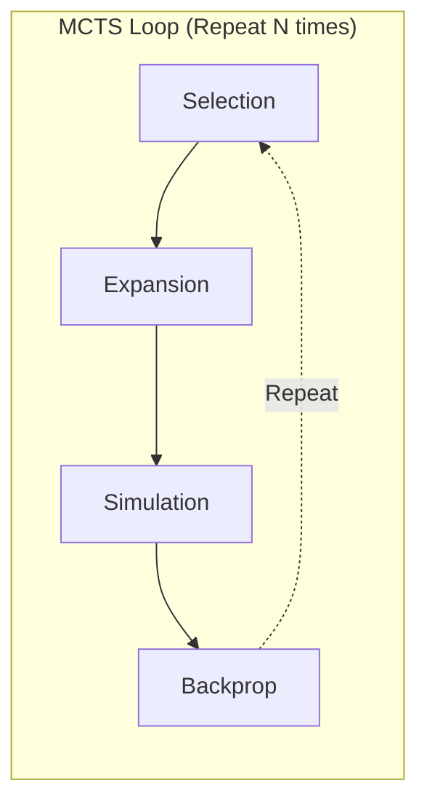
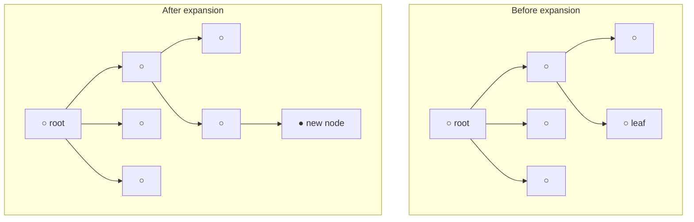
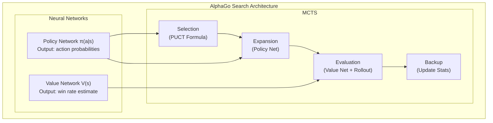
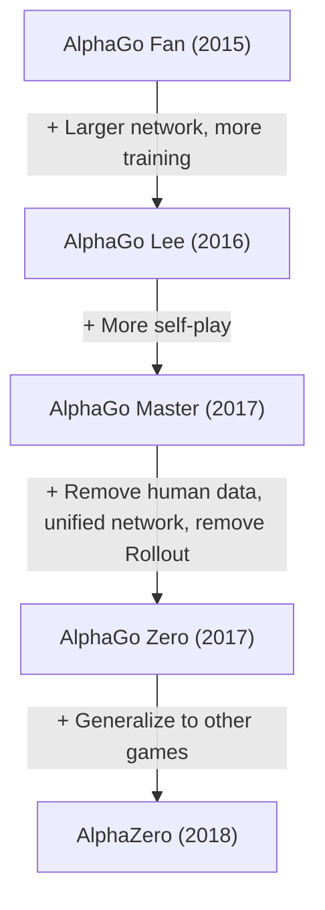

import { MCTSTree } from '@site/src/components/D3Charts';

# MCTS and Neural Network Integration

In previous articles, we separately introduced neural networks (Policy Network and Value Network) and reinforcement learning concepts. Now let's explore AlphaGo's core innovation - **how to perfectly combine Monte Carlo Tree Search (MCTS) with neural networks**.

This combination is key to AlphaGo's success: neural networks provide "intuition," MCTS provides "reasoning," and they complement each other.

---

## Traditional MCTS Review

### What Is MCTS?

**Monte Carlo Tree Search (MCTS)** is a search algorithm based on random sampling, particularly suited for game AI.

MCTS's core idea: **Instead of exhaustively searching all possible moves, randomly simulate many games and use statistics to estimate each move's quality.**

### Four Phases

Traditional MCTS contains four phases, repeated continuously:



Let's understand each phase in detail:

### 1. Selection

Starting from root node, traverse down the tree, selecting the "most promising" child node until reaching a leaf node.

Selection criterion is the **UCB1 (Upper Confidence Bound)** formula:

$$\text{UCB1}(s, a) = \bar{X}_{s,a} + c \sqrt{\frac{\ln N_s}{N_{s,a}}}$$

Where:
- $\bar{X}_{s,a}$: Average return from node $(s, a)$ (**exploitation term**)
- $\sqrt{\frac{\ln N_s}{N_{s,a}}}$: Exploration bonus (**exploration term**)
- $N_s$: Parent node visit count
- $N_{s,a}$: Child node visit count
- $c$: Constant balancing exploration and exploitation

This formula's wisdom:
- Less-visited nodes get higher exploration bonus
- As visit count increases, selection increasingly favors nodes with truly high value

### 2. Expansion

After reaching leaf node, select an unexplored action and create a new child node.



### 3. Simulation (Rollout)

From new node, use some strategy (usually random or simple heuristic) to quickly complete the game, getting the result.

This is why it's called "Monte Carlo" - **using random simulation to estimate results**.

Traditional MCTS rollout strategies might be:
- **Pure random**: Uniformly random select legal moves
- **Lightweight heuristic**: Filter obviously bad moves with simple rules

### 4. Backpropagation

Propagate simulation result (win/loss) back along the path, updating each node's statistics:

```
Update contents:
- Visit count: N(s, a) ← N(s, a) + 1
- Cumulative value: W(s, a) ← W(s, a) + z
- Average value: Q(s, a) = W(s, a) / N(s, a)
```

Where $z$ is simulation result (+1 or -1).

### Limitations of Traditional MCTS

Traditional MCTS had limited performance in Go, main problems being:

1. **Poor rollout quality**: Random simulations often produce unreasonable games
2. **Needs many simulations**: May need tens of thousands per move
3. **Inaccurate evaluation**: Relying purely on win/loss statistics has low information efficiency
4. **Cannot use patterns**: Re-searches each time, doesn't accumulate experience

These problems are elegantly solved by neural networks in AlphaGo.

---

## How Neural Networks Improve MCTS

### Overall Architecture

AlphaGo integrates two neural networks into MCTS:



### Policy Network's Role

**Policy Network plays a role in the Expansion phase.**

In traditional MCTS, all unexplored actions are treated as equally important during expansion. But Policy Network provides **prior probability**:

$$P(s, a) = \pi_\theta(a|s)$$

This lets MCTS prioritize exploring moves that "look better," greatly improving search efficiency.

For example, in a position:
- "Tengen" might have only 0.01% probability
- "Corner joseki" might have 15% probability
- "Big point" might have 10% probability

MCTS will prioritize exploring high-probability moves rather than wasting time on obviously bad choices.

### Value Network's Role

**Value Network plays a role in the Evaluation phase.**

Traditional MCTS needs to complete an entire simulation to get evaluation. But Value Network can directly evaluate any position's win rate:

$$v(s) = V_\phi(s)$$

This is like asking a master to evaluate a position, rather than having two beginners play out the entire game.

Original AlphaGo mixed Value Network and Rollout:

$$V(s_L) = (1 - \lambda) \cdot v_\theta(s_L) + \lambda \cdot z_L$$

Where:
- $v_\theta(s_L)$: Value Network evaluation
- $z_L$: Rollout result
- $\lambda$: Mix coefficient (AlphaGo uses $\lambda = 0.5$)

### Search Tree Visualization

Let's visualize an MCTS search tree:

<MCTSTree width={700} height={450} showPUCT={true} interactive={true} />

In this visualization, you can see:
- Node size reflects visit count
- Blue path is MCTS-selected best path
- Each node shows visit count N and average value Q

---

## Search Process Details

### Complete Process

Let's trace a complete MCTS simulation:

```
Algorithm: AlphaGo MCTS Single Simulation

Input: Root node s_root, Policy Network π, Value Network V

1. Selection
   s = s_root
   path = []

   while s is not leaf node:
       # Select action using PUCT formula
       a* = argmax_a [Q(s,a) + U(s,a)]

       where U(s,a) = c_puct · P(s,a) · √N(s) / (1 + N(s,a))

       path.append((s, a*))
       s = state after executing action a*

2. Expansion
   if s is not terminal state:
       # Compute prior probabilities with Policy Network
       P(s, ·) = π(·|s)

       # Create child nodes for all legal actions
       for a in legal_actions:
           create child node (s, a)
           set P(s,a), N(s,a)=0, W(s,a)=0

3. Evaluation
   # Mix Value Network and Rollout
   v = V(s)                          # Value Network evaluation
   z = rollout(s)                    # Rollout result
   value = (1-λ)·v + λ·z             # Mix

   # AlphaGo Zero simplifies to only Value Network
   # value = V(s)

4. Backpropagation
   for (s', a') in reverse(path):
       N(s', a') += 1
       W(s', a') += value
       Q(s', a') = W(s', a') / N(s', a')
       value = -value                 # Switch perspective
```

### Selection Phase Details

Selection phase uses **PUCT formula** (discussed in detail in next article):

$$a^* = \arg\max_a \left[ Q(s,a) + c_{\text{puct}} \cdot P(s,a) \cdot \frac{\sqrt{N(s)}}{1 + N(s,a)} \right]$$

This formula balances:
- **Q(s,a)**: Known average value (exploitation)
- **U(s,a)**: Exploration bonus combining prior probability and visit count (exploration)

### Expansion Phase Details

When reaching a leaf node, use Policy Network to initialize new nodes:

```python
def expand(state, policy_network):
    # Get probabilities for all legal actions
    action_probs = policy_network(state)

    # Filter illegal actions and renormalize
    legal_actions = get_legal_actions(state)
    legal_probs = action_probs[legal_actions]
    legal_probs = legal_probs / legal_probs.sum()

    # Create child nodes
    for action, prob in zip(legal_actions, legal_probs):
        child = create_node(
            state=apply_action(state, action),
            prior=prob,
            visit_count=0,
            value_sum=0
        )
        add_child(current_node, action, child)
```

### Evaluation Phase Details

Original AlphaGo mixed two types of evaluation:

**Value Network evaluation**:
- Directly input position, output win rate
- Fast computation (one neural network inference)
- Provides global perspective evaluation

**Rollout evaluation**:
- Complete game with fast policy (Fast Rollout Policy)
- Slower but provides complete game result
- Can discover tactics neural network might miss

```python
def evaluate(state, value_network, rollout_policy, lambda_mix=0.5):
    # Value Network evaluation
    v = value_network(state)

    # Rollout evaluation
    current = state
    while not is_terminal(current):
        action = rollout_policy(current)
        current = apply_action(current, action)
    z = get_result(current)

    # Mix
    return (1 - lambda_mix) * v + lambda_mix * z
```

AlphaGo Zero removed Rollout, using only Value Network. This simplified the system and improved efficiency.

### Backpropagation Details

Propagate evaluation result back along path, updating statistics:

```python
def backpropagate(path, value):
    for state, action in reversed(path):
        # Update visit count
        state.visit_count[action] += 1
        # Update value sum
        state.value_sum[action] += value
        # Update average value
        state.Q[action] = state.value_sum[action] / state.visit_count[action]
        # Switch perspective (opponent's gain is my loss)
        value = -value
```

Note the `value = -value` step: Go is a zero-sum game, one side's win is the other's loss.

---

## Resource Allocation

### Number of Simulations

AlphaGo executes many MCTS simulations per move:

| Version | Simulations per Move | Thinking Time |
|---------|----------------------|---------------|
| AlphaGo Fan | ~100,000 | Minutes |
| AlphaGo Lee | ~100,000 | Minutes |
| AlphaGo Zero (training) | 1,600 | Seconds |
| AlphaGo Zero (match) | ~1,600 | Seconds |

AlphaGo Zero achieves stronger play with fewer simulations - this is the result of neural network quality improvement.

### Time Allocation Strategy

Different positions may need different thinking time:

```python
def allocate_time(game_state, remaining_time):
    # Basic allocation
    num_moves_remaining = estimate_remaining_moves(game_state)
    base_time = remaining_time / num_moves_remaining

    # Adjustment factors
    complexity = estimate_complexity(game_state)
    importance = estimate_importance(game_state)

    # Complex or important positions get more time
    allocated_time = base_time * complexity * importance

    # Ensure no timeout
    return min(allocated_time, remaining_time * 0.3)
```

In actual matches, AlphaGo invests more thinking time in critical positions (like moments near the win/loss boundary).

### Parallel Search

MCTS is naturally suited for parallelization:

**Virtual Loss** technique:

```
When a thread is exploring path P:
1. Temporarily assume this path already lost (virtual loss)
2. Other threads will tend to explore other paths
3. When result returns, update real statistics and remove virtual loss
```

This ensures multiple threads don't redundantly explore the same path.

```python
def parallel_mcts_simulation(root, num_threads=8):
    virtual_losses = {}

    def simulate(thread_id):
        # Selection phase (with virtual loss)
        path = []
        node = root
        while not node.is_leaf():
            action = select_with_virtual_loss(node, virtual_losses)
            add_virtual_loss(node, action, virtual_losses)
            path.append((node, action))
            node = node.children[action]

        # Expansion and evaluation
        value = expand_and_evaluate(node)

        # Backpropagation and remove virtual losses
        backpropagate(path, value)
        remove_virtual_losses(path, virtual_losses)

    # Execute multiple simulations in parallel
    threads = [Thread(target=simulate, args=(i,)) for i in range(num_threads)]
    for t in threads:
        t.start()
    for t in threads:
        t.join()
```

### GPU Batch Processing

Neural network inference is most efficient on GPU with batch processing. AlphaGo uses **batch evaluation**:

```
Without batching:
  Sim 1 → Eval 1 → Sim 2 → Eval 2 → ...
  Low GPU utilization

With batching:
  Collect 32 positions to evaluate
  → Send to GPU for batch evaluation
  → Return 32 results
  High GPU utilization
```

This requires more complex scheduling but greatly improves throughput.

---

## Temperature and Final Selection

### Temperature During Training

During self-play training, AlphaGo uses **temperature** to control exploration:

$$\pi(a) = \frac{N(s,a)^{1/\tau}}{\sum_{a'} N(s,a')^{1/\tau}}$$

Where $\tau$ is the temperature parameter.

- $\tau = 1$: Probability proportional to visit count (maintain diversity)
- $\tau \to 0$: Select action with most visits (deterministic choice)

AlphaGo Zero's strategy:
- **First 30 moves**: $\tau = 1$, maintain opening diversity
- **After that**: $\tau \to 0$, select best move

### Selection During Matches

In actual matches, selection is usually deterministic:

```python
def select_move(root, temperature=0):
    if temperature == 0:
        # Select action with most visits
        return argmax(root.visit_counts)
    else:
        # Sample from temperature-adjusted probability distribution
        probs = root.visit_counts ** (1 / temperature)
        probs = probs / probs.sum()
        return np.random.choice(actions, p=probs)
```

### Considering Win Rate

Sometimes also consider average value rather than just visit count:

```python
def select_move_with_value(root, temperature=0):
    # Mix visit counts and value
    scores = root.visit_counts * (1 + root.Q_values)
    scores = scores / scores.sum()

    if temperature == 0:
        return argmax(scores)
    else:
        probs = scores ** (1 / temperature)
        probs = probs / probs.sum()
        return np.random.choice(actions, p=probs)
```

---

## Comparison with Pure Neural Networks

### Why Need Search?

A natural question: **Since neural networks can already predict good moves, why still need search?**

Answer: **Search can correct neural network errors and discover better moves.**

| Method | Pros | Cons |
|--------|------|------|
| Pure neural network | Fast, intuitive | May have blind spots |
| Pure MCTS | Can analyze deeply | Slow, needs evaluation |
| Neural network + MCTS | Combines both strengths | High computation |

### Experimental Evidence

DeepMind's experiments show:

```
Pure Policy Network: ~3000 Elo
Policy + little MCTS: ~3500 Elo
Policy + Value + MCTS: ~4500 Elo
```

Search provides significant strength improvement.

### Value of Search

Search is particularly valuable in these situations:

1. **Tactical calculation**: Reading complex captures
2. **Correcting bias**: Fixing neural network's systematic errors
3. **Handling rare positions**: Neural network may not have seen during training
4. **Verifying intuition**: Confirming "good-looking" moves are actually good

---

## Differences Across AlphaGo Versions

### AlphaGo Fan/Lee

```
Architecture:
- SL Policy Network (supervised learning)
- RL Policy Network (reinforcement learning)
- Value Network
- Fast Rollout Policy

During search:
- Use SL Policy Network's prior probabilities
- Mix Value Network and Rollout evaluation
```

### AlphaGo Master

```
Architecture:
- Larger neural network
- More training data
- Improved features

During search:
- Similar to AlphaGo Lee
- Stronger network = less search needed
```

### AlphaGo Zero

```
Architecture:
- Single dual-head ResNet
- Trained from scratch
- No Rollout

During search:
- Policy head provides prior probabilities
- Value head evaluates directly
- Simpler, stronger
```

### Evolution Summary



---

## Implementation Considerations

### Memory Management

MCTS trees can become very large:

```
Assume:
- Average 200 legal moves per position
- Search depth 10
- Fully expanded: 200^10 ≈ 10^23 nodes (impossible)

Practical approach:
- Only expand visited nodes
- Periodically prune rarely-visited nodes
- Reuse previous move's search tree
```

### Tree Reuse

After opponent plays, can reuse part of search tree:

```python
def reuse_tree(root, opponent_move):
    if opponent_move in root.children:
        new_root = root.children[opponent_move]
        # Clean up unneeded branches
        for action in root.children:
            if action != opponent_move:
                delete_subtree(root.children[action])
        return new_root
    else:
        # Opponent played unexpected move, need to restart
        return create_new_root()
```

### Neural Network Caching

Same position may be evaluated multiple times; use cache to avoid redundant computation:

```python
class NeuralNetworkCache:
    def __init__(self, max_size=100000):
        self.cache = LRUCache(max_size)

    def evaluate(self, state, network):
        state_hash = hash(state)
        if state_hash in self.cache:
            return self.cache[state_hash]
        else:
            result = network(state)
            self.cache[state_hash] = result
            return result
```

### Symmetry Utilization

Go has 8-fold symmetry, which can enhance search:

```python
def evaluate_with_symmetry(state, network):
    # Generate all symmetric transformations
    symmetries = generate_symmetries(state)  # 8 versions

    # Evaluate all versions
    values = [network(s) for s in symmetries]

    # Average (more stable)
    return np.mean(values)
```

---

## Search Depth and Breadth

### Dynamic Adjustment

MCTS automatically balances depth and breadth:

- **Breadth**: Controlled by Policy Network's prior probabilities
- **Depth**: Determined by Value Network's accuracy

When neural networks are good:
- High-confidence moves are explored deeply
- Low-confidence moves are quickly eliminated
- Search naturally focuses on important branches

### Comparison with Traditional Search

| Method | Depth Control | Breadth Control |
|--------|---------------|-----------------|
| Minimax | Fixed depth | Alpha-Beta pruning |
| Traditional MCTS | Determined by simulation | UCB1 |
| AlphaGo MCTS | Policy + Value guided | PUCT + Policy |

AlphaGo's search is more "intelligent" - it knows where to go deep and where to skip quickly.

---

## Animation Reference

Core concepts covered in this article with animation numbers:

| Number | Concept | Physics/Math Correspondence |
|--------|---------|----------------------------|
| Animation C5 | MCTS four phases | Tree search |

---

## Summary

MCTS and neural network integration is AlphaGo's core innovation. We learned:

1. **Traditional MCTS**: Selection, Expansion, Simulation, Backpropagation
2. **Neural network improvements**: Policy Network guides expansion, Value Network replaces Rollout
3. **Search process**: PUCT selection, batch evaluation, backpropagation
4. **Resource allocation**: Simulation count, time management, parallel search
5. **Temperature selection**: Different strategies for training and matches
6. **Implementation details**: Memory management, tree reuse, caching

In the next article, we'll dive deep into the mathematical details of the PUCT formula.

---

## Further Reading

- **Next**: [PUCT Formula Explained](../puct-formula) - Mathematical principles of MCTS selection
- **Previous**: [Self-Play](../self-play) - Mechanism and effects of self-play
- **Related**: [Policy Network Explained](../policy-network) - Policy network architecture

---

## References

1. Silver, D., et al. (2016). "Mastering the game of Go with deep neural networks and tree search." *Nature*, 529, 484-489.
2. Silver, D., et al. (2017). "Mastering the game of Go without human knowledge." *Nature*, 550, 354-359.
3. Coulom, R. (2006). "Efficient Selectivity and Backup Operators in Monte-Carlo Tree Search." *Computers and Games*.
4. Kocsis, L., & Szepesvari, C. (2006). "Bandit based Monte-Carlo Planning." *ECML*.
5. Browne, C., et al. (2012). "A Survey of Monte Carlo Tree Search Methods." *IEEE TCIAIG*.
6. Rosin, C. D. (2011). "Multi-armed bandits with episode context." *Annals of Mathematics and Artificial Intelligence*.
