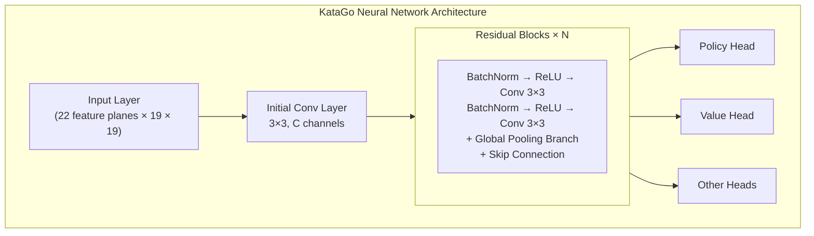
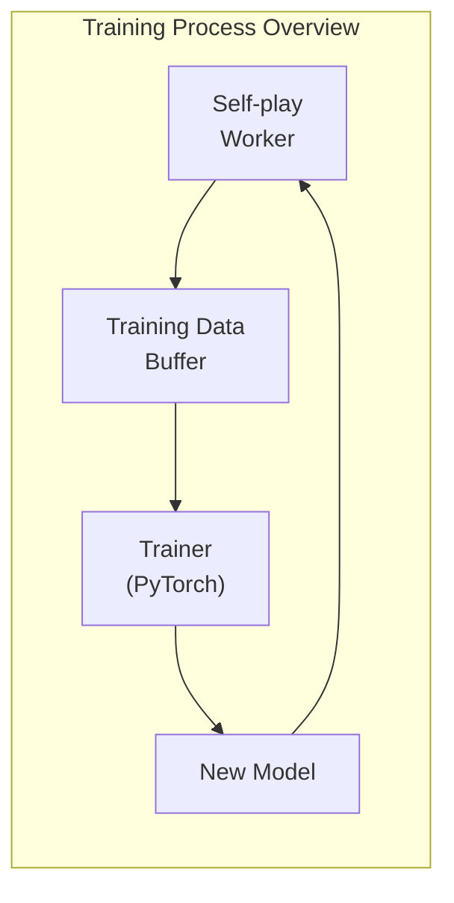

# KataGo Source Code Architecture

This article provides an in-depth analysis of KataGo's source code structure to help you understand its internal implementation. Whether you want to contribute code, modify features, or apply its techniques to your own projects, this is essential reference material.

## Project Directory Structure

```
KataGo/
├── cpp/                    # C++ core code
│   ├── main.cpp           # Main program entry
│   ├── command/           # Various execution modes
│   ├── core/              # Core utility classes
│   ├── game/              # Go rules and board
│   ├── search/            # MCTS search engine
│   ├── neuralnet/         # Neural network interface
│   ├── dataio/            # Data I/O
│   ├── configs/           # Example configuration files
│   └── tests/             # Unit tests
├── python/                 # Python training code
│   ├── train.py           # Training main program
│   ├── model.py           # Model definition
│   ├── data_processing_pytorch.py
│   └── configs/           # Training configurations
├── docs/                   # Documentation
└── scripts/               # Helper scripts
```

### cpp/ Directory Details

```
cpp/
├── main.cpp                # Program entry, parses command line args
├── command/
│   ├── gtp.cpp            # GTP protocol implementation
│   ├── analysis.cpp       # Analysis Engine implementation
│   ├── benchmark.cpp      # Benchmark testing
│   ├── genconfig.cpp      # Config file generation
│   └── selfplay.cpp       # Self-play
├── core/
│   ├── global.h           # Global constants and settings
│   ├── hash.h             # Zobrist hashing
│   ├── rand.h             # Random number generation
│   ├── logger.h           # Logging system
│   ├── config_parser.h    # Config file parsing
│   └── threadsafe*.h      # Thread-safe utilities
├── game/
│   ├── board.h/cpp        # Board representation and basic operations
│   ├── rules.h/cpp        # Go rules
│   ├── boardhistory.h/cpp # Game history
│   └── graphhash.h/cpp    # Position hashing
├── search/
│   ├── search.h/cpp       # Search engine main class
│   ├── searchnode.h/cpp   # Search tree nodes
│   ├── searchparams.h     # Search parameters
│   ├── mutexpool.h        # Lock pool
│   ├── searchresults.h    # Search results
│   └── asyncbot.h/cpp     # Asynchronous bot
├── neuralnet/
│   ├── nninputs.h/cpp     # Neural network input features
│   ├── nneval.h/cpp       # Neural network evaluation
│   ├── nninterface.h      # Backend abstract interface
│   ├── cudabackend.cpp    # CUDA backend
│   ├── openclbackend.cpp  # OpenCL backend
│   ├── eigenbackend.cpp   # Eigen(CPU) backend
│   └── modelversion.h     # Model version management
└── dataio/
    ├── sgf.h/cpp          # SGF file handling
    ├── numpywrite.h/cpp   # NumPy format output
    └── trainingwrite.h/cpp # Training data writing
```

## Neural Network Architecture

### Network Structure Overview



### Input Features (nninputs.cpp)

KataGo uses 22 feature planes as input:

```cpp
// Main input feature categories
enum {
  // Board state
  INPUT_FEATURE_STONE_OUR,      // Our stones
  INPUT_FEATURE_STONE_OPP,      // Opponent stones

  // Liberty-related (1-8 liberties)
  INPUT_FEATURE_LIBERTIES_1,
  INPUT_FEATURE_LIBERTIES_2,
  // ...
  INPUT_FEATURE_LIBERTIES_8_OR_MORE,

  // History state
  INPUT_FEATURE_LAST_MOVE,      // Last move position
  INPUT_FEATURE_SECOND_LAST_MOVE,

  // Rules-related
  INPUT_FEATURE_KOMI,           // Komi
  INPUT_FEATURE_RULES,          // Rules encoding
  // ...
};
```

### Global Pooling Branch

One of KataGo's innovations is adding global pooling to residual blocks:

```cpp
// Simplified global pooling implementation concept
class GlobalPoolingResBlock {
public:
  void forward(Tensor& x) {
    // Standard residual path
    Tensor regular_out = regular_conv_path(x);

    // Global pooling path
    Tensor global_mean = global_avg_pool(x);  // [batch, C]
    Tensor global_max = global_max_pool(x);    // [batch, C]
    Tensor global_features = concat(global_mean, global_max);

    // Process global features
    global_features = dense_layer(global_features);  // [batch, C]

    // Broadcast back to spatial dimensions and combine with regular path
    Tensor global_broadcast = broadcast_to_spatial(global_features);
    x = regular_out + global_broadcast;
  }
};
```

### Output Heads

```cpp
// Policy Head: Predict move probabilities
class PolicyHead {
  // Output: 19×19+1 (including pass)
  // Uses softmax normalization
};

// Value Head: Predict game outcome
class ValueHead {
  // Output: 3 (win/loss/draw probabilities)
  // Uses softmax normalization
};

// Score Head: Predict score
class ScoreHead {
  // Output: continuous value (expected score difference)
};

// Ownership Head: Predict territory
class OwnershipHead {
  // Output: 19×19 (ownership per point, tanh)
};
```

## Search Engine Implementation

### MCTS Core Classes

```cpp
// search/search.h
class Search {
public:
  // Execute search
  void runWholeSearch(Player pla);

  // Get best move
  Loc getBestMove();

  // Get analysis results
  AnalysisData getAnalysisData();

private:
  SearchParams params;          // Search parameters
  SearchNode* rootNode;         // Root node
  NNEvaluator* nnEval;         // Neural network evaluator
  std::mutex* mutexPool;       // Lock pool
};
```

### Search Node Structure

```cpp
// search/searchnode.h
struct SearchNode {
  // Node statistics
  std::atomic<int64_t> visits;           // Visit count
  std::atomic<double> valueSumWeight;    // Value accumulation weight
  std::atomic<double> valueSum;          // Value accumulation sum

  // Child nodes
  std::atomic<int> numChildren;
  SearchChildPointer* children;          // Child node pointer array

  // Neural network output cache
  std::shared_ptr<NNOutput> nnOutput;
};

struct SearchChildPointer {
  Loc moveLoc;                           // Move location
  std::atomic<SearchNode*> node;         // Child node pointer
  std::atomic<int64_t> edgeVisits;       // Edge visit count
};
```

### PUCT Selection Algorithm

```cpp
// Select child node to explore
int Search::selectChildToDescend(SearchNode* node, Player pla) {
  int bestIdx = -1;
  double bestValue = -1e100;

  for (int i = 0; i < node->numChildren; i++) {
    SearchChildPointer& child = node->children[i];

    // Calculate Q value (exploitation)
    double q = getChildQ(child);

    // Calculate U value (exploration)
    double prior = getPrior(node, child.moveLoc);
    double parentVisits = node->visits.load();
    double childVisits = child.edgeVisits.load();

    double u = params.cpuctExploration * prior *
               sqrt(parentVisits) / (1.0 + childVisits);

    // PUCT formula
    double value = q + u;

    if (value > bestValue) {
      bestValue = value;
      bestIdx = i;
    }
  }

  return bestIdx;
}
```

### Parallel Search Implementation

```cpp
void Search::runWholeSearch(Player pla) {
  // Start multiple search threads
  std::vector<std::thread> threads;
  for (int i = 0; i < params.numSearchThreads; i++) {
    threads.emplace_back([this, pla]() {
      runSingleSearchThread(pla);
    });
  }

  // Wait for all threads to complete
  for (auto& t : threads) {
    t.join();
  }
}

void Search::runSingleSearchThread(Player pla) {
  while (!shouldStop()) {
    // Select path
    std::vector<SearchNode*> path;
    SearchNode* leaf = selectAndDescend(rootNode, path);

    // Expand node
    expandNode(leaf);

    // Neural network evaluation
    NNOutput output = nnEval->evaluate(leaf->board);

    // Backpropagate value
    backpropagateValue(path, output.value);
  }
}
```

### Virtual Loss

Used in parallel search to prevent multiple threads from selecting the same path:

```cpp
void Search::applyVirtualLoss(SearchNode* node) {
  // Temporarily reduce this node's evaluation value
  // Makes other threads prefer different paths
  node->virtualLoss.fetch_add(1);
}

void Search::removeVirtualLoss(SearchNode* node) {
  node->virtualLoss.fetch_sub(1);
}
```

## Training Process Overview

### Training Data Generation



### Self-play (cpp/command/selfplay.cpp)

```cpp
// Self-play main loop
void runSelfPlayLoop() {
  while (true) {
    // Load latest model
    loadLatestModel();

    // Play one game
    GameData gameData = playSingleGame();

    // Save training data
    writeTrainingData(gameData);
  }
}

GameData playSingleGame() {
  Board board;
  BoardHistory history;
  GameData gameData;

  while (!history.isGameOver()) {
    // Use MCTS to select move
    Search search(board, history, params);
    search.runWholeSearch(history.currentPla);

    // Get MCTS result as training target
    MoveData moveData;
    moveData.policyTarget = search.getPolicyDistribution();
    moveData.valueTarget = search.getValue();

    // Execute move
    Loc move = search.sampleMove();
    board.playMove(move, history.currentPla);

    gameData.moves.push_back(moveData);
  }

  // Backfill final result
  gameData.finalScore = history.finalScore();
  return gameData;
}
```

### Training Data Format

```cpp
// dataio/trainingwrite.h
struct TrainingRow {
  // Input features
  float inputFeatures[NUM_FEATURES][BOARD_SIZE][BOARD_SIZE];

  // Training targets
  float policyTarget[BOARD_SIZE * BOARD_SIZE + 1];  // Including pass
  float valueTarget[3];                              // Win/loss/draw
  float scoreTarget;                                 // Score
  float ownershipTarget[BOARD_SIZE][BOARD_SIZE];    // Territory

  // Metadata
  int turn;
  int rules;
  float komi;
};
```

### Python Training Program (python/train.py)

```python
# Training main loop (simplified)
def train():
    model = KataGoModel(config)
    optimizer = torch.optim.SGD(model.parameters(), lr=config.lr)

    for epoch in range(config.num_epochs):
        for batch in data_loader:
            # Forward pass
            policy_pred, value_pred, score_pred, ownership_pred = model(batch.input)

            # Calculate losses
            policy_loss = cross_entropy(policy_pred, batch.policy_target)
            value_loss = cross_entropy(value_pred, batch.value_target)
            score_loss = mse_loss(score_pred, batch.score_target)
            ownership_loss = mse_loss(ownership_pred, batch.ownership_target)

            # Total loss (weighted sum)
            total_loss = (
                policy_loss +
                config.value_weight * value_loss +
                config.score_weight * score_loss +
                config.ownership_weight * ownership_loss
            )

            # Backpropagation
            optimizer.zero_grad()
            total_loss.backward()
            optimizer.step()

        # Save checkpoint
        save_checkpoint(model, epoch)
```

### Model Definition (python/model.py)

```python
class KataGoModel(nn.Module):
    def __init__(self, config):
        super().__init__()

        # Initial convolution
        self.initial_conv = nn.Conv2d(
            config.input_channels,
            config.trunk_channels,
            kernel_size=3, padding=1
        )

        # Residual blocks
        self.blocks = nn.ModuleList([
            ResBlock(config.trunk_channels, use_global_pooling=True)
            for _ in range(config.num_blocks)
        ])

        # Output heads
        self.policy_head = PolicyHead(config)
        self.value_head = ValueHead(config)
        self.score_head = ScoreHead(config)
        self.ownership_head = OwnershipHead(config)

    def forward(self, x):
        # Trunk network
        x = self.initial_conv(x)
        for block in self.blocks:
            x = block(x)

        # Output heads
        policy = self.policy_head(x)
        value = self.value_head(x)
        score = self.score_head(x)
        ownership = self.ownership_head(x)

        return policy, value, score, ownership
```

## Key Data Structures

### Board (game/board.h)

```cpp
class Board {
public:
  // Board state
  Color stones[MAX_BOARD_AREA];    // Color at each point
  Chain chains[MAX_BOARD_AREA];    // Chain information

  // Ko
  Loc koLoc;

  // Execute move
  void playMove(Loc loc, Color pla);

  // Legality check
  bool isLegal(Loc loc, Color pla) const;

  // Liberty calculation
  int getLiberties(Loc loc) const;
};

struct Chain {
  int liberties;                   // Liberty count
  int numStones;                   // Stone count
  Loc head;                        // Linked list head
};
```

### BoardHistory (game/boardhistory.h)

```cpp
class BoardHistory {
public:
  std::vector<Board> boards;       // Historical board states
  std::vector<Move> moves;         // Move history
  Rules rules;                     // Rules
  Player currentPla;               // Current player

  // Game state
  bool isGameOver() const;
  float finalScore() const;
};
```

### NNOutput (neuralnet/nneval.h)

```cpp
struct NNOutput {
  // Policy
  float policyProbs[MAX_BOARD_AREA + 1];  // Including pass

  // Value
  float whiteWinProb;
  float whiteLossProb;
  float noResultProb;

  // Score
  float whiteScoreMean;
  float whiteScoreStdev;

  // Ownership
  float ownership[MAX_BOARD_AREA];  // -1 to 1
};
```

## Development and Debugging

### Build Debug Version

```bash
cd cpp
mkdir build_debug && cd build_debug
cmake .. -DCMAKE_BUILD_TYPE=Debug -DUSE_BACKEND=OPENCL
make -j$(nproc)
```

### Run Unit Tests

```bash
./katago runtests
```

### Common Debugging Methods

```cpp
// 1. Use logging
#include "core/logger.h"
Logger::log("Debug message", value);

// 2. Use kata-debug-print GTP command
// Outputs detailed search information

// 3. Enable sanitizers at compile time
cmake .. -DCMAKE_CXX_FLAGS="-fsanitize=address"
```

### Performance Analysis

```bash
# Using perf (Linux)
perf record ./katago benchmark -model model.bin.gz
perf report

# Using Instruments (macOS)
instruments -t "Time Profiler" ./katago benchmark -model model.bin.gz
```

## Further Reading

- [KataGo GitHub](https://github.com/lightvector/KataGo)
- [KataGo Paper](https://arxiv.org/abs/1902.10565)
- [KataGo Discord](https://discord.gg/bqkZAz3) - Communicate with developers
- [KataGo Training](https://katagotraining.org/) - View training progress

After understanding KataGo's source code architecture, you now have the capability to deeply research or contribute to open source projects. For further exploration, we recommend directly reading KataGo's GitHub source code and participating in community discussions.

