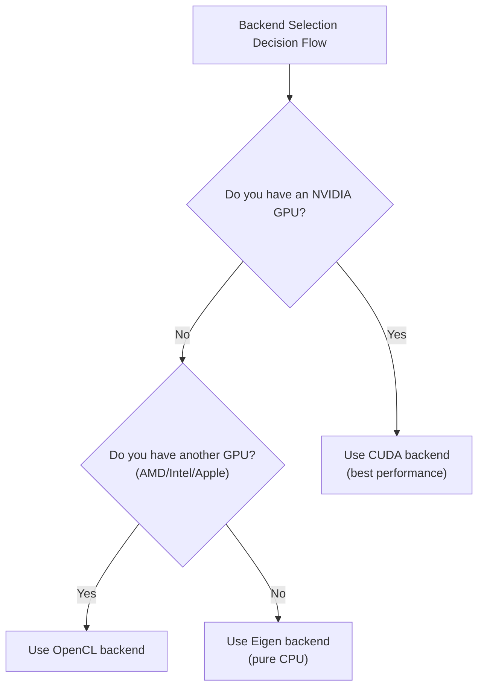

# KataGo Installation and Setup

This article provides detailed instructions for installing KataGo on various platforms, including system requirements, installation steps, model selection, and configuration file explanations.

## System Requirements

### Hardware Requirements

#### GPU (Recommended)

| GPU Type | Support Status | Recommended Backend |
|---------|---------|---------|
| NVIDIA (CUDA) | Best support | CUDA |
| NVIDIA (no CUDA) | Good support | OpenCL |
| AMD | Good support | OpenCL |
| Intel integrated | Basic support | OpenCL |
| Apple Silicon | Good support | Metal / OpenCL |

#### CPU Mode

If you don't have a suitable GPU, you can use the Eigen backend for pure CPU operation:
- Lower performance (~10-30 playouts/sec)
- Suitable for learning, testing, and low-intensity use
- Requires AVX2 instruction set support (most modern CPUs support this)

### Software Requirements

| Operating System | Version Requirements |
|---------|---------|
| **Linux** | Ubuntu 18.04+, CentOS 7+ or other modern distributions |
| **macOS** | 10.14+ (Mojave or newer) |
| **Windows** | Windows 10 or newer |

### Backend Selection Guide



## macOS Installation

### Method 1: Homebrew (Recommended)

The simplest installation method, automatically handles all dependencies.

```bash
# Install KataGo
brew install katago

# Verify installation
katago version
```

The Homebrew version uses OpenCL backend by default, works on both Intel Mac and Apple Silicon.

### Method 2: Build from Source

For users who need custom options or latest features.

#### Install Dependencies

```bash
# Install CMake and build tools
brew install cmake

# For OpenCL
# macOS has built-in OpenCL support, no additional installation needed
```

#### Build Steps

```bash
# Clone source code
git clone https://github.com/lightvector/KataGo.git
cd KataGo/cpp

# Create build directory
mkdir build && cd build

# Configure build options (OpenCL backend)
cmake .. -DUSE_BACKEND=OPENCL

# Build
make -j$(sysctl -n hw.ncpu)

# After building, executable is at build/katago
./katago version
```

#### Apple Silicon Notes

On M1/M2/M3 Macs, recommend using OpenCL or Metal backend:

```bash
# OpenCL backend (recommended, better compatibility)
cmake .. -DUSE_BACKEND=OPENCL

# Metal backend (experimental, may have better performance)
cmake .. -DUSE_BACKEND=METAL
```

## Linux Installation

### Method 1: Pre-built Version (Recommended)

Download pre-built version from GitHub Releases:

```bash
# Download OpenCL version (suitable for most cases)
wget https://github.com/lightvector/KataGo/releases/download/v1.15.3/katago-v1.15.3-opencl-linux-x64.zip

# Or download CUDA version (NVIDIA GPU)
wget https://github.com/lightvector/KataGo/releases/download/v1.15.3/katago-v1.15.3-cuda11.1-linux-x64.zip

# Extract
unzip katago-v1.15.3-*.zip

# Grant execute permission
chmod +x katago

# Verify installation
./katago version
```

### Method 2: Build from Source

#### CUDA Backend (NVIDIA GPU)

```bash
# Install dependencies
sudo apt update
sudo apt install cmake g++ libzip-dev

# Install CUDA (if not already installed)
# See NVIDIA official guide: https://developer.nvidia.com/cuda-downloads

# Clone and build
git clone https://github.com/lightvector/KataGo.git
cd KataGo/cpp
mkdir build && cd build

# Configure CUDA backend
cmake .. -DUSE_BACKEND=CUDA

# Build
make -j$(nproc)
```

#### OpenCL Backend (Generic GPU)

```bash
# Install dependencies
sudo apt update
sudo apt install cmake g++ libzip-dev ocl-icd-opencl-dev

# Install OpenCL drivers
# NVIDIA: comes with CUDA installation
# AMD: sudo apt install mesa-opencl-icd
# Intel: sudo apt install intel-opencl-icd

# Clone and build
git clone https://github.com/lightvector/KataGo.git
cd KataGo/cpp
mkdir build && cd build

cmake .. -DUSE_BACKEND=OPENCL
make -j$(nproc)
```

#### Eigen Backend (Pure CPU)

```bash
# Install dependencies
sudo apt update
sudo apt install cmake g++ libzip-dev libeigen3-dev

# Clone and build
git clone https://github.com/lightvector/KataGo.git
cd KataGo/cpp
mkdir build && cd build

cmake .. -DUSE_BACKEND=EIGEN
make -j$(nproc)
```

## Windows Installation

### Method 1: Pre-built Version (Recommended)

1. Go to [KataGo Releases](https://github.com/lightvector/KataGo/releases)
2. Download appropriate version:
   - `katago-v1.15.3-cuda11.1-windows-x64.zip` (NVIDIA GPU + CUDA)
   - `katago-v1.15.3-opencl-windows-x64.zip` (Other GPUs)
   - `katago-v1.15.3-eigen-windows-x64.zip` (CPU only)
3. Extract to desired directory
4. Test in Command Prompt:

```cmd
cd C:\path\to\katago
katago.exe version
```

### Method 2: Build from Source

#### Prepare Environment

1. Install [Visual Studio 2019/2022](https://visualstudio.microsoft.com/) (with C++ tools)
2. Install [CMake](https://cmake.org/download/)
3. If using CUDA, install [CUDA Toolkit](https://developer.nvidia.com/cuda-toolkit)

#### Build Steps

```cmd
# Run in Developer Command Prompt

git clone https://github.com/lightvector/KataGo.git
cd KataGo\cpp
mkdir build
cd build

# CUDA backend
cmake .. -G "Visual Studio 17 2022" -A x64 -DUSE_BACKEND=CUDA

# Or OpenCL backend
cmake .. -G "Visual Studio 17 2022" -A x64 -DUSE_BACKEND=OPENCL

# Build
cmake --build . --config Release
```

## Model Download and Selection

KataGo requires neural network model files to run. Official models come in various sizes.

### Download Location

Official model download page: https://katagotraining.org/

Or download directly from training server:

```bash
# Smaller model (suitable for testing and weak hardware)
curl -L -o kata-b18c384.bin.gz \
  "https://media.katagotraining.org/uploaded/networks/models/kata1/kata1-b18c384nbt-s9996604416-d4316597426.bin.gz"

# Medium model (recommended, balances performance and speed)
curl -L -o kata-b40c256.bin.gz \
  "https://media.katagotraining.org/uploaded/networks/models/kata1/kata1-b40c256-s11840935168-d2898845681.bin.gz"

# Large model (strongest, needs powerful GPU)
curl -L -o kata-b60c320.bin.gz \
  "https://media.katagotraining.org/uploaded/networks/models/kata1/kata1-b60c320-s11318001920-d2792783831.bin.gz"
```

### Model Comparison

| Model | Network Size | File Size | Strength | Use Case |
|------|---------|---------|------|---------|
| b10c128 | 10 blocks, 128 channels | ~20 MB | Amateur high-dan | CPU, weak GPU, quick testing |
| b18c384 | 18 blocks, 384 channels | ~140 MB | Professional level | General GPU, daily analysis |
| b40c256 | 40 blocks, 256 channels | ~250 MB | Superhuman | Mid-high end GPU, deep analysis |
| b60c320 | 60 blocks, 320 channels | ~500 MB | Top superhuman | High-end GPU, top analysis |

### Selection Recommendations

```
What's your GPU?
├─ RTX 3080/4080/4090 → b60c320 or b40c256
├─ RTX 3060/3070 → b40c256 or b18c384
├─ GTX 1660/2060 → b18c384
├─ Entry-level GPU → b18c384 or b10c128
└─ CPU only → b10c128
```

## Basic Configuration File Explanation

KataGo uses `.cfg` format configuration files. Official example configs are in the `cpp/configs/` directory.

### Important Configuration Files

| File | Purpose |
|------|------|
| `gtp_example.cfg` | Example config for GTP mode |
| `analysis_example.cfg` | Example config for Analysis Engine |
| `default_gtp.cfg` | Default config for GTP mode |

### Core Configuration Options

```ini
# =============
# Neural Network Settings
# =============

# Neural network model file path
# Can use relative or absolute path
# model = /path/to/model.bin.gz

# =============
# Search Settings
# =============

# Maximum search visits per move
# Increasing improves strength but slows down
maxVisits = 500

# Maximum thinking time per move (seconds)
# 0 means unlimited (controlled by maxVisits)
maxTime = 0

# Number of threads per move search
numSearchThreads = 6

# =============
# Rules Settings
# =============

# Go rules
# chinese = Chinese rules
# japanese = Japanese rules
# korean = Korean rules
# tromp-taylor = Tromp-Taylor rules
# aga = AGA rules
rules = chinese

# Komi
komi = 7.5

# =============
# GPU Settings
# =============

# GPU device index (starting from 0)
# Multiple GPUs can use comma separation: 0,1,2
# -1 means auto-select
nnDeviceIdxs = 0

# Batch size per GPU thread
# Larger batches improve GPU utilization
numNNServerThreadsPerModel = 1

# =============
# Advanced Settings
# =============

# MCTS exploration constant
# Larger values increase exploration, smaller increase exploitation
cpuctExploration = 1.0

# Root node Dirichlet noise
# Used to increase exploration diversity
rootNoiseEnabled = true
rootDirichletNoisePruneFactor = 0.25
```

### GTP Mode Config Example

Create `my_gtp_config.cfg`:

```ini
# Model path
# model typically specified on command line, can omit here

# Search settings
maxVisits = 1000
numSearchThreads = 4

# Rules
rules = chinese
komi = 7.5

# GPU settings
nnDeviceIdxs = 0

# Logging
logDir = ./logs
logToStderr = false
```

### Analysis Engine Config Example

Create `my_analysis_config.cfg`:

```ini
# Search settings
maxVisits = 500
numSearchThreads = 8

# Report settings
# Maximum variations to report per analysis
maxMoves = 10

# Rules (can override in API calls)
rules = chinese
komi = 7.5

# GPU settings
nnDeviceIdxs = 0
numNNServerThreadsPerModel = 2

# Analysis features
reportAnalysisWinratesAs = BLACK

# Ownership map
# Enable to get ownership prediction for each point
analysisOwnership = true
```

## First Run

### Test GTP Mode

```bash
# Run GTP mode
katago gtp -model /path/to/model.bin.gz -config /path/to/config.cfg

# If no config, KataGo uses defaults
katago gtp -model /path/to/model.bin.gz
```

After successful startup, enter GTP commands to test:

```
name
= KataGo

version
= 1.15.3

boardsize 19
=

genmove black
= Q16

quit
=
```

### Test Analysis Engine

```bash
# Run Analysis Engine
katago analysis -model /path/to/model.bin.gz -config /path/to/config.cfg
```

Input JSON query:

```json
{"id":"test1","initialStones":[],"moves":[],"rules":"chinese","komi":7.5,"boardXSize":19,"boardYSize":19,"analyzeTurns":[0]}
```

### Benchmark Test

Test your hardware performance:

```bash
# Run benchmark
katago benchmark -model /path/to/model.bin.gz

# Specify config
katago benchmark -model /path/to/model.bin.gz -config /path/to/config.cfg
```

Benchmark outputs:
- Search visits per second (visits/sec)
- Neural network inference speed
- Recommended thread settings

## Troubleshooting

### GPU Related

**Problem: GPU not found**

```bash
# Check OpenCL devices
clinfo

# Or list devices KataGo sees
katago gpuinfo
```

**Problem: CUDA initialization failed**

- Verify CUDA version matches KataGo build version
- Update GPU drivers
- Check CUDA_PATH environment variable

### Memory Related

**Problem: Out of memory**

```ini
# Reduce GPU memory usage
nnMaxBatchSize = 8  # Default may be 16 or higher
nnCacheSizePowerOfTwo = 20  # Reduce cache size
```

### Performance Related

**Problem: Too slow**

1. Confirm using GPU not CPU
2. Reduce `numSearchThreads`
3. Use smaller model
4. Check if other programs are using GPU

## Next Steps

After setup is complete, continue reading:
- [Common Commands](./commands.md) - Learn how to use KataGo
- [Source Code Architecture](./architecture.md) - Understand internal implementation

