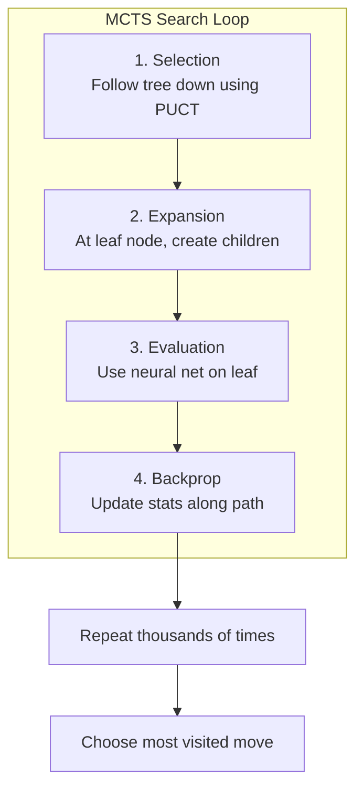
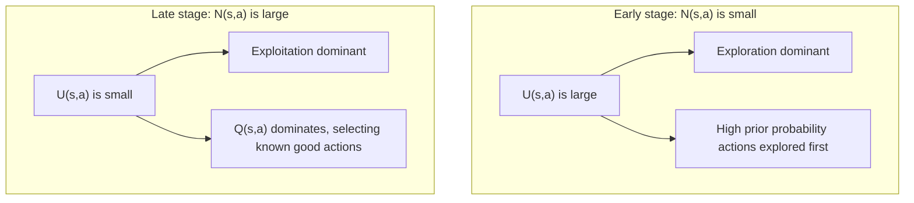
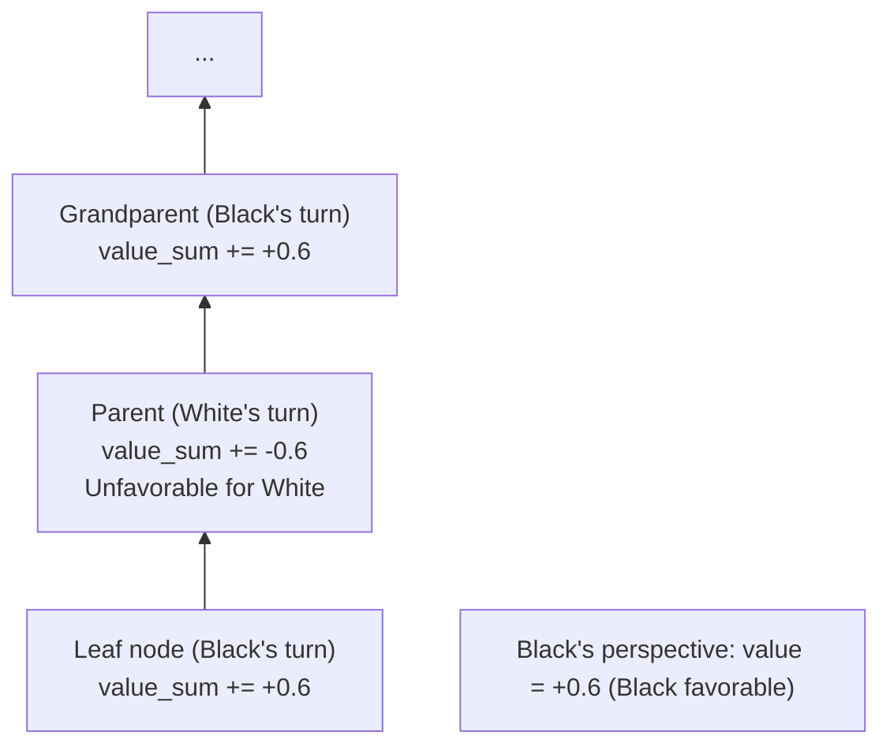

# MCTS Implementation Details

This article provides an in-depth analysis of Monte Carlo Tree Search (MCTS) implementation details in KataGo, including data structures, selection strategies, and parallelization techniques.

---

## MCTS Four-Step Review



---

## Node Data Structure

### Core Data

Each MCTS node needs to store:

```python
class MCTSNode:
    def __init__(self, state, parent=None, prior=0.0):
        # Basic info
        self.state = state              # Board state
        self.parent = parent            # Parent node
        self.children = {}              # Child nodes dict {action: node}
        self.action = None              # Action to reach this node

        # Statistics
        self.visit_count = 0            # N(s): visit count
        self.value_sum = 0.0            # W(s): value sum
        self.prior = prior              # P(s,a): prior probability

        # For parallel search
        self.virtual_loss = 0           # Virtual loss
        self.is_expanded = False        # Whether expanded

    @property
    def value(self):
        """Q(s) = W(s) / N(s)"""
        if self.visit_count == 0:
            return 0.0
        return self.value_sum / self.visit_count
```

### Memory Optimization

KataGo uses various techniques to reduce memory usage:

```python
# Use numpy arrays instead of Python dict
class OptimizedNode:
    __slots__ = ['visit_count', 'value_sum', 'prior', 'children_indices']

    def __init__(self):
        self.visit_count = np.int32(0)
        self.value_sum = np.float32(0.0)
        self.prior = np.float32(0.0)
        self.children_indices = None  # Lazy allocation
```

---

## Selection: PUCT

### PUCT Formula

```
Selection Score = Q(s,a) + U(s,a)

Where:
Q(s,a) = W(s,a) / N(s,a)              # Mean value
U(s,a) = c_puct × P(s,a) × √(N(s)) / (1 + N(s,a))  # Exploration term
```

### Parameter Explanation

| Symbol | Meaning | Typical Value |
|--------|---------|---------------|
| Q(s,a) | Mean value of action a | [-1, +1] |
| P(s,a) | Neural net prior probability | [0, 1] |
| N(s) | Parent visit count | integer |
| N(s,a) | Action a visit count | integer |
| c_puct | Exploration constant | 1.0 ~ 2.5 |

### Implementation

```python
def select_child(self, c_puct=1.5):
    """Select child with highest PUCT score"""
    best_score = -float('inf')
    best_action = None
    best_child = None

    # Square root of parent visits
    sqrt_parent_visits = math.sqrt(self.visit_count)

    for action, child in self.children.items():
        # Q value (mean value)
        if child.visit_count > 0:
            q_value = child.value_sum / child.visit_count
        else:
            q_value = 0.0

        # U value (exploration term)
        u_value = c_puct * child.prior * sqrt_parent_visits / (1 + child.visit_count)

        # Total score
        score = q_value + u_value

        if score > best_score:
            best_score = score
            best_action = action
            best_child = child

    return best_action, best_child
```

### Exploration vs Exploitation Balance



---

## Expansion: Node Expansion

### Expansion Conditions

When reaching a leaf node, expand using the neural network:

```python
def expand(self, policy_probs, legal_moves):
    """Expand node, create children for all legal actions"""
    for action in legal_moves:
        if action not in self.children:
            prior = policy_probs[action]  # Neural net predicted probability
            child_state = self.state.play(action)
            self.children[action] = MCTSNode(
                state=child_state,
                parent=self,
                prior=prior
            )

    self.is_expanded = True
```

### Legal Move Filtering

```python
def get_legal_moves(state):
    """Get all legal moves"""
    legal = []
    for i in range(361):
        x, y = i // 19, i % 19
        if state.is_legal(x, y):
            legal.append(i)

    # Add pass
    legal.append(361)

    return legal
```

---

## Evaluation: Neural Network Evaluation

### Single Evaluation

```python
def evaluate(self, state):
    """Evaluate position using neural network"""
    # Encode input features
    features = encode_state(state)  # (22, 19, 19)
    features = torch.tensor(features).unsqueeze(0)  # (1, 22, 19, 19)

    # Neural network inference
    with torch.no_grad():
        output = self.network(features)

    policy = output['policy'][0].numpy()  # (362,)
    value = output['value'][0].item()     # scalar

    return policy, value
```

### Batch Evaluation (Key Optimization)

GPU is most efficient with batch inference:

```python
class BatchedEvaluator:
    def __init__(self, network, batch_size=8):
        self.network = network
        self.batch_size = batch_size
        self.pending = []  # Pending (state, callback) list

    def request_evaluation(self, state, callback):
        """Request evaluation, auto-execute when batch is full"""
        self.pending.append((state, callback))

        if len(self.pending) >= self.batch_size:
            self.flush()

    def flush(self):
        """Execute batch evaluation"""
        if not self.pending:
            return

        # Prepare batch input
        states = [s for s, _ in self.pending]
        features = torch.stack([encode_state(s) for s in states])

        # Batch inference
        with torch.no_grad():
            outputs = self.network(features)

        # Callback with results
        for i, (_, callback) in enumerate(self.pending):
            policy = outputs['policy'][i].numpy()
            value = outputs['value'][i].item()
            callback(policy, value)

        self.pending.clear()
```

---

## Backpropagation: Update Statistics

### Basic Backpropagation

```python
def backpropagate(self, value):
    """Backpropagate from leaf to root, updating statistics"""
    node = self

    while node is not None:
        node.visit_count += 1
        node.value_sum += value

        # Alternate perspective: opponent's value is opposite
        value = -value

        node = node.parent
```

### Importance of Perspective Alternation



---

## Parallelization: Virtual Loss

### Problem

When multiple threads search simultaneously, they might all select the same node:

```
Thread 1: Select node A (Q=0.6, N=100)
Thread 2: Select node A (Q=0.6, N=100) ← Duplicate!
Thread 3: Select node A (Q=0.6, N=100) ← Duplicate!
```

### Solution: Virtual Loss

When selecting a node, add "virtual loss" first to discourage other threads:

```python
VIRTUAL_LOSS = 3  # Virtual loss value

def select_with_virtual_loss(self):
    """Selection with virtual loss"""
    action, child = self.select_child()

    # Add virtual loss
    child.visit_count += VIRTUAL_LOSS
    child.value_sum -= VIRTUAL_LOSS  # Pretend we lost

    return action, child

def backpropagate_with_virtual_loss(self, value):
    """Backprop with virtual loss removal"""
    node = self

    while node is not None:
        # Remove virtual loss
        node.visit_count -= VIRTUAL_LOSS
        node.value_sum += VIRTUAL_LOSS

        # Normal update
        node.visit_count += 1
        node.value_sum += value

        value = -value
        node = node.parent
```

### Effect

```
Thread 1: Select node A, add virtual loss
         A's Q value temporarily decreases

Thread 2: Select node B (because A looks worse now)

Thread 3: Select node C

→ Different threads explore different branches, improving efficiency
```

---

## Complete Search Implementation

```python
class MCTS:
    def __init__(self, network, c_puct=1.5, num_simulations=800):
        self.network = network
        self.c_puct = c_puct
        self.num_simulations = num_simulations
        self.evaluator = BatchedEvaluator(network)

    def search(self, root_state):
        """Execute MCTS search"""
        root = MCTSNode(root_state)

        # Expand root
        policy, value = self.evaluate(root_state)
        legal_moves = get_legal_moves(root_state)
        root.expand(policy, legal_moves)

        # Run simulations
        for _ in range(self.num_simulations):
            node = root
            path = [node]

            # Selection: Follow tree down
            while node.is_expanded and node.children:
                action, node = node.select_child(self.c_puct)
                path.append(node)

            # Expansion + Evaluation
            if not node.is_expanded:
                policy, value = self.evaluate(node.state)
                legal_moves = get_legal_moves(node.state)

                if legal_moves:
                    node.expand(policy, legal_moves)

            # Backpropagation
            for n in reversed(path):
                n.visit_count += 1
                n.value_sum += value
                value = -value

        # Choose most visited action
        best_action = max(root.children.items(),
                         key=lambda x: x[1].visit_count)[0]

        return best_action

    def evaluate(self, state):
        features = encode_state(state)
        features = torch.tensor(features).unsqueeze(0)

        with torch.no_grad():
            output = self.network(features)

        return output['policy'][0].numpy(), output['value'][0].item()
```

---

## Advanced Techniques

### Dirichlet Noise

Add noise at root during training to increase exploration:

```python
def add_dirichlet_noise(root, alpha=0.03, epsilon=0.25):
    """Add Dirichlet noise at root"""
    noise = np.random.dirichlet([alpha] * len(root.children))

    for i, child in enumerate(root.children.values()):
        child.prior = (1 - epsilon) * child.prior + epsilon * noise[i]
```

### Temperature Parameter

Control randomness in action selection:

```python
def select_action_with_temperature(root, temperature=1.0):
    """Select action based on visit counts and temperature"""
    visits = np.array([c.visit_count for c in root.children.values()])
    actions = list(root.children.keys())

    if temperature == 0:
        # Greedy selection
        return actions[np.argmax(visits)]
    else:
        # Probabilistic selection based on visit counts
        probs = visits ** (1 / temperature)
        probs = probs / probs.sum()
        return np.random.choice(actions, p=probs)
```

### Tree Reuse

Reuse search tree for the next move:

```python
def reuse_tree(root, action):
    """Reuse subtree"""
    if action in root.children:
        new_root = root.children[action]
        new_root.parent = None
        return new_root
    else:
        return None  # Need to create new tree
```

---

## Performance Optimization Summary

| Technique | Effect |
|-----------|--------|
| **Batch evaluation** | GPU utilization from 10% → 80%+ |
| **Virtual loss** | Multi-thread efficiency 3-5x improvement |
| **Tree reuse** | Reduce cold start, save 30%+ computation |
| **Memory pool** | Reduce memory allocation overhead |

---

## Further Reading

- [Neural Network Architecture](../neural-network) — Source of evaluation function
- [GPU Backend & Optimization](../gpu-optimization) — Hardware optimization for batch inference
- [Key Papers Guide](../papers) — Theoretical foundation of PUCT formula
