import { MCTSTree, GoBoard } from '@site/src/components/D3Charts';

# Los Limites de los Metodos Tradicionales

Antes de la aparicion del aprendizaje profundo, los investigadores pasaron decadas intentando resolver el problema del Go con metodos "tradicionales". Desde el algoritmo Minimax hasta la Busqueda de Arbol Monte Carlo (MCTS), cada avance hizo que el Go por computadora fuera un poco mas fuerte, pero nunca pudo alcanzar el nivel profesional humano.

Este articulo explorara en profundidad los principios, ventajas y desventajas de estos metodos, y por que encontraron un cuello de botella en el Go.

---

## Algoritmo Minimax: La Base de la Teoria de Juegos

### Principio Basico

El **algoritmo Minimax** es un concepto central de la teoria de juegos, propuesto por John von Neumann en 1928. Su idea basica es:

> En un juego de suma cero, deberia elegir la opcion que siga siendo la mejor para mi incluso despues de la "mejor respuesta" de mi oponente.

En otras palabras:
- **Yo (Max)** quiero maximizar la puntuacion
- **Oponente (Min)** quiere minimizar mi puntuacion
- Debo asumir que el oponente siempre hace la mejor jugada

### Formalizacion Matematica

Sea V(s) el valor de la posicion s, definido recursivamente como:

```
V(s) = eval(s)                        // si s es una posicion final
V(s) = max{ V(result(s, a)) | a ∈ A(s) }  // si es el turno de Max
V(s) = min{ V(result(s, a)) | a ∈ A(s) }  // si es el turno de Min
```

Donde:
- **A(s)**: Todas las jugadas legales en la posicion s
- **result(s, a)**: El resultado de ejecutar la accion a en la posicion s
- **eval(s)**: La evaluacion de una posicion final

### Diagrama del Arbol de Busqueda


En este ejemplo:
- La capa Min elegira el valor menos favorable para mi (el minimo)
- La capa Max elegira el valor mas favorable para mi (el maximo)
- Finalmente, Max deberia elegir la rama del medio (+5)

### Implementacion del Codigo

```python
def minimax(state, depth, is_max_turn):
    """
    Implementacion basica del algoritmo Minimax

    Args:
        state: Posicion actual
        depth: Profundidad de busqueda
        is_max_turn: Si es el turno de Max

    Returns:
        (mejor valor, mejor jugada)
    """
    # Condicion de terminacion: alcanzar limite de profundidad o fin del juego
    if depth == 0 or is_terminal(state):
        return evaluate(state), None

    legal_moves = get_legal_moves(state)
    best_move = None

    if is_max_turn:
        best_value = float('-inf')
        for move in legal_moves:
            next_state = apply_move(state, move)
            value, _ = minimax(next_state, depth - 1, False)
            if value > best_value:
                best_value = value
                best_move = move
    else:
        best_value = float('inf')
        for move in legal_moves:
            next_state = apply_move(state, move)
            value, _ = minimax(next_state, depth - 1, True)
            if value < best_value:
                best_value = value
                best_move = move

    return best_value, best_move
```

### Problemas de Minimax en el Go

#### 1. Explosion del Espacio de Busqueda

Como se menciono en el [articulo anterior](../why-go-is-hard), el factor de ramificacion del Go es aproximadamente 250. Para ver N movimientos:

**Numero de nodos ≈ 250^N**

| Profundidad | Numero de nodos | Calculando 1 millon de nodos por segundo |
|-------------|-----------------|------------------------------------------|
| 2 | 62,500 | 0.06 segundos |
| 4 | 3.9 mil millones | 65 minutos |
| 6 | 2.4×10^14 | 7,600 anos |
| 8 | 1.5×10^19 | 480 millones de anos |

Ver solo 6 movimientos requiere 7,600 anos, sin mencionar una partida completa.

#### 2. Dificultad de la Funcion de Evaluacion

Incluso si solo vemos 4 movimientos, necesitamos una **funcion de evaluacion** precisa para juzgar el valor de posiciones no finales. Pero como se menciono en el articulo anterior, la evaluacion de posiciones en Go es extremadamente dificil.

**Conclusion: El Minimax puro es completamente inviable en el Go.**

---

## Poda Alpha-Beta: Reduciendo Busquedas Inutiles

### Idea Central

La idea central de la poda Alpha-Beta es: **no necesitamos buscar cada rama**.

Si ya sabemos que una rama es "definitivamente mala", podemos saltarla directamente.

### Principio de Poda

```mermaid
flowchart TB
    A["Nodo Max A<br/>(mejor actual α = +5)"]
    B1["Rama 1<br/>Ya evaluada, valor = +5"]
    B["Rama 2: Nodo Min B"]
    C1["Sub-rama B1: valor = +3"]
    C2["Sub-rama B2: ???<br/>(se puede saltar!)"]

    A --> B1
    A --> B
    B --> C1
    B --> C2
```



En este ejemplo:
- A ya tiene una opcion con valor +5
- La primera sub-rama de B es +3, por lo que el valor final de B ≤ +3
- Dado que B ≤ +3 < +5, A no elegira B
- **B2 no necesita ser evaluado**

Esta es la **poda Beta**. De manera similar, existe la **poda Alpha**.

### Formalizacion Matematica

Se introducen dos parametros:
- **α (alpha)**: El valor minimo que Max puede garantizar (limite inferior)
- **β (beta)**: El valor maximo que Min puede garantizar (limite superior)

Condiciones de poda:
- En un nodo Max, si valor ≥ β, podar (poda Beta)
- En un nodo Min, si valor ≤ α, podar (poda Alpha)

### Implementacion del Codigo

```python
def alpha_beta(state, depth, alpha, beta, is_max_turn):
    """
    Algoritmo de poda Alpha-Beta

    Args:
        state: Posicion actual
        depth: Profundidad de busqueda
        alpha: Limite inferior de Max
        beta: Limite superior de Min
        is_max_turn: Si es el turno de Max

    Returns:
        (valor, mejor jugada)
    """
    if depth == 0 or is_terminal(state):
        return evaluate(state), None

    legal_moves = get_legal_moves(state)
    best_move = None

    if is_max_turn:
        value = float('-inf')
        for move in legal_moves:
            next_state = apply_move(state, move)
            child_value, _ = alpha_beta(next_state, depth - 1,
                                        alpha, beta, False)
            if child_value > value:
                value = child_value
                best_move = move
            alpha = max(alpha, value)
            if value >= beta:
                break  # Poda Beta
        return value, best_move
    else:
        value = float('inf')
        for move in legal_moves:
            next_state = apply_move(state, move)
            child_value, _ = alpha_beta(next_state, depth - 1,
                                        alpha, beta, True)
            if child_value < value:
                value = child_value
                best_move = move
            beta = min(beta, value)
            if value <= alpha:
                break  # Poda Alpha
        return value, best_move

# Forma de llamada
value, best_move = alpha_beta(state, depth=4,
                               alpha=float('-inf'),
                               beta=float('inf'),
                               is_max_turn=True)
```

### Eficiencia de la Poda

En el caso ideal (ordenamiento perfecto de movimientos), Alpha-Beta puede reducir el factor de ramificacion efectivo de b a √b:

**Factor de ramificacion efectivo = b^0.5**

Esto significa:
- Ajedrez: de 35 se reduce a ~6
- Go: de 250 se reduce a ~16

| Profundidad | Nodos originales | Alpha-Beta (ideal) | Aceleracion |
|-------------|------------------|-------------------|-------------|
| 4 | 3.9 mil millones | 65,000 | 60,000× |
| 6 | 2.4×10^14 | 16 millones | 1.5×10^7 × |
| 8 | 1.5×10^19 | 4.2 mil millones | 3.6×10^9 × |

### Por que Sigue Siendo Insuficiente

Incluso con la poda Alpha-Beta, el Go sigue siendo dificil de manejar:

#### 1. La Poda Ideal Requiere Ordenamiento Perfecto

Para lograr una eficiencia de poda ideal, necesitas buscar primero la "mejor" rama. Pero para saber cual rama es mejor, necesitas buscar... es un problema del huevo y la gallina.

En la practica, la eficiencia de poda del Go esta muy por debajo del ideal, con un factor de ramificacion efectivo que puede seguir siendo 50-100.

#### 2. La Profundidad Sigue Siendo Insuficiente

Incluso si el factor de ramificacion efectivo se reduce a 50, ver 10 movimientos todavia requiere 50^10 ≈ 10^17 nodos. Esto sigue siendo demasiado para las computadoras.

#### 3. El Cuello de Botella de la Funcion de Evaluacion

Alpha-Beta solo resuelve el problema de "eficiencia de busqueda", no el problema de "precision de evaluacion". Una funcion de evaluacion pobre, con cualquier busqueda rapida, sigue dando resultados pobres.

**Conclusion: Alpha-Beta mejoro enormemente la IA de ajedrez, pero ayudo de manera limitada al Go.**

---

## Metodo de Monte Carlo Puro: El Poder de la Aleatoriedad

### Abandonando la Funcion de Evaluacion

En la decada de 1990, los investigadores comenzaron a probar una idea radical: **no usar funcion de evaluacion**.

En su lugar, utilizaron **simulacion aleatoria** (Random Playout):

1. Comenzar desde la posicion actual
2. Ambos lados juegan aleatoriamente hasta que el juego termina
3. Registrar el resultado (victoria/derrota)
4. Repetir N veces, calcular la tasa de victorias

### Principio de Estimacion Estadistica

Segun la ley de los grandes numeros, cuando el numero de simulaciones N es lo suficientemente grande:

**V̂(s) = Numero de victorias simuladas / N ≈ V(s)**

El error estandar de esta estimacion es:

**SE = √(V(s)(1-V(s))/N) ≈ 1/(2√N)**

| Numero de simulaciones | Error estandar |
|-----------------------|----------------|
| 100 | 5% |
| 1,000 | 1.6% |
| 10,000 | 0.5% |
| 100,000 | 0.16% |

### Implementacion del Codigo

```python
import random

def random_playout(state, player):
    """
    Desde la posicion actual, ambos lados juegan aleatoriamente hasta el final

    Returns:
        1 si player gana, 0 si pierde
    """
    current = state.copy()
    current_player = player

    while not is_terminal(current):
        legal_moves = get_legal_moves(current)
        if not legal_moves:
            current_player = opponent(current_player)
            continue

        # Elegir un movimiento aleatorio
        move = random.choice(legal_moves)
        current = apply_move(current, move)
        current_player = opponent(current_player)

    return 1 if get_winner(current) == player else 0


def monte_carlo_move_selection(state, player, num_simulations=10000):
    """
    Usar el metodo Monte Carlo para seleccionar la mejor jugada
    """
    legal_moves = get_legal_moves(state)

    if len(legal_moves) == 0:
        return None

    # Asignar simulaciones a cada movimiento legal
    sims_per_move = num_simulations // len(legal_moves)

    best_move = None
    best_win_rate = -1

    for move in legal_moves:
        next_state = apply_move(state, move)

        wins = 0
        for _ in range(sims_per_move):
            wins += random_playout(next_state, opponent(player))

        # Baja tasa de victorias del oponente = alta tasa de victorias mia
        my_win_rate = 1 - (wins / sims_per_move)

        if my_win_rate > best_win_rate:
            best_win_rate = my_win_rate
            best_move = move

    return best_move, best_win_rate
```

### Ventajas y Limitaciones

#### Ventajas

1. **No necesita funcion de evaluacion**: Depende completamente de simulaciones
2. **Aplicable a cualquier juego**: Solo necesita conocer las reglas
3. **Proporciona estimaciones de probabilidad**: Sabe "cuan seguro"

#### Limitaciones

1. **Demasiada aleatoriedad**: El juego aleatorio difiere mucho del juego profesional
2. **Requiere muchas simulaciones**: Cada movimiento necesita decenas de miles de simulaciones
3. **Puntos ciegos tacticos**: Las tacticas clave pueden ser omitidas aleatoriamente

### Rendimiento de Monte Carlo Puro en Go

Los programas de Go que usan el metodo de Monte Carlo puro pueden alcanzar aproximadamente:

> Nivel de **amateur 5-10 kyu**

Esto es mejor que los programas anteriores que solo usaban Minimax + funcion de evaluacion, pero todavia hay una brecha enorme con el nivel profesional.

---

## El Avance del MCTS (2006)

### El Nacimiento del Algoritmo UCT

En 2006, Remi Coulom propuso el algoritmo **MCTS (Monte Carlo Tree Search)**, combinando las ventajas de la busqueda de arbol y la simulacion de Monte Carlo. El mismo ano, Levente Kocsis y Csaba Szepesvari propusieron el algoritmo **UCT (Upper Confidence Bounds for Trees)**, proporcionando una base teorica para MCTS.

Este fue un **avance historico** en el Go por computadora.

### Formula UCB1

El nucleo de MCTS es la formula **UCB1 (Upper Confidence Bound)**:

```
UCB1(s, a) = X̄(s,a) + C × √(ln(Ns) / n(s,a))
```

Donde:
- **X̄(s,a)**: Valor promedio (tasa de victorias) de tomar la accion a en el estado s
- **Ns**: Numero total de veces que el estado s ha sido visitado
- **n(s,a)**: Numero de veces que se ha tomado la accion a en el estado s
- **C**: Constante de exploracion (normalmente C = √2)

Esta formula equilibra ingeniosamente **explotacion** (elegir lo que se sabe que es bueno) y **exploracion** (probar lo desconocido).

### Las Cuatro Fases del MCTS

<MCTSTree showPUCT={true} width={700} height={450} />

Cada iteracion de MCTS incluye cuatro fases:

#### 1. Selection (Seleccion)

Comenzando desde el nodo raiz, usar la formula UCB1 para seleccionar nodos hijos hasta llegar a un nodo hoja.

```python
def select(node):
    """Usar UCB1 para seleccionar el mejor nodo hijo"""
    while node.is_fully_expanded():
        node = max(node.children,
                   key=lambda c: ucb1(c, node.visits))
    return node

def ucb1(child, parent_visits, C=1.414):
    """Formula UCB1"""
    if child.visits == 0:
        return float('inf')  # Prioridad a nodos no visitados

    exploitation = child.wins / child.visits
    exploration = C * math.sqrt(math.log(parent_visits) / child.visits)

    return exploitation + exploration
```

#### 2. Expansion (Expansion)

Agregar uno o mas nodos hijos al nodo hoja.

```python
def expand(node, state):
    """Expandir el nodo"""
    legal_moves = get_legal_moves(state)
    untried = [m for m in legal_moves if m not in node.tried_moves]

    if untried:
        move = random.choice(untried)
        new_state = apply_move(state, move)
        child = Node(move=move, parent=node)
        node.children.append(child)
        node.tried_moves.add(move)
        return child, new_state

    return node, state
```

#### 3. Simulation (Simulacion)

Desde el nuevo nodo, realizar simulacion aleatoria hasta que el juego termine.

```python
def simulate(state, player):
    """Simulacion aleatoria hasta el final del juego"""
    return random_playout(state, player)
```

#### 4. Backpropagation (Retropropagacion)

Propagar el resultado de la simulacion a todos los nodos ancestros.

```python
def backpropagate(node, result):
    """Propagar el resultado a todos los ancestros"""
    while node is not None:
        node.visits += 1
        node.wins += result
        result = 1 - result  # Cambiar perspectiva
        node = node.parent
```

### Implementacion Completa de MCTS

```python
class MCTSNode:
    def __init__(self, move=None, parent=None):
        self.move = move
        self.parent = parent
        self.children = []
        self.wins = 0
        self.visits = 0
        self.tried_moves = set()

    def is_fully_expanded(self, legal_moves):
        return len(self.tried_moves) == len(legal_moves)


def mcts(root_state, player, num_iterations=10000):
    """
    Funcion principal de MCTS

    Args:
        root_state: Posicion inicial
        player: Jugador actual
        num_iterations: Numero de iteraciones

    Returns:
        Mejor jugada
    """
    root = MCTSNode()

    for _ in range(num_iterations):
        node = root
        state = root_state.copy()
        current_player = player

        # 1. Selection
        while node.children and node.is_fully_expanded(get_legal_moves(state)):
            node = max(node.children,
                      key=lambda c: ucb1(c, node.visits))
            state = apply_move(state, node.move)
            current_player = opponent(current_player)

        # 2. Expansion
        legal_moves = get_legal_moves(state)
        if not node.is_fully_expanded(legal_moves) and not is_terminal(state):
            move = random.choice([m for m in legal_moves
                                  if m not in node.tried_moves])
            state = apply_move(state, move)
            child = MCTSNode(move=move, parent=node)
            node.children.append(child)
            node.tried_moves.add(move)
            node = child
            current_player = opponent(current_player)

        # 3. Simulation
        result = simulate(state, current_player)

        # 4. Backpropagation
        backpropagate(node, result)

    # Seleccionar el nodo hijo con mas visitas
    return max(root.children, key=lambda c: c.visits).move
```

### ¿Por Que Funciona MCTS?

El exito de MCTS tiene varios factores clave:

#### 1. Enfoque Progresivo

MCTS no busca todas las ramas uniformemente, sino que invierte mas recursos en ramas que parecen mas prometedoras. Esto le permite "ignorar" movimientos obviamente malos.

#### 2. Algoritmo de Cualquier Momento

MCTS puede detenerse en cualquier momento y dar la mejor respuesta actual. Cuanto mas tiempo, mejor la respuesta.

#### 3. No Necesita Funcion de Evaluacion

MCTS estima el valor a traves de simulaciones, no necesita disenar funciones de evaluacion manualmente.

### 2006-2015: La Era del MCTS

La aparicion de MCTS llevo al Go por computadora a una nueva era:

| Programa | Ano | Caracteristicas | Fuerza |
|----------|-----|-----------------|--------|
| **Crazy Stone** | 2006 | Primer programa de Go con MCTS | Amateur dan alto |
| **MoGo** | 2007 | MCTS optimizado | Amateur 5 dan |
| **Zen** | 2009 | Agrego reconocimiento de patrones | Amateur 6 dan |
| **Crazy Stone** | 2013 | Vencio a un profesional 9 dan con 4 piedras de ventaja | 1 dan profesional (con ventaja) |

Este fue un progreso historico, pero todavia habia una brecha enorme:

> Los programas MCTS mas fuertes, **sin piedras de ventaja**, todavia no podian vencer a jugadores profesionales.

---

## El Cuello de Botella de la Funcion de Evaluacion

### Limitaciones de las Caracteristicas Manuales

Antes de MCTS, los investigadores intentaron disenar varias **caracteristicas manuales** para evaluar posiciones:

#### Caracteristicas Comunes

```python
def evaluate_position(state):
    """Funcion de evaluacion disenada manualmente"""
    score = 0

    # 1. Estimacion del territorio
    score += count_territory(state, BLACK) - count_territory(state, WHITE)

    # 2. Libertades de las piedras (numero de liberties)
    score += sum(liberties(group) for group in groups(state, BLACK))
    score -= sum(liberties(group) for group in groups(state, WHITE))

    # 3. Numero de ojos
    score += count_eyes(state, BLACK) * 10
    score -= count_eyes(state, WHITE) * 10

    # 4. Fuerza de conexion
    score += connectivity_score(state, BLACK)
    score -= connectivity_score(state, WHITE)

    # ... mas caracteristicas

    return score
```

#### Problemas

1. **Caracteristicas incompletas**: Muchos factores de la intuicion humana son dificiles de describir en codigo
2. **Dificil ajustar pesos**: ¿Como determinar la importancia relativa de cada caracteristica?
3. **Local vs Global**: El calculo local es facil, el juicio global es dificil
4. **Interacciones**: Las interacciones entre caracteristicas son dificiles de modelar

### Problemas de Simulacion en MCTS

Incluso sin usar directamente una funcion de evaluacion en MCTS, **la calidad de la simulacion** sigue siendo un cuello de botella clave.

#### Problemas de la Simulacion Aleatoria

Jugar aleatoriamente produce muchas posiciones "irrazonables", llevando a estimaciones inexactas:

- Grandes grupos mueren en vano
- Se puede capturar pero no se captura
- Se pierden muertes simples

#### Intentos de Mejora

Los investigadores intentaron agregar **conocimiento previo** a las simulaciones:

```python
def simulation_policy(state, legal_moves):
    """
    Politica de simulacion con conocimiento previo
    """
    # Priorizar:
    # 1. Capturas
    # 2. Escapar
    # 3. Conectar
    # 4. Ocupar puntos grandes
    # ...

    for move in legal_moves:
        if is_capture(state, move):
            return move
        if saves_group(state, move):
            return move

    # El resto aleatorio
    return random.choice(legal_moves)
```

Pero estas reglas heuristicas:
- Aumentaron el costo computacional
- Pueden introducir sesgos
- Todavia no son lo suficientemente precisas

### Por Que Se Necesitan las Redes Neuronales

El cuello de botella de los metodos tradicionales es esencialmente un problema de **aprendizaje de representaciones**:

> ¿Como aprender caracteristicas de "buenas jugadas" a partir de los pixeles del tablero (el estado de 361 puntos)?

Esta es precisamente la fortaleza del **aprendizaje profundo**:
- **Aprendizaje automatico de caracteristicas**: No necesita diseno manual
- **Mapeo no lineal**: Puede capturar relaciones complejas
- **Entrenamiento de extremo a extremo**: Directamente de la entrada a la salida

El avance del aprendizaje profundo en ImageNet en 2012 hizo que los investigadores comenzaran a pensar:

> Si las redes neuronales pueden "entender" fotos, ¿pueden tambien "entender" tableros de Go?

La respuesta a esta pregunta es AlphaGo.

---

## Resumen de los Limites de los Metodos Tradicionales

| Metodo | Ventajas | Problemas en Go |
|--------|----------|-----------------|
| **Minimax** | Teoricamente completo, solucion optima | Factor de ramificacion demasiado grande, no puede buscar profundo |
| **Alpha-Beta** | Reduce enormemente el volumen de busqueda | El factor de ramificacion efectivo sigue siendo demasiado alto |
| **Monte Carlo puro** | No necesita funcion de evaluacion | Calidad de simulacion aleatoria demasiado pobre |
| **MCTS** | Busqueda enfocada inteligente | Las simulaciones todavia no son lo suficientemente buenas, alcanza amateur dan alto |

### Cuellos de Botella Fundamentales

En ultima instancia, los metodos tradicionales enfrentan dos cuellos de botella principales:

#### 1. Problema de Evaluacion
- No hay una buena funcion de evaluacion
- No se pueden cuantificar conceptos abstractos como "grosor" e "influencia"
- Las caracteristicas manuales no son lo suficientemente expresivas

#### 2. Problema de Busqueda
- Incluso con poda, el espacio de busqueda sigue siendo demasiado grande
- No se pueden ver variaciones lo suficientemente profundas
- La calidad de simulacion afecta la precision de la estimacion

### La Solucion de AlphaGo

AlphaGo uso el aprendizaje profundo para resolver ambos problemas:

1. **Policy Network**: Aprende "donde podria ser una buena jugada", reduciendo el factor de ramificacion efectivo
2. **Value Network**: Aprende "quien tiene mas probabilidad de ganar", reemplazando la funcion de evaluacion manual
3. **Integracion MCTS**: Usa redes neuronales para guiar la busqueda, usa la busqueda para mejorar las decisiones

Esto no es simplemente "usar una red neuronal para reemplazar la funcion de evaluacion", sino una arquitectura completamente nueva.

---

## Correspondencia con Animaciones

Conceptos centrales cubiertos en este articulo y numeros de animacion:

| Numero | Concepto | Correspondencia Fisica/Matematica |
|--------|----------|----------------------------------|
| 🎬 B3 | Busqueda Minimax | Teoria de juegos, juegos de suma cero |
| 🎬 C5 | Cuatro fases de MCTS | Metodos de Monte Carlo, UCB |
| 🎬 C2 | Formula UCB1 | Bandidos multibrazo, equilibrio exploracion-explotacion |
| 🎬 C4 | Crecimiento del arbol de busqueda | Expansion progresiva |

---

## Lecturas Adicionales

- **Articulo anterior**: [¿Por que es dificil el Go?](../why-go-is-hard) - Espacio de estados y dificultad de evaluacion
- **Articulo siguiente**: [Representacion del Estado del Tablero](../board-representation) - Zobrist Hashing, codificacion de caracteristicas
- **Profundizacion tecnica**: [La combinacion de MCTS y redes neuronales](../mcts-neural-combo) - La arquitectura central de AlphaGo

---

## Referencias

1. Coulom, R. (2006). "Efficient Selectivity and Backup Operators in Monte-Carlo Tree Search." *Computers and Games*, 72-83. - El articulo original de MCTS
2. Kocsis, L., & Szepesvari, C. (2006). "Bandit based Monte-Carlo Planning." *ECML*, 282-293. - Algoritmo UCT
3. Browne, C., et al. (2012). "A Survey of Monte Carlo Tree Search Methods." *IEEE TCIAIG*, 4(1), 1-43. - Revision de MCTS
4. Gelly, S., & Silver, D. (2011). "Monte-Carlo tree search and rapid action value estimation in computer Go." *Artificial Intelligence*, 175(11), 1856-1875. - Aplicacion de MCTS en Go
