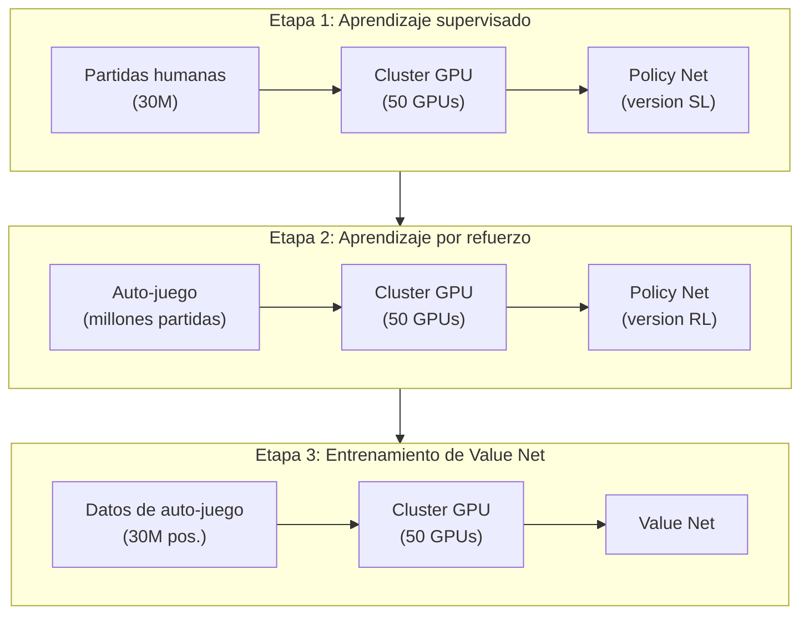
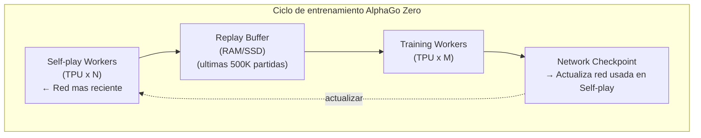
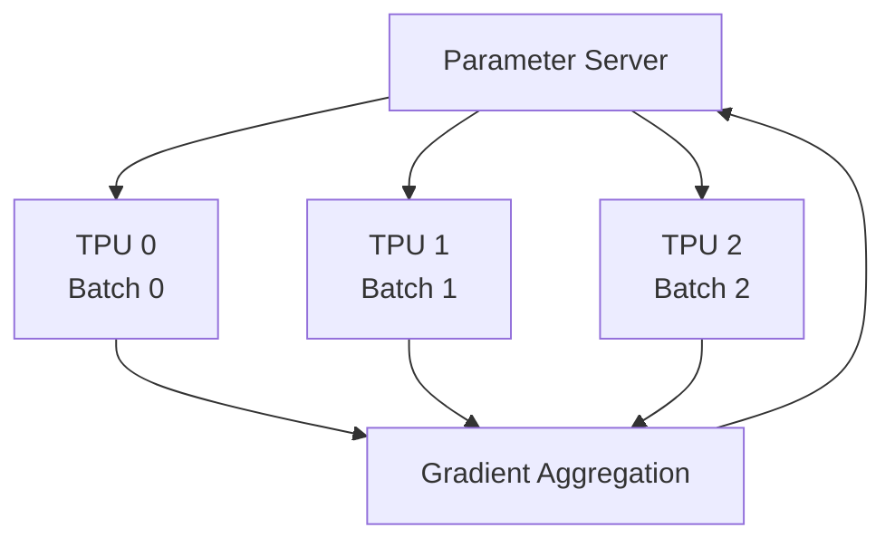
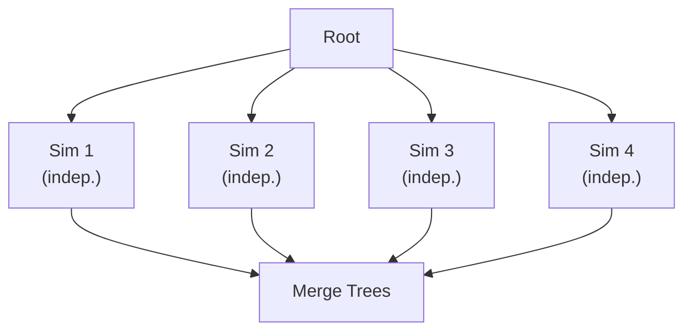
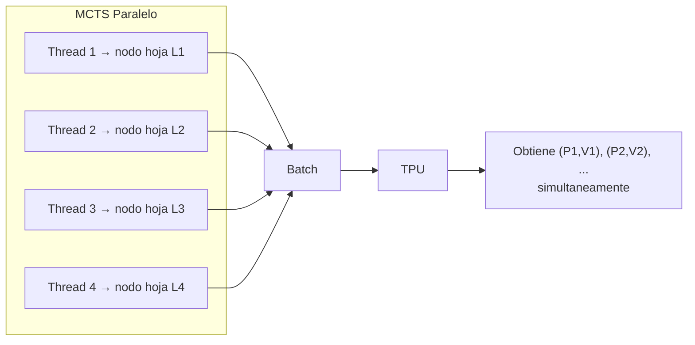
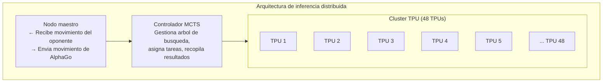

# Sistemas distribuidos y TPU

El éxito de AlphaGo no es solo una victoria algorítmica, sino también una victoria de ingeniería. Para entrenar una IA de Go que supere a los humanos en un tiempo razonable, se necesita un sistema distribuido cuidadosamente diseñado y el soporte de hardware especializado.

Este artículo analizará en profundidad la arquitectura del sistema detrás de AlphaGo, incluyendo el proceso de entrenamiento, la arquitectura de inferencia, MCTS paralelo y el papel crucial de las TPU.

---

## Visión general de la arquitectura de entrenamiento

### Arquitectura de entrenamiento del AlphaGo original

El entrenamiento del AlphaGo original (la versión que derrotó a Lee Sedol) se dividió en múltiples etapas, cada una usando diferentes configuraciones de recursos:



### Arquitectura de entrenamiento de AlphaGo Zero

AlphaGo Zero simplificó enormemente el proceso de entrenamiento, usando un único ciclo de entrenamiento de extremo a extremo:



Las ventajas de esta arquitectura:

1. **Aprendizaje continuo**: Self-play y Training ocurren simultáneamente, sin necesidad de esperar
2. **Eficiencia de recursos**: Todos los recursos hacen trabajo útil
3. **Iteración rápida**: La red se usa inmediatamente para generar nuevos datos después de actualizarse

---

## Estaciones de auto-juego (Self-play Workers)

### Asignación de tareas

Los Self-play Workers son responsables de realizar auto-juego con la red más fuerte actual, produciendo datos de entrenamiento.

| Configuración | AlphaGo Zero |
|---------------|--------------|
| Número de Workers | Decenas |
| Por Worker | 1-4 TPU |
| MCTS por partida | 1600 simulaciones |
| Producción diaria | ~100,000 partidas |

### Flujo de trabajo

El flujo de trabajo de cada Self-play Worker:

```python
while True:
    # 1. Descargar los pesos de red más recientes
    network = download_latest_checkpoint()

    # 2. Realizar múltiples auto-juegos
    for game in range(batch_size):
        positions = []
        board = EmptyBoard()

        while not board.is_terminal():
            # Ejecutar MCTS
            mcts = MCTS(network, board)
            policy = mcts.search(num_simulations=1600)

            # Elegir movimiento
            action = sample(policy)

            # Registrar
            positions.append((board.state, policy))

            # Jugar
            board = board.play(action)

        # 3. Obtener resultado del juego
        result = board.get_result()

        # 4. Subir datos
        upload_to_replay_buffer(positions, result)
```

### Balanceo de carga

Múltiples Workers necesitan balanceo de carga:

- **Sincronización de red**: Todos los Workers usan la misma versión de la red
- **Balance de datos**: Asegurar que los datos de diferentes Workers sean usados
- **Manejo de errores**: El fallo de un Worker no afecta el entrenamiento general

---

## Estaciones de entrenamiento (Training Workers)

### Asignación de tareas

Los Training Workers son responsables de muestrear datos del Replay Buffer y entrenar la red neuronal.

| Configuración | AlphaGo Zero |
|---------------|--------------|
| Número de Workers | 1-4 |
| Por Worker | 4 TPU |
| Batch Size | 2048 (512 por TPU) |
| Pasos de entrenamiento | Decenas de miles por día |

### Entrenamiento distribuido

El entrenamiento a gran escala usa **paralelismo de datos (Data Parallelism)**:



Cada TPU procesa diferentes mini-batches, calcula gradientes locales, luego los agrega para actualizar parámetros globales.

### Actualización síncrona vs. asíncrona

| Tipo de actualización | Ventajas | Desventajas |
|-----------------------|----------|-------------|
| Síncrona | Estable, reproducible | Workers deben esperar al más lento |
| Asíncrona | Alto throughput | Los gradientes pueden estar obsoletos |

AlphaGo Zero usa **actualización síncrona** para asegurar la estabilidad del entrenamiento.

---

## El papel de las TPU

### ¿Qué es una TPU?

**TPU (Tensor Processing Unit)** es un acelerador diseñado por Google específicamente para deep learning:

| Característica | TPU | GPU | CPU |
|----------------|-----|-----|-----|
| Objetivo de diseño | Operaciones matriciales | Paralelismo general | Computación general |
| Precisión | Optimizado FP16/BF16 | FP32/FP16 | FP64/FP32 |
| Consumo | Relativamente bajo | Más alto | El más alto |
| Latencia | Baja | Media | Alta |

### Arquitectura de las TPU

El núcleo de las TPU es la **MXU (Matrix Multiply Unit)**:

**Arquitectura TPU v2/v3:**

| Componente | Especificacion |
|:----------:|:--------------:|
| MXU (Matrix Multiply Unit) | 128 x 128 = 16K MACs/ciclo |
| Vector Unit | Operaciones vectoriales |
| HBM (High Bandwidth Memory) | 16-32 GB |

La MXU puede ejecutar 16K operaciones de multiplicación-acumulación por ciclo, crucial para la multiplicación de matrices de redes neuronales.

### ¿Por qué AlphaGo necesita TPU?

El cuello de botella computacional de la IA de Go está en la **inferencia de red neuronal**:

| Operación | Proporción |
|-----------|------------|
| Forward pass de red neuronal | ~95% |
| Operaciones del árbol MCTS | ~4% |
| Otros | ~1% |

Cada paso de MCTS requiere 1600 inferencias de red neuronal. El alto throughput de las TPU hace esto posible.

### Evolución del uso de TPU

| Versión | TPU de entrenamiento | TPU de inferencia |
|---------|----------------------|-------------------|
| AlphaGo Lee | 50 GPU | 48 TPU (v1) |
| AlphaGo Master | 4 TPU (v2) | 4 TPU (v2) |
| AlphaGo Zero | 4 TPU (v2) | 4 TPU (v2) (escalable) |

El número de TPU usadas por AlphaGo Zero se redujo significativamente, gracias a arquitecturas más eficientes y versiones más nuevas de TPU.

---

## MCTS paralelo y Virtual Loss

### El desafío de la paralelización

La implementación estándar de MCTS es **serial**:

```
for i in range(num_simulations):
    1. Selection: Seleccionar hacia abajo desde la raíz
    2. Expansion: Expandir nodo hoja
    3. Evaluation: Evaluación con red neuronal
    4. Backup: Retropropagar actualizaciones
```

Pero la evaluación de red neuronal es una **operación por lotes** amigable para GPU/TPU. ¿Cómo hacer que múltiples simulaciones ocurran simultáneamente?

### Paralelización de hojas (Leaf Parallelization)

El método de paralelización más simple: ejecutar múltiples simulaciones completas simultáneamente, luego fusionar resultados.



Problema: Cada simulación comienza desde la raíz, explorando repetidamente los mismos caminos.

### Virtual Loss

DeepMind adoptó la técnica de **Virtual Loss** para implementar paralelismo de árbol (Tree Parallelization).

#### Concepto básico

Cuando un hilo está explorando un nodo, reduce temporalmente el valor de ese nodo, haciendo que otros hilos elijan otros caminos.

```
UCB normal: Q(s,a) + c * P(s,a) * sqrt(N(s)) / (1 + N(s,a))

Con virtual loss:
(Q(s,a) * N(s,a) - v * n_virtual) / (N(s,a) + n_virtual) + c * P(s,a) * sqrt(N(s)) / (1 + N(s,a) + n_virtual)
```

Donde:
- `n_virtual` es el número de hilos actualmente explorando ese nodo
- `v` es el valor del virtual loss (usualmente 1 o valor correspondiente a tasa de victoria)

#### Flujo de operación

```
Tiempo T1:
  Thread 1 elige camino A → B → C
  Nodo C recibe virtual loss -1

Tiempo T2:
  Thread 2 elige camino A → B → D (porque C fue "penalizado")
  Nodo D recibe virtual loss -1

Tiempo T3:
  Thread 1 completa evaluación, actualiza valor real de C, remueve virtual loss
  Thread 3 ahora puede elegir C (si el valor real es suficientemente bueno)
```

#### Efecto del virtual loss

| Aspecto | Efecto |
|---------|--------|
| Diversidad de exploración | Fuerza exploración de diferentes caminos |
| Eficiencia de lotes | Puede evaluar múltiples hojas simultáneamente |
| Convergencia | El virtual loss es finalmente cubierto por valores reales, no afecta convergencia |

### Evaluación de red neuronal por lotes

A través del virtual loss, se pueden recoger múltiples nodos hoja pendientes de evaluación para **inferencia por lotes**:



La eficiencia de inferencia por lotes de TPU es mucho mayor que inferencia uno por uno, haciendo posible el MCTS paralelo.

---

## Arquitectura de inferencia

### Configuración durante competencias

Arquitectura de inferencia de AlphaGo en competencias oficiales:

| Versión | Configuración de hardware |
|---------|---------------------------|
| AlphaGo Fan | 176 GPU |
| AlphaGo Lee | 48 TPU + múltiples servidores |
| AlphaGo Master | 4 TPU |
| AlphaGo Zero | 4 TPU (escalable) |

### Flujo de inferencia distribuida

Flujo de inferencia durante competencias (ejemplo de AlphaGo Lee):



### Gestión del tiempo de pensamiento

Estrategia de gestión de tiempo de AlphaGo:

| Posición | Tiempo de pensamiento | Simulaciones MCTS |
|----------|----------------------|-------------------|
| Apertura (con joseki) | Más corto | ~10,000 |
| Medio juego (complejo) | Más largo | ~100,000 |
| Posición simple | Más corto | ~5,000 |
| Byoyomi | Fijo | ~1,600 |

Más simulaciones MCTS generalmente significan mejor calidad de movimiento.

---

## Comunicación y sincronización

### Formato de datos

Formato de transmisión de datos de entrenamiento:

```protobuf
message TrainingExample {
    // Estado del tablero (17 × 19 × 19)
    repeated float board_planes = 1;

    // Resultado de búsqueda MCTS (362)
    repeated float mcts_policy = 2;

    // Resultado del juego (1 = actual gana, -1 = actual pierde)
    float game_result = 3;
}
```

### Requisitos de ancho de banda

| Flujo de datos | Tamaño | Frecuencia |
|----------------|--------|------------|
| Muestra de entrenamiento | ~10 KB/muestra | Miles de muestras/segundo |
| Pesos de red | ~200 MB | Varias veces/hora |
| Mensajes de control | < 1 KB | Continuo |

Requisito total de ancho de banda: ~100 Mbps (red interna suficiente)

### Manejo de fallos

Manejo de fallos en sistemas distribuidos:

| Tipo de fallo | Manejo |
|---------------|--------|
| Worker cae | Reiniciar, continuar usando último checkpoint |
| Desconexión de red | Almacenar en búfer, retransmitir tras reconexión |
| Fallo de TPU | Cambio automático a TPU de respaldo |
| Corrupción de datos | Descartar tras verificación, regenerar |

---

## Análisis de costos

### Estimación de costo de hardware

Estimación de costo de entrenamiento de AlphaGo Zero basada en precios de TPU de Google Cloud:

| Recurso | Cantidad | Precio/hora | Precio total/día |
|---------|----------|-------------|------------------|
| TPU v2 Pod | 4 | ~$32 | ~$3,000 |
| VM alta memoria | Varios | ~$5 | ~$500 |
| Almacenamiento | 10 TB | ~$0.02/GB | ~$200 |
| Red | - | Incluido | - |

**Aproximadamente $3,700/día**, entrenamiento completo (40 días) aproximadamente **$150,000**.

Nota: Esta es una estimación de 2017, DeepMind como subsidiaria de Google puede tener descuentos internos.

### Comparación con entrenamiento humano

| Aspecto | AlphaGo Zero | Jugador profesional humano |
|---------|--------------|----------------------------|
| Alcanzar nivel profesional | 2 días | 10-15 años |
| Costo de entrenamiento | ~$7,500 | Millones (matrícula, gastos, costo de oportunidad) |
| Costo continuo | Electricidad | Gastos de vida |
| Replicabilidad | Perfecta | No replicable |

Por supuesto, esta comparación no es completamente justa: los humanos aprenden más que solo Go durante el proceso.

### Costo de inferencia

Costo de inferencia en competencias oficiales:

| Configuración | Costo por partida |
|---------------|-------------------|
| 48 TPU (AlphaGo Lee) | ~$500 |
| 4 TPU (AlphaGo Zero) | ~$50 |
| GPU única (KataGo) | ~$1 |

El costo de inferencia ha disminuido drásticamente con el progreso tecnológico.

---

## Evolución tecnológica

### De AlphaGo a AlphaZero

| Aspecto | AlphaGo Lee | AlphaGo Zero | AlphaZero |
|---------|-------------|--------------|-----------|
| TPU entrenamiento | 50+ GPU → TPU | 4 TPU | 4 TPU |
| TPU inferencia | 48 TPU | 4 TPU | 4 TPU |
| MCTS/movimiento | ~100,000 | ~1,600 | ~800 |
| Tiempo de entrenamiento | Meses | 40 días | Horas-días |

Mejora de eficiencia de aproximadamente 100 veces.

### Impacto en la comunidad de código abierto

La arquitectura de AlphaGo inspiró múltiples proyectos de código abierto:

| Proyecto | Características |
|----------|-----------------|
| Leela Zero | Entrenamiento distribuido comunitario, replica AlphaGo Zero |
| KataGo | Entrenamiento eficiente en una sola GPU, supera AlphaGo Zero |
| ELF OpenGo | Código abierto de Facebook, usa PyTorch |
| Minigo | Código abierto de Google, usa TensorFlow |

Estos proyectos permiten a investigadores ordinarios entrenar IA de Go potentes.

---

## Correspondencia con animaciones

Conceptos centrales de este artículo y números de animación:

| Número | Concepto | Correspondencia física/matemática |
|--------|----------|-----------------------------------|
| 🎬 C9 | MCTS paralelo | Problema de muchos cuerpos |
| 🎬 E9 | Entrenamiento distribuido | Computación distribuida |
| 🎬 C5 | Virtual loss | Potencial de repulsión |
| 🎬 D15 | Inferencia por lotes | Cálculo vectorizado |

---

## Lecturas adicionales

- **Artículo anterior**: [El proceso de entrenamiento desde cero](../training-from-scratch) — Análisis detallado de la curva de entrenamiento
- **Artículo siguiente**: [El legado de AlphaGo](../legacy-and-impact) — El profundo impacto de AlphaGo en el campo de IA
- **Artículo relacionado**: [Combinación de MCTS y redes neuronales](../mcts-neural-combo) — Conocimientos básicos de MCTS

---

## Referencias

1. Silver, D., et al. (2017). "Mastering the game of Go without human knowledge." *Nature*, 550, 354-359.
2. Jouppi, N., et al. (2017). "In-Datacenter Performance Analysis of a Tensor Processing Unit." *ISCA 2017*.
3. Dean, J., et al. (2012). "Large Scale Distributed Deep Networks." *NeurIPS 2012*.
4. Chaslot, G., et al. (2008). "Parallel Monte-Carlo Tree Search." *CIG 2008*.
5. Segal, R. (2010). "On the Scalability of Parallel UCT." *CIG 2010*.
