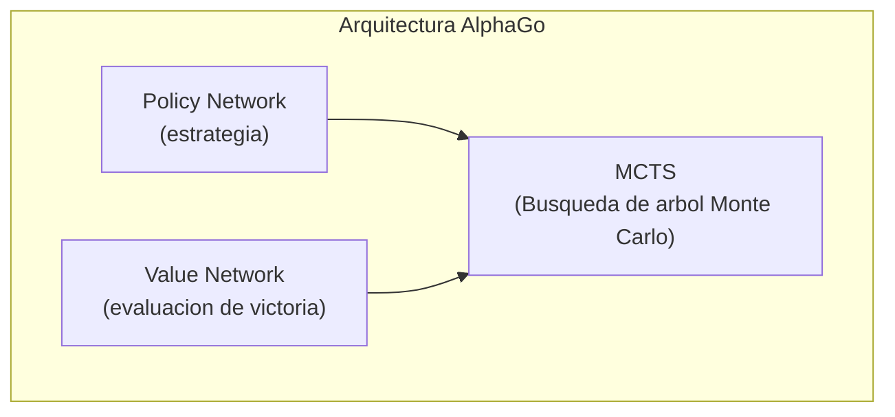
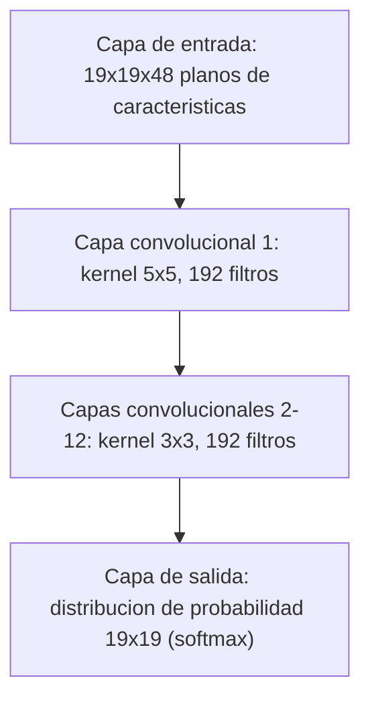
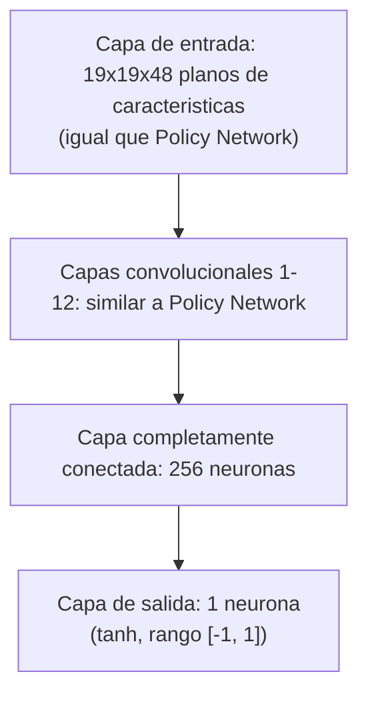
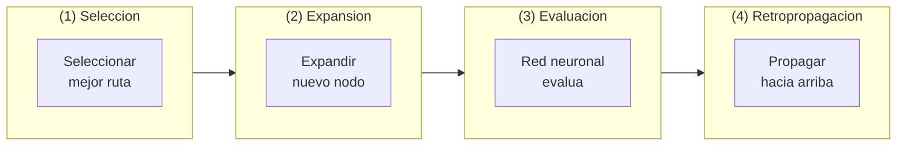
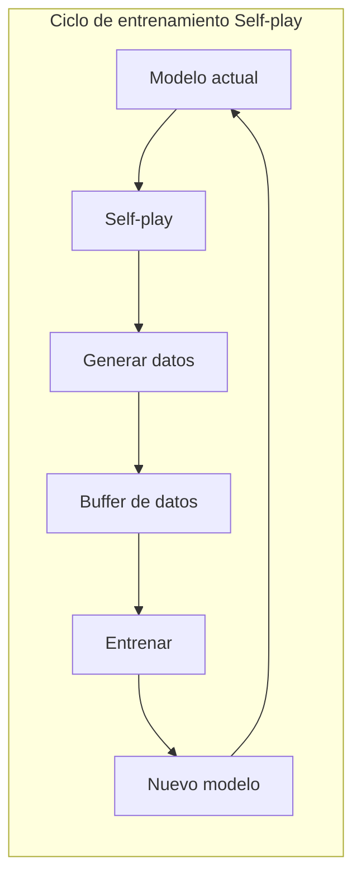
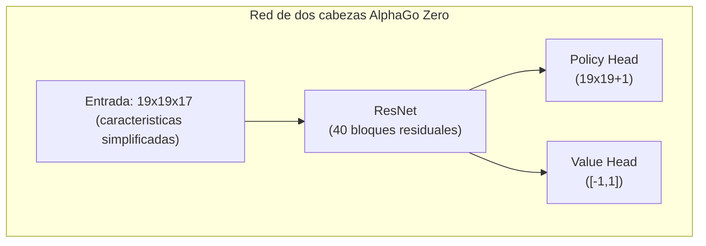

# Analisis del paper de AlphaGo

Este articulo analiza en profundidad el paper clasico publicado en Nature por DeepMind "Mastering the game of Go with deep neural networks and tree search", asi como los papers posteriores de AlphaGo Zero y AlphaZero.

## Significado historico de AlphaGo

El Go fue considerado durante mucho tiempo el desafio "santo grial" de la inteligencia artificial. A diferencia del ajedrez, el espacio de busqueda del Go es extremadamente enorme:

| Juego | Factor de ramificacion promedio | Longitud promedio del juego | Espacio de estados |
|------|-------------|-------------|----------|
| Ajedrez | ~35 | ~80 | ~10^47 |
| Go | ~250 | ~150 | ~10^170 |

Los metodos tradicionales de busqueda por fuerza bruta son completamente inviables en Go. En 2016, AlphaGo derroto a Lee Sedol, demostrando el poderoso poder de la combinacion del aprendizaje profundo y el aprendizaje por refuerzo.

### Eventos hito

- **Octubre 2015**: AlphaGo Fan derrota al campeon europeo Fan Hui (profesional 2-dan) 5:0
- **Marzo 2016**: AlphaGo Lee derrota al campeon mundial Lee Sedol (profesional 9-dan) 4:1
- **Mayo 2017**: AlphaGo Master derrota a Ke Jie, el numero uno del mundo, 3:0
- **Octubre 2017**: Publicacion de AlphaGo Zero, self-play puro, supera todas las versiones anteriores

## Arquitectura tecnica central

La innovacion central de AlphaGo esta en la combinacion de tres tecnologias clave:



### Policy Network (Red de estrategia)

La Policy Network es responsable de predecir la probabilidad de jugar en cada posicion, usada para guiar la direccion de busqueda.

#### Arquitectura de red



#### Caracteristicas de entrada

AlphaGo usa 48 planos de caracteristicas como entrada:

| Caracteristica | Numero de planos | Descripcion |
|------|--------|------|
| Color de piedra | 3 | Piedra negra, piedra blanca, punto vacio |
| Numero de libertades | 8 | 1 libertad, 2 libertades, ..., 8+ libertades |
| Libertades despues de captura | 8 | Cuantas libertades tendria despues de capturar |
| Numero de capturas | 8 | Cuantas piedras se pueden capturar en esa posicion |
| Ko | 1 | Si es posicion de ko |
| Legalidad de jugada | 1 | Si se puede jugar en esa posicion |
| Posiciones de los ultimos 1-8 movimientos | 8 | Posiciones de jugadas anteriores |
| Turno de jugar | 1 | Es turno de negro o blanco |

#### Metodo de entrenamiento

El entrenamiento de Policy Network se divide en dos etapas:

**Primera etapa: Aprendizaje supervisado (SL Policy Network)**
- Usa 30 millones de partidas del servidor de Go KGS
- Objetivo: Predecir la siguiente jugada de jugadores humanos
- Alcanza 57% de precision de prediccion

**Segunda etapa: Aprendizaje por refuerzo (RL Policy Network)**
- Comienza desde SL Policy Network
- Juega contra versiones anteriores de si mismo
- Usa el algoritmo REINFORCE para optimizar

```python
# Actualizacion simplificada de Policy Gradient
# reward: +1 victoria, -1 derrota
loss = -log(policy[action]) * reward
```

### Value Network (Red de valor)

La Value Network evalua la tasa de victoria de la posicion actual, usada para reducir la profundidad de busqueda.

#### Arquitectura de red



#### Metodo de entrenamiento

Value Network se entrena con 30 millones de posiciones generadas por self-play de RL Policy Network:

- Se muestrea aleatoriamente una posicion de cada partida
- Se usa el resultado final de victoria/derrota como etiqueta
- Se usa funcion de perdida MSE

```python
# Entrenamiento de Value Network
value_prediction = value_network(position)
loss = (value_prediction - game_outcome) ** 2
```

**Por que solo se toma una muestra de cada partida?**

Si se toman multiples muestras, las posiciones adyacentes de la misma partida estaran altamente correlacionadas, causando sobreajuste. El muestreo aleatorio asegura la diversidad de los datos de entrenamiento.

## Busqueda de Arbol Monte Carlo (MCTS)

MCTS es el nucleo de decision de AlphaGo, combinando redes neuronales para buscar eficientemente la mejor jugada.

### Cuatro pasos de MCTS



### Formula de seleccion (PUCT)

AlphaGo usa la formula PUCT (Predictor + UCT) para seleccionar que rama explorar:

```
a = argmax[Q(s,a) + u(s,a)]

u(s,a) = c_puct * P(s,a) * sqrt(N(s)) / (1 + N(s,a))
```

Donde:
- **Q(s,a)**: Valor promedio de la accion a (explotacion)
- **P(s,a)**: Probabilidad a priori predicha por Policy Network
- **N(s)**: Numero de visitas al nodo padre
- **N(s,a)**: Numero de visitas a esa accion
- **c_puct**: Constante de exploracion, equilibra exploracion y explotacion

### Detalle del proceso de busqueda

1. **Seleccion**: Desde el nodo raiz, usar formula PUCT para seleccionar acciones hasta llegar al nodo hoja
2. **Expansion**: Expandir nuevos nodos hijos en el nodo hoja, usar Policy Network para inicializar probabilidades a priori
3. **Evaluacion**: Combinar evaluacion de Value Network y simulacion rapida (Rollout) para evaluar el valor
4. **Retropropagacion**: Propagar el valor de evaluacion a lo largo del camino hacia atras, actualizar valores Q y N

### Rollout (Simulacion rapida)

AlphaGo (version no Zero) tambien usa una pequena red de politica rapida para simulacion:

```
Nodo hoja -> Jugadas rapidas aleatorias hasta el final -> Calcular resultado
```

El valor de evaluacion final combina Value Network y Rollout:

```
V = lambda * v_network + (1-lambda) * v_rollout
```

AlphaGo usa lambda = 0.5, dando igual peso a ambos.

## Metodo de entrenamiento Self-play

Self-play es la estrategia de entrenamiento central de AlphaGo, permitiendo que la IA mejore continuamente jugando contra si misma.

### Ciclo de entrenamiento



### Por que Self-play es efectivo?

1. **Datos infinitos**: No esta limitado por la cantidad de partidas humanas
2. **Dificultad adaptativa**: La fuerza del oponente mejora sincronizadamente con la tuya
3. **Exploracion de innovaciones**: No esta limitado por patrones de pensamiento humanos
4. **Objetivo claro**: Optimiza directamente la tasa de victoria, no imita a humanos

## Mejoras de AlphaGo Zero

AlphaGo Zero publicado en 2017 trajo mejoras revolucionarias:

### Diferencias principales

| Caracteristica | AlphaGo | AlphaGo Zero |
|------|---------|--------------|
| Entrenamiento inicial | Aprendizaje supervisado con partidas humanas | Completamente desde cero |
| Arquitectura de red | Policy/Value separados | Red unica de dos cabezas |
| Estructura de red | CNN regular | ResNet |
| Ingenieria de caracteristicas | 48 caracteristicas manuales | 17 caracteristicas simples |
| Rollout | Necesario | No necesario |
| Tiempo de entrenamiento | Varios meses | 3 dias para superar humanos |

### Simplificacion de arquitectura



### Caracteristicas de entrada simplificadas

AlphaGo Zero solo usa 17 planos de caracteristicas:

- 8 planos: Posiciones de tus piedras de los ultimos 8 movimientos
- 8 planos: Posiciones de piedras del oponente de los ultimos 8 movimientos
- 1 plano: Turno actual (todo 0 o todo 1)

### Mejoras de entrenamiento

1. **Self-play puro**: No usa ningun dato humano
2. **Usa directamente probabilidades MCTS como objetivo de entrenamiento**: En lugar de victoria/derrota binaria
3. **Sin Rollout**: Depende completamente de Value Network
4. **Entrenamiento de red unica**: Policy y Value comparten parametros, se refuerzan mutuamente

## Generalizacion de AlphaZero

AlphaZero publicado a finales de 2017 aplico la misma arquitectura a Go, ajedrez y shogi:

### Caracteristicas clave

- **Cero conocimiento de dominio**: No usa ningun conocimiento especifico del dominio excepto las reglas del juego
- **Arquitectura unificada**: El mismo algoritmo aplica a diferentes juegos de tablero
- **Entrenamiento mas rapido**:
  - Go: 8 horas para superar AlphaGo Lee
  - Ajedrez: 4 horas para superar Stockfish
  - Shogi: 2 horas para superar Elmo

### Diferencias con AlphaGo Zero

| Caracteristica | AlphaGo Zero | AlphaZero |
|------|-------------|-----------|
| Juego objetivo | Solo Go | Go, ajedrez, shogi |
| Uso de simetria | Usa simetria 8-fold del Go | No asume simetria |
| Ajuste de hiperparametros | Optimizado para Go | Configuracion general |
| Modo de entrenamiento | Self-play con mejor modelo | Self-play con modelo mas reciente |

## Puntos clave de implementacion

Si quieres implementar un sistema similar, estos son los puntos clave a considerar:

### Recursos de computo

El entrenamiento de AlphaGo requiere enormes recursos de computo:

- **AlphaGo Lee**: 176 GPU + 48 TPU
- **AlphaGo Zero**: 4 TPU (entrenamiento) + 1 TPU (self-play)
- **AlphaZero**: 5000 TPU (entrenamiento)

### Hiperparametros clave

```python
# Relacionados con MCTS
num_simulations = 800     # Numero de simulaciones de busqueda por jugada
c_puct = 1.5              # Constante de exploracion
temperature = 1.0         # Parametro de temperatura para seleccion de accion

# Relacionados con entrenamiento
batch_size = 2048
learning_rate = 0.01      # Con decay
l2_regularization = 1e-4
```

### Problemas comunes

1. **Entrenamiento inestable**: Usar learning rate mas pequeno, aumentar batch size
2. **Sobreajuste**: Asegurar diversidad de datos de entrenamiento, usar regularizacion
3. **Eficiencia de busqueda**: Optimizar inferencia batch GPU, paralelizar MCTS

## Lectura adicional

- [Paper original: Mastering the game of Go with deep neural networks and tree search](https://www.nature.com/articles/nature16961)
- [Paper AlphaGo Zero: Mastering the game of Go without human knowledge](https://www.nature.com/articles/nature24270)
- [Paper AlphaZero: A general reinforcement learning algorithm that masters chess, shogi, and Go through self-play](https://www.science.org/doi/10.1126/science.aar6404)

Despues de entender la tecnologia de AlphaGo, veamos como [KataGo hizo mejoras sobre esta base](./katago-paper.md).

