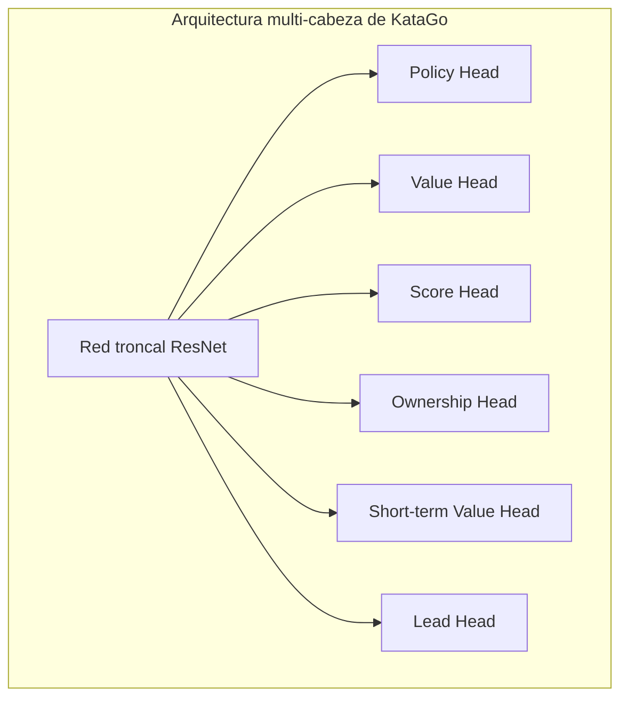
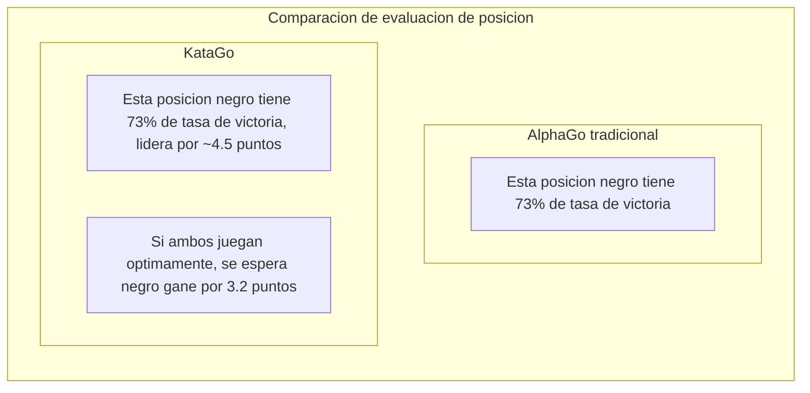

# Analisis del paper de KataGo

KataGo es una IA de Go de codigo abierto desarrollada por David Wu, cuyo paper "Accelerating Self-Play Learning in Go" fue publicado en 2019. KataGo logra fuerza superior a ELF OpenGo con menos recursos de computo, siendo actualmente la IA de Go de codigo abierto mas poderosa.

## Innovaciones de KataGo

KataGo no hizo cambios revolucionarios en la arquitectura de la red neuronal, sino que realizo optimizaciones sistematicas en los metodos de entrenamiento y tareas auxiliares, logrando mejoras significativas en eficiencia.

### Resumen de innovaciones centrales

| Innovacion | Efecto |
|--------|------|
| Objetivos de entrenamiento auxiliares | Acelera el aprendizaje, proporciona mas senales de supervision |
| Estructura de pooling global | Captura mejor la informacion global |
| Soporte para multiples reglas | Un solo modelo se adapta a diferentes reglas de competencia |
| Aleatorizacion de Playout Cap | Mejora la eficiencia de entrenamiento |
| Aumento de datos mejorado | Aumenta la diversidad de datos de entrenamiento |

## Metodos de entrenamiento mas eficientes

### Objetivos de entrenamiento auxiliares (Auxiliary Training Targets)

El AlphaGo Zero tradicional solo tiene dos objetivos de entrenamiento:
1. Policy: Predecir la distribucion de probabilidad de jugadas de MCTS
2. Value: Predecir el resultado del juego

KataGo agrega multiples objetivos de entrenamiento auxiliares, proporcionando senales de aprendizaje mas ricas:



#### Descripcion de cada cabeza de salida

| Cabeza de salida | Dimension | Objetivo de prediccion |
|--------|------|----------|
| **Policy** | 19x19+1 | Probabilidad de jugar en cada posicion (incluye pass) |
| **Value** | 3 | Probabilidad de victoria/derrota/empate |
| **Score** | Valor continuo | Predecir diferencia de puntos final |
| **Ownership** | 19x19 | Pertenencia final de cada punto (territorio negro/blanco) |
| **Short-term Value** | 1 | Tasa de victoria esperada a corto plazo |
| **Lead** | 1 | Cuantos puntos se lidera actualmente |

### Por que los objetivos auxiliares son efectivos?

1. **Senales de supervision mas densas**: Value solo proporciona un valor, mientras Ownership proporciona 361 puntos de supervision
2. **Reduce sobreajuste**: El aprendizaje multitarea tiene efecto de regularizacion
3. **Acelera convergencia**: Las tareas auxiliares ayudan a la red a aprender representaciones de caracteristicas utiles mas rapido
4. **Proporciona mejores gradientes**: Evita problemas de desvanecimiento de gradientes

### Aleatorizacion de Playout Cap

AlphaGo Zero realiza 800 simulaciones MCTS fijas por jugada. KataGo introduce aleatorizacion:

```python
# Forma tradicional
num_playouts = 800  # Fijo

# Forma KataGo
playout_cap = random.choice([
    100, 200, 300, 400, 500, 600, 700, 800
])
```

**Beneficios**:
- Los datos de entrenamiento son mas diversos
- El modelo aprende a hacer juicios razonables con diferentes profundidades de busqueda
- Incluso con menos busqueda en el juego real puede funcionar bien

### Mejoras de aumento de datos

Los metodos tradicionales usan la simetria 8-fold del Go (4 rotaciones x 2 reflexiones) para aumento de datos. KataGo mejora aun mas:

- **Transformaciones de simetria aleatorias**: Seleccion aleatoria de transformacion de simetria en cada muestreo
- **Aleatorizacion de estados historicos**: Seleccion aleatoria de la forma de representar el tablero historico
- **Aleatorizacion de color**: Intercambio aleatorio de perspectiva negro/blanco

## Soporte para multiples reglas de Go

Esta es una de las caracteristicas importantes de KataGo. Diferentes reglas de Go afectan las decisiones estrategicas:

### Principales diferencias de reglas

| Sistema de reglas | Metodo de puntuacion | Komi | Regla de ko | Suicidio |
|---------|---------|------|---------|------|
| Reglas chinas | Conteo por area | 7.5 puntos | Ko simple | Prohibido |
| Reglas japonesas | Conteo por territorio | 6.5 puntos | Superko | Prohibido |
| Reglas coreanas | Conteo por territorio | 6.5 puntos | Superko | Prohibido |
| Reglas Ing | Conteo por area | 8 puntos | Regla especial de ko | Prohibido |
| Tromp-Taylor | Conteo por area | Ajustable | Superko | Permitido |
| Reglas AGA | Area/territorio | 7.5 puntos | Superko | Prohibido |
| Reglas de Nueva Zelanda | Conteo por area | 7 puntos | Ko simple | Permitido |

### Implementacion tecnica

KataGo codifica la informacion de reglas como caracteristicas de entrada:

```python
# Ejemplo de caracteristicas de entrada relacionadas con reglas
rule_features = {
    'komi': 7.5,           # Valor de komi
    'scoring_rule': 'area', # Area/territorio
    'ko_rule': 'simple',    # Regla de ko
    'suicide_allowed': False,
    'tax_rule': 'none',     # Si hay impuesto de "ojo"
    # ...
}
```

La red aprende a ajustar la estrategia segun diferentes reglas. Por ejemplo:
- Bajo conteo por territorio se enfoca mas en control de territorio
- Cuando se permite suicidio puede usarse para tacticas especiales
- Diferente komi afecta las elecciones de apertura

## Prediccion simultanea de tasa de victoria y puntos

Esta es una de las funciones mas practicas de KataGo, muy valiosa para la ensenanza y analisis de Go.

### Value vs Score



### Valor de aplicacion practica

1. **Juicio de posicion mas preciso**:
   - 80% tasa de victoria pero solo lidera 1 punto -> Aun hay variables
   - 80% tasa de victoria y lidera 20 puntos -> Partida decidida

2. **Asistencia de ensenanza**:
   - Permite a los estudiantes entender "cuantos puntos perdio" una jugada
   - Comparar diferencias de puntos entre diferentes jugadas

3. **Analisis de partidas con handicap**:
   - Evaluar con precision si el handicap es apropiado
   - Juzgar si jugar ataque o defensa

### Distribucion de Score

KataGo no solo predice un numero unico de puntos, sino que predice la distribucion completa de puntos:

```
Ejemplo de distribucion de puntos:
├─ Negro gana 10+ puntos: 15%
├─ Negro gana 5-10 puntos: 25%
├─ Negro gana 0-5 puntos: 20%
├─ Blanco gana 0-5 puntos: 18%
├─ Blanco gana 5-10 puntos: 15%
└─ Blanco gana 10+ puntos: 7%

Valor esperado: Negro +3.2 puntos
Desviacion estandar: +/-8.5 puntos
```

Esta informacion de distribucion puede reflejar mejor la complejidad e incertidumbre de la posicion.

## Mapa de Ownership (Territorio)

Ownership predice si cada punto pertenecera a negro o blanco al final:

```
                  Mapa de Ownership
    A B C D E F G H J K L M N O P Q R S T
19  ○ ○ ○ ○ ○ ○ · · · · · · · ● ● ● ● ● ●
18  ○ ○ ○ ○ ○ ○ · · · · · · · ● ● ● ● ● ●
17  ○ ○ ○ ○ ○ · · · · · · · · · ● ● ● ● ●
16  ○ ○ ○ ╋ · · · · · ╋ · · · · · ╋ ● ● ●
...

Leyenda: ○ = Territorio blanco  ● = Territorio negro  · = Indefinido
```

### Escenarios de aplicacion

- **Analisis de posicion**: Ver de un vistazo las esferas de influencia de ambos lados
- **Juicio de vida y muerte**: Juzgar si un grupo aun puede salvarse
- **Calculo de yose**: Evaluar el valor del yose en cada lugar
- **Demostracion de ensenanza**: Visualizar el concepto de territorio

## Comparacion de diferencias con AlphaGo

| Aspecto | AlphaGo Zero | KataGo |
|------|-------------|--------|
| **Objetivos de entrenamiento** | Policy + Value | Multiples objetivos auxiliares |
| **Informacion de salida** | Tasa de victoria | Tasa de victoria + puntos + territorio |
| **Soporte de reglas** | Regla unica | Multiples reglas |
| **Estructura de red** | ResNet convolucional puro | Agrega pooling global |
| **Cantidad de busqueda** | Fija | Aleatoria |
| **Eficiencia de entrenamiento** | Linea base | Aproximadamente 50 veces mas eficiente |
| **Grado de codigo abierto** | Descripcion del paper | Codigo abierto completo |

### Comparacion de eficiencia de entrenamiento

```
Recursos necesarios para alcanzar nivel de ELF OpenGo:

ELF OpenGo:
- 2000 GPU
- 2 semanas de entrenamiento

KataGo:
- 1 GPU (o decenas de GPU para acelerar)
- Dias a semanas

Mejora de eficiencia: aproximadamente 50-100 veces
```

## Detalles de arquitectura de red

### Pooling global (Global Pooling)

La CNN tradicional solo puede ver informacion local, KataGo agrega capas de pooling global para capturar caracteristicas globales:

```python
class GlobalPoolingBlock(nn.Module):
    def forward(self, x):
        # x: [batch, channels, 19, 19]

        # Pooling promedio global
        global_avg = x.mean(dim=[2, 3])  # [batch, channels]

        # Pooling maximo global
        global_max = x.max(dim=2)[0].max(dim=1)[0]  # [batch, channels]

        # Combinar caracteristicas globales
        global_features = torch.cat([global_avg, global_max], dim=1)

        # Procesar caracteristicas globales
        global_features = dense_layer(global_features)  # [batch, C]

        # Transmitir caracteristicas globales de vuelta a dimensiones espaciales
        global_features = global_features.view(batch, -1, 1, 1)
        global_features = global_features.expand(-1, -1, 19, 19)

        return torch.cat([x, global_features], dim=1)
```

**Beneficios**:
- Puede percibir la situacion global (como quien esta liderando)
- Mejor manejo de posiciones que requieren juicio global
- Particularmente util para prediccion de puntos

### Escala de red

KataGo proporciona modelos de diferentes tamanos:

| Modelo | Bloques residuales | Canales | Parametros | Escenario adecuado |
|------|---------|--------|--------|----------|
| b10c128 | 10 | 128 | ~5M | Ejecucion en CPU |
| b15c192 | 15 | 192 | ~15M | GPU general |
| b20c256 | 20 | 256 | ~35M | GPU de gama media |
| b40c256 | 40 | 256 | ~70M | GPU de gama alta |
| b60c320 | 60 | 320 | ~150M | GPU de gama superior |

## Rendimiento real

### Evaluacion de fuerza

Rendimiento de KataGo en varias pruebas:

- Supera a todas las redes de Leela Zero
- Mantiene alta tasa de victoria contra profesionales 9-dan
- Numero uno en CGOS (Computer Go Server)

### Funciones de analisis

El modo de analisis de KataGo proporciona:

```json
{
  "moveInfos": [
    {
      "move": "Q16",
      "visits": 3420,
      "winrate": 0.573,
      "scoreLead": 2.8,
      "pv": ["Q16", "D4", "Q4", "D16"],
      "ownership": [...]
    }
  ],
  "rootInfo": {
    "winrate": 0.48,
    "scoreLead": -0.5,
    "visits": 10000
  }
}
```

## Lectura adicional

- [Paper de KataGo: Accelerating Self-Play Learning in Go](https://arxiv.org/abs/1902.10565)
- [Proyecto GitHub de KataGo](https://github.com/lightvector/KataGo)
- [Registro de entrenamiento y analisis de KataGo](https://katagotraining.org/)

Despues de conocer las caracteristicas tecnicas de KataGo, veamos el [desarrollo de otras IAs de Go](./zen.md) para tener una comprension mas completa de toda la industria.

