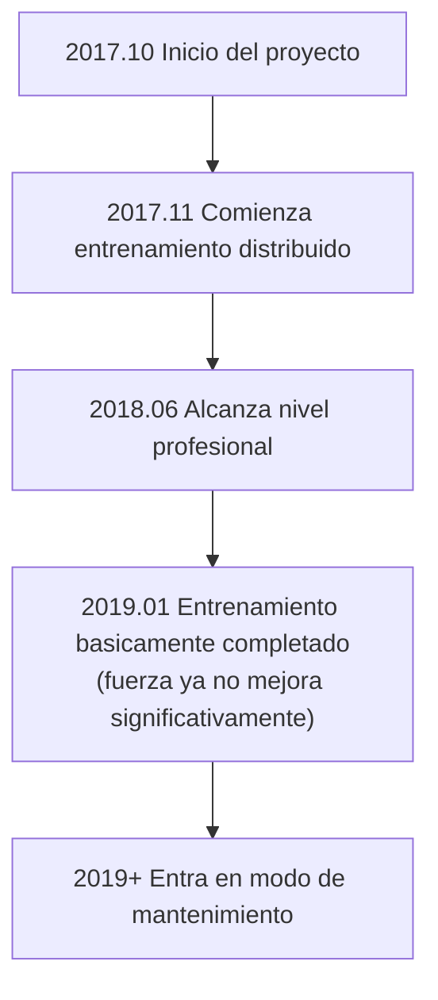

# Introduccion a otras IAs de Go

Ademas de AlphaGo y KataGo, el campo de IA de Go tiene muchos otros proyectos importantes. Este articulo presentara las principales IAs comerciales y de codigo abierto, ayudandote a entender todo el ecosistema.

## IAs de Go comerciales

### Zen (Tianding)

**Desarrollador**: Yoji Ojima / Japon
**Primera publicacion**: 2009
**Licencia**: Comercial

Zen fue uno de los programas de Go mas fuertes antes de AlphaGo, ya alcanzando nivel profesional en la era tradicional de MCTS.

#### Historia de desarrollo

| Tiempo | Version | Hito |
|------|------|--------|
| 2009 | Zen 1.0 | Primera publicacion |
| 2011 | Zen 4 | Alcanza nivel 6 dan amateur |
| 2012 | Zen 5 | Derrota a Takemiya Masaki 9-dan con 4 piedras de handicap |
| 2016 | Zen 7 | Adopta tecnologia de aprendizaje profundo |
| 2017+ | Deep Zen Go | Combina arquitectura de AlphaGo |

#### Caracteristicas tecnicas

- **Arquitectura hibrida**: Combina heuristicas tradicionales con aprendizaje profundo
- **Optimizacion comercial**: Optimizado para hardware de consumo
- **Alta estabilidad**: Verificado por anos de uso comercial
- **Soporte multiplataforma**: Funciona en Windows, macOS

#### Forma del producto

- **Tengen (Go de Zenith)**: Software de escritorio, precio aproximadamente 10,000 yenes
- **Juego en linea**: Activo en KGS con la cuenta Zen19

---

### Fine Art (Jueyi)

**Desarrollador**: Tencent AI Lab / China
**Primera publicacion**: 2016
**Licencia**: No publica

Fine Art es la IA de Go desarrollada por Tencent, con importante influencia en el mundo del Go chino.

#### Historia de desarrollo

| Tiempo | Evento |
|------|------|
| Noviembre 2016 | Primera aparicion, jugando en la plataforma Fox Go |
| Marzo 2017 | Campeon de la Copa UEC de Go por computadora |
| 2017 | Adoptado por el equipo nacional de Go de China como herramienta de entrenamiento |
| 2018 | Campeon del Campeonato Mundial de IA de Go |
| Hasta hoy | Continua como asistente de entrenamiento del equipo nacional |

#### Caracteristicas tecnicas

- **Entrenamiento a gran escala**: Usa recursos de computacion en la nube de Tencent
- **Cooperacion con humanos de primer nivel**: Obtiene mucha orientacion profesional
- **Rica experiencia en partidas reales**: Acumulo muchas partidas en Fox Go
- **Funcion de ensenanza integrada**: Proporciona funcion de analisis de revision

#### Influencia

La influencia de Fine Art en el Go profesional chino es profunda:

- Se convirtio en herramienta de entrenamiento estandar del equipo nacional
- Cambio la forma de preparacion de los jugadores profesionales
- Impulso la popularizacion del entrenamiento asistido por IA

---

### Golaxy (Xingzhen)

**Desarrollador**: Shenke Technology / Equipo de la Universidad Tsinghua de China
**Primera publicacion**: 2018
**Licencia**: Comercial

Golaxy fue disenado con el objetivo de ser "la IA mas parecida a los humanos", con un estilo mas cercano a los jugadores humanos.

#### Caracteristicas tecnicas

- **Estilo humanizado**: Entrenado deliberadamente para jugar de forma mas parecida a humanos
- **Dificultad ajustable**: Puede simular oponentes de diferentes niveles
- **Orientado a la ensenanza**: Disenado considerando aplicaciones de ensenanza
- **Especializacion en handicap**: Optimizacion especial en partidas con handicap

#### Aplicaciones del producto

- **Yike Go**: Integrado en la app Yike
- **Plataforma de ensenanza**: Usado para ensenanza de Go en linea
- **Prueba de nivel**: Proporciona evaluacion estandarizada de nivel

---

### Otras IAs comerciales

| Nombre | Desarrollador | Caracteristicas |
|------|--------|------|
| **Shizi Xuanfeng** | Lin Zaifan (Taiwan) | Campeon de la Copa UEC |
| **CGI** | Universidad Chiao Tung (Taiwan) | Orientado a investigacion academica |
| **Dolbaram** | NHN de Corea | Integrado en plataforma de Go coreana |
| **AQ** | Equipo AQ de Japon | Paso de codigo abierto a comercial |

## IAs de Go de codigo abierto

### Leela Zero

**Desarrollador**: Gian-Carlo Pascutto / Belgica
**Primera publicacion**: 2017
**Licencia**: GPL-3.0
**GitHub**: https://github.com/leela-zero/leela-zero

Leela Zero es el primer proyecto de codigo abierto en replicar exitosamente AlphaGo Zero, entrenado de forma distribuida por la comunidad.

#### Historia de desarrollo



#### Caracteristicas tecnicas

- **Replicacion fiel**: Implementacion estricta segun el paper de AlphaGo Zero
- **Entrenamiento distribuido**: Voluntarios globales contribuyen computo GPU
- **Completamente transparente**: Todos los datos de entrenamiento y modelos son publicos
- **GTP estandar**: Compatible con todo el software de Go GTP

#### Estadisticas de entrenamiento

| Item | Valor |
|------|------|
| Total de partidas self-play | Aproximadamente 18 millones |
| Iteraciones de entrenamiento | Aproximadamente 270 |
| Contribuidores participantes | Miles |
| Duracion del entrenamiento | Aproximadamente 1.5 anos |

#### Forma de uso

```bash
# Instalacion
brew install leela-zero  # macOS

# Ejecucion
leelaz --gtp --weights best-network.gz

# Comandos GTP
genmove black
play white D4
```

#### Estado actual

Aunque Leela Zero ya no se entrena activamente, pero:
- El codigo sigue siendo un excelente recurso para aprender AlphaGo Zero
- Los modelos entrenados aun pueden usarse
- La comunidad aun mantiene funcionalidad basica

---

### ELF OpenGo

**Desarrollador**: Facebook AI Research (FAIR)
**Primera publicacion**: 2018
**Licencia**: BSD
**GitHub**: https://github.com/pytorch/ELF

ELF OpenGo es la IA de Go desarrollada por Facebook, demostrando la capacidad de entrenamiento distribuido a gran escala.

#### Caracteristicas tecnicas

- **Framework ELF**: Basado en la plataforma de investigacion de juegos ELF (Extensive, Lightweight, and Flexible) de Facebook
- **Entrenamiento a gran escala**: Usa 2000 GPU para entrenar
- **Implementacion PyTorch**: Usa el framework de aprendizaje profundo propio de Facebook
- **Orientado a investigacion**: El proposito principal es investigacion, no uso practico

#### Rendimiento

- Alcanza nivel superior en KGS
- Tasa de victoria estable contra profesionales 9-dan
- Paper publicado en conferencia de primer nivel

#### Estado actual

- El proyecto ya no se mantiene activamente
- Codigo y modelos aun pueden descargarse
- Valor principal en referencia academica

---

### SAI (Sensible Artificial Intelligence)

**Desarrollador**: Equipo SAI / Europa
**Primera publicacion**: 2019
**Licencia**: MIT
**GitHub**: https://github.com/sai-dev/sai

SAI es una version mejorada basada en Leela Zero, enfocada en funciones experimentales.

#### Caracteristicas tecnicas

- **Metodos de entrenamiento mejorados**: Experimenta con varias optimizaciones de entrenamiento
- **Soporte para mas reglas**: Soporta mas reglas de Go que Leela Zero
- **Funciones experimentales**: Prueba nuevas arquitecturas de red y tecnicas de entrenamiento

#### Estado actual

- Aun tiene mantenimiento de comunidad a pequena escala
- Principalmente usado para experimentacion y aprendizaje

---

### PhoenixGo

**Desarrollador**: Equipo WeChat de Tencent
**Primera publicacion**: 2018
**Licencia**: BSD-3
**GitHub**: https://github.com/Tencent/PhoenixGo

PhoenixGo es la IA de Go de codigo abierto de Tencent, campeon del Campeonato Mundial de IA de Go 2018.

#### Caracteristicas tecnicas

- **Calidad de nivel comercial**: Proviene de proyecto interno de Tencent
- **Implementacion TensorFlow**: Usa framework mainstream
- **Soporte multiplataforma**: Linux, Windows, macOS
- **Soporte distribuido**: Puede ejecutarse en entorno multi-maquina multi-GPU

#### Forma de uso

```bash
# Compilacion
bazel build //src:mcts_main

# Ejecucion
./mcts_main --gtp --config_path=config.conf
```

---

### MiniGo

**Desarrollador**: Google Brain
**Primera publicacion**: 2018
**Licencia**: Apache-2.0
**GitHub**: https://github.com/tensorflow/minigo

MiniGo es una IA de Go de codigo abierto de Google con proposito educativo, destinada a que mas personas entiendan los principios de AlphaGo.

#### Caracteristicas tecnicas

- **Orientado a educacion**: Codigo claro y facil de leer
- **Implementacion TensorFlow**: Ejemplo oficial de Google
- **Documentacion completa**: Tiene explicaciones tecnicas detalladas
- **Soporte Colab**: Puede ejecutarse directamente en Google Colab

#### Escenarios adecuados

- Aprender arquitectura AlphaGo Zero
- Entender aplicacion de aprendizaje por refuerzo en juegos
- Como punto de partida para tu propio proyecto

## Comparacion de caracteristicas de cada IA

### Comparacion de fuerza (estimacion aproximada)

| IA | Nivel de fuerza | Notas |
|----|---------|------|
| KataGo | Sobrehumano superior | Continua entrenando |
| Fine Art | Sobrehumano superior | No publico |
| Leela Zero | Sobrehumano | Entrenamiento detenido |
| ELF OpenGo | Sobrehumano | Entrenamiento detenido |
| PhoenixGo | Cuasi-sobrehumano | Entrenamiento detenido |
| Zen | Nivel profesional | Producto comercial |
| Golaxy | Nivel profesional | Dificultad ajustable |

### Comparacion de funciones

| Funcion | KataGo | Leela Zero | PhoenixGo | Zen |
|------|--------|------------|-----------|------|
| Codigo abierto | Si | Si | Si | No |
| Prediccion de puntos | Si | No | No | Parcial |
| Soporte multiples reglas | Si | No | No | No |
| Analysis API | Si | No | No | No |
| Modo CPU | Si | Si | Si | Si |
| Actualizaciones continuas | Si | No | No | Parcial |

### Sugerencias de escenarios adecuados

| Necesidad | Seleccion recomendada | Razon |
|------|---------|------|
| Juego/analisis general | KataGo | Mas fuerte y funciones mas completas |
| Aprender AlphaGo | Leela Zero / MiniGo | Codigo claro |
| Aplicacion comercial | Zen / Entrenar KataGo propio | Licencia clara |
| Asistencia de ensenanza | KataGo / Golaxy | Funciones de analisis ricas |
| Experimentacion de investigacion | KataGo / SAI | Se puede modificar entrenamiento |

## Tendencias de desarrollo futuro

### Tendencias tecnologicas

1. **Metodos de entrenamiento mas eficientes**
   - Como mostro la mejora de eficiencia de KataGo
   - Alcanzar mayor fuerza con menos recursos

2. **Mejor explicabilidad**
   - Explicar por que la IA juega esta jugada
   - Ayudar a los humanos a entender el pensamiento de la IA

3. **Combinacion con estilo humano**
   - Entrenar IA con estilo mas parecido a jugadores especificos
   - Usado para ensenanza e investigacion

4. **Generalidad entre juegos**
   - Como mostro AlphaZero
   - Un solo framework aplicable a multiples juegos

### Tendencias de aplicacion

1. **Popularizacion**
   - Mas aficionados al Go usan analisis de IA
   - Puede ejecutarse en telefonos y otros dispositivos

2. **Especializacion**
   - Jugadores profesionales dependen profundamente del entrenamiento con IA
   - Asistencia de IA se convierte en estandar

3. **Comercializacion**
   - Mas productos de Go asistidos por IA
   - Servicios de ensenanza, analisis, companero de practica, etc.

## Resumen

El ecosistema de IA de Go es rico y diverso:

- **Quieres la fuerza mas alta y funciones mas completas**: Elige KataGo
- **Quieres aprender principios de IA**: Estudia el codigo de Leela Zero o MiniGo
- **Necesidad de aplicacion comercial**: Evalua Zen o entrena tu propio modelo
- **Necesidades especiales**: Elige o combina segun la situacion especifica

A continuacion, entremos en la practica y aprendamos como [instalar y usar KataGo](/docs/for-engineers/katago-source/).

