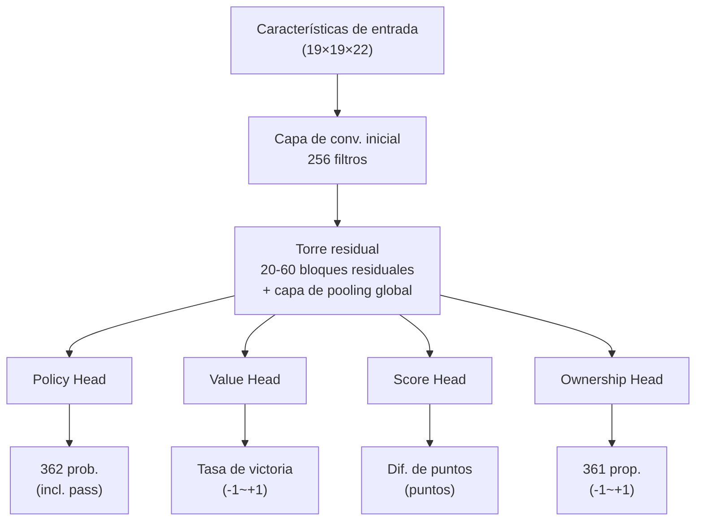
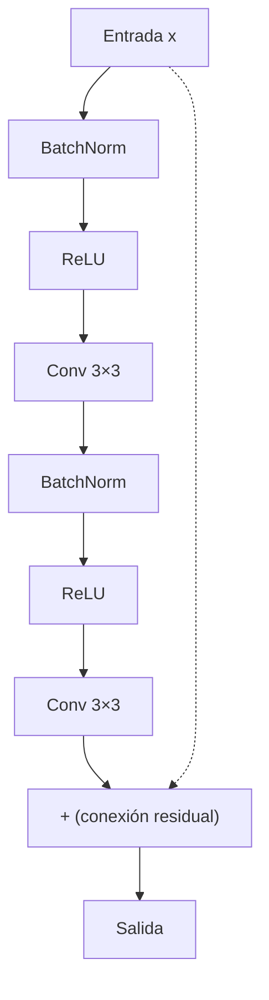

# Arquitectura de redes neuronales en detalle

Este artículo analiza en profundidad la arquitectura completa de la red neuronal de KataGo, desde la codificación de características de entrada hasta el diseño de salida múltiple.

---

## Visión general de la arquitectura

KataGo utiliza un diseño de **red neuronal única con salida múltiple**:



---

## Codificación de características de entrada

### Visión general de planos de características

KataGo utiliza **22 planos de características** (19×19×22), cada plano es una matriz de 19×19:

| Plano | Contenido | Descripción |
|-------|-----------|-------------|
| 0 | Piedras propias | 1 = hay piedra propia, 0 = no |
| 1 | Piedras del oponente | 1 = hay piedra del oponente, 0 = no |
| 2 | Puntos vacíos | 1 = punto vacío, 0 = hay piedra |
| 3-10 | Estado histórico | Cambios del tablero en los últimos 8 movimientos |
| 11 | Punto de ko | 1 = este punto es ko prohibido, 0 = jugable |
| 12-17 | Codificación de libertades | Cadenas con 1, 2, 3... libertades |
| 18-21 | Codificación de reglas | Reglas chinas/japonesas, komi, etc. |

### Apilamiento de estado histórico

Para que la red neuronal entienda los **cambios dinámicos** de la posición, KataGo apila los estados del tablero de los últimos 8 movimientos:

```python
# Codificación de estado histórico (concepto)
def encode_history(game_history, current_player):
    features = []

    for t in range(8):  # Últimos 8 movimientos
        if t < len(game_history):
            board = game_history[-(t+1)]
            # Codificar piedras propias/oponente en ese momento
            features.append(encode_board(board, current_player))
        else:
            # Historia insuficiente, rellenar con ceros
            features.append(np.zeros((19, 19)))

    return np.stack(features, axis=0)
```

### Codificación de reglas

KataGo soporta múltiples reglas, comunicándolas a la red neuronal a través de planos de características:

```python
# Codificación de reglas (concepto)
def encode_rules(rules, komi):
    rule_features = np.zeros((4, 19, 19))

    # Tipo de regla (one-hot)
    if rules == "chinese":
        rule_features[0] = 1.0
    elif rules == "japanese":
        rule_features[1] = 1.0

    # Komi normalizado
    normalized_komi = komi / 15.0  # Normalizado a [-1, 1]
    rule_features[2] = normalized_komi

    # Jugador actual
    rule_features[3] = 1.0 if current_player == BLACK else 0.0

    return rule_features
```

---

## Red troncal: Torre residual

### Estructura del bloque residual

KataGo utiliza la estructura **Pre-activation ResNet**:



### Ejemplo de código

```python
class ResidualBlock(nn.Module):
    def __init__(self, channels):
        super().__init__()
        self.bn1 = nn.BatchNorm2d(channels)
        self.conv1 = nn.Conv2d(channels, channels, 3, padding=1)
        self.bn2 = nn.BatchNorm2d(channels)
        self.conv2 = nn.Conv2d(channels, channels, 3, padding=1)

    def forward(self, x):
        residual = x

        out = self.bn1(x)
        out = F.relu(out)
        out = self.conv1(out)

        out = self.bn2(out)
        out = F.relu(out)
        out = self.conv2(out)

        return out + residual  # Conexión residual
```

### Capa de pooling global

Una de las innovaciones clave de KataGo: agregar **pooling global** en los bloques residuales, permitiendo que la red vea información global:

```python
class GlobalPoolingBlock(nn.Module):
    def __init__(self, channels):
        super().__init__()
        self.conv = nn.Conv2d(channels, channels, 3, padding=1)
        self.fc = nn.Linear(channels, channels)

    def forward(self, x):
        # Ruta local
        local = self.conv(x)

        # Ruta global
        global_pool = x.mean(dim=[2, 3])  # Pooling promedio global
        global_fc = self.fc(global_pool)
        global_broadcast = global_fc.unsqueeze(2).unsqueeze(3)
        global_broadcast = global_broadcast.expand(-1, -1, 19, 19)

        # Fusión
        return local + global_broadcast
```

**¿Por qué se necesita pooling global?**

Las convoluciones tradicionales solo ven localmente (campo receptivo 3×3), incluso apilando muchas capas, la percepción de información global sigue siendo limitada. El pooling global permite que la red "vea" directamente:
- La diferencia de cantidad de piedras en todo el tablero
- La distribución global de influencia
- El juicio general de la posición

---

## Diseño de cabezas de salida

### Policy Head (Cabeza de política)

Produce la probabilidad de jugar en cada posición:

```python
class PolicyHead(nn.Module):
    def __init__(self, in_channels):
        super().__init__()
        self.conv = nn.Conv2d(in_channels, 2, 1)  # Conv. 1×1
        self.bn = nn.BatchNorm2d(2)
        self.fc = nn.Linear(2 * 19 * 19, 362)  # 361 + pass

    def forward(self, x):
        out = F.relu(self.bn(self.conv(x)))
        out = out.view(out.size(0), -1)
        out = self.fc(out)
        return F.softmax(out, dim=1)  # Distribución de probabilidad
```

**Formato de salida**: Vector de 362 dimensiones
- Índices 0-360: Probabilidad de jugar en las 361 posiciones del tablero
- Índice 361: Probabilidad de pasar

### Value Head (Cabeza de valor)

Produce la tasa de victoria de la posición actual:

```python
class ValueHead(nn.Module):
    def __init__(self, in_channels):
        super().__init__()
        self.conv = nn.Conv2d(in_channels, 1, 1)
        self.bn = nn.BatchNorm2d(1)
        self.fc1 = nn.Linear(19 * 19, 256)
        self.fc2 = nn.Linear(256, 1)

    def forward(self, x):
        out = F.relu(self.bn(self.conv(x)))
        out = out.view(out.size(0), -1)
        out = F.relu(self.fc1(out))
        out = torch.tanh(self.fc2(out))  # Salida de -1 a +1
        return out
```

**Formato de salida**: Valor único [-1, +1]
- +1: Victoria segura propia
- -1: Victoria segura del oponente
- 0: Posición equilibrada

### Score Head (Cabeza de puntuación)

Exclusivo de KataGo, predice la diferencia final de puntos:

```python
class ScoreHead(nn.Module):
    def __init__(self, in_channels):
        super().__init__()
        self.conv = nn.Conv2d(in_channels, 1, 1)
        self.bn = nn.BatchNorm2d(1)
        self.fc1 = nn.Linear(19 * 19, 256)
        self.fc2 = nn.Linear(256, 1)

    def forward(self, x):
        out = F.relu(self.bn(self.conv(x)))
        out = out.view(out.size(0), -1)
        out = F.relu(self.fc1(out))
        out = self.fc2(out)  # Salida sin restricción
        return out
```

**Formato de salida**: Valor único (puntos)
- Positivo: Ventaja propia
- Negativo: Ventaja del oponente

### Ownership Head (Cabeza de propiedad)

Predice la propiedad final de cada punto:

```python
class OwnershipHead(nn.Module):
    def __init__(self, in_channels):
        super().__init__()
        self.conv1 = nn.Conv2d(in_channels, 32, 1)
        self.bn = nn.BatchNorm2d(32)
        self.conv2 = nn.Conv2d(32, 1, 1)

    def forward(self, x):
        out = F.relu(self.bn(self.conv1(x)))
        out = torch.tanh(self.conv2(out))  # Cada punto de -1 a +1
        return out.view(out.size(0), -1)  # Aplanar a 361
```

**Formato de salida**: Vector de 361 dimensiones, cada valor en [-1, +1]
- +1: Ese punto pertenece al territorio propio
- -1: Ese punto pertenece al territorio del oponente
- 0: Zona neutral o disputada

---

## Diferencias con AlphaZero

| Aspecto | AlphaZero | KataGo |
|---------|-----------|--------|
| **Cabezas de salida** | 2 (Policy + Value) | **4** (+ Score + Ownership) |
| **Pooling global** | No | **Sí** |
| **Características de entrada** | 17 planos | **22 planos** (con codificación de reglas) |
| **Bloques residuales** | ResNet estándar | **Pre-activation + pooling global** |
| **Soporte multi-reglas** | No | **Sí** (a través de codificación de características) |

---

## Escala del modelo

KataGo ofrece modelos de diferentes escalas:

| Modelo | Bloques res. | Canales | Parámetros | Escenario de uso |
|--------|--------------|---------|------------|------------------|
| b10c128 | 10 | 128 | ~5M | CPU, pruebas rápidas |
| b18c384 | 18 | 384 | ~75M | GPU general |
| b40c256 | 40 | 256 | ~95M | GPU de gama alta |
| b60c320 | 60 | 320 | ~200M | GPU de alta gama |

**Convención de nomenclatura**: `b{número de bloques residuales}c{número de canales}`

---

## Implementación completa de la red

```python
class KataGoNetwork(nn.Module):
    def __init__(self, num_blocks=18, channels=384):
        super().__init__()

        # Convolución inicial
        self.initial_conv = nn.Conv2d(22, channels, 3, padding=1)
        self.initial_bn = nn.BatchNorm2d(channels)

        # Torre residual
        self.residual_blocks = nn.ModuleList([
            ResidualBlock(channels) for _ in range(num_blocks)
        ])

        # Bloques de pooling global (insertar uno cada varios bloques residuales)
        self.global_pooling_blocks = nn.ModuleList([
            GlobalPoolingBlock(channels) for _ in range(num_blocks // 6)
        ])

        # Cabezas de salida
        self.policy_head = PolicyHead(channels)
        self.value_head = ValueHead(channels)
        self.score_head = ScoreHead(channels)
        self.ownership_head = OwnershipHead(channels)

    def forward(self, x):
        # Convolución inicial
        out = F.relu(self.initial_bn(self.initial_conv(x)))

        # Torre residual
        gp_idx = 0
        for i, block in enumerate(self.residual_blocks):
            out = block(out)

            # Insertar pooling global después de cada 6 bloques residuales
            if (i + 1) % 6 == 0 and gp_idx < len(self.global_pooling_blocks):
                out = self.global_pooling_blocks[gp_idx](out)
                gp_idx += 1

        # Cabezas de salida
        policy = self.policy_head(out)
        value = self.value_head(out)
        score = self.score_head(out)
        ownership = self.ownership_head(out)

        return {
            'policy': policy,
            'value': value,
            'score': score,
            'ownership': ownership
        }
```

---

## Lectura adicional

- [Detalles de implementación de MCTS](../mcts-implementation) — Combinación de búsqueda y red neuronal
- [Análisis del mecanismo de entrenamiento de KataGo](../training) — Cómo se entrena la red
- [Guía de artículos clave](../papers) — Derivaciones matemáticas de los artículos originales
