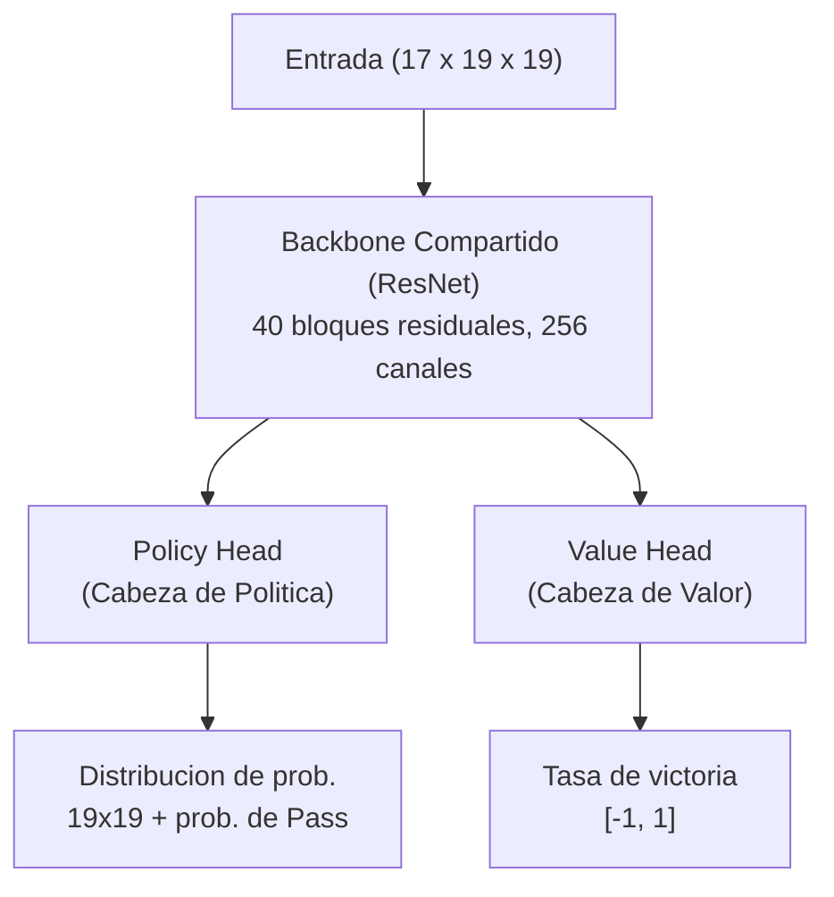

# Red de Doble Cabeza y Redes Residuales

Una de las innovaciones arquitectónicas más importantes de AlphaGo Zero es el uso de una **Red de Doble Cabeza (Dual-Head Network)** para reemplazar el diseño de doble red del AlphaGo original. Este cambio aparentemente simple trajo mejoras significativas de rendimiento y un proceso de aprendizaje más elegante.

Este artículo analizará en profundidad los principios de diseño de esta arquitectura, sus fundamentos matemáticos, y por qué es tan efectiva.

---

## Diseño de la Red de Doble Cabeza

### Arquitectura General

La red neuronal de AlphaGo Zero se puede dividir en tres partes:



Analicemos cada parte.

### Backbone Compartido (Shared Backbone)

El backbone compartido es una **Red Residual (ResNet)** profunda, responsable de extraer características del estado del tablero.

#### Detalles de Arquitectura

| Componente | Especificación |
|------------|---------------|
| Capa de entrada | Convolución 3×3, 256 canales |
| Bloques residuales | 40 (o 20 versión simplificada) |
| Cada bloque residual | 2 capas conv 3×3, 256 canales |
| Función de activación | ReLU |
| Normalización | Batch Normalization |

#### Representación Matemática

Sea la entrada x (dimensión 17 x 19 x 19), la salida del backbone compartido es:

```
f(x) = ResNet_40(Conv_3x3(x))
```

Donde f(x) (dimensión 256 x 19 x 19) es la representación de características de alta dimensión.

### Policy Head (Cabeza de Política)

Policy Head es responsable de predecir la probabilidad de jugar en cada posición.

#### Detalles de Arquitectura

```
Salida del Backbone (256 × 19 × 19)
       ↓
Convolución 1×1 (2 canales)
       ↓
Batch Normalization
       ↓
ReLU
       ↓
Aplanar (2 × 19 × 19 = 722)
       ↓
Capa Totalmente Conectada (362)
       ↓
Softmax
       ↓
Salida: 362 probabilidades (361 posiciones + Pass)
```

#### Representación Matemática

```
π = Softmax(FC(Flatten(ReLU(BN(Conv_1x1(f(x)))))))
```

La salida π es un vector de 362 dimensiones, donde todos los elementos son no negativos y suman 1.

### Value Head (Cabeza de Valor)

Value Head es responsable de predecir la tasa de victoria de la posición actual.

#### Detalles de Arquitectura

```
Salida del Backbone (256 × 19 × 19)
       ↓
Convolución 1×1 (1 canal)
       ↓
Batch Normalization
       ↓
ReLU
       ↓
Aplanar (1 × 19 × 19 = 361)
       ↓
Capa Totalmente Conectada (256)
       ↓
ReLU
       ↓
Capa Totalmente Conectada (1)
       ↓
Tanh
       ↓
Salida: Tasa de victoria [-1, 1]
```

#### Representación Matemática

```
v = Tanh(FC_1(ReLU(FC_2(Flatten(ReLU(BN(Conv_1x1(f(x)))))))))
```

La salida v está en el rango [-1, 1]:
- v = 1: El jugador actual gana seguro
- v = -1: El jugador actual pierde seguro
- v = 0: Posición equilibrada

---

## ¿Por Qué Compartir el Backbone?

### Comprensión Intuitiva

"Dónde debería jugar el siguiente movimiento" (Policy) y "Quién ganará" (Value) -- estas dos preguntas en realidad necesitan entender los mismos patrones del tablero:

- **Forma de las piedras**: Qué formas son buenas, cuáles son malas
- **Influencia**: Qué lado tiene más, dónde queda espacio
- **Vida y muerte**: Qué grupos están vivos, cuáles están en ko
- **Combate**: Dónde hay ataques, cuál es el resultado local

Si se usan dos redes independientes, estas características necesitan aprenderse dos veces. El backbone compartido permite que estas características de bajo nivel se aprendan solo una vez, siendo usadas por ambas tareas.

### Perspectiva del Aprendizaje Multi-tarea

Desde la perspectiva del machine learning, esto es **Aprendizaje Multi-tarea (Multi-task Learning)**:

```
L = L_policy + L_value
```

Las dos tareas comparten representación de bajo nivel, lo que trae varios beneficios:

#### 1. Efecto de Regularización

Compartir parámetros equivale a regularización implícita. Si una característica solo es útil para Policy y no para Value (o viceversa), es más difícil que se amplifique excesivamente.

La cantidad efectiva de parámetros es menor que la suma de dos redes independientes.

#### 2. Eficiencia de Datos

Cada partida produce simultáneamente etiquetas de Policy (probabilidades de búsqueda MCTS) y etiquetas de Value (resultado final). El backbone compartido permite que ambas etiquetas se usen para entrenar características compartidas, mejorando la eficiencia de utilización de datos.

#### 3. Señales de Gradiente Enriquecidas

Los gradientes de ambas tareas fluyen hacia el backbone compartido:

```
∂L/∂θ_shared = ∂L_policy/∂θ_shared + ∂L_value/∂θ_shared
```

Esto proporciona señales de supervisión más ricas, haciendo las características compartidas más robustas.

### Evidencia Experimental

Los experimentos de ablación de DeepMind mostraron que la red de doble cabeza supera significativamente las dobles redes separadas:

| Configuración | Puntuación ELO | Diferencia Relativa |
|---------------|----------------|---------------------|
| Redes Policy + Value separadas | Línea base | - |
| Red de doble cabeza (backbone compartido) | +300 ELO | ~65% diferencia en tasa de victoria |

Una diferencia de 300 ELO significa que la red de doble cabeza tiene aproximadamente 65% de tasa de victoria contra redes separadas. Esta es una mejora significativa.

---

## Principios de las Redes Residuales

### El Dilema de las Redes Profundas

Antes de la invención de ResNet, las redes neuronales profundas enfrentaban una paradoja:

> Teóricamente, las redes más profundas deberían ser al menos tan buenas como las más superficiales (en el peor caso, las capas extra pueden aprender el mapeo identidad). Pero en la práctica, las redes más profundas a menudo rendían peor.

Este es el **Problema de Degradación (Degradation Problem)**:

- El error de entrenamiento aumenta con la profundidad (no es sobreajuste, es dificultad de optimización)
- Los gradientes se desvanecen gradualmente durante la retropropagación (Vanishing Gradient)
- Los parámetros de capas profundas casi no pueden actualizarse efectivamente

### Diseño del Bloque Residual

He Kaiming et al. propusieron en 2015 una solución simple y elegante: **Conexiones Residuales (Skip Connection)**.

```
Entrada x
   ↓
┌─────────────┐
│  Capa Conv  │
│  BN + ReLU  │
│  Capa Conv  │
│  BN        │
└─────────────┘
   ↓ F(x)
   ↓←────────────── x (conexión de salto)
   +
   ↓
 ReLU
   ↓
Salida x + F(x)
```

#### Representación Matemática

Red tradicional: Aprender mapeo objetivo H(x)

```
y = H(x)
```

Red residual: Aprender **mapeo residual** F(x) = H(x) - x

```
y = F(x) + x
```

### ¿Por Qué Funcionan las Conexiones Residuales?

#### 1. Autopista de Gradientes

Considera el gradiente de retropropagación:

```
∂L/∂x = ∂L/∂y × ∂y/∂x = ∂L/∂y × (1 + ∂F(x)/∂x)
```

La clave es ese **+1**. Incluso si ∂F(x)/∂x es muy pequeño o cero, el gradiente aún puede pasar directamente a través del +1.

Es como construir una "autopista de gradientes", permitiendo que los gradientes fluyan sin obstáculos desde la capa de salida hasta la capa de entrada.

#### 2. El Mapeo Identidad Es Más Fácil de Aprender

Si la solución óptima está cerca del mapeo identidad (H(x) ≈ x), entonces:
- Red tradicional: Necesita aprender H(x) = x, puede ser difícil
- Red residual: Solo necesita aprender F(x) ≈ 0, relativamente fácil

Inicializando pesos a cero o cerca de cero, el bloque residual naturalmente tiende hacia el mapeo identidad.

#### 3. Efecto de Ensamble

Una ResNet profunda puede verse como un **ensamble implícito** de muchas redes poco profundas. Si hay n bloques residuales, la información puede fluir a través de 2^n diferentes caminos.

Este efecto de ensamble aumenta la robustez del modelo.

### El Avance de ResNet en ImageNet

ResNet logró resultados asombrosos en la competencia ImageNet 2015:

| Profundidad | Error Top-5 |
|-------------|-------------|
| VGG-19 (sin residual) | 7.3% |
| ResNet-34 | 5.7% |
| ResNet-152 | 4.5% |
| Nivel humano | ~5.1% |

Una ResNet de **152 capas** no solo es entrenable, sino que es mucho mejor que VGG de 19 capas. Esto probó que las conexiones residuales realmente resuelven el problema de entrenamiento de redes profundas.

---

## La ResNet de 40 Capas de AlphaGo Zero

### ¿Por Qué 40 Capas?

DeepMind probó ResNets de diferentes profundidades:

| Número de bloques residuales | Total de capas | Puntuación ELO |
|------------------------------|----------------|----------------|
| 5 | 11 | Línea base |
| 10 | 21 | +200 |
| 20 | 41 | +400 |
| 40 | 81 | +500 |

Las redes más profundas son ciertamente más fuertes, pero con retornos decrecientes. AlphaGo Zero usa 20 o 40 bloques residuales:

- **AlphaGo Zero (versión del paper)**: 40 bloques residuales, 256 canales
- **Versión simplificada**: 20 bloques residuales, 256 canales

La configuración de 40 capas logra un buen equilibrio entre fuerza de juego y costo de entrenamiento.

### Configuración Específica

La configuración de ResNet de AlphaGo Zero:

```
Entrada: 17 × 19 × 19
↓
Capa conv: 3×3, 256 canales, BN, ReLU
↓
Bloque residual ×40:
  ├─ Capa conv: 3×3, 256 canales, BN, ReLU
  ├─ Capa conv: 3×3, 256 canales, BN
  └─ Conexión de salto + ReLU
↓
Policy Head / Value Head
```

#### Estimación de Parámetros

| Componente | Parámetros (aprox.) |
|------------|---------------------|
| Conv de entrada | 17 × 3 × 3 × 256 ≈ 39K |
| Cada bloque residual | 2 × 256 × 3 × 3 × 256 ≈ 1.2M |
| 40 bloques residuales | 40 × 1.2M ≈ 47M |
| Policy Head | ~1M |
| Value Head | ~0.2M |
| **Total** | **~48M** |

Aproximadamente 48 millones de parámetros, una red neuronal de escala media según estándares modernos.

### El Rol de Batch Normalization

Cada capa convolucional es seguida por **Batch Normalization (BN)**, crucial para la estabilidad del entrenamiento:

#### 1. Normalizar Valores de Activación

BN normaliza los valores de activación de cada capa a media 0, varianza 1:

```
x_hat = (x - μ_B) / sqrt(σ_B² + ε)
y = γ × x_hat + β
```

Donde γ y β son parámetros aprendibles.

#### 2. Mitigar el Desplazamiento de Covarianza Interna

En redes profundas, la distribución de entrada de cada capa cambia a medida que se actualizan los parámetros de capas anteriores. BN mantiene la distribución de entrada de cada capa estable, acelerando la convergencia del entrenamiento.

#### 3. Efecto de Regularización

BN usa estadísticas del mini-batch durante el entrenamiento, introduciendo aleatoriedad, con un ligero efecto de regularización.

---

## Comparación con Otras Arquitecturas

### vs. CNN del AlphaGo Original

| Característica | AlphaGo original | AlphaGo Zero |
|----------------|------------------|--------------|
| Tipo de arquitectura | CNN estándar | ResNet |
| Profundidad | 13 capas | 41-81 capas |
| Conexiones residuales | No | Sí |
| Número de redes | 2 (separadas) | 1 (compartida) |
| BN | No | Sí |

### vs. Red Estilo VGG

VGG fue la arquitectura subcampeona de ImageNet 2014, usando convoluciones 3×3 apiladas:

| Característica | VGG | ResNet |
|----------------|-----|--------|
| Máx. profundidad entrenable | ~19 capas | 152+ capas |
| Flujo de gradiente | Decrece por capa | Tiene autopista |
| Dificultad de entrenamiento | Difícil para capas profundas | Capas profundas entrenables |

### vs. Inception / GoogLeNet

Inception usa convoluciones multi-escala en paralelo:

| Característica | Inception | ResNet |
|----------------|-----------|--------|
| Enfoque | Características multi-escala | Apilamiento profundo |
| Complejidad | Mayor | Simple |
| Aplicabilidad para Go | General | Excelente |

El diseño simple de ResNet es más adecuado para tareas que requieren razonamiento profundo como Go.

### vs. Transformer

La arquitectura Transformer propuesta en 2017 logró gran éxito en NLP. Algunos intentaron aplicar Transformer a Go:

| Característica | ResNet | Transformer |
|----------------|--------|-------------|
| Sesgo inductivo | Localidad (convolución) | Atención global |
| Codificación de posición | Implícita (convolución) | Explícita |
| Rendimiento en Go | Excelente | Viable pero no superior a ResNet |
| Eficiencia computacional | Mayor | Menor (O(n²)) |

Para problemas con estructura espacial obvia como Go, el sesgo inductivo de CNN/ResNet es más apropiado.

---

## Análisis Profundo de Decisiones de Diseño

### ¿Por Qué Usar Convoluciones 3×3?

AlphaGo Zero usa convoluciones 3×3 en todo el proceso, en lugar de kernels más grandes:

1. **Eficiencia de parámetros**: Dos convoluciones 3×3 tienen el mismo campo receptivo que una 5×5, pero menos parámetros (18 vs 25)
2. **Redes más profundas**: Con la misma cantidad de parámetros, se pueden apilar más capas
3. **Más no-linealidad**: ReLU entre cada capa, aumentando la capacidad expresiva

### ¿Por Qué 256 Canales?

256 canales es una elección empírica:

- **Muy pocos** (como 64): Capacidad expresiva insuficiente, no puede capturar patrones complejos
- **Demasiados** (como 512): Parámetros se duplican, costo de entrenamiento aumenta mucho, pero mejora de fuerza limitada

Los experimentos posteriores de KataGo mostraron que los canales pueden ajustarse según recursos de entrenamiento:
- Bajos recursos: 128 canales, 20 bloques
- Altos recursos: 256 canales, 40 bloques
- Más recursos: 384 canales, 60 bloques

### ¿Por Qué Policy Head Usa Softmax y Value Head Usa Tanh?

#### Policy Head: Softmax

Jugar es un **problema de clasificación** -- elegir una entre 361 posiciones (más Pass). La salida Softmax satisface:
- Todas las probabilidades son no negativas: π_i >= 0
- Las probabilidades suman 1: Σπ_i = 1

Esto es consistente con la definición de distribución de probabilidad.

#### Value Head: Tanh

La tasa de victoria es un **problema de regresión** -- predecir un valor continuo. El rango de salida de Tanh es [-1, 1]:
- Acotado: No producirá valores extremos
- Simétrico: Victoria y derrota tratadas simétricamente
- Diferenciable: Conveniente para cálculo de gradientes

Usar Tanh en lugar de salida no acotada (como capa lineal) puede prevenir inestabilidad en el entrenamiento.

---

## Detalles de Entrenamiento

### Función de Pérdida

La pérdida total de AlphaGo Zero es la suma de tres términos:

```
L = L_policy + L_value + L_reg
```

#### Policy Loss

Usa **pérdida de entropía cruzada**, haciendo que la salida de la red se aproxime a las probabilidades de búsqueda MCTS:

```
L_policy = -Σ π_MCTS(a) × log(π_net(a))
```

Donde:
- π_MCTS(a) es la probabilidad de búsqueda MCTS para acción a
- π_net(a) es la probabilidad de salida de la red

#### Value Loss

Usa **Error Cuadrático Medio (MSE)**, haciendo que la salida de la red se aproxime al resultado real:

```
L_value = (v_net - z)²
```

Donde:
- v_net es la tasa de victoria predicha por la red
- z es el resultado real de la partida (+1 o -1)

#### Regularization Loss

Usa **regularización L2** para prevenir sobreajuste:

```
L_reg = c × ||θ||²
```

Donde c es el coeficiente de regularización, θ son los parámetros de la red.

### Configuración del Optimizador

| Parámetro | Valor |
|-----------|-------|
| Optimizador | SGD + Momentum |
| Momentum | 0.9 |
| Tasa de aprendizaje inicial | 0.01 |
| Decaimiento de tasa de aprendizaje | Reducir a mitad cada X pasos |
| Tamaño de batch | 32 × 2048 = 64K (distribuido) |
| Coeficiente de regularización L2 | 1e-4 |

### Aumento de Datos

El tablero de Go tiene 8 simetrías (4 rotaciones × 2 reflexiones). Durante el entrenamiento, cada posición puede producir 8 muestras de entrenamiento equivalentes.

Esto aumenta los datos de entrenamiento efectivos 8 veces, sin necesitar auto-juego adicional.

---

## Consideraciones de Implementación

### Optimización de Memoria

Entrenar una ResNet de 40 capas requiere mucha memoria:
- **Forward pass**: Necesita almacenar activaciones de cada capa (para backpropagation)
- **Backward pass**: Necesita almacenar gradientes

Estrategias de optimización:
1. **Gradient Checkpointing**: Solo almacenar algunas activaciones, recalcular cuando sea necesario
2. **Entrenamiento de precisión mixta**: Usar FP16 para reducir uso de memoria
3. **Entrenamiento distribuido**: Distribuir batch entre múltiples GPU/TPU

### Optimización de Inferencia

Durante inferencia no se necesitan estadísticas de mini-batch de BN, se puede usar media móvil acumulada durante entrenamiento:

```
x_hat = (x - μ_moving) / sqrt(σ_moving² + ε)
```

Esto hace la inferencia más rápida y determinista.

### Cuantización y Compresión

Se puede comprimir más la red para despliegue:
- **Cuantización de pesos**: FP32 → INT8, memoria reducida 4x
- **Poda**: Eliminar conexiones de pesos pequeños
- **Destilación de conocimiento**: Usar red grande para entrenar red pequeña

---

## Correspondencia con Animaciones

Conceptos centrales cubiertos en este artículo y sus números de animación:

| Número | Concepto | Correspondencia Física/Matemática |
|--------|----------|----------------------------------|
| E3 | Red de doble cabeza | Aprendizaje multi-tarea |
| D12 | Conexión residual | Autopista de gradientes |
| D8 | Red neuronal convolucional | Campo receptivo local |
| D10 | Batch Normalization | Normalización de distribución |

---

## Lecturas Adicionales

- **Artículo anterior**: [Visión General de AlphaGo Zero](../alphago-zero) — Por qué no se necesitan partidas humanas
- **Siguiente artículo**: [Proceso de Entrenamiento desde Cero](../training-from-scratch) — Evolución detallada del Día 0-3
- **Profundización técnica**: [CNN y Go](../cnn-and-go) — Por qué CNN es adecuada para tableros

---

## Referencias

1. Silver, D., et al. (2017). "Mastering the game of Go without human knowledge." *Nature*, 550, 354-359.
2. He, K., et al. (2016). "Deep Residual Learning for Image Recognition." *CVPR 2016*.
3. Ioffe, S., & Szegedy, C. (2015). "Batch Normalization: Accelerating Deep Network Training by Reducing Internal Covariate Shift." *ICML 2015*.
4. Caruana, R. (1997). "Multitask Learning." *Machine Learning*, 28(1), 41-75.
5. Veit, A., et al. (2016). "Residual Networks Behave Like Ensembles of Relatively Shallow Networks." *NeurIPS 2016*.
