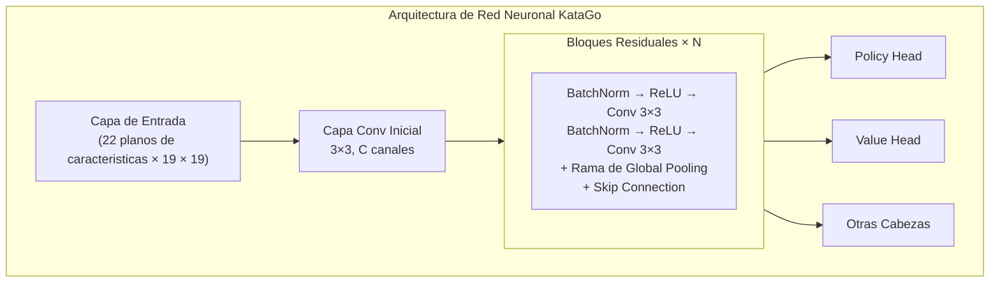
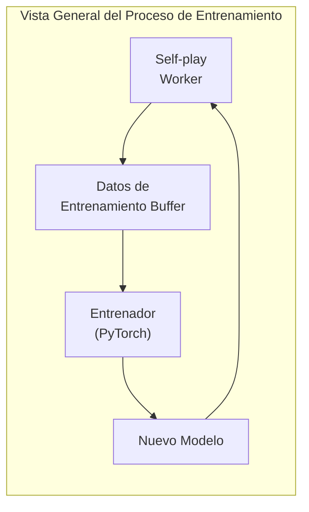

# Arquitectura del codigo fuente de KataGo

Este articulo analiza en profundidad la estructura del codigo fuente de KataGo, ayudandote a entender su implementacion interna. Ya sea que quieras contribuir codigo, modificar funciones, o aplicar su tecnologia a tu propio proyecto, esta es una referencia de lectura obligatoria.

## Estructura de directorios del proyecto

```
KataGo/
├── cpp/                    # Codigo fuente C++
│   ├── main.cpp           # Punto de entrada del programa principal
│   ├── command/           # Varios modos de ejecucion
│   ├── core/              # Clases de utilidades principales
│   ├── game/              # Reglas de Go y tablero
│   ├── search/            # Motor de busqueda MCTS
│   ├── neuralnet/         # Interfaz de red neuronal
│   ├── dataio/            # E/S de datos
│   ├── configs/           # Archivos de configuracion de ejemplo
│   └── tests/             # Pruebas unitarias
├── python/                 # Codigo de entrenamiento Python
│   ├── train.py           # Programa principal de entrenamiento
│   ├── model.py           # Definicion de modelo
│   ├── data_processing_pytorch.py
│   └── configs/           # Configuracion de entrenamiento
├── docs/                   # Documentacion
└── scripts/               # Scripts auxiliares
```

### Detalle del directorio cpp/

```
cpp/
├── main.cpp                # Entrada del programa, parsea argumentos de linea de comandos
├── command/
│   ├── gtp.cpp            # Implementacion de protocolo GTP
│   ├── analysis.cpp       # Implementacion de Analysis Engine
│   ├── benchmark.cpp      # Benchmark
│   ├── genconfig.cpp      # Generacion de archivo de configuracion
│   └── selfplay.cpp       # Self-play
├── core/
│   ├── global.h           # Constantes globales y configuracion
│   ├── hash.h             # Hash Zobrist
│   ├── rand.h             # Generacion de numeros aleatorios
│   ├── logger.h           # Sistema de logs
│   ├── config_parser.h    # Parser de archivos de configuracion
│   └── threadsafe*.h      # Herramientas de seguridad de hilos
├── game/
│   ├── board.h/cpp        # Representacion del tablero y operaciones basicas
│   ├── rules.h/cpp        # Reglas de Go
│   ├── boardhistory.h/cpp # Historia de la partida
│   └── graphhash.h/cpp    # Hash de posicion
├── search/
│   ├── search.h/cpp       # Clase principal del motor de busqueda
│   ├── searchnode.h/cpp   # Nodos del arbol de busqueda
│   ├── searchparams.h     # Parametros de busqueda
│   ├── mutexpool.h        # Pool de locks
│   ├── searchresults.h    # Resultados de busqueda
│   └── asyncbot.h/cpp     # Robot asincrono
├── neuralnet/
│   ├── nninputs.h/cpp     # Caracteristicas de entrada de red neuronal
│   ├── nneval.h/cpp       # Evaluacion de red neuronal
│   ├── nninterface.h      # Interfaz abstracta de backend
│   ├── cudabackend.cpp    # Backend CUDA
│   ├── openclbackend.cpp  # Backend OpenCL
│   ├── eigenbackend.cpp   # Backend Eigen (CPU)
│   └── modelversion.h     # Gestion de version de modelo
└── dataio/
    ├── sgf.h/cpp          # Procesamiento de archivos SGF
    ├── numpywrite.h/cpp   # Salida formato NumPy
    └── trainingwrite.h/cpp # Escritura de datos de entrenamiento
```

## Arquitectura de red neuronal

### Vista general de la estructura de red



### Caracteristicas de entrada (nninputs.cpp)

KataGo usa 22 planos de caracteristicas como entrada:

```cpp
// Categorias principales de caracteristicas de entrada
enum {
  // Estado del tablero
  INPUT_FEATURE_STONE_OUR,      // Nuestras piedras
  INPUT_FEATURE_STONE_OPP,      // Piedras del oponente

  // Relacionado con libertades (1-8 libertades)
  INPUT_FEATURE_LIBERTIES_1,
  INPUT_FEATURE_LIBERTIES_2,
  // ...
  INPUT_FEATURE_LIBERTIES_8_OR_MORE,

  // Estado historico
  INPUT_FEATURE_LAST_MOVE,      // Posicion ultima jugada
  INPUT_FEATURE_SECOND_LAST_MOVE,

  // Relacionado con reglas
  INPUT_FEATURE_KOMI,           // Komi
  INPUT_FEATURE_RULES,          // Codificacion de reglas
  // ...
};
```

### Rama de pooling global

Una de las innovaciones de KataGo es agregar pooling global en los bloques residuales:

```cpp
// Concepto simplificado de implementacion de pooling global
class GlobalPoolingResBlock {
public:
  void forward(Tensor& x) {
    // Camino residual estandar
    Tensor regular_out = regular_conv_path(x);

    // Camino de pooling global
    Tensor global_mean = global_avg_pool(x);  // [batch, C]
    Tensor global_max = global_max_pool(x);    // [batch, C]
    Tensor global_features = concat(global_mean, global_max);

    // Procesar caracteristicas globales
    global_features = dense_layer(global_features);  // [batch, C]

    // Transmitir a dimensiones espaciales y combinar con camino regular
    Tensor global_broadcast = broadcast_to_spatial(global_features);
    x = regular_out + global_broadcast;
  }
};
```

### Cabezas de salida

```cpp
// Policy Head: Predecir probabilidad de jugadas
class PolicyHead {
  // Salida: 19x19+1 (incluye pass)
  // Usa softmax para normalizar
};

// Value Head: Predecir victoria/derrota
class ValueHead {
  // Salida: 3 (probabilidades victoria/derrota/empate)
  // Usa softmax para normalizar
};

// Score Head: Predecir puntos
class ScoreHead {
  // Salida: valor continuo (diferencia de puntos esperada)
};

// Ownership Head: Predecir territorio
class OwnershipHead {
  // Salida: 19x19 (pertenencia de cada punto, tanh)
};
```

## Implementacion del motor de busqueda

### Clases centrales de MCTS

```cpp
// search/search.h
class Search {
public:
  // Ejecutar busqueda
  void runWholeSearch(Player pla);

  // Obtener mejor jugada
  Loc getBestMove();

  // Obtener resultados de analisis
  AnalysisData getAnalysisData();

private:
  SearchParams params;          // Parametros de busqueda
  SearchNode* rootNode;         // Nodo raiz
  NNEvaluator* nnEval;         // Evaluador de red neuronal
  std::mutex* mutexPool;       // Pool de locks
};
```

### Estructura del nodo de busqueda

```cpp
// search/searchnode.h
struct SearchNode {
  // Estadisticas del nodo
  std::atomic<int64_t> visits;           // Numero de visitas
  std::atomic<double> valueSumWeight;    // Peso acumulado de valor
  std::atomic<double> valueSum;          // Suma acumulada de valor

  // Nodos hijos
  std::atomic<int> numChildren;
  SearchChildPointer* children;          // Array de punteros a hijos

  // Cache de salida de red neuronal
  std::shared_ptr<NNOutput> nnOutput;
};

struct SearchChildPointer {
  Loc moveLoc;                           // Punto de jugada
  std::atomic<SearchNode*> node;         // Puntero a nodo hijo
  std::atomic<int64_t> edgeVisits;       // Visitas al borde
};
```

### Algoritmo de seleccion PUCT

```cpp
// Seleccionar nodo hijo a explorar
int Search::selectChildToDescend(SearchNode* node, Player pla) {
  int bestIdx = -1;
  double bestValue = -1e100;

  for (int i = 0; i < node->numChildren; i++) {
    SearchChildPointer& child = node->children[i];

    // Calcular valor Q (explotacion)
    double q = getChildQ(child);

    // Calcular valor U (exploracion)
    double prior = getPrior(node, child.moveLoc);
    double parentVisits = node->visits.load();
    double childVisits = child.edgeVisits.load();

    double u = params.cpuctExploration * prior *
               sqrt(parentVisits) / (1.0 + childVisits);

    // Formula PUCT
    double value = q + u;

    if (value > bestValue) {
      bestValue = value;
      bestIdx = i;
    }
  }

  return bestIdx;
}
```

### Implementacion de busqueda paralela

```cpp
void Search::runWholeSearch(Player pla) {
  // Iniciar multiples hilos de busqueda
  std::vector<std::thread> threads;
  for (int i = 0; i < params.numSearchThreads; i++) {
    threads.emplace_back([this, pla]() {
      runSingleSearchThread(pla);
    });
  }

  // Esperar a que todos los hilos terminen
  for (auto& t : threads) {
    t.join();
  }
}

void Search::runSingleSearchThread(Player pla) {
  while (!shouldStop()) {
    // Seleccionar camino
    std::vector<SearchNode*> path;
    SearchNode* leaf = selectAndDescend(rootNode, path);

    // Expandir nodo
    expandNode(leaf);

    // Evaluacion de red neuronal
    NNOutput output = nnEval->evaluate(leaf->board);

    // Retropropagar actualizacion
    backpropagateValue(path, output.value);
  }
}
```

### Virtual Loss (Perdida virtual)

Usado en busqueda paralela para evitar que multiples hilos seleccionen el mismo camino:

```cpp
void Search::applyVirtualLoss(SearchNode* node) {
  // Reducir temporalmente el valor de evaluacion de este nodo
  // Para que otros hilos tiendan a seleccionar caminos diferentes
  node->virtualLoss.fetch_add(1);
}

void Search::removeVirtualLoss(SearchNode* node) {
  node->virtualLoss.fetch_sub(1);
}
```

## Vista general del proceso de entrenamiento

### Generacion de datos de entrenamiento



### Self-play (cpp/command/selfplay.cpp)

```cpp
// Bucle principal de Self-play
void runSelfPlayLoop() {
  while (true) {
    // Cargar modelo mas reciente
    loadLatestModel();

    // Jugar una partida
    GameData gameData = playSingleGame();

    // Guardar datos de entrenamiento
    writeTrainingData(gameData);
  }
}

GameData playSingleGame() {
  Board board;
  BoardHistory history;
  GameData gameData;

  while (!history.isGameOver()) {
    // Usar MCTS para seleccionar jugada
    Search search(board, history, params);
    search.runWholeSearch(history.currentPla);

    // Obtener resultado MCTS como objetivo de entrenamiento
    MoveData moveData;
    moveData.policyTarget = search.getPolicyDistribution();
    moveData.valueTarget = search.getValue();

    // Ejecutar jugada
    Loc move = search.sampleMove();
    board.playMove(move, history.currentPla);

    gameData.moves.push_back(moveData);
  }

  // Rellenar resultado final
  gameData.finalScore = history.finalScore();
  return gameData;
}
```

### Formato de datos de entrenamiento

```cpp
// dataio/trainingwrite.h
struct TrainingRow {
  // Caracteristicas de entrada
  float inputFeatures[NUM_FEATURES][BOARD_SIZE][BOARD_SIZE];

  // Objetivos de entrenamiento
  float policyTarget[BOARD_SIZE * BOARD_SIZE + 1];  // Incluye pass
  float valueTarget[3];                              // Victoria/derrota/empate
  float scoreTarget;                                 // Puntos
  float ownershipTarget[BOARD_SIZE][BOARD_SIZE];    // Territorio

  // Metadatos
  int turn;
  int rules;
  float komi;
};
```

### Programa de entrenamiento Python (python/train.py)

```python
# Bucle principal de entrenamiento (simplificado)
def train():
    model = KataGoModel(config)
    optimizer = torch.optim.SGD(model.parameters(), lr=config.lr)

    for epoch in range(config.num_epochs):
        for batch in data_loader:
            # Propagacion hacia adelante
            policy_pred, value_pred, score_pred, ownership_pred = model(batch.input)

            # Calcular perdida
            policy_loss = cross_entropy(policy_pred, batch.policy_target)
            value_loss = cross_entropy(value_pred, batch.value_target)
            score_loss = mse_loss(score_pred, batch.score_target)
            ownership_loss = mse_loss(ownership_pred, batch.ownership_target)

            # Perdida total (suma ponderada)
            total_loss = (
                policy_loss +
                config.value_weight * value_loss +
                config.score_weight * score_loss +
                config.ownership_weight * ownership_loss
            )

            # Retropropagacion
            optimizer.zero_grad()
            total_loss.backward()
            optimizer.step()

        # Guardar checkpoint
        save_checkpoint(model, epoch)
```

### Definicion de modelo (python/model.py)

```python
class KataGoModel(nn.Module):
    def __init__(self, config):
        super().__init__()

        # Convolucion inicial
        self.initial_conv = nn.Conv2d(
            config.input_channels,
            config.trunk_channels,
            kernel_size=3, padding=1
        )

        # Bloques residuales
        self.blocks = nn.ModuleList([
            ResBlock(config.trunk_channels, use_global_pooling=True)
            for _ in range(config.num_blocks)
        ])

        # Cabezas de salida
        self.policy_head = PolicyHead(config)
        self.value_head = ValueHead(config)
        self.score_head = ScoreHead(config)
        self.ownership_head = OwnershipHead(config)

    def forward(self, x):
        # Red troncal
        x = self.initial_conv(x)
        for block in self.blocks:
            x = block(x)

        # Cada cabeza de salida
        policy = self.policy_head(x)
        value = self.value_head(x)
        score = self.score_head(x)
        ownership = self.ownership_head(x)

        return policy, value, score, ownership
```

## Estructuras de datos clave

### Board (game/board.h)

```cpp
class Board {
public:
  // Estado del tablero
  Color stones[MAX_BOARD_AREA];    // Color de cada punto
  Chain chains[MAX_BOARD_AREA];    // Informacion de cadenas

  // Ko
  Loc koLoc;

  // Ejecutar jugada
  void playMove(Loc loc, Color pla);

  // Verificacion de legalidad
  bool isLegal(Loc loc, Color pla) const;

  // Calculo de libertades
  int getLiberties(Loc loc) const;
};

struct Chain {
  int liberties;                   // Libertades
  int numStones;                   // Numero de piedras
  Loc head;                        // Cabeza de lista enlazada
};
```

### BoardHistory (game/boardhistory.h)

```cpp
class BoardHistory {
public:
  std::vector<Board> boards;       // Estados historicos del tablero
  std::vector<Move> moves;         // Historia de jugadas
  Rules rules;                     // Reglas
  Player currentPla;               // Turno de quien

  // Estado del juego
  bool isGameOver() const;
  float finalScore() const;
};
```

### NNOutput (neuralnet/nneval.h)

```cpp
struct NNOutput {
  // Policy
  float policyProbs[MAX_BOARD_AREA + 1];  // Incluye pass

  // Value
  float whiteWinProb;
  float whiteLossProb;
  float noResultProb;

  // Score
  float whiteScoreMean;
  float whiteScoreStdev;

  // Ownership
  float ownership[MAX_BOARD_AREA];  // -1 a 1
};
```

## Desarrollo y depuracion

### Compilar version de prueba

```bash
cd cpp
mkdir build_debug && cd build_debug
cmake .. -DCMAKE_BUILD_TYPE=Debug -DUSE_BACKEND=OPENCL
make -j$(nproc)
```

### Ejecutar pruebas unitarias

```bash
./katago runtests
```

### Metodos comunes de depuracion

```cpp
// 1. Usar logs
#include "core/logger.h"
Logger::log("Mensaje de debug", value);

// 2. Usar comando GTP kata-debug-print
// Muestra informacion detallada de busqueda

// 3. Habilitar sanitizers en compilacion
cmake .. -DCMAKE_CXX_FLAGS="-fsanitize=address"
```

### Analisis de rendimiento

```bash
# Usar perf (Linux)
perf record ./katago benchmark -model model.bin.gz
perf report

# Usar Instruments (macOS)
instruments -t "Time Profiler" ./katago benchmark -model model.bin.gz
```

## Lectura adicional

- [KataGo GitHub](https://github.com/lightvector/KataGo)
- [Paper de KataGo](https://arxiv.org/abs/1902.10565)
- [KataGo Discord](https://discord.gg/bqkZAz3) - Comunicarse con desarrolladores
- [KataGo Training](https://katagotraining.org/) - Ver progreso de entrenamiento

Despues de entender la arquitectura del codigo fuente de KataGo, ya tienes la capacidad de investigar profundamente o contribuir a proyectos de codigo abierto. Si quieres profundizar mas, se sugiere leer directamente el codigo fuente en GitHub de KataGo y participar en discusiones de la comunidad.

