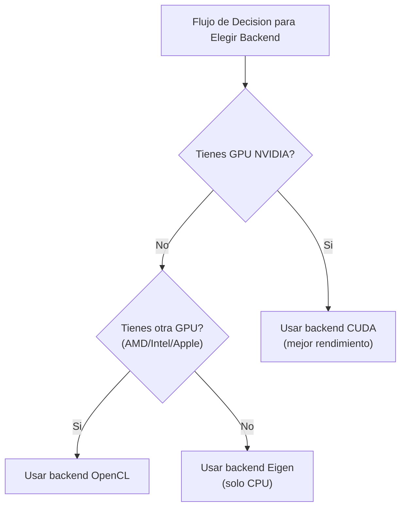

# Instalacion y configuracion de KataGo

Este articulo presenta en detalle como instalar KataGo en varias plataformas, incluyendo requisitos del sistema, pasos de instalacion, seleccion de modelos y explicacion del archivo de configuracion.

## Requisitos del sistema

### Requisitos de hardware

#### GPU (recomendado)

| Tipo de GPU | Estado de soporte | Backend sugerido |
|---------|---------|---------|
| NVIDIA (CUDA) | Mejor soporte | CUDA |
| NVIDIA (sin CUDA) | Buen soporte | OpenCL |
| AMD | Buen soporte | OpenCL |
| Intel integrada | Soporte basico | OpenCL |
| Apple Silicon | Buen soporte | Metal / OpenCL |

#### Modo CPU

Si no tienes una GPU adecuada, puedes usar el backend Eigen para ejecucion puramente en CPU:
- Rendimiento mas bajo (aproximadamente 10-30 playouts/seg)
- Adecuado para aprendizaje, pruebas y uso de baja intensidad
- Requiere soporte de conjunto de instrucciones AVX2 (la mayoria de las CPUs modernas lo soportan)

### Requisitos de software

| Sistema operativo | Requisito de version |
|---------|---------|
| **Linux** | Ubuntu 18.04+, CentOS 7+ u otra distribucion moderna |
| **macOS** | 10.14+ (Mojave o mas reciente) |
| **Windows** | Windows 10 o mas reciente |

### Guia de seleccion de backend



## Instalacion en macOS

### Metodo 1: Homebrew (recomendado)

La forma mas simple de instalar, maneja automaticamente todas las dependencias.

```bash
# Instalar KataGo
brew install katago

# Confirmar instalacion exitosa
katago version
```

La version de Homebrew usa backend OpenCL por defecto, funciona tanto en Intel Mac como en Apple Silicon.

### Metodo 2: Compilar desde codigo fuente

Adecuado para usuarios que necesitan opciones personalizadas o las funciones mas recientes.

#### Instalar dependencias

```bash
# Instalar CMake y herramientas de compilacion
brew install cmake

# Si usas OpenCL
# macOS tiene soporte OpenCL incorporado, no necesita instalacion adicional
```

#### Pasos de compilacion

```bash
# Clonar codigo fuente
git clone https://github.com/lightvector/KataGo.git
cd KataGo/cpp

# Crear directorio de compilacion
mkdir build && cd build

# Configurar opciones de compilacion (backend OpenCL)
cmake .. -DUSE_BACKEND=OPENCL

# Compilar
make -j$(sysctl -n hw.ncpu)

# Despues de compilar, el ejecutable esta en build/katago
./katago version
```

#### Nota especial para Apple Silicon

En Mac M1/M2/M3, se recomienda usar backend OpenCL o Metal:

```bash
# Backend OpenCL (recomendado, mejor compatibilidad)
cmake .. -DUSE_BACKEND=OPENCL

# Backend Metal (experimental, posiblemente mejor rendimiento)
cmake .. -DUSE_BACKEND=METAL
```

## Instalacion en Linux

### Metodo 1: Version precompilada (recomendado)

Descargar version precompilada desde GitHub Releases:

```bash
# Descargar version OpenCL (adecuada para la mayoria de casos)
wget https://github.com/lightvector/KataGo/releases/download/v1.15.3/katago-v1.15.3-opencl-linux-x64.zip

# O descargar version CUDA (GPU NVIDIA)
wget https://github.com/lightvector/KataGo/releases/download/v1.15.3/katago-v1.15.3-cuda11.1-linux-x64.zip

# Descomprimir
unzip katago-v1.15.3-*.zip

# Dar permisos de ejecucion
chmod +x katago

# Confirmar instalacion
./katago version
```

### Metodo 2: Compilar desde codigo fuente

#### Backend CUDA (GPU NVIDIA)

```bash
# Instalar dependencias
sudo apt update
sudo apt install cmake g++ libzip-dev

# Instalar CUDA (si no esta instalado)
# Ver guia oficial de NVIDIA: https://developer.nvidia.com/cuda-downloads

# Clonar y compilar
git clone https://github.com/lightvector/KataGo.git
cd KataGo/cpp
mkdir build && cd build

# Configurar backend CUDA
cmake .. -DUSE_BACKEND=CUDA

# Compilar
make -j$(nproc)
```

#### Backend OpenCL (GPU general)

```bash
# Instalar dependencias
sudo apt update
sudo apt install cmake g++ libzip-dev ocl-icd-opencl-dev

# Instalar driver OpenCL
# NVIDIA: Viene con instalacion de CUDA
# AMD: sudo apt install mesa-opencl-icd
# Intel: sudo apt install intel-opencl-icd

# Clonar y compilar
git clone https://github.com/lightvector/KataGo.git
cd KataGo/cpp
mkdir build && cd build

cmake .. -DUSE_BACKEND=OPENCL
make -j$(nproc)
```

#### Backend Eigen (solo CPU)

```bash
# Instalar dependencias
sudo apt update
sudo apt install cmake g++ libzip-dev libeigen3-dev

# Clonar y compilar
git clone https://github.com/lightvector/KataGo.git
cd KataGo/cpp
mkdir build && cd build

cmake .. -DUSE_BACKEND=EIGEN
make -j$(nproc)
```

## Instalacion en Windows

### Metodo 1: Version precompilada (recomendado)

1. Ir a [KataGo Releases](https://github.com/lightvector/KataGo/releases)
2. Descargar la version adecuada:
   - `katago-v1.15.3-cuda11.1-windows-x64.zip` (GPU NVIDIA + CUDA)
   - `katago-v1.15.3-opencl-windows-x64.zip` (otras GPU)
   - `katago-v1.15.3-eigen-windows-x64.zip` (solo CPU)
3. Descomprimir en el directorio especificado
4. Probar en el simbolo del sistema:

```cmd
cd C:\ruta\a\katago
katago.exe version
```

### Metodo 2: Compilar desde codigo fuente

#### Preparar entorno

1. Instalar [Visual Studio 2019/2022](https://visualstudio.microsoft.com/) (con herramientas C++)
2. Instalar [CMake](https://cmake.org/download/)
3. Si usas CUDA, instalar [CUDA Toolkit](https://developer.nvidia.com/cuda-toolkit)

#### Pasos de compilacion

```cmd
# Ejecutar en Developer Command Prompt

git clone https://github.com/lightvector/KataGo.git
cd KataGo\cpp
mkdir build
cd build

# Backend CUDA
cmake .. -G "Visual Studio 17 2022" -A x64 -DUSE_BACKEND=CUDA

# O backend OpenCL
cmake .. -G "Visual Studio 17 2022" -A x64 -DUSE_BACKEND=OPENCL

# Compilar
cmake --build . --config Release
```

## Descarga y seleccion de modelos

KataGo necesita archivos de modelo de red neuronal para ejecutarse. Los oficiales proporcionan modelos de varios tamanos.

### Ubicacion de descarga

Pagina oficial de descarga de modelos: https://katagotraining.org/

O descargar directamente del servidor de entrenamiento:

```bash
# Modelo pequeno (adecuado para pruebas y hardware debil)
curl -L -o kata-b18c384.bin.gz \
  "https://media.katagotraining.org/uploaded/networks/models/kata1/kata1-b18c384nbt-s9996604416-d4316597426.bin.gz"

# Modelo mediano (recomendado, equilibra rendimiento y velocidad)
curl -L -o kata-b40c256.bin.gz \
  "https://media.katagotraining.org/uploaded/networks/models/kata1/kata1-b40c256-s11840935168-d2898845681.bin.gz"

# Modelo grande (fuerza mas alta, necesita GPU potente)
curl -L -o kata-b60c320.bin.gz \
  "https://media.katagotraining.org/uploaded/networks/models/kata1/kata1-b60c320-s11318001920-d2792783831.bin.gz"
```

### Comparacion de modelos

| Modelo | Tamano de red | Tamano de archivo | Fuerza | Escenario adecuado |
|------|---------|---------|------|---------|
| b10c128 | 10 bloques, 128 canales | ~20 MB | Amateur alto dan | CPU, GPU debil, prueba rapida |
| b18c384 | 18 bloques, 384 canales | ~140 MB | Nivel profesional | GPU general, analisis diario |
| b40c256 | 40 bloques, 256 canales | ~250 MB | Nivel sobrehumano | GPU media-alta, analisis profundo |
| b60c320 | 60 bloques, 320 canales | ~500 MB | Sobrehumano superior | GPU alta gama, analisis de primer nivel |

### Sugerencias de seleccion

```
Cual es tu GPU?
├─ RTX 3080/4080/4090 -> b60c320 o b40c256
├─ RTX 3060/3070 -> b40c256 o b18c384
├─ GTX 1660/2060 -> b18c384
├─ GPU de entrada -> b18c384 o b10c128
└─ Solo CPU -> b10c128
```

## Explicacion basica del archivo de configuracion

KataGo usa archivos de configuracion en formato `.cfg`. Los oficiales proporcionan archivos de configuracion de ejemplo en el directorio `cpp/configs/`.

### Archivos de configuracion importantes

| Archivo | Uso |
|------|------|
| `gtp_example.cfg` | Configuracion de ejemplo para modo GTP |
| `analysis_example.cfg` | Configuracion de ejemplo para Analysis Engine |
| `default_gtp.cfg` | Configuracion por defecto para modo GTP |

### Items de configuracion principales

```ini
# =============
# Configuracion de red neuronal
# =============

# Ruta del archivo de modelo de red neuronal
# Puede usar ruta relativa o absoluta
# model = /ruta/al/modelo.bin.gz

# =============
# Configuracion de busqueda
# =============

# Numero maximo de visitas de busqueda por jugada
# Aumentar este valor mejora fuerza pero reduce velocidad
maxVisits = 500

# Tiempo maximo de pensamiento por jugada (segundos)
# 0 significa sin limite (controlado por maxVisits)
maxTime = 0

# Numero de hilos por movimiento
numSearchThreads = 6

# =============
# Configuracion de reglas
# =============

# Reglas de Go
# chinese = Reglas chinas
# japanese = Reglas japonesas
# korean = Reglas coreanas
# tromp-taylor = Reglas Tromp-Taylor
# aga = Reglas AGA
rules = chinese

# Komi
komi = 7.5

# =============
# Configuracion de GPU
# =============

# Numero de GPU a usar (comenzando desde 0)
# Multiples GPU pueden separarse por comas: 0,1,2
# -1 significa seleccion automatica
nnDeviceIdxs = 0

# Tamano de lote por hilo de GPU
# Lotes mas grandes pueden mejorar utilizacion de GPU
numNNServerThreadsPerModel = 1

# =============
# Configuracion avanzada
# =============

# Constante de exploracion MCTS
# Valor mayor aumenta exploracion, valor menor aumenta explotacion
cpuctExploration = 1.0

# Ruido Dirichlet del nodo raiz
# Usado para aumentar diversidad de exploracion
rootNoiseEnabled = true
rootDirichletNoisePruneFactor = 0.25
```

### Ejemplo de configuracion para modo GTP

Crear `my_gtp_config.cfg`:

```ini
# Ruta del modelo
# model generalmente se especifica en linea de comandos, puede omitirse aqui

# Configuracion de busqueda
maxVisits = 1000
numSearchThreads = 4

# Reglas
rules = chinese
komi = 7.5

# Configuracion de GPU
nnDeviceIdxs = 0

# Logs
logDir = ./logs
logToStderr = false
```

### Ejemplo de configuracion para Analysis Engine

Crear `my_analysis_config.cfg`:

```ini
# Configuracion de busqueda
maxVisits = 500
numSearchThreads = 8

# Configuracion de reportes
# Numero maximo de variaciones a reportar por analisis
maxMoves = 10

# Reglas (pueden sobrescribirse en llamada API)
rules = chinese
komi = 7.5

# Configuracion de GPU
nnDeviceIdxs = 0
numNNServerThreadsPerModel = 2

# Funcion de analisis
reportAnalysisWinratesAs = BLACK

# Mapa de ownership
# Cuando esta habilitado obtiene prediccion de pertenencia de cada punto
analysisOwnership = true
```

## Primera ejecucion

### Probar modo GTP

```bash
# Ejecutar modo GTP
katago gtp -model /ruta/al/modelo.bin.gz -config /ruta/al/config.cfg

# Si no hay config, KataGo usara valores por defecto
katago gtp -model /ruta/al/modelo.bin.gz
```

Despues de iniciar exitosamente, ingresa comandos GTP para probar:

```
name
= KataGo

version
= 1.15.3

boardsize 19
=

genmove black
= Q16

quit
=
```

### Probar Analysis Engine

```bash
# Ejecutar Analysis Engine
katago analysis -model /ruta/al/modelo.bin.gz -config /ruta/al/config.cfg
```

Ingresar consulta JSON:

```json
{"id":"test1","initialStones":[],"moves":[],"rules":"chinese","komi":7.5,"boardXSize":19,"boardYSize":19,"analyzeTurns":[0]}
```

### Benchmark

Probar el rendimiento de tu hardware:

```bash
# Ejecutar benchmark
katago benchmark -model /ruta/al/modelo.bin.gz

# Especificar archivo de configuracion
katago benchmark -model /ruta/al/modelo.bin.gz -config /ruta/al/config.cfg
```

El benchmark mostrara:
- Visitas de busqueda por segundo (visits/sec)
- Velocidad de inferencia de red neuronal
- Configuracion de hilos sugerida

## Resolucion de problemas comunes

### Relacionados con GPU

**Problema: No encuentra GPU**

```bash
# Verificar dispositivos OpenCL
clinfo

# O listar dispositivos que KataGo ve
katago gpuinfo
```

**Problema: Falla inicializacion de CUDA**

- Confirma que la version de CUDA coincide con la version compilada de KataGo
- Actualiza el driver de GPU
- Verifica la variable de entorno CUDA_PATH

### Relacionados con memoria

**Problema: Memoria insuficiente**

```ini
# Reducir uso de memoria GPU
nnMaxBatchSize = 8  # Por defecto puede ser 16 o mayor
nnCacheSizePowerOfTwo = 20  # Reducir tamano de cache
```

### Relacionados con rendimiento

**Problema: Velocidad muy lenta**

1. Confirma que usa GPU no CPU
2. Reduce `numSearchThreads`
3. Usa modelo mas pequeno
4. Verifica si otros programas ocupan la GPU

## Siguientes pasos

Despues de completar la configuracion, continua leyendo:
- [Comandos comunes](./commands.md) - Aprende como usar KataGo
- [Arquitectura del codigo fuente](./architecture.md) - Entiende la implementacion interna

