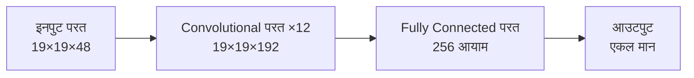
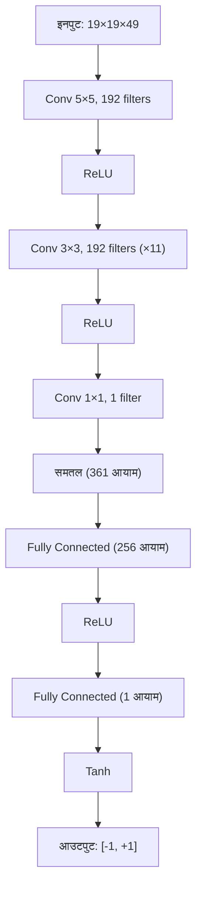
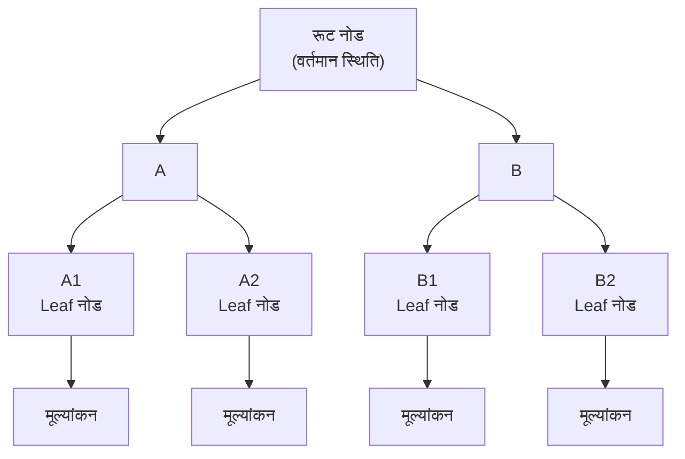
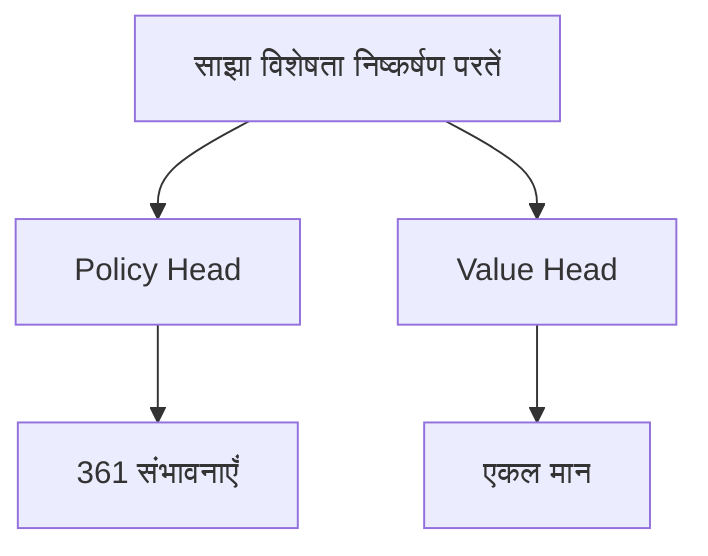

# Value Network विस्तृत विश्लेषण

यदि Policy Network AlphaGo को बताता है "अगली चाल कहाँ चलें", तो Value Network एक अधिक मूलभूत प्रश्न का उत्तर देता है:

> **"यह खेल, क्या मैं जीतूँगा?"**

---

## Value Network क्या है?

### मुख्य कार्य

Value Network एक गहन convolutional neural network है, इसका कार्य है:

> **वर्तमान बोर्ड स्थिति दी गई, अंतिम जीत की संभावना का अनुमान लगाएँ**

गणितीय रूप में:

```
v = f_θ(s)
```

जहाँ:
- `s`: वर्तमान बोर्ड स्थिति
- `f_θ`: Value Network (θ नेटवर्क पैरामीटर हैं)
- `v`: -1 से +1 के बीच एक मान

### आउटपुट का अर्थ

| आउटपुट मान | अर्थ |
|--------|------|
| +1 | वर्तमान खिलाड़ी निश्चित जीत |
| +0.5 | वर्तमान खिलाड़ी लगभग 75% जीत दर |
| 0 | दोनों पक्षों की जीत दर समान |
| -0.5 | वर्तमान खिलाड़ी लगभग 25% जीत दर |
| -1 | वर्तमान खिलाड़ी निश्चित हार |

### एकल मान की आवश्यकता क्यों?

#### विभिन्न विकल्पों की तुलना

खेलते समय, हमें अक्सर कई विकल्पों में से चुनना होता है। Value Network इस तुलना को सरल बनाता है:

```
विकल्प A का स्थिति मान: 0.3
विकल्प B का स्थिति मान: 0.5
विकल्प C का स्थिति मान: 0.2

→ B चुनें (सबसे उच्च मान)
```

यदि एकल मान नहीं होता, तो "प्रतिद्वंद्वी का एक समूह कैप्चर करना" और "एक बड़ा क्षेत्र घेरना" में से कौन बेहतर है, यह कैसे तुलना करते?

#### बड़ी संख्या में सिमुलेशन का विकल्प

पारंपरिक Monte Carlo Tree Search में, एक स्थिति का मूल्यांकन करने के लिए **रैंडम सिमुलेशन (rollout)** करना होता है:

1. वर्तमान स्थिति से शुरू करें
2. दोनों पक्ष यादृच्छिक रूप से खेल समाप्त होने तक खेलें
3. जीत-हार रिकॉर्ड करें
4. हजारों बार दोहराएँ, जीत दर गणना करें

यह बहुत धीमा है। Value Network **एक forward pass** में मूल्यांकन दे सकता है, गति कई परिमाण तेज़।

| विधि | मूल्यांकन समय | सटीकता |
|------|---------|------|
| 1000 रैंडम सिमुलेशन | ~2000 मिलीसेकंड | कम |
| 15000 रैंडम सिमुलेशन | ~30000 मिलीसेकंड | मध्यम |
| Value Network | ~3 मिलीसेकंड | उच्च (15000 सिमुलेशन के समतुल्य) |

---

## नेटवर्क वास्तुकला

### Policy Network से समानता

Value Network की वास्तुकला Policy Network से बहुत मिलती है, दोनों गहन convolutional neural networks हैं:



### इनपुट परत

Policy Network के समान, इनपुट एक **19×19×49** विशेषता tensor है:

- **19×19**: बोर्ड आकार
- **49**: 48 विशेषता प्लेन + 1 वर्तमान खिलाड़ी दर्शाने वाला प्लेन

अतिरिक्त 1 प्लेन महत्वपूर्ण है: Value Network को जानना चाहिए किसकी बारी है, क्योंकि एक ही स्थिति काले और सफेद के लिए विपरीत मूल्य की है।

### Convolutional परतें

Policy Network के समान:
- **12 convolutional परतें**
- **192 फ़िल्टर**
- **3×3 convolutional कर्नेल** (पहली परत 5×5)
- **ReLU सक्रियण फ़ंक्शन**

### आउटपुट परत का अंतर

यह Value Network और Policy Network का मुख्य अंतर है:

#### Policy Network आउटपुट
```
19×19×192 → 1×1 Convolution → 19×19×1 → समतल → 361 आयाम → Softmax → संभावना वितरण
```

#### Value Network आउटपुट
```
19×19×192 → 1×1 Convolution → 19×19×1 → समतल → 361 आयाम → FC 256 → ReLU → FC 1 → Tanh → एकल मान
```

### Tanh सक्रियण फ़ंक्शन

Value Network की अंतिम परत **Tanh** (हाइपरबोलिक टैंजेंट) फ़ंक्शन उपयोग करती है:

```
Tanh(x) = (e^x - e^(-x)) / (e^x + e^(-x))
```

Tanh का आउटपुट रेंज **(-1, +1)** है, जो जीत-हार से सटीक मेल खाता है।

#### Sigmoid के बजाय Tanh क्यों?

Sigmoid का आउटपुट रेंज (0, 1) है, जो जीत दर भी दर्शा सकता है। लेकिन Tanh के कुछ फायदे हैं:

1. **समरूपता**: 0 के चारों ओर केंद्रित, आउटपुट सकारात्मक या नकारात्मक हो सकता है
2. **बेहतर ग्रेडिएंट**: 0 के पास ग्रेडिएंट 1 के करीब
3. **स्पष्ट अर्थ**: सकारात्मक मान जीत, नकारात्मक हार, शून्य बराबरी

### पूर्ण वास्तुकला चित्र



### पैरामीटर संख्या

| परत | गणना | पैरामीटर संख्या |
|---|------|---------|
| Convolutional परतें | Policy Network के समान | ~3.9M |
| Fully Connected परत 1 | 361×256 + 256 | 92,672 |
| Fully Connected परत 2 | 256×1 + 1 | 257 |
| **कुल** | | **~4.0M** |

लगभग 4 मिलियन पैरामीटर, Policy Network से थोड़ा अधिक।

---

## प्रशिक्षण की चुनौतियाँ

### Overfitting समस्या

Value Network का प्रशिक्षण Policy Network से बहुत कठिन है। मुख्य समस्या **overfitting** है।

#### Overfitting क्या है?

Overfitting का अर्थ है मॉडल ने प्रशिक्षण डेटा को "याद" कर लिया, सामान्यीकरण नहीं सीखा। प्रदर्शन:
- प्रशिक्षण सेट पर बहुत अच्छा
- टेस्ट सेट पर खराब

#### Value Network में overfitting क्यों?

एक खेल के डेटा पर विचार करें:

```
स्थिति 1 → स्थिति 2 → स्थिति 3 → ... → स्थिति 200 → परिणाम: काला जीता
```

यदि सीधे इस डेटा से प्रशिक्षण करें:
- ये 200 स्थितियाँ बहुत सहसंबद्ध हैं
- वे एक ही खेल से हैं, एक ही परिणाम
- मॉडल इस खेल को "पहचानना" सीख सकता है, स्थिति समझना नहीं

DeepMind ने पाया: यदि Policy और Value Network के लिए एक ही मानव गेम रिकॉर्ड से प्रशिक्षण करें, Value Network गंभीर रूप से overfit हो जाता है।

### समाधान: सेल्फ-प्ले डेटा

DeepMind का समाधान नया प्रशिक्षण डेटा **सेल्फ-प्ले** से उत्पन्न करना है:

```
1. प्रशिक्षित RL Policy Network से सेल्फ-प्ले करें
2. प्रत्येक खेल से केवल एक स्थिति लें (सहसंबंध से बचने के लिए)
3. इस स्थिति का लेबल उस खेल का अंतिम परिणाम है
4. ऐसे 30 मिलियन नमूने उत्पन्न करें
```

#### यह overfitting क्यों हल करता है?

1. **बड़ा डेटा**: 30 मिलियन स्वतंत्र स्थितियाँ
2. **कोई सहसंबंध नहीं**: प्रत्येक खेल से केवल एक स्थिति
3. **अलग वितरण**: सेल्फ-प्ले की स्थितियाँ मानव गेम रिकॉर्ड से अलग

### प्रशिक्षण डेटा उत्पादन

```python
# छद्म कोड
training_data = []

for game_id in range(30_000_000):
    # एक खेल सेल्फ-प्ले
    states, result = self_play(rl_policy_network)

    # यादृच्छिक रूप से एक स्थिति चुनें
    random_index = random.randint(0, len(states) - 1)
    state = states[random_index]

    # स्थिति और परिणाम रिकॉर्ड करें
    training_data.append((state, result))
```

---

## प्रशिक्षण उद्देश्य और विधि

### Mean Squared Error हानि

Value Network **Mean Squared Error (MSE)** को हानि फ़ंक्शन के रूप में उपयोग करता है:

```
L(θ) = (1/n) × Σ (v_θ(s) - z)²
```

जहाँ:
- `v_θ(s)`: मॉडल द्वारा अनुमानित मान
- `z`: वास्तविक परिणाम (+1 या -1)

#### Cross-entropy के बजाय MSE क्यों?

- **Cross-entropy** वर्गीकरण समस्याओं के लिए उपयुक्त (असतत लेबल)
- **MSE** रिग्रेशन समस्याओं के लिए उपयुक्त (सतत मान)

हालाँकि परिणाम केवल +1 या -1 है, मॉडल सतत मान (-1 से +1 के बीच कोई भी संख्या) अनुमान करता है। MSE मॉडल को +1 या -1 के करीब मान अनुमान करना सिखाता है।

### प्रशिक्षण प्रक्रिया

```python
# छद्म कोड
for epoch in range(num_epochs):
    for batch in dataloader:
        states, outcomes = batch

        # फॉरवर्ड पास
        values = network(states)  # (batch, 1)

        # हानि गणना (MSE)
        loss = mse_loss(values, outcomes)

        # बैकवर्ड पास
        loss.backward()
        optimizer.step()
```

प्रशिक्षण विवरण:
- **ऑप्टिमाइज़र**: SGD with momentum
- **लर्निंग रेट**: 0.003
- **बैच आकार**: 32
- **प्रशिक्षण समय**: लगभग 1 सप्ताह (50 GPUs)

---

## सटीकता विश्लेषण

### रैंडम सिमुलेशन से तुलना

DeepMind ने पेपर में विस्तृत तुलना की:

| मूल्यांकन विधि | अनुमान त्रुटि |
|---------|---------|
| 1000 रैंडम सिमुलेशन | अधिक |
| 15000 रैंडम सिमुलेशन | मध्यम |
| Value Network | 15000 सिमुलेशन के समतुल्य |

इसका अर्थ है एक Value Network मूल्यांकन ≈ 15000 रैंडम सिमुलेशन, लेकिन लगभग 1000 गुना तेज़।

### विभिन्न चरणों में सटीकता

Value Network की सटीकता खेल की प्रगति पर निर्भर करती है:

| चरण | शेष चालें | अनुमान कठिनाई | सटीकता |
|------|---------|---------|--------|
| ओपनिंग | ~300 | बहुत कठिन | कम |
| मिडगेम | ~150 | कठिन | मध्यम |
| योसे | ~50 | आसान | अधिक |
| एंडगेम | ~10 | सरल | बहुत अधिक |

यह सहज रूप से सही है: खेल समाप्ति के जितना करीब, परिणाम उतना निश्चित।

### आउटपुट वितरण

एक अच्छी तरह प्रशिक्षित Value Network का आउटपुट वितरण:

```
        आवृत्ति
          |
          |    *
          |   * *
          |  *   *
          | *     *
          |*       *
          +----+----+---- आउटपुट मान
         -1    0   +1

अधिकांश आउटपुट -1 और +1 के पास केंद्रित
(क्योंकि अधिकांश स्थितियों में स्पष्ट जीत-हार झुकाव)
```

### अनिश्चित स्थितियाँ

जब Value Network आउटपुट 0 के करीब हो, तो स्थिति बहुत जटिल है, जीत-हार कठिन। ये स्थितियाँ आमतौर पर:
- बड़ी लड़ाई में
- दोनों पक्ष बराबर
- कई संभावित बदलाव

MCTS में, इन नोड्स को अधिक खोज संसाधन मिलते हैं (क्योंकि अनिश्चितता अधिक)।

---

## MCTS में भूमिका

### Leaf नोड मूल्यांकन

Value Network MCTS के **Evaluation** चरण में महत्वपूर्ण भूमिका निभाता है:



जब MCTS एक leaf नोड पर पहुँचता है, इस स्थिति का मूल्यांकन करना होता है। दो विधियाँ हैं:

1. **रैंडम सिमुलेशन (Rollout)**: Leaf नोड से खेल समाप्त होने तक यादृच्छिक खेलें
2. **Value Network मूल्यांकन**: सीधे neural network से अनुमान

AlphaGo दोनों को जोड़ता है:

```
V(leaf) = (1-λ) × V_network(leaf) + λ × V_rollout(leaf)
```

जहाँ λ = 0.5, यानी आधा-आधा वज़न।

#### दोनों क्यों जोड़ें?

- **Value Network** अधिक सटीक, लेकिन व्यवस्थित पूर्वाग्रह हो सकता है
- **रैंडम सिमुलेशन** कम सटीक, लेकिन स्वतंत्र अनुमान
- दोनों जोड़कर एक-दूसरे की कमी पूरी

### AlphaGo Zero का सरलीकरण

बाद के AlphaGo Zero ने रैंडम सिमुलेशन पूर्णतः त्याग दिया:

```
V(leaf) = V_network(leaf)
```

इससे प्रणाली बहुत सरल हो गई, साथ ही खेल शक्ति भी मजबूत। यह साबित करता है कि Value Network पर्याप्त विश्वसनीय है, रैंडम सिमुलेशन के "बीमा" की आवश्यकता नहीं।

### Backpropagation अपडेट

Leaf नोड मूल्यांकन के बाद, यह मान पथ पर वापस अपडेट होता है:

```
v3 = V(leaf) = 0.6
      ↑
A2 का Q मान अपडेट
      ↑
A का Q मान अपडेट
      ↑
रूट नोड के आँकड़े अपडेट
```

प्रत्येक नोड का Q मान उससे गुज़रने वाले सभी leaf नोड मूल्यांकनों का औसत है:

```
Q(s, a) = (1/N(s,a)) × Σ V(leaf)
```

---

## विज़ुअल विश्लेषण

### मान सतह

एक सरलीकृत 3×3 बोर्ड की कल्पना करें। Value Network जो सीखता है वह एक "मान सतह" है:

|  | सफेद 1 | सफेद 2 | सफेद 3 |
|---|--------|--------|--------|
| **काला 1** | +0.3 | -0.1 | +0.2 |
| **काला 2** | -0.2 | +0.5 | -0.3 |
| **काला 3** | +0.1 | -0.2 | +0.4 |

यह सतह हमें बताती है प्रत्येक स्थिति संयोजन का मान। सकारात्मक मान काले के लिए अनुकूल, नकारात्मक सफेद के लिए।

### प्रशिक्षण के दौरान विकास

प्रशिक्षण के साथ, Value Network का अनुमान धीरे-धीरे अधिक सटीक होता है:

```
       अनुमान त्रुटि
          |
     1.0  |*
          | *
     0.5  |  *
          |   *
     0.1  |    * * * * *
          +─────────────── प्रशिक्षण चरण
          0   100K  500K  1M
```

त्रुटि जल्दी गिरती है, फिर स्थिर होती है।

### कठिन स्थितियों की पहचान

Value Network कठिन स्थितियों की पहचान में मदद करता है:

| आउटपुट | अर्थ | रणनीति |
|------|------|---------|
| +1 के करीब | बड़ा फायदा | सुरक्षित चालें |
| -1 के करीब | बड़ा नुकसान | पलटाव के अवसर खोजें |
| 0 के करीब | जटिल स्थिति | गहन गणना आवश्यक |

AlphaGo 0 के करीब स्थितियों में अधिक सोचने का समय लगाता है।

---

## कार्यान्वयन बिंदु

### PyTorch कार्यान्वयन

```python
import torch
import torch.nn as nn
import torch.nn.functional as F

class ValueNetwork(nn.Module):
    def __init__(self, input_channels=49, num_filters=192, num_layers=12):
        super().__init__()

        # पहली convolutional परत (5×5)
        self.conv1 = nn.Conv2d(input_channels, num_filters,
                               kernel_size=5, padding=2)

        # मध्य convolutional परतें (3×3)×11
        self.conv_layers = nn.ModuleList([
            nn.Conv2d(num_filters, num_filters,
                     kernel_size=3, padding=1)
            for _ in range(num_layers - 1)
        ])

        # आउटपुट convolutional परत
        self.conv_out = nn.Conv2d(num_filters, 1, kernel_size=1)

        # Fully connected परतें
        self.fc1 = nn.Linear(361, 256)
        self.fc2 = nn.Linear(256, 1)

    def forward(self, x):
        # x: (batch, 49, 19, 19)

        # Convolutional परतें
        x = F.relu(self.conv1(x))
        for conv in self.conv_layers:
            x = F.relu(conv(x))
        x = self.conv_out(x)

        # समतल
        x = x.view(x.size(0), -1)  # (batch, 361)

        # Fully connected परतें
        x = F.relu(self.fc1(x))
        x = torch.tanh(self.fc2(x))

        return x.squeeze(-1)  # (batch,)
```

### प्रशिक्षण लूप

```python
def train_value_network(model, optimizer, states, outcomes):
    """
    states: (batch, 49, 19, 19) - बोर्ड विशेषताएँ
    outcomes: (batch,) - खेल परिणाम (+1 या -1)
    """
    # फॉरवर्ड पास
    values = model(states)  # (batch,)

    # MSE हानि
    loss = F.mse_loss(values, outcomes)

    # बैकवर्ड पास
    optimizer.zero_grad()
    loss.backward()
    optimizer.step()

    # सटीकता गणना (सही जीत-हार अनुमान)
    predictions = (values > 0).float() * 2 - 1  # +1/-1 में बदलें
    accuracy = (predictions == outcomes).float().mean()

    return loss.item(), accuracy.item()
```

### Overfitting से बचने के तरीके

```python
# 1. डेटा संवर्धन (8 समरूपताएँ)
def augment(state, outcome):
    augmented = []
    for rotation in [0, 90, 180, 270]:
        s = rotate(state, rotation)
        augmented.append((s, outcome))
        augmented.append((flip(s), outcome))
    return augmented

# 2. Dropout
class ValueNetworkWithDropout(ValueNetwork):
    def __init__(self, *args, dropout_rate=0.5, **kwargs):
        super().__init__(*args, **kwargs)
        self.dropout = nn.Dropout(dropout_rate)

    def forward(self, x):
        # ... convolutional परतें ...
        x = self.dropout(x)  # fully connected परत से पहले dropout
        # ... fully connected परतें ...

# 3. Early Stopping
best_val_loss = float('inf')
patience = 10
counter = 0

for epoch in range(max_epochs):
    train_loss = train_one_epoch()
    val_loss = evaluate()

    if val_loss < best_val_loss:
        best_val_loss = val_loss
        save_model()
        counter = 0
    else:
        counter += 1
        if counter >= patience:
            print("Early stopping!")
            break
```

---

## Policy Network के साथ सहयोग

### पूरक संबंध

Policy Network और Value Network AlphaGo में एक-दूसरे के पूरक हैं:

| नेटवर्क | उत्तर दिया प्रश्न | आउटपुट | MCTS भूमिका |
|------|-----------|------|----------|
| Policy | अगली चाल कहाँ? | संभावना वितरण | खोज दिशा निर्देशन |
| Value | यह खेल जीतेंगे? | एकल मान | Leaf नोड मूल्यांकन |

### एकीकृत Dual-Head नेटवर्क

AlphaGo Zero में, ये दोनों नेटवर्क एक **Dual-Head नेटवर्क** में मर्ज हो गए:



इस डिज़ाइन के फायदे:
- **पैरामीटर साझाकरण**: गणना कम
- **विशेषता साझाकरण**: Policy और Value समान विशेषताएँ उपयोग
- **स्थिर प्रशिक्षण**: दोनों उद्देश्य एक-दूसरे को regularize करते हैं

विवरण के लिए [Dual-Head Network और Residual Network](../dual-head-resnet) देखें।

---

## एनिमेशन संदर्भ

इस लेख की मुख्य अवधारणाएँ और एनिमेशन नंबर:

| नंबर | अवधारणा | भौतिकी/गणित संदर्भ |
|------|------|--------------|
| 🎬 E2 | Value Network | पोटेंशियल एनर्जी सतह |
| 🎬 D4 | मान फ़ंक्शन | अपेक्षित रिटर्न |
| 🎬 C6 | Leaf नोड मूल्यांकन | फ़ंक्शन अनुमान |
| 🎬 H3 | Temporal Difference | बूटस्ट्रैप लर्निंग |

---

## आगे पढ़ें

- **पिछला लेख**: [Policy Network विस्तृत विश्लेषण](../policy-network) — रणनीति नेटवर्क चाल कैसे चुनता है
- **अगला लेख**: [इनपुट विशेषता डिज़ाइन](../input-features) — 48 विशेषता प्लेन विस्तृत विश्लेषण
- **उन्नत विषय**: [MCTS और Neural Network का संयोजन](../mcts-neural-combo) — पूर्ण खोज प्रक्रिया

---

## मुख्य बिंदु

1. **Value Network जीत दर अनुमान करता है**: -1 से +1 के बीच एकल मान आउटपुट
2. **Tanh आउटपुट**: सुनिश्चित करता है आउटपुट सही रेंज में
3. **MSE हानि**: अनुमानित मान को वास्तविक परिणाम के करीब लाता है
4. **Overfitting चुनौती**: सेल्फ-प्ले डेटा से बचना होगा
5. **रैंडम सिमुलेशन का विकल्प**: एक मूल्यांकन ≈ 15000 सिमुलेशन

Value Network AlphaGo की "निर्णय क्षमता" है—यह AI को किसी भी स्थिति की अच्छाई-बुराई का मूल्यांकन करने देता है, बिना सभी संभावनाओं को खोजे।

---

## संदर्भ

1. Silver, D., et al. (2016). "Mastering the game of Go with deep neural networks and tree search." *Nature*, 529, 484-489.
2. Silver, D., et al. (2017). "Mastering the game of Go without human knowledge." *Nature*, 551, 354-359.
3. Sutton, R. S., & Barto, A. G. (2018). *Reinforcement Learning: An Introduction*. MIT Press.
4. Tesauro, G. (1995). "Temporal difference learning and TD-Gammon." *Communications of the ACM*, 38(3), 58-68.
