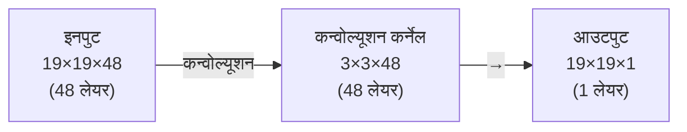
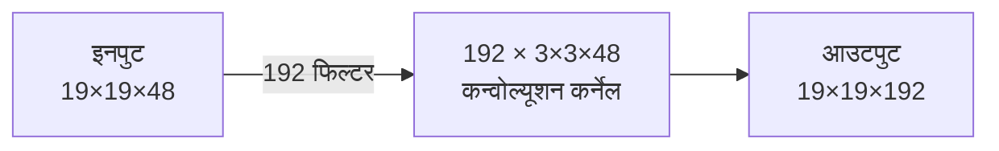
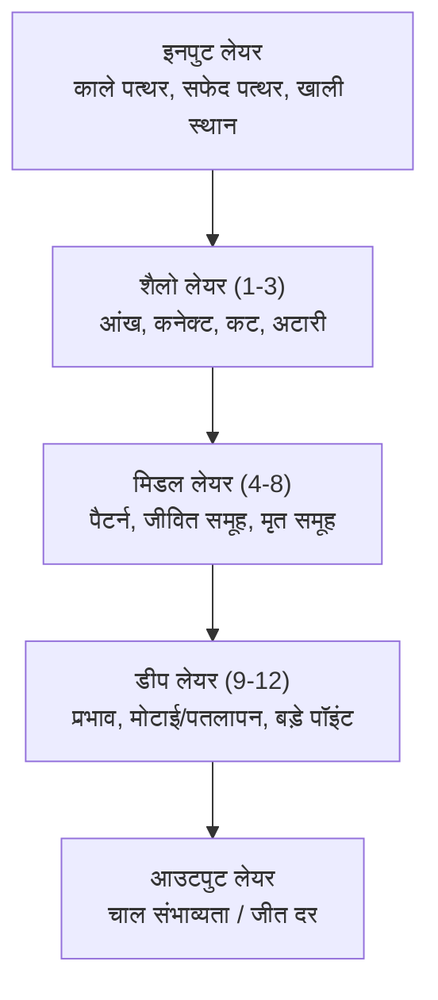
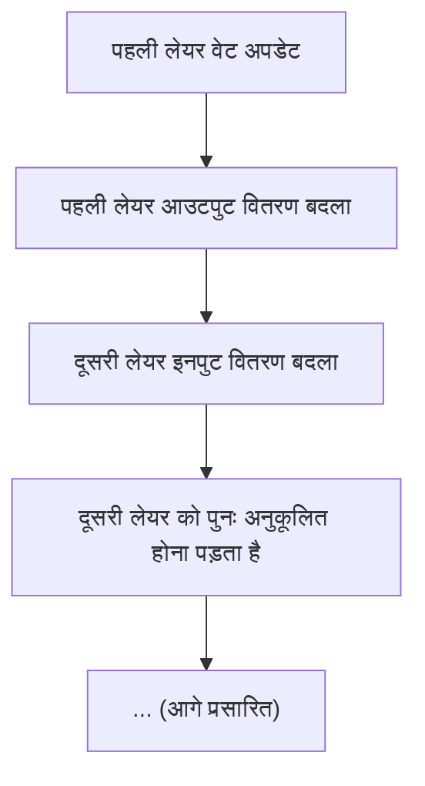
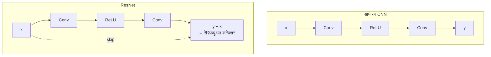

# CNN और गो का संयोजन

जब DeepMind ने गो को संभालने के लिए **कन्वोल्यूशनल न्यूरल नेटवर्क (CNN)** का उपयोग करने का निर्णय लिया, तो यह एक प्रतिभाशाली डिज़ाइन निर्णय था।

CNN मूल रूप से इमेज पहचान के लिए डिज़ाइन किया गया था। यह गो के लिए भी क्यों उपयुक्त है? यह लेख CNN के कार्य सिद्धांतों और गो के साथ इसके परिपूर्ण मेल की गहन जांच करेगा।

---

## CNN बोर्ड के लिए क्यों उपयुक्त है?

### बोर्ड एक "इमेज" है

एक दृष्टिकोण से देखें तो, 19×19 का गो बोर्ड एक **इमेज** है:

| इमेज | गो बोर्ड |
|------|---------|
| पिक्सेल | इंटरसेक्शन पॉइंट |
| RGB चैनल | फीचर प्लेन (काला, सफेद, खाली...) |
| 224×224 | 19×19 |
| बिल्ली-कुत्ते की पहचान | अच्छी-बुरी चाल का निर्णय |

यह समानता आकस्मिक नहीं है। CNN जिन कारणों से इमेज में अच्छा है, वही कारण इसे बोर्ड में भी अच्छा बनाते हैं।

### तीन मुख्य विशेषताएं

CNN की तीन विशेषताएं हैं जो इसे बोर्ड-प्रकार के डेटा के लिए विशेष रूप से उपयुक्त बनाती हैं:

#### 1. लोकल कनेक्टिविटी (Local Connectivity)

CNN का कन्वोल्यूशन कर्नेल केवल लोकल क्षेत्र देखता है, जो गो की विशेषताओं से पूरी तरह मेल खाता है:

**इमेज पहचान vs गो:**

| इमेज पहचान | गो |
|------------|-----|
| बिल्ली के कान लोकल फीचर हैं | "आंख" लोकल पैटर्न है |
| पूरी इमेज देखने की जरूरत नहीं | पूरा बोर्ड देखने की जरूरत नहीं |

**3×3 क्षेत्र उदाहरण (आंख पैटर्न):**

|   |   |   |
|:-:|:-:|:-:|
| ○ | ● | ○ |
| ● | ○ | ● |
| ○ | ● | ○ |

कई गो अवधारणाएं "लोकल" हैं:
- **आंख**: 2×2 या 3×3 क्षेत्र
- **अटारी**: 3×3 क्षेत्र
- **कनेक्ट, कट**: 2×2 क्षेत्र

#### 2. वेट शेयरिंग (Weight Sharing)

एक ही कन्वोल्यूशन कर्नेल पूरे बोर्ड को स्कैन करता है, जिसका अर्थ है:

> **बोर्ड के ऊपरी बाएं कोने की "आंख" और निचले दाएं कोने की "आंख" को एक ही तरीके से पहचाना जाता है**

यह उचित है—गो के नियम स्थान के अनुसार नहीं बदलते (किनारों और कोनों को छोड़कर, लेकिन इन्हें किनारे और कोने के फीचर प्लेन से संभाला जा सकता है)।

वेट शेयरिंग पैरामीटर की संख्या को भी बहुत कम करती है:

| विधि | पैरामीटर संख्या |
|------|--------|
| फुली कनेक्टेड नेटवर्क | 361 × 361 × चैनल = करोड़ों |
| CNN | 3 × 3 × चैनल × फिल्टर = लाखों |

#### 3. ट्रांसलेशन इक्विवेरिएंस (Translation Equivariance)

यदि इनपुट शिफ्ट होता है, तो CNN का आउटपुट भी उसी अनुसार शिफ्ट होता है:

**इनपुट और आउटपुट (उच्च संभाव्यता क्षेत्र):**

|   | A | B | C | D | E |   |   | A | B | C | D | E |
|---|:-:|:-:|:-:|:-:|:-:|---|---|:-:|:-:|:-:|:-:|:-:|
| 1 | · | · | · | · | · | → | 1 | · | · | · | · | · |
| 2 | · | ● | · | · | · |   | 2 | · | * | · | · | · |
| 3 | · | · | · | · | · |   | 3 | · | · | · | · | · |

**इनपुट शिफ्ट के बाद → आउटपुट भी शिफ्ट:**

|   | A | B | C | D | E |   |   | A | B | C | D | E |
|---|:-:|:-:|:-:|:-:|:-:|---|---|:-:|:-:|:-:|:-:|:-:|
| 1 | · | · | · | · | · | → | 1 | · | · | · | · | · |
| 2 | · | · | · | · | · |   | 2 | · | · | · | · | · |
| 3 | · | · | ● | · | · |   | 3 | · | · | * | · | · |

यह गो के लिए महत्वपूर्ण है: एक ही लोकल पैटर्न, बोर्ड पर कहीं भी दिखाई दे, उसका मूल्यांकन समान होना चाहिए।

---

## कन्वोल्यूशन ऑपरेशन

### मूल सिद्धांत

कन्वोल्यूशन ऑपरेशन CNN का मूल है। यह एक "स्लाइडिंग विंडो" ऑपरेशन है:

**इनपुट (5×5):**

|   |   |   |   |   |
|:-:|:-:|:-:|:-:|:-:|
| 1 | 0 | 1 | 0 | 0 |
| 0 | 1 | 1 | 1 | 0 |
| 1 | 1 | 1 | 1 | 1 |
| 0 | 0 | 1 | 1 | 0 |
| 0 | 1 | 0 | 0 | 1 |

**कन्वोल्यूशन कर्नेल (3×3):**

|   |   |   |
|:-:|:-:|:-:|
| 1 | 0 | 1 |
| 0 | 1 | 0 |
| 1 | 0 | 1 |

**आउटपुट (5×5, padding=same):**

|   |   |   |   |   |
|:-:|:-:|:-:|:-:|:-:|
| 2 | 1 | 3 | 1 | 2 |
| 1 | 4 | 3 | 3 | 1 |
| 3 | 3 | 5 | 3 | 3 |
| 1 | 3 | 3 | 4 | 1 |
| 2 | 1 | 3 | 1 | 2 |

गणना प्रक्रिया (केंद्र बिंदु के लिए):

```
आउटपुट[2,2] = 1×1 + 1×0 + 1×1 +
            1×0 + 1×1 + 1×0 +
            1×1 + 1×0 + 1×1
          = 1 + 0 + 1 + 0 + 1 + 0 + 1 + 0 + 1
          = 5
```

### मल्टी-चैनल कन्वोल्यूशन

जब इनपुट में कई चैनल होते हैं (जैसे 48 फीचर प्लेन), कन्वोल्यूशन कर्नेल भी 3D बन जाता है:



प्रत्येक कन्वोल्यूशन कर्नेल सभी इनपुट चैनलों में गणना करता है और एक आउटपुट चैनल उत्पन्न करता है।

### मल्टीपल फिल्टर

AlphaGo 192 फिल्टर का उपयोग करता है, प्रत्येक फिल्टर अलग-अलग फीचर सीखता है:



प्रत्येक फिल्टर अलग पैटर्न सीख सकता है:
- फिल्टर 1: आंख डिटेक्शन
- फिल्टर 2: कटिंग पॉइंट डिटेक्शन
- फिल्टर 3: कनेक्शन डिटेक्शन
- ...
- फिल्टर 192: कोई जटिल पैटर्न

---

## रिसेप्टिव फील्ड

### रिसेप्टिव फील्ड क्या है?

**रिसेप्टिव फील्ड (Receptive Field)** यह बताता है कि आउटपुट की एक स्थिति इनपुट की किन स्थितियों से प्रभावित होती है।

#### सिंगल लेयर कन्वोल्यूशन

3×3 कन्वोल्यूशन कर्नेल का उपयोग करते समय, आउटपुट की प्रत्येक स्थिति केवल इनपुट के 3×3 क्षेत्र से प्रभावित होती है:

**इनपुट (रिसेप्टिव फील्ड 3×3 हाइलाइट):**

|   |   |   |   |   |
|:-:|:-:|:-:|:-:|:-:|
| · | · | · | · | · |
| · | **●** | **●** | **●** | · |
| · | **●** | **●** | **●** | · |
| · | **●** | **●** | **●** | · |
| · | · | · | · | · |

**आउटपुट:**

|   |   |   |   |
|:-:|:-:|:-:|:-:|
| · | · | · | · |
| · | ● | · | · |
| · | · | · | · |
| · | · | · | · |

#### मल्टी-लेयर कन्वोल्यूशन

कई लेयर कन्वोल्यूशन स्टैक करने के बाद, रिसेप्टिव फील्ड बढ़ता है:

| लेयर | रिसेप्टिव फील्ड | गणना |
|------|--------|------|
| 1 | 3×3 | 3 |
| 2 | 5×5 | 3 + (3-1) = 5 |
| 3 | 7×7 | 5 + (3-1) = 7 |
| ... | ... | ... |
| 12 | 25×25 | 3 + 11×2 = 25 |

AlphaGo की 12 लेयर कन्वोल्यूशन **25×25 का रिसेप्टिव फील्ड** देती है, जो 19×19 बोर्ड से भी बड़ा है!

इसका अर्थ है:
- **आउटपुट की प्रत्येक स्थिति पूरे बोर्ड को "देख" सकती है**
- लेकिन "देखने" का तरीका अलग है: पास की डिटेल स्पष्ट, दूर का सामान्य
- यह मानव खिलाड़ियों की सोच के तरीके से मिलता-जुलता है

### रिसेप्टिव फील्ड और गो

रिसेप्टिव फील्ड की अवधारणा बताती है कि AlphaGo "ग्लोबल" समस्याओं को क्यों संभाल सकता है:

| लोकल समस्याएं (3×3 रिसेप्टिव फील्ड) | ग्लोबल समस्याएं (25×25 रिसेप्टिव फील्ड) |
|-----------------------------------|----------------------------------------|
| क्या यहां आंख है? | क्या इस ग्रुप की आंख संभव है? |
| क्या अटारी लगा सकते हैं? | क्या लैडर अनुकूल है? |
| क्या कनेक्ट कर सकते हैं? | ग्लोबल स्थिति कैसी है? |

शैलो लेयर लोकल फीचर संभालती हैं, डीप लेयर ग्लोबल फीचर संभालती हैं।

---

## लोकल vs ग्लोबल फीचर

### CNN की पदानुक्रमित संरचना

CNN स्वाभाविक रूप से पदानुक्रमित संरचना बनाता है:



यह मानव के गो सीखने की प्रक्रिया से आश्चर्यजनक रूप से मिलता-जुलता है:
1. पहले नियम सीखें (पत्थर कहां हैं)
2. फिर टैक्टिक्स सीखें (कैप्चर कैसे करें)
3. फिर पैटर्न सीखें (अच्छा आकार क्या है)
4. अंत में बड़ी तस्वीर समझें (ग्लोबल निर्णय)

### हिडन लेयर का विज़ुअलाइज़ेशन

शोधकर्ताओं ने पाया कि CNN की हिडन लेयर वास्तव में अर्थपूर्ण फीचर सीखती हैं:

#### शैलो लेयर फिल्टर

**फिल्टर A (आंख डिटेक्शन):**

|   |   |   |
|:-:|:-:|:-:|
| + | - | + |
| - | + | - |
| + | - | + |

**फिल्टर B (अटारी डिटेक्शन):**

|   |   |   |
|:-:|:-:|:-:|
| + | + | + |
| + | - | - |
| + | + | + |

#### डीप लेयर फिल्टर

डीप लेयर के फिल्टर अधिक अमूर्त होते हैं, सीधे व्याख्या करना कठिन होता है, लेकिन वे जटिल पैटर्न कैप्चर करते हैं।

---

## एक्टिवेशन फंक्शन का चयन

### ReLU: सरल और प्रभावी

AlphaGo सभी कन्वोल्यूशन लेयर के बाद **ReLU (Rectified Linear Unit)** का उपयोग करता है:

```python
def relu(x):
    return max(0, x)
```

**ReLU का व्यवहार:**
- जब इनपुट < 0: आउटपुट = 0 (नेगेटिव मान को ज़ीरो कर देता है)
- जब इनपुट >= 0: आउटपुट = इनपुट (पॉज़िटिव मान को वैसा ही रखता है)

यह एक सीधी रेखा है जो मूल बिंदु से गुज़रती है, नेगेटिव पक्ष पर शून्य और पॉज़िटिव पक्ष पर 45° का कोण।

### अन्य फंक्शन क्यों नहीं?

| एक्टिवेशन फंक्शन | सूत्र | फायदे | नुकसान |
|----------|------|------|------|
| ReLU | max(0, x) | तेज गणना, अच्छा ग्रेडिएंट | नेगेटिव मान मर जाते हैं |
| Sigmoid | 1/(1+e^-x) | बाउंडेड आउटपुट | वैनिशिंग ग्रेडिएंट |
| Tanh | (e^x-e^-x)/(e^x+e^-x) | ज़ीरो-सेंटर्ड | वैनिशिंग ग्रेडिएंट |
| LeakyReLU | max(0.01x, x) | डेड न्यूरॉन समस्या हल | एक अतिरिक्त हाइपरपैरामीटर |

डीप नेटवर्क के लिए, ReLU के फायदे स्पष्ट हैं:
1. **सरल गणना**: बस तुलना और अधिकतम लेना
2. **ग्रेडिएंट वैनिश नहीं होता**: पॉज़िटिव रेंज में ग्रेडिएंट हमेशा 1
3. **स्पार्स एक्टिवेशन**: कई न्यूरॉन 0 आउटपुट करते हैं, दक्षता बढ़ती है

### गो में ReLU का अर्थ

ReLU की स्पार्सिटी का गो में एक दिलचस्प व्याख्या है:

```
एक फिल्टर "कटिंग पॉइंट" डिटेक्ट करता है:
- कटिंग पॉइंट है → पॉज़िटिव आउटपुट (एक्टिवेट)
- कटिंग पॉइंट नहीं → ज़ीरो आउटपुट (एक्टिवेट नहीं)

यह ऐसा है जैसे खिलाड़ी केवल "महत्वपूर्ण" स्थानों पर ध्यान देता है
```

---

## बैच नॉर्मलाइज़ेशन

### बैच नॉर्मलाइज़ेशन क्या है?

**बैच नॉर्मलाइज़ेशन (Batch Normalization)** एक तकनीक है जो प्रत्येक लेयर के आउटपुट को स्थिर वितरण में रखती है:

```python
def batch_norm(x, gamma, beta):
    # बैच का मीन और स्टैंडर्ड डेविएशन गणना
    mean = x.mean(axis=0)
    std = x.std(axis=0)

    # नॉर्मलाइज़
    x_norm = (x - mean) / (std + 1e-8)

    # स्केल और शिफ्ट
    return gamma * x_norm + beta
```

### इसकी आवश्यकता क्यों?

#### इंटरनल कोवेरिएट शिफ्ट

जब नेटवर्क ट्रेन होता है, प्रत्येक लेयर का इनपुट वितरण पिछली लेयर के वेट बदलने से बदल जाता है। इसे "इंटरनल कोवेरिएट शिफ्ट" कहते हैं:



बैच नॉर्मलाइज़ेशन प्रत्येक लेयर इनपुट को एक निश्चित वितरण (मीन 0, स्टैंडर्ड डेविएशन 1) में रखकर ट्रेनिंग को स्थिर करता है।

### AlphaGo में अनुप्रयोग

AlphaGo प्रत्येक कन्वोल्यूशन लेयर के बाद, एक्टिवेशन फंक्शन से पहले बैच नॉर्मलाइज़ेशन का उपयोग करता है:

```
Conv → BatchNorm → ReLU → Conv → BatchNorm → ReLU → ...
```

फायदे:
1. **तेज ट्रेनिंग**: बड़ी लर्निंग रेट का उपयोग कर सकते हैं
2. **अधिक स्थिर**: इनिशियलाइज़ेशन के प्रति संवेदनशीलता कम
3. **रेगुलराइज़ेशन प्रभाव**: हल्का ड्रॉपआउट जैसा प्रभाव

### इन्फरेंस समय में प्रोसेसिंग

ट्रेनिंग के दौरान, वर्तमान बैच के स्टैटिस्टिक्स का उपयोग होता है। इन्फरेंस के दौरान, पूरे ट्रेनिंग सेट के स्टैटिस्टिक्स (मूविंग एवरेज) का उपयोग होता है:

```python
# ट्रेनिंग के दौरान
mean = batch_mean
var = batch_var

# इन्फरेंस के दौरान
mean = running_mean  # ट्रेनिंग के दौरान संचित मीन
var = running_var    # ट्रेनिंग के दौरान संचित वेरिएंस
```

---

## AlphaGo का विशिष्ट कॉन्फ़िगरेशन

### संपूर्ण आर्किटेक्चर

```
इनपुट: 19×19×48

लेयर 1:
  Conv2D(5×5, 192 filters, padding='same')
  BatchNorm
  ReLU
  आउटपुट: 19×19×192

लेयर 2-12 (कुल 11 लेयर):
  Conv2D(3×3, 192 filters, padding='same')
  BatchNorm
  ReLU
  आउटपुट: 19×19×192

आउटपुट लेयर (Policy):
  Conv2D(1×1, 1 filter)
  Flatten
  Softmax
  आउटपुट: 361-डायमेंशनल प्रोबेबिलिटी

आउटपुट लेयर (Value):
  Conv2D(1×1, 1 filter)
  Flatten
  Dense(256)
  ReLU
  Dense(1)
  Tanh
  आउटपुट: सिंगल वैल्यू
```

### पैरामीटर कॉन्फ़िगरेशन

| पैरामीटर | मान | विवरण |
|------|------|------|
| इनपुट चैनल | 48 | फीचर प्लेन की संख्या |
| फिल्टर संख्या | 192 | प्रत्येक लेयर में चैनल |
| कन्वोल्यूशन कर्नेल साइज़ | 3×3 (पहली लेयर 5×5) | रिसेप्टिव फील्ड |
| लेयर संख्या | 13 (आउटपुट लेयर सहित) | डेप्थ |
| एक्टिवेशन फंक्शन | ReLU | नॉन-लीनियरिटी |
| नॉर्मलाइज़ेशन | BatchNorm | स्थिर ट्रेनिंग |

### PyTorch इम्प्लीमेंटेशन

```python
import torch
import torch.nn as nn

class AlphaGoCNN(nn.Module):
    def __init__(self, input_channels=48, num_filters=192, num_layers=12):
        super().__init__()

        # पहली लेयर (5×5 कन्वोल्यूशन)
        self.conv1 = nn.Sequential(
            nn.Conv2d(input_channels, num_filters, kernel_size=5, padding=2),
            nn.BatchNorm2d(num_filters),
            nn.ReLU(inplace=True)
        )

        # मिडल लेयर (3×3 कन्वोल्यूशन)
        self.conv_layers = nn.Sequential(*[
            nn.Sequential(
                nn.Conv2d(num_filters, num_filters, kernel_size=3, padding=1),
                nn.BatchNorm2d(num_filters),
                nn.ReLU(inplace=True)
            )
            for _ in range(num_layers - 1)
        ])

        # Policy आउटपुट हेड
        self.policy_head = nn.Sequential(
            nn.Conv2d(num_filters, 1, kernel_size=1),
            nn.Flatten(),
            nn.Softmax(dim=1)
        )

        # Value आउटपुट हेड
        self.value_head = nn.Sequential(
            nn.Conv2d(num_filters, 1, kernel_size=1),
            nn.Flatten(),
            nn.Linear(361, 256),
            nn.ReLU(inplace=True),
            nn.Linear(256, 1),
            nn.Tanh()
        )

    def forward(self, x):
        # शेयर्ड फीचर एक्सट्रैक्शन
        x = self.conv1(x)
        x = self.conv_layers(x)

        # अलग-अलग हेड आउटपुट
        policy = self.policy_head(x)
        value = self.value_head(x)

        return policy, value
```

---

## अन्य आर्किटेक्चर से तुलना

### फुली कनेक्टेड नेटवर्क

यदि गो के लिए फुली कनेक्टेड नेटवर्क का उपयोग करें:

| विशेषता | फुली कनेक्टेड | CNN |
|------|--------|-----|
| पैरामीटर संख्या | बहुत बड़ी (करोड़ों) | कम (लाखों) |
| पोज़िशन इनवेरिएंस | नहीं | हां |
| लोकल फीचर | सीखना कठिन | स्वाभाविक रूप से कैप्चर |
| ट्रेनिंग दक्षता | कम | उच्च |

फुली कनेक्टेड नेटवर्क बोर्ड की स्पेशियल संरचना का उपयोग नहीं कर सकता, दक्षता बहुत कम है।

### रिकरेंट न्यूरल नेटवर्क (RNN)

RNN सीक्वेंस डेटा (जैसे गेम हिस्ट्री) के लिए उपयुक्त है, लेकिन:

| विशेषता | RNN | CNN |
|------|-----|-----|
| स्पेशियल प्रोसेसिंग | कमज़ोर | मज़बूत |
| सीक्वेंस प्रोसेसिंग | मज़बूत | कमज़ोर (हिस्ट्री प्लेन चाहिए) |
| पैरेललाइज़ेशन | कठिन | आसान |
| लॉन्ग-रेंज डिपेंडेंसी | LSTM चाहिए | डीप लेयर से |

AlphaGo ने CNN + हिस्ट्री प्लेन चुना, CNN + RNN नहीं।

### रेज़िड्युअल नेटवर्क (ResNet)

AlphaGo Zero ने ResNet में अपग्रेड किया:



रेज़िड्युअल कनेक्शन ग्रेडिएंट को आसानी से फ्लो करने देता है, गहरे नेटवर्क (40 लेयर vs 12 लेयर) ट्रेन कर सकते हैं।

विस्तृत जानकारी के लिए देखें [ड्यूअल-हेड नेटवर्क और रेज़िड्युअल नेटवर्क](../dual-head-resnet)।

---

## विज़ुअलाइज़ेशन समझ

### कन्वोल्यूशन प्रक्रिया

**इनपुट बोर्ड (5×5 में सरलीकृत):**

|   | A | B | C | D | E |
|---|:-:|:-:|:-:|:-:|:-:|
| 1 | · | · | · | · | · |
| 2 | · | ● | · | · | · |
| 3 | · | · | ○ | · | · |
| 4 | · | · | · | ● | · |
| 5 | · | · | · | · | · |

**एक फिल्टर (3×3, "क्रॉस शेप" डिटेक्ट करता है):**

|   |   |   |
|:-:|:-:|:-:|
| 0 | 1 | 0 |
| 1 | 1 | 1 |
| 0 | 1 | 0 |

**कन्वोल्यूशन आउटपुट (केंद्र में मज़बूत रिस्पॉन्स = क्रॉस मैच):**

|   | A | B | C | D | E |
|---|:-:|:-:|:-:|:-:|:-:|
| 1 | 0 | 0 | 0 | 0 | 0 |
| 2 | 0 | 0 | 0 | 0 | 0 |
| 3 | 0 | 0 | **1** | 0 | 0 |
| 4 | 0 | 0 | 0 | 0 | 0 |
| 5 | 0 | 0 | 0 | 0 | 0 |

### मल्टी-लेयर फीचर

**लेयर 1 आउटपुट (192 चैनल में से 4):**

**चैनल 1 (आंख):**

|   |   |   |   |
|:-:|:-:|:-:|:-:|
| 0 | 0 | 0 | 0 |
| 0 | 0.9 | 0 | 0 |
| 0 | 0 | 0 | 0 |
| 0 | 0 | 0 | 0 |

**चैनल 2 (एज):**

|   |   |   |   |
|:-:|:-:|:-:|:-:|
| 0.8 | 0 | 0 | 0 |
| 0.8 | 0 | 0 | 0 |
| 0.8 | 0 | 0 | 0 |
| 0.8 | 0 | 0 | 0 |

**चैनल 3 (कट):**

|   |   |   |   |
|:-:|:-:|:-:|:-:|
| 0 | 0 | 0 | 0 |
| 0 | 0 | 0.7 | 0 |
| 0 | 0 | 0 | 0 |
| 0 | 0 | 0 | 0 |

**चैनल 4 (कनेक्ट):**

|   |   |   |   |
|:-:|:-:|:-:|:-:|
| 0 | 0 | 0 | 0 |
| 0 | 0.5 | 0 | 0 |
| 0 | 0.8 | 0 | 0 |
| 0 | 0.5 | 0 | 0 |

ये फीचर गहरी लेयर में अधिक जटिल अवधारणाओं में संयोजित होते हैं...

---

## एनिमेशन संदर्भ

इस लेख में शामिल मुख्य अवधारणाएं और एनिमेशन नंबर:

| नंबर | अवधारणा | भौतिकी/गणित संदर्भ |
|------|------|--------------|
| D9 | कन्वोल्यूशन ऑपरेशन | फिल्टर रिस्पॉन्स |
| D10 | रिसेप्टिव फील्ड | लोकल→ग्लोबल |
| D11 | बैच नॉर्मलाइज़ेशन | वितरण स्थिरता |
| D1 | मल्टी-चैनल इनपुट | टेंसर ऑपरेशन |

---

## आगे पढ़ने के लिए

- **पिछला लेख**: [इनपुट फीचर डिज़ाइन](../input-features) — 48 फीचर प्लेन का विस्तृत विवरण
- **अगला लेख**: [सुपरवाइज़्ड लर्निंग चरण](../supervised-learning) — मानव गेम रिकॉर्ड से कैसे सीखें
- **एडवांस्ड टॉपिक**: [ड्यूअल-हेड नेटवर्क और रेज़िड्युअल नेटवर्क](../dual-head-resnet) — AlphaGo Zero का नेटवर्क अपग्रेड

---

## मुख्य बिंदु

1. **CNN स्वाभाविक रूप से बोर्ड के लिए उपयुक्त**: लोकल कनेक्टिविटी, वेट शेयरिंग, ट्रांसलेशन इक्विवेरिएंस
2. **कन्वोल्यूशन लोकल फीचर निकालता है**: 3×3 क्षेत्र का पैटर्न पहचान
3. **डीप नेटवर्क ग्लोबल व्यू देता है**: 12 लेयर → 25×25 रिसेप्टिव फील्ड
4. **ReLU तेज और प्रभावी**: सरल नॉन-लीनियर एक्टिवेशन
5. **BatchNorm ट्रेनिंग स्थिर करता है**: प्रत्येक लेयर आउटपुट को स्टैंडर्डाइज़ करता है

CNN AlphaGo को बोर्ड "देखने" में सक्षम बनाता है—जैसे मानव अपनी आंखों से इमेज देखते हैं।

---

## संदर्भ सामग्री

1. LeCun, Y., Bengio, Y., & Hinton, G. (2015). "Deep learning." *Nature*, 521, 436-444.
2. He, K., et al. (2015). "Deep Residual Learning for Image Recognition." *CVPR*.
3. Ioffe, S., & Szegedy, C. (2015). "Batch Normalization: Accelerating Deep Network Training." *ICML*.
4. Krizhevsky, A., Sutskever, I., & Hinton, G. E. (2012). "ImageNet Classification with Deep Convolutional Neural Networks." *NeurIPS*.
