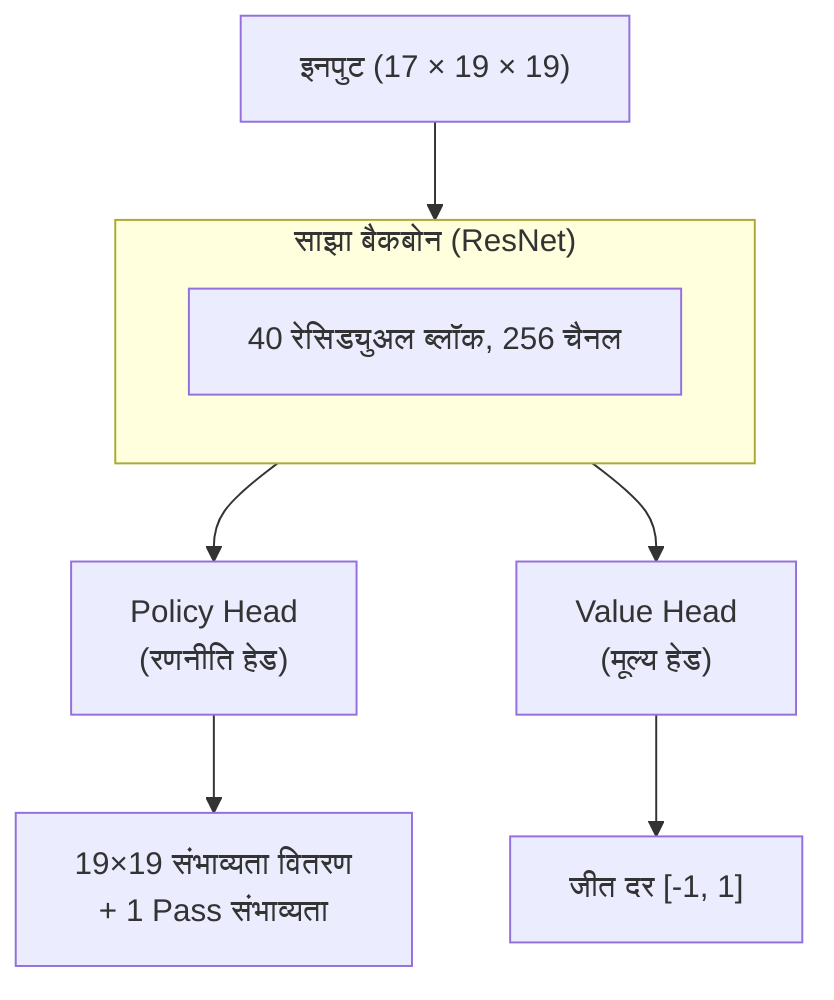
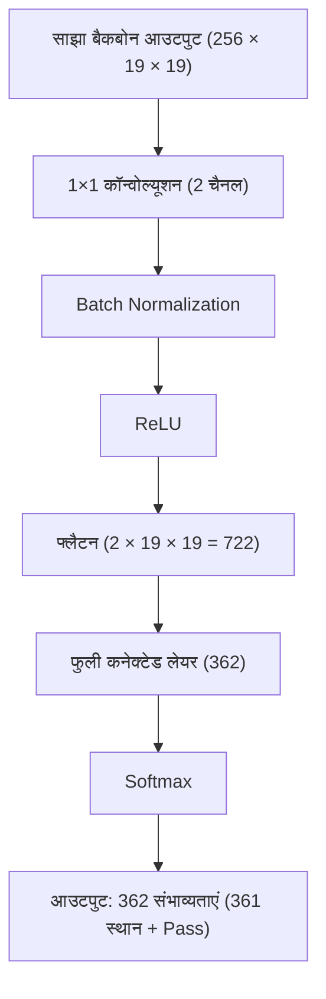
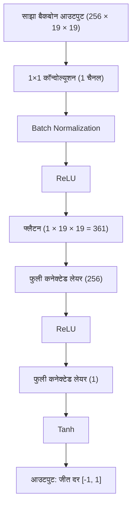
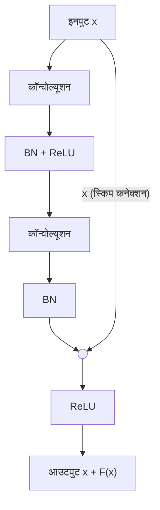

# डुअल-हेड नेटवर्क और रेसिड्युअल नेटवर्क

AlphaGo Zero के सबसे महत्वपूर्ण आर्किटेक्चर नवाचारों में से एक, **डुअल-हेड नेटवर्क** का उपयोग करके मूल AlphaGo के दोहरे नेटवर्क डिज़ाइन को बदलना है। यह प्रतीत होने वाला सरल परिवर्तन महत्वपूर्ण प्रदर्शन सुधार और अधिक सुंदर सीखने की प्रक्रिया लाया।

यह लेख इस आर्किटेक्चर के डिज़ाइन सिद्धांतों, गणितीय आधार, और यह इतना प्रभावी क्यों है, का गहन विश्लेषण करेगा।

---

## डुअल-हेड नेटवर्क डिज़ाइन

### समग्र आर्किटेक्चर

AlphaGo Zero के न्यूरल नेटवर्क को तीन भागों में विभाजित किया जा सकता है:



आइए प्रत्येक भाग का विश्लेषण करें।

### साझा बैकबोन (Shared Backbone)

साझा बैकबोन एक गहरा **रेसिड्युअल नेटवर्क (ResNet)** है, जो बोर्ड स्थिति से विशेषताएं निकालने के लिए जिम्मेदार है।

#### आर्किटेक्चर विवरण

| घटक | विनिर्देश |
|------|------|
| इनपुट लेयर | 3×3 कॉन्वोल्यूशन, 256 चैनल |
| रेसिड्युअल ब्लॉक | 40 (या 20 कॉम्पैक्ट संस्करण) |
| प्रति रेसिड्युअल ब्लॉक | 2 लेयर 3×3 कॉन्वोल्यूशन, 256 चैनल |
| एक्टिवेशन फ़ंक्शन | ReLU |
| नॉर्मलाइज़ेशन | Batch Normalization |

#### गणितीय प्रतिनिधित्व

मान लें इनपुट x (आयाम 17 x 19 x 19), साझा बैकबोन का आउटपुट:

```
f(x) = ResNet_40(Conv_3x3(x))
```

जहां f(x) (आयाम 256 x 19 x 19) उच्च-आयामी विशेषता प्रतिनिधित्व है।

### Policy Head (रणनीति हेड)

Policy Head प्रत्येक स्थान की चाल संभाव्यता की भविष्यवाणी के लिए जिम्मेदार है।

#### आर्किटेक्चर विवरण



#### गणितीय प्रतिनिधित्व

```
π = Softmax(FC(Flatten(ReLU(BN(Conv_1x1(f(x)))))))
```

आउटपुट π एक 362-आयामी वेक्टर है, जिसमें सभी तत्व गैर-ऋणात्मक हैं और योग 1 है।

### Value Head (मूल्य हेड)

Value Head वर्तमान स्थिति की जीत दर की भविष्यवाणी के लिए जिम्मेदार है।

#### आर्किटेक्चर विवरण



#### गणितीय प्रतिनिधित्व

```
v = Tanh(FC_1(ReLU(FC_2(Flatten(ReLU(BN(Conv_1x1(f(x)))))))))
```

आउटपुट v [-1, 1] रेंज में है:
- v = 1: वर्तमान पक्ष निश्चित जीत
- v = -1: वर्तमान पक्ष निश्चित हार
- v = 0: बराबर

---

## बैकबोन साझा क्यों करें?

### सहज समझ

"अगली चाल कहां चलनी चाहिए" (Policy) और "कौन जीतेगा" (Value)—इन दो प्रश्नों के लिए वास्तव में समान बोर्ड पैटर्न को समझने की आवश्यकता है:

- **आकार**: कौन से आकार अच्छे हैं, कौन से बुरे
- **प्रभाव**: कौन सा पक्ष बड़ा है, कहां अभी भी जगह है
- **जीवन और मृत्यु**: कौन से पत्थर जीवित हैं, कौन से अभी भी को में हैं
- **लड़ाई**: कहां हमला और कैप्चर है, स्थानीय परिणाम क्या है

यदि दो स्वतंत्र नेटवर्क का उपयोग करें, इन विशेषताओं को दो बार सीखना होगा। साझा बैकबोन इन आधारभूत विशेषताओं को केवल एक बार सीखने देता है, दोनों कार्य उपयोग कर सकते हैं।

### मल्टी-टास्क लर्निंग परिप्रेक्ष्य

मशीन लर्निंग के दृष्टिकोण से, यह एक प्रकार की **मल्टी-टास्क लर्निंग** है:

```
L = L_policy + L_value
```

दो कार्य निचले स्तर के प्रतिनिधित्व को साझा करते हैं, जिसके कई फायदे हैं:

#### 1. नियमितीकरण प्रभाव

साझा पैरामीटर निहित नियमितीकरण के समान है। यदि कोई विशेषता केवल Policy के लिए उपयोगी है Value के लिए नहीं (या इसके विपरीत), इसे अधिक बढ़ाना कठिन है।

प्रभावी पैरामीटर संख्या दो स्वतंत्र नेटवर्क की पैरामीटर संख्या से कम है।

#### 2. डेटा दक्षता

प्रत्येक खेल एक साथ Policy लेबल (MCTS खोज संभाव्यता) और Value लेबल (अंतिम जीत-हार) उत्पन्न करता है। साझा बैकबोन दोनों लेबल को साझा विशेषताओं के प्रशिक्षण के लिए उपयोग करने देता है, डेटा उपयोग दक्षता बढ़ाता है।

#### 3. समृद्ध ग्रेडिएंट सिग्नल

दोनों कार्यों के ग्रेडिएंट साझा बैकबोन की ओर प्रवाहित होते हैं:

```
∂L/∂θ_shared = ∂L_policy/∂θ_shared + ∂L_value/∂θ_shared
```

यह समृद्ध पर्यवेक्षण सिग्नल प्रदान करता है, साझा विशेषताओं को अधिक मजबूत बनाता है।

### प्रायोगिक साक्ष्य

DeepMind के एब्लेशन प्रयोग दिखाते हैं कि डुअल-हेड नेटवर्क का प्रदर्शन अलग दोहरे नेटवर्क से काफी बेहतर है:

| कॉन्फ़िगरेशन | ELO रेटिंग | सापेक्ष अंतर |
|------|----------|----------|
| अलग Policy + Value नेटवर्क | आधार रेखा | - |
| डुअल-हेड नेटवर्क (साझा बैकबोन) | +300 ELO | ~65% जीत दर अंतर |

300 ELO का अंतर मतलब डुअल-हेड नेटवर्क की अलग नेटवर्क के विरुद्ध लगभग 65% जीत दर है। यह एक महत्वपूर्ण सुधार है।

---

## रेसिड्युअल नेटवर्क सिद्धांत

### गहरे नेटवर्क की दुविधा

ResNet के आविष्कार से पहले, गहरे न्यूरल नेटवर्क एक विरोधाभास का सामना करते थे:

> सैद्धांतिक रूप से, गहरे नेटवर्क कम से कम उथले नेटवर्क जितने अच्छे होने चाहिए (सबसे खराब स्थिति में, अतिरिक्त लेयर आइडेंटिटी मैपिंग सीख सकती हैं)। लेकिन वास्तव में, गहरे नेटवर्क अक्सर खराब प्रदर्शन करते हैं।

यह **डिग्रेडेशन समस्या** है:

- प्रशिक्षण त्रुटि गहराई के साथ बढ़ती है (ओवरफिटिंग नहीं, अनुकूलन कठिनाई)
- ग्रेडिएंट बैकप्रॉपगेशन में धीरे-धीरे गायब होता है (Vanishing Gradient)
- गहरी लेयर के पैरामीटर लगभग प्रभावी ढंग से अपडेट नहीं हो पाते

### रेसिड्युअल ब्लॉक का डिज़ाइन

हे काइमिंग और अन्य ने 2015 में एक संक्षिप्त और सुंदर समाधान प्रस्तावित किया: **रेसिड्युअल कनेक्शन (Skip Connection)**।



#### गणितीय प्रतिनिधित्व

पारंपरिक नेटवर्क: लक्ष्य मैपिंग H(x) सीखता है

```
y = H(x)
```

रेसिड्युअल नेटवर्क: **रेसिड्युअल मैपिंग** F(x) = H(x) - x सीखता है

```
y = F(x) + x
```

### रेसिड्युअल कनेक्शन क्यों काम करता है?

#### 1. ग्रेडिएंट हाईवे

बैकप्रॉपगेशन के ग्रेडिएंट पर विचार करें:

```
∂L/∂x = ∂L/∂y × ∂y/∂x = ∂L/∂y × (1 + ∂F(x)/∂x)
```

कुंजी वह **+1** है। भले ही ∂F(x)/∂x बहुत छोटा या शून्य हो, ग्रेडिएंट अभी भी +1 के माध्यम से सीधे वापस जा सकता है।

यह एक "ग्रेडिएंट हाईवे" बनाने जैसा है, जो ग्रेडिएंट को आउटपुट लेयर से इनपुट लेयर तक निर्बाध रूप से प्रवाहित होने देता है।

#### 2. आइडेंटिटी मैपिंग सीखना आसान

यदि इष्टतम समाधान आइडेंटिटी मैपिंग के करीब है (H(x) लगभग x के बराबर), तो:
- पारंपरिक नेटवर्क: H(x) = x सीखना होगा, कठिन हो सकता है
- रेसिड्युअल नेटवर्क: केवल F(x) लगभग 0 सीखना है, अपेक्षाकृत आसान

वेट को शून्य या शून्य के करीब इनिशियलाइज़ करें, रेसिड्युअल ब्लॉक स्वाभाविक रूप से आइडेंटिटी मैपिंग की ओर झुकता है।

#### 3. एनसेंबल प्रभाव

गहरे ResNet को कई उथले नेटवर्क के **निहित एनसेंबल** के रूप में देखा जा सकता है। यदि n रेसिड्युअल ब्लॉक हैं, जानकारी 2^n विभिन्न पथों से प्रवाहित हो सकती है।

यह एनसेंबल प्रभाव मॉडल की मजबूती बढ़ाता है।

### ImageNet पर ResNet की सफलता

ResNet ने 2015 ImageNet प्रतियोगिता में आश्चर्यजनक परिणाम प्राप्त किए:

| गहराई | Top-5 त्रुटि दर |
|------|-------------|
| VGG-19 (बिना रेसिड्युअल) | 7.3% |
| ResNet-34 | 5.7% |
| ResNet-152 | 4.5% |
| मानव स्तर | ~5.1% |

**152 लेयर** का ResNet न केवल प्रशिक्षित हो सकता है, बल्कि 19 लेयर VGG से बहुत बेहतर है। इसने साबित किया कि रेसिड्युअल कनेक्शन वास्तव में गहरे नेटवर्क की प्रशिक्षण समस्या को हल करता है।

---

## AlphaGo Zero का 40 लेयर ResNet

### 40 लेयर क्यों चुनी?

DeepMind ने विभिन्न गहराई के ResNet का परीक्षण किया:

| रेसिड्युअल ब्लॉक संख्या | कुल लेयर | ELO रेटिंग |
|------------|--------|----------|
| 5 | 11 | आधार रेखा |
| 10 | 21 | +200 |
| 20 | 41 | +400 |
| 40 | 81 | +500 |

गहरा नेटवर्क वास्तव में मजबूत है, लेकिन सीमांत लाभ घटता है। AlphaGo Zero 20 या 40 रेसिड्युअल ब्लॉक का उपयोग करता है:

- **AlphaGo Zero (पेपर संस्करण)**: 40 रेसिड्युअल ब्लॉक, 256 चैनल
- **कॉम्पैक्ट संस्करण**: 20 रेसिड्युअल ब्लॉक, 256 चैनल

40 लेयर कॉन्फ़िगरेशन खेल क्षमता और प्रशिक्षण लागत के बीच अच्छा संतुलन प्राप्त करती है।

### विशिष्ट कॉन्फ़िगरेशन

AlphaGo Zero की ResNet कॉन्फ़िगरेशन:

```
इनपुट: 17 × 19 × 19
↓
कॉन्वोल्यूशन लेयर: 3×3, 256 चैनल, BN, ReLU
↓
रेसिड्युअल ब्लॉक ×40:
  ├─ कॉन्वोल्यूशन लेयर: 3×3, 256 चैनल, BN, ReLU
  ├─ कॉन्वोल्यूशन लेयर: 3×3, 256 चैनल, BN
  └─ स्किप कनेक्शन + ReLU
↓
Policy Head / Value Head
```

#### पैरामीटर संख्या अनुमान

| घटक | पैरामीटर संख्या (लगभग) |
|------|-------------|
| इनपुट कॉन्वोल्यूशन | 17 × 3 × 3 × 256 ≈ 39K |
| प्रति रेसिड्युअल ब्लॉक | 2 × 256 × 3 × 3 × 256 ≈ 1.2M |
| 40 रेसिड्युअल ब्लॉक | 40 × 1.2M ≈ 47M |
| Policy Head | ~1M |
| Value Head | ~0.2M |
| **कुल** | **~48M** |

लगभग 4.8 करोड़ पैरामीटर, आधुनिक मानकों से मध्यम आकार का न्यूरल नेटवर्क है।

### Batch Normalization की भूमिका

प्रत्येक कॉन्वोल्यूशन लेयर के बाद **Batch Normalization (BN)** है, जो प्रशिक्षण स्थिरता के लिए महत्वपूर्ण है:

#### 1. एक्टिवेशन वैल्यू का नॉर्मलाइज़ेशन

BN प्रत्येक लेयर के एक्टिवेशन वैल्यू को माध्य 0, विचरण 1 में नॉर्मलाइज़ करता है:

```
x_hat = (x - μ_B) / sqrt(σ_B² + ε)
y = γ × x_hat + β
```

जहां γ और β सीखने योग्य पैरामीटर हैं।

#### 2. आंतरिक सहप्रसरण शिफ्ट को कम करना

गहरे नेटवर्क में, प्रत्येक लेयर का इनपुट वितरण पिछली लेयर के पैरामीटर अपडेट के साथ बदलता है। BN प्रत्येक लेयर के इनपुट वितरण को स्थिर रखता है, प्रशिक्षण कन्वर्जेंस को तेज़ करता है।

#### 3. नियमितीकरण प्रभाव

BN प्रशिक्षण में mini-batch की सांख्यिकी का उपयोग करता है, यादृच्छिकता लाता है, हल्का नियमितीकरण प्रभाव होता है।

---

## अन्य आर्किटेक्चर से तुलना

### vs. मूल AlphaGo का CNN

| विशेषता | AlphaGo मूल | AlphaGo Zero |
|------|-------------|--------------|
| आर्किटेक्चर प्रकार | मानक CNN | ResNet |
| गहराई | 13 लेयर | 41-81 लेयर |
| रेसिड्युअल कनेक्शन | नहीं | हां |
| नेटवर्क संख्या | 2 (अलग) | 1 (साझा) |
| BN | नहीं | हां |

### vs. VGG शैली नेटवर्क

VGG 2014 ImageNet उपविजेता का आर्किटेक्चर है, स्टैक्ड 3×3 कॉन्वोल्यूशन का उपयोग:

| विशेषता | VGG | ResNet |
|------|-----|--------|
| अधिकतम प्रशिक्षण योग्य गहराई | ~19 लेयर | 152+ लेयर |
| ग्रेडिएंट प्रवाह | लेयर दर लेयर घटता है | हाईवे है |
| प्रशिक्षण कठिनाई | गहरा कठिन | गहरा प्रशिक्षण योग्य |

### vs. Inception / GoogLeNet

Inception मल्टी-स्केल कॉन्वोल्यूशन समानांतर उपयोग करता है:

| विशेषता | Inception | ResNet |
|------|-----------|--------|
| विशेषता | मल्टी-स्केल विशेषताएं | गहराई स्टैकिंग |
| जटिलता | उच्च | संक्षिप्त |
| Go उपयुक्तता | सामान्य | उत्कृष्ट |

ResNet का संक्षिप्त डिज़ाइन Go जैसे गहरे तर्क की आवश्यकता वाले कार्यों के लिए अधिक उपयुक्त है।

### vs. Transformer

2017 में प्रस्तावित Transformer आर्किटेक्चर ने NLP क्षेत्र में बड़ी सफलता प्राप्त की। कुछ ने Transformer को Go पर लागू करने का प्रयास किया:

| विशेषता | ResNet | Transformer |
|------|--------|-------------|
| इंडक्टिव बायस | स्थानीयता (कॉन्वोल्यूशन) | ग्लोबल अटेंशन |
| पोज़िशन एन्कोडिंग | निहित (कॉन्वोल्यूशन) | स्पष्ट |
| Go प्रदर्शन | उत्कृष्ट | संभव लेकिन ResNet से बेहतर नहीं |
| गणना दक्षता | उच्च | कम (O(n²)) |

स्पष्ट स्थानिक संरचना वाली Go जैसी समस्याओं के लिए, CNN/ResNet का इंडक्टिव बायस अधिक उपयुक्त है।

---

## डिज़ाइन चयन का गहन विश्लेषण

### 3×3 कॉन्वोल्यूशन क्यों?

AlphaGo Zero पूरे समय 3×3 कॉन्वोल्यूशन का उपयोग करता है, बड़े कॉन्वोल्यूशन कर्नेल के बजाय:

1. **पैरामीटर दक्षता**: दो 3×3 कॉन्वोल्यूशन का रिसेप्टिव फील्ड एक 5×5 के बराबर है, लेकिन पैरामीटर कम (18 vs 25)
2. **गहरा नेटवर्क**: समान पैरामीटर संख्या में, अधिक लेयर स्टैक कर सकते हैं
3. **अधिक नॉनलीनियरिटी**: प्रत्येक लेयर के बीच ReLU है, अभिव्यक्ति क्षमता बढ़ती है

### 256 चैनल क्यों?

256 चैनल एक अनुभवजन्य चयन है:

- **बहुत कम** (जैसे 64): अपर्याप्त अभिव्यक्ति क्षमता, जटिल पैटर्न कैप्चर नहीं कर सकता
- **बहुत अधिक** (जैसे 512): पैरामीटर संख्या दोगुनी, प्रशिक्षण लागत बहुत बढ़ती है, लेकिन खेल क्षमता सुधार सीमित

बाद के KataGo प्रयोग दिखाते हैं कि प्रशिक्षण संसाधनों के अनुसार चैनल संख्या समायोजित की जा सकती है:
- कम संसाधन: 128 चैनल, 20 ब्लॉक
- अधिक संसाधन: 256 चैनल, 40 ब्लॉक
- और अधिक संसाधन: 384 चैनल, 60 ब्लॉक

### Policy Head Softmax और Value Head Tanh क्यों?

#### Policy Head: Softmax

चाल चलना एक **वर्गीकरण समस्या** है—361 स्थानों (प्लस Pass) में से एक चुनना। Softmax आउटपुट संतुष्ट करता है:
- सभी संभाव्यताएं गैर-ऋणात्मक: π_i >= 0
- संभाव्यता योग 1: Σπ_i = 1

यह संभाव्यता वितरण की परिभाषा के अनुरूप है।

#### Value Head: Tanh

जीत दर एक **रिग्रेशन समस्या** है—एक सतत मान की भविष्यवाणी। Tanh आउटपुट रेंज [-1, 1] है:
- बाउंडेड: चरम मान उत्पन्न नहीं होते
- सममित: जीत और हार को सममित रूप से संभालता है
- डिफरेंशिएबल: ग्रेडिएंट गणना सुविधाजनक

अनबाउंडेड आउटपुट (जैसे लीनियर लेयर) के बजाय Tanh का उपयोग प्रशिक्षण अस्थिरता को रोकता है।

---

## प्रशिक्षण विवरण

### लॉस फ़ंक्शन

AlphaGo Zero का कुल लॉस तीन टर्म का योग है:

```
L = L_policy + L_value + L_reg
```

#### Policy Loss

**क्रॉस-एंट्रॉपी लॉस** का उपयोग, नेटवर्क आउटपुट को MCTS खोज संभाव्यता के करीब लाने के लिए:

```
L_policy = -Σ π_MCTS(a) × log(π_net(a))
```

जहां:
- π_MCTS(a) एक्शन a के लिए MCTS खोज संभाव्यता है
- π_net(a) नेटवर्क आउटपुट संभाव्यता है

#### Value Loss

**मीन स्क्वेयर्ड एरर (MSE)** का उपयोग, नेटवर्क आउटपुट को वास्तविक जीत-हार के करीब लाने के लिए:

```
L_value = (v_net - z)²
```

जहां:
- v_net नेटवर्क द्वारा भविष्यवाणित जीत दर है
- z वास्तविक मैच परिणाम है (+1 या -1)

#### Regularization Loss

ओवरफिटिंग रोकने के लिए **L2 नियमितीकरण**:

```
L_reg = c × ||θ||²
```

जहां c नियमितीकरण गुणांक है, θ नेटवर्क पैरामीटर हैं।

### ऑप्टिमाइज़र कॉन्फ़िगरेशन

| पैरामीटर | मान |
|------|-----|
| ऑप्टिमाइज़र | SGD + Momentum |
| मोमेंटम | 0.9 |
| प्रारंभिक लर्निंग रेट | 0.01 |
| लर्निंग रेट डिके | प्रत्येक X स्टेप पर आधा |
| Batch Size | 32 × 2048 = 64K (वितरित) |
| L2 नियमितीकरण गुणांक | 1e-4 |

### डेटा ऑग्मेंटेशन

Go बोर्ड में 8-गुना सममिति है (4 रोटेशन × 2 फ्लिप)। प्रशिक्षण में, प्रत्येक स्थिति 8 समकक्ष प्रशिक्षण नमूने उत्पन्न कर सकती है।

इससे प्रभावी प्रशिक्षण डेटा 8 गुना बढ़ जाता है, बिना अतिरिक्त सेल्फ-प्ले के।

---

## कार्यान्वयन संबंधी विचार

### मेमोरी अनुकूलन

40 लेयर ResNet प्रशिक्षण के लिए बड़ी मेमोरी की आवश्यकता है:
- **फॉरवर्ड पास**: प्रत्येक लेयर के एक्टिवेशन वैल्यू संग्रहीत करने होते हैं (बैकप्रॉपगेशन के लिए)
- **बैकवर्ड पास**: ग्रेडिएंट संग्रहीत करने होते हैं

अनुकूलन रणनीतियां:
1. **ग्रेडिएंट चेकपॉइंटिंग**: केवल कुछ एक्टिवेशन वैल्यू संग्रहीत करें, आवश्यकता पर पुनः गणना
2. **मिक्स्ड प्रिसिज़न ट्रेनिंग**: मेमोरी कम करने के लिए FP16 का उपयोग
3. **वितरित प्रशिक्षण**: batch को कई GPU/TPU में वितरित करें

### इन्फरेंस अनुकूलन

इन्फरेंस में BN की mini-batch सांख्यिकी की आवश्यकता नहीं, प्रशिक्षण में संचित मूविंग एवरेज का उपयोग कर सकते हैं:

```
x_hat = (x - μ_moving) / sqrt(σ_moving² + ε)
```

इससे इन्फरेंस तेज़ और परिणाम निर्धारित होता है।

### क्वांटाइज़ेशन और कम्प्रेशन

डिप्लॉयमेंट में नेटवर्क को और कम्प्रेस कर सकते हैं:
- **वेट क्वांटाइज़ेशन**: FP32 → INT8, मेमोरी 4 गुना कम
- **प्रूनिंग**: छोटे वेट कनेक्शन हटाएं
- **नॉलेज डिस्टिलेशन**: बड़े नेटवर्क से छोटा नेटवर्क प्रशिक्षित करें

---

## एनिमेशन संदर्भ

इस लेख में शामिल मुख्य अवधारणाएं और एनिमेशन नंबर:

| नंबर | अवधारणा | भौतिकी/गणित समकक्ष |
|------|------|--------------|
| E3 | डुअल-हेड नेटवर्क | मल्टी-टास्क लर्निंग |
| D12 | रेसिड्युअल कनेक्शन | ग्रेडिएंट हाईवे |
| D8 | कॉन्वोल्यूशनल न्यूरल नेटवर्क | लोकल रिसेप्टिव फील्ड |
| D10 | Batch Normalization | डिस्ट्रिब्यूशन नॉर्मलाइज़ेशन |

---

## आगे पढ़ने के लिए

- **पिछला लेख**: [AlphaGo Zero अवलोकन](../alphago-zero) — मानव शतरंज रिकॉर्ड की आवश्यकता क्यों नहीं
- **अगला लेख**: [शून्य से प्रशिक्षण प्रक्रिया](../training-from-scratch) — Day 0-3 का विस्तृत विकास
- **तकनीकी गहराई**: [CNN और Go का संयोजन](../cnn-and-go) — CNN बोर्ड के लिए क्यों उपयुक्त है

---

## संदर्भ

1. Silver, D., et al. (2017). "Mastering the game of Go without human knowledge." *Nature*, 550, 354-359.
2. He, K., et al. (2016). "Deep Residual Learning for Image Recognition." *CVPR 2016*.
3. Ioffe, S., & Szegedy, C. (2015). "Batch Normalization: Accelerating Deep Network Training by Reducing Internal Covariate Shift." *ICML 2015*.
4. Caruana, R. (1997). "Multitask Learning." *Machine Learning*, 28(1), 41-75.
5. Veit, A., et al. (2016). "Residual Networks Behave Like Ensembles of Relatively Shallow Networks." *NeurIPS 2016*.
