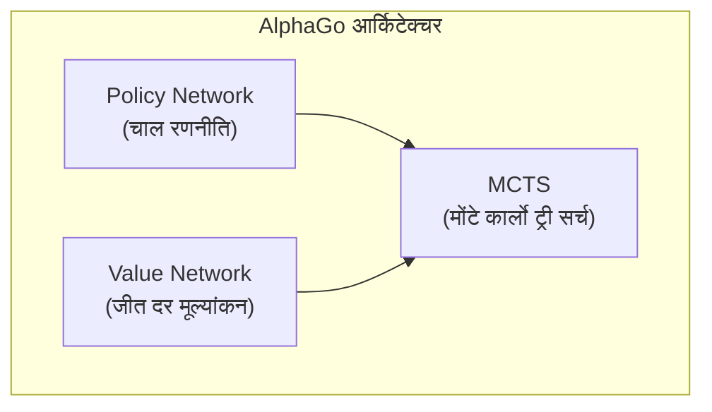
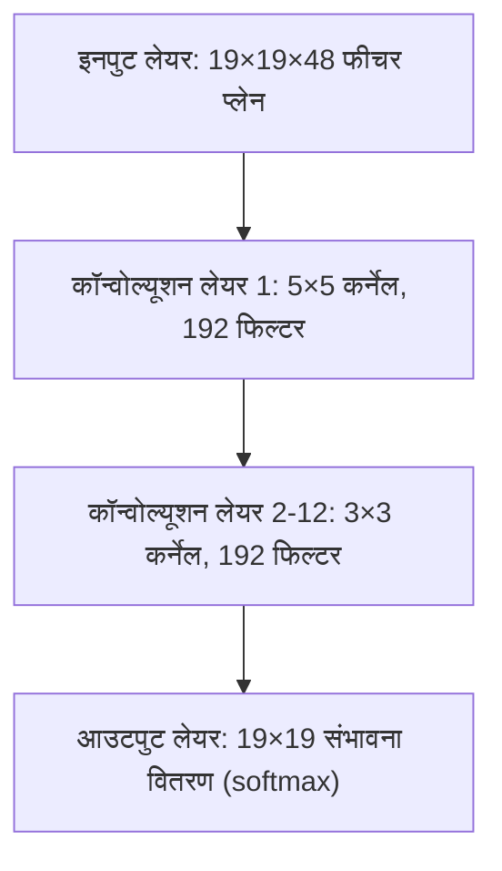
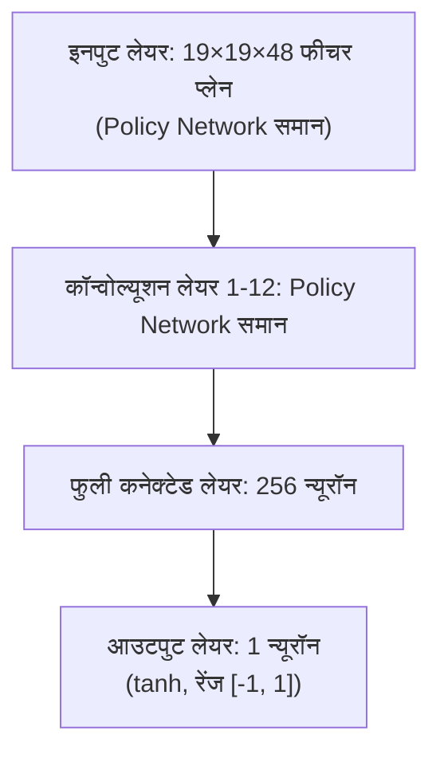
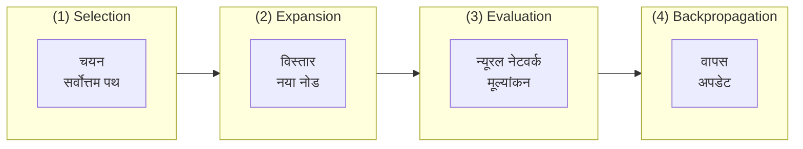
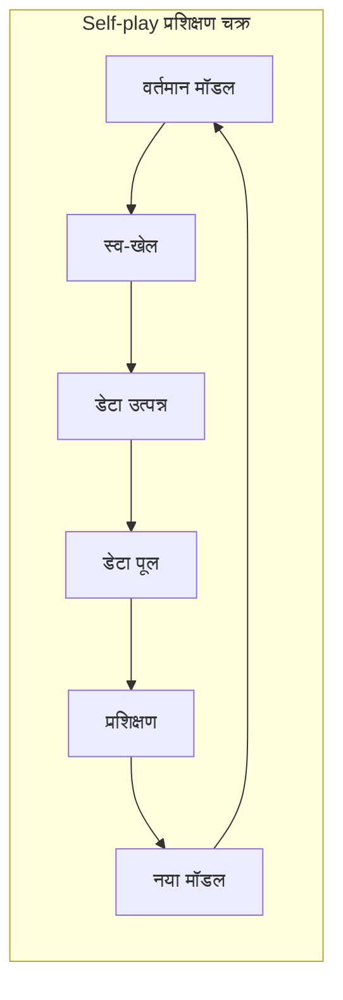
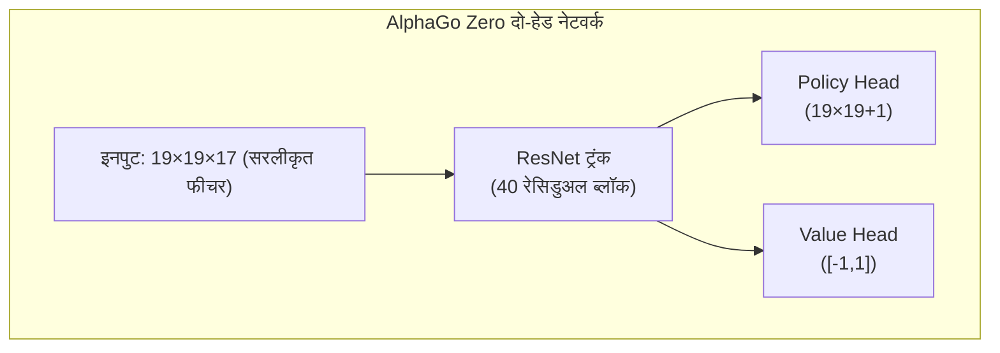

# AlphaGo पेपर विश्लेषण

यह लेख DeepMind द्वारा Nature में प्रकाशित क्लासिक पेपर《Mastering the game of Go with deep neural networks and tree search》का गहन विश्लेषण करता है, साथ ही बाद के AlphaGo Zero और AlphaZero पेपर भी।

## AlphaGo का ऐतिहासिक महत्व

गो को लंबे समय से आर्टिफिशियल इंटेलिजेंस की "पवित्र कंघी" चुनौती माना जाता था। शतरंज के विपरीत, गो का खोज स्थान अत्यंत विशाल है:

| खेल | औसत शाखा कारक | औसत खेल लंबाई | स्थिति स्थान |
|------|-------------|-------------|----------|
| शतरंज | ~35 | ~80 | ~10^47 |
| गो | ~250 | ~150 | ~10^170 |

पारंपरिक ब्रूट-फोर्स खोज विधि गो पर पूरी तरह अव्यावहारिक थी। 2016 में AlphaGo द्वारा ली सेडोल को हराना डीप लर्निंग और रीइनफोर्समेंट लर्निंग के संयोजन की शक्ति का प्रमाण था।

### मील के पत्थर घटनाएं

- **2015 अक्टूबर**: AlphaGo Fan ने 5:0 से यूरोपीय चैंपियन फान हुई (पेशेवर 2-डान) को हराया
- **2016 मार्च**: AlphaGo Lee ने 4:1 से विश्व चैंपियन ली सेडोल (पेशेवर 9-डान) को हराया
- **2017 मई**: AlphaGo Master ने 3:0 से विश्व नंबर 1 के जी को हराया
- **2017 अक्टूबर**: AlphaGo Zero प्रकाशित, शुद्ध स्व-खेल प्रशिक्षण, सभी पूर्व संस्करणों को पार

## मूल तकनीकी आर्किटेक्चर

AlphaGo का मूल नवाचार तीन प्रमुख तकनीकों का संयोजन है:



### Policy Network (रणनीति नेटवर्क)

Policy Network प्रत्येक स्थिति की चाल संभावना भविष्यवाणी करता है, खोज दिशा निर्देशित करने के लिए।

#### नेटवर्क आर्किटेक्चर



#### इनपुट फीचर

AlphaGo 48 फीचर प्लेन इनपुट के रूप में उपयोग करता है:

| फीचर | प्लेन संख्या | विवरण |
|------|--------|------|
| पत्थर का रंग | 3 | काला, सफेद, खाली |
| लिबर्टी | 8 | 1 लिबर्टी, 2 लिबर्टी, ..., 8+ लिबर्टी |
| अताड़ी के बाद लिबर्टी | 8 | कैप्चर के बाद कितनी लिबर्टी |
| कैप्चर संख्या | 8 | उस स्थिति पर कितने पत्थर कैप्चर होंगे |
| को | 1 | क्या को पोजीशन है |
| चाल वैधता | 1 | क्या उस स्थिति पर खेल सकते हैं |
| पिछली 1-8 चालों की स्थिति | 8 | पिछली कुछ चालों की स्थिति |
| किसकी बारी | 1 | अभी काले या सफेद की बारी |

#### प्रशिक्षण विधि

Policy Network का प्रशिक्षण दो चरणों में:

**पहला चरण: सुपरवाइज्ड लर्निंग (SL Policy Network)**
- KGS गो सर्वर के 3 करोड़ गेम रिकॉर्ड का उपयोग
- लक्ष्य: मानव खिलाड़ी की अगली चाल भविष्यवाणी
- 57% भविष्यवाणी सटीकता प्राप्त

**दूसरा चरण: रीइनफोर्समेंट लर्निंग (RL Policy Network)**
- SL Policy Network से शुरू
- अपने पिछले संस्करण से खेलना
- REINFORCE एल्गोरिदम से अनुकूलन

```python
# सरलीकृत Policy Gradient अपडेट
# reward: +1 जीत, -1 हार
loss = -log(policy[action]) * reward
```

### Value Network (मूल्य नेटवर्क)

Value Network वर्तमान स्थिति की जीत दर मूल्यांकन करता है, खोज गहराई कम करने के लिए।

#### नेटवर्क आर्किटेक्चर



#### प्रशिक्षण विधि

Value Network RL Policy Network स्व-खेल से उत्पन्न 3 करोड़ स्थितियों पर प्रशिक्षित:

- हर गेम से एक स्थिति यादृच्छिक रूप से सैंपल
- अंतिम जीत/हार को लेबल के रूप में उपयोग
- MSE लॉस फंक्शन उपयोग

```python
# Value Network प्रशिक्षण
value_prediction = value_network(position)
loss = (value_prediction - game_outcome) ** 2
```

**हर गेम से केवल एक सैंपल क्यों?**

यदि कई सैंपल लें, तो एक ही गेम की आसपास की स्थितियां अत्यधिक सहसंबद्ध होंगी, जिससे ओवरफिटिंग होगी। यादृच्छिक सैंपलिंग प्रशिक्षण डेटा की विविधता सुनिश्चित करती है।

## मोंटे कार्लो ट्री सर्च (MCTS)

MCTS AlphaGo का निर्णय केंद्र है, न्यूरल नेटवर्क के साथ मिलकर कुशलता से सर्वोत्तम चाल खोजता है।

### MCTS चार चरण



### चयन सूत्र (PUCT)

AlphaGo PUCT (Predictor + UCT) सूत्र से खोजने की शाखा चुनता है:

```
a = argmax[Q(s,a) + u(s,a)]

u(s,a) = c_puct * P(s,a) * sqrt(N(s)) / (1 + N(s,a))
```

जहां:
- **Q(s,a)**: एक्शन a का औसत मूल्य (exploitation)
- **P(s,a)**: Policy Network की प्रायर प्रोबेबिलिटी
- **N(s)**: पेरेंट नोड की विज़िट संख्या
- **N(s,a)**: उस एक्शन की विज़िट संख्या
- **c_puct**: एक्सप्लोरेशन कॉन्स्टेंट, exploration और exploitation में संतुलन

### खोज प्रक्रिया विस्तार

1. **Selection**: रूट नोड से, PUCT सूत्र से एक्शन चुनें, लीफ नोड तक पहुंचें
2. **Expansion**: लीफ नोड पर नए चाइल्ड नोड विस्तारित करें, Policy Network से प्रायर प्रोबेबिलिटी इनिशियलाइज़
3. **Evaluation**: Value Network मूल्यांकन और तेज़ रोलआउट सिमुलेशन से मूल्य मूल्यांकन
4. **Backpropagation**: मूल्यांकन मान पथ पर वापस भेजें, Q मान और N मान अपडेट करें

### Rollout (तेज़ चाल)

AlphaGo (गैर-Zero संस्करण) एक छोटे तेज़ पॉलिसी नेटवर्क से सिमुलेशन भी करता है:

```
लीफ नोड → तेज़ यादृच्छिक चाल गेम समाप्ति तक → जीत/हार गणना
```

अंतिम मूल्यांकन मान Value Network और Rollout का संयोजन:

```
V = λ * v_network + (1-λ) * v_rollout
```

AlphaGo λ = 0.5 उपयोग करता है, दोनों को समान वेट।

## Self-play प्रशिक्षण विधि

Self-play AlphaGo की मूल प्रशिक्षण रणनीति है, AI को स्वयं से खेलकर निरंतर सुधार करने देती है।

### प्रशिक्षण चक्र



### Self-play प्रभावी क्यों है?

1. **अनंत डेटा**: मानव गेम रिकॉर्ड संख्या से सीमित नहीं
2. **अनुकूली कठिनाई**: प्रतिद्वंद्वी की ताकत अपने साथ बढ़ती है
3. **नवाचार की खोज**: मानव की परंपरागत सोच से सीमित नहीं
4. **स्पष्ट लक्ष्य**: सीधे जीत दर अनुकूलित करना, मानव की नकल नहीं

## AlphaGo Zero के सुधार

2017 में प्रकाशित AlphaGo Zero ने क्रांतिकारी सुधार किए:

### मुख्य अंतर

| विशेषता | AlphaGo | AlphaGo Zero |
|------|---------|--------------|
| प्रारंभिक प्रशिक्षण | मानव गेम रिकॉर्ड सुपरवाइज्ड लर्निंग | पूरी तरह शून्य से शुरू |
| नेटवर्क आर्किटेक्चर | अलग Policy/Value | एकल दो-हेड नेटवर्क |
| नेटवर्क संरचना | सामान्य CNN | ResNet |
| फीचर इंजीनियरिंग | 48 हस्त-निर्मित फीचर | 17 सरल फीचर |
| Rollout | आवश्यक | अनावश्यक |
| प्रशिक्षण समय | कई महीने | 3 दिन में मानव से आगे |

### आर्किटेक्चर सरलीकरण



### सरलीकृत इनपुट फीचर

AlphaGo Zero केवल 17 फीचर प्लेन उपयोग करता है:

- 8 प्लेन: अपनी पिछली 8 चालों की पत्थर स्थिति
- 8 प्लेन: प्रतिद्वंद्वी की पिछली 8 चालों की पत्थर स्थिति
- 1 प्लेन: वर्तमान में किसकी बारी (पूर्ण 0 या पूर्ण 1)

### प्रशिक्षण सुधार

1. **शुद्ध Self-play**: कोई मानव डेटा उपयोग नहीं
2. **MCTS प्रोबेबिलिटी सीधे प्रशिक्षण लक्ष्य के रूप में**: बाइनरी जीत/हार नहीं
3. **Rollout नहीं**: पूरी तरह Value Network पर निर्भर
4. **एकल नेटवर्क प्रशिक्षण**: Policy और Value पैरामीटर साझा, परस्पर मजबूती

## AlphaZero का सार्वभौमीकरण

2017 के अंत में प्रकाशित AlphaZero ने समान आर्किटेक्चर को गो, शतरंज और शोगी पर लागू किया:

### मुख्य विशेषताएं

- **शून्य डोमेन ज्ञान**: गेम नियमों के अलावा, कोई डोमेन-विशिष्ट ज्ञान उपयोग नहीं
- **एकीकृत आर्किटेक्चर**: एक ही एल्गोरिदम विभिन्न बोर्ड गेम्स पर लागू
- **तेज़ प्रशिक्षण**:
  - गो: 8 घंटे में AlphaGo Lee से आगे
  - शतरंज: 4 घंटे में Stockfish से आगे
  - शोगी: 2 घंटे में Elmo से आगे

### AlphaGo Zero से अंतर

| विशेषता | AlphaGo Zero | AlphaZero |
|------|-------------|-----------|
| लक्ष्य गेम | केवल गो | गो, शतरंज, शोगी |
| सिमेट्री उपयोग | गो की 8-गुना सिमेट्री उपयोग | सिमेट्री नहीं मानना |
| हाइपरपैरामीटर ट्यूनिंग | गो के लिए अनुकूलित | सार्वभौमिक सेटिंग |
| प्रशिक्षण विधि | सर्वोत्तम मॉडल स्व-खेल | नवीनतम मॉडल स्व-खेल |

## कार्यान्वयन मुख्य बिंदु

यदि आप समान प्रणाली लागू करना चाहते हैं, तो मुख्य विचार:

### कम्प्यूटिंग संसाधन

AlphaGo के प्रशिक्षण के लिए विशाल कम्प्यूटिंग संसाधन:

- **AlphaGo Lee**: 176 GPU + 48 TPU
- **AlphaGo Zero**: 4 TPU (प्रशिक्षण) + 1 TPU (स्व-खेल)
- **AlphaZero**: 5000 TPU (प्रशिक्षण)

### मुख्य हाइपरपैरामीटर

```python
# MCTS संबंधित
num_simulations = 800     # प्रति चाल सिमुलेशन संख्या
c_puct = 1.5              # एक्सप्लोरेशन कॉन्स्टेंट
temperature = 1.0         # एक्शन चयन टेम्परेचर

# प्रशिक्षण संबंधित
batch_size = 2048
learning_rate = 0.01      # डिके सहित
l2_regularization = 1e-4
```

### सामान्य समस्याएं

1. **प्रशिक्षण अस्थिरता**: छोटी लर्निंग रेट, बड़ा batch size
2. **ओवरफिटिंग**: प्रशिक्षण डेटा विविधता सुनिश्चित करें, रेगुलराइजेशन उपयोग
3. **खोज दक्षता**: GPU बैच इंफरेंस अनुकूलित करें, MCTS समानांतर करें

## आगे पढ़ें

- [मूल पेपर: Mastering the game of Go with deep neural networks and tree search](https://www.nature.com/articles/nature16961)
- [AlphaGo Zero पेपर: Mastering the game of Go without human knowledge](https://www.nature.com/articles/nature24270)
- [AlphaZero पेपर: A general reinforcement learning algorithm that masters chess, shogi, and Go through self-play](https://www.science.org/doi/10.1126/science.aar6404)

AlphaGo की तकनीक समझने के बाद, अब देखें [KataGo ने इस आधार पर क्या सुधार किए](./katago-paper.md)।
