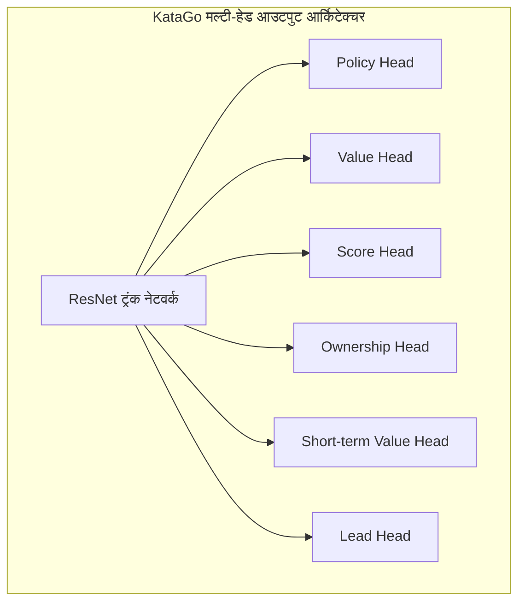
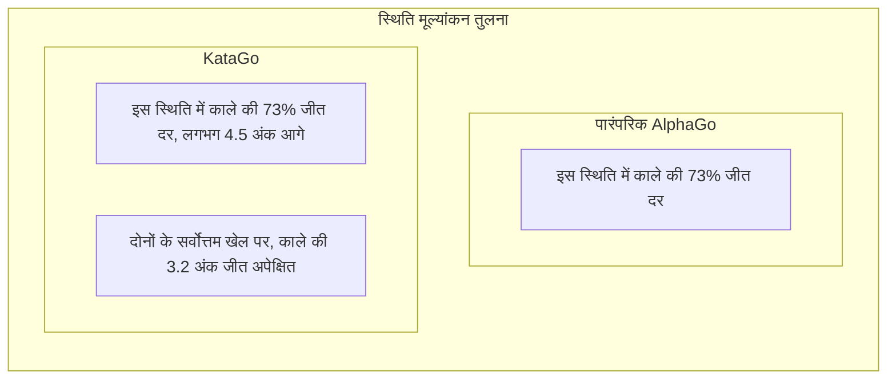

# KataGo पेपर विश्लेषण

KataGo David Wu द्वारा विकसित ओपन-सोर्स गो AI है, इसका पेपर《Accelerating Self-Play Learning in Go》2019 में प्रकाशित हुआ। KataGo कम कम्प्यूटिंग संसाधनों में ELF OpenGo से अधिक मजबूत है, वर्तमान में सबसे शक्तिशाली ओपन-सोर्स गो AI है।

## KataGo के नवाचार

KataGo ने न्यूरल नेटवर्क आर्किटेक्चर में क्रांतिकारी बदलाव नहीं किए, बल्कि प्रशिक्षण विधियों और सहायक कार्यों में व्यवस्थित अनुकूलन किया, जिससे महत्वपूर्ण दक्षता वृद्धि हुई।

### मूल नवाचार अवलोकन

| नवाचार | प्रभाव |
|--------|------|
| सहायक प्रशिक्षण लक्ष्य | तेज़ सीखना, अधिक सुपरविज़न सिग्नल |
| ग्लोबल पूलिंग संरचना | वैश्विक जानकारी बेहतर कैप्चर |
| मल्टी-रूल सपोर्ट | एक मॉडल विभिन्न प्रतियोगिता नियमों पर |
| Playout Cap रैंडमाइजेशन | प्रशिक्षण दक्षता वृद्धि |
| बेहतर डेटा ऑग्मेंटेशन | प्रशिक्षण डेटा विविधता |

## अधिक कुशल प्रशिक्षण विधि

### सहायक प्रशिक्षण लक्ष्य (Auxiliary Training Targets)

पारंपरिक AlphaGo Zero में केवल दो प्रशिक्षण लक्ष्य थे:
1. Policy: MCTS चाल प्रोबेबिलिटी वितरण भविष्यवाणी
2. Value: गेम जीत/हार भविष्यवाणी

KataGo ने कई सहायक प्रशिक्षण लक्ष्य जोड़े, अधिक समृद्ध सीखने के संकेत:



#### प्रत्येक आउटपुट हेड का विवरण

| आउटपुट हेड | डायमेंशन | भविष्यवाणी लक्ष्य |
|--------|------|----------|
| **Policy** | 19×19+1 | प्रत्येक स्थिति की चाल प्रोबेबिलिटी (Pass सहित) |
| **Value** | 3 | जीत/हार/ड्रॉ की प्रोबेबिलिटी |
| **Score** | सतत मान | अंतिम अंक अंतर भविष्यवाणी |
| **Ownership** | 19×19 | प्रत्येक बिंदु का अंतिम स्वामित्व (काला/सफेद क्षेत्र) |
| **Short-term Value** | 1 | अल्पकालिक अपेक्षित जीत दर |
| **Lead** | 1 | वर्तमान में कितने अंक आगे |

### सहायक लक्ष्य प्रभावी क्यों हैं?

1. **अधिक घना सुपरविज़न सिग्नल**: Value केवल एक मान देता है, जबकि Ownership 361 सुपरविज़न बिंदु
2. **ओवरफिटिंग कमी**: मल्टी-टास्क लर्निंग का रेगुलराइजेशन प्रभाव
3. **तेज़ कन्वर्जेंस**: सहायक कार्य नेटवर्क को उपयोगी फीचर रिप्रेजेंटेशन जल्दी सीखने में मदद
4. **बेहतर ग्रेडिएंट**: वैनिशिंग ग्रेडिएंट समस्या से बचाव

### Playout Cap रैंडमाइजेशन

AlphaGo Zero प्रति चाल निश्चित 800 MCTS सिमुलेशन करता था। KataGo ने रैंडमाइजेशन लागू किया:

```python
# पारंपरिक तरीका
num_playouts = 800  # निश्चित

# KataGo तरीका
playout_cap = random.choice([
    100, 200, 300, 400, 500, 600, 700, 800
])
```

**लाभ**:
- प्रशिक्षण डेटा अधिक विविध
- मॉडल विभिन्न खोज गहराई में उचित निर्णय लेना सीखता है
- वास्तविक खेल में कम खोज में भी अच्छा प्रदर्शन

### डेटा ऑग्मेंटेशन सुधार

पारंपरिक विधि गो की 8-गुना सिमेट्री (4 रोटेशन × 2 मिरर) का उपयोग करती थी। KataGo ने और सुधार किए:

- **रैंडम सिमेट्री ट्रांसफॉर्म**: प्रत्येक सैंपल पर यादृच्छिक सिमेट्री ट्रांसफॉर्म
- **हिस्ट्री स्टेट रैंडमाइजेशन**: ऐतिहासिक बोर्ड रिप्रेजेंटेशन का यादृच्छिक चयन
- **कलर रैंडमाइजेशन**: यादृच्छिक रूप से काले-सफेद दृष्टिकोण बदलना

## विभिन्न गो नियमों का समर्थन

यह KataGo की महत्वपूर्ण विशेषता है। विभिन्न गो नियम रणनीतिक निर्णयों को प्रभावित करते हैं:

### मुख्य नियम अंतर

| नियम प्रणाली | स्कोरिंग विधि | कोमी | को नियम | आत्महत्या |
|---------|---------|------|---------|------|
| चीनी नियम | क्षेत्र गणना | 7.5 अंक | साधारण को | निषिद्ध |
| जापानी नियम | क्षेत्र गणना | 6.5 अंक | सुपर को | निषिद्ध |
| कोरियाई नियम | क्षेत्र गणना | 6.5 अंक | सुपर को | निषिद्ध |
| इंग नियम | क्षेत्र गणना | 8 पॉइंट | विशेष को | निषिद्ध |
| Tromp-Taylor | क्षेत्र गणना | समायोज्य | सुपर को | अनुमत |
| AGA नियम | दोनों | 7.5 अंक | सुपर को | निषिद्ध |
| न्यूज़ीलैंड नियम | क्षेत्र गणना | 7 अंक | साधारण को | अनुमत |

### तकनीकी कार्यान्वयन

KataGo नियम जानकारी को इनपुट फीचर के रूप में एनकोड करता है:

```python
# नियम संबंधित इनपुट फीचर उदाहरण
rule_features = {
    'komi': 7.5,           # कोमी मान
    'scoring_rule': 'area', # क्षेत्र/टेरिटरी
    'ko_rule': 'simple',    # को नियम
    'suicide_allowed': False,
    'tax_rule': 'none',     # क्या "आंख" टैक्स है
    # ...
}
```

नेटवर्क विभिन्न नियमों के अनुसार रणनीति समायोजित करना सीखता है। उदाहरण:
- टेरिटरी स्कोरिंग में वास्तविक क्षेत्र पर अधिक ध्यान
- आत्महत्या अनुमत होने पर विशेष रणनीतियां
- विभिन्न कोमी ओपनिंग चयन प्रभावित

## जीत दर और अंक एक साथ भविष्यवाणी

यह KataGo की सबसे व्यावहारिक विशेषता है, गो शिक्षण और विश्लेषण के लिए अत्यंत मूल्यवान।

### Value बनाम Score



### व्यावहारिक मूल्य

1. **अधिक सटीक स्थिति निर्णय**:
   - 80% जीत दर लेकिन केवल 1 अंक आगे → अभी भी अनिश्चितता
   - 80% जीत दर और 20 अंक आगे → परिणाम निश्चित

2. **शिक्षण सहायता**:
   - छात्रों को समझाना कि एक चाल "कितने अंक की हानि"
   - विभिन्न चालों का अंक अंतर तुलना

3. **हैंडीकैप गेम विश्लेषण**:
   - हैंडीकैप उचित है या नहीं का सटीक मूल्यांकन
   - आक्रमण या रक्षा का निर्णय

### Score Distribution

KataGo केवल एक अंक भविष्यवाणी नहीं, बल्कि पूर्ण अंक वितरण भविष्यवाणी:

```
अंक वितरण उदाहरण:
├─ काले 10+ अंक जीत: 15%
├─ काले 5-10 अंक जीत: 25%
├─ काले 0-5 अंक जीत: 20%
├─ सफेद 0-5 अंक जीत: 18%
├─ सफेद 5-10 अंक जीत: 15%
└─ सफेद 10+ अंक जीत: 7%

अपेक्षित मान: काला +3.2 अंक
मानक विचलन: ±8.5 अंक
```

यह वितरण जानकारी स्थिति की जटिलता और अनिश्चितता बेहतर दर्शाती है।

## Ownership Map (क्षेत्र मानचित्र)

Ownership प्रत्येक बिंदु के अंतिम स्वामित्व (काला या सफेद) की भविष्यवाणी:

```
                  Ownership Map
    A B C D E F G H J K L M N O P Q R S T
19  ○ ○ ○ ○ ○ ○ · · · · · · · ● ● ● ● ● ●
18  ○ ○ ○ ○ ○ ○ · · · · · · · ● ● ● ● ● ●
17  ○ ○ ○ ○ ○ · · · · · · · · · ● ● ● ● ●
16  ○ ○ ○ ╋ · · · · · ╋ · · · · · ╋ ● ● ●
...

चिह्न: ○ = सफेद क्षेत्र  ● = काला क्षेत्र  · = अनिर्धारित
```

### उपयोग परिदृश्य

- **स्थिति विश्लेषण**: दोनों के प्रभाव क्षेत्र एक नजर में
- **जीवन-मृत्यु निर्णय**: क्या कोई समूह बचाया जा सकता है
- **एंडगेम गणना**: विभिन्न एंडगेम चालों का मूल्य
- **शिक्षण प्रदर्शन**: क्षेत्र अवधारणा का दृश्य प्रदर्शन

## AlphaGo से तुलना

| पहलू | AlphaGo Zero | KataGo |
|------|-------------|--------|
| **प्रशिक्षण लक्ष्य** | Policy + Value | मल्टीपल सहायक लक्ष्य |
| **आउटपुट जानकारी** | जीत दर | जीत दर + अंक + क्षेत्र |
| **नियम समर्थन** | एकल नियम | मल्टीपल नियम |
| **नेटवर्क संरचना** | शुद्ध CNN ResNet | ग्लोबल पूलिंग सहित |
| **खोज मात्रा** | निश्चित | रैंडमाइज्ड |
| **प्रशिक्षण दक्षता** | बेसलाइन | ~50 गुना दक्षता वृद्धि |
| **ओपन-सोर्स स्तर** | पेपर विवरण | पूर्ण ओपन-सोर्स |

### प्रशिक्षण दक्षता तुलना

```
ELF OpenGo स्तर प्राप्त करने के लिए आवश्यक संसाधन:

ELF OpenGo:
- 2000 GPU
- 2 सप्ताह प्रशिक्षण

KataGo:
- 1 GPU (या दर्जनों GPU त्वरण)
- कुछ दिन से कुछ सप्ताह

दक्षता वृद्धि: लगभग 50-100 गुना
```

## नेटवर्क आर्किटेक्चर विवरण

### ग्लोबल पूलिंग (Global Pooling)

पारंपरिक CNN केवल स्थानीय जानकारी देख सकता है, KataGo ने ग्लोबल पूलिंग लेयर जोड़कर वैश्विक फीचर कैप्चर:

```python
class GlobalPoolingBlock(nn.Module):
    def forward(self, x):
        # x: [batch, channels, 19, 19]

        # ग्लोबल एवरेज पूलिंग
        global_avg = x.mean(dim=[2, 3])  # [batch, channels]

        # ग्लोबल मैक्स पूलिंग
        global_max = x.max(dim=2)[0].max(dim=1)[0]  # [batch, channels]

        # ग्लोबल फीचर मर्ज
        global_features = torch.cat([global_avg, global_max], dim=1)

        # ग्लोबल फीचर स्पेशल डायमेंशन में ब्रॉडकास्ट
        global_features = global_features.view(batch, -1, 1, 1)
        global_features = global_features.expand(-1, -1, 19, 19)

        return torch.cat([x, global_features], dim=1)
```

**लाभ**:
- वैश्विक स्थिति (जैसे कौन आगे) समझ सकता है
- वैश्विक निर्णय वाली स्थितियां बेहतर संभालता है
- अंक भविष्यवाणी के लिए विशेष रूप से सहायक

### नेटवर्क साइज

KataGo विभिन्न आकार के मॉडल प्रदान करता है:

| मॉडल | रेसिडुअल ब्लॉक | चैनल | पैरामीटर | उपयुक्त परिदृश्य |
|------|---------|--------|--------|----------|
| b10c128 | 10 | 128 | ~5M | CPU रनिंग |
| b15c192 | 15 | 192 | ~15M | सामान्य GPU |
| b20c256 | 20 | 256 | ~35M | मध्यम GPU |
| b40c256 | 40 | 256 | ~70M | उच्च GPU |
| b60c320 | 60 | 320 | ~150M | शीर्ष GPU |

## वास्तविक प्रदर्शन

### ताकत मूल्यांकन

KataGo का विभिन्न परीक्षणों में प्रदर्शन:

- सभी Leela Zero नेटवर्क से आगे
- पेशेवर 9-डान से खेलने में उच्च जीत दर
- CGOS (Computer Go Server) पर #1 रैंक

### विश्लेषण सुविधाएं

KataGo का विश्लेषण मोड प्रदान करता है:

```json
{
  "moveInfos": [
    {
      "move": "Q16",
      "visits": 3420,
      "winrate": 0.573,
      "scoreLead": 2.8,
      "pv": ["Q16", "D4", "Q4", "D16"],
      "ownership": [...]
    }
  ],
  "rootInfo": {
    "winrate": 0.48,
    "scoreLead": -0.5,
    "visits": 10000
  }
}
```

## आगे पढ़ें

- [KataGo पेपर: Accelerating Self-Play Learning in Go](https://arxiv.org/abs/1902.10565)
- [KataGo GitHub प्रोजेक्ट](https://github.com/lightvector/KataGo)
- [KataGo प्रशिक्षण लॉग और विश्लेषण](https://katagotraining.org/)

KataGo की तकनीकी विशेषताएं समझने के बाद, [अन्य गो AI के विकास](./zen.md) देखें, पूरे उद्योग की व्यापक समझ के लिए।
